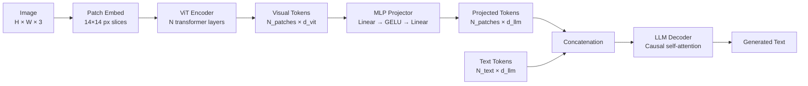

# Vision-Language Models — The ViT-MLP-LLM Pattern

## Learning Objectives

- State the three components of the ViT-MLP-LLM pattern and the role each plays in converting pixels to generated text
- Trace dimension transformations through patch embedding, ViT encoding, MLP projection, and LLM decoding
- Implement a forward pass through each component and verify output shapes at every stage
- Compare Qwen2-VL, InternVL2.5, LLaVA-NeXT, and Pixtral on projector type, resolution strategy, and alignment recipe
- Deploy a VLM as an enrichment step in a GTM data pipeline and measure Cross-Modal Error Rate on structured extraction

## The Problem

CLIP gives you a shared embedding space for images and text. That shared space is enough for zero-shot classification ("is this a cat or a dog?") and for retrieval ("find images matching this caption"). It is not enough for generation. CLIP has no decoder, no causal language modeling head, no ability to produce tokens sequentially. You cannot ask CLIP "how many people are in this image?" or "extract the company name from this screenshot." CLIP scores similarity; it does not answer questions.

A vision-language model bridges that gap. It takes an image and a text prompt, then generates a text response. The dominant pattern—used by LLaVA, Qwen2-VL, InternVL, Pixtral, and every other production open-weight VLM—bolts a pretrained vision encoder to a pretrained language model through a learned projection layer. The vision encoder converts pixels into a sequence of token vectors. The projection layer maps those vectors from the vision encoder's dimension space into the language model's embedding dimension. The language model then does what language models do: it attends to the combined sequence of projected visual tokens and text tokens, and generates output one token at a time.

The architecture matters because every VLM failure mode traces back to one of the three components. If the model miscounts objects, the vision encoder may not have sufficient resolution. If the model produces text that contradicts the image, the projection layer may not be aligning visual and textual features well enough. If the model generates fluent but incorrect descriptions, the language model is hallucinating beyond the visual evidence. You cannot debug a VLM pipeline if you cannot name the stage where the failure originates.

## The Concept

The ViT-MLP-LLM pattern has three stages. First, a Vision Transformer (ViT) processes the image. The ViT slices the input into fixed-size patches—typically 14×14 or 16×16 pixels—linearly projects each patch into an embedding vector, adds positional information, and runs the resulting sequence through a stack of transformer encoder layers. The output is a sequence of visual token vectors with dimension `d_vit` (e.g., 1024 for ViT-Large, 1152 for SigLIP-SO400M). This sequence length depends on image resolution: a 224×224 image with 14×14 patches produces 256 tokens; a 448×448 image produces 1024 tokens.

Second, an MLP projector maps the visual tokens from `d_vit` dimensions to `d_llm` dimensions—the embedding dimension of the target language model. This projector is typically a two-layer MLP with a GELU activation. In the original LLaVA training recipe, the ViT and LLM weights are frozen and only the projector is trained during the initial alignment phase. The projector's job is narrow: learn a mapping from the vision encoder's representation space into the language model's token embedding space so that the LLM's attention mechanism can treat visual tokens as if they were just another part of the input sequence.

Third, the language model receives the projected visual tokens concatenated with text tokens. The concatenation is straightforward—visual tokens go first (or are interleaved at the positions of `<image>` placeholders in the text), text tokens follow, and the LLM runs standard causal self-attention over the combined sequence. The LLM has no vision-specific mechanism. It does not know which tokens came from an image and which came from text. It just attends to all tokens and predicts the next one.

The critical engineering decision in this pattern is the projector. A linear projector (single matrix multiplication) works but underfits—visual information is compressed too aggressively. A two-layer MLP with GELU adds enough capacity to learn a nonlinear mapping without introducing significant training cost. Deeper projectors (3+ layers) appear in some models but show diminishing returns relative to training data quality. The projector is also where resolution strategies diverge: Qwen2-VL uses dynamic resolution that adjusts the number of visual tokens based on image aspect ratio and size, while LLaVA-NeXT uses a grid-based approach that tiles the image into sub-images and processes each independently.

A second pattern, called DeepStack (used in InternVL), addresses a limitation of the basic ViT-MLP-LLM pipeline. In the standard approach, only the final layer of Vi