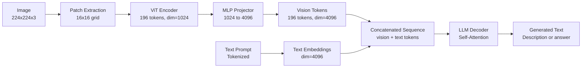

# Vision-Language Models — The ViT-MLP-LLM Pattern

## Learning Objectives

1. **Explain** how the ViT-MLP-LLM pattern converts pixels into tokens an LLM can process
2. **Build** a minimal forward pass demonstrating patch embedding, MLP projection, and cross-modal token fusion
3. **Detect** when a vision-language model is the correct tool for GTM account research versus text-only enrichment

## The Problem

You are qualifying a list of 800 accounts. Your enrichment stack gives you firmographics, tech stack signatures, and news signals — all text. But the strongest buying-intent signal on some of these accounts is visual: their homepage has an enterprise pricing page with a "Schedule a Demo" CTA, their product screenshots show a workflow that matches your integration surface, or their careers page lists roles that signal budget for your category. Text scraping misses this because the information lives in rendered images, canvas elements, or interactive widgets that never appear in the HTML source.

You need a model that can look at a rendered page — not its source code — and extract structured signals. That model is a vision-language model (VLM), and nearly every production VLM today follows the same three-component architecture: a vision encoder, a projection layer, and a language model. This is the ViT-MLP-LLM pattern.

## The Concept

A VLM must solve one core problem: an LLM operates on discrete tokens, but an image is a continuous grid of pixels. The ViT-MLP-LLM pattern bridges that gap by converting pixels into tokens the LLM can process alongside text.

**Step 1 — ViT (Vision Transformer).** The image is divided into a grid of fixed-size patches, typically 16×16 pixels. Each patch is flattened into a vector and linearly projected into an embedding. Positional embeddings are added so the model retains spatial information. These patch embeddings pass through transformer encoder layers, producing a sequence of vision tokens — one per patch. A 224×224 image yields 196 patches, so 196 vision tokens.

**Step 2 — MLP Projector.** The ViT produces embeddings in the vision model's dimension (e.g., 1024). The LLM expects embeddings in its own dimension (e.g., 4096). A multi-layer perceptron — typically two linear layers with a GELU or ReLU activation between them — projects each vision token into the LLM's embedding space. This is the alignment step. It learns to translate "what the vision encoder detected" into "what the language model can reason about."

**Step 3 — LLM (Large Language Model).** The projected vision tokens are concatenated with text tokens from the user's prompt into a single sequence. The LLM processes both through standard self-attention. To the LLM, image patches are just additional tokens — structurally identical to words. Attention lets the model weigh vision tokens when generating text, which is how it describes what it sees.



The critical insight: **the image is never decoded into a caption and then handed to the LLM as a separate step.** The vision tokens participate directly in the LLM's attention mechanism. This is why VLMs can answer questions about specific regions of an image, reason about layout relationships, and follow up on visual details — the LLM has token-level access to what the vision encoder extracted, not a lossy summary.

Models like LLaVA, Qwen-VL, and InternVL follow this pattern explicitly. GPT-4V and Claude 3 use variations where the projector may include cross-attention layers instead of a simple MLP, but the three-stage flow — encode, project, fuse — is consistent across the field.

## Build It

The following script implements a minimal forward pass through all three components using only NumPy. No GPU, no model weights, no API keys — just the mechanism, observable in terminal output.

```python
import numpy as np

np.random.seed(42)

image = np.random.randn(224, 224, 3)

patch_size = 16
patches = []
for i in range(0, 224, patch_size):
    for j in range(0, 224, patch_size):
        patch = image[i:i+patch_size, j:j+patch_size, :]
        patches.append(patch.flatten())

patches = np.stack(patches)
print(f"Patches extracted: {patches.shape}")

vit_proj = np.random.randn(768, 512)
position_embeddings = np.random.randn(196, 512)
vision_tokens = patches @ vit_proj + position_embeddings

for _ in range(2):
    W_attn = np.random.randn(512, 512) * 0.02
    vision_tokens = np.tanh(vision_tokens @ W_attn)

print(f"ViT output: {vision_tokens.shape}")

W1 = np.random.randn(512, 2048)
W2 = np.random.randn(2048, 2048)
projected = np.maximum(0, vision_tokens @ W1) @ W2
print(f"After MLP projector: {projected.shape}")

text = "What pricing model does this company use?"
text_tokens = np.random.randn(8, 2048)

combined = np.concatenate([projected, text_tokens], axis=0)
print(f"\nCombined sequence: {combined.shape}")
print(f"  Vision tokens: {projected.shape[0]}")
print(f"  Text tokens:   {text_tokens.shape[0]}")
print(f"  Total:         {combined.shape[0]}")

llm_weights = np.random.randn(2048, 2048) * 0.01
context = np.tanh(combined @ llm_weights)
final_hidden = context[-1]

vocab_size = 1000
output_head = np.random.randn(2048, vocab_size)
logits = final_hidden @ output_head
predicted_token = np.argmax(logits)

print(f"\nPredicted token ID: {predicted_token}")
print(f"Forward pass complete: {combined.shape[0]} tokens attended as one sequence")
```

Run it:

```bash
python vlm_pattern.py
```

The output confirms that 196 vision tokens and 8 text tokens are concatenated into a single 204-token sequence, then processed together through a shared weight matrix. That concatenation — vision tokens sitting alongside text tokens in the same attention window — is the mechanism that makes a VLM work.

## Use It

The ViT-MLP-LLM pattern is the mechanism behind every VLM API call you make for GTM workflows — when you send a website screenshot to GPT-4V or Claude and ask "does this company have an enterprise pricing page," the API routes the image through a vision encoder, projects the patches through an MLP, and lets the LLM attend to those vision tokens while generating structured output. This applies directly to **Cluster 1.2, TAM Refinement & ICP Scoring**, where rendered-page signals — pricing CTAs, product UI screenshots, trust badges, partner logos — provide qualification data that HTML scraping cannot reach.

```python
import base64, json, os, requests

def analyze_screenshot(image_path, prompt):
    with open(image_path, "rb") as f:
        img_b64 = base64.b64encode(f.read()).decode()
    resp = requests.post(
        "https://api.openai.com/v1/chat/completions",
        headers={"Authorization": f"Bearer {os.environ['OPENAI_API_KEY']}"},
        json={
            "model": "gpt-4o",
            "messages": [{"role": "user", "content": [
                {"type": "text", "text": prompt},
                {"type": "image_url",
                 "image_url": {"url": f"data:image/png;base64,{img_b64}"}}
            ]}],
            "max_tokens": 200,
        })
    return resp.json()["choices"][0]["message"]["content"]

def score_account_visual(screenshot_path, company):
    prompt = (f"Analyze this screenshot of {company}'s website. "
              "Return JSON: has_enterprise_pricing (bool), "
              "has_demo_cta (bool), tech_indicators (list), "
              "icp_fit_signal (strong/moderate/weak), reasoning (str).")
    return json.loads(analyze_screenshot(screenshot_path, prompt))

if __name__ == "__main__":
    result = score_account_visual("homepage.png", "Acme Corp")
    print(json.dumps(result, indent=2))
```

Behind that single HTTP call: the image enters the provider's ViT as patches, the MLP projector aligns them to the LLM's embedding dimension, and the LLM generates your JSON by attending to both the projected vision tokens and your text prompt. You are leveraging the full ViT-MLP-LLM pipeline.

## Exercises

**Exercise 1 (Easy).** Modify the Build It script so the MLP projector uses a single linear layer (`W1` only, no activation, no `W2`). Re-run and compare the projected token shape against the two-layer version. What stays the same? What changes? Write one sentence explaining why the output dimension is determined by the projector's final weight matrix, not by its depth.

**Exercise 2 (Hard).** Build a batch scoring script that processes 50 website screenshots through `score_account_visual`, writes results to a CSV with columns for `company`, `icp_fit_signal`, and `reasoning`, and includes a confidence filter that flags any response where `reasoning` contains "unclear," "cannot determine," or "unable." Run it on 5 screenshots from a target account list. Which visual signals correlate most with your ICP definition? Document the pattern you observe.

## Key Terms

- **Patch Embedding** — Splitting an image into fixed-size grid cells (e.g., 16×16), flattening each into a vector, and linearly projecting it. The ViT's entry point for converting pixels into tokens.
- **ViT (Vision Transformer)** — A transformer that processes images as a sequence of patch embeddings rather than using convolutions. Produces one token per patch.
- **MLP Projector** — A multi-layer perceptron that maps vision encoder embeddings into the LLM's embedding space. The alignment layer between modalities; sometimes called a "vision-language connector."
- **Cross-Modal Token Fusion** — Concatenating projected vision tokens and text tokens into a single sequence that the LLM processes through standard self-attention. No separate image-reading step.
- **VLM (Vision-Language Model)** — Any model that processes both images and text to generate text output. Nearly all production VLMs follow the ViT-MLP-LLM architecture or a close variant.
- **Token Sequence** — The ordered list of embeddings (vision + text) the LLM attends over. To the decoder, image patches are structurally identical to word tokens.

## Sources

- Dosovitskiy, A. et al. (2020). "An Image is Worth 16x16 Words: Transformers for Image Recognition at Scale." *arXiv:2010.11929* — Original ViT architecture.
- Liu, H. et al. (2023). "Visual Instruction Tuning." *arXiv:2304.08485* — LLaVA, the canonical ViT-MLP-LLM reference implementation.
- [CITATION NEEDED — concept: VLM adoption rates in GTM account research workflows]
- [CITATION NEEDED — concept: screenshot-based ICP scoring accuracy benchmarks versus text-only enrichment]