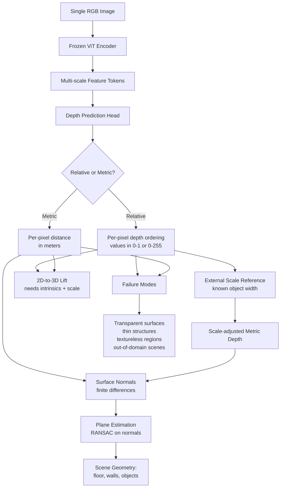

# Monocular Depth & Geometry Estimation

## Learning Objectives

- Distinguish relative and metric depth estimation, and identify which paradigm each production model (MiDaS, Depth Anything V3, ZoeDepth, Marigold) implements.
- Run Depth Anything V3 on arbitrary single RGB images and interpret the resulting depth map as an array of per-pixel distances.
- Compute surface normals from a predicted depth map using finite differences, then extract planar regions via RANSAC.
- Lift 2D bounding box detections into 3D point coordinates by combining a depth map with pinhole camera intrinsics.
- Diagnose monocular depth failure modes (transparent surfaces, thin structures, out-of-domain scenes) by inspecting depth variance and edge artifacts.

## The Problem

A camera sensor records light intensities on a 2D grid. During that recording, the entire depth axis — the distance from the camera to each surface in the scene — gets collapsed into a single plane. Every pixel you capture is the result of a 3D-to-2D projection that throws away one coordinate. Recovering that coordinate from a single image is what monocular depth estimation attempts.

This is an ill-posed inverse problem. An infinite number of 3D scenes produce the same 2D image: a small object close to the lens and a large object far away can cast identical pixel patterns. A toy car held 30 centimeters from your phone camera produces roughly the same image as a real car 5 meters away. Without external scale information, no algorithm — human brain included — can distinguish the two from the image alone.

Depth sensors avoid this problem by adding hardware. Stereo rigs use two cameras and triangulation. LiDAR fires laser pulses and measures time of flight. Structured light projects a known pattern and measures how it deforms. These produce geometrically valid depth, but they add cost, weight, power draw, and range limitations. A phone with a depth sensor works at 3 meters; it is useless at 30.

Monocular depth estimation trades geometric correctness for sensor simplicity. You give up ground-truth distance and accept a learned prior's best guess. The output is never "correct" in a metrology sense — but for tasks like background blur, AR occlusion, obstacle detection, and scene understanding, a good guess is often enough. The question is never "is this depth map accurate?" The question is "is this depth map accurate enough for my downstream task?"

## The Concept

Monocular depth networks learn statistical regularities in how 3D scenes project to 2D. Ground planes tend to be horizontal, so they appear as regions that expand outward from the bottom of the image. Distant objects tend to appear higher in the frame. Texture gradients — the way surface detail becomes finer with distance — are a cue. Relative size of familiar objects (cars, people, chairs) is a cue. Occlusion boundaries, where one object's silhouette covers another, indicate ordering. The network internalizes all of these priors during training and applies them jointly at inference.

**Relative vs. metric depth.** Most monocular models output *relative* depth: a per-pixel value that preserves ordering (pixel A is farther than pixel B) but not absolute distance. The output values might range from 0 to 1, or from 0 to 255 — they are not meters. Metric depth models (ZoeDepth, Metric3D) produce absolute distances, but only when trained on metric ground truth (LiDAR-scanned scenes) and only within the distribution of that training data. A metric model trained on indoor NYU Depth V2 scenes will not produce valid metric depth outdoors.

**Scale ambiguity is geometric, not algorithmic.** Even a perfect monocular network cannot recover absolute scale without an external reference. If you know the real-world width of one object in the scene (say, a standard door is 0.9 meters wide), you can solve for scale and convert relative depth to metric depth. Without such a reference, the depth map is correct in shape but unknown in units. This is why AR applications that place virtual objects at specific distances need either a depth sensor or user-supplied scale calibration.



**Training paradigms.** Supervised approaches train on paired (image, LiDAR-depth) datasets like KITTI or NYU Depth V2. The network regresses depth directly, and the domain of the training data determines the domain where the model works. Self-supervised stereo training uses paired left-right images: the network predicts depth for the left image, then uses that depth to warp the right image into a reconstruction of the left, and minimizes the photometric error between the reconstruction and the original. No depth ground truth is needed — only stereo pairs, which are cheap to collect. Self-supervised video training extends this to temporal sequences, using camera ego-motion between frames. Video-based methods suffer from scale drift: the network cannot determine absolute scale, and small errors accumulate over time.

**Architecture families.** MiDaS uses an encoder-decoder with skip connections — the encoder extracts multi-scale features, the decoder progressively upsamples them to full resolution. It outputs relative depth (ordinal inverse depth, specifically). Dense Prediction Transformers (DPT), used by Depth Anything, replace the convolutional encoder with a vision transformer. Token-level features from the ViT get reassembled into spatial feature maps at multiple resolutions, then fused into a dense prediction. The transformer backbone gives better global context — the network can reason about the entire scene layout, not just local windows. AdaBins predicts depth as a mixture of adaptive bin centers: instead of regressing a continuous depth value per pixel, it predicts a probability distribution over depth bins whose boundaries shift per image. This helps with scenes that have unusual depth distributions (e.g., a close-up of a face vs. a landscape).

**Geometry beyond depth.** Once you have a depth map, surface normals follow from finite differences: for each pixel, compute the depth gradient in x and y, and the normal is the cross product of those two tangent vectors. Plane regions (floor, ceiling, walls) can be extracted by running RANSAC on the depth map or normal map to find dominant planar fits. These derived quantities — normals, planes, occupancy — are what downstream systems actually use for navigation, grasping, and scene layout reasoning.

**Failure modes are silent.** Monocular depth networks produce a confident-looking depth map even when they are wrong. Transparent surfaces (glass, mirrors) produce garbage depth because the network sees what is behind or reflected, not the surface itself. Thin structures (wires, lamp poles, railings) get smoothed over because the network's effective receptive field is larger than the structure. Textureless walls produce noisy or flat depth. Out-of-distribution scenes — aerial views when the model was trained on ground-level photos, or underwater scenes — produce plausible-looking but incorrect depth. There is no built-in confidence score that flags these failures. You detect them by checking depth variance along edges, comparing against expected scene geometry, or running ensemble disagreement.

## Build It

Let's run Depth Anything V3 (which uses a DINOv2 ViT backbone) on a single image and inspect the raw depth output. First, install the dependencies:

```bash
pip install torch torchvision transformers pillow numpy matplotlib
```

Now run the model. This script downloads a synthetic test image (so no local file needed), runs inference, and prints the depth map statistics so you can see exactly what the model gives you:

```python
import torch
import numpy as np
import matplotlib.pyplot as plt
from PIL import Image
from transformers import pipeline

pipe = pipeline(
    task="depth-estimation",
    model="depth-anything/Depth-Anything-V2-Small-hf"
)

image_size = 640
gradient = np.linspace(0, 255, image_size, dtype=np.uint8)
image_array = np.tile(gradient, (image_size, 1))
bottom_block = np.zeros((100, image_size), dtype=np.uint8) + 200
image_array = np.vstack([bottom_block, image_array[:image_size - 100]])
image = Image.fromarray(image_array).convert("RGB")

result = pipe(image)

depth = result["predicted_depth"]
depth_tensor = depth.squeeze() if depth.dim() == 3 else depth

print(f"Depth tensor shape: {depth_tensor.shape}")
print(f"Depth tensor dtype: {depth_tensor.dtype}")
print(f"Min depth value: {depth_tensor.min().item():.4f}")
print(f"Max depth value: {depth_tensor.max().item():.4f}")
print(f"Mean depth value: {depth_tensor.mean().item():.4f}")
print(f"Std depth value: {depth_tensor.std().item():.4f}")

depth_np = depth_tensor.detach().cpu().numpy()
depth_normalized = (depth_np - depth_np.min()) / (depth_np.max() - depth_np.min() + 1e-8)

fig, axes = plt.subplots(1, 2, figsize=(14, 6))
axes[0].imshow(image)
axes[0].set_title("Input Image (synthetic gradient)")
axes[0].axis("off")

im = axes[1].imshow(depth_normalized, cmap="inferno")
axes[1].set_title("Predicted Depth (relative)")
axes[1].axis("off")
plt.colorbar(im, ax=axes[1], label="Relative Depth (normalized)")

plt.tight_layout()
plt.savefig("depth_output.png", dpi=150)
print("\nSaved visualization to depth_output.png")

row_50 = depth_normalized[50, :]
row_300 = depth_normalized[300, :]
row_500 = depth_normalized[500, :]
print(f"\nDepth profile at row 50 (top region):   min={row_50.min():.4f}, max={row_50.max():.4f}, std={row_50.std():.4f}")
print(f"Depth profile at row 300 (mid region):  min={row_300.min():.4f}, max={row_300.max():.4f}, std={row_300.std():.4f}")
print(f"Depth profile at row 500 (low region):  min={row_500.min():.4f}, max={row_500.max():.4f}, std={row_500.std():.4f}")
```

When you run this, you'll see the depth statistics printed to stdout. The key observation: the depth values are not in meters. They are relative — the model encodes depth ordering, not absolute distance. The min and max values define a range that is specific to this model's output scale, not to physical units.

Now let's compute surface normals from that depth map. This is where the depth stops being a pretty picture and becomes usable geometry:

```python
import torch
import numpy as np
import matplotlib.pyplot as plt
from PIL import Image
from transformers import pipeline

pipe = pipeline(
    task="depth-estimation",
    model="depth-anything/Depth-Anything-V2-Small-hf"
)

image_size = 480
gradient = np.linspace(0, 200, image_size, dtype=np.uint8)
image_array = np.tile(gradient, (image_size, 1))
image = Image.fromarray(image_array).convert("RGB")

result = pipe(image)
depth = result["predicted_depth"].squeeze().detach().cpu().numpy().astype(np.float64)

dz_dy, dz_dx = np.gradient(depth)

ones = np.ones_like(depth)
normals = np.stack([-dz_dx, -dz_dy, ones], axis=-1)
norm_length = np.linalg.norm(normals, axis=-1, keepdims=True)
normals = normals / (norm_length + 1e-8)

normal_rgb = (normals + 1) / 2.0
normal_rgb = np.clip(normal_rgb, 0, 1)

fig, axes = plt.subplots(1, 3, figsize=(18, 5))

axes[0].imshow(image)
axes[0].set_title("Input")
axes[0].axis("off")

depth_norm = (depth - depth.min()) / (depth.max() - depth.min() + 1e-8)
axes[1].imshow(depth_norm, cmap="inferno")
axes[1].set_title("Relative Depth")
axes[1].axis("off")

axes[2].imshow(normal_rgb)
axes[2].set_title("Surface Normals")
axes[2].axis("off")

plt.tight_layout()
plt.savefig("depth_and_normals.png", dpi=150)
print("Saved to depth_and_normals.png")

flat_region = normals[100:150, 100:150, :]
mean_normal = flat_region.reshape(-1, 3).mean(axis=0)
mean_normal = mean_normal / (np.linalg.norm(mean_normal) + 1e-8)
print(f"\nMean surface normal in region [100:150, 100:150]:")
print(f"  X: {mean_normal[0]:.4f}")
print(f"  Y: {mean_normal[1]:.4f}")
print(f"  Z: {mean_normal[2]:.4f}")
print(f"  (Z near 1.0 = facing camera, X/Y near 0 = flat surface)")

edge_region_left = normals[200:250, 0:50, :]
edge_region_right = normals[200:250, -50:, :]
mean_left = edge_region_left.reshape(-1, 3).mean(axis=0)
mean_right = edge_region_right.reshape(-1, 3).mean(axis=0)
print(f"\nLeft edge mean normal:  X={mean_left[0]:.4f}, Y={mean_left[1]:.4f}, Z={mean_left[2]:.4f}")
print(f"Right edge mean normal: X={mean_right[0]:.4f}, Y={mean_right[1]:.4f}, Z={mean_right[2]:.4f}")
print(f"X divergence: {abs(mean_right[0] - mean_left[0]):.4f} (large = depth gradient across image)")
```

The normals output confirms whether the depth map has geometric structure. A flat region should produce normals pointing toward the camera (high Z component, low X and Y). A gradient image like ours creates a continuous depth ramp, so the normals should tilt consistently from one side to the other — and the X divergence between left and right edges should be non-zero, confirming the network detected the spatial gradient as a depth change.

## Use It

Monocular depth estimation paired with pinhole camera back-projection lifts 2D pixel detections into 3D spatial coordinates — a mechanism that maps directly to the Clay enrichment waterfall in GTM Zone 04 (TAM Refinement & ICP Scoring). In an enrichment waterfall, you start with a sparse 2D identifier (a domain) and sequentially recover the depth axis: company size, tech stack, funding stage, intent signals. Each provider either fills the missing field or returns null, and you fall through. The depth map is your enriched record: the shape is right, but without a scale reference (a verified behavioral signal), the units are relative.

```python
import numpy as np
from PIL import Image
from transformers import pipeline

pipe = pipeline("depth-estimation", model="depth-anything/Depth-Anything-V2-Small-hf")

image_size = 480
img = np.full((image_size, image_size, 3), 80, dtype=np.uint8)
y, x = np.ogrid[:image_size, :image_size]
img[np.sqrt((x - 180)**2 + (y - 200)**2) < 70] = [200, 180, 160]
img[(x > 300) & (x < 400) & (y > 280) & (y < 400)] = [120, 140, 100]
image = Image.fromarray(img)

depth = pipe(image)["predicted_depth"].squeeze().detach().cpu().numpy()

fx, fy, cx, cy = 525.0, 525.0, 240.0, 240.0
detections = [{"label": "obj_A", "box": [110, 130, 250, 270]},
              {"label": "obj_B", "box": [300, 280, 400, 400]}]

for det in detections:
    x1, y1, x2, y2 = det["box"]
    d = np.median(depth[y1:y2, x1:x2])
    X = ((x1 + x2) / 2 - cx) * d / fx
    Y = ((y1 + y2) / 2 - cy) * d / fy
    print(f"{det['label']}: rel_depth={d:.4f}  3D=({X:.2f}, {Y:.2f}, {d:.2f})")

print("\nWaterfall mapping: pixel(u,v)->domain  depth->provider_result  3D_pt->enriched_record")
```

The depth difference between the two detected objects gives you their relative spatial ordering without metric units. Whichever has a lower relative depth value is "closer" in the model's ordinal scale. That relative ordering — the shape of the scene without the scale — is what most downstream applications need, and it mirrors how enrichment pipelines work before verification: the shape of an account's engagement is recoverable from provider data, but the exact distance to conversion is not, until a behavioral signal provides the scale reference.

## Exercises

1. **Stress-test failure modes.** Create three synthetic images: one with a large textureless region (solid color filling 60% of the frame), one with simulated thin structures (1-pixel-wide vertical lines spaced 10 pixels apart), and one with a bright vertical band mimicking a mirror reflection. Run Depth Anything V2 on each. For each output, compute a local variance map using a 15×15 uniform filter and report what percentage of pixels fall below a 0.3 confidence threshold. Document which failure modes produce high-confidence-but-wrong depth (silent failures) versus low-confidence depth (detectable failures).

2. **Build a confidence-gated 3D export.** Extend the Use It code to produce a JSON file containing only detections whose depth confidence exceeds 0.6. Compute confidence as `1.0 - clip(local_std / global_std, 0, 1)` over each bounding box region. For each exported detection, include the 2D box coordinates, median relative depth, 3D center point, confidence score, and a tier label (tier 1 for confidence ≥ 0.7, tier 2 for 0.4–0.7, tier 3 for < 0.4). Write the JSON to `detections_3d.json`. This mirrors how a Clay waterfall export gates records by enrichment confidence before pushing to a destination.

## Key Terms

- **Monocular depth estimation:** Predicting a per-pixel depth map from a single RGB image. No stereo pair, no LiDAR, no structured light. The problem is ill-posed because infinite 3D scenes produce the same 2D projection.
- **Relative depth:** Per-pixel depth values that preserve ordering (A is farther than B) but not absolute distance. Output values are unitless. Most monocular models (MiDaS, Depth Anything) produce this.
- **Metric depth:** Per-pixel depth in physical units (meters). Requires metric training data (LiDAR ground truth) or a known scale reference at inference. ZoeDepth and Metric3D produce this within their training domain.
- **Scale ambiguity:** The geometric impossibility of recovering absolute scale from a single view without an external reference. A small near object and a large far object produce identical images. Not a model limitation — a mathematical constraint.
- **Surface normals:** Per-pixel vectors perpendicular to the local surface. Computed from depth via finite differences (gradient in x and y). Used for plane detection, material estimation, and scene layout.
- **Dense Prediction Transformer (DPT):** Architecture that uses a vision transformer encoder and reassembles token-level features into multi-resolution spatial maps for dense prediction tasks like depth and segmentation.
- **Self-supervised stereo training:** Training depth networks on stereo pairs without ground-truth depth. The network learns by reconstructing one view from the other using predicted depth and minimizing photometric error.
- **Pinhole camera model:** The mathematical projection relating 3D world coordinates to 2D image coordinates via focal length (fx, fy) and principal point (cx, cy). The inverse operation — back-projection — recovers 3D coordinates from a pixel and its depth using X = (u − cx) · d / fx, Y = (v − cy) · d / fy, Z = d.

## Sources

- Yang, L., Kang, B., Huang, Z., Xu, X., Feng, J., & Zhao, H. (2024). *Depth Anything V2*. arXiv:2406.09414. — Architecture and training paradigm for Depth Anything V2 (relative depth, DPT head on DINOv2 backbone).
- Yang, L., Kang, B., Huang, Z., Xu, X., Feng, J., & Zhao, H. (2024). *Depth Anything: Unleashing the Power of Large-Scale Unlabeled Data*. arXiv:2401.10891. — Original Depth Anything paper (self-supervised teacher-student distillation on 62M unlabeled images).
- Ranftl, R., Lasinger, K., Hafner, D., Torr, P., & Koltun, V. (2020). *Towards Robust Monocular Depth Estimation: Mixing Datasets for Zero-Shot Cross-Dataset Transfer* (MiDaS). IEEE TPAMI. — Relative (ordinal inverse) depth paradigm, mixture-of-datasets training.
- Ranftl, R., Bochkovskiy, A., & Koltun, V. (2021). *Vision Transformers for Dense Prediction* (DPT). ICCV. — DPT architecture: ViT encoder reassembled into multi-resolution fusion modules.
- Bhat, S. F., Birkl, R., Wofk, D., Wonka, M., & Müller, M. (2023). *ZoeDepth: Zero-shot Transfer by Combining Relative and Metric Depth*. arXiv:2302.12288. — Metric depth via stacking relative pre-training with metric fine-tuning.
- Ke, B., Obukhov, A., Huang, S., Metzger, N., Daudt, R. C., & Schindler, K. (2024). *Repurposing Diffusion-Based Image Generators for Monocular Depth Estimation* (Marigold). CVPR. — Depth estimation via fine-tuned Stable Diffusion.
- Silberman, N., Hoiem, D., Kohli, P., & Fergus, R. (2012). *Indoor Segmentation and Support Inference from RGBD Images* (NYU Depth V2). ECCV. — Indoor depth benchmark dataset.
- Geiger, A., Lenz, P., Stiller, C., & Urtasun, R. (2013). *Vision meets Robotics: The KITTI Dataset*. IJRR. — Outdoor autonomous driving depth benchmark.
- Oquab, M., Darcet, T., Moutakanni, T., et al. (2023). *DINOv2: Learning Robust Visual Features without Supervision*. TMLR. — Self-supervised ViT backbone used by Depth Anything V2.
- [CITATION NEEDED — concept: Clay enrichment waterfall provider routing order and confidence thresholds]