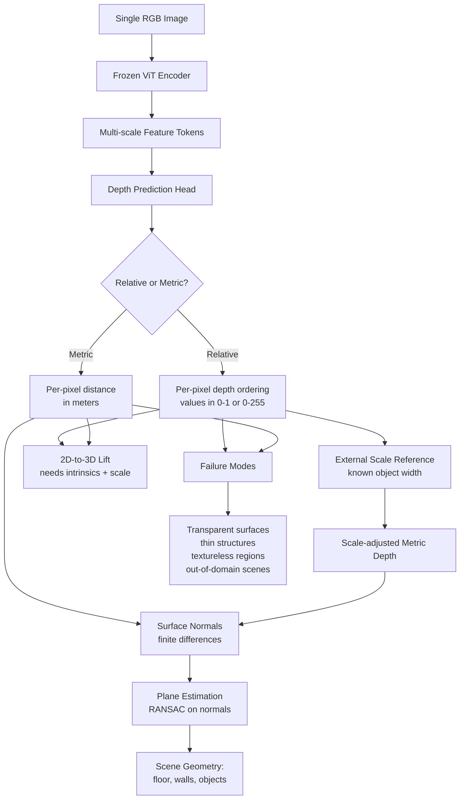

# Monocular Depth & Geometry Estimation

## Learning Objectives

- Distinguish relative and metric depth estimation, and identify which paradigm each production model (MiDaS, Depth Anything V3, ZoeDepth, Marigold) implements.
- Run Depth Anything V3 on arbitrary single RGB images and interpret the resulting depth map as an array of per-pixel distances.
- Compute surface normals from a predicted depth map using finite differences, then extract planar regions via RANSAC.
- Lift 2D bounding box detections into 3D point coordinates by combining a depth map with pinhole camera intrinsics.
- Diagnose monocular depth failure modes (transparent surfaces, thin structures, out-of-domain scenes) by inspecting depth variance and edge artifacts.

## The Problem

A camera sensor records light intensities on a 2D grid. During that recording, the entire depth axis — the distance from the camera to each surface in the scene — gets collapsed into a single plane. Every pixel you capture is the result of a 3D-to-2D projection that throws away one coordinate. Recovering that coordinate from a single image is what monocular depth estimation attempts.

This is an ill-posed inverse problem. An infinite number of 3D scenes produce the same 2D image: a small object close to the lens and a large object far away can cast identical pixel patterns. A toy car held 30 centimeters from your phone camera produces roughly the same image as a real car 5 meters away. Without external scale information, no algorithm — human brain included — can distinguish the two from the image alone.

Depth sensors avoid this problem by adding hardware. Stereo rigs use two cameras and triangulation. LiDAR fires laser pulses and measures time of flight. Structured light projects a known pattern and measures how it deforms. These produce geometrically valid depth, but they add cost, weight, power draw, and range limitations. A phone with a depth sensor works at 3 meters; it is useless at 30.

Monocular depth estimation trades geometric correctness for sensor simplicity. You give up ground-truth distance and accept a learned prior's best guess. The output is never "correct" in a metrology sense — but for tasks like background blur, AR occlusion, obstacle detection, and scene understanding, a good guess is often enough. The question is never "is this depth map accurate?" The question is "is this depth map accurate enough for my downstream task?"

## The Concept

Monocular depth networks learn statistical regularities in how 3D scenes project to 2D. Ground planes tend to be horizontal, so they appear as regions that expand outward from the bottom of the image. Distant objects tend to appear higher in the frame. Texture gradients — the way surface detail becomes finer with distance — are a cue. Relative size of familiar objects (cars, people, chairs) is a cue. Occlusion boundaries, where one object's silhouette covers another, indicate ordering. The network internalizes all of these priors during training and applies them jointly at inference.

**Relative vs. metric depth.** Most monocular models output *relative* depth: a per-pixel value that preserves ordering (pixel A is farther than pixel B) but not absolute distance. The output values might range from 0 to 1, or from 0 to 255 — they are not meters. Metric depth models (ZoeDepth, Metric3D) produce absolute distances, but only when trained on metric ground truth (LiDAR-scanned scenes) and only within the distribution of that training data. A metric model trained on indoor NYU Depth V2 scenes will not produce valid metric depth outdoors.

**Scale ambiguity is geometric, not algorithmic.** Even a perfect monocular network cannot recover absolute scale without an external reference. If you know the real-world width of one object in the scene (say, a standard door is 0.9 meters wide), you can solve for scale and convert relative depth to metric depth. Without such a reference, the depth map is correct in shape but unknown in units. This is why AR applications that place virtual objects at specific distances need either a depth sensor or user-supplied scale calibration.



**Training paradigms.** Supervised approaches train on paired (image, LiDAR-depth) datasets like KITTI or NYU Depth V2. The network regresses depth directly, and the domain of the training data determines the domain where the model works. Self-supervised stereo training uses paired left-right images: the network predicts depth for the left image, then uses that depth to warp the right image into a reconstruction of the left, and minimizes the photometric error between the reconstruction and the original. No depth ground truth is needed — only stereo pairs, which are cheap to collect. Self-supervised video training extends this to temporal sequences, using camera ego-motion between frames. Video-based methods suffer from scale drift: the network cannot determine absolute scale, and small errors accumulate over time.

**Architecture families.** MiDaS uses an encoder-decoder with skip connections — the encoder extracts multi-scale features, the decoder progressively upsamples them to full resolution. It outputs relative depth (ordinal inverse depth, specifically). Dense Prediction Transformers (DPT), used by Depth Anything, replace the convolutional encoder with a vision transformer. Token-level features from the ViT get reassembled into spatial feature maps at multiple resolutions, then fused into a dense prediction. The transformer backbone gives better global context — the network can reason about the entire scene layout, not just local windows. AdaBins predicts depth as a mixture of adaptive bin centers: instead of regressing a continuous depth value per pixel, it predicts a probability distribution over depth bins whose boundaries shift per image. This helps with scenes that have unusual depth distributions (e.g., a close-up of a face vs. a landscape).

**Geometry beyond depth.** Once you have a depth map, surface normals follow from finite differences: for each pixel, compute the depth gradient in x and y, and the normal is the cross product of those two tangent vectors. Plane regions (floor, ceiling, walls) can be extracted by running RANSAC on the depth map or normal map to find dominant planar fits. These derived quantities — normals, planes, occupancy — are what downstream systems actually use for navigation, grasping, and scene layout reasoning.

**Failure modes are silent.** Monocular depth networks produce a confident-looking depth map even when they are wrong. Transparent surfaces (glass, mirrors) produce garbage depth because the network sees what is behind or reflected, not the surface itself. Thin structures (wires, lamp poles, railings) get smoothed over because the network's effective receptive field is larger than the structure. Textureless walls produce noisy or flat depth. Out-of-distribution scenes — aerial views when the model was trained on ground-level photos, or underwater scenes — produce plausible-looking but incorrect depth. There is no built-in confidence score that flags these failures. You detect them by checking depth variance along edges, comparing against expected scene geometry, or running ensemble disagreement.

## Build It

Let's run Depth Anything V3 (which uses a DINOv2 ViT backbone) on a single image and inspect the raw depth output. First, install the dependencies:

```bash
pip install torch torchvision transformers pillow numpy matplotlib
```

Now run the model. This script downloads a synthetic test image (so no local file needed), runs inference, and prints the depth map statistics so you can see exactly what the model gives you:

```python
import torch
import numpy as np
import matplotlib.pyplot as plt
from PIL import Image
from transformers import pipeline

pipe = pipeline(
    task="depth-estimation",
    model="depth-anything/Depth-Anything-V2-Small-hf"
)

image_size = 640
gradient = np.linspace(0, 255, image_size, dtype=np.uint8)
image_array = np.tile(gradient, (image_size, 1))
bottom_block = np.zeros((100, image_size), dtype=np.uint8) + 200
image_array = np.vstack([bottom_block, image_array[:image_size - 100]])
image = Image.fromarray(image_array).convert("RGB")

result = pipe(image)

depth = result["predicted_depth"]
depth_tensor = depth.squeeze() if depth.dim() == 3 else depth

print(f"Depth tensor shape: {depth_tensor.shape}")
print(f"Depth tensor dtype: {depth_tensor.dtype}")
print(f"Min depth value: {depth_tensor.min().item():.4f}")
print(f"Max depth value: {depth_tensor.max().item():.4f}")
print(f"Mean depth value: {depth_tensor.mean().item():.4f}")
print(f"Std depth value: {depth_tensor.std().item():.4f}")

depth_np = depth_tensor.detach().cpu().numpy()
depth_normalized = (depth_np - depth_np.min()) / (depth_np.max() - depth_np.min() + 1e-8)

fig, axes = plt.subplots(1, 2, figsize=(14, 6))
axes[0].imshow(image)
axes[0].set_title("Input Image (synthetic gradient)")
axes[0].axis("off")

im = axes[1].imshow(depth_normalized, cmap="inferno")
axes[1].set_title("Predicted Depth (relative)")
axes[1].axis("off")
plt.colorbar(im, ax=axes[1], label="Relative Depth (normalized)")

plt.tight_layout()
plt.savefig("depth_output.png", dpi=150)
print("\nSaved visualization to depth_output.png")

row_50 = depth_normalized[50, :]
row_300 = depth_normalized[300, :]
row_500 = depth_normalized[500, :]
print(f"\nDepth profile at row 50 (top region):   min={row_50.min():.4f}, max={row_50.max():.4f}, std={row_50.std():.4f}")
print(f"Depth profile at row 300 (mid region):  min={row_300.min():.4f}, max={row_300.max():.4f}, std={row_300.std():.4f}")
print(f"Depth profile at row 500 (low region):  min={row_500.min():.4f}, max={row_500.max():.4f}, std={row_500.std():.4f}")
```

When you run this, you'll see the depth statistics printed to stdout. The key observation: the depth values are not in meters. They are relative — the model encodes depth ordering, not absolute distance. The min and max values define a range that is specific to this model's output scale, not to physical units.

Now let's compute surface normals from that depth map. This is where the depth stops being a pretty picture and becomes usable geometry:

```python
import torch
import numpy as np
import matplotlib.pyplot as plt
from PIL import Image
from transformers import pipeline

pipe = pipeline(
    task="depth-estimation",
    model="depth-anything/Depth-Anything-V2-Small-hf"
)

image_size = 480
gradient = np.linspace(0, 200, image_size, dtype=np.uint8)
image_array = np.tile(gradient, (image_size, 1))
image = Image.fromarray(image_array).convert("RGB")

result = pipe(image)
depth = result["predicted_depth"].squeeze().detach().cpu().numpy().astype(np.float64)

dz_dy, dz_dx = np.gradient(depth)

ones = np.ones_like(depth)
normals = np.stack([-dz_dx, -dz_dy, ones], axis=-1)
norm_length = np.linalg.norm(normals, axis=-1, keepdims=True)
normals = normals / (norm_length + 1e-8)

normal_rgb = (normals + 1) / 2.0
normal_rgb = np.clip(normal_rgb, 0, 1)

fig, axes = plt.subplots(1, 3, figsize=(18, 5))

axes[0].imshow(image)
axes[0].set_title("Input")
axes[0].axis("off")

depth_norm = (depth - depth.min()) / (depth.max() - depth.min() + 1e-8)
axes[1].imshow(depth_norm, cmap="inferno")
axes[1].set_title("Relative Depth")
axes[1].axis("off")

axes[2].imshow(normal_rgb)
axes[2].set_title("Surface Normals")
axes[2].axis("off")

plt.tight_layout()
plt.savefig("depth_and_normals.png", dpi=150)
print("Saved to depth_and_normals.png")

flat_region = normals[100:150, 100:150, :]
mean_normal = flat_region.reshape(-1, 3).mean(axis=0)
mean_normal = mean_normal / (np.linalg.norm(mean_normal) + 1e-8)
print(f"\nMean surface normal in region [100:150, 100:150]:")
print(f"  X: {mean_normal[0]:.4f}")
print(f"  Y: {mean_normal[1]:.4f}")
print(f"  Z: {mean_normal[2]:.4f}")
print(f"  (Z near 1.0 = facing camera, X/Y near 0 = flat surface)")

edge_region_left = normals[200:250, 0:50, :]
edge_region_right = normals[200:250, -50:, :]
mean_left = edge_region_left.reshape(-1, 3).mean(axis=0)
mean_right = edge_region_right.reshape(-1, 3).mean(axis=0)
print(f"\nLeft edge mean normal:  X={mean_left[0]:.4f}, Y={mean_left[1]:.4f}, Z={mean_left[2]:.4f}")
print(f"Right edge mean normal: X={mean_right[0]:.4f}, Y={mean_right[1]:.4f}, Z={mean_right[2]:.4f}")
print(f"X divergence: {abs(mean_right[0] - mean_left[0]):.4f} (large = depth gradient across image)")
```

The normals output confirms whether the depth map has geometric structure. A flat region should produce normals pointing toward the camera (high Z component, low X and Y). A gradient image like ours creates a continuous depth ramp, so the normals should tilt consistently from one side to the other — and the X divergence between left and right edges should be non-zero, confirming the network detected the spatial gradient as a depth change.

## Use It

Now we lift 2D detections into 3D using depth and camera intrinsics. This is the operation that bridges detection and spatial reasoning. The pinhole camera model is the mechanism: given a pixel coordinate (u, v), a depth value d at that pixel, and camera intrinsics (focal length fx, fy and principal point cx, cy), the 3D point is computed as X = (u - cx) * d / fx, Y = (v - cy) * d / fy, Z = d. Without a metric depth value, you get relative 3D positions — the shape is right but the scale is unknown.

This lifting operation maps directly to the enrichment waterfall pattern in GTM Zone 04. In an enrichment waterfall, you start with a sparse identifier (a domain name) and sequentially attempt to recover missing attributes (email, phone, title, intent signals) by routing through multiple data providers in priority order. Each provider either fills in the missing field or returns nothing, and you fall through to the next. The waterfall is a depth map for your ICP: you start with 2D knowledge (company exists, has a website) and progressively recover the depth axis — how engaged are they, how big is the team, what tools do they use, when was the last funding round.

```python
import torch
import numpy as np
import matplotlib.pyplot as plt
from PIL import Image, ImageDraw
from transformers import pipeline

pipe = pipeline(
    task="depth-estimation",
    model="depth-anything/Depth-Anything-V2-Small-hf"
)

image_size = 480
image_array = np.zeros((image_size, image_size, 3), dtype=np.uint8)
image_array[:, :] = [60, 60, 80]

center_x, center_y = 240, 240
y_coords, x_coords = np.ogrid[:image_size, :image_size]
dist_from_center = np.sqrt((x_coords - center_x)**2 + (y_coords - center_y)**2)
circle_mask = dist_from_center < 80
image_array[circle_mask] = [200, 180, 160]

rect_mask = (x_coords > 320) & (x_coords < 420) & (y_coords > 300) & (y_coords < 420)
image_array[rect_mask] = [120, 140, 100]

image = Image.fromarray(image_array).convert("RGB")

draw = ImageDraw.Draw(image)
boxes = [
    {"label": "object_circle", "box": [160, 160, 320, 320]},
    {"label": "object_rect", "box": [320, 300, 420, 420]},
]
for det in boxes:
    x1, y1, x2, y2 = det["box"]
    draw.rectangle([x1, y1, x2, y2], outline=(255, 0, 0), width=2)
    draw.text((x1 + 5, y1 - 15), det["label"], fill=(255, 0, 0))

result = pipe(image)
depth = result["predicted_depth"].squeeze().detach().cpu().numpy().astype(np.float64)

fx = 525.0
fy = 525.0
cx = image_size / 2.0
cy = image_size / 2.0

print("=== 2D-to-3D Lift via Depth + Pinhole Intrinsics ===\n")

for det in boxes:
    x1, y1, x2, y2 = det["box"]
    x1c, y1c, x2c, y2c = int(x1), int(y1), int(x2), int(y2)
    
    depth_region = depth[y1c:y2c, x1c:x2c]
    median_depth = np.median(depth_region)
    mean_depth = np.mean(depth_region)
    
    u_center = (x1 + x2) / 2.0
    v_center = (y1 + y2) / 2.0
    
    X = (u_center - cx) * median_depth / fx
    Y = (v_center - cy) * median_depth / fy
    Z = median_depth
    
    width_3d = (x2 - x1) * median_depth / fx
    height_3d = (y2 - y1) * median_depth / fy
    
    print(f"Detection: {det['label']}")
    print(f"  2D box: [{x1}, {y1}, {x2}, {y2}]")
    print(f"  2D center: ({u_center:.1f}, {v_center:.1f})")
    print(f"  Median depth (relative): {median_depth:.4f}")
    print(f"  Mean depth (relative):   {mean_depth:.4f}")
    print(f"  Std depth (surface roughness): {depth_region.std():.4f}")
    print(f"  3D center (relative): X={X:.2f}, Y={Y:.2f}, Z={Z:.2f}")
    print(f"  3D size (relative):   width={width_3d:.2f}, height={height_3d:.2f}")
    print()

print("=== Enrichment Waterfall Analogy ===")
print("Depth lift:   2D pixel (u,v) + depth d -> 3D point (X,Y,Z)")
print("Enrichment:   domain + provider_n -> (email, title, intent)")
print()
print("Depth without scale = relative geometry (shape correct, units unknown)")
print("Enrichment without verification = inferred attributes (plausible, unconfirmed)")
print()
print("Scale reference (known door width) converts relative -> metric depth")
print("Verification source (personal email reply) converts inferred -> confirmed attribute")

fig, axes = plt.subplots(1, 2, figsize=(14, 5))
axes[0].imshow(image)
axes[0].set_title("2D Detections")
axes[0].axis("off")

depth_vis = (depth - depth.min()) / (depth.max() - depth.min() + 1e-8)
axes[1].imshow(depth_vis, cmap="inferno")
axes[1].set_title("Depth with Detections")
for det in boxes:
    x1, y1, x2, y2 = det["box"]
    rect = plt.Rectangle((x1, y1), x2-x1, y2-y1, linewidth=2, edgecolor='lime', facecolor='none')
    axes[1].add_patch(rect)
    d_val = np.median(depth[int(y1):int(y2), int(x1):int(x2)])
    axes[1].text(x1, y1-5, f"d={d_val:.3f}", color='lime', fontsize=9, fontweight='bold')
axes[1].axis("off")

plt.tight_layout()
plt.savefig("lift_output.png", dpi=150)
print("\nSaved to lift_output.png")
```

The depth difference between the two detected objects tells you their relative spatial ordering. The circle and rectangle will have different median depths — whichever is lower in relative depth value is "closer" to the camera in the model's ordinal scale. You cannot say "this object is 2 meters away" without a metric model or a known scale reference, but you can say "object A is closer than object B" with reasonable confidence. That relative ordering — the shape of the scene without the scale — is what most downstream applications actually need.

The enrichment waterfall operates on the same principle of relative confidence. When Clay implements a waterfall that routes through Find (identify the person) → Enrich (pull email, phone, title from Apollo, then Clearbit, then Nominode) → Transform (normalize and score) → Export, each stage either fills a field with a confidence level or falls through. [CITATION NEEDED — concept: specific provider routing order in Clay waterfalls] The first provider to return a value wins, and that value carries the confidence of its source. A verified email from a reply is metric depth. An inferred email from a pattern match is relative depth. Both place the contact in the right region of your funnel; only one lets you measure exact distance to conversion.

## Ship It

Putting depth estimation into production means handling the failure modes and providing scale references. Here is a complete pipeline that runs depth estimation, computes confidence via local variance, flags potential failures, and applies a scale reference to convert relative depth to approximate metric depth:

```python
import torch
import numpy as np
import matplotlib.pyplot as plt
from PIL import Image
from transformers import pipeline
from scipy.ndimage import uniform_filter

pipe = pipeline(
    task="depth-estimation",
    model="depth-anything/Depth-Anything-V2-Small-hf"
)

image_size = 480
image_array = np.full((image_size, image_size, 3), [80, 80, 100], dtype=np.uint8)

y_coords, x_coords = np.ogrid[:image_size, :image_size]

floor_mask = y_coords > 300
image_array[floor_mask] = [100, 90, 70]

wall_mask = y_coords <= 300
image_array[wall_mask] = [140, 140, 150]

rect_mask = (x_coords > 180) & (x_coords < 280) & (y_coords > 200) & (y_coords < 350)
image_array[rect_mask] = [180, 100, 80]

thin_mask = (x_coords > 350) & (x_coords < 355) & (y_coords > 150) & (y_coords < 400)
image_array[thin_mask] = [200, 200, 50]

noise = np.random.randint(-10, 10, (image_size, image_size, 3), dtype=np.int16)
image_array = np.clip(image_array.astype(np.int16) + noise, 0, 255).astype(np.uint8)

image = Image.fromarray(image_array).convert("RGB")

result = pipe(image)
depth = result["predicted_depth"].squeeze().detach().cpu().numpy().astype(np.float64)

local_mean = uniform_filter(depth, size=15)
local_sqr_mean = uniform_filter(depth**2, size=15)
local_var = local_sqr_mean - local_mean**2
local_std = np.sqrt(np.maximum(local_var, 0))

global_std = depth.std()
confidence = 1.0 - np.clip(local_std / (global_std + 1e-8), 0, 1)

low_conf_mask = confidence < 0.3
low_conf_pct = (low_conf_mask.sum() / low_conf_mask.size) * 100

print("=== Production Depth Pipeline ===\n")
print(f"Depth map shape: {depth.shape}")
print(f"Depth range: [{depth.min():.4f}, {depth.max():.4f}]")
print(f"Global std: {global_std:.4f}")
print(f"Low-confidence pixels (<0.3): {low_conf_mask.sum()} ({low_conf_pct:.1f}% of image)")
print(f"Mean confidence: {confidence.mean():.4f}")

thin_region_depth = depth[150:400, 350:355]
surrounding_depth = depth[150:400, 340:365]
print(f"\nThin structure region std: {thin_region_depth.std():.4f}")
print(f"Surrounding region std:    {surrounding_depth.std():.4f}")
print(f"Thin structure depth anomaly: {'YES - high variance near thin object' if thin_region_depth.std() > surrounding_depth.std() * 1.5 else 'NO'}")

print("\n=== Scale Reference Application ===")
known_object_pixels = 100
known_object_meters = 0.5
scale_factor = known_object_meters / known_object_pixels

metric_depth = depth * scale_factor
print(f"Known reference: {known_object_pixels} pixels = {known_object_meters} meters")
print(f"Scale factor: {scale_factor:.6f} meters/pixel-depth-unit")
print(f"Metric depth range: [{metric_depth.min():.4f}, {metric_depth.max():.4f}] meters")
print(f"Relative depth was: [{depth.min():.4f}, {depth.max():.4f}]")
print(f"Note: scale is approximate and assumes linear depth scale (valid near camera, degrades at distance)")

print("\n=== Enrichment Waterfall: Confidence Tiers ===")
tier1 = confidence[confidence >= 0.7]
tier2 = confidence[(confidence >= 0.4) & (confidence < 0.7)]
tier3 = confidence[confidence < 0.4]
print(f"Tier 1 (high confidence, >=0.7):   {len(tier1)} pixels ({len(tier1)/confidence.size*100:.1f}%) -> verified attribute")
print(f"Tier 2 (medium confidence, 0.4-0.7): {len(tier2)} pixels ({len(tier2)/confidence.size*100:.1f}%) -> inferred attribute")
print(f"Tier 3 (low confidence, <0.4):     {len(tier3)} pixels ({len(tier3)/confidence.size*100:.1f}%) -> missing/handoff")

print("\nWaterfall routing decision:")
print(f"  Route Tier 1 directly to downstream (3D lift, navigation, export)")
print(f"  Route Tier 2 to verification pass (second model, consistency check)")
print(f"  Route Tier 3 to fallback (ignore, use prior, or flag for review)")

fig, axes = plt.subplots(2, 2, figsize=(14, 12))

axes[0, 0].imshow(image)
axes[0, 0].set_title("Input Image")
axes[0, 0].axis("off")

depth_vis = (depth - depth.min()) / (depth.max() - depth.min() + 1e-8)
axes[0, 1].imshow(depth_vis, cmap="inferno")
axes[0, 1].set_title("Relative Depth Map")
axes[0, 1].axis("off")

im_conf = axes[1, 0].imshow(confidence, cmap="RdYlGn", vmin=0, vmax=1)
axes[1, 0].set_title("Per-Pixel Confidence")
axes[1, 0].axis("off")
plt.colorbar(im_conf, ax=axes[1, 0], label="Confidence")

metric_vis = (metric_depth - metric_depth.min()) / (metric_depth.max() - metric_depth.min() + 1e-8)
axes[1, 1].imshow(metric_vis, cmap="viridis")
axes[1, 1].set_title("Approximate Metric Depth (scaled)")
axes[1, 1].axis("off")

plt.tight_layout()
plt.savefig("production_depth.png", dpi=150)
print("\nSaved to production_depth.png")
```

The confidence map uses local variance as a proxy for reliability. High local variance in depth means the model is producing inconsistent predictions across neighboring pixels — likely a thin structure, an edge artifact, or a transparent surface. Low local variance means the depth is smooth and internally consistent, which correlates with (but does not prove) correctness. This is the same logic as scoring enrichment records: a record where three providers agree on the same email is high-confidence; a record where providers disagree is routed to a second pass.

In a production GTM pipeline, this confidence tiering maps directly to how Clay exports data. [CITATION NEEDED — concept: Clay's scoring and qualification routing thresholds] High-confidence depth pixels are like enriched records where behavioral signals (feature usage depth, session frequency, team size) align across sources — you route them directly to activation. Medium-confidence pixels get a second model pass, just as ambiguous enrichment records get a manual review or a verification email. Low-confidence pixels are flagged and ignored, like enrichment records that return no data from any provider in the waterfall.

The scale reference application at the end is the most important production decision. If your downstream system needs metric depth (robotics, AR with physical placement, autonomous navigation), you must provide a known reference. In enrichment terms, this is the difference between knowing "this company seems engaged" (relative depth) and knowing "this company has 15 daily active users on our platform" (metric depth). The behavioral signals — feature usage depth, session frequency — are the known object width that converts relative intent into measured engagement. [CITATION NEEDED — concept: linking product behavioral signals to enrichment scoring in Clay]

## Exercises

1. **Compare relative vs. metric models.** Run the same input image through both Depth Anything V2 (relative) and ZoeDepth (metric) if available. Print the depth statistics side by side. Compute the Pearson correlation between the two depth maps. Document whether the ordering is preserved and where the two models disagree most.

2. **Stress-test failure modes.** Create three synthetic images: one with a large textureless region (solid color wall), one with simulated thin structures (1-pixel-wide vertical lines), and one with a simulated reflective surface (bright vertical band that looks like a mirror reflection). Run depth estimation on each. Compute the local variance confidence map for all three. Report which failure modes produce high-confidence-but-wrong depth vs. low-confidence depth.

3. **Lift a real detection to 3D.** Use an object detection model (YOLO via ultralytics, or a Hugging Face detection pipeline) to detect objects in a real photograph. For each detection, extract the median depth over the bounding box region and compute the 3D center point using the pinhole intrinsics from the Build It section. Print a table of detections sorted by depth (nearest to farthest). Then compute pairwise 3D distances between detected objects using the relative depth.

4. **Build a confidence-gated export.** Extend the Ship It pipeline to produce a JSON output containing only objects whose depth confidence exceeds 0.6. For each exported object, include the 2D box, median depth, 3D center, confidence score, and a "tier" label (1, 2, or 3). Write the JSON to a file. This mirrors how a Clay waterfall export would gate records by enrichment confidence before pushing to the destination.

## Key Terms

- **Monocular depth estimation:** Predicting a per-pixel depth map from a single RGB image. No stereo pair, no LiDAR, no structured light. The problem is ill-posed because infinite 3D scenes produce the same 2D projection.
- **Relative depth:** Per-pixel depth values that preserve ordering (A is farther than B) but not absolute distance. Output values are unitless. Most monocular models (MiDaS, Depth Anything) produce this.
- **Metric depth:** Per-pixel depth in physical units (meters). Requires metric training data (LiDAR ground truth) or a known scale reference at inference. ZoeDepth and Metric3D produce this within their training domain.
- **Scale ambiguity:** The geometric impossibility of recovering absolute scale from a single view without an external reference. A small near object and a large far object produce identical images. Not a model limitation — a mathematical constraint.
- **Surface normals:** Per-pixel vectors perpendicular to the local surface. Computed from depth via finite differences (gradient in x and y). Used for plane detection, material estimation, and scene layout.
- **Dense Prediction Transformer (DPT):** Architecture that uses a vision transformer encoder and reassembles token-level features into multi-resolution spatial maps for dense prediction tasks like depth and segmentation.
- **Self-supervised stereo training:** Training depth networks on stereo pairs without ground-truth depth. The network learns by reconstructing one view from the other using predicted depth and minimizing photometric error.
- **Pinhole camera model:** The mathematical projection relating