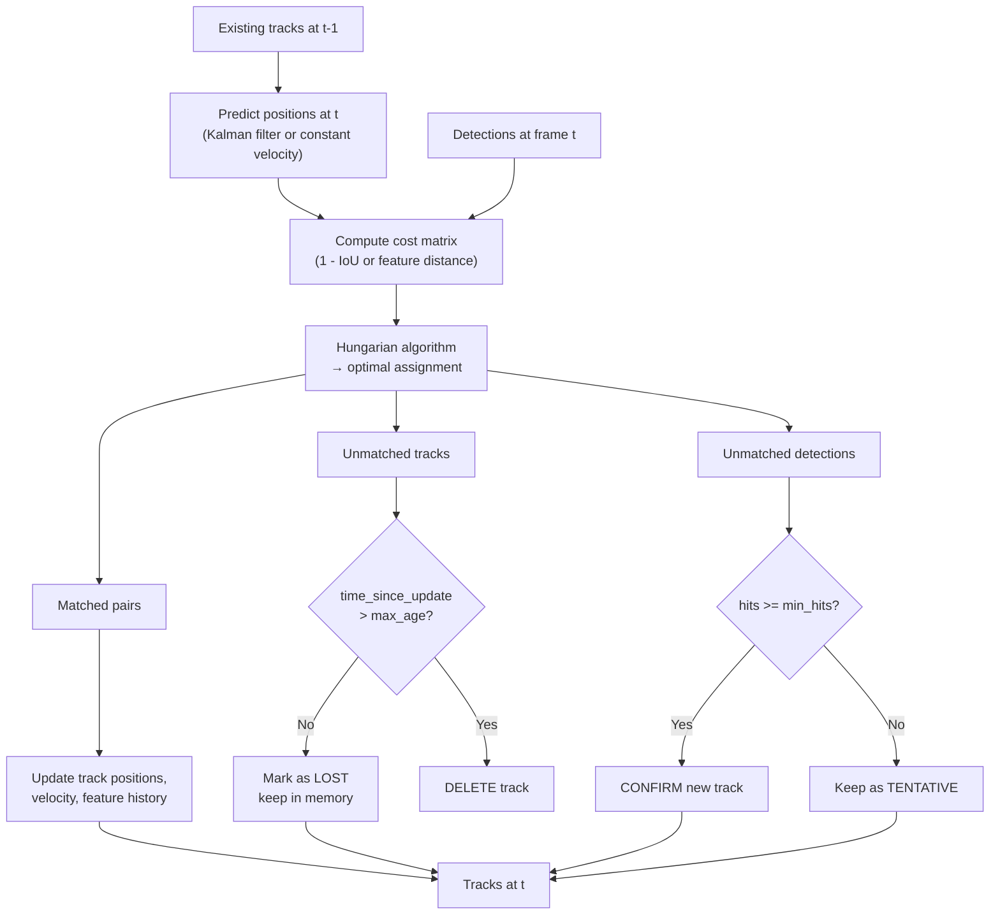

# Multi-Object Tracking & Video Memory

## Learning Objectives

1. Implement a frame-to-frame object association pipeline using the Hungarian algorithm on IoU cost matrices.
2. Configure track lifecycle states (tentative, confirmed, lost) and tune deletion thresholds for a given scene.
3. Build a video memory buffer that maintains per-track feature histories for re-identification after occlusion.
4. Compare Kalman-filter-based motion prediction against appearance-based re-ID for handling identity switches.
5. Diagnose common MOT failure modes (ID fragmentation, track drift, duplicate tracks) from tracking logs.

## The Problem

A detector draws boxes. It does that one frame at a time, with no memory of what happened thirty milliseconds ago. The moment you need to answer "how many unique people walked through this door" or "which car has been waiting at the intersection for twelve seconds," detection alone is insufficient. You need a system that assigns a persistent identifier to each object and maintains that identifier across frames, through occlusion, through detection misses, and through the chaos of objects entering and leaving the scene.

Multi-object tracking is the engineering problem of maintaining object identity across a sequence of frames. Every frame brings a fresh set of detections — some corresponding to objects you are already tracking, some representing new arrivals, and some that are simply noise. The tracker must decide which detection belongs to which existing track, spawn new tracks when warranted, and retire tracks whose objects have left the scene. When objects occlude each other or move faster than your detector's frame rate can handle, identity switches creep in. Track #7 becomes track #12. Your count is wrong. Your downstream analytics are wrong.

Video memory is the persistence layer that makes re-identification possible. A track is not a bounding box — it is a data structure holding position history, velocity estimates, appearance feature vectors, and lifecycle state. When an object disappears behind an obstruction and reappears five seconds later, the tracker consults this memory to decide whether the new detection is the same object or a new one. The richer the memory, the longer the gap you can bridge. But richer memory costs more computation per frame, and the engineering tradeoff between memory depth and real-time performance is the central tension in tracker design.

## The Concept

### The tracking-by-detection loop

The dominant paradigm in multi-object tracking is tracking-by-detection. You run a detector on every frame, then associate this frame's detections to the previous frame's tracks. The loop has four stages: predict where each existing track will appear in the current frame, match incoming detections to those predictions, update matched tracks with their new positions, and manage the lifecycle of unmatched tracks and unmatched detections.

SORT (Simple Online and Realtime Tracking) established this loop in 2016. DeepSORT extended it by adding an appearance-features cascade as a fallback when IoU matching fails. ByteTrack added a second association pass for low-confidence detections. BoT-SORT combined background subtraction with motion compensation. All of these are variations on