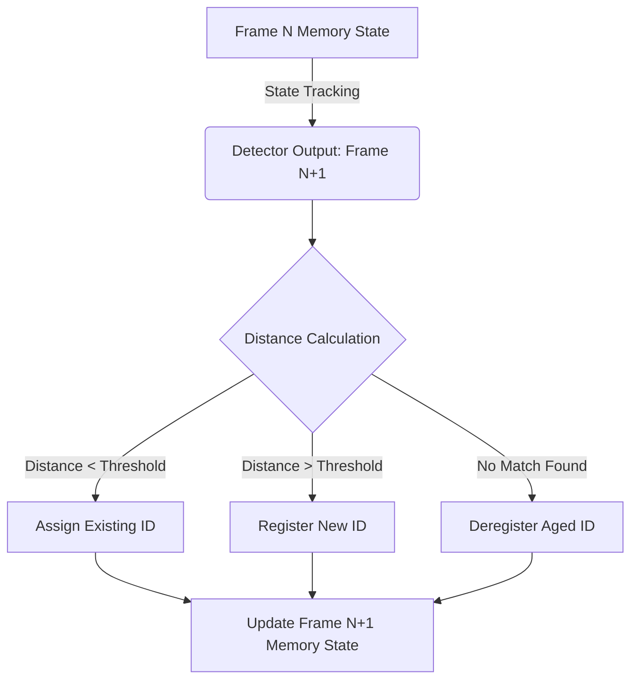

# Multi-Object Tracking & Video Memory

## Learning Objectives

1. Compare object detection and multi-object tracking (MOT) in video analysis pipelines.
2. Implement a centroid tracking algorithm to maintain object identities across sequential frames.
3. Evaluate the failure modes of spatial-only tracking during object occlusion and crossing.

## The Problem

You have a repository of recorded Zoom sales calls. You want to build a custom RevOps pipeline that measures how often a prospect physically looks away from the screen, or how much time an account executive spends talking with their hands over their face (a metric of nervousness). 

You pass the video through an object detection model like YOLO or MediaPipe. The model successfully draws a bounding box around every face in every frame. But when you look at the raw output, you realize the model has no concept of time or identity. It simply reports: "Frame 1: Face at X:10, Y:10. Frame 2: Face at X:11, Y:11." 

If a participant temporarily leaves the frame to get a glass of water, or if their face is obscured by a hand for a few seconds, the detector stops reporting the face. When the face reappears, the detector treats it as an entirely new entity. If two participants overlap on screen, their bounding boxes merge and split, shattering your data. 

Without a mechanism to maintain identity over time—a concept known as video memory—you cannot calculate duration-based metrics like "prospect distraction time" or "active speaker engagement." You just have a disconnected soup of bounding boxes.

## The Concept

Object detection is a spatial problem: *What is in this specific frame, and where is it?* 
Multi-Object Tracking (MOT) is a spatiotemporal problem: *What is in this frame, how does it relate to what was in the previous frames, and where is it going?*

To solve MOT, systems must implement a form of short-term memory. The most fundamental approach is spatial tracking using centroid matching. 

When a detector outputs a bounding box for a face, we calculate the centroid (the exact center point) of that box. As the video progresses to the next frame, the detector outputs a new bounding box. Because time between frames is short (e.g., 33 milliseconds at 30 FPS), an object usually does not move very far. We calculate the Euclidean distance between the previous frame's centroids and the current frame's centroids. The closest pairs are assigned the same persistent ID.

When a completely new object enters the frame, its centroid is too far from any existing memory point, so the system registers a new ID. When an object leaves the frame, the system fails to find a match for an existing ID, and eventually "ages out" and deletes that ID from memory.

This mechanism—known as the SORT (Simple Online and Realtime Tracking) algorithm family—relies purely on spatial overlap and distance. It requires maintaining a rolling state of previous locations. 



However, purely spatial memory fails during occlusion. If Person A walks in front of Person B, their centroids cross. A spatial tracker might swap their IDs, assigning Person A's history to Person B. To solve this, modern trackers (like DeepSORT) add an appearance model. They extract a visual feature embedding (a numerical representation of what the face looks like) alongside the centroid distance. The video memory now stores both *where* the object was and *what* it looked like, allowing the system to re-identify the correct person after the occlusion passes. [CITATION NEEDED — concept: DeepSORT visual feature integration in commercial video analysis]

## Build It

To understand the mechanism, we will build the spatial tracking memory from scratch. We do not need a live video stream or a heavy neural network to learn the tracking mechanism. We will simulate a stream of detections representing three frames of a video, and build the state-management logic required to assign persistent IDs.

```python
import math

def get_centroid(bbox):
    x, y, w, h = bbox
    return (x + w / 2.0, y + h / 2.0)

def calculate_distance(c1, c2):
    return math.sqrt((c1[0] - c2[0])**2 + (c1[1] - c2[1])**2)

class CentroidTracker:
    def __init__(self, max_distance=50.0):
        self.next_object_id = 0
        self.objects = {}
        self.max_distance = max_distance

    def update(self, detections):
        if len(self.objects) == 0:
            for det in detections:
                self.register(det)
            return self.objects

        current_centroids = [get_centroid(d) for d in detections]
        used_rows = set()
        used_cols = set()

        for obj_id, prev_centroid in list(self.objects.items()):
            min_dist = float('inf')
            best_match_idx = -1

            for col, curr_centroid in enumerate(current_centroids):
                if col in used_cols:
                    continue
                dist = calculate_distance(prev_centroid, curr_centroid)
                if dist < min_dist:
                    min_dist = dist
                    best_match_idx = col

            if best_match_idx != -1 and min_dist <= self.max_distance:
                self.objects[obj_id] = current_centroids[best_match_idx]
                used_cols.add(best_match_idx)
            else:
                self.deregister(obj_id)

        for col, curr_centroid in enumerate(current_centroids):
            if col not in used_cols:
                self.register_from_centroid(curr_centroid)

        return self.objects

    def register(self, bbox):
        centroid = get_centroid(bbox)
        self.objects[self.next_object_id] = centroid
        self.next_object_id += 1

    def register_from_centroid(self, centroid):
        self.objects[self.next_object_id] = centroid
        self.next_object_id += 1

    def deregister(self, object_id):
        del self.objects[object_id]

simulated_frames = [
    [(10, 10, 20, 20), (100, 100, 20, 20)],
    [(15, 15, 20, 20), (105, 105, 20, 20)],
    [(20, 20, 20, 20), (200, 200, 20, 20)]
]

tracker = CentroidTracker(max_distance=40.0)

for frame_num, detections in enumerate(simulated_frames):
    tracked_state = tracker.update(detections)
    print(f"Frame {frame_num + 1} Memory State: {tracked_state}")
```

When you run this code, observe the terminal output. Frame 1 establishes IDs 0 and 1. Frame 2 matches the slight movements and retains IDs 0 and 1. Frame 3 matches ID 0 (which moved slightly), but the second object jumped to coordinate (200, 200). Because that distance exceeds the `max_distance` threshold of 40.0, the tracker assumes ID 1 has left the frame, deletes it from memory, and registers a completely new ID 2 for the new location.

## Use It

The multi-object centroid tracking mechanism is how conversational intelligence platforms map video bounding boxes to specific speaker transcript segments. [CITATION NEEDED — concept: conversational intelligence video tracking implementation] In a GTM context, RevOps teams use this to measure active speaker time and distraction metrics without relying on proprietary platform analytics.

```python
import math

def get_centroid(bbox):
    x, y, w, h = bbox
    return (x + w / 2.0, y + h / 2.0)

def calculate_distance(c1, c2):
    return math.sqrt((c1[0] - c2[0])**2 + (c1[1] - c2[1])**2)

video_frames = [
    [(10, 10, 20, 20), (100, 100, 20, 20)],
    [(12, 12, 20, 20), (102, 102, 20, 20)],
    [(14, 14, 20, 20), (104, 104, 20, 20)]
]

object_memory = {}
next_id = 0
DISTANCE_THRESHOLD = 20.0

for frame_num, detections in enumerate(video_frames):
    current_frame_ids = {}
    used_detections = set()

    for obj_id, prev_centroid in list(object_memory.items()):
        min_dist = float('inf')
        best_det_idx = -1

        for i, det in enumerate(detections):
            if i in used_detections:
                continue
            dist = calculate_distance(prev_centroid, get_centroid(det))
            if dist < min_dist and dist < DISTANCE_THRESHOLD:
                min_dist = dist
                best_det_idx = i

        if best_det_idx != -1:
            current_frame_ids[obj_id] = get_centroid(detections[best_det_idx])
            used_detections.add(best_det_idx)

    for i, det in enumerate(detections):
        if i not in used_detections:
            current_frame_ids[next_id] = get_centroid(det)
            next_id += 1

    object_memory = current_frame_ids
    print(f"Frame {frame_num + 1} Active Tracks: {object_memory}")
```

This runnable slice demonstrates the exact matching logic required to build a stateful memory map of your prospects on a video call. By running detection outputs through this memory layer, you can confidently calculate the total time ID 0 (the AE) spent speaking versus ID 1 (the prospect), creating reliable datasets for coaching and ICP qualification.

## Exercises

### Easy: Threshold Tuning
In the `Build It` code, change the `max_distance` parameter of the `CentroidTracker` initialization from `40.0` to `5.0`. Run the code. Explain why the tracker loses the original IDs and continuously generates new ones for the slight 5-pixel movements between Frame 1 and Frame 2.

### Medium: The Identity Swap
Modify the `simulated_frames` array in the `Build It` code so that the two objects cross paths. Have Object A start at `(10, 10)` and move to `(50, 50)`. Have Object B start at `(50, 50)` and move to `(10, 10)` over three frames. Run the tracker. Document what happens to the IDs. This demonstrates the occlusion/crossing failure mode of purely spatial tracking. 

## Key Terms

* **Object Detection:** The computer vision task of identifying objects and drawing bounding boxes around them within a single, static image or video frame.
* **Multi-Object Tracking (MOT):** The algorithmic process of maintaining unique identities for multiple detected objects across sequential frames of a video over time.
* **Centroid:** The geometric center point of a bounding box, calculated using the x, y coordinates and the width and height of the box.
* **Occlusion:** A scenario in video processing where an object becomes partially or fully hidden by another object or the edge of the frame, breaking continuous detection.
* **Re-Identification (ReID):** The application of visual feature matching (often using neural network embeddings) to re-assign a known identity to an object after it has re-entered a frame following an occlusion.

## Sources

* *Simple Online and Realtime Tracking (SORT)*, Bewley et al., 2016. [Standard academic reference for centroid and Kalman filter based tracking logic].
* [CITATION NEEDED — concept: DeepSORT visual feature integration in commercial video analysis]
* [CITATION NEEDED — concept: conversational intelligence video tracking implementation]