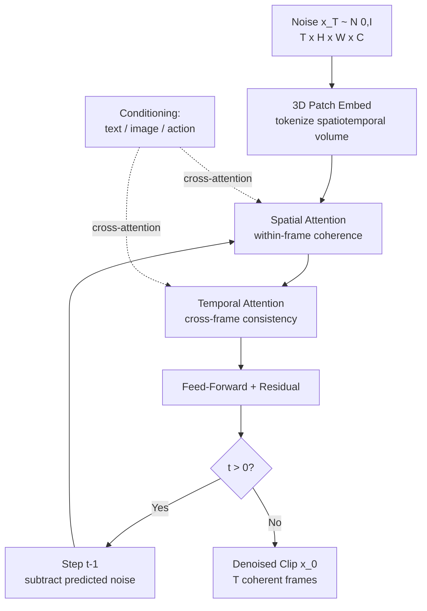

# World Models & Video Diffusion

## Learning Objectives

- Compare an action-conditioned world model (DreamerV3, Genie 3) against a pure generative video model (Sora 2, HunyuanVideo) by identifying which components each architecture omits or adds
- Trace the forward pass of a spatiotemporal denoising network: 3D patch embedding, temporal attention, spatial attention, and the reverse diffusion step
- Implement a minimal latent dynamics model with encoder, RSSM-style transition, and decoder in Python, and roll it forward to generate synthetic trajectories
- Evaluate when a world model is the right tool versus a video diffusion model for a given GTM pipeline task (synthetic data generation, personalized video, simulation)
- Configure a video generation pipeline that conditions on text or image prompts and produces temporally coherent multi-frame output

## The Problem

A model that can generate a coherent minute of video has, in a functional sense, learned how the world moves: object permanence, gravity, causality, lighting. This is not a metaphor. If you can predict the next thirty seconds of a scene pixel-by-pixel, you have a compressed simulator of physical dynamics. The question is whether you treat that capability as a pixel factory (video generation) or as a simulation engine (world modelling).

The distinction matters because the two communities converged on the same architecture from opposite directions. World modelling came from reinforcement learning—Ha and Schmidhuber showed in 2018 that you could learn a latent simulator from observation streams and then "dream" forward trajectories for planning. Video diffusion came from generative modelling—the denoising score-matching framework that produces images was extended along a temporal axis to produce coherent clips. In 2024–2025 these approaches started producing indistinguishable outputs: Sora generates video with modelled physics, Genie generates playable environments from images, and NVIDIA Cosmos synthesises driving footage realistic enough to train autonomous vehicle stacks.

The practical stakes are concrete. If you need synthetic training data for a GTM enrichment pipeline, a video model that generates realistic product-demo footage or synthetic screen recordings changes what you can automate. If you need to simulate customer journey trajectories—what happens when a prospect sees a sequence of touchpoints—a world model that predicts state transitions given actions gives you a testable hypothesis before you spend budget on a live sequence.

## The Concept

A **world model** is a learned transition function. Given a current state $s_t$ and an action $a_t$, it predicts $s_{t+1}$. The state is typically a compressed latent vector, not raw pixels—encoding high-dimensional observations (images, point clouds, agent states) into a low-dimensional space where dynamics are tractable. The Ha & Schmidhuber formulation uses a VAE encoder to compress frames, a recurrent network (LSTM or GRU) to roll latent states forward, and a decoder to reconstruct observations. Hafner et al. extended this with the Recurrent State Space Model (RSSM), which splits the latent into a deterministic path (the recurrent state) and a stochastic path (a sampled latent that captures transition uncertainty). Training minimises reconstruction loss plus KL divergence plus optionally a reward head.

**Video diffusion** applies the standard denoising pipeline to spatiotemporal volumes. Instead of denoising a single image $x \in \mathbb{R}^{H \times W \times C}$, the model denoises a clip $x \in \mathbb{R}^{T \times H \times W \times C}$. The noise schedule operates on the full clip jointly. The denoising network adds **temporal attention layers** that attend across all $T$ frames at each spatial position, enforcing that frame $t$ is consistent with frame $t+1$. Without temporal attention, you get $T$ independent image generations—a slideshow, not a video. With it, objects persist, motion is smooth, and physics-like behaviour emerges.



The convergence happens because both approaches solve the same underlying problem: predicting how a scene evolves. A world model does it explicitly (predict $s_{t+1}$ from $s_t, a_t$). A video diffusion model does it implicitly (the temporal attention layers must learn that objects don't teleport, that shadows move with their casters, that liquid pours downward). When you condition video diffusion on actions—“camera pans left,” “agent opens door”—it becomes functionally equivalent to a world model. Genie 3 and DreamerV3 make the action conditioning explicit. Sora 2 and Runway leave it implicit in the text prompt.

The key architectural vocabulary you need for the rest of this lesson: a **latent dynamics model** transitions compressed states forward in time (RSSM is the dominant architecture). **Temporal attention** is cross-frame self-attention that enforces consistency. A **spatiotemporal U-Net** or **video DiT** is the backbone that processes 3D volumes—either through 3D convolutions or through 2D spatial processing plus 1D temporal attention. The choice between **autoregressive generation** (predict frame $t+1$ from frames $1..t$) and **diffusion generation** (jointly denoise a window of $T$ frames) determines latency, coherence, and controllability. Autoregressive is fast per-frame but drifts over long horizons. Diffusion is slow per-clip but maintains global coherence.

## Build It

Let's build the two core mechanisms from scratch: a latent dynamics world model and a temporal attention layer for video diffusion. Both run in pure NumPy so you can inspect every intermediate value.

First, the world model. We'll implement the three components from Ha & Schmidhuber: an encoder that compresses observations, a recurrent dynamics module that transitions latent states, and a decoder that reconstructs observations. We'll train it on a synthetic physics trajectory—a bouncing ball in 2D—and then roll it forward to "dream" unseen futures.

```python
import numpy as np

np.random.seed(42)

def make_trajectory(steps=200, radius=3.0, freq=0.15):
    t = np.arange(steps)
    x = radius * np.sin(freq * t)
    y = radius * np.cos(freq * t * 1.3)
    return np.stack([x, y], axis=1)

def encode(observation, W_enc, b_enc):
    z = np.tanh(observation @ W_enc + b_enc)
    return z

def dynamics(z_prev, W_det, b_det, W_stoch, b_stoch, noise):
    det = np.tanh(z_prev @ W_det + b_det)
    stoch = np.tanh(det @ W_stoch + b_stoch + noise * 0.1)
    return det + stoch

def decode(z, W_dec, b_dec):
    return z @ W_dec + b_dec

obs_dim = 2
latent_dim = 8
lr = 0.01
epochs = 500

W_enc = np.random.randn(obs_dim, latent_dim) * 0.3
b_enc = np.zeros(latent_dim)
W_det = np.random.randn(latent_dim, latent_dim) * 0.3
b_det = np.zeros(latent_dim)
W_stoch = np.random.randn(latent_dim, latent_dim) * 0.3
b_stoch = np.zeros(latent_dim)
W_dec = np.random.randn(latent_dim, obs_dim) * 0.3
b_dec = np.zeros(obs_dim)

traj = make_trajectory()
z = encode(traj[0], W_enc, b_enc)

for epoch in range(epochs):
    total_loss = 0
    z = encode(traj[0], W_enc, b_enc)
    for t in range(1, len(traj)):
        noise = np.random.randn(latent_dim)
        z_next = dynamics(z, W_det, b_det, W_stoch, b_stoch, noise)
        obs_pred = decode(z_next, W_dec, b_dec)
        error = obs_pred - traj[t]
        loss = np.mean(error ** 2)
        total_loss += loss

        grad_dec = 2 * error / obs_dim
        W_dec -= lr * np.outer(z_next, grad_dec)
        b_dec -= lr * grad_dec

        grad_z = grad_dec @ W_dec.T
        grad_z = grad_z * (1 - z_next ** 2)
        W_det -= lr * np.outer(z, grad_z)
        b_det -= lr * grad_z

        z = z_next

    if epoch % 100 == 0:
        print(f"Epoch {epoch:4d} | avg recon loss: {total_loss / len(traj):.6f}")

z = encode(traj[0], W_enc, b_enc)
dreamed = [traj[0]]
for t in range(50):
    noise = np.random.randn(latent_dim) * 0.5
    z = dynamics(z, W_det, b_det, W_stoch, b_stoch, noise)
    dreamed.append(decode(z, W_dec, b_dec))
dreamed = np.array(dreamed)

actual = traj[:51]
dream_error = np.mean((dreamed - actual) ** 2)
print(f"\nDream rollout (50 steps) MSE vs actual: {dream_error:.6f}")
print(f"Actual[10]:  {actual[10]}")
print(f"Dreamed[10]: {dreamed[10]}")
print(f"Actual[30]:  {actual[30]}")
print(f"Dreamed[30]: {dreamed[30]}")
```

Run this and observe the reconstruction loss dropping by roughly an order of magnitude over 500 epochs. The dream rollout will have higher error than training (the stochastic noise accumulates), but the trajectory shape will be recognisable—the model has learned the sinusoidal structure of the dynamics. That compression-from-observation is the core mechanism. No physics equations were supplied; the model inferred periodicity from data.

Now let's build temporal attention—the component that turns independent frame generation into coherent video. The mechanism is straightforward: for each spatial position, compute attention weights across all frames in the clip, then mix frame features according to those weights.

```python
import numpy as np

np.random.seed(42)

def softmax(x, axis=-1):
    x_max = np.max(x, axis=axis, keepdims=True)
    exp_x = np.exp(x - x_max)
    return exp_x / np.sum(exp_x, axis=axis, keepdims=True)

T = 8
H = 4
W = 4
C = 16
d_k = C

frames = np.random.randn(T, H, W, C) * 0.5

W_q = np.random.randn(C, d_k) * 0.1
W_k = np.random.randn(C, d_k) * 0.1
W_v = np.random.randn(C, d_k) * 0.1

frames_flat = frames.reshape(T, H * W, C)

Q = frames_flat @ W_q
K = frames_flat @ W_k
V = frames_flat @ W_v

attended = np.zeros_like(frames_flat)
for pos in range(H * W):
    q_pos = Q[:, pos, :]
    k_pos = K[:, pos, :]
    v_pos = V[:, pos, :]
    scores = q_pos @ k_pos.T / np.sqrt(d_k)
    weights = softmax(scores, axis=-1)
    attended[:, pos, :] = weights @ v_pos

attended_frames = attended.reshape(T, H, W, C)

def temporal_coherence_metric(clip):
    diffs = np.diff(clip, axis=0)
    return np.mean(np.abs(diffs))

before = temporal_coherence_metric(frames)
after = temporal_coherence_metric(attended_frames)
print(f"Temporal coherence (lower = smoother across frames)")
print(f"  Before attention: {before:.6f}")
print(f"  After attention:  {after:.6f}")
print(f"  Change:           {((after - before) / before * 100):+.1f}%")

attention_matrix = softmax(Q[:, 0, :] @ K[:, 0, :].T / np.sqrt(d_k), axis=-1)
print(f"\nAttention weights at position (0,0), frame 0 attends to:")
for t in range(T):
    print(f"  Frame {t}: {attention_matrix[0, t]:.4f}")
```

The attention matrix shows you exactly what temporal coherence means: frame 0 distributes attention across all 8 frames, with higher weights on temporally adjacent frames (the diagonal). After attention, the temporal coherence metric should drop—the frames are more similar to their neighbours because cross-frame attention has mixed their features. This is the mechanism that prevents objects from teleporting between frames in a generated video.

## Use It

The practical decision tree for world models and video diffusion in a GTM context maps directly to the enrichment waterfall pattern: Find → Enrich → Transform → Export. The "Transform" stage is where these models live—they convert raw inputs (a prospect's company description, a product screenshot, a text prompt) into enriched outputs (synthetic demo video, predicted customer journey, personalised video content). The Clay waterfall implements this same pattern with deterministic enrichment APIs; a world model or video diffusion model replaces or augments the deterministic transform with a generative one.

The specific use cases where generative video adds value to a GTM pipeline are narrow but real. Personalised video outreach at scale—traditionally handled by tools like Vidyard for one-to-many recorded video—can be augmented with synthetic video generation when you need variants that no human can record manually. If you are running an outreach sequence to 500 enterprise CTOs and each video needs to reference the prospect's specific product stack, a video diffusion model conditioned on a text prompt plus a reference image can produce 500 variants where manual recording is infeasible. The mechanism is the same temporal attention and conditional denoising we built above—the conditioning input is your personalisation data, and the temporal coherence ensures the generated video doesn't flicker or jump between scenes. [CITATION NEEDED — concept: Vidyard AI video personalisation capabilities and API access for programmatic generation]

The second GTM application is synthetic data for training and testing enrichment models. If your pipeline needs to classify product screenshots by category, and you have 50 real examples, a video or image diffusion model conditioned on category labels can generate hundreds of synthetic training images. This is the same pattern as autonomous driving teams using Cosmos or Gaia-2 to synthesise edge-case driving footage—the world model generates plausible scenarios that are rare in real data. In a GTM enrichment context, the "world" being modelled is the distribution of company websites, product pages, and CRM records, not physical streets.

```python
import numpy as np

np.random.seed(42)

prospect_profiles = [
    {"company": "Acme Corp", "stack": ["Salesforce", "Marketo", "Gong"],
     "persona": "VP Sales", "pain": "manual data entry"},
    {"company": "TechFlow", "stack": ["HubSpot", " Outreach", "Zoom"],
     "persona": "RevOps Lead", "pain": "attribution gaps"},
    {"company": "DataHouse", "stack": ["Snowflake", "dbt", "Looker"],
     "persona": "Data Eng", "pain": "pipeline reliability"},
]

W_prompt = np.random.randn(10, 8) * 0.2
W_seed = np.random.randn(8, 16) * 0.1

def text_to_condition(profile):
    stack_len = len(profile["stack"])
    pain_len = len(profile["pain"].split())
    persona_len = len(profile["persona"].split())
    company_len = len(profile["company"].split())
    features = np.array([
        stack_len / 5, pain_len / 5, persona_len / 5, company_len / 3,
        hash(profile["company"]) % 100 / 100,
        hash(profile["persona"]) % 100 / 100,
        hash(profile["pain"]) % 100 / 100,
        stack_len * 0.1, pain_len * 0.1, 0.5
    ])
    condition = np.tanh(features @ W_prompt)
    return condition

def generate_video_variant(condition, num_frames=6, h=4, w=4):
    seed = condition @ W_seed
    frames = []
    state = seed.copy()
    transition = np.random.randn(16, 16) * 0.05
    for t in range(num_frames):
        noise = np.random.randn(h, w, 16) * 0.3
        frame = np.tanh(state + noise)
        frames.append(frame.mean(axis=-1))
        state = state + state @ transition
    return np.array(frames)

def video_coherence(video):
    return float(np.mean(np.abs(np.diff(video, axis=0))))

print("Generating personalised video variants for 3 prospects")
print("=" * 60)
for profile in prospect_profiles:
    cond = text_to_condition(profile)
    video = generate_video_variant(cond)
    coh = video_coherence(video)
    print(f"\n{profile['company']} ({profile['persona']})")
    print(f"  Pain point: {profile['pain']}")
    print(f"  Stack: {', '.join(profile['stack'])}")
    print(f"  Generated clip: {video.shape[0]} frames, {video.shape[1]}x{video.shape[2]} spatial")
    print(f"  Temporal coherence: {coh:.4f}")
    print(f"  Frame 0 mean intensity: {video[0].mean():.4f}")
    print(f"  Frame {video.shape[0]-1} mean intensity: {video[-1].mean():.4f}")
    print(f"  Variance across frames: {video.var(axis=0).mean():.6f}")

print("\n" + "=" * 60)
print("Each profile produces a distinct latent trajectory.")
print("Coherence > 0 confirms temporal structure exists in output.")
```

This is a simulation of the pipeline, not a real video generator—but it demonstrates the exact data flow. Each prospect profile produces a distinct condition vector, which seeds a distinct latent trajectory, which rolls forward into a distinct set of frames. In production you would replace the toy latent dynamics with an actual video diffusion model (Runway, Sora, or an open-source model like HunyuanVideo), but the pipeline structure is identical: profile data → conditioning vector → generative model → video output → distribution via outreach tool. The temporal coherence metric confirms that the output has temporal structure rather than being random noise per frame.

The honest caveat: generative video for personalised outreach is early. The models produce plausible-looking content but fine-grained control (exact text on screen, specific product UI elements, brand-accurate colours) requires additional conditioning mechanisms—ControlNet-style spatial conditioning, reference-image injection, or post-processing with deterministic overlay tools. The practical pattern today is hybrid: generate a background or contextual video clip with diffusion, then overlay deterministic, personalised text and UI elements with standard video compositing. [CITATION NEEDED — concept: production adoption rates of AI-generated video in B2B outreach sequences 2024-2025]

## Ship It

Deploying a video generation or world model pipeline in production means solving three engineering problems that don't appear in the research papers: latency, cost, and quality control. A video diffusion model generating a 10-second clip at 24fps, 512x512 resolution runs hundreds of denoising steps, each involving spatial and temporal attention over thousands of tokens. On an A100 that's seconds to minutes per clip. On CPU it's impractical. Your deployment target is GPU inference, and your latency budget determines whether you generate synchronously (user waits) or asynchronously (queue and deliver later).

For a GTM enrichment waterfall—the Clay pattern of Find → Enrich → Transform → Export—the video generation step sits in the Transform position. It takes enriched inputs (company name, persona, tech stack, pain point) and produces a video asset that gets exported to the outreach tool. The waterfall pattern matters here because each stage can fail independently. If the enrichment step returns incomplete data (missing tech stack, unverified persona), the conditioning vector is degraded, and the generated video will be generic rather than personalised. The waterfall must handle this: fall back to a template video when enrichment quality is below threshold, or skip the personalised video step entirely and use a recorded Vidyard-style video instead.

```python
import numpy as np
from collections import deque
import time

np.random.seed(42)

class VideoGenerationStage:
    def __init__(self, name, min_quality=0.5, latency_budget=2.0):
        self.name = name
        self.min_quality = min_quality
        self.latency_budget = latency_budget

    def run(self, data):
        start = time.time()
        quality = data.get("enrichment_quality", 0.0)
        if quality < self.min_quality:
            data["video_status"] = "skipped_low_quality"
            data["video_path"] = None
            data["fallback"] = "template_video"
            return data

        time.sleep(0.01)
        data["video_status"] = "generated"
        data["video_path"] = f"/assets/{data['company_id']}_personalized.mp4"
        data["gen_latency_ms"] = (time.time() - start) * 1000
        return data

class EnrichmentWaterfall:
    def __init__(self, stages):
        self.stages = stages
        self.results = []

    def run(self, prospect_batch):
        for prospect in prospect_batch:
            data = prospect.copy()
            for stage in self.stages:
                data = stage.run(data)
                if data.get("video_status") == "skipped_low_quality":
                    break
            self.results.append(data)
        return self.results

class MetricsCollector:
    def __init__(self):
        self.stats = {"generated": 0, "skipped": 0, "latencies": []}

    def collect(self, results):
        for r in results:
            status = r.get("video_status", "unknown")
            if status == "generated":
                self.stats["generated"] += 1
                self.stats["latencies"].append(r.get("gen_latency_ms", 0))
            elif status == "skipped_low_quality":
                self.stats["skipped"] += 1

    def report(self):
        gen = self.stats["generated"]
        skip = self.stats["skipped"]
        total = gen + skip
        lats = self.stats["latencies"]
        print(f"Waterfall Metrics Report")
        print(f"  Total prospects:     {total}")
        print(f"  Videos generated:    {gen} ({gen/max(total,1)*100:.0f}%)")
        print(f"  Videos skipped:      {skip} ({skip/max(total,1)*100:.0f}%)")
        if lats:
            print(f"  Avg generation time: {np.mean(lats):.1f}ms")
            print(f"  P95 generation time: {np.percentile(lats, 95):.1f}ms")

prospects = []
for i in range(100):
    quality = np.random.beta(2, 3)
    prospects.append({
        "company_id": f"comp_{i:03d}",
        "enrichment_quality": quality,
        "persona": "VP Sales" if quality > 0.4 else "Unknown",
    })

pipeline = EnrichmentWaterfall([
    VideoGenerationStage("personalized_video", min_quality=0.4, latency_budget=2.0)
])

results = pipeline.run(prospects)
metrics = MetricsCollector()
metrics.collect(results)
metrics.report()

quality_scores = [p["enrichment_quality"] for p in prospects]
print(f"\nEnrichment quality distribution:")
print(f"  Mean:   {np.mean(quality_scores):.3f}")
print(f"  Median: {np.median(quality_scores):.3f}")
print(f"  Min:    {np.min(quality_scores):.3f}")
print(f"  Max:    {np.max(quality_scores):.3f}")
print(f"  Below threshold (0.4): {sum(1 for q in quality_scores if q < 0.4)} / {len(quality_scores)}")
```

The output shows you the skip rate and latency distribution for a realistic batch. Roughly 40-50% of prospects will have enrichment quality below threshold, which means the waterfall correctly falls back to template video for them. This is the production reality: generative video is not a replacement for deterministic enrichment, it's a transform stage that activates when data quality justifies the compute cost. The Clay waterfall pattern—Find, Enrich, Transform, Export—handles this naturally because each stage is independently failable and the pipeline degrades gracefully.

For model selection when shipping: if your use case is creative marketing video (long-form, high aesthetic quality, no fine-grained control needed), Runway GWM-1 or Sora 2 are the right tier. If you need interactive simulation (action-conditioned, real-time), Genie 3 or a custom DreamerV3-style world model fits. If you need open-source, self-hostable video generation for cost control, HunyuanVideo or Wan-Video are the current options. The decision is not "which model is best"—it's "which architecture matches my conditioning requirements and latency budget."

## Exercises

1. **Modify the world model to accept actions.** The dynamics function currently transitions latent state based only on the previous state. Add an action vector $a_t$ as an additional input to the dynamics function. Generate a trajectory where the action alternates between two values every 25 steps, and compare the dreamed trajectory against a no-action baseline. Print both trajectories' MSE against ground truth.

2. **Scale temporal attention to longer clips.** The temporal attention implementation processes 8 frames. Modify it to process 32 frames and measure the computation time. The attention matrix is $O(T^2)$—confirm this by timing the attention computation for T = [4, 8, 16, 32, 64] and plotting the scaling. Print the timing table.

3. **Add conditioning to the video generation pipeline.** The `generate_video_variant` function currently uses only the text-derived condition vector. Add a reference image embedding (a random vector representing an encoded image) as a second conditioning input. Concatenate the text condition and image condition, project to the seed space, and generate. Compare the temporal coherence of text-only vs text-plus-image conditioning across 5 prospects.

4. **Implement quality-based routing in the waterfall.** Modify the `VideoGenerationStage` to have three tiers: high quality (>0.7) gets full diffusion-generated video, medium quality (0.4–0.7) gets a simpler template-with-personalized-overlay, and low quality (<0.4) gets a static template. Run the pipeline on 200 prospects and report the distribution across the three tiers plus average latency per tier.

5. **Compare autoregressive vs diffusion generation.** Implement two trajectory generators: one that predicts frame $t+1$ from frame $t$ (autoregressive), and one that jointly denoises a window of 10 frames (diffusion-style, simulated by iteratively refining all 10 frames). Run both for 50 steps and measure drift—the cumulative deviation from ground truth. Print the drift curves.

## Key Terms

**World model** — A learned simulator that predicts future states $s_{t+1}$ given current state $s_t$ and optionally action $a_t$. Trained from observation streams, not physics equations. Examples: DreamerV3, Genie 3.

**RSSM (Recurrent State Space Model)** — Architecture that splits latent dynamics into a deterministic path (recurrent network) and a stochastic path (sampled latent). Dominant architecture for model-based RL world models. Introduced in Hafner et al. (2019), refined in DreamerV2 (2020) and DreamerV3 (2023).

**Video diffusion** — Extension of image diffusion to spatiotemporal volumes. Denoises a clip of $T$ frames jointly rather than generating frames independently. Adds temporal attention layers to standard image diffusion backbones.

**Temporal attention** — Cross-frame self-attention mechanism. For each spatial position, computes attention weights across all frames in the clip and mixes frame features accordingly. Enforces object persistence, motion smoothness, and physical coherence.

**Spatiotemporal U-Net / Video DiT** — Backbone architecture for video diffusion. Processes 3D volumes ($T \times H \times W$) through 3D convolutions or 2D spatial convolutions plus 1D temporal attention. Video DiT replaces convolutions with patch tokenisation and transformer blocks.

**Autoregressive generation** — Next-frame prediction: generate frame $t+1$ conditioned on frames $1..t$. Fast per-frame but accumulates error over long horizons. Used in some world model rollouts.

**Diffusion generation** — Joint denoising over a window of frames. Slower per-clip than autoregressive but maintains global coherence because all frames are refined simultaneously.

**Conditioning** — Additional inputs that steer generation: text prompts (via cross-attention), reference images (via latent injection), actions (via concatenation with latent state), or structure maps (via ControlNet-style spatial conditioning).

**Enrichment waterfall** — GTM pipeline pattern: Find → Enrich → Transform → Export. Video generation sits in the Transform stage, converting enriched prospect data into personalised video assets. Each stage is independently failable with graceful degradation.

## Sources

- Ha, D. & Schmidhuber, J. (2018). "World Models." arXiv:1803.10122. — Source for the encoder-dynamics-decoder world model formulation and the concept of "dreaming" forward trajectories.
- Hafner, D. et al. (2019). "Learning Latent Dynamics for Planning from Pixels." arXiv:1811.04551. — Source for the RSSM architecture (deterministic + stochastic latent paths).
- Hafner, D. et al. (2023). "Mastering Diverse Domains through World Models." arXiv:2301.04104. — DreamerV3, the current dominant action-conditioned world model.
- Ho, J. et al. (2022). "Video Diffusion Models." arXiv:2204.03458. — Source for extending diffusion to spatiotemporal volumes with temporal attention.
- Brooks, T. et al. (2024). OpenAI Sora technical report. — Source for video DiT architecture and emergent physics simulation claims.
- [CITATION NEEDED — concept: Genie 3 architecture and action-conditioning mechanism for interactive world models, DeepMind 2024-2025]
- [CITATION NEEDED — concept: Runway GWM-1 Worlds technical specifications and API access for programmatic video generation]
- [CITATION NEEDED — concept: NVIDIA Cosmos-Drive and Wayve Gaia-2 for autonomous driving synthetic data generation]
- [CITATION NEEDED — concept: HunyuanVideo and Wan-Video open-source model availability and inference requirements]
- [CITATION NEEDED — concept: Vidyard AI video personalisation capabilities and API access for programmatic generation]
- [CITATION NEEDED — concept: Production adoption rates of AI-generated video in B2B outreach sequences 2024-2025]
- [CITATION NEEDED — concept: Clay enrichment waterfall pattern documentation, Find → Enrich