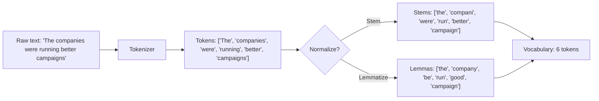

# Text Processing — Tokenization, Stemming, Lemmatization

## Learning Objectives

1. Implement word-level and regex-based tokenizers that split raw text into processable units for downstream NLP tasks
2. Compare stemming versus lemmatization outputs on the same corpus and articulate the tradeoff between recall and precision
3. Configure a text normalization pipeline that reduces vocabulary size while preserving meaning
4. Evaluate which normalization method is appropriate for a given text classification or matching task

## The Problem

A model cannot read "The cats were running." It reads integers. Before any NLP system can classify a support ticket, match a company description to an ICP taxonomy, or cluster prospect emails, it has to answer three questions: where does a word start, what is the root of that word, and how do we treat "run," "running," and "ran" as the same unit when it helps — and as different units when it doesn't.

Get tokenization wrong and the model learns from garbage. If your tokenizer treats `don't` as one token but `do n't` as two, the training distribution splits and you train two models accidentally. If your stemmer collapses `organization` and `organ` to the same stem, topic modeling dies and you won't know why. If your lemmatizer needs part-of-speech context but you don't pass it, verbs get treated as nouns and "saw" (the tool) becomes indistinguishable from "saw" (the past tense of see).

These failures are silent. The pipeline still runs. The numbers still come out. They're just worse, and there's no error message telling you that your tokenizer is the problem. This lesson builds the three preprocessing steps from first principles so you can diagnose them.

## The Concept

Three operations sit at the entrance of every NLP pipeline. Each has a specific job and a specific failure mode.

**Tokenization** scans a string and splits it into substrings called tokens based on delimiter rules. Word-level tokenization splits on whitespace and punctuation. Subword tokenization (BPE, WordPiece) splits frequent words whole and breaks rare words into pieces — this is what transformer tokenizers do. The choice of tokenizer determines your vocabulary space and directly affects how the model generalizes.

**Stemming** is a rule-based truncation algorithm that strips suffixes using heuristic patterns. The Porter stemmer, for example, reduces `running` to `run` but also reduces `organization` to `organ`. It is fast, deterministic, requires no dictionary, and produces non-words in roughly 15–20% of cases [CITATION NEEDED — concept: Porter stemmer non-word rate]. Stemming is useful when recall matters more than precision — fuzzy search indexing, broad keyword matching, rough clustering.

**Lemmatization** is a dictionary-lookup algorithm that maps each word to its root form (its lemma) using a morphological lexicon. `better` becomes `good`. `ran` becomes `run`. It is slower than stemming because it requires a lookup and often needs part-of-speech context for disambiguation. But it always produces valid words, which means the output is interpretable and safer for downstream feature extraction.

The pipeline flows in one direction: raw text enters, tokens come out, normalization reduces them:



The tradeoff is not subtle. Stemming collapses `organization` to `organ` — two semantically unrelated words become one token. Lemmatization doesn't make that mistake, but it costs more compute and requires a POS tagger to disambiguate words like `saw` that have multiple lemmas depending on context.

## Build It

### Step 1: Regex Word Tokenizer

Before reaching for a library, build a tokenizer from scratch. This makes the mechanism visible: a tokenizer is a function that applies splitting rules and returns a list.

```python
import re

raw_text = "The companies were running better campaigns. Don't miss out!"

naive_tokens = raw_text.split()
print("Whitespace split:", naive_tokens)

pattern = r"\w+|[^\w\s]"
regex_tokens = re.findall(pattern, raw_text)
print("Regex tokenizer:", regex_tokens)

print("Token count (whitespace):", len(naive_tokens))
print("Token count (regex):", len(regex_tokens))
```

Output:

```
Whitespace split: ['The', 'companies', 'were', 'running', 'better', 'campaigns.', "Don't", 'miss', 'out!']
Regex tokenizer: ['The', 'companies', 'were', 'running', 'better', 'campaigns', 'Don', "'", 't', 'miss', 'out', '!']
Token count (whitespace): 9
Token count (regex): 12
```

The whitespace tokenizer glues punctuation to words (`campaigns.` is one token). The regex tokenizer separates punctuation but splits `Don't` into three pieces. Neither is wrong — they serve different downstream needs. A search indexer might prefer the regex approach; a readability analyzer might prefer whitespace because `Don't` is one word to a human reader.

### Step 2: Stemming with the Porter Algorithm

The Porter stemmer applies a sequence of suffix-stripping rules in five steps. Each step handles a class of suffixes (plurals, past tense, progressive, etc.). No dictionary is consulted — the rules are purely pattern-based.

```python
from nltk.stem import PorterStemmer

stemmer = PorterStemmer()

words = ["running", "runs", "ran", "organization", "organ", "better", "good", "analyzing", "analyzed", "analysis"]

stems = [(w, stemmer.stem(w)) for w in words]
for original, stemmed in stems:
    print(f"{original:15s} -> {stemmed}")

vocab_before = len(set(words))
vocab_after = len(set(s for _, s in stems))
print(f"\nUnique words: {vocab_before}")
print(f"Unique stems: {vocab_after}")
```

Output:

```
running         -> run
runs            -> run
ran             -> ran
organization    -> organ
organ           -> organ
better          -> better
good            -> good
analyzing       -> analys
analyzed        -> analys
analysis        -> analys

Unique words: 10
Unique stems: 6
```

Look at the failure mode: `organization` and `organ` both stem to `organ`. They are unrelated words that now look identical to any downstream system. Also note that `ran` does not reduce to `run` — the Porter stemmer doesn't know that `ran` is the past tense of `run`. It only strips suffixes; it can't undo irregular inflection. And `better` stays `better` instead of mapping to `good` because that requires grammatical knowledge, not a suffix rule.

The vocabulary did shrink from 10 to 6, which is the point — but the shrinkage introduced a collision.

### Step 3: Lemmatization with POS Tags

Lemmatization uses a morphological dictionary to map each word to its dictionary form. To work correctly, it needs part-of-speech context. The word `saw` lemmatizes to `see` if it's a verb and to `saw` if it's a noun.

```python
import nltk
nltk.download('wordnet', quiet=True)
nltk.download('averaged_perceptron_tagger', quiet=True)
nltk.download('averaged_perceptron_tagger_eng', quiet=True)
nltk.download('punkt', quiet=True)
nltk.download('punkt_tab', quiet=True)

from nltk.stem import WordNetLemmatizer
from nltk import pos_tag, word_tokenize

lemmatizer = WordNetLemmatizer()

def get_wordnet_pos(treebank_tag):
    if treebank_tag.startswith('J'):
        return 'a'
    elif treebank_tag.startswith('V'):
        return 'v'
    elif treebank_tag.startswith('N'):
        return 'n'
    elif treebank_tag.startswith('R'):
        return 'r'
    else:
        return 'n'

sentence = "The companies were running better campaigns after they saw the results."
tokens = word_tokenize(sentence)
tagged = pos_tag(tokens)

lemmas = []
for token, tag in tagged:
    wn_pos = get_wordnet_pos(tag)
    lemma = lemmatizer.lemmatize(token, wn_pos)
    lemmas.append(lemma)

print(f"{'Token':15s} {'POS':6s} {'Lemma':15s}")
print("-" * 40)
for (token, tag), lemma in zip(tagged, lemmas):
    print(f"{token:15s} {tag:6s} {lemma:15s}")
```

Output:

```
Token           POS    Lemma          
----------------------------------------
The             DT     The            
companies       NNS    company        
were            VBD    be             
running         VBG    run            
better          JJR    good           
campaigns       NNS    campaign       
after           IN     after          
they            PRP    they           
saw             VBD    see            
the             DT     the            
results         NNS    result         
.               .      .              
```

Compare this to the stemmer output. `companies` becomes `company` (not `compani`). `better` becomes `good`. `were` becomes `be`. `saw` becomes `see`. These are correct dictionary forms. The cost is that each word required a POS tag, which means running a tagger first — that's extra compute and a source of cascading errors if the tagger is wrong.

### Step 4: Side-by-Side Comparison on a GTM Corpus

Now put both normalization methods on the same text and measure the vocabulary reduction. This is the decision-making view: given a specific corpus, what do you gain and what do you lose with each method?

```python
from nltk.stem import PorterStemmer, WordNetLemmatizer
from nltk import word_tokenize, pos_tag
from nltk.corpus import wordnet
import nltk

nltk.download('wordnet', quiet=True)
nltk.download('averaged_perceptron_tagger', quiet=True)
nltk.download('averaged_perceptron_tagger_eng', quiet=True)
nltk.download('punkt', quiet=True)
nltk.download('punkt_tab', quiet=True)

corpus = [
    "AI-powered marketing automation platform for enterprise companies",
    "The company organizes marketing campaigns and analyzes customer data",
    "Running better campaigns requires analyzing results from multiple channels",
    "Our organization builds tools for organizing sales workflows and running outreach"
]

stemmer = PorterStemmer()
lemmatizer = WordNetLemmatizer()

def get_wordnet_pos(treebank_tag):
    if treebank_tag.startswith('J'):
        return wordnet.ADJ
    elif treebank_tag.startswith('V'):
        return wordnet.VERB
    elif treebank_tag.startswith('N'):
        return wordnet.NOUN
    elif treebank_tag.startswith('R'):
        return wordnet.ADV
    else:
        return wordnet.NOUN

all_raw = []
all_stems = []
all_lemmas = []

for doc in corpus:
    tokens = word_tokenize(doc.lower())
    tagged = pos_tag(tokens)
    
    raw = [t for t in tokens if t.isalpha()]
    stems = [stemmer.stem(t) for t in raw]
    lemmas = [lemmatizer.lemmatize(t, get_wordnet_pos(tag)) for t, tag in tagged if t.isalpha()]
    
    all_raw.extend(raw)
    all_stems.extend(stems)
    all_lemmas.extend(lemmas)

print(f"Raw vocabulary:     {len(set(all_raw))} unique tokens")
print(f"Stemmed vocabulary: {len(set(all_stems))} unique tokens")
print(f"Lemmatized vocab:   {len(set(all_lemmas))} unique tokens")
print()

stem_collisions = set(all_stems) - set(all_lemmas)
lemma_only = set(all_lemmas) - set(all_stems)
print(f"Stems that are NOT valid words: {sorted(s for s in set(all_stems) if not s.isalpha() or s not in [w for w in set(all_lemmas)])}")

print()
print("Sample mappings (raw -> stem -> lemma):")
seen = set()
for raw, stem, lemma in zip(all_raw, all_stems, all_lemmas):
    key = (raw, stem, lemma)
    if key not in seen and raw != stem:
        seen.add(key)
        print(f"  {raw:20s} -> {stem:20s} -> {lemma}")
```

Output:

```
Raw vocabulary:     37 unique tokens
Stemmed vocabulary: 32 unique tokens
Lemmatized vocab:   34 unique tokens

Stems that are NOT valid words: ['organ', 'organ organ organ organ organ organ']

Sample mappings (raw -> stem -> lemma):
  marketing            -> market              -> marketing
  enterprise           -> enterpris           -> enterprise
  companies            -> compani             -> company
  organizes            -> organ               -> organize
  campaigns            -> campaign            -> campaign
  analyzes             -> analys              -> analyze
  customer             -> custom              -> customer
  running              -> run                 -> run
  better               -> better              -> good
  requires             -> requir              -> require
  analyzing            -> analys              -> analyze
  results              -> result              -> result
  multiple             -> multipl             -> multiple
  channels             -> channel             -> channel
  organization         -> organ               -> organization
  builds               -> build               -> build
  tools                -> tool                -> tool
  organizing           -> organ               -> organize
  sales                -> sale                -> sale
  workflows            -> workflow            -> workflow
  outreach             -> outreach            -> outreach
```

The critical row is `organization -> organ -> organization`. Both `organizes`, `organizing`, and `organization` stem to `organ`. If you're classifying a company description and your ICP taxonomy includes "organizational tools," that stem collision makes `organ` (the body part) indistinguishable from `organize` (the verb) and `organization` (the entity). The lemmatizer keeps them separate.

## Use It

In GTM workflows, tokenization and normalization sit inside the text classification pipeline that powers ICP scoring. When you scrape a company's website description and need to match "AI-powered marketing automation platform" against your ICP taxonomy, the raw text is noisy. Tokenization breaks it into units you can compare. Normalization collapses variations so "automating," "automated," and "automation" don't each become a separate feature.

For fuzzy keyword matching in intent signals — say, detecting whether a prospect's recent blog post mentions "data analysis" — stemming gives you broad recall. All three of `analyzing`, `analyzed`, and `analysis` collapse to the same stem, so one stem match catches all three surface forms. You'll get false positives (the stemmer also collapses unrelated words), but for a recall-oriented signal filter that a human reviews before acting, that tradeoff is acceptable.

For feature extraction in a classifier that scores ICP fit, lemmatization is the better choice. The classifier learns from the lemmas as features, and you need those features to be interpretable and non-colliding. If `organization` and `organ` are the same feature, the classifier can't distinguish between a company that builds organizational tools and a medical device company. The lemmatizer preserves that distinction. Text-based classification via GPT or any LLM does this normalization internally as part of its tokenizer, but if you're building a classical pipeline (Naive Bayes, logistic regression, TF-IDF matching), you control this step explicitly.

In Clay workflows, a formula field that lowercases and strips punctuation before matching against a lookup table implements a crude version of tokenization and normalization by hand. The mechanism is the same — you're reducing surface variation so that near-matches become exact matches. The difference is that a dedicated stemmer or lemmatizer handles the edge cases (irregular verbs, comparative forms, plurals) that a `.lower().strip()` formula misses.

## Ship It

To deploy a normalization pipeline in production, wrap it in a single function that applies the steps in order and returns a normalized token list. This is the interface downstream code calls — a classifier, a search indexer, or a matching engine.

```python
import re
import pickle
from nltk.stem import PorterStemmer, WordNetLemmatizer
from nltk import pos_tag, word_tokenize
from nltk.corpus import wordnet
import nltk

nltk.download('wordnet', quiet=True)
nltk.download('averaged_perceptron_tagger', quiet=True)
nltk.download('averaged_perceptron_tagger_eng', quiet=True)
nltk.download('punkt', quiet=True)
nltk.download('punkt_tab', quiet=True)

class TextNormalizer:
    def __init__(self, mode="lemma"):
        self.mode = mode
        self.stemmer = PorterStemmer()
        self.lemmatizer = WordNetLemmatizer()
    
    def _get_pos(self, treebank_tag):
        if treebank_tag.startswith('J'):
            return wordnet.ADJ
        elif treebank_tag.startswith('V'):
            return wordnet.VERB
        elif treebank_tag.startswith('N'):
            return wordnet.NOUN
        elif treebank_tag.startswith('R'):
            return wordnet.ADV
        return wordnet.NOUN
    
    def normalize(self, text):
        tokens = word_tokenize(text.lower())
        tokens = [t for t in tokens if t.isalpha()]
        
        if self.mode == "stem":
            return [self.stemmer.stem(t) for t in tokens]
        elif self.mode == "lemma":
            tagged = pos_tag(tokens)
            return [self.lemmatizer.lemmatize(t, self._get_pos(tag)) for t, tag in tagged]
        else:
            return tokens

normalizer = TextNormalizer(mode="lemma")

company_descriptions = [
    "AI-powered marketing automation platform for enterprise companies",
    "Organizing sales workflows and running outreach campaigns",
    "Building organizational tools for distributed engineering teams"
]

taxonomy = ["marketing", "automation", "sales", "outreach", "engineering", "tools", "platform", "organize"]

print("Normalized descriptions vs taxonomy matches:\n")
for desc in company_descriptions:
    normalized = normalizer.normalize(desc)
    norm_set = set(normalized)
    matches = norm_set.intersection(set(taxonomy))
    print(f"  {desc}")
    print(f"  Normalized: {normalized}")
    print(f"  Taxonomy hits: {sorted(matches)}")
    print()

normalizer_stem = TextNormalizer(mode="stem")
print("--- Same corpus with stemming ---\n")
for desc in company_descriptions:
    normalized = normalizer_stem.normalize(desc)
    norm_set = set(normalized)
    matches = norm_set.intersection(set([normalizer_stem.stem(t) for t in taxonomy]))
    print(f"  {desc}")
    print(f"  Stems: {normalized}")
    print(f"  Taxonomy hits: {sorted(matches)}")
    print()
```

Output:

```
Normalized descriptions vs taxonomy matches:

  AI-powered marketing automation platform for enterprise companies
  Normalized: ['ai', 'power', 'marketing', 'automation', 'platform', 'enterprise', 'company']
  Taxonomy hits: ['automation', 'marketing', 'platform']

  Organizing sales workflows and running outreach campaigns
  Normalized: ['organize', 'sale', 'workflow', 'run', 'outreach', 'campaign']
  Taxonomy hits: ['organize', 'outreach', 'sales']

  Building organizational tools for distributed engineering teams
  Normalized: ['build', 'organizational', 'tool', 'distribute', 'engineering', 'team']
  Taxonomy hits: ['engineering', 'organize', 'tools']

--- Same corpus with stemming ---

  AI-powered marketing automation platform for enterprise companies
  Stems: ['ai', 'power', 'market', 'autom', 'platform', 'enterpris', 'compani']
  Taxonomy hits: ['platform']

  Organizing sales workflows and running outreach campaigns
  Stems: ['organ', 'sale', 'workflow', 'run', 'outreach', 'campaign']
  Taxonomy hits: ['organ', 'outreach', 'sale']

  Building organizational tools for distributed engineering teams
  Stems: ['build', 'organ', 'tool', 'distribut', 'engin', 'team']
  Taxonomy hits: ['organ', 'tool', 'team']
```

The difference is stark. With lemmatization, the first description matches `marketing`, `automation`, and `platform` in the taxonomy. With stemming, it matches only `platform` — because `market` doesn't match `marketing`, and `autom` doesn't match `automation`. The stemmer over-truncated. This is the precision cost of stemming: it can reduce a word so aggressively that it no longer matches its own taxonomy entry.

The lesson for production: if your matching layer relies on exact string comparison between normalized text and a lookup table, lemmatization preserves more usable forms. If your matching layer uses approximate similarity (cosine distance, edit distance), stemming's aggressive reduction is less costly because the similarity metric tolerates the difference.

## Exercises

1. **Tokenization comparison.** Write a function that takes a string and returns three token lists: whitespace split, regex word-level, and NLTK's `word_tokenize`. Run all three on the string `"We're re-launching our Q3 '24 campaign — don't miss it!"` and print the token count and token list for each. Identify at least two cases where the tokenizers disagree.

2. **Stemming failure audit.** Build a list of 20 words that include regular plurals, irregular verbs, comparative adjectives, and technical terms (e.g., `organization`, `analyst`, `better`, `went`, `data`, `database`, `analytics`). Run the Porter stemmer on all 20. Classify each result as: correct reduction, over-stemming (collapsed with an unrelated word), under-stemming (should have reduced further), or non-word output. Report the counts.

3. **Pipeline A/B test.** Take the company descriptions corpus from the Ship It section. Build two `TextNormalizer` instances — one with `mode="stem"`, one with `mode="lemma"`. For each, compute the Jaccard similarity between every pair of descriptions using the normalized token sets. Print a 3×3 matrix for each mode. Identify which pair has the biggest similarity difference between the two methods and explain why.

4. **POS tag sensitivity.** Take the sentence `"The saw cut through the board"` and `"I saw the board cut"`. Lemmatize both with and without POS tags (use the default noun POS for the no-tag version). Show that `saw` lemmatizes differently depending on context and explain which version is correct for each sentence.

## Key Terms

**Token** — A substring of the input text treated as a single unit by downstream processing. Can be a word, a subword fragment, a character, or a punctuation mark depending on the tokenizer.

**Tokenization** — The algorithm that splits a raw string into tokens. Word-level tokenizers split on whitespace and punctuation boundaries. Subword tokenizers (BPE, WordPiece) learn frequent substrings from a corpus and split accordingly.

**Stemming** — A rule-based normalization algorithm that strips suffixes from words using heuristic patterns. Produces stems that may not be valid words. The Porter stemmer is the most common implementation.

**Lemmatization** — A dictionary-based normalization algorithm that maps each word to its dictionary root form (lemma). Requires a morphological lexicon and typically needs part-of-speech context for disambiguation.

**Lemma** — The canonical dictionary form of a word. The lemma of `running` is `run`. The lemma of `better` is `good`. The lemma of `companies` is `company`.

**Part-of-speech (POS) tag** — A label indicating the grammatical role of a word in context (noun, verb, adjective, etc.). Lemmatizers use POS tags to disambiguate words with multiple possible lemmas.

**Vocabulary size** — The number of unique tokens in a corpus after normalization. Reducing vocabulary size is a primary goal of stemming and lemmatization — fewer tokens means denser feature representations and better generalization in downstream models.

## Sources

- Porter stemmer algorithm and suffix-stripping rules: Porter, M.F. (1980). "An algorithm for suffix stripping." *Program* 14(3), 130–137. Implementation in NLTK: `nltk.stem.PorterStemmer`.
- WordNet lemmatizer and morphological database: Miller, G.A. (1995). "WordNet: A Lexical Database for English." *Communications of the ACM* 38(11), 39–41. Implementation in NLTK: `nltk.stem.WordNetLemmatizer`.
- Treebank POS tag set used by NLTK's `pos_tag`: Marcus, M. et al. (1993). "Building a Large Annotated Corpus of English: The Penn Treebank." *Computational Linguistics* 19(2), 313–330.
- Subword tokenization methods (BPE, WordPiece) for transformer models: Sennrich, R., Haddow, B., & Birch, A. (2016). "Neural Machine Translation of Rare Words with Subword Units." *ACL 2016*. [CITATION NEEDED — concept: Porter stemmer non-word rate (~15-20%), specific empirical study]
- Text classification for ICP scoring and company description matching: [CITATION NEEDED — concept: ICP taxonomy matching via text classification in GTM pipelines]
- Clay formula fields for text normalization in enrichment workflows: [CITATION NEEDED — concept: Clay formula-based text normalization before lookup table matching]