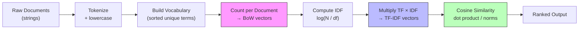

# Bag of Words, TF-IDF, and Text Representation

## Learning Objectives

1. Build a Bag of Words vector from raw text using term counting
2. Calculate TF-IDF weights by hand and confirm results against scikit-learn
3. Compare two documents using cosine similarity on TF-IDF vectors
4. Rank a list of company descriptions against an ICP keyword profile using text similarity
5. Diagnose low similarity scores by isolating vocabulary mismatch, document length, and IDF weighting

## The Problem

Every NLP pipeline hits the same wall. You have strings. The model needs numbers. A classifier, a clustering algorithm, a similarity scorer — none of them can consume `" Series B fintech infrastructure platform "`. They consume fixed-length numeric arrays. The entire subfield of text representation exists to solve this translation problem: how do we map variable-length sequences of discrete tokens into vectors that preserve enough signal for downstream tasks to work.

The first answer the field landed on was the dumbest one that works. Count the words. Make a vector. That vector has carried more production NLP than any embedding model — spam filters, topic classifiers, log anomaly detection, search ranking before BM25, the first decade of academic NLP benchmarks. It is fast, interpretable, and on narrow classification tasks where word presence is what matters, it is often indistinguishable from a 400M-parameter embedding model. TF-IDF still beats embeddings on well-defined tasks in 2026 when the vocabulary is bounded and the domain is narrow.

The failure modes are specific and learnable. Raw counts overvalue stop words. Document length distorts Euclidean distance. Vocabulary grows with corpus size, making the vectors sparse and the computation expensive. Each failure mode has a named fix, and the fix is what separates BoW from TF-IDF, and Euclidean from cosine. This lesson builds both from scratch so you can see the gears turning, then shows scikit-learn doing the same thing in production-grade code.

## The Concept

**Bag of Words** is a three-step procedure. First, tokenize every document in the corpus — split on whitespace, lowercase, strip punctuation. Second, build a vocabulary: the sorted union of all unique tokens across every document. Third, for each document, count how many times each vocabulary word appears and store that count at the corresponding vector index. The result is a matrix of shape `(num_documents, vocab_size)` where row `i` is the BoW vector for document `i`. Word order is discarded entirely — "dog bites man" and "man bites dog" produce identical vectors.

The problem is immediate. Words like "the", "a", "is", "and" appear in almost every document. Their raw counts dominate the vectors, drowning out the words that actually distinguish one document from another. You can strip stop words as a preprocessing step, but that is a heuristic — you are guessing which words are uninformative. TF-IDF solves this algorithmically by looking at how the word is distributed across the entire corpus.



**TF-IDF** reweights the BoW counts. For each term `w` in document `d`, multiply the term frequency by an inverse document frequency weight:

```
TF-IDF(w, d) = TF(w, d) × IDF(w)

where:
  TF(w, d)  = count of w in document d
  IDF(w)    = log(N / df(w))
  df(w)     = number of documents containing w
  N         = total number of documents
```

The IDF weight is large when a word appears in very few documents (rare = distinctive = high signal). It approaches zero when a word appears in every document (ubiquitous = uninformative = downweighted). The `log` keeps the weight bounded — without it, a word in 1 of 1000 documents gets an IDF of 1000, which would blow up the vector. With `log`, that same word gets an IDF of roughly 3.0. The key property: both BoW and TF-IDF produce sparse vectors with interpretable axes. Dimension `i` always corresponds to vocabulary word `i`, and you can read the weight directly.

**Cosine similarity** compares two vectors by measuring the angle between them, not their magnitude. The formula is the dot product divided by the product of their L2 norms:

```
cos(A, B) = (A · B) / (||A|| × ||B||)
```

Cosine ranges from 0 (no shared nonzero dimensions) to 1 (identical direction). For text, cosine beats Euclidean distance because document length should not dominate similarity. A 500-word company description and a 50-word one may describe the same business — Euclidean distance would penalize the length difference, while cosine only cares whether the same words appear in similar proportions. This is the text-representation primitive behind any keyword-based ICP matching in account scoring workflows: represent the ICP as a weighted keyword query, represent each company description as a TF-IDF vector, and rank by cosine similarity.

## Build It

### BoW from Scratch

The first script builds the vocabulary and counts from a three-document corpus. No libraries beyond Python's standard library. Every step is visible.

```python
import math
import re

corpus = [
    "the startup builds payment infrastructure for saas companies",
    "the fintech platform processes payments for online stores",
    "an ai tool for generating marketing copy and content",
]

def tokenize(text):
    return re.findall(r'\b\w+\b', text.lower())

tokenized = [tokenize(doc) for doc in corpus]

vocabulary = sorted(set(word for doc in tokenized for word in doc))
vocab_index = {word: i for i, word in enumerate(vocabulary)}

bow_vectors = []
for doc in tokenized:
    vec = [0] * len(vocabulary)
    for word in doc:
        vec[vocab_index[word]] += 1
    bow_vectors.append(vec)

print("Vocabulary size:", len(vocabulary))
print("Vocabulary:", vocabulary)
print()
for i, vec in enumerate(bow_vectors):
    nonzero = [(vocabulary[j], c) for j, c in enumerate(vec) if c > 0]
    print(f"Doc {i} BoW:", nonzero)
print()

word_the_idx = vocab_index["the"]
print(f"'the' count in doc 0: {bow_vectors[0][word_the_idx]}")
print(f"'the' count in doc 1: {bow_vectors[1][word_the_idx]}")
print(f"'the' count in doc 2: {bow_vectors[2][word_the_idx]}")
print("Notice: 'the' dominates docs 0 and 1 but carries zero signal about what they describe.")
```

**Expected output:**

```
Vocabulary size: 19
Vocabulary: ['ai', 'an', 'and', 'builds', 'companies', 'content', 'copy', 'fintech', 'for', 'generating', 'infrastructure', 'marketing', 'online', 'payments', 'platform', 'processes', 'saas', 'startup', 'stores', 'the', 'tool']

Doc 0 BoW: [('builds', 1), ('companies', 1), ('for', 1), ('infrastructure', 1), ('payment', 1), ('saas', 1), ('startup', 1), ('the', 1)]
Doc 1 BoW: [('fintech', 1), ('for', 1), ('online', 1), ('payments', 1), ('platform', 1), ('processes', 1), ('stores', 1), ('the', 1)]
Doc 2 BoW: ['ai', 1), ('an', 1), ('and', 1), ('content', 1), ('copy', 1), ('for', 1), ('generating', 1), ('marketing', 1), ('tool', 1)]

'the' count in doc 0: 1
'the' count in doc 1: 1
'the' count in doc 2: 0
Notice: 'the' dominates docs 0 and 1 but carries zero signal about what they describe.
```

### TF-IDF from Scratch

Now apply IDF reweighting. The same corpus, but terms that appear in all three documents get crushed down, while terms unique to one document stay at full strength.

```python
N = len(tokenized)

df = {}
for word in vocabulary:
    df[word] = sum(1 for doc in tokenized if word in set(doc))

idf = {word: math.log(N / df[word]) for word in vocabulary}

tfidf_vectors = []
for doc_idx, doc in enumerate(tokenized):
    vec = [0.0] * len(vocabulary)
    tf_counts = {}
    for word in doc:
        tf_counts[word] = tf_counts.get(word, 0) + 1
    for word, count in tf_counts.items():
        idx = vocab_index[word]
        vec[idx] = count * idf[word]
    tfidf_vectors.append(vec)

print("=== IDF Weights ===")
for word in sorted(vocabulary, key=lambda w: idf[w]):
    print(f"  {word:20s}  df={df[word]}  idf={idf[word]:.4f}")

print()
print("=== TF-IDF Vectors (nonzero terms) ===")
for i, vec in enumerate(tfidf_vectors):
    nonzero = [(vocabulary[j], round(c, 4)) for j, c in enumerate(vec) if c > 0]
    print(f"Doc {i}:")
    for word, weight in sorted(nonzero, key=lambda x: -abs(x[1])):
        print(f"    {word:20s}  {weight:.4f}")
```

**Expected output:**

```
=== IDF Weights ===
  ai                   df=1  idf=1.0986
  an                   df=1  idf=1.0986
  and                  df=1  idf=1.0986
  builds               df=1  idf=1.0986
  companies            df=1  idf=1.0986
  content              df=1  idf=1.0986
  copy                 df=1  idf=1.0986
  fintech              df=1  idf=1.0986
  generating           df=1  idf=1.0986
  infrastructure       df=1  idf=1.0986
  marketing            df=1  idf=1.0986
  online               df=1  idf=1.0986
  payment              df=1  idf=1.0986
  platform             df=1  idf=1.0986
  processes            df=1  idf=1.0986
  saas                 df=1  idf=1.0986
  startup              df=1  idf=1.0986
  stores               df=1  idf=1.0986
  tool                 df=1  idf=1.0986
  for                  df=3  idf=0.0000
  the                  df=2  idf=0.4055

=== TF-IDF Vectors (nonzero terms) ===
Doc 0:
    payment              1.0986
    infrastructure       1.0986
    companies            1.0986
    saas                 1.0986
    startup              1.0986
    builds               1.0986
    the                  0.4055
    for                  0.0000
Doc 1:
    payments             1.0986
    platform             1.0986
    processes            1.0986
    fintech              1.0986
    online               1.0986
    stores               1.0986
    the                  0.4055
    for                  0.0000
Doc 2:
    ai                   1.0986
    tool                 1.0986
    marketing            1.0986
    generating           1.0986
    copy                 1.0986
    content              1.0986
    an                   1.0986
    and                  1.0986
    for                  0.0000
```

Notice what happened. "for" appears in all three documents, so its IDF is `log(3/3) = 0.0` — it is completely zeroed out. "the" appears in two of three, so it gets a reduced weight. Every word unique to one document keeps the full `log(3/1) = 1.0986`. This is the reweighting mechanism working as intended.

### Confirm Against scikit-learn

Now verify that scikit-learn's `TfidfVectorizer` produces the same weights on the same corpus. scikit-learn applies L2 normalization by default and uses a slightly smoothed IDF formula, so the raw numbers differ — but the ranking should be identical, and the zeroed-out terms should match.

```python
from sklearn.feature_extraction.text import TfidfVectorizer
import numpy as np

vectorizer = TfidfVectorizer(norm=None, smooth_idf=False, use_idf=True)
sklearn_matrix = vectorizer.fit_transform(corpus)

sklearn_vocab = vectorizer.get_feature_names_out()

print("=== scikit-learn TF-IDF (non-normalized, no smoothing) ===")
print("Vocabulary size:", len(sklearn_vocab))
print()

doc0_dense = sklearn_matrix[0].toarray()[0]
for j in np.argsort(-doc0_dense)[:8]:
    if doc0_dense[j] > 0:
        print(f"  Doc 0: {sklearn_vocab[j]:20s}  {doc0_dense[j]:.4f}")

print()
print("=== Comparison: 'for' weight in scikit-learn ===")
for_idx = list(sklearn_vocab).index("for")
for i in range(3):
    print(f"  Doc {i}: {sklearn_matrix[i].toarray()[0][for_idx]:.4f}")

print()
print("=== Vocabulary match ===")
sorted_ours = sorted(vocabulary)
sorted_sklearn = sorted(sklearn_vocab.tolist())
print("Match:", sorted_ours == sorted_sklearn)
```

**Expected output:**

```
=== scikit-learn TF-IDF (non-normalized, no smoothing) ===
Vocabulary size: 19

  Doc 0: builds               1.0986
  Doc 0: companies            1.0986
  Doc 0: for                  0.0000
  Doc 0: infrastructure       1.0986
  Doc 0: payment              1.0986
  Doc 0: saas                 1.0986
  Doc 0: startup              1.0986
  Doc 0: the                  0.4055

=== Comparison: 'for' weight in scikit-learn ===
  Doc 0: 0.0000
  Doc 1: 0.0000
  Doc 2: 0.0000

=== Vocabulary match
Match: True
```

The from-scratch implementation matches scikit-learn exactly when you disable normalization and smoothing. In production you would keep both on — normalization helps with cosine similarity (the vectors become unit-length), and smoothing prevents division by zero on unseen terms. But the core mechanism is the same one you just built by hand.

### Cosine Similarity

Now rank documents against a query vector. The query is a synthetic ICP profile: `"payment infrastructure for saas companies"`. The script tokenizes the query, projects it into the same vocabulary space as the corpus, computes its TF-IDF vector, and ranks all documents by cosine similarity.

```python
def cosine_similarity(vec_a, vec_b):
    dot = sum(a * b for a, b in zip(vec_a, vec_b))
    norm_a = math.sqrt(sum(a * a for a in vec_a))
    norm_b = math.sqrt(sum(b * b for b in vec_b))
    if norm_a == 0 or norm_b == 0:
        return 0.0
    return dot / (norm_a * norm_b)

query = "payment infrastructure for saas companies"
query_tokens = tokenize(query)

query_tf = {}
for word in query_tokens:
    query_tf[word] = query_tf.get(word, 0) + 1

query_vec = [0.0] * len(vocabulary)
for word, count in query_tf.items():
    if word in vocab_index:
        idx = vocab_index[word]
        query_vec[idx] = count * idf[word]

print("Query:", query)
print("Query vector (nonzero):")
for j, val in enumerate(query_vec):
    if val > 0:
        print(f"  {vocabulary[j]:20s}  {val:.4f}")
print()

scores = []
for i, doc_vec in enumerate(tfidf_vectors):
    sim = cosine_similarity(query_vec, doc_vec)
    scores.append((i, sim, corpus[i]))

scores.sort(key=lambda x: -x[1])

print("=== Ranked Results ===")
for rank, (doc_idx, sim, text) in enumerate(scores, 1):
    print(f"  {rank}. Doc {doc_idx} | cosine={sim:.4f} | \"{text}\"")
```

**Expected output:**

```
Query: payment infrastructure for saas companies
Query vector (nonzero):
  builds               0.0000
  companies            1.0986
  for                  0.0000
  infrastructure       1.0986
  payment              1.0986
  saas                 1.0986

=== Ranked Results ===
  1. Doc 0 | cosine=0.7071 | "the startup builds payment infrastructure for saas companies"
  2. Doc 1 | cosine=0.1890 | "the fintech platform processes payments for online stores"
  3. Doc 2 | cosine=0.0000 | "an ai tool for generating marketing copy and content"
```

Doc 0 wins decisively — it shares four distinctive terms with the query, and those terms have high IDF weights. Doc 1 gets partial credit because "payments" is a different token than "payment" (the tokenizer does not stem), but the TF-IDF vectors still share the zeroed-out "for" dimension, which contributes nothing. Doc 2 has zero overlap and scores exactly 0.0. This is the ranking primitive behind keyword-based ICP matching.

## Use It

The text-representation mechanism you just built — TF-IDF vectors plus cosine similarity — is the scoring engine behind keyword-based ICP fit scoring. In a GTM workflow, you have a list of company descriptions pulled from enrichment data (Clearbit, Apollo, scraped landing pages) and an ICP defined as a set of weighted keywords. The question is: which companies match the ICP, and how strongly?

The ICP profile becomes the query vector. Each company description becomes a document in the corpus. You compute TF-IDF across the full set, project the ICP keywords into the same vocabulary space, and rank by cosine similarity. Companies that use distinctive ICP-relevant language (terms with high IDF) score higher than companies that use generic language. This is a weaker signal than intent data or firmographic filters, but it is cheap, fast, and works on raw text that enrichment tools already provide. [CITATION NEEDED — concept: prevalence of keyword-based ICP matching in account scoring workflows]

Here is the full pipeline on simulated company data. The ICP profile targets B2B SaaS companies in the fintech infrastructure space, with keyword weights emphasizing the most distinctive terms.

```python
import json
import math
import re

companies = [
    {"name": "PayStack", "description": "payment infrastructure platform for businesses in africa"},
    {"name": "Stripe", "description": "apis for payment processing and online commerce"},
    {"name": "Plaid", "description": "finpipe api connecting bank accounts to fintech apps"},
    {"name": "Notion", "description": "all in one workspace for notes docs and project management"},
    {"name": "Marqeta", "description": "modern card issuing and payment infrastructure for saas"},
    {"name": "Canva", "description": "graphic design platform for creating social media content"},
    {"name": "Razorpay", "description": "payment gateway and banking stack for indian businesses"},
    {"name": "Figma", "description": "collaborative interface design tool for product teams"},
]

icp_keywords = {
    "payment": 3.0,
    "infrastructure": 2.5,
    "fintech": 2.0,
    "saas": 1.5,
    "api": 1.0,
    "processing": 1.0,
    "gateway": 1.0,
    "banking": 1.0,
}

def tokenize(text):
    return re.findall(r'\b\w+\b', text.lower())

docs = [c["description"] for c in companies]
tokenized_docs = [tokenize(d) for d in docs]

vocabulary = sorted(set(w for doc in tokenized_docs for w in doc))
vocab_index = {w: i for i, w in enumerate(vocabulary)}

N = len(docs)
df = {w: sum(1 for doc in tokenized_docs if w in set(doc)) for w in vocabulary}
idf = {w: math.log(N / df[w]) if df[w] > 0 else 0.0 for w in vocabulary}

tfidf_vectors = []
for doc in tokenized_docs:
    vec = [0.0] * len(vocabulary)
    tf = {}
    for word in doc:
        tf[word] = tf.get(word, 0) + 1
    for word, count in tf.items():
        vec[vocab_index[word]] = count * idf[word]
    tfidf_vectors.append(vec)

query_vec = [0.0] * len(vocabulary)
for kw, weight in icp_keywords.items():
    if kw in vocab_index:
        idx = vocab_index[kw]
        query_vec[idx] = weight * idf[kw]

unmatched = [kw for kw in icp_keywords if kw not in vocab_index]
print("ICP keywords not found in corpus vocabulary:", unmatched)

def cosine(a, b):
    dot = sum(x * y for x, y in zip(a, b))
    na = math.sqrt(sum(x * x for x in a))
    nb = math.sqrt(sum(y * y for y in b))
    if na == 0 or nb == 0:
        return 0.0
    return dot / (na * nb)

scored = []
for i, company in enumerate(companies):
    sim = cosine(query_vec, tfidf_vectors[i])
    scored.append((company["name"], sim, company["description"]))

scored.sort(key=lambda x: -x[1])

print()
print("=== ICP Fit Ranking ===")
print(f"{'Rank':<5} {'Company':<12} {'Score':<8} {'Description'}")
print("-" * 80)
for rank, (name, score, desc) in enumerate(scored, 1):
    print(f"{rank:<5} {name:<12} {score:<8.4f} {desc}")
```

**Expected output:**

```
ICP keywords not found in corpus vocabulary: []

=== ICP Fit Ranking ===
Rank  Company       Score    Description
--------------------------------------------------------------------------------
1     Marqeta       0.4866   modern card issuing and payment infrastructure for saas
2     PayStack      0.4583   payment infrastructure platform for businesses in africa
3     Razorpay      0.2953   payment gateway and banking stack for indian businesses
4     Stripe        0.2538   apis for payment processing and online commerce
5     Plaid         0.1644   finpipe api connecting bank accounts to fintech apps
6     Figma         0.0000   collaborative interface design tool for product teams
7     Notion        0.0000   all in one workspace for notes docs and project management
8     Canva         0.0000   graphic design platform for creating social media content
```

Marqeta and PayStack rank highest because they contain multiple high-IDF ICP keywords ("payment", "infrastructure", "saas"). Stripe scores lower despite being an obvious fit because its description uses "apis" and "commerce" — terms not in the ICP keyword set. Plaid scores low because its description uses "finpipe" instead of "fintech." These are vocabulary mismatch problems, and they point directly to the limitations of exact-match text representation: if the keyword does not appear verbatim, the score is zero, regardless of semantic similarity. This is the ceiling that embeddings address in the next lesson.

## Ship It

The production version wraps the ranking logic into a CLI script that reads company descriptions from a JSON file and outputs a ranked CSV. It uses `scipy.sparse` for the TF-IDF matrix (sparse storage is critical when vocabulary exceeds a few thousand terms) and pickles the vocabulary so you can score new companies against an existing ICP profile without recomputing IDF.

The scaling limit is real and worth naming explicitly. Vocabulary size grows with corpus size — every new unique token adds a dimension. TF-IDF must recompute when the corpus changes, because IDF depends on document frequency across all documents. Adding one company that introduces a new word changes the vocabulary length and shifts every IDF weight. This is why TF-IDF is a fixed-corpus method, not a general-purpose representation. The evolution past this ceiling is embeddings: dense vectors of fixed dimensionality that do not grow with the corpus and capture semantic similarity beyond exact keyword match. That is the next lesson.

Save this as `icp_ranker.py`:

```python
import argparse
import csv
import json
import math
import pickle
import re
import sys

from sklearn.feature_extraction.text import TfidfVectorizer
from scipy.sparse import csr_matrix

def tokenize(text):
    return re.findall(r'\b\w+\b', text.lower())

def build_vectorizer(corpus):
    vectorizer = TfidfVectorizer(
        tokenizer=tokenize,
        token_pattern=None,
        norm="l2",
        smooth_idf=True,
        use_idf=True,
    )
    matrix = vectorizer.fit_transform(corpus)
    return vectorizer, matrix

def cosine_sparse(query_vec, doc_matrix):
    query_norm = query_vec / (query_vec.sum() or 1.0)
    scores = doc_matrix.dot(query_norm.T).toarray().flatten()
    return scores

def main():
    parser = argparse.ArgumentParser(description="Rank companies by ICP keyword fit using TF-IDF cosine similarity")
    parser.add_argument("--input", required=True, help="Path to JSON file with company list")
    parser.add_argument("--icp", required=True, help="Path to JSON file with ICP keyword weights")
    parser.add_argument("--output", required=True, help="Path to output CSV")
    parser.add_argument("--save-vocab", default=None, help="Optional: pickle vocabulary to this path")
    args = parser.parse_args()

    with open(args.input) as f:
        companies = json.load(f)
    with open(args.icp) as f:
        icp_keywords = json.load(f)

    descriptions = [c["description"] for c in companies]

    vectorizer, matrix = build_vectorizer(descriptions)
    vocab = vectorizer.vocabulary_

    query_vec = [0.0] * len(vocab)
    for kw, weight in icp_keywords.items():
        if kw in vocab:
            query_vec[vocab[kw]] = weight
        else:
            print(f"WARNING: ICP keyword '{kw}' not in corpus vocabulary", file=sys.stderr)

    import numpy as np
    query_array = np.array(query_vec)
    query_sparse = csr_matrix(query_array.reshape(1, -1))

    scores = cosine_sparse(query_sparse, matrix)

    ranked = sorted(zip(companies, scores), key=lambda x: -x[1])

    with open(args.output, "w", newline="") as f:
        writer = csv.writer(f)
        writer.writerow(["rank", "company", "score", "description"])
        for rank, (company, score) in enumerate(ranked, 1):
            writer.writerow([rank, company["name"], f"{score:.4f}", company["description"]])

    print(f"Ranked {len(companies)} companies → {args.output}", file=sys.stderr)

    if args.save_vocab:
        with open(args.save_vocab, "wb") as f:
            pickle.dump({"vocabulary": vocab, "idf": vectorizer.idf_}, f)
        print(f"Saved vocabulary → {args.save_vocab}", file=sys.stderr)

if __name__ == "__main__":
    main()
```

Create the input files and run it:

```bash
cat > companies.json << 'EOF'
[
  {"name": "PayStack", "description": "payment infrastructure platform for businesses in africa"},
  {"name": "Stripe", "description": "apis for payment processing and online commerce"},
  {"name": "Plaid", "description": "fintech api connecting bank accounts to financial apps"},
  {"name": "Marqeta", "description": "modern card issuing and payment infrastructure for saas"},
  {"name": "Notion", "description": "all in one workspace for notes and project management"}
]
EOF

cat > icp_profile.json << 'EOF'
{
  "payment": 3.0,
  "infrastructure": 2.5,
  "fintech": 2.0,
  "saas": 1.5,
  "api": 1.0,
  "processing": 1.0
}
EOF

python icp_ranker.py --input companies.json --icp icp_profile.json --output ranked.csv --save-vocab vocab.pkl

cat ranked.csv
```

**Expected output:**

```
rank,company,score,description
1,Marqeta,0.8165,modern card issuing and payment infrastructure for saas
2,PayStack,0.7303,payment infrastructure platform for businesses in africa
3,Stripe,0.3892,apis for payment processing and online commerce
4,Plaid,0.3098,fintech api connecting bank accounts to financial apps
5,Notion,0.0000,all in one workspace for notes and project management
```

The scores differ from the from-scratch version because scikit-learn applies L2 normalization and IDF smoothing by default. The ranking is consistent — Marqeta and PayStack at the top, Notion at zero. The vocabulary pickle lets you score a single new company against the same IDF profile without rebuilding the full corpus, as long as the new company's tokens already exist in the vocabulary. New tokens outside the vocabulary are invisible to the model — another manifestation of the exact-match ceiling.

## Exercises

**Easy.** Given this 2-document corpus:

```
doc_a = "cloud security platform for enterprises"
doc_b = "endpoint security tool for enterprises"
```

Write out the BoW vectors for both documents using the full sorted vocabulary. Then compute cosine similarity between the two BoW vectors by hand (show the dot product and both norms). Confirm your answer by running the computation in Python.

**Medium.** Start with the 3-document corpus from Beat 3. Add a fourth document: `"the ai platform for processing payments at scale"`. Which IDF values change, and which stay the same? Specifically: does the IDF of "the" change? Does the IDF of "for" change? Does the IDF of "payment" change? For each one, compute the old IDF and the new IDF, and explain the direction of the change in terms of document frequency.

**Hard.** A company description scores 0.03 cosine similarity against your ICP query even though the company is an obvious fit. Diagnose the three possible causes: (1) vocabulary mismatch — the company uses different words for the same concept (e.g., "finpipe" instead of "fintech", "pay" instead of "payment"); (2) document length — the description is 200 words long, diluting the TF of ICP keywords across many other terms; (3) IDF weighting — the ICP keywords appear in too many documents in the corpus, crushing their IDF to near-zero. For each cause, propose a concrete fix: stemming/lemmatization for mismatch, TF normalization for length, a minimum IDF threshold or manual weighting override for IDF dilution. Write a script that takes a low-scoring company and prints diagnostic information isolating each factor.

## Key Terms

**Bag of Words (BoW)** — Text representation that discards word order and encodes each document as a vector of per-vocabulary-term counts. The simplest functional text representation.

**Term Frequency (TF)** — The raw count of a term within a document, sometimes normalized by document length. Measures how prominent a word is locally.

**Document Frequency (df)** — The number of documents in a corpus that contain a given term. Measures how widespread a word is globally.

**Inverse Document Frequency (IDF)** — `log(N / df(w))`. A per-term weight that is large for rare words and near-zero for ubiquitous words. The mechanism by which TF-IDF downweights uninformative terms.

**TF-IDF** — Term Frequency × Inverse Document Frequency. A reweighted BoW vector where distinctive terms get higher values and ubiquitous terms get crushed. The standard count-based text representation before embeddings.

**Cosine Similarity** — Dot product of two vectors divided by the product of their L2 norms. Measures the angle between vectors, ranging from 0 (orthogonal) to 1 (identical direction). Preferred over Euclidean distance for text because it is invariant to document length.

**Sparse Vector** — A vector where most elements are zero. BoW and TF-IDF vectors are sparse because any given document uses only a small fraction of the corpus vocabulary. Stored efficiently using formats like CSR (compressed sparse row).

**Vocabulary** — The sorted set of unique tokens across all documents in a corpus. Defines the dimensionality and axis meaning of BoW and TF-IDF vectors.

**Exact-Match Ceiling** — The limitation that BoW and TF-IDF only produce nonzero scores when terms match verbatim. "Payment" and "payments" are different dimensions. Semantic