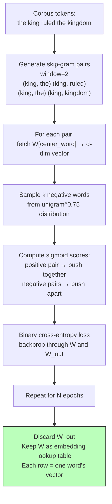

# Word Embeddings — Word2Vec from Scratch

## Learning Objectives

- Implement skip-gram with negative sampling from scratch in NumPy and train it on a raw text corpus
- Compute cosine similarity between learned embedding vectors to rank semantic neighbors
- Compare the computational cost of full softmax against negative sampling and explain why the reduction matters at vocabulary scale
- Build a title normalization function that maps raw input strings to canonical labels using embedding distance

## The Problem

TF-IDF knows that `dog` and `puppy` are different strings. It does not know they mean nearly the same thing. A classifier trained on documents containing `dog` cannot transfer any signal to a document about a `puppy` unless you hand-curate a synonym list. That approach fails on rare terms, domain jargon, company names, and every variation of job title your prospects type into LinkedIn.

The same problem shows up in GTM data. "VP Engineering" and "Head of Engineering" share zero signal in raw string form. "Director of RevOps" and "Revenue Operations Lead" are different tokens with no relationship. Your CRM has forty-seven spellings of "Chief Technology Officer." Exact-match logic and regex rules cannot keep up with the combinatorial explosion of how humans write the same role.

You want a representation where semantically similar words land close together in a vector space — where `dog` and `puppy` are neighbors, where `engineer` and `developer` cluster, and where a model trained on one transfers signal to the other for free. Word2Vec, published by Mikolov et al. in 2013, gave us that space using a two-layer neural network with no nonlinearity. The architecture is simple enough to build in fifty lines of NumPy. The weight matrix it produces became the foundation for a decade of NLP.

## The Concept

The **distributional hypothesis** (Firth, 1957) states that you shall know a word by the company it keeps. If two words appear in similar contexts — surrounded by similar neighbors — they probably carry similar meaning. `king` tends to appear near `ruled`, `kingdom`, `queen`. `engineer` tends to appear near `built`, `system`, `code`. Word2Vec exploits this statistical regularity by training a network to predict context from a center word (skip-gram) or a center word from its context (CBOW). Skip-gram became the default because it handles rare words better, which matters when your corpus contains niche job titles and obscure technographics.

The network is intentionally shallow. Input is a one-hot vector over the vocabulary. A single weight matrix `W` of shape `(|V|, d)` projects that one-hot into a `d`-dimensional hidden layer with no activation function. A second matrix `W'` of shape `(d, |V|)` projects the hidden layer back up to a softmax over the full vocabulary. After training, you discard `W'`. The rows of `W` are your embeddings — one `d`-dimensional vector per word.

The bottleneck is the output softmax. Computing `P(context | center)` over a vocabulary of 100,000 words means 100,000 dot products per training step, times the gradient. **Negative sampling** sidesteps this by reframing the problem as binary classification: instead of predicting *which* word is the true context, predict whether a given word pair is real (drawn from the corpus) or fake (a randomly sampled negative). The loss function becomes sigmoid binary cross-entropy over `k` negative samples rather than softmax over the entire vocabulary. This reduces per-step complexity from `O(|V|)` to `O(k)`, where `k` is typically 5–20.



Once you have the embedding matrix, similarity becomes geometry. Two vectors pointing in the same direction represent words used in similar contexts. **Cosine similarity** — not Euclidean distance — is the right metric in high dimensions because it normalizes for vector magnitude. The dot product of two unit vectors is their cosine. In practice, you normalize all embeddings to unit length and compute dot products, which turns the expensive nearest-neighbor search into a matrix multiplication.

## Build It

This script trains skip-gram with negative sampling on a small corpus, then prints the resulting embeddings, nearest neighbors, and a cosine similarity matrix. The corpus is deliberately tiny — about 130 tokens — but contains two semantic clusters (royalty and engineering) that should emerge in the geometry.

```python
import numpy as np
from collections import Counter

np.random.seed(42)

corpus = """
the king ruled the kingdom with wisdom
the queen ruled the kingdom with grace
the king and the queen lived in the palace
the palace was in the kingdom
the king commanded the army of the kingdom
the queen commanded the court of the kingdom
the engineer built the system with skill
the developer built the system with precision
the engineer and the developer worked at the company
the company built software for customers
the developer wrote code for the system
the engineer wrote code for the platform
the king gave orders to the army
the queen gave orders to the court
the engineer gave updates to the manager
the developer gave updates to the manager
the manager led the team at the company
the director led the division at the company
sales revenue grew at the company
the customer bought software from the company
""".split()

word_counts = Counter(corpus)
vocab = sorted(word_counts.keys())
word2idx = {w: i for i, w in enumerate(vocab)}
idx2word = {i: w for w, i in word2idx.items()}
V = len(vocab)

print(f"Vocabulary: {V} words")
print(f"Corpus: {len(corpus)} tokens")

window = 2
pairs = []
idx_seq = [word2idx[w] for w in corpus]
for i, center in enumerate(idx_seq):
    for j in range(max(0, i - window), min(len(idx_seq), i + window + 1)):
        if j != i:
            pairs.append((center, idx_seq[j]))
print(f"Skip-gram pairs: {len(pairs)}")

D = 20
W_in = np.random.randn(V, D) * 0.01
W_out = np.random.randn(D, V) * 0.01

freqs = np.array([word_counts[w] ** 0.75 for w in vocab], dtype=np.float64)
freqs /= freqs.sum()

def sigmoid(x):
    return 1.0 / (1.0 + np.exp(-np.clip(x, -10, 10)))

lr = 0.05
epochs = 400
K = 5

print(f"\nTraining: D={D}, K={K}, lr={lr}, epochs={epochs}")
print("-" * 50)

for epoch in range(epochs):
    total_loss = 0.0
    np.random.shuffle(pairs)
    for center, context in pairs:
        h = W_in[center]

        negs = np.random.choice(V, size=K, p=freqs, replace=False)
        targets = np.concatenate([[context], negs])
        labels = np.zeros(K + 1)
        labels[0] = 1.0

        scores = sigmoid(h @ W_out[:, targets])