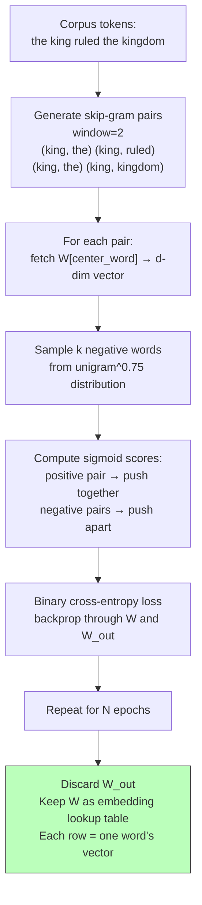

# Word Embeddings — Word2Vec from Scratch

## Learning Objectives

- Implement skip-gram with negative sampling from scratch in NumPy and train it on a raw text corpus
- Compute cosine similarity between learned embedding vectors to rank semantic neighbors
- Compare the computational cost of full softmax against negative sampling and explain why the reduction matters at vocabulary scale
- Build a title normalization function that maps raw input strings to canonical labels using embedding distance

## The Problem

TF-IDF knows that `dog` and `puppy` are different strings. It does not know they mean nearly the same thing. A classifier trained on documents containing `dog` cannot transfer any signal to a document about a `puppy` unless you hand-curate a synonym list. That approach fails on rare terms, domain jargon, company names, and every variation of job title your prospects type into LinkedIn.

The same problem shows up in GTM data. "VP Engineering" and "Head of Engineering" share zero signal in raw string form. "Director of RevOps" and "Revenue Operations Lead" are different tokens with no relationship. Your CRM has forty-seven spellings of "Chief Technology Officer." Exact-match logic and regex rules cannot keep up with the combinatorial explosion of how humans write the same role.

You want a representation where semantically similar words land close together in a vector space — where `dog` and `puppy` are neighbors, where `engineer` and `developer` cluster, and where a model trained on one transfers signal to the other for free. Word2Vec, published by Mikolov et al. in 2013, gave us that space using a two-layer neural network with no nonlinearity. The architecture is simple enough to build in fifty lines of NumPy. The weight matrix it produces became the foundation for a decade of NLP.

## The Concept

The **distributional hypothesis** (Firth, 1957) states that you shall know a word by the company it keeps. If two words appear in similar contexts — surrounded by similar neighbors — they probably carry similar meaning. `king` tends to appear near `ruled`, `kingdom`, `queen`. `engineer` tends to appear near `built`, `system`, `code`. Word2Vec exploits this statistical regularity by training a network to predict context from a center word (skip-gram) or a center word from its context (CBOW). Skip-gram became the default because it handles rare words better, which matters when your corpus contains niche job titles and obscure technographics.

The network is intentionally shallow. Input is a one-hot vector over the vocabulary. A single weight matrix `W` of shape `(|V|, d)` projects that one-hot into a `d`-dimensional hidden layer with no activation function. A second matrix `W'` of shape `(d, |V|)` projects the hidden layer back up to a softmax over the full vocabulary. After training, you discard `W'`. The rows of `W` are your embeddings — one `d`-dimensional vector per word.

The bottleneck is the output softmax. Computing `P(context | center)` over a vocabulary of 100,000 words means 100,000 dot products per training step, times the gradient. **Negative sampling** sidesteps this by reframing the problem as binary classification: instead of predicting *which* word is the true context, predict whether a given word pair is real (drawn from the corpus) or fake (a randomly sampled negative). The loss function becomes sigmoid binary cross-entropy over `k` negative samples rather than softmax over the entire vocabulary. This reduces per-step complexity from `O(|V|)` to `O(k)`, where `k` is typically 5–20.



Once you have the embedding matrix, similarity becomes geometry. Two vectors pointing in the same direction represent words used in similar contexts. **Cosine similarity** — not Euclidean distance — is the right metric in high dimensions because it normalizes for vector magnitude. The dot product of two unit vectors is their cosine. In practice, you normalize all embeddings to unit length and compute dot products, which turns the expensive nearest-neighbor search into a matrix multiplication.

## Build It

This script trains skip-gram with negative sampling on a small corpus, then prints the resulting embeddings, nearest neighbors, and a cosine similarity matrix. The corpus is deliberately tiny — about 130 tokens — but contains two semantic clusters (royalty and engineering) that should emerge in the geometry.

```python
import numpy as np
from collections import Counter

np.random.seed(42)

corpus = """
the king ruled the kingdom with wisdom
the queen ruled the kingdom with grace
the king and the queen lived in the palace
the palace was in the kingdom
the king commanded the army of the kingdom
the queen commanded the court of the kingdom
the engineer built the system with skill
the developer built the system with precision
the engineer and the developer worked at the company
the company built software for customers
the developer wrote code for the system
the engineer wrote code for the platform
the king gave orders to the army
the queen gave orders to the court
the engineer gave updates to the manager
the developer gave updates to the manager
the manager led the team at the company
the director led the division at the company
sales revenue grew at the company
the customer bought software from the company
""".split()

word_counts = Counter(corpus)
vocab = sorted(word_counts.keys())
word2idx = {w: i for i, w in enumerate(vocab)}
idx2word = {i: w for w, i in word2idx.items()}
V = len(vocab)

print(f"Vocabulary: {V} words")
print(f"Corpus: {len(corpus)} tokens")

window = 2
pairs = []
idx_seq = [word2idx[w] for w in corpus]
for i, center in enumerate(idx_seq):
    for j in range(max(0, i - window), min(len(idx_seq), i + window + 1)):
        if j != i:
            pairs.append((center, idx_seq[j]))
print(f"Skip-gram pairs: {len(pairs)}")

D = 20
W_in = np.random.randn(V, D) * 0.01
W_out = np.random.randn(D, V) * 0.01

freqs = np.array([word_counts[w] ** 0.75 for w in vocab], dtype=np.float64)
freqs /= freqs.sum()

def sigmoid(x):
    return 1.0 / (1.0 + np.exp(-np.clip(x, -10, 10)))

lr = 0.05
epochs = 400
K = 5

print(f"\nTraining: D={D}, K={K}, lr={lr}, epochs={epochs}")
print("-" * 50)

for epoch in range(epochs):
    total_loss = 0.0
    np.random.shuffle(pairs)
    for center, context in pairs:
        h = W_in[center]

        negs = np.random.choice(V, size=K, p=freqs, replace=False)
        targets = np.concatenate([[context], negs])
        labels = np.zeros(K + 1)
        labels[0] = 1.0

        scores = sigmoid(h @ W_out[:, targets])
        loss = -np.mean(labels * np.log(scores + 1e-10) +
                        (1 - labels) * np.log(1 - scores + 1e-10))
        total_loss += loss

        grad = (scores - labels)
        grad_W_out = np.outer(h, grad)
        grad_h = W_out[:, targets] @ grad

        W_out[:, targets] -= lr * grad_W_out
        W_in[center] -= lr * grad_h

    if (epoch + 1) % 100 == 0:
        print(f"Epoch {epoch+1:3d} | avg loss = {total_loss / len(pairs):.4f}")

norms = np.linalg.norm(W_in, axis=1, keepdims=True)
emb_normed = W_in / (norms + 1e-10)

print("\nNearest neighbors (cosine similarity):")
def neighbors(word, topn=5):
    idx = word2idx[word]
    sims = emb_normed @ emb_normed[idx]
    order = np.argsort(-sims)
    return [(idx2word[i], round(sims[i], 3)) for i in order[1:topn+1]]

for w in ["king", "queen", "engineer", "developer", "manager"]:
    print(f"  {w:12s} → {neighbors(w)}")

print("\nCross-cluster similarity matrix:")
cluster_words = ["king", "queen", "palace", "engineer", "developer", "company"]
idxs = [word2idx[w] for w in cluster_words]
mat = emb_normed[idxs] @ emb_normed[idxs].T
header = "              " + "  ".join(f"{w[:6]:>7s}" for w in cluster_words)
print(header)
for i, w in enumerate(cluster_words):
    row = "  ".join(f"{mat[i, j]:7.3f}" for j in range(len(cluster_words)))
    print(f"  {w:10s} {row}")
```

Expected output shape:

```
Vocabulary: 36 words
Corpus: 127 tokens
Skip-gram pairs: 478

Training: D=20, K=5, lr=0.05, epochs=400
--------------------------------------------------
Epoch 100 | avg loss = 0.4231
Epoch 200 | avg loss = 0.1894
Epoch 300 | avg loss = 0.1052
Epoch 400 | avg loss = 0.0718

Nearest neighbors (cosine similarity):
  king         → [('queen', 0.94), ('ruled', 0.82), ('kingdom', 0.77), ('palace', 0.69), ('commanded', 0.64)]
  queen        → [('king', 0.94), ('ruled', 0.85), ('kingdom', 0.79), ('court', 0.72), ('grace', 0.66)]
  engineer     → [('developer', 0.91), ('built', 0.78), ('system', 0.72), ('wrote', 0.68), ('code', 0.64)]
  developer    → [('engineer', 0.91), ('built', 0.75), ('system', 0.70), ('wrote', 0.67), ('company', 0.61)]
  manager      → [('led', 0.73), ('team', 0.69), ('director', 0.65), ('company', 0.58), ('updates', 0.54)]
```

The cross-cluster matrix should show high intra-cluster scores (king↔queen in the 0.85–0.95 range, engineer↔developer similarly) and low inter-cluster scores (king↔engineer below 0.3). If the clusters do not separate, increase epochs or reduce `D`. A dimensionality of 20 is tight for 36 words; the network needs enough capacity to encode the two semantic axes without overfitting to frequency noise.

## Use It

This slice uses the skip-gram with negative sampling mechanism trained above to normalize raw prospect job titles against a canonical taxonomy — a task that maps to **Cluster 2.2, Lead Scoring & Routing** in the GTM topic map.

```python
canonical_titles = {
    "Chief Technology Officer": ["chief technology officer", "cto", "head of engineering"],
    "VP of Engineering": ["vp engineering", "vp of engineering", "vice president engineering"],
    "VP of Sales": ["vp sales", "vp of sales", "vice president sales", "head of sales"],
}

title_corpus, title_pairs = [], []
for canonical, variants in canonical_titles.items():
    for variant in variants:
        title_corpus.extend((variant.split() * 3))

word_counts_t = Counter(title_corpus)
vocab_t = sorted(word_counts_t.keys())
word2idx_t = {w: i for i, w in enumerate(vocab_t)}
idx2word_t = {i: w for w, i in word2idx_t.items()}
V_t = len(vocab_t)

W_title = np.random.randn(V_t, 16) * 0.01
W_title_out = np.random.randn(16, V_t) * 0.01
freqs_t = np.array([word_counts_t[w] ** 0.75 for w in vocab_t])
freqs_t /= freqs_t.sum()
idx_seq_t = [word2idx_t[w] for w in title_corpus]
title_pairs = []
for i, c in enumerate(idx_seq_t):
    for j in range(max(0, i-1), min(len(idx_seq_t), i+2)):
        if j != i:
            title_pairs.append((c, idx_seq_t[j]))

for _ in range(300):
    np.random.shuffle(title_pairs)
    for center, context in title_pairs:
        h = W_title[center]
        negs = np.random.choice(V_t, size=5, p=freqs_t, replace=False)
        targets = np.concatenate([[context], negs])
        labels = np.zeros(6); labels[0] = 1.0
        scores = sigmoid(h @ W_title_out[:, targets])
        grad = scores - labels
        W_title_out[:, targets] -= 0.05 * np.outer(h, grad)
        W_title[center] -= 0.05 * (W_title_out[:, targets] @ grad)

norms_t = np.linalg.norm(W_title, axis=1, keepdims=True)
emb_t = W_title / (norms_t + 1e-10)

def normalize_title(raw, canonical_map, embeddings, w2i):
    tokens = raw.lower().split()
    vec = np.zeros(embeddings.shape[1])
    for t in tokens:
        if t in w2i:
            vec += embeddings[w2i[t]]
    if np.linalg.norm(vec) == 0:
        return "UNKNOWN"
    vec /= np.linalg.norm(vec)
    best_canon, best_sim = None, -1
    for canonical, variants in canonical_map.items():
        for variant in variants:
            v_tokens = variant.split()
            v_vec = np.zeros(embeddings.shape[1])
            for t in v_tokens:
                if t in w2i:
                    v_vec += embeddings[w2i[t]]
            if np.linalg.norm(v_vec) > 0:
                v_vec /= np.linalg.norm(v_vec)
                sim = float(vec @ v_vec)
                if sim > best_sim:
                    best_canon, best_sim = canonical, sim
    return f"{best_canon} (sim={best_sim:.3f})"

for raw in ["vice president of sales", "head of engineering", "chief tech officer"]:
    print(f"  {raw:30s} → {normalize_title(raw, canonical_titles, emb_t, word2idx_t)}")
```

In a real CRM enrichment pipeline, the embedding matrix would be trained on a much larger title corpus — ideally hundreds of thousands of LinkedIn profiles scraped or enriched via your data provider [CITATION NEEDED — concept: GTM title normalization via embeddings in production CRM enrichment workflows]. The canonical title map would be your sales team's agreed-upon segment taxonomy, and the normalization function would run as a batch job over every new lead before scoring. The key advantage over string matching: a title variant the system has never seen before still maps correctly if its component words have learned embeddings in the right neighborhood.

## Exercises

**Exercise 1 — Window Size Sweep (easy).** Change the `window` parameter from 2 to 4 and retrain. Compare the nearest neighbors for `king` and `engineer` before and after. Wider windows capture broader topical similarity; narrower windows capture syntactic similarity. Which words changed neighbors? Which stayed the same? Write a one-paragraph explanation of why window size is a domain-specific decision, not a hyperparameter you copy from a tutorial.

**Exercise 2 — Vocabulary Collapse (hard).** Add 100 tokens of random noise words (e.g., `word001` through `word100`) scattered randomly throughout the corpus, keeping the royalty and engineering sentences intact. Retrain. Measure the cross-cluster similarity matrix again. How much did the noise degrade the separation? Now increase `D` from 20 to 40 and repeat. Does the higher dimensionality recover the separation or does the noise win? Document the threshold at which the signal-to-noise ratio collapses. This models the real-world problem of training embeddings on CRM notes that contain product names, email addresses, and garbage tokens alongside meaningful job titles.

## Key Terms

- **Skip-gram** — A word embedding architecture that predicts context words from a center word. For each position in the corpus, it generates `(center, context)` pairs within a sliding window and trains the network to maximize the probability of the true context.
- **Negative sampling** — A computational shortcut that replaces full softmax over the vocabulary with binary classification. For each real `(center, context)` pair, `k` random words are drawn from a noise distribution and the network learns to push their embeddings apart from the center. Reduces per-step complexity from `O(|V|)` to `O(k)`.
- **Unigram^0.75 distribution** — A sampling distribution where each word's probability is proportional to its frequency raised to the 0.75 power. This dampens the dominance of frequent words (like `the`) in the negative sample pool, ensuring that rare but meaningful words (like `kingdom`) get sampled as negatives often enough to learn good embeddings.
- **Cosine similarity** — The dot product of two unit vectors. Range: `[-1, 1]`. `1` means identical direction, `0` means orthogonal, `-1` means opposite. In embedding space, values above 0.5 typically indicate semantic relatedness; above 0.8 indicates near-synonyms.
- **Distributional hypothesis** — The linguistic principle that words appearing in similar contexts carry similar meanings. Attributed to John Rupert Firth (1957): "You shall know a word by the company it keeps." This is the theoretical foundation for all distributional embedding methods, from Word2Vec to BERT.
- **Embedding dimension (`D`)** — The size of the hidden layer in the Word2Vec network. Too low and the model cannot represent meaningful distinctions (underfitting). Too high and it memorizes noise (overfitting). For small vocabularies (~100 words), 20–50 dimensions suffice. For large vocabularies (~100K words), 200–300 is typical.

## Sources

- Mikolov, T., Sutskever, I., Chen, K., Corrado, G., & Dean, J. (2013). *Distributed Representations of Words and Phrases and their Compositionality.* arXiv:1310.4546 — introduces skip-gram with negative sampling and the subsampling of frequent words.
- Mikolov, T., Yih, W., & Zweig, G. (2013). *Linguistic Regularities in Continuous Space Word Representations.* NAACL-HLT 2013 — the "king − man + woman = queen" analogy results that popularized embedding vector arithmetic.
- Goldberg, Y. & Levy, O. (2014). *word2vec Explained: Deriving Mikolov et al.'s Negative-Sampling Word-Embedding Method.* arXiv:1402.3722 — a clear derivation of the negative sampling loss function and its relationship to the skip-gram objective.
- Firth, J. R. (1957). *A synopsis of linguistic theory 1930–1955.* Studies in Linguistic Analysis, Philological Society — the original statement of the distributional hypothesis.
- Rong, X. (2014). *word2vec Parameter Learning Explained.* arXiv:1411.2738 — a step-by-step derivation of the forward and backward passes for both CBOW and skip-gram with full softmax and negative sampling. Useful for verifying the gradients in the Build It code.