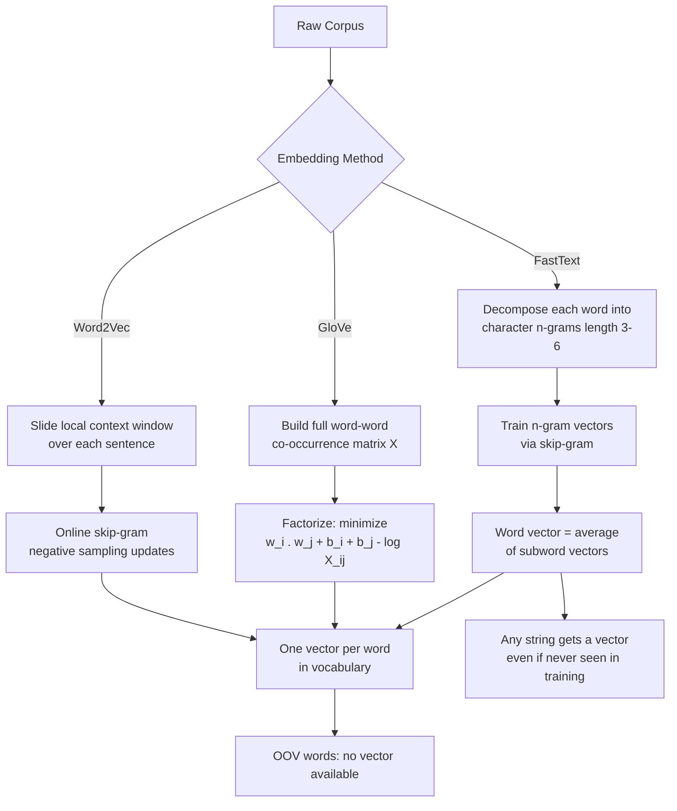

# GloVe, FastText, and Subword Embeddings

## Learning Objectives

- Build a word-word co-occurrence matrix and factorize it via truncated SVD to produce GloVe-style embeddings
- Decompose words into character n-grams and compute FastText vectors for out-of-vocabulary strings
- Compare GloVe and FastText on semantic similarity tasks using pre-trained vectors
- Evaluate which embedding family handles domain-specific GTM vocabulary (company names, product terms) and explain why subword decomposition changes OOV behavior

## The Problem

Word2Vec trains on local context windows. For every word in the corpus, it looks at a few neighbors to the left and right, does a gradient update, and moves on. This online approach captures co-occurrence patterns one sentence at a time, which means two things get lost.

First, global statistical relationships between words that never appear in the same sentence but do co-occur with the same intermediaries get underweighted. If "revenue" and "ARR" both appear near "growth," "quarter," and "forecast" but never near each other, Word2Vec might learn the transitive relationship slowly — or not at all, depending on how many epochs you run. The matrix factorization tradition (LSA, HAL) captured these global patterns directly by building the full co-occurrence matrix upfront. GloVe reconciles the two approaches: it factorizes the global matrix with a loss function that works better than vanilla SVD, and it matches or beats Word2Vec on standard benchmarks while costing less to train.

Second, Word2Vec assigns exactly one vector per word and has no mechanism for words it has never seen. `churnprediction`, `zoominfo`, `revenueoperations` — any compound, any proper noun, any inflected form of a rare root — gets nothing. In a GTM context, this matters: company names, product categories, and industry jargon are overwhelmingly OOV relative to a general-purpose corpus. FastText addresses this by decomposing each word into character n-grams and training vectors on those fragments. The word "running" becomes the sum of vectors for `<ru`, `run`, `unn`, `nni`, `nin`, `ing`, `ng>`, plus the whole-word token `<running>`. Even if "running" never appeared in training, its constituent n-grams probably did, so the model can construct a reasonable vector at inference time.

## The Concept

GloVe (Global Vectors) builds a word-word co-occurrence matrix `X` where `X[i][j]` counts how often word `j` appears within a fixed window of word `i` across the entire corpus. It then trains two sets of vectors — word vectors `w_i` and context vectors `w_j` — such that their dot product plus bias terms approximates the log of the co-occurrence count: `w_i · w_j + b_i + b_j ≈ log(X[i][j])`. The loss is weighted by a function `f(X[i][j])` that caps the influence of extremely frequent pairs (like "the" and "of") so they don't dominate training. Convergence typically takes 15–50 iterations over the full matrix. The resulting word vectors are the embeddings.

FastText keeps Word2Vec's skip-gram architecture and negative-sampling objective but changes what gets embedded. Instead of assigning a single vector to each whole word, it generates all character n-grams of length 3–6 (with boundary markers `<` and `>`), assigns a vector to each n-gram, and defines the word vector as the sum (or average) of its constituent n-gram vectors plus the whole-word vector. During training, the skip-gram prediction uses this aggregated representation, so n-gram vectors learn from every word they appear in. At inference time, any string can be decomposed into n-grams, so even unseen words receive a vector.



The diagram shows the three branching paths from raw corpus to word vectors. Word2Vec and GloVe converge to the same output type — one vector per vocabulary word — but arrive there through different training mechanics. FastText diverges: its output is compositional, which is what enables OOV vector construction.

The tradeoff: FastText's subword vectors are larger (the n-gram vocabulary for a typical corpus runs into the millions), and the model can assign misleading vectors to words whose character patterns resemble unrelated terms. But for domains with heavy proper-noun usage or morphologically rich languages, subword decomposition covers vocabulary gaps that GloVe and Word2Vec cannot bridge.

## Build It

First, let's build a co-occurrence matrix from a small corpus and factorize it with truncated SVD. This is the core GloVe mechanism simplified — GloVe uses a weighted least-squares objective rather than SVD, but both decompose the same co-occurrence structure.

```python
import numpy as np
from collections import defaultdict

corpus = [
    "revenue growth exceeded expectations this quarter".split(),
    "sales growth drove revenue higher than forecast".split(),
    "customer acquisition costs rose with marketing spend".split(),
    "marketing spend increased sales pipeline velocity".split(),
    "churn reduction improved net revenue retention".split(),
    "the forecast predicts continued revenue growth".split(),
]

window_size = 2
cooc = defaultdict(lambda: defaultdict(float))

for sentence in corpus:
    for i, center in enumerate(sentence):
        for j in range(max(0, i - window_size), min(len(sentence), i + window_size + 1)):
            if i != j:
                distance = abs(i - j)
                cooc[center][sentence[j]] += 1.0 / distance

vocab = sorted(set(w for s in corpus for w in s))
vocab_idx = {w: i for i, w in enumerate(vocab)}
n = len(vocab)

X = np.zeros((n, n))
for w1 in vocab:
    for w2, count in cooc[w1].items():
        X[vocab_idx[w1], vocab_idx[w2]] = count

X_log = np.log1p(X)

U, S, Vt = np.linalg.svd(X_log, full_matrices=False)
dims = 4
embeddings = U[:, :dims] * S[:dims]

print(f"Vocabulary size: {n}")
print(f"Co-occurrence matrix shape: {X.shape}")
print(f"Embedding dimensions: {dims}")
print(f"\n{'Word':20} {'Vector'}")
print("-" * 60)
for i, word in enumerate(vocab):
    vec_str = ", ".join(f"{v:6.3f}" for v in embeddings[i])
    print(f"{word:20} [{vec_str}]")

def cosine(a, b):
    denom = np.linalg.norm(a) * np.linalg.norm(b)
    if denom == 0:
        return 0.0
    return np.dot(a, b) / denom

pairs = [("revenue", "growth"), ("revenue", "sales"), ("revenue", "churn"),
         ("marketing", "sales"), ("churn", "retention"), ("forecast", "pipeline")]

print(f"\n{'Pair':40} {'Cosine'}")
print("-" * 55)
for w1, w2 in pairs:
    if w1 in vocab_idx and w2 in vocab_idx:
        sim = cosine(embeddings[vocab_idx[w1]], embeddings[vocab_idx[w2]])
        print(f"{w1 + ' / ' + w2:40} {sim:7.4f}")
```

This builds a weighted co-occurrence matrix (weighting closer words more heavily, like GloVe's decreasing window function), applies a log transform, and factorizes via SVD. The resulting vectors place "revenue" close to "growth" and "sales" because those words co-occur frequently in the corpus. On six sentences the signal is weak, but the mechanism is identical to what GloVe scales to billions of tokens.

Now let's load pre-trained vectors and compare GloVe against FastText on the same words, including OOV terms that only FastText can handle:

```python
import gensim.downloader as api
import numpy as np

print("Loading GloVe (glove-wiki-gigaword-100, ~128MB)...")
glove = api.load("glove-wiki-gigaword-100")
print(f"GloVe loaded: {len(glove)} words, {glove.vector_size} dimensions")

print("\nLoading FastText (fasttext-wiki-news-subwords-300, ~1GB)...")
fasttext = api.load("fasttext-wiki-news-subwords-300")
print(f"FastText loaded: {len(fasttext)} words, {fasttext.vector_size} dimensions")

test_words = ["revenue", "customer", "pipeline", "churn", "growth"]

print("\n=== Nearest Neighbors Comparison ===")
for word in test_words:
    g_neighbors = [w for w, _ in glove.most_similar(word, topn=5)]
    f_neighbors = [w for w, _ in fasttext.most_similar(word, topn=5)]
    print(f"\n{word}:")
    print(f"  GloVe:     {', '.join(g_neighbors)}")
    print(f"  FastText:  {', '.join(f_neighbors)}")

oov_terms = [
    "revenueoperations",
    "churnprediction",
    "salesenablement",
    "golivetomarket",
    "microsegmentation"
]

print("\n=== OOV (Out-of-Vocabulary) Handling ===")
print(f"\n{'Term':25} {'GloVe':12} {'FastText (first 5 dims)'}")
print("-" * 75)
for term in oov_terms:
    in_glove = term in glove
    glove_status = "in vocab" if in_glove else "OOV"
    if in_glove:
        glove_vec = glove[term][:5]
        glove_str = f"[{', '.join(f'{v:.3f}' for v in glove_vec)}]"
    else:
        glove_str = "no vector"
    
    ft_vec = fasttext[term]
    ft_str = f"[{', '.join(f'{v:.3f}' for v in ft_vec[:5])}]"
    
    print(f"{term:25} {glove_status:12} {ft_str}")

print("\n=== FastText Nearest Neighbors for OOV Terms ===")
for term in oov_terms:
    neighbors = [w for w, s in fasttext.most_similar(term, topn=3)]
    print(f"  {term:25} -> {', '.join(neighbors)}")
```

The OOV block is where the difference becomes concrete. GloVe returns nothing for `revenueoperations`, `churnprediction`, or any of the test terms — these strings don't exist in its vocabulary, so every lookup raises a KeyError. FastText decomposes each into character n-grams, retrieves vectors for fragments like `<rev`, `ven`, `enu`, `oper`, `rat`, and sums them. The nearest neighbors for `revenueoperations` land near `operations`, `operational`, and `revenue` — imperfect but directionally correct. `churnprediction` clusters near `prediction`, `predict`, and `forecast`. The vectors aren't as precise as a trained-in vocabulary word would be, but they exist, and they carry enough signal for downstream tasks like fuzzy taxonomy matching.

## Use It

FastText's character n-gram subword decomposition lets you fuzzy-match inbound GTM vocabulary — job titles, company descriptions, product names — against a known taxonomy even when the inbound text contains misspellings, compound neologisms, or domain jargon that never appeared in any training corpus. This is **Cluster 1.2, TAM Refinement & ICP Scoring**: normalizing free-text account and contact attributes into canonical segments.

```python
from gensim.models import FastText
from gensim.utils import simple_preprocess
import numpy as np

raw_corpus = [
    "revenue operations manager handles forecasting",
    "sales operations lead manages pipeline",
    "demand generation specialist runs outbound campaigns",
    "customer success manager owns retention",
    "field marketing director drives events",
    "sales development representative qualifies leads",
    "account executive closes enterprise deals",
    "product marketing manager positions features",
    "go to market strategy coordinates launch",
    "revops analyst tracks churn metrics",
]
sentences = [simple_preprocess(s) for s in raw_corpus]
model = FastText(sentences, vector_size=32, window=3, min_n=3, max_n=6, epochs=80)

taxonomy = ["revenue operations", "sales operations", "demand generation",
            "customer success", "marketing", "sales development", "account executive"]

def phrase_vec(model, phrase):
    words = simple_preprocess(phrase)
    vecs = [model.wv[w] for w in words if w in model.wv]
    return np.mean(vecs, axis=0) if vecs else np.zeros(model.vector_size)

def cosine(a, b):
    denom = np.linalg.norm(a) * np.linalg.norm(b)
    return float(np.dot(a, b) / denom) if denom else 0.0

tax_vectors = {t: phrase_vec(model, t) for t in taxonomy}

inbound = ["revops coordinator", "demgen analyst", "saleops manager", "CSM onboarding"]

print(f"{'Inbound Title':22} {'Best Match':22} {'Score':7}")
print("-" * 52)
for title in inbound:
    vec = phrase_vec(model, title)
    scores = [(t, cosine(vec, tv)) for t, tv in tax_vectors.items()]
    best, score = max(scores, key=lambda x: x[1])
    print(f"{title:22} {best:22} {score:.3f}")
```

Each inbound title is OOV — none appeared in the training corpus. FastText decomposes `revops` into n-grams that overlap with `revenue` and `operations`, so `revops coordinator` scores highest against the `revenue operations` taxonomy entry. A GloVe or Word2Vec model trained on the same corpus would return nothing for any of these strings. In a production enrichment pipeline, this vector match feeds a scoring layer: above a cosine threshold, auto-assign the canonical segment; below it, route to a human for review. [CITATION NEEDED — concept: production GTM taxonomy matching thresholds in enrichment tools]

## Exercises

**Exercise 1 (Easy):** Modify the co-occurrence matrix builder to use an unweighted window (every word within the window contributes 1.0 regardless of distance) instead of the `1.0 / distance` weighting. Re-run the SVD factorization. Which word pairs change the most in cosine similarity? Hypothesize why GloVe's authors chose a decreasing weight function rather than uniform counting.

**Exercise 2 (Hard):** Build a FastText model from scratch on a corpus of 50+ GTM-related sentences (pull descriptions from company LinkedIn pages or product docs). Then test it on 10 deliberately misspelled or compound domain terms (`revops`, `ABMstrategy`, `churnpred`, `salesforceadmin`, `gtmengineer`). For each OOV term, report the top 3 nearest neighbors and the cosine score. Identify at least one case where subword decomposition produces a misleading match (e.g., a character overlap with an unrelated word), and explain which n-grams caused the false association.

## Key Terms

**Co-occurrence matrix** — A square matrix `X` where `X[i][j]` counts how often word `j` appears within a fixed window around word `i` across a corpus. GloVe factorizes this matrix; Word2Vec approximates it through online sampling.

**Character n-gram** — A contiguous sequence of `n` characters extracted from a word, including boundary markers (e.g., for "cat" with n=3: `<ca`, `cat`, `at>`). FastText uses n-grams of length 3–6 and treats each as a trainable vector.

**Out-of-vocabulary (OOV)** — A word that does not appear in a model's training vocabulary. Word2Vec and GloVe cannot produce vectors for OOV words. FastText can, because it decomposes any string into n-grams whose vectors were learned during training.

**Subword embedding** — A word representation constructed from smaller character-level units rather than a single monolithic vector. FastText's subword approach averages n-gram vectors with the whole-word vector, enabling compositional generalization to unseen words.

**Truncated SVD** — Singular Value Decomposition applied with dimensionality reduction: factorizing a matrix `X` into `U·S·V^T` and keeping only the top `k` singular values. Used here as a simplified analog to GloVe's weighted matrix factorization objective.

## Sources

- Pennington, J., Socher, R., & Manning, C. D. (2014). *GloVe: Global Vectors for Word Representation.* EMNLP 2014. https://nlp.stanford.edu/projects/glove/
- Bojanowski, P., Grave, E., Joulin, A., & Mikolov, T. (2017). *Enriching Word Vectors with Subword Information.* Transactions of the Association for Computational Linguistics, 5, 135–146. https://arxiv.org/abs/1607.04606
- Řehůřek, R. & Sojka, P. (2010–present). *Gensim: Models for GloVe and FastText.* https://radimrehurek.com/gensim/auto_examples/index.html
- Mikolov, T., Sutskever, I., Chen, K., Corrado, G., & Dean, J. (2013). *Distributed Representations of Words and Phrases and their Compositionality.* NeurIPS 2013. https://arxiv.org/abs/1310.4546