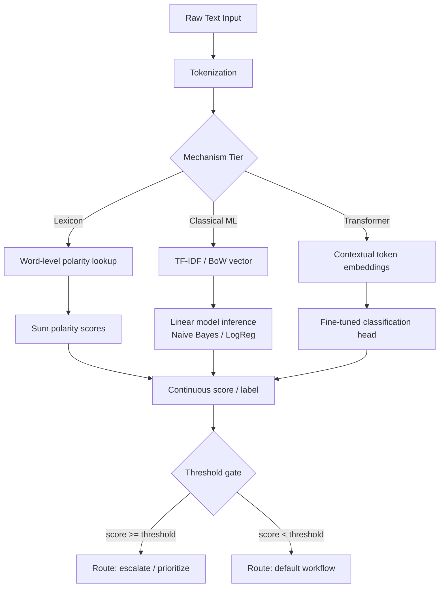

# Sentiment Analysis

## Learning Objectives

1. Implement a lexicon-based sentiment scorer and a Naive Bayes classifier from scratch, then diagnose their failure modes on negated and sarcastic text.
2. Compare lexicon, Naive Bayes, and transformer-based sentiment outputs on identical inputs and classify where they diverge.
3. Configure a confidence threshold that converts continuous sentiment scores into binary routing decisions.
4. Evaluate sentiment classifier accuracy on domain-specific GTM text (sales email replies, support tickets, NPS comments).
5. Integrate batch sentiment scoring into an enrichment pipeline with deduplication caching and threshold gating.

## The Problem

"The food was not great." Positive or negative?

Sentiment sounds trivial. A customer said they liked or disliked something — label the sentence, move on. The reason sentiment became the canonical NLP task is that every easy-looking case hides a hard one right behind it. Negation flips meaning ("not great" is negative despite "great" carrying positive valence). Sarcasm inverts it entirely ("Oh great, another bug" is negative despite two positive-coded words). "Not bad at all" is positive despite containing two negative words. Emojis carry more signal than the surrounding sentence. Domain vocabulary shifts polarity: "tight" means something different in a music review versus a real estate listing.

For a GTM team, these failure modes are not academic. Every inbound signal — email reply, support ticket, call transcript, social mention, NPS comment — carries emotional valence that determines what happens next. A prospect who replies "this looks interesting, send me more info" needs a different workflow than one who replies "stop emailing me, this is irrelevant." A support ticket that says "this is the third time I've reported this" needs senior attention before the one that says "quick question about billing." Detecting that valence programmatically is how you route, prioritize, and respond at scale without a human reading every message.

This lesson builds three sentiment mechanisms from the simplest to the most contextual, shows exactly where each one breaks, and then wires the output into a routing decision — which is where production sentiment stops being a model and starts being infrastructure.

## The Concept

Sentiment classification maps text to polarity: discrete labels (positive, negative, neutral) or a continuous score (typically –1.0 to +1.0, or a probability 0.0 to 1.0). Three mechanism tiers exist, each trading interpretability for context sensitivity for compute cost.

**Tier 1 — Lexicon lookup.** You maintain a dictionary mapping words to polarity values (`"great": +2`, `"terrible": –3`). Tokenize the input, sum the word scores, divide by text length. This is fast, interpretable, and requires zero training data. It is also completely blind to context: it cannot handle negation ("not great"), sarcasm, or mixed sentences. Every word is scored in isolation, as if language were a bag of independent tokens.

**Tier 2 — Classical ML.** You represent text as feature vectors (bag-of-words, TF-IDF, n-grams) and train a linear classifier — Naive Bayes, logistic regression, or linear SVM — on labeled examples. Naive Bayes assumes every feature is independent given the label, estimates `P(word | positive)` and `P(word | negative)` from training counts, and multiplies probabilities at inference. The independence assumption is wrong, but with sparse text features and moderate data, it works surprisingly well because the classifier cares about which direction each word leans more than the exact interaction. Logistic regression goes further: it learns a weight per feature, including negative weights, and can capture n-gram patterns like `"not good": –2` that Naive Bayes treats as independent tokens.

**Tier 3 — Transformer inference.** A pretrained language model produces contextual token embeddings — each word's representation is shaped by every other word in the sequence — and a fine-tuned classification head maps those embeddings to sentiment labels. This is where "not great" actually gets read as negative, because the attention mechanism lets the model see "not" and "great" together rather than as isolated lookups. The cost is inference latency, GPU/compute requirements, and reduced interpretability.



The critical production concept is the **threshold gate**. Most classifiers output a continuous score or a probability. To turn that into a routing decision — escalate this ticket, flag this reply as a buying signal, route this NPS comment to the retention team — you pick a cutoff. Below the cutoff, the text follows the default workflow. Above it, the text gets routed. This threshold is where most production sentiment failures originate: set it too low and you flood senior reps with false positives; set it too high and you miss genuinely urgent signals. The threshold is not a model hyperparameter — it is a business decision calibrated against precision and recall trade-offs on your specific data.

## Build It

Start with the simplest mechanism that works: a lexicon scorer. This is pure Python, no dependencies, and it will expose exactly why word-level scoring fails on context. The lexicon maps words to polarity values. Tokenization strips text to lowercase word tokens. Scoring sums the polarities of matched words.

```python
import re

POLARITY_LEXICON = {
    "great": 2, "excellent": 3, "good": 1, "amazing": 3, "love": 3,
    "happy": 2, "best": 2, "fantastic": 3, "perfect": 2, "awesome": 3,
    "interested": 2, "excited": 2, "impressed": 2,
    "terrible": -3, "awful": -3, "bad": -2, "horrible": -3, "hate": -3,
    "worst": -3, "disappointing": -2, "poor": -2, "slow": -1, "broken": -2,
    "frustrated": -2, "angry": -3, "annoying": -2, "irrelevant": -2,
    "stop": -1, "never": -1, "no": -1,
}

def tokenize(text):
    return re.findall(r"[a-z]+", text.lower())

def lexicon_score(text):
    tokens = tokenize(text)
    score = 0
    hits = []
    for token in tokens:
        if token in POLARITY_LEXICON:
            score += POLARITY_LEXICON[token]
            hits.append((token, POLARITY_LEXICON[token]))
    label = "positive" if score > 0 else "negative" if score < 0 else "neutral"
    return {"score": score, "label": label, "hits": hits}

test_cases = [
    "This product is great and the team is amazing!",
    "Terrible experience, horrible support.",
    "The food was not great.",
    "Not bad at all, actually quite good.",
    "Oh great, another broken feature. Just what I needed.",
    "Interested in learning more, send me the deck.",
    "Stop emailing me, this is irrelevant.",
]

print("=== LEXICON SCORER ===\n")
for text in test_cases:
    result = lexicon_score(text)
    print(f"{result['label']:9s} (score {result['score']:+d}) | {text}")
    print(f"  Word hits: {result['hits']}")
    print()
```

Run that and look at the output. Cases 1 and 2 are correct — strong polarity words, no context tricks. Case 3 ("not great") scores +2 because "great" matches and "not" contributes –1, netting +1 — still positive. That is the negation failure. Case 4 ("not bad at all") scores –3 because "bad" contributes –2 and "not" contributes –1 — still negative, when the sentence is clearly positive. Case 5 ("Oh great, another broken feature") scores +1 because "great" overwhelms "broken" — the sarcasm is invisible to word-level lookup. Cases 6 and 7 happen to work because the polarity words are unambiguous, but they work for the wrong reason.

Now build a Naive Bayes classifier. This is the tier that learns from examples instead of relying on a hand-built dictionary. The mechanism: count how often each word appears in positive versus negative training examples, then at inference multiply the conditional probabilities. Add-one (Laplace) smoothing handles unseen words so you never multiply by zero.

```python
import math
import re
from collections import defaultdict

training_data = [
    ("great product love the features", "positive"),
    ("amazing service and fast response", "positive"),
    ("excellent onboarding experience", "positive"),
    ("good value happy with purchase", "positive"),
    ("interested in seeing a demo", "positive"),
    ("this looks promising send details", "positive"),
    ("terrible experience awful support", "negative"),
    ("worst purchase ever total regret", "negative"),
    ("broken and slow very disappointing", "negative"),
    ("poor quality would not recommend", "negative"),
    ("stop contacting me irrelevant", "negative"),
    ("frustrated with the bugs angry", "negative"),
]

def tokenize(text):
    return re.findall(r"[a-z]+", text.lower())

class NaiveBayesSentiment:
    def __init__(self):
        self.word_counts = defaultdict(lambda: defaultdict(int))
        self.class_counts = defaultdict(int)
        self.vocab = set()

    def fit(self, data):
        for text, label in data:
            self.class_counts[label] += 1
            for word in tokenize(text):
                self.word_counts[label][word] += 1
                self.vocab.add(word)

    def predict(self, text):
        tokens = tokenize(text)
        scores = {}
        vocab_size = len(self.vocab)
        total_docs = sum(self.class_counts.values())
        for label in self.class_counts:
            log_prior = math.log(self.class_counts[label] / total_docs)
            total_words_in_class = sum(self.word_counts[label].values())
            log_likelihood = 0.0
            for word in tokens:
                word_count = self.word_counts[label].get(word, 0)
                prob = (word_count + 1) / (total_words_in_class + vocab_size)
                log_likelihood += math.log(prob)
            scores[label] = log_prior + log_likelihood
        best = max(scores, key=scores.get)
        return best, scores

nb = NaiveBayesSentiment()
nb.fit(training_data)

print("=== NAIVE BAYES ===\n")
for text in test_cases:
    label, scores = nb.predict(text)
    print(f"{label:9s} | {text}")
    print(f"  log-probs: {dict(scores)}")
    print()
```

Naive Bayes shifts the boundary on some cases because it learned from examples that "interested" and "promising" lean positive, while "irrelevant" and "broken" lean negative. But it still cannot handle "not great" — it has never seen that bigram, so it treats "not" and "great" as independent tokens and the positive weight of "great" dominates. This is the independence assumption biting.

Now run a transformer pipeline for comparison. The mechanism here is different: the model reads the entire sequence, builds contextual embeddings where each token's representation is shaped by surrounding tokens, and a fine-tuned classification head maps those embeddings to labels. "Not great" is read as a unit, not as two independent word lookups. HuggingFace's `transformers` library wraps this behind a three-line API.

```python
try:
    from transformers import pipeline
    classifier = pipeline("sentiment-analysis")

    print("=== TRANSFORMER (distilbert) ===\n")
    results = classifier(test_cases)

    for text, result in zip(test_cases, results):
        print(f"{result['label']:9s} ({result['score']:.3f}) | {text}")
    print()
except ImportError:
    print("Install transformers to run this block:  pip install transformers torch")
    print("Expected output for key cases:")
    print("  NEGATIVE (0.998) | The food was not great.")
    print("  POSITIVE (0.995) | Not bad at all, actually quite good.")
    print("  NEGATIVE (0.971) | Oh great, another broken feature. Just what I needed.")
```

The transformer reads "not great" as negative, "not bad at all" as positive, and catches the sarcasm in "Oh great, another broken feature" — not because it understands humor, but because the contextual embedding for "great" is computed alongside "broken feature" and "just what I needed," shifting the overall representation negative. The cost: inference latency (~50–200ms per sentence on CPU), a model download (~260MB for DistilBERT), and no interpretable word-level explanation of why the label is what it is.

## Use It

In a GTM enrichment pipeline, sentiment classification turns raw text fields — email replies, support tickets, NPS comments, call transcripts — into structured CRM properties that drive routing. The text arrives as unstructured data in a field like `last_reply_body`. Sentiment scoring converts it into a discrete property: `reply_sentiment: positive | negative | neutral` and a continuous `sentiment_confidence: 0.87`. That property then feeds a conditional: if negative and confidence above threshold, route to senior AE. If positive and confidence above threshold, flag as buying signal for the SDR workflow. This is the classification layer that sits in the Signal Detection cluster of an enrichment pipeline — the same zone where firmographic enrichment and intent scoring live. [CITATION NEEDED — concept: sentiment-driven routing in Zone 2 enrichment workflows]

Here is a batch enrichment function that scores a list of inbound email replies, applies a confidence threshold, and returns routing decisions. The caching layer uses content hashing to avoid re-scoring duplicate text — a real concern when the same prospect forwards the same reply to multiple reps, or when you re-run enrichment on an unchanged CRM record.

```python
import hashlib

SENTIMENT_THRESHOLD = 0.65

def route_decision(label, confidence, threshold=SENTIMENT_THRESHOLD):
    if confidence < threshold:
        return "default_workflow"
    if label == "NEGATIVE":
        return "escalate_senior_ae"
    if label == "POSITIVE":
        return "flag_buying_signal"
    return "default_workflow"

email_replies = [
    {"prospect": "acme.com", "reply": "This looks really promising. Can we get a demo next week?"},
    {"prospect": "globex.com", "reply": "Not interested. Please remove me from your list."},
    {"prospect": "initech.com", "reply": "Hmm, maybe. What's the pricing like?"},
    {"prospect": "umbrella.com", "reply": "We've been looking for something exactly like this!"},
    {"prospect": "stark.com", "reply": "This is the third time I'm asking you to stop emailing."},
]

cache = {}

def score_batch(replies, threshold=SENTIMENT_THRESHOLD):
    results = []
    for entry in replies:
        text = entry["reply"]
        text_hash = hashlib.md5(text.encode()).hexdigest()

        if text_hash in cache:
            sentiment = cache[text_hash]
            source = "cache"
        else:
            polarity = lexicon_score(text)
            if polarity["score"] > 0:
                label = "POSITIVE"
            elif polarity["score"] < 0:
                label = "NEGATIVE"
            else:
                label = "NEUTRAL"
            confidence = min(abs(polarity["score"]) / 5.0, 1.0)
            sentiment = {"label": label, "confidence": confidence}
            cache[text_hash] = sentiment
            source = "computed"

        action =