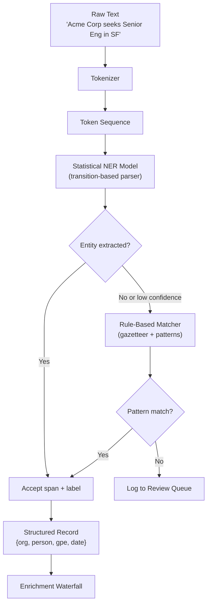

# Named Entity Recognition

## Learning Objectives

1. Extract named entities from raw text using a pre-trained spaCy pipeline and print labeled spans with character offsets.
2. Compare statistical and rule-based entity extraction by running both on the same document and examining what each catches and misses.
3. Implement BIO tagging logic to label token sequences with entity boundaries.
4. Evaluate extraction precision against hand-labeled ground truth on real job postings.
5. Configure a batched NER pipeline with confidence-based fallback to rule-based matchers for production use.

## The Problem

Every inbound signal a GTM team touches — job postings, press releases, LinkedIn bios, support tickets — arrives as unstructured text. A job posting is just a string of characters until something parses it into structured fields: company, role, location, date, tech stack. Without that extraction step, you are hand-reading every signal or passing raw blobs to downstream systems that cannot use them.

Named Entity Recognition (NER) is the mechanism that converts text into structured records. It identifies spans of text that refer to specific entity types — organizations, people, geographic locations, dates, products — and labels them. The output is not a summary or a paraphrase. It is a set of typed, bounded spans with character offsets that you can serialize into JSON and hand to the next stage of a pipeline.

The hard part is ambiguity. "Apple" can be a company or a fruit. "Washington" can be a person, a city, or a state. "March" can be a month or a verb. A good NER system resolves these using context — the words surrounding the token. A bad one misses multi-token entities, confuses types, and labels common nouns as entities. The difference between good and bad extraction is the difference between a clean enrichment pipeline and one that requires manual cleanup on every record.

## The Concept

NER treats entity extraction as a token-classification problem. The input is a sequence of tokens (words and subwords produced by a tokenizer). The output is a label for each token. The **BIO tagging scheme** (Begin, Inside, Outside) encodes entity boundaries: `B-ORG` marks the first token of an organization name, `I-ORG` marks continuation tokens, and `O` marks any token outside an entity.

Consider the sentence "Apple hired Sarah Chen in New York." The BIO labels would be:

```
Apple    B-ORG
hired    O
Sarah    B-PERSON
Chen     I-PERSON
in       O
New      B-GPE
York     I-GPE
.        O
```

Multi-token entities chain their `I-` tags. A model that learns BIO can extract arbitrary spans without knowing entity length in advance.

Two families of approaches solve this problem, and production systems combine both:

**Rule-based matchers** use dictionaries, regex patterns, and gazetteer lookups. They are fast, deterministic, and completely blind to entities they were not programmed to recognize. If you build a matcher for job titles containing the word "Engineer," it will catch "Senior Software Engineer" and miss "Staff Technologist" because nobody wrote that pattern.

**Statistical models** learn token-label associations from labeled training data. The progression runs from Hidden Markov Models (HMMs, which compute emission and transition probabilities) through Conditional Random Fields (CRFs, which add arbitrary features like capitalization and word shape) to transformer-based architectures that attend to full context windows. The key advantage: a statistical model can learn that "Apple" is an ORG when followed by "hired" but a PRODUCT when followed by "iPhone." The cost: slower inference, and a dependence on training data that reflects your domain.

spaCy implements both. The `en_core_web_sm` pipeline uses a transition-based parser with greedy decoding for its statistical NER component, and the `Matcher` class provides the rule-based path. The following diagram shows how a production pipeline chains them — the statistical model attempts extraction first, and a rule-based matcher patches gaps, mirroring the waterfall fallback pattern used in enrichment workflows:



The fallback path — statistical model first, rule-based patcher second, review queue for the rest — is the same architecture pattern Clay's enrichment waterfall uses at the provider level: try the primary source, fall back to the secondary, flag the misses.

## Build It

Start by installing spaCy and downloading the small English pipeline. Run this in your terminal:

```bash
pip install spacy && python -m spacy download en_core_web_sm
```

Now extract entities from a job posting using the statistical model:

```python
import spacy

nlp = spacy.load("en_core_web_sm")

text = """Acme Corp is hiring a Senior Backend Engineer in San Francisco.
The role requires 5+ years of experience with Python, Kubernetes, and PostgreSQL.
Candidates should apply by March 15, 2024. Contact Jane Smith for details.
The position reports to the VP of Engineering, Michael Torres."""

doc = nlp(text)

print(f"{'TEXT':<35s} {'LABEL':<12s} {'START':<8s} {'END':<8s}")
print("-" * 63)
for ent in doc.ents:
    print(f"{ent.text:<35s} {ent.label_:<12s} {str(ent.start_char):<8s} {str(ent.end_char)}")
```

The output shows every entity the statistical model detected. You will see `Acme Corp` as ORG, `San Francisco` as GPE, `March 15, 2024` as DATE, `Jane Smith` and `Michael Torres` as PERSON. But notice what is missing: `Senior Backend Engineer` is not labeled as a job title, `Python` and `Kubernetes` and `PostgreSQL` are not labeled as technologies, and `VP of Engineering` is not captured as a role. The small model was trained on general English text (OntoNotes 5), not job postings. This is the gap that a rule-based matcher fills.

Now add a `Matcher` to catch what the statistical model misses:

```python
from spacy.matcher import Matcher
import spacy

nlp = spacy.load("en_core_web_sm")
matcher = Matcher(nlp.vocab)

title_patterns = [
    [{"LOWER": {"IN": ["senior", "junior", "staff", "principal", "lead"]}},
     {"LOWER": {"IN": ["backend", "frontend", "full", "data", "ml", "devops",
                        "security", "product", "software", "platform", "cloud"]}, "OP": "?"},
     {"LOWER": {"IN": ["stack"]}, "OP": "?"},
     {"LOWER": {"IN": ["engineer", "developer", "scientist", "architect",
                        "manager", "designer", "analyst"]}}],
    [{"LOWER": {"IN": ["vp", "director", "head"]}},
     {"LOWER": "of", "OP": "?"},
     {"LOWER": {"IN": ["engineering", "product", "design", "marketing",
                        "sales", "data", "security", "operations"]}}],
]

tech_patterns = [
    [{"LOWER": {"IN": ["python", "javascript", "typescript", "go", "rust", "java",
                        "react", "vue", "angular", "kubernetes", "docker",
                        "aws", "gcp", "azure", "postgresql", "mysql", "redis",
                        "kafka", "spark", "pytorch", "tensorflow", "scala",
                        "ruby", "node"]}}],
]

matcher.add("JOB_TITLE", title_patterns)
matcher.add("TECH_STACK", tech_patterns)

text = """Acme Corp is hiring a Senior Backend Engineer in San Francisco.
The role requires 5+ years of experience with Python, Kubernetes, and PostgreSQL.
Candidates should apply by March 15, 2024. Contact Jane Smith for details.
The position reports to the VP of Engineering, Michael Torres."""

doc = nlp(text)
matches = matcher(doc)

print("RULE-BASED MATCHER:")
print(f"{'TYPE':<15s} {'TEXT':<35s} {'SPAN'}")
print("-" * 60)
for match_id, start, end in matches:
    label = nlp.vocab.strings[match_id]
    span = doc[start:end]
    print(f"{label:<15s} {span.text:<35s} [{start}:{end}]")

print("\nSTATISTICAL MODEL:")
print(f"{'LABEL':<15s} {'TEXT':<35s}")
print("-" * 50)
for ent in doc.ents:
    print(f"{ent.label_:<15s} {ent.text:<35s}")
```

Run both on the same text. The statistical model catches `Acme Corp`, `San Francisco`, `Jane Smith`, `Michael Torres`, and the date. The matcher catches `Senior Backend Engineer`, `VP of Engineering`, `Python`, `Kubernetes`, and `PostgreSQL`. Neither alone gives you the full picture. Together they cover the entity types that matter for a job posting record.

The BIO tagging scheme that drives the statistical model is observable in spaCy's token-level output. You can inspect it directly:

```python
import spacy

nlp = spacy.load("en_core_web_sm")

text = "Apple hired Sarah Chen in New York."
doc = nlp(text)

print(f"{'TOKEN':<15s} {'POS':<8s} {'BIO-Annotated Entity':<25s} {'Is Entity?'}")
print("-" * 60)
for token in doc:
    ent_type = token.ent_type_ if token.ent_type_ else "O"
    ent_iob = token.ent_iob_ if token.ent_iob_ else ""
    bio_label = f"{ent_iob}-{ent_type}" if ent_iob else ent_type
    is_entity = token.ent_type_ != ""
    print(f"{token.text:<15s} {token.pos_:<8s} {bio_label:<25s} {is_entity}")
```

This prints each token with its IOB prefix (`B` for beginning, `I` for inside, `O` for outside) and entity type. That is the raw output the parser produces before spaCy assembles tokens into entity spans. The span assembly is mechanical: collect consecutive `B-X I-X I-X` sequences, emit a span with the type and character offsets.

## Use It

NER sits in the **Enrichment zone (Zone 2)** of a GTM engineering stack. The enrichment zone takes raw signals — a URL, an email, a job posting string — and extracts structured attributes that downstream zones consume. NER is the extraction mechanism that turns unstructured text into those attributes. A job posting arrives as a blob of text. NER pulls the company name, the location, the role, and optionally the tech stack. Those fields become the input to company enrichment lookups, ICP scoring, and routing logic in a Clay workflow where the data is enriched, ICP-scored, and routed to an owner [CITATION NEEDED — concept: Clay workflow enrichment → ICP scoring → routing pipeline].

The structured record NER produces is what the Clay waterfall consumes. A waterfall tries one data provider, checks whether it returned a result, and falls back to the next provider if it did not. NER operates the same way internally: the statistical model tries first, the rule-based matcher falls back, and anything missed goes to a review queue. The waterfall is provider-level fallback; NER's statistical-plus-rule architecture is model-level fallback. Same pattern, different layer.

Here is the extraction step producing structured records that a downstream enrichment pipeline would consume:

```python
import spacy
from spacy.matcher import Matcher
import json

nlp = spacy.load("en_core_web_sm")
matcher = Matcher(nlp.vocab)

matcher.add("JOB_TITLE", [[
    {"LOWER": {"IN": ["senior", "junior", "staff", "principal", "lead"]}},
    {"LOWER": {"IN