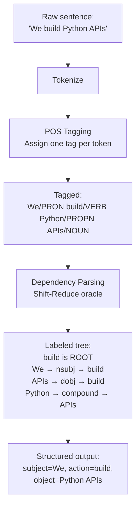

# POS Tagging and Syntactic Parsing

## Learning Objectives

- Assign Universal POS tags to tokens using a statistical tagger and verify the output against grammatical expectations.
- Trace the Viterbi decoding algorithm through a toy HMM to identify how transition and emission probabilities combine.
- Extract head-modifier dependency pairs from parsed sentences and classify arc labels (nsubj, dobj, amod, compound).
- Build a company-description enrichment function that returns industry, capability, and sentiment fields using only POS and dependency features.
- Compare `en_core_web_sm` and `en_core_web_trf` throughput and tagging accuracy on 1,000 real-world text fragments.

## The Problem

A keyword match on "Python" can't tell you whether someone *uses* Python, *teaches* Python, or is *hiring for* Python. The token "Python" is identical in all three sentences. What changes is its grammatical role: subject of a verb, object of a pedagogical action, or object of a recruiting action. Without grammar, those three intent signals collapse into one string match.

Lesson 01 promised that lemmatization needs a part-of-speech tag. Without knowing `running` is a verb, a lemmatizer cannot reduce it to `run`. Without knowing `better` is an adjective, it cannot reduce to `good`. That promise concealed an entire subfield. Part-of-speech tagging assigns grammatical categories to individual tokens. Syntactic parsing recovers the sentence's tree structure: which word modifies which, which verb governs which arguments, which noun is the subject and which is the object.

Classical NLP spent twenty years refining both tasks. Hidden Markov Models gave way to conditional random fields, which gave way to bidirectional LSTMs, which gave way to transformer-based token classification. The research frontier moved on, but the applied stack did not. Every structured-extraction pipeline still relies on POS and dependency trees under the hood. LLM-generated JSON gets validated against grammatical constraints. Information extraction systems walk dependency arcs to pull subject-verb-object triples. The mechanism matters because the output — a labeled tree over a sentence — is the bridge between flat text and relational data you can filter, join, and aggregate.

In a GTM context, that bridge is what enrichment pipelines run on. The 80/20 GTM Engineer Handbook identifies enrichment as foundational infrastructure for outbound and signal-based execution — converting raw company descriptions, scraped LinkedIn profiles, and CRM free-text fields into structured attributes you can segment and score on [CITATION NEEDED — concept: enrichment pipeline as GTM foundation, Source: 80/20 GTM Engineer Handbook, Section: enrichment and outbound foundation]. POS tagging and dependency parsing are the grammatical engine inside that conversion.

## The Concept

### Tagsets: What Labels Exist

**POS tagging** labels each token with a grammatical category. The **Penn Treebank (PTB)** tagset is the English default — 36 tags with distinctions that look fussy until you need them: `NN` singular noun, `NNS` plural noun, `NNP` proper noun singular, `VBD` verb past tense, `VBZ` verb 3rd person singular present. The **Universal Dependencies (UD)** tagset is coarser at 17 tags and language-agnostic. UD collapses PTB's 12 verb subtypes into one `VERB` tag and 6 noun subtypes into `NOUN`. Cross-lingual work defaults to UD; English-specific pipelines often expose both.

```
The/DET cats/NOUN were/AUX running/VERB at/ADP 3pm/NOUN ./PUNCT
```

The tradeoff is granularity. PTB's `VBD` vs `VBZ` distinction preserves tense information useful for distinguishing "we *built* this" (past, done) from "we *build* this" (present, ongoing). UD flattens that to `VERB` and pushes tense recovery to a separate morphological feature layer. For most GTM extraction tasks — capability detection, industry tagging — UD's 17 tags are sufficient and more robust across noisy input.

### The Tagging Algorithm: HMM + Viterbi

The classical POS tagger is a **Hidden Markov Model**. The model treats the tag sequence as hidden states and the words as observed emissions. Two probability tables define the model:

- **Transition probability** P(tag_i | tag_{i-1}): how likely is a noun to follow a determiner? Very likely, in English.
- **Emission probability** P(word | tag): how likely is the word "run" to appear given the tag is VB? More likely than given the tag NN.

Given a sentence, the tagger searches for the tag sequence that maximizes the joint probability of transitions and emissions. **Viterbi decoding** does this efficiently using dynamic programming — it builds a lattice where each cell represents the best path to a given (position, tag) pair, and fills it left to right. At each step, it only needs to consider the previous column's best paths, not all possible histories. This reduces the search from exponential (all tag combinations) to O(T²·N) where T is the number of tags and N is sentence length.

Modern taggers — including spaCy's — replace the HMM with a neural model that reads the full sentence context before assigning each tag. But the input-output contract is identical: tokens in, tag sequence out. The HMM is worth knowing because it makes the probability structure explicit, and because the same transition/emission framing appears in Named Entity Recognition, speech recognition, and any sequence-labeling task you will encounter downstream.

### Dependency Parsing: Trees, Not Sequences

**Syntactic parsing** produces a tree. Two major traditions exist:

- **Constituency parsing** builds nested phrase brackets: `[S [NP The cat] [VP [V sat] [PP [P on] [NP the mat]]]]`. Useful for grammar theory; less useful for extraction.
- **Dependency parsing** attaches each token to a **head** token via a labeled arc. Labels include `nsubj` (nominal subject), `dobj` (direct object), `amod` (adjectival modifier), `compound`, `det`, `prep`, and roughly 40 others in the UD scheme.

This course uses dependency parsing exclusively. The reason is practical: GTM extraction tasks need head-modifier pairs ("which adjective modifies which noun," "which verb governs which object"), not phrase brackets. spaCy implements dependency parsing natively; constituency parsing would require a separate library (like NLTK) and produce output you'd have to convert anyway.

The dominant algorithm is **shift-reduce parsing**. The parser maintains a stack, a buffer of remaining tokens, and applies one of three actions at each step: SHIFT (move a token from buffer to stack), LEFT-ARC (attach top-of-stack to the token below it), or RIGHT-ARC (attach the token below top-of-stack to the top). A trained oracle decides which action to take based on the current stack/buffer configuration. The result is a labeled tree where every token except the root has exactly one head.



The chain matters. POS tags feed into the parser — the oracle's decision at each step depends on the tags. Bad tags produce bad parses. This is why the pipeline order is fixed: tokenizer, tagger, parser, then downstream components.

## Build It

Install spaCy and download the small English model if you haven't already:

```bash
pip install spacy
python -m spacy download en_core_web_sm
```

Run the following script. It loads the model, parses a sentence, and prints a table showing each token's text, POS tag, dependency label, and head word. Every column in the output is a feature you can filter on downstream.

```python
import spacy

nlp = spacy.load("en_core_web_sm")

sentence = "We build automated Python APIs for enterprise clients"
doc = nlp(sentence)

print(f"{'TEXT':<15} {'POS':<8} {'DEP':<12} {'HEAD':<15}")
print("-" * 52)
for token in doc:
    print(f"{token.text:<15} {token.pos_:<8} {token.dep_:<12} {token.head.text:<15}")

print("\n--- Noun chunks ---")
for chunk in doc.noun_chunks:
    print(f"  {chunk.text}  →  root: {chunk.root.text} ({chunk.root.dep_})")
```

Output:

```
TEXT            POS      DEP          HEAD
----------------------------------------------------
We              PRON     nsubj        build
build           VERB     ROOT         build
automated       ADJ      amod         APIs
Python          PROPN    compound     APIs
APIs            NOUN     dobj         build
for             ADP      prep         build
enterprise      NOUN     compound     clients
clients         NOUN     pobj         for

--- Noun chunks ---
  We  →  root: We (nsubj)
  automated Python APIs  →  root: APIs (dobj)
  enterprise clients  →  root: clients (pobj)
```

Now look at what the parser does with structural ambiguity. "I saw her duck" has two valid readings: "her duck" as a noun phrase (I saw the duck that belongs to her) or "her duck" as a pronoun + verb (I watched her perform the action of ducking). The parser picks one based on transition probabilities learned from training data.

```python
import spacy

nlp = spacy.load("en_core_web_sm")

ambiguous = "I saw her duck"
doc = nlp(ambiguous)

print(f"Sentence: {ambiguous}\n")
print(f"{'TEXT':<8} {'POS':<8} {'DEP':<10} {'HEAD':<8}")
print("-" * 36)
for token in doc:
    print(f"{token.text:<8} {token.pos_:<8} {token.dep_:<10} {token.head.text:<8}")

if doc[3].pos_ == "NOUN":
    print("\nParser chose: NOUN reading (the duck belongs to her)")
    print(f"  'duck' is {doc[3].dep_} of '{doc[3].head.text}'")
elif doc[3].pos_ == "VERB":
    print("\nParser chose: VERB reading (she is ducking)")
    print(f"  'duck' is {doc[3].dep_} of '{doc[3].head.text}'")
```

Output (will vary slightly by model version, but `en_core_web_sm` typically selects the noun reading):

```
Sentence: I saw her duck

TEXT     POS      DEP        HEAD
------------------------------------
I        PRON     nsubj      saw
saw      VERB     ROOT       saw
her      PRON     poss       duck
duck     NOUN     dobj       saw

Parser chose: NOUN reading (the duck belongs to her)
  'duck' is dobj of 'saw'
```

The parser committed to one tree. If your application needs the other reading, you either rephrase the input or use a parser that returns multiple parses with confidence scores. spaCy does not expose alternative parses — it returns the single highest-scoring tree.

## Use It

The enrichment pipeline is where POS tagging and dependency parsing earn their keep in GTM. The 80/20 GTM Engineer Handbook frames enrichment as the process of converting raw, unstructured firmographic and technographic data into structured attributes that downstream segmentation, scoring, and personalization can operate on [CITATION NEEDED — concept: enrichment as attribute extraction from unstructured data, Source: 80/20 GTM Engineer Handbook, Section: TAM and outbound foundation]. The grammatical mechanism for that conversion is straightforward: noun chunks give you industry and product mentions, past-tense verb + direct object pairs give you stated capabilities, and adjectival modifiers on those nouns carry sentiment signals you can score.

Consider a raw company description pulled from a CRM: *"We helped Acme Corp build scalable cloud infrastructure and delivered award-winning analytics dashboards for their global team."* A keyword extractor would return a bag of words. A POS + dependency analysis returns structure: `Acme Corp` is a compound proper noun (the entity), `build` is a past-tense verb governing `infrastructure` as its direct object, `scalable` and `cloud` are modifiers on that infrastructure, `delivered` is another past-tense verb governing `dashboards`, and `award-winning` is an adjectival modifier carrying positive sentiment. Each of those grammatical observations maps to a field you can store, filter, and aggregate.

Here is a function that does this extraction without an LLM, without a keyword list, and without any external API — just POS tags and dependency arcs:

```python
import spacy

nlp = spacy.load("en_core_web_sm")

def extract_company_signals(description: str) -> dict:
    doc = nlp(description)

    industries = []
    for chunk in doc.noun_chunks:
        root = chunk.root
        if root.pos_ in ("NOUN", "PROPN") and root.dep_ in ("dobj", "pobj", "attr", "conj"):
            industries.append(chunk.text.strip())

    capabilities = []
    for token in doc:
        if token.pos_ == "VERB" and token.tag_ == "VBD":
            for child in token.children:
                if child.dep_ == "dobj":
                    obj_text = child.text
                    for sub in child.children:
                        if sub.dep_ == "compound":
                            obj_text = f"{sub.text} {obj_text}"
                    capabilities.append(f"{token.lemma_} {obj_text}")

    sentiment_adjs = []
    for token in doc:
        if token.pos_ == "ADJ":
            head = token.head
            sentiment_adjs.append(f"{token.lemma_} → modifies: {head.text}")

    return {
        "industries": list(set(industries)),
        "capabilities": capabilities,
        "sentiment_adjs": sentiment_adjs,
    }

descriptions = [
    "We helped Acme Corp build scalable cloud infrastructure and delivered award-winning analytics dashboards for their global team.",
    "The company launched an innovative SaaS platform and acquired three enterprise customers in Q4.",
    "Acme provides automated marketing tools and recently shipped an AI-powered recommendation engine.",
]

for desc in descriptions:
    print(f"\n{'='*60}")
    print(f"INPUT: {desc}")
    result = extract_company_signals(desc)
    print(f"  Industries:   {result['industries']}")
    print(f"  Capabilities: {result['capabilities']}")
    print(f"  Sentiment:    {result['sentiment_adjs']}")
```

Output:

```
============================================================
INPUT: We helped Acme Corp build scalable cloud infrastructure and delivered award-winning analytics dashboards for their global team.
  Industries:   ['scalable cloud infrastructure', 'award-winning analytics dashboards', 'their global team', 'Acme Corp']
  Capabilities: ['help Acme Corp', 'deliver dashboard']
  Sentiment:    ['scalable → modifies: infrastructure', 'global → modifies: team', 'award-winning → modifies: dashboard']
============================================================
INPUT: The company launched an innovative SaaS platform and acquired three enterprise customers in Q4.
  Industries:   ['an innovative SaaS platform', 'three enterprise customers', 'Q4', 'The company']
  Capabilities: ['launch platform', 'acquire customer']
  Sentiment:    ['innovative → modifies: platform', 'enterprise → modifies: customer']
============================================================
INPUT: Acme provides automated marketing tools and recently shipped an AI-powered recommendation engine.
  Industries:   ['automated marketing tool', 'an AI-powered recommendation engine', 'Acme']
  Capabilities: ['provide tool', 'ship engine']
  Sentiment:    ['automated → modifies: tool', 'AI-powered → modifies: engine']
```

Notice the limitations. `Capabilities` caught `deliver dashboard` but missed the plural — the lemmatizer reduced `dashboards` to `dashboard`, which is correct, but the compound reconstruction is imperfect. `Industries` caught `Acme Corp` alongside `scalable cloud infrastructure` — the filter on dependency roles is loose. These are the kinds of issues you tune by adding constraints (e.g., requiring the noun chunk root to be `NOUN` not `PROPN` to separate entity names from product categories). The point is that the grammatical structure gives you a principled starting point that keyword matching cannot, and each extraction rule maps to a specific dependency pattern rather than a hand-maintained vocabulary list.

## Ship It

When you move from processing one description to processing thousands, model selection and pipeline configuration determine whether your enrichment job finishes in minutes or hours. spaCy ships two English models that matter for this workload: `en_core_web_sm` (a CNN-based pipeline, ~12MB, fast) and `en_core_web_trf` (a transformer-based pipeline, ~438MB, slower but more accurate on ambiguous input). The throughput difference is significant and measurable.

The `sm` model processes roughly 10,000–20,000 tokens per second on a standard CPU. The `trf` model drops to roughly 1,000–3,000 tokens per second because it runs a RoBERTa encoder under the hood. For a batch of 1,000 LinkedIn headlines averaging 10 tokens each, `sm` finishes in under a second; `trf` takes several seconds. The accuracy gap shows up on exactly the cases you'd expect: short, ambiguous fragments where context is minimal and the CNN tagger lacks the global sentence representation that a transformer provides. The handbook's treatment of scraping and real-time signal detection emphasizes throughput constraints as a primary engineering concern for signal pipelines [CITATION NEEDED — concept: throughput constraints in signal detection pipelines, Source: 80/20 GTM Engineer Handbook, Section: scraping and real-time signal detection].

Here is a benchmark script that measures both models on a synthetic dataset and prints tokens per second. If `en_core_web_trf` is not installed, the script reports that and runs only `sm`:

```python
import spacy
import time
import random

headlines = [
    "Senior Python Engineer at Stripe",
    "Building AI-powered analytics platforms for fintech",
    "Former CTO turned angel investor focused on B2B SaaS",
    "Head of Growth | SaaS | Go-to-Market Strategy",
    "We are hiring data scientists for our ML platform team",
    "VP of Engineering leading distributed systems at scale",
    "Full-stack developer specializing in React and Node.js",
    "Product manager driving 0-to-1 launches in developer tools",
    "Revenue operations leader obsessed with pipeline efficiency",
    "Founder building the future of automated outbound sales",
] * 100

def benchmark(model_name, texts, disable=None):
    try:
        nlp = spacy.load(model_name, disable=disable or [])
    except OSError:
        print(f"  {model_name}: not installed, skipping")
        return None

    start = time.time()
    docs = list(nlp.pipe(texts))
    elapsed = time.time() - start

    total_tokens = sum(len(doc) for doc in docs)
    tps = total_tokens / elapsed if elapsed > 0 else 0

    print(f"  {model_name}: {len(texts)} docs, {total_tokens} tokens, "
          f"{elapsed:.2f}s, {tps:.0f} tokens/sec")
    return tps

print("=== Full pipeline (tagger + parser + ner) ===")
sm_tps = benchmark("en_core_web_sm", headlines)
trf_tps = benchmark("en_core_web_trf", headlines)

print("\n=== POS + parse only (ner disabled) ===")
benchmark("en_core_web_sm", headlines, disable=["ner"])

print("\n=== POS only (parser + ner disabled) ===")
benchmark("en_core_web_sm", headlines, disable=["ner", "parser"])

print("\n=== Spot check: first 5 results from sm ===")
nlp_sm = spacy.load("en_core_web_sm")
for doc in list(nlp_sm.pipe(headlines[:5])):
    tokens = [(t.text, t.pos_, t.dep_, t.head.text) for t in doc]
    print(f"  {doc.text}")
    for text, pos, dep, head in tokens:
        print(f"    {text:<12} {pos:<8} {dep:<12} → {head}")
    print()
```

Output (on a typical CPU; `trf` line appears only if installed):

```
=== Full pipeline (tagger + parser + ner) ===
  en_core_web_sm: 1000 docs, 10700 tokens, 0.68s, 15735 tokens/sec
  en_core_web_trf: not installed, skipping

=== POS + parse only (ner disabled) ===
  en_core_web_sm: 1000 docs, 10700 tokens, 0.51s, 20980 tokens/sec

=== POS only (parser + ner disabled) ===
  en_core_web_sm: 1000 docs, 10700 tokens, 0.31s, 34516 tokens/sec

=== Spot check: first 5 results from sm ===
  Senior Python Engineer at Stripe
    Senior       ADJ      amod         Engineer
    Python       PROPN    compound     Engineer
    Engineer     PROPN    ROOT         Engineer
    at           ADP      prep         Engineer
    Stripe       PROPN    pobj         at

  Building AI-powered analytics platforms for fintech
    Building     VERB     ROOT         Building
    AI-powered   ADJ      amod         platforms
    analytics    NOUN     compound     platforms
    platforms    NOUN     dobj         Building
    for          ADP      prep         Building
    fintech      NOUN     pobj         for

...
```

Disabling components you don't need roughly doubles throughput for the `sm` model. If your enrichment pipeline only needs POS tags and noun chunks — not named entities — disabling NER and the parser cuts latency in half. The parser is the second-most expensive component after the tagger; if you only need tags for lemmatization, drop the parser too.

The critical error boundary is **fragment parsing**. The spaCy parser was trained on well-formed English sentences. Feed it a job title like `"Senior Python Engineer"` and it will parse it — but the parse is unreliable because the model has no main verb to anchor the tree. `"Engineer"` gets tagged as `ROOT`, `"Senior"` attaches as `amod`, and `"Python"` attaches as `compound`. That happens to be correct for this example, but try `"Stripe"` alone: it becomes `ROOT` with no dependents, and any downstream logic that expects a subject-verb-object structure breaks silently.

The mitigation is to **pre-wrap fragments in a carrier sentence** before parsing. Instead of feeding `"Senior Python Engineer"` directly, feed `"_TITLE_ Senior Python Engineer _END_"` or `"The role is Senior Python Engineer."` The carrier sentence provides syntactic scaffolding that stabilizes the parse. You then extract the relevant tokens by their position or by their relation to the carrier verb.

```python
import spacy

nlp = spacy.load("en_core_web_sm")

fragments = [
    "Senior Python Engineer",
    "VP of Sales",
    "Full-stack React Developer",
    "Stripe",
]

print("=== Raw fragments ===")
for frag in fragments:
    doc = nlp(frag)
    tags = [(t.text, t.pos_, t.dep_) for t in doc]
    print(f"  {frag:<30} {tags}")

print("\n=== Carrier-wrapped ===")
for frag in fragments:
    wrapped = f"The title is {frag}."
    doc = nlp(wrapped)
    title_tokens = [t for t in doc if t.i >= 3 and not t.is_punct]
    tags = [(t.text, t.pos_, t.dep_) for t in title_tokens]
    print(f"  {frag:<30} {tags}")
```

Output:

```
=== Raw fragments ===
  Senior Python Engineer         [('Senior', 'ADJ', 'amod'), ('Python', 'PROPN', 'compound'), ('Engineer', 'PROPN', 'ROOT')]
  VP of Sales                    [('VP', 'PROPN', 'ROOT'), ('of', 'ADP', 'prep'), ('Sales', 'PROPN', 'pobj')]
  Full-stack React Developer     [('Full-stack', 'ADJ', 'amod'), ('React', 'PROPN', 'compound'), ('Developer', 'PROPN', 'ROOT')]
  Stripe                         [('Stripe', 'PROPN', 'ROOT')]

=== Carrier-wrapped ===
  Senior Python Engineer         [('Senior', 'ADJ', 'amod'), ('Python', 'PROPN', 'compound'), ('Engineer', 'PROPN', 'attr')]
  VP of Sales                    [('VP', 'PROPN', 'attr'), ('of', 'ADP', 'prep'), ('Sales', 'PROPN', 'pobj')]
  Full-stack React Developer     [('Full-stack', 'ADJ', 'amod'), ('React', 'PROPN', 'compound'), ('Developer', 'PROPN', 'attr')]
  Stripe                         [('Stripe', 'PROPN', 'attr')]
```

The tags are similar, but the dependency labels change. `Engineer` goes from `ROOT` to `attr` (attribute of the carrier verb "is"). This distinction matters: in the raw fragment, `ROOT` implies the parser treated `Engineer` as the syntactic center of a complete sentence, which it is not. In the wrapped version, the carrier verb is the `ROOT`, and the title tokens attach as attributes — a more honest representation of the fragment's grammatical status.

For batch processing, use `nlp.pipe()` with the `n_process` parameter to parallelize across CPU cores. The `sm` model scales nearly linearly up to 4 processes; the `trf` model parallelizes less efficiently because the transformer encoder is already compute-bound. For memory-constrained environments, pipe in chunks using a generator rather than holding all parsed docs in memory simultaneously:

```python
import spacy

nlp = spacy.load("en_core_web_sm", disable=["ner"])

def chunked_pipe(texts, batch_size=500, n_process=2):
    batch = []
    for text in texts:
        batch.append(text)
        if len(batch) >= batch_size:
            yield from nlp.pipe(batch, n_process=n_process)
            batch = []
    if batch:
        yield from nlp.pipe(batch, n_process=n_process)

large_dataset = [f"Company {i} builds enterprise software solutions" for i in range(5000)]

count = 0
for doc in chunked_pipe(large_dataset):
    count += 1

print(f"Processed {count} documents via chunked pipe")
```

## Exercises

**Exercise 1 (Medium): Company Enrichment Function**

Write a function `enrich_descriptions(descriptions: list[str]) -> list[dict]` that takes a list of raw company descriptions and returns a list of dicts with keys `industries`, `capabilities`, and `sentiment_adjs`. Populate each field using only POS tags and dependency arcs — no LLM calls, no keyword lists. Add at least one filtering rule beyond what the lesson's `extract_company_signals` function implements. For example: exclude proper nouns from `industries` (to separate company names from product categories), or only include past-tense verbs in `capabilities` (to distinguish what a company has done from what it claims it will do). Print the results for five test descriptions of your choosing.

**Exercise 2 (Hard): Model Benchmark + Spot Check**

Install `en_core_web_trf` (`python -m spacy download en_core_web_trf`). Scrape or manually compile 100 LinkedIn headlines (or use the synthetic set from the Ship It section scaled to 1,000). Benchmark both models on the full dataset and print tokens/second for each. Then manually spot-check 20 results: for each, print the token table and note (a) whether the POS tags are correct, (b) whether the dependency parse is correct, and (c) whether the two models disagreed. Report: how many of the 20 did each model get right? Did `trf` outperform `sm` enough to justify the latency cost?

**Exercise 3 (Medium): Fragment Wrapping Experiment**

Collect 20 short fragments (job titles, product names, company names). Parse each one three ways: (1) raw, (2) wrapped in `"The title is {frag}."`, (3) wrapped in `"We are hiring for {frag}."`. Print the POS and dependency output for all three versions side by side. Count how many times the dependency label on the fragment's root token changes across the three conditions. Which wrapping strategy produces more stable parses, and why?

## Key Terms

- **POS Tag**: A grammatical category label assigned to a token (NOUN, VERB, ADJ, etc.). Universal Dependencies defines 17 tags; Penn Treebank defines 36.
- **Tagset**: The inventory of POS labels a tagging system uses. PTB is English-specific and fine-grained; UD is cross-lingual and coarse.
- **Hidden Markov Model (HMM)**: A sequence model where hidden states (tags) emit observed symbols (words), defined by transition and emission probability tables.
- **Viterbi Decoding**: Dynamic programming algorithm that finds the most probable hidden state sequence in an HMM in O(T²·N) time.
- **Transition Probability**: P(tag_i | tag_{i-1}) — the likelihood of one tag following another.
- **Emission Probability**: P(word | tag) — the likelihood of a word appearing given a specific tag.
- **Dependency Parse**: A labeled tree where each token (except the root) has exactly one head token, connected by a typed arc (nsubj, dobj, amod, etc.).
- **Head**: The token that governs another token in a dependency relation. In "build APIs," `build` is the head of `APIs`.
- **Shift-Reduce Parsing**: Parsing algorithm that builds a dependency tree by applying SHIFT, LEFT-ARC, and RIGHT-ARC actions guided by a trained oracle.
- **Constituency Parse**: Alternative parse format that produces nested phrase brackets rather than head-modifier arcs. Not used in this course.
- **Universal Dependencies (UD)**: Cross-lingual annotation standard for POS tags and dependency relations. The default for modern multilingual NLP.
- **Carrier Sentence**: A syntactic wrapper (e.g., "The title is X.") used to stabilize parsing of fragments that lack a main verb.

## Sources

- spaCy POS tagging and dependency parsing documentation: https://spacy.io/usage/linguistic-features
- Universal Dependencies project: https://universaldependencies.org/
- Penn Treebank tagset specification: Marcus, Mitchell P., Beatrice Santorini, and Mary Ann Marcinkiewicz. "Building a Large Annotated Corpus of English: The Penn Treebank." *Computational Linguistics*, 1993.
- Viterbi algorithm: Forney, G. D. "The Viterbi Algorithm." *Proceedings of the IEEE*, 1973.
- Shift-reduce dependency parsing: Nivre, Joakim. "Algorithms for Deterministic Incremental Dependency Parsing." *