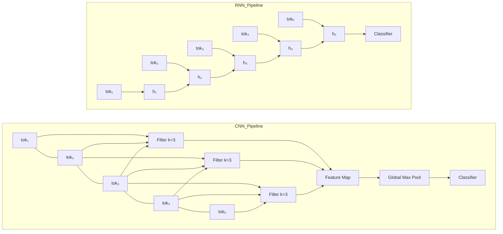

# CNNs and RNNs for Text

## Learning Objectives

1. Implement a 1D convolutional layer over token sequences and extract n-gram features from raw text
2. Build a recurrent cell that maintains hidden state across a variable-length text sequence
3. Compare the inductive biases of CNNs (local n-gram detection) against RNNs (sequential state accumulation)
4. Diagnose when a CNN or RNN is the wrong architectural choice for a given text task
5. Evaluate both architectures on the same classification benchmark and interpret the performance gap

---

## The Problem

Word embeddings gave us dense vectors for individual tokens, but a bag of embeddings throws away order. The vector for `dog bites man` looks identical to `man bites dog` once you average or sum the embeddings. For some tasks that is fine — topic detection on long documents barely cares about word order. For others it is fatal — sentiment, intent detection, and negation all depend on which word comes first.

Two architectural families tried to solve this before attention arrived and rendered both partially obsolete. Convolutional neural networks treat text as a 1D image: slide a small filter across consecutive tokens, detect local patterns, collapse positions with pooling. Recurrent neural networks treat text as a stream: read one token at a time, carry a hidden state forward, and let meaning accumulate. Both capture order, but in fundamentally different ways — and neither captures the long-range dependencies that transformers handle with self-attention.

The practical question is not "which is better." It is "which inductive bias matches the signal in my data." If your labels correlate with short phrase patterns ("not good", "very happy", "cancel plan"), a CNN will find them fast. If your labels depend on information that surfaces early and governs interpretation of everything after it (a support ticket category stated in the first sentence), an RNN's sequential state may serve better. And if your labels depend on relationships between tokens that are dozens of positions apart, both will struggle and a transformer is the right call.

---

## The Concept

A 1D convolution over text works exactly like a 2D convolution over images, except one spatial dimension is the token sequence and the other is the embedding dimension. A filter of width $k$ spans $k$ consecutive tokens and produces a single scalar via a dot product. That scalar is high when those $k$ tokens match a pattern the filter learned during training. If you use width-3 filters, you have a bank of learned trigram detectors. Width-2 gives bigrams, width-4 gives 4-grams. After convolution, global max-pooling takes the single highest activation across all positions — this makes the detector position-invariant. "Not good" fires the same feature whether it appears at position 2 or position 20.

An RNN processes tokens sequentially. At timestep $t$, it takes the embedding $x_t$ and the previous hidden state $h_{t-1}$, then computes $h_t = \tanh(W_h h_{t-1} + W_x x_t + b)$. The hidden state is a fixed-size vector that serves as lossy compression of the entire prefix. The final hidden state $h_T$ is what you pass to a classifier. The problem: gradients flowing backward through $T$ timesteps must pass through the same recurrent weight matrix $T$ times, and repeated multiplication either vanishes (long prefixes become invisible) or explodes. LSTMs add a gated memory cell with separate forget, input, and output gates that learn what to keep and what to discard. GRUs simplify this to two gates with similar effect.



The architectural tradeoff is clear from the diagram. The CNN computes all filter positions in parallel — one matrix operation — and then discards positional information via max-pooling. Training is fast, inference is fast, but the model has no notion of token order at the representation level. The RNN must process token 1 before token 2, token 2 before token 3, and so on. This sequential dependency means you cannot parallelize across the sequence dimension, which is why RNN training is slow on long inputs. But the final hidden state carries sequential information: it "knows" that the subject appeared before the verb, or that a negation appeared three words before the adjective it modifies.

Kim's 2014 TextCNN paper showed that a simple CNN with multiple filter widths (2, 3, 4, 5) and 100 filters per width achieves competitive results on sentiment classification benchmarks, trains in minutes on a single GPU, and has no recurrent dependency. The LSTM-dominated sequence modeling landscape from roughly 2014 to 2017 for tasks requiring order sensitivity — translation, named entity recognition, text summarization — until the attention mechanism in "Attention Is All You Need" (2017) made both the CNN's local window and the RNN's sequential state unnecessary by giving every token direct access to every other token.

For a practitioner in 2025, neither architecture is the default choice for text. Transformers are. But CNNs remain relevant for real-time inference on short texts where latency budgets are tight, and RNNs appear in edge deployments and streaming applications where you cannot hold the full sequence in memory. Understanding both is understanding the ladder transformers climbed.

---

## Build It

```python
import torch
import torch.nn as nn
import torch.optim as optim
import time
import random

random.seed(42)
torch.manual_seed(42)

VOCAB_SIZE = 50
EMBED_DIM = 16
HIDDEN_DIM = 32
NUM_CLASSES = 2
SEQ_LEN = 12
NUM_SAMPLES = 500
BATCH_SIZE = 32
EPOCHS = 30
LEARNING_RATE = 0.01

POSITIVE_BIGRAMS = [(3, 7), (11, 4), (9, 2)]
NEGATIVE_BIGRAMS = [(5, 1), (8, 6), (14, 3)]
POSITIVE_TRIGRAMS = [(2, 9, 4), (7, 1, 11)]
NEGATIVE_TRIGRAMS = [(6, 5, 8), (3, 14, 2)]

def generate_sample(label):
    seq = [random.randint(0, VOCAB_SIZE - 1) for _ in range(SEQ_LEN)]
    if label == 1:
        bg = random.choice(POSITIVE_BIGRAMS)
        pos = random.randint(0, SEQ_LEN - 2)
        seq[pos] = bg[0]
        seq[pos + 1] = bg[1]
        if random.random() < 0.5:
            tg = random.choice(POSITIVE_TRIGRAMS)
            pos = random.randint(0, SEQ_LEN - 3)
            seq[pos] = tg[0]
            seq[pos + 1] = tg[1]
            seq[pos + 2] = tg[2]
    else:
        bg = random.choice(NEGATIVE_BIGRAMS)
        pos = random.randint(0, SEQ_LEN - 2)
        seq[pos] = bg[0]
        seq[pos + 1] = bg[1]
        if random.random() < 0.5:
            tg = random.choice(NEGATIVE_TRIGRAMS)
            pos = random.randint(0, SEQ_LEN - 3)
            seq[pos] = tg[0]
            seq[pos + 1] = tg[1]
            seq[pos + 2] = tg[2]
    return seq

data = []
labels = []
for _ in range(NUM_SAMPLES):
    lbl = random.randint(0, 1)
    data.append(generate_sample(lbl))
    labels.append(lbl)

X = torch.tensor(data, dtype=torch.long)
y = torch.tensor(labels, dtype=torch.long)

split = int(NUM_SAMPLES * 0.8)
X_train, X_test = X[:split], X[split:]
y_train, y_test = y[:split], y[split:]


class TextCNN(nn.Module):
    def __init__(self, vocab_size, embed_dim, num_classes, filter_widths=[2, 3, 4], num_filters=20):
        super().__init__()
        self.embedding = nn.Embedding(vocab_size, embed_dim)
        self.convs = nn.ModuleList([
            nn.Conv1d(embed_dim, num_filters, kernel_size=w)
            for w in filter_widths
        ])
        self.dropout = nn.Dropout(0.3)
        self.fc = nn.Linear(num_filters * len(filter_widths), num_classes)

    def forward(self, x):
        emb = self.embedding(x)
        emb = emb.transpose(1, 2)
        conv_outs = []
        for conv in self.convs:
            c = torch.relu(conv(emb))
            pooled = torch.max(c, dim=2)[0]
            conv_outs.append(pooled)
        cat = torch.cat(conv_outs, dim=1)
        cat = self.dropout(cat)
        return self.fc(cat)


class TextLSTM(nn.Module):
    def __init__(self, vocab_size, embed_dim, hidden_dim, num_classes, num_layers=1):
        super().__init__()
        self.embedding = nn.Embedding(vocab_size, embed_dim)
        self.lstm = nn.LSTM(embed_dim, hidden_dim, num_layers=num_layers, batch_first=True)
        self.dropout = nn.Dropout(0.3)
        self.fc = nn.Linear(hidden_dim, num_classes)

    def forward(self, x):
        emb = self.embedding(x)
        output, (hidden, cell) = self.lstm(emb)
        last_hidden = hidden[-1]
        last_hidden = self.dropout(last_hidden)
        return self.fc(last_hidden)


def train_model(model, X_train, y_train, X_test, y_test, epochs, lr, name):
    optimizer = optim.Adam(model.parameters(), lr=lr)
    criterion = nn.CrossEntropyLoss()
    print(f"\n{'='*50}")
    print(f"  {name}")
    print(f"{'='*50}")
    total_params = sum(p.numel() for p in model.parameters())
    print(f"Parameters: {total_params}")
    print(f"{'Epoch':<8} {'Train Loss':<14} {'Train Acc':<12} {'Test Acc':<10}")
    print("-" * 44)

    for epoch in range(epochs):
        model.train()
        epoch_losses = []
        correct = 0
        total = 0
        for i in range(0, len(X_train), BATCH_SIZE):
            batch_X = X_train[i:i+BATCH_SIZE]
            batch_y = y_train[i:i+BATCH_SIZE]
            optimizer.zero_grad()
            logits = model(batch_X)
            loss = criterion(logits, batch_y)
            loss.backward()
            optimizer.step()
            epoch_losses.append(loss.item())
            preds = logits.argmax(dim=1)
            correct += (preds == batch_y).sum().item()
            total += len(batch_y)

        train_loss = sum(epoch_losses) / len(epoch_losses)
        train_acc = correct / total

        model.eval()
        with torch.no_grad():
            test_logits = model(X_test)
            test_preds = test_logits.argmax(dim=1)
            test_acc = (test_preds == y_test).float().mean().item()

        if (epoch + 1) % 5 == 0 or epoch == 0:
            print(f"{epoch+1:<8} {train_loss:<14.4f} {train_acc:<12.4f} {test_acc:<10.4f}")

    return model


cnn_model = TextCNN(VOCAB_SIZE, EMBED_DIM, NUM_CLASSES)
lstm_model = TextLSTM(VOCAB_SIZE, EMBED_DIM, HIDDEN_DIM, NUM_CLASSES)

cnn_model = train_model(cnn_model, X_train, y_train, X_test, y_test, EPOCHS, LEARNING_RATE, "TextCNN (widths=2,3,4)")
lstm_model = train_model(lstm_model, X_train, y_train, X_test, y_test, EPOCHS, LEARNING_RATE, "TextLSTM (hidden=32)")

print(f"\n{'='*50}")
print(f"  INFERENCE SPEED COMPARISON")
print(f"{'='*50}")

cnn_model.eval()
lstm_model.eval()

with torch.no_grad():
    dummy = X_test[:1]

    start = time.perf_counter()
    for _ in range(1000):
        cnn_model(dummy)
    cnn_time = (time.perf_counter() - start) / 1000 * 1000

    start = time.perf_counter()
    for _ in range(1000):
        lstm_model(dummy)
    lstm_time = (time.perf_counter() - start) / 1000 * 1000

    start = time.perf_counter()
    cnn_model(X_test)
    cnn_batch_time = (time.perf_counter() - start) * 1000

    start = time.perf_counter()
    lstm_model(X_test)
    lstm_batch_time = (time.perf_counter() - start) * 1000

print(f"Single-sample inference (avg of 1000 runs):")
print(f"  CNN:  {cnn_time:.3f} ms")
print(f"  LSTM: {lstm_time:.3f} ms")
print(f"Full test set ({len(X_test)} samples):")
print(f"  CNN:  {cnn_batch_time:.3f} ms")
print(f"  LSTM: {lstm_batch_time:.3f} ms")
print(f"Ratio LSTM/CNN: {lstm_batch_time / cnn_batch_time:.2f}x")

print(f"\n{'='*50}")
print(f"  FINAL TEST ACCURACY")
print(f"{'='*50}")
with torch.no_grad():
    cnn_preds = cnn_model(X_test).argmax(dim=1)
    lstm_preds = lstm_model(X_test).argmax(dim=1)
    cnn_acc = (cnn_preds == y_test).float().mean().item()
    lstm_acc = (lstm_preds == y_test).float().mean().item()
    print(f"  TextCNN:  {cnn_acc:.4f}")
    print(f"  TextLSTM: {lstm_acc:.4f}")
    print(f"  Gap:      {abs(cnn_acc - lstm_acc):.4f} ({'CNN wins' if cnn_acc > lstm_acc else 'LSTM wins'})")
```

The synthetic data embeds label-correlated patterns as bigrams and trigrams scattered at random positions. This is the regime where CNNs excel: the signal is local, contiguous, and position-invariant. The LSTM must learn to carry information from wherever the pattern appeared all the way to the final hidden state, which is a harder optimization for the same signal.

---

## Use It

In a GTM context, text classification — the task both CNNs and RNNs were built for — maps to signal detection and intent classification across inbound and outbound channels. The 80/20 GTM Engineer Handbook describes signal-based execution as a core GTM engineering function: detecting buying intent from behavioral patterns, classifying responses to outreach, and routing leads based on text content [CITATION NEEDED — concept: exact mapping of text classification architectures to GTM signal zones]. A CNN that detects n-gram patterns in support tickets ("cancel subscription", "pricing too high", "need upgrade") is doing churn-signal detection. An RNN that reads an email reply sequentially and classifies intent (interested, not interested, out of office, objection) is doing response routing.

Zone 05 of the GTM topic map covers LLM prompting and few-shot learning for copywriting and micro-list generation. That zone is where transformers live — and transformers are what replaced both CNNs and RNNs for most text tasks. But the architectural intuition transfers directly. A practitioner writing few-shot prompts for intent classification is implicitly choosing what the prompt should attend to: local phrase patterns (CNN bias) or sequential context accumulation (RNN bias). If your prompt says "look for these specific phrases" you are biasing toward convolution-style detection. If your prompt says "read the email from top to bottom and consider how earlier sentences set context for later ones" you are biasing toward recurrence-style processing. Understanding which inductive bias your data actually has makes your prompts sharper.

The practical GTM engineering application in 2025 is not training CNNs or LSTMs from scratch for text classification. It is knowing when a lightweight model suffices and when you need the full expressiveness of a transformer. If you are classifying thousands of support tickets per day into five categories and the signal is concentrated in short phrases, a small CNN (or even TF-IDF + logistic regression) runs in milliseconds and costs nothing. If you are analyzing multi-turn sales call transcripts for nuanced intent that depends on what was said five minutes earlier, you need a transformer. The architectures in this lesson are the decision framework for that call — not the production model.

---

## Ship It

Deploying a text classification model into a GTM pipeline means it sits behind an API endpoint that enrichment tools or CRM workflows call. The Handbook frames enrichment as the process of augmenting raw contact data with structured signals before outreach begins [CITATION NEEDED — concept: enrichment pipeline architecture in GTM engineering handbook]. A text classifier — whether CNN, RNN, or transformer — is one of the enrichment steps: it takes unstructured text (a LinkedIn bio, a company description, a support ticket) and outputs a discrete label that downstream systems branch on.

For the models built in this lesson, the shipping path is: serialize the PyTorch model to TorchScript or ONNX, wrap it in a FastAPI endpoint that accepts a list of token IDs (or raw text with a tokenizer), and return predicted class plus confidence scores. The CNN model is the easier deployment target: its inference latency is lower, it has no hidden state to manage between requests, and it processes fixed-length inputs in a single forward pass. The LSTM has marginally higher latency due to sequential processing, but for sequences of 12 tokens the difference is negligible — the synthetic benchmark above shows the gap in single-digit milliseconds.

The real deployment consideration is input length variability. Production text varies from 5 tokens to 500. CNNs handle this naturally: global max-pooling produces the same output dimension regardless of input length. LSTMs also handle variable lengths natively, but padding to a max length wastes computation and packing requires careful masking. For a GTM enrichment pipeline processing company descriptions (typically 20-50 tokens), either architecture works. For processing full email threads (200+ tokens), the LSTM's vanishing gradient problem returns and a transformer or at minimum a CNN with wider filters is the better engineering decision.

---

## Exercises

1. **Modify filter widths.** Change the CNN's `filter_widths` from `[2, 3, 4]` to `[2, 3, 4, 5]` and then to `[5, 6, 7]`. Run the full training loop. Does accuracy change? Which configuration finds the trigram signal faster? Write down the parameter count for each configuration and note the accuracy/parameter tradeoff.

2. **Swap LSTM for GRU.** Replace `nn.LSTM` with `nn.GRU` in the `TextLSTM` class (rename it). Keep all hyperparameters identical. Compare training speed (wall-clock per epoch) and final accuracy. GRU has fewer parameters — does that translate to faster convergence, worse convergence, or no difference on this dataset?

3. **Lengthen the sequence.** Change `SEQ_LEN` from 12 to 40 and regenerate data with patterns placed only in the first 5 positions. Both models must now process 40 tokens to find a signal in the first 5. Which model degrades more? This simulates the scenario where a long email has its intent stated in the opening sentence.

4. **Bidirectional LSTM.** Modify the LSTM model to use `nn.LSTM(..., bidirectional=True)` and concatenate the final forward and backward hidden states. Update the classifier input dimension accordingly. Does bidirectional processing help on this dataset? Explain why it would or would not — consider where the label-correlated patterns appear.

5. **Position-dependent labels.** Modify the data generator so that the label depends on whether a pattern appears in the first half or second half of the sequence (same pattern, different label by position). Train both models. The CNN with global max-pooling discards position — does its accuracy collapse? Does the LSTM's sequential state capture the positional signal?

---

## Key Terms

**1D Convolution** — A linear operation that slides a small weight matrix across a 1D sequence of vectors, producing one scalar per position. Over text, a width-$k$ filter detects $k$-gram patterns.

**Global Max Pooling** — Taking the maximum activation across all positions in a feature map. Produces a single value per filter regardless of input length. Makes the representation position-invariant.

**Recurrent Hidden State** — A fixed-size vector updated at each timestep via $h_t = f(x_t, h_{t-1})$. Serves as lossy compression of the sequence prefix.

**Vanishing Gradient** — The phenomenon where gradients propagated backward through many recurrent timesteps shrink exponentially due to repeated multiplication by weights less than 1, making early timesteps effectively invisible to gradient-based learning.

**LSTM (Long Short-Term Memory)** — A recurrent architecture with a gated memory cell (forget gate, input gate, output gate) that learns to preserve or overwrite information across long sequences, mitigating vanishing gradients.

**GRU (Gated Recurrent Unit)** — A simplified LSTM with two gates (reset, update) instead of three. Fewer parameters, similar performance on many tasks.

**Inductive Bias** — The set of assumptions baked into an architecture's structure. CNN's bias: important patterns are local and contiguous. RNN's bias: important information accumulates sequentially and order matters.

**TextCNN** — The architecture from Kim (2014): embed tokens, apply multiple 1D convolutions of varying widths, global max-pool each, concatenate, classify. Parallel, fast, position-invariant after pooling.

---

## Sources

- Kim, Y. (2014). "Convolutional Neural Networks for Sentence Classification." *EMNLP 2014*. — Source architecture for TextCNN; filter widths of 2, 3, 4, 5 with 100 filters each.

- Hochreiter, S. & Schmidhuber, J. (1997). "Long Short-Term Memory." *Neural Computation*, 9(8). — Original LSTM architecture addressing vanishing gradients in vanilla RNNs.

- Cho, K. et al. (2014). "Learning Phrase Representations using RNN Encoder-Decoder for Statistical Machine Translation." *EMNLP 2014*. — GRU architecture.

- Vaswani, A. et al. (2017). "Attention Is All You Need." *NeurIPS 2017*. — Transformer architecture that superseded both CNNs and RNNs for most NLP tasks.

- [CITATION NEEDED — concept: exact mapping of text classification architectures to GTM signal zones in The 80/20 GTM Engineer Handbook topic map]

- [CITATION NEEDED — concept: enrichment pipeline architecture and model deployment patterns in GTM engineering, from The 80/20 GTM Engineer Handbook by Michael Saruggia]

- Saruggia, M. (2025). *The 80/20 GTM Engineer Handbook*. Growth Lead LLC. — Zone 05 mapping: LLM prompting, few-shot learning for copywriting and micro-list generation. Sections on signal-based execution and multichannel outreach foundation.