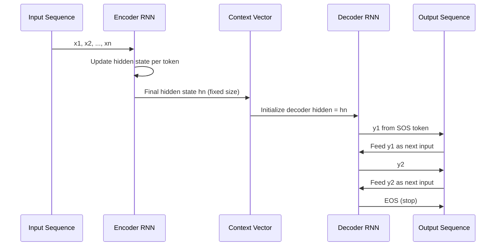

# Sequence-to-Sequence Models

## Learning Objectives

1. Implement a character-level encoder-decoder that maps variable-length input to variable-length output.
2. Compare teacher forcing against autoregressive decoding and predict when each causes training instability.
3. Diagnose the information bottleneck in a fixed-length context vector.
4. Measure seq2seq output with exact-match accuracy and character-error rate.
5. Evaluate whether a seq2seq architecture is appropriate for a given transformation task versus alternatives.

## The Problem

Classification maps a variable-length input to a single fixed label. You feed in a sentence, the network collapses it, and you pick the most likely class. The output dimension is known before you begin. Translation, summarization, reformatting — none of these cooperate with that assumption. The input and output are both variable-length sequences, they may live in entirely different vocabularies, and there is no length parity guarantee. A five-word English sentence might be two words in German or eight words in Japanese.

Before 2014, researchers tried to bolt RNNs onto this problem directly: one network, reading input tokens and emitting output tokens in a single pass. That fails because the network tries to start producing output before it has finished reading input. You cannot translate word three of a sentence until you know what word seven is, because word seven might reframe the grammar of everything before it.

The seq2seq architecture (Sutskever, Vinyals, Le, 2014) solved this with a deliberately simple structural insight: split the work into two phases. Phase one — **compress** the entire input into a fixed-size vector. Phase two — **generate** the output from that vector, one token at a time. The input can be any length. The output can be any length. The bridge between them is a single vector. This is the same architectural pattern that modern LLMs use: an encoder-equivalent stage that ingests the prompt, and a decoder stage that generates tokens autoregressively. The transformer replaced the RNN internals, but the two-phase structure remains.

## The Concept

The encoder is an RNN (specifically a GRU or LSTM) that processes the input sequence step by step. At each step, it updates its hidden state. After consuming the final input token, the encoder's last hidden state becomes the **context vector** — a fixed-size summary of the entire input sequence. Everything the decoder will need must be encoded in this single vector. If the input is 100 tokens long and the hidden size is 256, those 256 numbers must carry enough information to reconstruct the meaning of all 100 tokens.

The decoder is a second RNN, initialized with the context vector as its starting hidden state. It receives a `<SOS>` (start of sequence) token as its first input, produces a probability distribution over the vocabulary, and selects the next token. That token becomes the input for the following step. This loop continues until the model emits `<EOS>` (end of sequence) or hits a maximum length. Each output token depends on every previous output token and the context vector — but not directly on the input tokens themselves. That is the bottleneck.



Training uses a technique called **teacher forcing**. At each decoder step during training, instead of feeding the model's own prediction back as input, you feed the ground-truth token from the target sequence. This dramatically speeds up convergence because the model never has to recover from its own early mistakes during training — it always sees correct inputs. The cost is **exposure bias**: at inference time the model only ever sees its own (potentially wrong) predictions, a distribution it was never trained on. The model drifts further from its training distribution with each wrong token, compounding errors down the sequence.

The loss is cross-entropy at each decoder step, summed or averaged over the output sequence. Backpropagation flows through the decoder, through the context vector, and back through the encoder — end to end. Both networks learn jointly. The encoder learns to compress information the decoder needs; the decoder learns to extract that information and produce fluent output.

Here is a complete, runnable character-level seq2seq in PyTorch. The task is string reversal: the encoder reads `"hello"`, the decoder generates `"olleh"`. The code trains with teacher forcing and evaluates with greedy autoregressive decoding.

```python
import torch
import torch.nn as nn
import random

torch.manual_seed(42)
random.seed(42)

PAD_IDX = 0
SOS_IDX = 27
EOS_IDX = 28
CHARS = "abcdefghijklmnopqrstuvwxyz"
CHAR_TO_IDX = {c: i + 1 for i, c in enumerate(CHARS)}
IDX_TO_CHAR = {i + 1: c for i, c in enumerate(CHARS)}
VOCAB_SIZE = 29
HIDDEN_SIZE = 64
MAX_LEN = 12

def encode(s):
    return [CHAR_TO_IDX[c] for c in s]

def decode(indices):
    return "".join(IDX_TO_CHAR.get(i, "?") for i in indices if IDX_TO_CHAR.get(i))

def make_pair():
    length = random.randint(3, 8)
    s = "".join(random.choice(CHARS) for _ in range(length))
    return s, s[::-1]

class Encoder(nn.Module):
    def __init__(self, vocab_size, hidden_size):
        super().__init__()
        self.embed = nn.Embedding(vocab_size, hidden_size, padding_idx=PAD_IDX)
        self.gru = nn.GRU(hidden_size, hidden_size, batch_first=True)

    def forward(self, src):
        embedded = self.embed(src)
        _, hidden = self.gru(embedded)
        return hidden

class Decoder(nn.Module):
    def __init__(self, vocab_size, hidden_size):
        super().__init__()
        self.embed = nn.Embedding(vocab_size, hidden_size, padding_idx=PAD_IDX)
        self.gru = nn.GRU(hidden_size, hidden_size, batch_first=True)
        self.out = nn.Linear(hidden_size, vocab_size)

    def forward(self, input_step, hidden):
        embedded = self.embed(input_step)
        output, hidden = self.gru(embedded, hidden)
        prediction = self.out(output.squeeze(1))
        return prediction, hidden

encoder = Encoder(VOCAB_SIZE, HIDDEN_SIZE)
decoder = Decoder(VOCAB_SIZE, HIDDEN_SIZE)
optimizer = torch.optim.Adam(
    list(encoder.parameters()) + list(decoder.parameters()), lr=0.005
)
criterion = nn.CrossEntropyLoss(ignore_index=PAD_IDX)

NUM_EPOCHS = 3000
PRINT_EVERY = 500

for epoch in range(NUM_EPOCHS):
    src_str, tgt_str = make_pair()
    src_tensor = torch.tensor([encode(src_str)])
    tgt_indices = encode(tgt_str) + [EOS_IDX]

    optimizer.zero_grad()
    context = encoder(src_tensor)

    loss = 0.0
    decoder_input = torch.tensor([[SOS_IDX]])
    decoder_hidden = context

    for t in range(len(tgt_indices)):
        output, decoder_hidden = decoder(decoder_input, decoder_hidden)
        target_token = torch.tensor([tgt_indices[t]])
        loss = loss + criterion(output, target_token)
        decoder_input = target_token.unsqueeze(0)

    loss.backward()
    optimizer.step()

    if (epoch + 1) % PRINT_EVERY == 0:
        print(
            f"Epoch {epoch + 1}/{NUM_EPOCHS} | "
            f"Loss: {loss.item() / len(tgt_indices):.4f}"
        )

def evaluate(src_str):
    src_tensor = torch.tensor([encode(src_str)])
    with torch.no_grad():
        context = encoder(src_tensor)
        decoder_input = torch.tensor([[SOS_IDX]])
        decoder_hidden = context
        result = []
        for _ in range(MAX_LEN):
            output, decoder_hidden = decoder(decoder_input, decoder_hidden)
            predicted = output.argmax(dim=1).item()
            if predicted == EOS_IDX:
                break
            result.append(predicted)
            decoder_input = torch.tensor([[predicted]])
    return decode(result)

print("\n--- Evaluation ---")
test_words = ["hello", "world", "python", "abc", "xyz", "torch"]
exact_matches = 0
total_chars = 0
correct_chars = 0

for word in test_words:
    predicted = evaluate(word)
    expected = word[::-1]
    match = predicted == expected
    if match:
        exact_matches += 1
    min_len = min(len(predicted), len(expected))
    for i in range(min_len):
        total_chars += 1
        if predicted[i] == expected[i]:
            correct_chars += 1
    total_chars += abs(len(predicted) - len(expected))
    status = "OK" if match else "MISS"
    print(f"{word:8s} -> {expected:8s} | got: {predicted:8s} | {status}")

print(f"\nExact match accuracy: {exact_matches}/{len(test_words)}")
print(