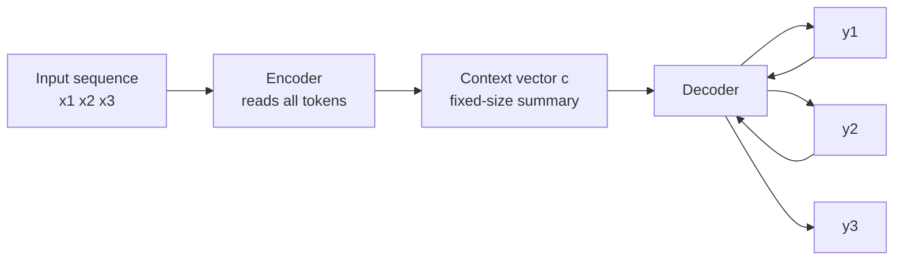

# Sequence-to-Sequence Models

## Learning Objectives

- **Explain** how an encoder compresses a variable-length input into a fixed-size representation and how a decoder expands that representation back into a variable-length output.
- **Build** a minimal encoder-decoder in Python and trace the data flow from input tokens, through the context vector, to generated output tokens.
- **Compare** fixed-context seq2seq against attention-based and decoder-only variants, and identify which GTM tasks each is suited for.

## The Problem

You are in RevOps. An AE hands you a spreadsheet of 400 accounts. Each row has a different shape: one company closed a Series B, runs on Snowflake, and is hiring three AEs; another just launched a developer tool and posted a job for a Head of Growth. The AE wants a personalized opening line for every account, drawn from whatever signals happen to exist for that row.

A classifier cannot do this. A classifier outputs a *label* — "good fit" or "bad fit," one of *k* buckets. You need something that outputs a *sequence* of words, where the length and content vary per account. The input is also a variable-length sequence (three signals for one row, six for another). You need a model that maps **sequence → sequence**. That is the seq2seq problem, and it is the architectural ancestor of every tool an AE eventually uses to draft outreach at scale.

## The Concept

A seq2seq model has two parts: an **encoder** and a **decoder**.

The encoder reads the input token by token and updates an internal state. When it finishes, it hands the decoder a **context vector** — a fixed-size numerical summary of everything it read. In the original RNN formulation (Sutskever et al., 2014; Cho et al., 2014), this context vector is simply the encoder's final hidden state.

The decoder then generates the output **autoregressively**: it produces one token, feeds that token back into itself as input, and produces the next. At each step it is conditioned on two things — the context vector from the encoder and the tokens it has already emitted. Generation stops when it outputs an end-of-sequence token.



The flaw in the original design is the **bottleneck**: every detail of a long input must be squeezed through one fixed-size vector. For a three-token input that is fine. For a forty-token input — say, a prospect's LinkedIn history — the context vector cannot hold it all, and the decoder starts dropping details.

**Attention** (Bahdanau et al., 2014) solves this. Instead of one context vector, the decoder gets access to *all* of the encoder's intermediate hidden states. At each output step, it computes a relevance score between its current state and every encoder state, weights them, and builds a *custom* context vector for that specific step. This is why a translation model can render a long sentence faithfully — it re-focuses on the relevant source words for each target word.

The Transformer (Vaswani et al., 2017) replaced recurrence entirely with self-attention, and modern decoder-only LLMs (the GPT family) collapse encoder and decoder into a single stack: input tokens and generated tokens pass through the same layers. But the *task structure* — variable-length sequence in, variable-length sequence out — is unchanged. When you send a prompt and receive generated text, you are running a seq2seq operation, even if the architecture under the hood is decoder-only.

## Build It

This is a minimal, dependency-free encoder-decoder. The weights are random, so the output is gibberish — but the *mechanism* is fully observable: tokens go in, get averaged into a context vector, and the decoder greedily picks the highest-scoring token at each step until it emits the end token.

```python
import random

random.seed(42)

vocab = ["<s>", "</s>", "<unk>", "saas", "fintech", "series_a", "hiring", "ae", "maps", "to", "outreach"]
token_to_id = {t: i for i, t in enumerate(vocab)}
vocab_size = len(vocab)
embed_dim = 8

W_embed = [[random.uniform(-0.5, 0.5) for _ in range(embed_dim)] for _ in range(vocab_size)]
W_decode = [[random.uniform(-1.0, 1.0) for _ in range(vocab_size)] for _ in range(embed_dim)]

def embed(token_id):
    return W_embed[token_id][:]

def encode(token_ids):
    context = [0.0] * embed_dim
    for tid in token_ids:
        e = embed(tid)
        context = [context[i] + e[i] for i in range(embed_dim)]
    n = max(1, len(token_ids))
    return [c / n for c in context]

def score_token(context, token_id):
    e = embed(token_id)
    return sum(context[i] * W_decode[i][token_id] for i in range(embed_dim))

def decode(context, max_len=8):
    output = [token_to_id["<s>"]]
    for _ in range(max_len):
        scores = [score_token(context, t) for t in range(vocab_size)]
        best = scores.index(max(scores))
        if best == token_to_id["</s>"]:
            break
        output.append(best)
    return output

input_tokens = ["saas", "fintech", "series_a", "hiring"]
input_ids = [token_to_id[t] for t in input_tokens]
context = encode(input_ids)
output_ids = decode(context)

print("input tokens :", input_tokens)
print("context vec  :", [round(c, 3) for c in context])
print("output tokens:", [vocab[i] for i in output_ids])
```

Run it. Observe three things: (1) the input has four tokens of arbitrary length, (2) the context vector is a fixed eight numbers regardless of input length, and (3) the decoder produces a variable-length output and stops when it picks `</s>`. Swap the input to a single token and confirm the context vector is still eight numbers — that is the bottleneck in action.

## Use It

The encoder-decoder pattern is the mechanism that transforms a sequence of account signals into a personalized outreach line — variable-length input, variable-length output, exactly the seq2seq task structure, applied to GTM message generation. [CITATION NEEDED — concept: LLM/seq2seq-driven personalized outbound message generation as a standard GTM engineering practice]

This runnable slice encodes account signals into a weighted vector and decodes the two highest-weighted signals into a readable opening. In production you replace the rule-based decoder with a call to a trained seq2seq model (an LLM), but the data shape is identical.

```python
ACCOUNTS = [
    {"name": "Helix Pay", "signals": ["series_a", "hiring_ae", "uses_stripe"]},
    {"name": "Drift Labs", "signals": ["series_b", "hiring_revops", "uses_snowflake", "open_roles_3"]},
]

SIGNAL_WEIGHTS = {"series_a": 0.9, "series_b": 0.95, "hiring_ae": 0.8,
                  "hiring_revops": 0.85, "uses_stripe": 0.4, "uses_snowflake": 0.5,
                  "open_roles_3": 0.6}

HOOKS = {"series_a": "just raised a Series A", "series_b": "closed a Series B",
         "hiring_ae": "is hiring AEs", "hiring_revops": "is scaling RevOps",
         "uses_stripe": "runs on Stripe", "uses_snowflake": "is on Snowflake",
         "open_roles_3": "has three open roles"}

def encode_account(account):
    return {s: SIGNAL_WEIGHTS.get(s, 0.1) for s in account["signals"]}

def decode_opening(account, context):
    top = sorted(context.items(), key=lambda kv: kv[1], reverse=True)[:2]
    leads = [HOOKS.get(k, "is growing") for k, _ in top]
    return f"Saw {account['name']} {leads[0]} and {leads[1]}."

for acct in ACCOUNTS:
    ctx = encode_account(acct)
    print(ctx)
    print(decode_opening(acct, ctx))
    print("-" * 40)
```

The encoder handles variable-length input (one account has three signals, another has four); the decoder emits variable-length output (a sentence whose length depends on which hooks surfaced). This is the seq2seq contract, applied to outbound personalization — foundational for any cluster built on message generation.

## Exercises

**Easy.** Modify the `encode` function in *Build It* so it returns the *last* embedding instead of the *averaged* embedding. Run it on two inputs of different lengths. Confirm the context vector is still the same dimensionality. What changes about the information the decoder receives?

**Medium.** Add a toy attention mechanism to *Build It*. Have the encoder return *all* per-token embeddings (a list), and at each decode step, compute a relevance score between the decoder's last picked token embedding and each encoder embedding. Weight the encoder embeddings by those scores and sum them into a per-step context vector. Print the attention weights at each step. Observe how the context now changes per output token instead of being fixed.

## Key Terms

- **Encoder** — the component that reads an input sequence and compresses it into a representation (a single context vector, or a sequence of hidden states in attention-based variants).
- **Decoder** — the autoregressive component that generates the output sequence one token at a time, conditioned on the encoder's representation and its own previous outputs.
- **Context vector** — the fixed-size numerical summary the encoder passes to the decoder; the original seq2seq bottleneck.
- **Attention** — a mechanism letting the decoder compute a custom, per-step context vector as a weighted sum of encoder states, weighting them by relevance to the current decoding step.
- **Autoregressive generation** — producing output one token at a time, feeding each generated token back in as input for the next step, until an end token is emitted.
- **Decoder-only model** — an architecture (e.g., GPT-family LLMs) that folds encoding and decoding into a single transformer stack while preserving the seq2seq *task* of variable-length sequence in, variable-length sequence out.

## Sources

- Sutskever, I., Vinyals, O., & Le, Q. V. (2014). *Sequence to Sequence Learning with Neural Networks.* NeurIPS.
- Cho, K., et al. (2014). *Learning Phrase Representations using RNN Encoder–Decoder for Statistical Machine Translation.* EMNLP.
- Bahdanau, D., Cho, K., & Bengio, Y. (2014). *Neural Machine Translation by Jointly Learning to Align and Translate.* ICLR 2015.
- Vaswani, A., et al. (2017). *Attention Is All You Need.* NeurIPS.