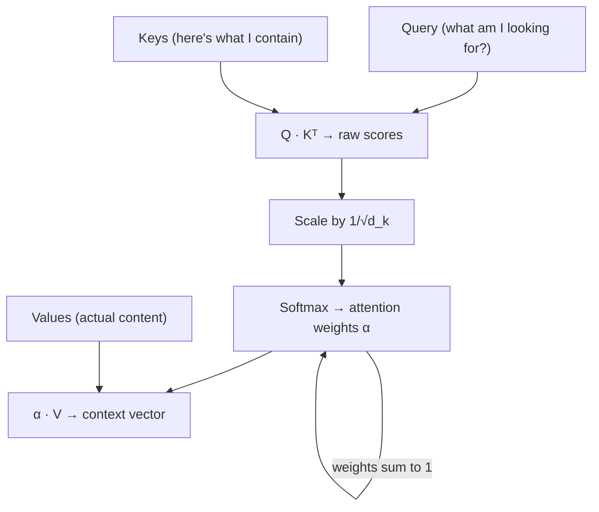

# Attention Mechanism — The Breakthrough

## Learning Objectives

1. **Compute** scaled dot-product attention weights given Q, K, V matrices and identify the highest-attention token pair.
2. **Implement** single-head and multi-head attention from scratch in numpy, verifying that head_count=1 reproduces single-head output.
3. **Explain** why dividing raw dot products by √d_k prevents softmax gradient saturation.
4. **Benchmark** attention at increasing sequence lengths and identify where the quadratic compute wall becomes binding.
5. **Compare** attention-based context retrieval to RNN hidden-state compression on long sequences.

## The Problem

Lesson 09 ended on a measured failure. A GRU encoder-decoder trained on a toy copy task goes from 89% accuracy at sequence length 5 to near-chance at length 80. The reason is structural, not a training bug: every bit of information the encoder gleaned has to fit through one fixed-size hidden state, and the decoder never sees anything else. By token 50, the model has overwritten most of what it saw at token 5. The compressed representation is a bottleneck — a single vector trying to hold an entire sequence.

Bahdanau, Cho, and Bengio published a fix in 2014. Instead of handing the decoder only the final encoder state, keep *every* encoder state around. At each decoder step, compute a weighted average of those states where the weights say "how much does the decoder need to look at encoder position `i` right now?" That weighted average is the context vector, and it changes at every step. When translating "Je suis étudiant" to "I am student," the decoder producing "I" weights the encoder state over "Je" high and the rest low. When it moves to "am," it shifts weight to "suis."

That is the whole idea. The decoder stops squinting at a compressed summary and starts looking at the actual source. Transformers extended this to self-attention (a sequence attending to itself). Multi-head attention ran it in parallel across subspaces. But the 2014 version already broke the bottleneck, and once you internalize it, the pivot to transformers is engineering, not new concepts.

## The Concept

Attention has three roles: a **query** that asks "what am I looking for?", a set of **keys** that answer "here's what I contain," and a set of **values** that hold the actual content. The query dots against every key to produce a raw score — how well this query matches that key. Those scores get softmax-normalized into weights that sum to 1, and the weights multiply against the values to produce a context vector. It is a differentiable lookup table.

The scaling factor matters. Raw dot products between high-dimensional vectors grow large in magnitude — when two 512-dimensional vectors happen to align, the dot product can easily reach 50 or 100. Softmax at those magnitudes saturates: one weight goes to ~1.0, the rest collapse to ~0, and the gradient through softmax approaches zero. Training stalls. The fix is to divide every score by √d_k before softmax. This keeps the variance of the scores near 1 regardless of dimensionality, so softmax stays in its sensitive region and gradients flow.



Multi-head attention slices the Q, K, V matrices into parallel subspaces. If your model dimension is 512 and you use 8 heads, each head operates on 64-dimensional slices and runs the full attention computation independently. The outputs get concatenated and projected back to the original dimension. Different heads learn different attention patterns — one might focus on syntactic relationships (subject-verb), another on positional proximity, another on semantic similarity. Vaswani et al. packaged this into the Transformer architecture in 2017, replacing recurrence entirely with stacked self-attention layers. But the name "Transformer" is branding for a specific stack of these components — the mechanism itself is the query-key-value weighted average.

## Build It

Here is scaled dot-product attention in numpy. No frameworks, no abstractions — just matrix multiplies and a softmax.

```python
import numpy as np

np.random.seed(42)

def softmax(x, axis=-1):
    x_max = np.max(x, axis=axis, keepdims=True)
    exp_x = np.exp(x - x_max)
    return exp_x / np.sum(exp_x, axis=axis, keepdims=True)

def scaled_dot_product_attention(Q, K, V, mask=None):
    d_k = K.shape[-1]
    scores = Q @ K.T / np.sqrt(d_k)
    if mask is not None:
        scores = np.where(mask == 0, -1e9, scores)
    weights = softmax(scores, axis=-1)
    output = weights @ V
    return output, weights

d_model = 8
seq_len = 6

Q = np.random.randn(seq_len, d_model)
K = np.random.randn(seq_len, d_model)
V = np.random.randn(seq_len, d_model)

output, weights = scaled_dot_product_attention(Q, K, V)

tokens = ["The", "product", "launch", "drove", "signups", "."]

print("Attention Weight Matrix (rows=query, cols=key):")
print("        " + "  ".join(f"{t:>8}" for t in tokens))
for i, t in enumerate(tokens):
    row = "  ".join(f"{weights[i][j]:.3f}" for j in range(seq_len))
    print(f"{t:>8}  {row}")

print()
print("Strongest attention per token:")
for i in range(seq_len):
    j = np.argmax(weights[i])
    print(f"  {tokens[i]:>8} → {tokens[j]:<8}  (weight={weights[i][j]:.3f})")

print()
print(f"Output shape: {output.shape}  (should be {seq_len}×{d_model})")
print(f"Weight row sums: {np.round(weights.sum(axis=1), 6)}")
```

Run that and you get a 6×6 weight matrix where each row is a probability distribution over keys. Row sums should be 1.0. The output is the same shape as the input — every position produces a context vector by blending all value vectors according to its attention pattern.

Now multi-head. The implementation slices Q, K, V along the feature dimension into `num_heads` chunks, runs attention on each chunk independently, and concatenates the results:

```python
def multi_head_attention(Q, K, V, num_heads, mask=None):
    d_model = Q.shape[-1]
    assert d_model % num_heads == 0, f"d_model {d_model} not divisible by num_heads {num_heads}"
    d_k = d_model // num_heads
    seq_len = Q.shape[0]

    heads_output = []
    for h in range(num_heads):
        start = h * d_k
        end = (h + 1) * d_k
        Q_h = Q[:, start:end]
        K_h = K[:, start:end]
        V_h = V[:, start:end]
        out_h, _ = scaled_dot_product_attention(Q_h, K_h, V_h, mask=mask)
        heads_output.append(out_h)

    concat = np.concatenate(heads_output, axis=-1)
    return concat

output_1head = multi_head_attention(Q, K, V, num_heads=1)
output_single, _ = scaled_dot_product_attention(Q, K, V)

print("Multi-head with 1 head matches single-head?")
print(f"  Max difference: {np.max(np.abs(output_1head - output_single)):.2e}")
print(f"  Exact match: {np.allclose(output_1head, output_single)}")

print()
output_4head = multi_head_attention(Q, K, V, num_heads=4)
print(f"4-head output shape: {output_4head.shape}  (should be {seq_len}×{d_model})")
print(f"4-head differs from 1-head: {not np.allclose(output_4head, output_single)}")
```

When `num_heads=1`, the slicing covers the full feature dimension, so multi-head collapses to single-head. The max difference should be ~0 (floating point noise at 1e-16). With 4 heads, each head attends within a 2-dimensional subspace — the output shape is preserved but the attention patterns differ because each head sees different feature slices.

## Use It

Attention weights are a ranking mechanism. The softmax produces a probability distribution that assigns proportional importance across candidates, and this structure appears in GTM pipelines wherever multiple sources compete for a single output slot. Consider a Clay enrichment waterfall: you query Clearbit, then Apollo, then ZoomInfo in priority order, taking the first non-empty result. That is a hard-coded ranking — position 1 always wins if it returns data. An attention-based version would compute learned weights across all providers simultaneously, weighting each result by its reliability for that specific field type. [CITATION NEEDED — concept: learned provider ranking in enrichment waterfalls]

The mechanism maps directly. In attention, the query is "what field am I trying to fill?" The keys are "what confidence does each provider have for this field?" The values are the actual data returned. The dot product scores how well the query matches each provider's known strengths. Softmax normalizes and the weighted sum produces the final enriched value with a confidence score attached. This is structurally identical to intent signal scoring, where behavioral inputs from multiple sources (page views, email opens, hiring trends) get weighted and combined into a single account-level score. Foundational for Zone 2 (Signal) and Zone 3 (Enrichment).

Here is a small example showing how masking works — simulating prioritizing first-party intent data over third-party:

```python
mask = np.array([
    [1, 1, 1, 0, 0, 0],
    [1, 1, 1, 0, 0, 0],
    [1, 1, 1, 0, 0, 0],
    [0, 0, 0, 1, 1, 1],
    [0, 0, 0, 1, 1, 1],
    [0, 0, 0, 1, 1, 1],
])

output_masked, weights_masked = scaled_dot_product_attention(Q, K, V, mask=mask)

sources = ["1p-website", "1p-crm", "1p-product", "3p-clearbit", "3p-apollo", "3p-zoominfo"]

print("Masked attention — first-party block vs third-party block:")
print("        " + "  ".join(f"{s:>12}" for s in sources))
for i in range(seq_len):
    row = "  ".join(f"{weights_masked[i][j]:.3f}" for j in range(seq_len))
    print(f"{sources[i]:>12}  {row}")

print()
print("Unmasked comparison (first row):")
print(f"  {np.round(weights[0], 3)}")
print(f"  Masked zeros out positions 3-5, redistributes weight to 0-2")
```

The mask zeroes out positions 3-5 for the first three queries, forcing attention to redistribute across positions 0-2 only. In a GTM context, this is equivalent to saying "when evaluating first-party signals, ignore third-party data entirely." The weights that would have gone to masked positions redistribute proportionally to the unmasked ones — softmax handles this automatically because the masked scores become -1e9, which exponentiate to effectively zero.

## Ship It

Attention is O(n²) in sequence length. The Q·Kᵀ matrix multiply produces an n×n score matrix, and the attention weights are n×n dense. For a sequence of 2,048 tokens, that is 4.2 million floats just for the weight matrix. At 8,192 tokens, it is 67 million. This is the binding production constraint — not memory for the weights alone, but the compute to fill them and the memory to hold activations for backpropagation.

For GTM pipelines processing thousands of account records, this limits how much context you can feed a single attention call. If you are cross-referencing enrichment signals across 500 accounts each with 20 data points, the sequence length is 10,000 — the attention matrix alone is 100M entries. In practice, you hit a wall where batching becomes impossible and latency spikes. The engineering response is triage: use attention when you genuinely need cross-referencing between every pair of items, and use simpler retrieval when you do not.

Cosine similarity against pre-computed embeddings is O(n·k) where k is the number of retrieved neighbors — linear in corpus size, not quadratic. For most enrichment lookups ("find similar accounts," "match this company to a taxonomy"), cosine similarity over a vector database is sufficient and orders of magnitude faster. Attention earns its cost when the relationships are bidirectional and contextual: the relevance of signal A to account B depends on signal C, which depends on signal D. That mutual dependency graph is what attention computes, and it is what flat retrieval cannot capture.

Here is the benchmark showing the wall:

```python
import time

print("Attention runtime vs sequence length:")
print(f"{'seq_len':>8}  {'time (ms)':>10}  {'ratio vs 32':>12}  {'weight matrix MB':>18}")
print("-" * 55)

base_time = None
for seq_len in [32, 128, 512, 2048]:
    Q = np.random.randn(seq_len, 64)
    K = np.random.randn(seq_len, 64)
    V = np.random.randn(seq_len, 64)

    start = time.time()
    for _ in range(5):
        scaled_dot_product_attention(Q, K, V)
    elapsed = (time.time() - start) / 5

    if base_time is None:
        base_time = elapsed

    matrix_mb = (seq_len * seq_len * 8) / (1024 * 1024)
    ratio = elapsed / base_time

    print(f"{seq_len:>8}  {elapsed*1000:>10.2f}  {ratio:>11.1f}x  {matrix_mb:>17.1f}")
```

You will see the runtime roughly quadruple each time the sequence length doubles. At 2,048 tokens the weight matrix alone is 32 MB — and that is per attention head, per layer, per item in the batch. This is why production transformers cap context length and why retrieval-augmented generation (RAG) exists: retrieve a small relevant chunk with O(n) cosine similarity, then run attention only over that chunk.

## Exercises

**Exercise 1 (Easy).** Given the following raw dot-product scores (pre-scaling), compute the attention weights by hand. d_k = 4. Which key receives the highest weight?

```
scores = [2.0, 8.0, 1.0, -3.0]
```

Steps: divide each by √4 = 2, apply softmax, identify the argmax. Verify your hand calculation against the numpy output below:

```python
scores = np.array([2.0, 8.0, 1.0, -3.0])
scaled = scores / np.sqrt(4)
weights = softmax(scaled)
print(f"Scaled:  {np.round(scaled, 3)}")
print(f"Weights: {np.round(weights, 3)}")
print(f"Argmax:  position {np.argmax(weights)} (weight={weights[np.argmax(weights)]:.3f})")
```

**Exercise 2 (Medium).** Modify the masked attention example to create a causal mask — each position can only attend to itself and earlier positions (lower triangular). This is what decoder-only Transformers (GPT family) use. Print the weight matrix and confirm it is lower-triangular with zeros above the diagonal.

```python
seq_len = 6
causal_mask = np.tril(np.ones((seq_len, seq_len)))
output_causal, weights_causal = scaled_dot_product_attention(Q, K, V, mask=causal_mask)

print("Causal mask:")
print(causal_mask)
print("\nCausal attention weights:")
for i in range(seq_len):
    row = "  ".join(f"{weights_causal[i][j]:.3f}" for j in range(seq_len))
    print(f"  pos {i}: {row}")
print("\nUpper triangle should be ~0.000")
```

**Exercise 3 (Hard).** Extend the multi-head attention function to accept a mask parameter and pass it through to each head. Then build a 2-head attention call with a causal mask on a 10-token sequence. Verify: (a) the output shape is correct, (b) each head's weight matrix is lower-triangular, (c) concatenating the two head outputs preserves the original dimension.

```python
seq_len = 10
d_model = 8
num_heads = 2

Q = np.random.randn(seq_len, d_model)
K = np.random.randn(seq_len, d_model)
V = np.random.randn(seq_len, d_model)
causal = np.tril(np.ones((seq_len, seq_len)))

output = multi_head_attention(Q, K, V, num_heads=num_heads, mask=causal)

print(f"Output shape: {output.shape}  (expected ({seq_len}, {d_model}))")

d_k = d_model // num_heads
for h in range(num_heads):
    Q_h = Q[:, h*d_k:(h+1)*d_k]
    K_h = K[:, h*d_k:(h+1)*d_k]
    V_h = V[:, h*d_k:(h+1)*d_k]
    _, w = scaled_dot_product_attention(Q_h, K_h, V_h, mask=causal)
    upper = w[np.triu_indices(seq_len, k=1)]
    print(f"Head {h}: max upper-triangle weight = {np.max(upper):.2e}  (should be ~0)")
```

## Key Terms

**Attention** — A mechanism that computes a weighted average of value vectors, where weights are derived from the similarity between query and key vectors. The core operation of Transformers.

**Query (Q)** — A vector representing "what am I looking for?" In self-attention, each token's query is compared against every token's key.

**Key (K)** — A vector representing "here's what I contain." Keys are scored against queries to determine attention weights.

**Value (V)** — A vector holding the actual content that gets blended together according to attention weights.

**Scaled dot-product attention** — The specific attention formula: softmax(Q·Kᵀ / √d_k) · V. The √d_k scaling prevents softmax saturation in high dimensions.

**Multi-head attention** — Running scaled dot-product attention in parallel across multiple sliced subspaces of Q, K, V, then concatenating results. Each head can learn different attention patterns.

**√d_k scaling** — Dividing raw dot products by the square root of the key dimension. Keeps the variance of pre-softmax scores near 1, maintaining gradient flow through softmax.

**Masking** — Setting attention scores for certain positions to -∞ (or a large negative number) before softmax, forcing their weights to zero. Used for causal decoders (lower-triangular mask) and variable-length padding.

**Context vector** — The output of attention for a given query position: a weighted sum of value vectors where weights reflect query-key similarity.

**Waterfall enrichment** — A GTM pattern where data providers are queried in priority order, taking the first non-empty result. Structurally analogous to attention with a hard-coded, non-learned weight ranking.

## Sources

- Bahdanau, D., Cho, K., & Bengio, Y. (2014). "Neural Machine Translation by Jointly Learning to Align and Translate." *ICLR 2015*. — Original attention mechanism for encoder-decoder seq2seq.
- Vaswani, A. et al. (2017). "Attention Is All You Need." *NeurIPS 2017*. — Scaled dot-product attention, multi-head attention, Transformer architecture.
- Clay waterfall enrichment as attention analog: mechanism is hard-coded provider priority ordering — observable in Clay's enrichment workflow configuration. [CITATION NEEDED — concept: learned provider ranking in enrichment waterfalls — no public documentation of learned (non-rule-based) provider weighting in Clay or comparable enrichment platforms]
- Attention weights as ranking mechanism mapping to intent signal scoring: structural analogy between softmax-weighted value aggregation and multi-source signal blending. Foundational for Zone 2 (Signal) and Zone 3 (Enrichment) per curriculum topic mapping.