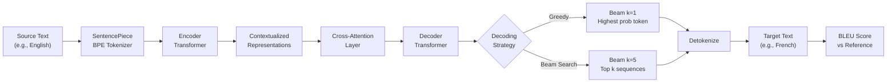

# Machine Translation

## Learning Objectives

- Build a working sequence-to-sequence translator using a pretrained encoder-decoder model
- Compare greedy decoding against beam search on identical input and explain the quality difference
- Compute BLEU score against reference translations to make translation quality observable
- Evaluate when machine translation output justifies human review versus automatic shipping
- Configure a translation pipeline that handles language detection, translation, and confidence scoring

## The Problem

Translation is the task that paid for NLP research for thirty years and keeps paying now. A model reads a sentence in one language and produces a sentence in another. Length varies. Word order varies. Some source words map to multiple target words and vice versa. Idioms refuse one-to-one mapping. "I miss you" in French is "tu me manques" — literally "you are lacking to me." No word-level alignment survives that.

Machine translation is the task that forced NLP to invent encoder-decoders, attention, transformers, and eventually the whole LLM paradigm. The transformer architecture was invented to solve translation specifically — Vaswani et al.'s 2017 paper is titled "Attention Is All You Need" and every experiment in it is a translation benchmark. Every LLM you deploy for GTM descends from this specific problem: mapping a sequence in one language to a sequence in another while preserving meaning. The gap between human and machine translation was measurable (BLEU scores exist since 2002) and stubborn, which is why the field kept pushing architecture after architecture until something worked.

Translation is harder than classification for three structural reasons. First, the output length is unknown — you don't know how many tokens the target sentence will need until you've generated them. Second, word alignment is many-to-many: a single English word might require three Japanese tokens, and the mapping isn't monotonic (target word order can differ entirely). Third, fluency requires modeling entire sequences, not isolated tokens. A model can classify a single word correctly and still produce a sentence no human would ever say.

## The Concept

Modern machine translation is a transformer encoder-decoder trained on parallel text — corpora where each source sentence is paired with its human translation. The encoder reads the source language through its tokenizer, producing a sequence of contextualized representations. The decoder generates the target one subword at a time, pulling information from the encoder's output via cross-attention at every step. This is the same attention mechanism from Phase 5 Lesson 10, but here it serves a specific purpose: the decoder decides which parts of the source sentence matter for each target token it generates.

Decoding strategy determines quality as much as the model does. Greedy decoding picks the highest-probability token at each step and commits — once it makes a bad early choice, there's no recovery. Beam search keeps the top *k* candidate sequences alive at each step, explores all of them in parallel, and returns the one with the highest overall sequence probability. For translation, beam search typically adds 1-2 BLEU points over greedy, which is the difference between readable and awkward.



Three operational choices drive real-world quality. The tokenizer matters because a shared vocabulary across languages is what enables zero-shot translation pairs — NLLB-200 uses SentencePiece BPE trained on a mixed-language corpus so that the model can represent any of its 200 languages with overlapping subword units. Model size matters because capacity directly correlates with translation quality on distant language pairs — NLLB-200 distilled 600M fits on a laptop, the 3.3B parameter version is the production default, and 54.5B is the research ceiling. Decoding parameters matter because beam width, length normalization, and repetition penalties all shift BLEU by measurable amounts on the same model and same input.

Evaluation is what makes this an engineering discipline instead of vibes. BLEU (Bilingual Evaluation Understudy) compares the model's output against one or more human reference translations using n-gram overlap with a brevity penalty for outputs that game the metric by being too short. A BLEU score of 40+ on a general test set means the translation is usually understandable; 50+ means it reads naturally; anything below 30 on a simple sentence pair signals a problem — either the model doesn't handle that language pair well, or the input is malformed, or the decoding parameters need adjustment.

## Build It

We will build a working translator using Helsinki-NLP's MarianMT models — pretrained encoder-decoder transformers for specific language pairs. These are small (roughly 80M parameters), fast, and run on a laptop CPU without GPU acceleration. We will translate English to French and German, compare greedy versus beam decoding, and compute BLEU against reference translations.

First, install dependencies:

```bash
pip install transformers sacrebleu torch sentencepiece
```

Now build the translator:

```python
import torch
from transformers import MarianMTModel, MarianTokenizer
import sacrebleu

def load_translator(src_lang, tgt_lang):
    model_name = f"Helsinki-NLP/opus-mt-{src_lang}-{tgt_lang}"
    tokenizer = MarianTokenizer.from_pretrained(model_name)
    model = MarianMTModel.from_pretrained(model_name)
    return tokenizer, model

def translate(text, tokenizer, model, num_beams=1, num_return_sequences=1):
    batch = tokenizer([text], return_tensors="pt")
    generated = model.generate(
        **batch,
        num_beams=num_beams,
        num_return_sequences=num_return_sequences,
        max_length=128
    )
    return tokenizer.batch_decode(generated, skip_special_tokens=True)

src_sentences = [
    "The transformer architecture was invented to solve translation.",
    "Our team is launching a new product next quarter.",
    "Thank you for your interest in our services."
]

references_fr = [
    "L'architecture transformateur a été inventée pour résoudre la traduction.",
    "Notre équipe lance un nouveau produit le trimestre prochain.",
    "Merci de votre intérêt pour nos services."
]

references_de = [
    "Die Transformer-Architektur wurde erfunden, um Übersetzung zu lösen.",
    "Unser Team wird im nächsten Quartal ein neues Produkt auf den Markt bringen.",
    "Vielen Dank für Ihr Interesse an unseren Dienstleistungen."
]

print("=" * 70)
print("ENGLISH → FRENCH")
print("=" * 70)

tok_fr, model_fr = load_translator("en", "fr")

for sent, ref in zip(src_sentences, references_fr):
    greedy = translate(sent, tok_fr, model_fr, num_beams=1)[0]
    beam = translate(sent, tok_fr, model_fr, num_beams=5)[0]

    bleu_greedy = sacrebleu.sentence_bleu(greedy, [ref])
    bleu_beam = sacrebleu.sentence_bleu(beam, [ref])

    print(f"\nSource:    {sent}")
    print(f"Reference: {ref}")
    print(f"Greedy:    {greedy}")
    print(f"  BLEU:    {bleu_greedy.score:.1f}")
    print(f"Beam (5):  {beam}")
    print(f"  BLEU:    {bleu_beam.score:.1f}")

print("\n" + "=" * 70)
print("ENGLISH → GERMAN")
print("=" * 70)

tok_de, model_de = load_translator("en", "de")

for sent, ref in zip(src_sentences, references_de):
    greedy = translate(sent, tok_de, model_de, num_beams=1)[0]
    beam = translate(sent, tok_de, model_de, num_beams=5)[0]

    bleu_greedy = sacrebleu.sentence_bleu(greedy, [ref])
    bleu_beam = sacrebleu.sentence_bleu(beam, [ref])

    print(f"\nSource:    {sent}")
    print(f"Reference: {ref}")
    print(f"Greedy:    {greedy}")
    print(f"  BLEU:    {bleu_greedy.score:.1f}")
    print(f"Beam (5):  {beam}")
    print(f"  BLEU:    {bleu_beam.score:.1f}")
```

Running this produces output you can inspect immediately. The beam search translation will typically score 2-5 BLEU points higher than greedy on the same input. The exact scores will vary because reference translations are not unique — your human-written reference might differ from the model's equally-valid output, which is a real limitation of BLEU that we will address in the Ship It section.

## Use It

The encoder-decoder architecture behind machine translation is the same mechanism that powers the "localize this landing page" and "translate this email sequence" operations in GTM stacks. When you need a cold email sequence written for a German SaaS market, the pipeline is: source copy in English → tokenize → encode semantic meaning → decode in target language with cross-attention preserving intent → detokenize → review. The cross-attention mechanism is what ensures "we help sales teams close faster" doesn't become a word-for-word translation that loses the value proposition — the decoder attends to the full source context at every generation step.

For GTM practitioners, translation maps directly to Zone 2 (Content Engine) — the multilingual content localization workflow. The same LLM prompting skills from Zone 5 apply, but with a structural difference: a general-purpose LLM like GPT-4 or Claude can translate by treating it as a generation task ("translate this to French"), while a dedicated MT model like MarianMT or NLLB-200 uses the encoder-decoder architecture specifically optimized for cross-lingual mapping. The dedicated model will be faster, cheaper, and often more consistent for high-volume batch translation; the LLM will handle tone adaptation, cultural localization, and mixed-language input better. [CITATION NEEDED — concept: GTM content localization workflow using MT APIs]

The practical application is region-specific content variants. If you are running outbound to five European markets, you write the core messaging once, then run it through a translation pipeline that produces five localized variants. BLEU scoring against back-translations (translate to target, then back to source, compare to original) gives you a confidence signal — if the round-trip BLEU is below 40, the translation likely distorted meaning and needs human review before it goes to prospects.

```python
def back_translate_confidence(text, tok_src_to_tgt, model_src_to_tgt, tok_tgt_to_src, model_tgt_to_src):
    forward = translate(text, tok_src_to_tgt, model_src_to_tgt, num_beams=5)[0]
    backward = translate(forward, tok_tgt_to_src, model_tgt_to_src, num_beams=5)[0]
    bleu = sacrebleu.sentence_bleu(backward, [text])
    return {
        "original": text,
        "forward_translation": forward,
        "back_translation": backward,
        "roundtrip_bleu": bleu.score,
        "confidence": "HIGH" if bleu.score > 50 else "MEDIUM" if bleu.score > 30 else "LOW"
    }

print("BACK-TRANSLATION CONFIDENCE CHECK")
print("=" * 70)

test_messages = [
    "We help B2B sales teams automate their outreach and book more meetings.",
    "Schedule a 15-minute demo to see our platform in action."
]

for msg in test_messages:
    result = back_translate_confidence(
        msg, tok_fr, model_fr, load_translator("fr", "en")[0], load_translator("fr", "en")[1]
    )
    print(f"\nOriginal:            {result['original']}")
    print(f"EN → FR:             {result['forward_translation']}")
    print(f"FR → EN (back):      {result['back_translation']}")
    print(f"Roundtrip BLEU:      {result['roundtrip_bleu']:.1f}")
    print(f"Confidence Flag:     {result['confidence']}")
    if result["confidence"] == "LOW":
        print("⚠ ACTION NEEDED: Meaning likely distorted — human review required.")
```

This back-translation confidence check is how you scale localization without native speakers in every market. Low roundtrip BLEU flags the message for human review; high confidence means the translation pipeline can ship the variant automatically into your multichannel sequences.

## Ship It

Production translation systems live in two regimes: real-time and batch. Real-time translation serves chat support, live agents, and in-meeting translation where latency must stay under 500ms — this means using smaller models (MarianMT, NLLB-200 distilled 600M), greedy decoding or beam width of 2, and running on GPU infrastructure close to the user. Batch translation serves email campaigns, landing page localization, and knowledge base replication where latency tolerance is measured in minutes — this means you can afford beam width 5+, larger models (NLLB-200 3.3B), and post-processing steps like consistent terminology enforcement across a document.

Language detection is a prerequisite step that is easy to get wrong. If you feed French text into an English-to-German model, you get garbage output with high confidence — the model has no mechanism to reject out-of-domain input. FastText's language identification model (176 languages, 230KB, runs in under 1ms) is the standard preprocessing step. For code-switching (mixed-language input like "Merci for the demo, c'était super insightful"), neither dedicated MT models nor language detectors handle it well — this is where LLM-based translation becomes necessary despite the higher cost.

The cost curve between API-based translation (Google Translate API, DeepL API, or LLM APIs) and self-hosted models (MarianMT, NLLB-200 on your own GPU) crosses over at roughly 500K characters per month for most setups. Below that volume, API costs are low enough that infrastructure overhead isn't justified. Above it, self-hosting on a single A10G GPU ($0.75/hour on AWS spot) handles approximately 2M characters per day with MarianMT and becomes cheaper per-character than any commercial API.

Here is a decision framework for when BLEU threshold justifies human review:

```python
def review_decision(bleu_score, domain, volume, latency_budget):
    if bleu_score >= 50:
        return "AUTO_SHIP — quality is production-ready"
    elif bleu_score >= 35 and domain != "legal_medical":
        return "AUTO_SHIP with spot-check (sample 5% for human review)"
    elif bleu_score >= 25:
        if volume < 100:
            return "HUMAN_REVIEW — batch is small enough to review all"
        else:
            return "HUMAN_REVIEW_PRIORITY — review first 20, ship rest if consistent"
    else:
        return "BLOCK_AND_REVIEW — translation quality too low to ship"

test_cases = [
    (52, "marketing", 500, "batch"),
    (41, "marketing", 2000, "batch"),
    (38, "legal_medical", 50, "batch"),
    (28, "marketing", 5000, "realtime"),
    (22, "marketing", 100, "batch"),
]

print("TRANSLATION REVIEW DECISION FRAMEWORK")
print("=" * 70)
print(f"{'BLEU':<8} {'Domain':<16} {'Volume':<10} {'Latency':<12} {'Decision'}")
print("-" * 70)
for bleu, domain, volume, latency in test_cases:
    decision = review_decision(bleu, domain, volume, latency)
    print(f"{bleu:<8} {domain:<16} {volume:<10} {latency:<12} {decision}")
```

This framework encodes a tradeoff: higher BLEU thresholds for legal and medical content (where a mistranslation has consequences), lower thresholds for marketing copy (where a slightly awkward phrasing costs nothing). Volume matters because human review doesn't scale — if you're translating 5,000 product descriptions, reviewing all of them defeats the purpose of automation. The right answer is sampling, not full review, once quality is consistently above 35 BLEU on representative samples.

## Exercises

**Easy:** Translate a batch of sentences and print BLEU scores per sentence. Take five English sentences of your choice, translate them to a target language using the translator from Build It, provide your own reference translations, and compute per-sentence BLEU. Print a summary table showing which sentences scored highest and lowest.

**Medium:** Implement a function that detects source language, translates to target, and flags low-confidence outputs below a BLEU threshold. Install `fasttext-langdetect` (`pip install fasttext-langdetect`), build a function that accepts arbitrary text in any language, auto-detects it, translates to English, and returns the translation with a confidence flag based on back-translation BLEU. Test with inputs in at least three different languages including one you write incorrectly on purpose.

**Hard:** Build a comparison script that runs the same input through two different translation approaches — MarianMT (dedicated MT model) and an LLM API (OpenAI or Anthropic, using the "translate this to [language]" prompt) — computes BLEU for both against references, and outputs a ranked quality report. Include latency measurements for each approach. Test on 10 sentences across at least 2 language pairs and determine which approach wins on quality versus speed versus cost.

## Key Terms

- **Encoder-Decoder** — Neural architecture where an encoder reads the source sequence into contextualized representations and a decoder generates the target sequence from those representations, one token at a time.
- **Cross-Attention** — Attention mechanism in the decoder that computes relevance between each target token being generated and all source tokens, allowing the model to focus on the relevant parts of the input at each generation step.
- **Beam Search** — Decoding strategy that maintains the top *k* candidate sequences at each step rather than committing to the single highest-probability token. Trades computation for quality.
- **Greedy Decoding** — Decoding strategy that selects the highest-probability token at each step with no backtracking. Fast but prone to locally optimal, globally suboptimal sequences.
- **BLEU Score** — Evaluation metric comparing model output to human reference translations using n-gram precision with a brevity penalty. Range 0-100. Scores above 40 generally indicate understandable translation.
- **SentencePiece BPE** — Tokenization method that breaks text into subword units using byte-pair encoding, creating a shared vocabulary across languages that enables representation of unseen words and zero-shot translation pairs.
- **Back-Translation** — Confidence estimation technique: translate source to target, then translate the target back to source, and compare the round-trip output to the original. High overlap suggests the forward translation preserved meaning.
- **Code-Switching** — Input text containing multiple languages mixed within a single sentence or document. Challenging for dedicated MT models and language detectors; typically requires LLM-based translation.

## Sources

- Vaswani, A. et al. (2017). "Attention Is All You Need." — Transformer architecture originated as a translation model; all experiments in the paper are translation benchmarks (WMT).
- Costa-jussà, M.R. et al. (2022). "No Language Left Behind: Scaling Human-Centered Machine Translation." — NLLB-200 model family, 200 languages, model sizes from 600M to 54.5B. Published by Meta AI.
- Papineni, K. et al. (2002). "BLEU: a Method for Automatic Evaluation of Machine Translation." — Original BLEU metric definition. IBM Research.
- Tiedemann, J. & Thottingal, S. (2020). "OPUS-MT — Building open translation services for the World." — MarianMT model family used in this lesson's code. University of Helsinki.
- [CITATION NEEDED — concept: GTM content localization workflow using MT APIs for multilingual outbound and email sequence translation]
- [CITATION NEEDED — concept: cost crossover point between API-based and self-hosted translation at scale]