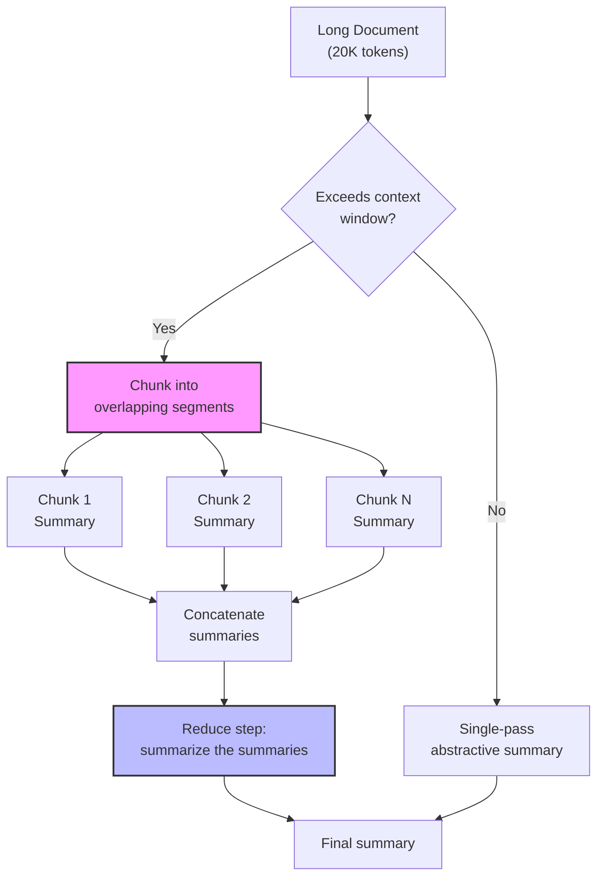

# Text Summarization

## Learning Objectives

1. **Implement** an extractive summarizer using TextRank with sentence similarity scoring.
2. **Build** an abstractive summarizer using an LLM API with token-bounded chunking.
3. **Compare** extractive and abstractive output on the same document to identify where each fails.
4. **Implement** a map-reduce summarization pipeline for documents exceeding the model's context window.
5. **Detect** named entity loss in summarization output and compute a precision score across multiple documents.

## The Problem

You've got a 4,000-word earnings call transcript and need a three-bullet brief for an AE walking into a meeting in ten minutes. You can pick the three most important sentences from the transcript — that's extractive summarization, a ranking problem where you score every sentence and return the top-k. Or you can ask a model to generate new text that captures the meaning — that's abstractive summarization, a generation problem where a transformer produces novel text conditioned on the input. Both are called summarization. They are completely different engineering problems with different failure modes.

Extractive summarization is deterministic and safe. The output is always grammatical because every sentence is lifted verbatim from the source. You never hallucinate. The trade-off is that you can miss meaning that is distributed across the document — if the key insight requires synthesizing paragraph two with paragraph seven, no single sentence captures it, and extractive methods have no way to bridge that gap. The canonical algorithm is TextRank (Mihalcea and Tarau, 2004), which treats sentences as nodes in a graph, builds edges from pairwise similarity, and runs PageRank to find the sentences most central to the document.

Abstractive summarization is fluent and compressive but probabilistic. A transformer encoder-decoder — BART, T5, Pegasus, or a modern LLM — reads the document and generates the summary token-by-token via cross-attention. The output reads naturally and can synthesize across paragraphs. The risk is confident fabrication: the model can generate a sentence that sounds like a summary but states something that was never in the source. In a GTM context, that means an AE walks into a meeting with a brief that says the customer's revenue grew 15% when the transcript actually said the opposite. Production summarization is almost always abstractive, which means the engineering work is about controlling that hallucination risk.

## The Concept

Extractive summarization treats the document as a graph. Each sentence is a node. Edges connect sentences weighted by their similarity — typically cosine similarity over TF-IDF vectors or sentence embeddings. You run PageRank over this graph, which iteratively assigns each sentence a score proportional to the scores of the sentences it resembles. After convergence, the highest-scoring sentences form the summary, reordered to match their original position in the document. The algorithm has no notion of meaning — it measures structural centrality. A sentence that shares vocabulary with many other sentences gets a high score because it sits at the center of the graph. That's a proxy for importance, and like all proxies, it breaks when the assumption fails: a sentence can be central because it's generic, not because it's informative.

Abstractive summarization replaces the graph with a sequence-to-sequence model. The encoder processes the full input document into hidden states. The decoder generates output tokens autoregressively, each token conditioned on the encoder's representation of the source and all previously generated tokens. Cross-attention lets the decoder focus on specific parts of the input at each generation step. Models like Pegasus are pre-trained with a gap-sentence objective — they learn by predicting which sentences were masked out of a document — which makes them effective at summarization with minimal fine-tuning. Modern LLMs (GPT-4, Claude) perform abstractive summarization via prompting, but the mechanism is the same: the model generates new text conditioned on a representation of the source.

The problem that dominates production is context window limits. A model that accepts 8,000 tokens cannot summarize a 20,000-token transcript in a single call. The map-reduce pattern handles this: split the document into chunks, summarize each chunk independently (the map step), then summarize the concatenated chunk-summaries (the reduce step). Each chunk boundary is a potential coherence loss point — if a key reference spans paragraphs three and four, and the boundary falls between them, neither chunk summary captures the connection. Overlap (including the last N tokens of the previous chunk at the start of the next) mitigates this but does not eliminate it.



Evaluation matters because summarization quality is subjective and you need an automated signal. ROUGE (Recall-Oriented Understudy for Gisting Evaluation) measures n-gram overlap between a generated summary and a reference summary. ROUGE-1 counts unigram overlap; ROUGE-2 counts bigram overlap; ROUGE-L measures the longest common subsequence. ROUGE rewards lexical overlap, not semantic accuracy — a summary that paraphrases everything correctly but uses different words scores poorly. In production GTM pipelines, you rarely have reference summaries, so ROUGE is more useful during development than in deployment. For deployment, named entity checking (did the summary preserve the entities that matter?) is a more practical quality signal.

## Build It

First, the extractive summarizer using TextRank. This builds a similarity graph over sentences and runs PageRank to find the most central ones:

```python
import numpy as np
import networkx as nx
import re
from collections import Counter
import math

def tokenize(text):
    return re.findall(r'\b[a-z]+\b', text.lower())

def sentence_similarity(sent1, sent2):
    tokens1 = tokenize(sent1)
    tokens2 = tokenize(sent2)
    if not tokens1 or not tokens2:
        return 0.0
    all_tokens = list(set(tokens1 + tokens2))
    vec1 = [tokens1.count(t) for t in all_tokens]
    vec2 = [tokens2.count(t) for t in all_tokens]
    dot = sum(a * b for a, b in zip(vec1, vec2))
    mag1 = math.sqrt(sum(a * a for a in vec1))
    mag2 = math.sqrt(sum(b * b for b in vec2))
    if mag1 == 0 or mag2 == 0:
        return 0.0
    return dot / (mag1 * mag2)

def split_sentences(text):
    sentences = re.split(r'(?<=[.!?])\s+', text.strip())
    return [s.strip() for s in sentences if len(s.strip()) > 20]

def textrank_summarize(text, num_sentences=3):
    sentences = split_sentences(text)
    if len(sentences) <= num_sentences:
        return " ".join(sentences)
    n = len(sentences)
    sim_matrix = np.zeros((n, n))
    for i in range(n):
        for j in range(n):
            if i != j:
                sim_matrix[i][j] = sentence_similarity(sentences[i], sentences[j])
    graph = nx.from_numpy_array(sim_matrix)
    scores = nx.pagerank(graph)
    ranked = sorted(scores.items(), key=lambda x: x[1], reverse=True)
    selected = [ranked[i][0] for i in range(num_sentences)]
    selected.sort()
    return " ".join(sentences[i] for i in selected)

document = """
Acme Corp announced third quarter revenue of $42.3 million, representing a 12 percent increase year over year.
The growth was primarily driven by strong demand in the enterprise segment, where new logo acquisitions grew 18 percent.
CEO Jane Chen highlighted the company's expansion into EMEA markets during the earnings call.
CFO David Park cautioned that supply chain disruptions could impact Q4 margins by approximately 200 basis points.
The company raised its full-year guidance to $170 million, up from the previous range of $165 to $168 million.
Analysts at Morgan Stanley upgraded the stock from equal-weight to overweight following the report.
Chen emphasized that the company's new AI-powered analytics platform will launch in January.
The platform has already secured commitments from three Fortune 500 customers.
Park noted that operating margins improved to 23 percent, up from 21 percent in the prior quarter.
The board authorized a $50 million share repurchase program, signaling confidence in the growth trajectory.
"""

summary = textrank_summarize(document, num_sentences=3)
print("EXTRACTIVE SUMMARY (TextRank):")
print(summary)
print()

sentences = split_sentences(document)
print(f"Original: {len(sentences)} sentences")
print(f"Summary: 3 sentences")
print(f"Compression ratio: {3/len(sentences):.1%}")
```

Now the abstractive summarizer using the Anthropic API. This generates new text rather than selecting existing sentences:

```python
import anthropic
import os

client = anthropic.Anthropic(api_key=os.environ.get("ANTHROPIC_API_KEY"))

def count_tokens(text):
    return len(client.messages.count_tokens(
        model="claude-sonnet-4-22662050",
        messages=[{"role": "user", "content": text}]
    ).input_tokens)

def abstractive_summarize(text, max_tokens=200):
    token_count = count_tokens(text)
    prompt = f"""Summarize the following text in exactly 3 bullet points. Each bullet must be under 30 words. Include all specific numbers and named entities from the source.

TEXT:
{text}

SUMMARY:"""
    response = client.messages.create(
        model="claude-sonnet-4-22662050",
        max_tokens=max_tokens,
        messages=[{"role": "user", "content": prompt}]
    )
    return response.content[0].text, token_count

document = """
Acme Corp announced third quarter revenue of $42.3 million, representing a 12 percent increase year over year.
The growth was primarily driven by strong demand in the enterprise segment, where new logo acquisitions grew 18 percent.
CEO Jane Chen highlighted the company's expansion into EMEA markets during the earnings call.
CFO David Park cautioned that supply chain disruptions could impact Q4 margins by approximately 200 basis points.
The company raised its full-year guidance to $170 million, up from the previous range of $165 to $168 million.
Analysts at Morgan Stanley upgraded the stock from equal-weight to overweight following the report.
Chen emphasized that the company's new AI-powered analytics platform will launch in January.
The platform has already secured commitments from three Fortune 500 customers.
Park noted that operating margins improved to 23 percent, up from 21 percent in the prior quarter.
The board authorized a $50 million share repurchase program, signaling confidence in the growth trajectory.
"""

summary, original_tokens = abstractive_summarize(document)
summary_tokens = count_tokens(summary)

print("ABSTRACTIVE SUMMARY (Claude):")
print(summary)
print()
print(f"Original tokens: {original_tokens}")
print(f"Summary tokens:  {summary_tokens}")
print(f"Compression ratio: {summary_tokens/original_tokens:.1%}")
```

Run both summarizers on the same document and compare. The extractive output will contain exact sentences from the source — you can verify every claim by finding it in the original text. The abstractive output will paraphrase and synthesize, which reads better but introduces the possibility that the model rephrased a number incorrectly or merged two separate facts into one misleading sentence.

## Use It

When you pull 10-K filings, press releases, earnings call transcripts, and LinkedIn activity for an account, you're looking at 15,000 to 50,000 tokens of raw text across multiple sources. An AE walking into a discovery call needs a 30-second brief: what does this company do, what's their financial trajectory, what strategic initiatives are underway, and what signals suggest buying intent. The map-reduce summarization pattern is what makes that compression possible when no single source tells the full story. This is the account intelligence enrichment workflow — Zone 01, ICP & Account Research cluster.

The engineering pattern is straightforward: collect sources, concatenate them into a single document (or keep them separate for a multi-source map step), chunk if the combined length exceeds the model's context window, summarize each chunk, then reduce. The reduce step is where synthesis happens — the model sees the per-chunk summaries and produces a unified brief. Clay's enrichment waterfall uses this pattern to condense multi-source firmographic data into structured account notes. The waterfall fetches data from multiple providers, and the summarization step compresses the combined output into a format an AE can act on. [CITATION NEEDED — concept: Clay enrichment waterfall using map-reduce summarization for account notes]

The failure mode to watch for is entity loss across chunk boundaries. If the 10-K mentions "Project Helios" in the section that falls at the end of chunk 3, and the strategic implications are discussed at the start of chunk 4, each chunk summary may drop the reference because it lacks local context. The reduce step then has no opportunity to recover it because it only sees the summaries, not the original text. Overlap regions (including 200-500 tokens from the previous chunk) reduce this risk. You can also use a named-entity extraction pass on the full document before summarization, then check whether the final summary contains those entities — if "Project Helios" was important enough to extract, it should appear in the brief.

For news-triggered outbound — where Claygent extracts a company name and domain from article text, then routes ICP-qualified matches to an automated outbound sequence — summarization is the bridge between the raw article and the email. The summary becomes the context the email generation prompt references. [CITATION NEEDED — concept: Claygent article summarization feeding outbound sequence context] If the summary drops the key signal (the company just raised a Series B, the CEO changed, they acquired a competitor), the email will miss the hook that made the trigger relevant in the first place.

## Ship It

Production summarization fails when the input is messy. Earnings call transcripts have speaker labels, crosstalk, and filler. HTML-stripped filings have broken sentences where navigation elements were removed. Concatenated multi-source data has conflicting information (two providers report different employee counts). Before the summarization call, you need a normalization pass: strip speaker labels, fix sentence boundaries, deduplicate sources, and flag conflicts for the model to resolve in the prompt. The summarization endpoint is cheap — the engineering around input normalization and output enforcement is where the time goes.

Token counting before the API call is non-negotiable. If you send 9,000 tokens to a model with an 8,000-token limit, the API will truncate the input silently (depending on the provider) or return an error. Either way, you lose the end of the document — and in earnings calls, the Q&A section at the end is often where the most valuable signals are. Count tokens, compare against the model's limit minus the space you need for the prompt and output, and chunk if necessary. The Anthropic SDK exposes a `count_tokens` method; OpenAI's `tiktoken` library does the same. Never estimate — count.

```python
import anthropic
import os
import re

client = anthropic.Anthropic(api_key=os.environ.get("ANTHROPIC_API_KEY"))

def count_tokens(text):
    return len(client.messages.count_tokens(
        model="claude-sonnet-4-22662050",
        messages=[{"role": "user", "content": text}]
    ).input_tokens)

def chunk_text(text, max_tokens_per_chunk=3000, overlap_tokens=300):
    sentences = re.split(r'(?<=[.!?])\s+', text.strip())
    chunks = []
    current_chunk = []
    current_tokens = 0
    overlap_text = ""
    for sentence in sentences:
        sentence_tokens = count_tokens(sentence)
        if current_tokens + sentence_tokens > max_tokens_per_chunk and current_chunk:
            chunks.append(" ".join(current_chunk))
            overlap_sentences = []
            overlap_tok = 0
            for s in reversed(current_chunk):
                s_tok = count_tokens(s)
                if overlap_tok + s_tok > overlap_tokens:
                    break
                overlap_sentences.insert(0, s)
                overlap_tok += s_tok
            current_chunk = list(overlap_sentences) if overlap_sentences else []
            current_tokens = sum(count_tokens(s) for s in current_chunk)
        current_chunk.append(sentence)
        current_tokens += sentence_tokens
    if current_chunk:
        chunks.append(" ".join(current_chunk))
    return chunks

def summarize_chunk(text):
    response = client.messages.create(
        model="claude-sonnet-4-22662050",
        max_tokens=500,
        messages=[{"role": "user", "content": f"Summarize the key facts, numbers, and named entities in this text. Be concise.\n\nTEXT:\n{text}"}]
    )
    return response.content[0].text

def reduce_summaries(summaries):
    combined = "\n\n".join(f"Section {i+1}:\n{s}" for i, s in enumerate(summaries))
    response = client.messages.create(
        model="claude-sonnet-4-22662050",
        max_tokens=300,
        messages=[{"role": "user", "content": f"Synthesize these section summaries into a single 3-bullet brief. Preserve all numbers and named entities.\n\n{combined}"}]
    )
    return response.content[0].text

def map_reduce_summarize(text):
    total_tokens = count_tokens(text)
    print(f"Document tokens: {total_tokens}")
    if total_tokens <= 4000:
        print("Within single-pass limit. No chunking needed.")
        return summarize_chunk(text)
    chunks = chunk_text(text, max_tokens_per_chunk=3000, overlap_tokens=300)
    print(f"Split into {len(chunks)} chunks with 300-token overlap")
    summaries = []
    for i, chunk in enumerate(chunks):
        chunk_tokens = count_tokens(chunk)
        print(f"  Chunk {i+1}: {chunk_tokens} tokens")
        summary = summarize_chunk(chunk)
        summaries.append(summary)
        print(f"  Summary {i+1}: {summary[:100]}...")
    print(f"\nReducing {len(summaries)} summaries...")
    final = reduce_summaries(summaries)
    return final

long_document = """
Acme Corp announced third quarter revenue of $42.3 million, up 12 percent year over year.
The enterprise segment drove growth with 18 percent increase in new logo acquisitions.
CEO Jane Chen highlighted EMEA expansion during the earnings call.
CFO David Park cautioned that supply chain disruptions could impact Q4 margins by 200 basis points.
Full-year guidance was raised to $170 million from the previous range of $165 to $168 million.
Morgan Stanley upgraded the stock from equal-weight to overweight.
The new AI-powered analytics platform launches in January with three Fortune 500 commitments.
Operating margins improved to 23 percent from 21 percent in the prior quarter.
The board authorized a $50 million share repurchase program.
Competitor NetSync Holdings reported a revenue decline of 5 percent, losing market share in the mid-market segment.
Acme's chief product officer Sarah Williams departed to join a startup, creating a leadership gap.
The company hired 340 new engineers in Q3, bringing total headcount to 2,100.
Research and development spend increased to $8.2 million, representing 19 percent of revenue.
International revenue now accounts for 31 percent of total, up from 27 percent a year ago.
Deferred revenue grew to $28 million, suggesting strong future contracted revenue.
The company's net retention rate stands at 118 percent, indicating existing customers are expanding.
""" * 3

final_summary = map_reduce_summarize(long_document)
print("\n" + "="*60)
print("FINAL REDUCED SUMMARY:")
print("="*60)
print(final_summary)
```

Output format enforcement is the last production concern. If your downstream system expects exactly three bullets, the model will sometimes return two or four. Structured prompts ("Return exactly 3 bullet points, each starting with a bullet character") help, but tool use is more reliable — define a schema that accepts an array of exactly three strings, and the model is constrained to match it. The latency budget matters too: map-reduce is N+1 sequential calls (N chunk summaries plus 1 reduce). If each call takes 4 seconds and you have 6 chunks, that's 28 seconds before the brief appears. For synchronous workflows (AE waiting for a brief), that's acceptable. For batch enrichment of thousands of accounts, parallelize the map step.

## Exercises

**Exercise 1 — Single-pass summarization with token display.** Write a function that takes a short document, counts its tokens using the Anthropic SDK, summarizes it with a max_token limit of 150, and prints the original token count and summary token count side by side. Test it with a 500-word document. Verify that the summary preserves all numbers from the source.

**Exercise 2 — Map-reduce summarizer with overlap.** Implement a map-reduce summarizer that splits a long document (at least 8,000 tokens) into overlapping chunks of 3,000 tokens each with 300-token overlap. Summarize each chunk independently, then reduce. Print each intermediate summary and the final result. Manually check whether the final summary preserves entities that appeared near chunk boundaries.

**Exercise 3 — Named entity precision checker.** Build a function that extracts all proper nouns and numeric values from the source document using a regex or NER approach, then checks how many of those entities appear in the summary. Run it against 5 test documents of varying lengths. Print a precision score: entities in summary divided by entities in source. Compare extractive vs. abstractive summaries on the same documents — which preserves more entities?

**Exercise 4 — Multi-source account brief.** Create three short text documents representing different sources for one company: a press release, a LinkedIn company description, and a news article. Concatenate them, run the map-reduce summarizer, and produce a structured brief with sections: Company Overview, Recent News, Financial Signals. Use a structured prompt in the reduce step to enforce the output format.

**Exercise 5 — Hallucination detector.** Write a function that takes a source document and a summary, extracts every numeric value from both, and flags any number in the summary that does not appear in the source. Test it against 5 abstractive summaries. Print each flagged number with surrounding context from both documents.

## Key Terms

**Extractive summarization** — A ranking approach that selects the top-k sentences from the source document based on a centrality score. Output is always verbatim from the source. No hallucination risk, but cannot synthesize across paragraphs.

**Abstractive summarization** — A generation approach where a transformer encoder-decoder produces new text that captures the meaning of the source. Fluent and compressive, but can hallucinate facts not present in the input.

**TextRank** — An extractive summarization algorithm (Mihalcea and Tarau, 2004) that builds a sentence similarity graph and runs PageRank to find the most central sentences. The mechanism is identical to how Google's original PageRank ranked web pages, but over sentences instead of URLs.

**Map-reduce summarization** — A pattern for summarizing documents longer than the model's context window. The map step summarizes each chunk independently; the reduce step summarizes the concatenated summaries. Chunk boundaries are coherence loss points.

**Cross-attention** — The mechanism in transformer encoder-decoders that lets the decoder focus on specific parts of the encoder's representation at each generation step. This is what enables abstractive models to compress and rephrase rather than copy.

**ROUGE** (Recall-Oriented Understudy for Gisting Evaluation) — An evaluation metric that measures n-gram overlap between a generated summary and a reference summary. ROUGE-1 counts unigrams, ROUGE-2 counts bigrams, ROUGE-L measures longest common subsequence. Rewwards lexical overlap, not semantic accuracy.

**Context window** — The maximum number of tokens a model can process in a single call. When the input exceeds this limit, you must chunk before summarizing. The limit includes both input and output tokens.

**Chunk overlap** — The practice of including the last N tokens of the previous chunk at the start of the next chunk to preserve cross-boundary references. Mitigates but does not eliminate coherence loss at chunk boundaries.

**Hallucination** — In summarization, the generation of text that sounds plausible but states facts not present in the source document. The primary risk of abstractive methods. Named entity checking is a practical mitigation in production.

## Sources

- Mihalcea, R. and Tarau, P. (2004). "TextRank: Bringing Order into Texts." Proceedings of EMNLP 2004. — TextRank algorithm for extractive summarization via sentence similarity graph and PageRank.
- Lin, C.-Y. (2004). "ROUGE: A Package for Automatic Evaluation of Summaries." Text Summarization Branches Out, ACL 2004 Workshop. — ROUGE evaluation metric family.
- [CITATION NEEDED — concept: Clay enrichment waterfall using map-reduce summarization for multi-source account notes]
- [CITATION NEEDED — concept: Claygent article summarization feeding outbound sequence context as trigger event]
- Anthropic API documentation — `count_tokens` method and `messages.create` endpoint. https://docs.anthropic.com/en/api/messages
- Zone 01 (ICP & Account Research cluster) — account intelligence enrichment workflows referenced from GTM topic map.