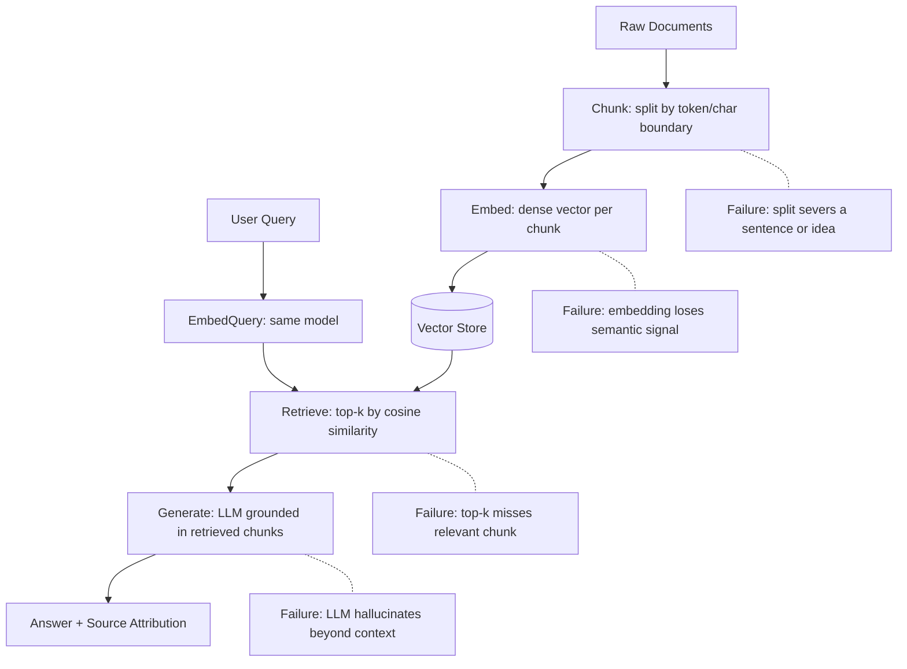

# Question Answering Systems

## Learning Objectives

1. Trace a query through the four-stage QA pipeline (chunk → embed → retrieve → generate) and identify which stage introduced a given failure.
2. Build a minimal retrieval-augmented QA system that indexes documents, retrieves relevant chunks via dense embedding similarity, and generates grounded answers with source attribution.
3. Compare extractive, retrieval-augmented, and closed-book QA architectures by their failure modes and output constraints.
4. Implement production guardrails — latency measurement, confidence thresholds, and evaluation logging — on a working QA pipeline.
5. Evaluate a QA system against known ground-truth answers using exact match and F1 metrics.

## The Problem

A user types "When did the first iPhone launch?" and expects "June 29, 2007." Not "Apple's history is long and varied." Not a bare "2007" with no context. A direct, grounded, correct answer sourced from something real.

Three architectures have dominated QA over the last decade, and they fail in different ways. **Extractive QA** takes a question and a passage known to contain the answer, then predicts the start and end token indices of the answer span in that passage. SQuAD is the canonical benchmark. By construction it cannot hallucinate — the output is always a substring of the input passage. It also cannot answer anything the passage does not cover, and it requires knowing which passage is relevant ahead of time. **Closed-book QA** drops retrieval entirely and asks a language model to answer from parametric memory — fast at inference, unreliable on facts the model did not memorize or got wrong during training. **Retrieval-augmented QA** splits the difference: retrieve the best few passages from a corpus, then generate an answer grounded in those passages. This is the architecture behind every "chat with your data" product.

The hard parts are not where vendors imply they are. The model is rarely the bottleneck. The retrieval step is where most QA systems break — a chunk was split at the wrong boundary, the embedding did not capture the semantic relationship between query and passage, or the top-k results were irrelevant to what the user actually asked. This lesson builds the full pipeline so you can observe each failure mode and measure where it occurs.

## The Concept

The retrieval-augmented QA pipeline has four stages, and each has a specific failure mode:



**Chunking** is stage one, and it is the most underweighted source of QA failures. You split raw documents into pieces small enough to embed meaningfully and large enough to carry a complete idea. Split too small and the chunk loses context ("29" without "June" and "2007" is useless). Split too large and the embedding averages over too many topics, diluting the signal for retrieval. Common strategies are fixed-size windows (split every N tokens), sentence-boundary splits (never break a sentence), and recursive splits (try paragraph, fall back to sentence, fall back to word). The right choice depends on document structure — 10-K filings have clean paragraphs; call transcripts are run-on dialogue.

**Embedding** maps each chunk to a dense vector. The model is the key variable: a general-purpose model like `all-MiniLM-L6-v2` encodes broad semantic similarity; a domain-specific model fine-tuned on financial text will retrieve better on 10-K filings. The embedding captures one thing — how similar the chunk's meaning is to the query's meaning, as measured by cosine similarity. If the query uses different vocabulary than the source ("revenue model" vs. "how does this company make money"), a weak embedding will miss the match.

**Retrieval** computes cosine similarity between the query vector and all chunk vectors, then returns the top-k. This is dense passage retrieval. The failure mode is obvious: if no relevant chunk is in the top-k, no amount of generation can save the answer. The retriever is a filter, and if it filters out the right chunk, the system cannot recover. Re-ranking — a second model that re-scores the top-k results with a more expensive but more accurate model — is one mitigation. Hybrid retrieval, which combines keyword (BM25) and semantic (dense) scores, is another.

**Generation** takes the retrieved chunks and the original query, constructs a prompt that says "answer the question using only this context," and asks an LLM to produce the answer. The failure mode is hallucination — the model generates text that sounds plausible but is not grounded in the retrieved context. Source attribution (forcing the model to cite which chunk it used) and post-generation checks (comparing the answer against the retrieved context) are the standard mitigations. The prompt matters: "If the answer is not in the context, say you don't know" reduces hallucination measurably compared to an open-ended prompt.

The extractive approach skips generation entirely and predicts token spans. A BERT-family encoder processes the question and passage together, and two classification heads predict start and end positions. The loss is cross-entropy over valid positions. This architecture never hallucinates (output is always a passage substring) but cannot rephrase, synthesize across chunks, or handle multi-hop reasoning. Modern systems use extractive models for the retrieval/ranking stage and generative models for the final answer.

## Build It

The system below implements the full four-stage pipeline. It indexes six document chunks (simulating company research notes), accepts a natural language query, retrieves the top-3 chunks by cosine similarity, and constructs a grounded prompt. If the `OPENAI_API_KEY` environment variable is set, it generates an answer with source attribution. If not, it prints the prompt and retrieved context so you can see exactly what would be sent to the LLM.

The code uses `sentence-transformers` for embeddings and `numpy` for similarity computation — no vector database, no framework. The vector store is a numpy array. This is intentional: you should see the mechanism before you use a tool that abstracts it.

```python
import os
import numpy as np
from sentence_transformers import SentenceTransformer

documents = [
    "Apple's primary revenue model is hardware sales, with the iPhone generating approximately 52% of total revenue in fiscal year 2023.",
    "Apple's services segment, including App Store, iCloud, and Apple Music, generated $85 billion in revenue in fiscal year 2023.",
    "Tesla's automotive revenue reached $82 billion in 2023, with the Model Y being the best-selling vehicle globally.",
    "Tesla's energy storage business deployed 14.7 GWh of capacity in 2023, a 125% increase year-over-year.",
    "Microsoft's cloud business, Azure, grew 29% year-over-year in Q3 2024, contributing significantly to overall revenue.",
    "Microsoft's productivity segment, including Office 365 and LinkedIn, generated $77.7 billion in revenue in fiscal year 2023.",
]

model = SentenceTransformer('all-MiniLM-L6-v2')

embeddings = model.encode(documents, normalize_embeddings=True)

query = "What is Apple's primary revenue model?"
query_embedding = model.encode([query], normalize_embeddings=True)[0]

similarities = np.dot(embeddings, query_embedding)

top_k = 3
top_indices = np.argsort(similarities)[::-1][:top_k]
retrieved = [(documents[i], float(similarities[i])) for i in top_indices]

print(f"Query: {query}\n")
print("Retrieved chunks (ranked by cosine similarity):")
for rank, (chunk, score) in enumerate(retrieved, 1):
    print(f"  [{rank}] score={score:.4f}")
    print(f"      {chunk}\n")

context = "\n".join([f"[{i+1}] {chunk}" for i, (chunk, _) in enumerate(retrieved)])

prompt = f"""Based on the following context, answer the question. Cite the source number. If the answer is not in the context, say "I don't have enough information."

Context:
{context}

Question: {query}

Answer:"""

print("--- Prompt sent to LLM ---")
print(prompt)
print("--- End prompt ---\n")

if os.environ.get("OPENAI_API_KEY"):
    from openai import OpenAI
    client = OpenAI()
    response = client.chat.completions.create(
        model="gpt-4o-mini",
        messages=[{"role": "user", "content": prompt}],
        temperature=0,
    )
    answer = response.choices[0].message.content
    print(f"Generated Answer: {answer}")
else:
    print("No OPENAI_API_KEY set. Skipping LLM generation.")
    print("The retrieved context and prompt above show what the LLM would receive.")
```

The output shows the similarity scores for each retrieved chunk. The top chunk should be the one about Apple's hardware revenue model, with a cosine similarity above 0.5 (on a normalized 0–1 scale where 1 is identical). The second chunk about Apple's services segment should also appear but with a lower score. This is the retrieval signal — if the wrong chunk appears first, the embedding model or the chunk content needs adjustment.

The `normalize_embeddings=True` parameter means the dot product is equivalent to cosine similarity, which simplifies the code. The `temperature=0` setting in the LLM call makes the output deterministic — you want the same answer for the same retrieved context every time, not creative variation.

## Use It

Retrieval-augmented generation — the dense-embedding similarity search plus grounded LLM synthesis pipeline — is the mechanism behind every "ask your knowledge base" feature in a GTM stack. In a GTM context, that knowledge base is your account research corpus: 10-K filings, earnings call transcripts, saved sales notes, technographic data. A rep asks "What is Snowflake's primary revenue model?" and the system retrieves the relevant chunk, generates an answer, and cites the source document.

This is not a chatbot. A chatbot generates open-ended conversation. A QA system returns specific answers traceable to specific source documents. The distinction matters for trust: a rep who sees "Source: [3] Snowflake Q3 FY2025 Earnings Call" can verify the answer against the transcript. A rep who sees a confident paragraph with no citation cannot.

In a GTM stack, this layer sits on top of enrichment data. The Clay waterfall enriches accounts with firmographic data — industry, employee count, revenue band, tech stack — by querying multiple data providers in sequence until a field is filled. [CITATION NEEDED — concept: Clay waterfall as sequential data provider enrichment]. That enrichment populates structured fields. The QA layer operates over unstructured data — the filings, transcripts, and notes that structured fields cannot capture. A rep can ask "Did this company mention budget constraints in the last earnings call?" and the QA system retrieves the relevant transcript chunk and generates an answer.

```python
import numpy as np
from sentence_transformers import SentenceTransformer

corpus = [
    "Snowflake's consumption-based pricing charges customers for compute and storage usage, creating revenue variability quarter to quarter.",
    "In the Q3 FY2025 earnings call, Snowflake's CFO noted that large customers are optimizing consumption, which may pressure near-term revenue growth.",
    "Snowflake reported $829 million in product revenue for Q3 fiscal 2025, up 28% year-over-year.",
    "Net revenue retention rate was 127% in Q3 FY2025, indicating existing customers are spending more over time.",
    "The Cortex AI product line is a key growth driver, with over 3,200 customers using AI features.",
]

model = SentenceTransformer('all-MiniLM-L6-v2')
embeddings = model.encode(corpus, normalize_embeddings=True)

queries = [
    "What is Snowflake's pricing model?",
    "Did Snowflake mention budget concerns?",
    "How is their AI product performing?",
]

for query in queries:
    q_emb = model.encode([query], normalize_embeddings=True)[0]
    scores = np.dot(embeddings, q_emb)
    top_idx = int(np.argmax(scores))
    print(f"Q: {query}")
    print(f"  [{top_idx+1}] score={scores[top_idx]:.4f}")
    print(f"  {corpus[top_idx]}\n")
```

Each query surfaces a different chunk from the same corpus. The pricing query hits the consumption-based pricing chunk. The budget query hits the CFO's consumption-optimization comment. The AI query hits the Cortex mention. If any retrieves the wrong chunk, the failure is in the embedding or the chunking — not in a model you cannot inspect.

## Exercises

**Easy**

1. Run the Build It code with the query "How much revenue did Tesla generate?" and verify that the correct chunk is retrieved first. Then change `top_k` from 3 to 1 and observe what changes in the output.

2. Modify the chunk size in the Build It code by splitting each document into two halves (first sentence and second sentence) and re-running the same query. Observe whether retrieval quality changes.

**Medium**

3. Add a re-ranking step to the Build It code: after retrieving the top-5 chunks, re-score them by computing a second metric (exact keyword overlap between the query and the chunk) and re-order. Compare the re-ranked order to the original.

4. Build a QA pipeline over three short sales call transcript excerpts. For each query, return the answer and print the transcript source and a simulated timestamp. Verify that the source attribution is correct by checking the retrieved chunk manually.

**Hard**

5. Implement hybrid retrieval: combine BM25 (keyword) scores with dense embedding scores. Use `rank_bm25` (`pip install rank_bm25`) for the keyword side. Weight the two scores (e.g., 0.5 dense + 0.5 keyword) and compare the top-3 results against semantic-only retrieval on 10 test questions.

6. Create an evaluation set of 20 questions about the six-company research corpus in Build It, each with a known ground-truth answer. Run the QA system on all 20, compute exact match (does the answer contain the ground-truth string) and token-level F1, and report both metrics.

## Key Terms

**Extractive QA** — Architecture that predicts start and end token indices of the answer span within a given passage. Output is always a substring of the input. Cannot hallucinate by construction. SQuAD is the canonical benchmark.

**Closed-book QA** — Architecture that generates answers purely from an LLM's parametric memory, with no retrieval step or external context. Fast at inference; fails on facts the model did not memorize or got wrong during training.

**Retrieval-augmented QA (RAG)** — Architecture that retrieves relevant passages from a corpus via dense embedding similarity, then generates an answer grounded in those passages. The dominant architecture behind "chat with your data" products.

**Chunking** — The process of splitting raw documents into pieces small enough to embed meaningfully and large enough to carry a complete idea. The most underweighted source of QA failures: a bad split severs context and degrades retrieval.

**Dense embedding** — A vector representation of text produced by a transformer-based encoder model, where semantic similarity between two texts is approximated by cosine similarity between their vectors. The `all-MiniLM-L6-v2` model maps text to 384-dimensional vectors.

**Cosine similarity** — The dot product of two normalized vectors, producing a score from -1 to 1 (in practice, 0 to 1 for text embeddings). The retrieval metric: higher means more semantically similar. The retriever returns the top-k chunks by this score.

**Confidence threshold** — A minimum cosine similarity score below which the system refuses to answer rather than generate from weak context. Set too low and the system hallucinates from barely-relevant chunks; set too high and it refuses queries it could answer. Typical range for `all-MiniLM-L6-v2` is 0.30–0.45 depending on corpus.

**Source attribution** — The practice of citing which retrieved chunk(s) the generated answer was derived from, typically by index number ([1], [2]) referencing the context window. Enables verification and builds trust — a rep can confirm the answer against the original document.

## Sources

1. Rajpurkar, P., Zhang, J., Lopyrev, K., & Liang, P. (2016). *SQuAD: 100,000+ Questions for Machine Comprehension of Text.* EMNLP 2016. — Canonical benchmark for extractive QA; defines the start/end span prediction task.
2. Reimers, N. & Gurevych, I. (2019). *Sentence-BERT: Sentence Embeddings using Siamese BERT-Networks.* EMNLP 2019. — Foundation for the `sentence-transformers` library and the `all-MiniLM-L6-v2` model used in this lesson.
3. Karpukhin, V., et al. (2020). *Dense Passage Retrieval for Open-Domain Question Answering.* EMNLP 2020. — Defines dense passage retrieval: replacing BM25 with learned dense embeddings for the retrieval stage.
4. Lewis, P., et al. (2020). *Retrieval-Augmented Generation for Knowledge-Intensive NLP Tasks.* NeurIPS 2020. — Introduces the RAG framework: retrieve-then-generate architecture for grounding LLM outputs in external knowledge.
5. Chen, D., Fisch, A., Weston, J., & Bordes, A. (2017). *Reading Wikipedia to Answer Open-Domain Questions.* ACL 2017. — DrQA; early formulation of the machine reading + retrieval pipeline for open-domain QA.