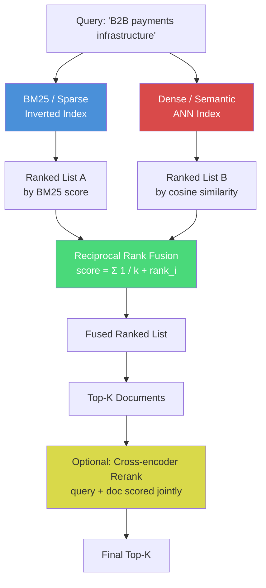

# Information Retrieval and Search

## Learning Objectives

- Implement three retrieval systems — sparse (TF-IDF/BM25), dense (vector similarity), and hybrid (reciprocal rank fusion) — and compare their ranked outputs on the same query.
- Compute BM25 and cosine similarity scores by hand on a small corpus to see why each method agrees or disagrees on relevance.
- Diagnose failure modes in each retrieval family: keyword mismatch for sparse, embedding blind spots for dense, and score-scale incompatibility for naive fusion.
- Build a hybrid retriever that fuses sparse and dense rankings, and tune the fusion parameter to shift precision versus recall.
- Evaluate a retrieval pipeline against a labeled relevance set using recall@k, and identify which documents each method misses.

## The Problem

You search your CRM for "companies like Stripe" and get nothing back. The name does not match, the industry tag says "software" instead of "fintech," and the detail you actually need — "payments infrastructure" — is buried in a free-text notes field that your search bar does not index. The query is semantically clear. The data exists. The retrieval system cannot bridge the gap.

This is not a CRM problem. It is the fundamental problem of information retrieval: given a user query and a corpus of documents, return the documents that satisfy the user's information need. The query and the document rarely share the same vocabulary. "What happens if someone lies to get money" is a reasonable query. "Section 420 IPC" is the document that answers it. Zero overlapping tokens. A keyword search returns nothing. A semantic search returns nothing if the embedding model was not trained on legal text. Real search has to handle both failure modes simultaneously.

Every enrichment waterfall, every account research agent, every "find me leads like this" workflow runs an IR pipeline under the hood. When a Clay waterfall queries multiple data providers and ranks the results by confidence, that is retrieval. When an account research agent searches a knowledge base for "enterprise SaaS companies with SOC 2 compliance," that is retrieval. When you deduplicate accounts by similarity rather than exact domain match, that is retrieval. The mechanism is the same in every case: represent the query, represent the documents, compute a relevance score, return the top-k. The only variables are the representation and the scoring function.

The 2026 architecture that works in production is not a single method. It is a chain of complementary methods, each catching the failures of the one before it.

## The Concept

There are three retrieval families. Each solves a different part of the mismatch problem, and each fails in a predictable way.

**Sparse retrieval** represents documents as high-dimensional vectors where each dimension corresponds to a word in the vocabulary. The value in each dimension is a weight computed by TF-IDF or its probabilistic cousin, BM25. BM25 scores documents based on term frequency (how often the query term appears), inverse document frequency (how rare the term is across the corpus), and document length normalization (shorter documents get a mild boost). The underlying data structure is an inverted index: for every term in the vocabulary, a sorted list of documents containing that term, along with the term's frequency in each. At query time, the system looks up each query term in the index, fetches the matching document lists, and intersects them. This is why keyword search is fast — it never scans documents that do not contain the query terms. BM25 is precise on exact matches: product codes, error messages, named entities, statute references. It is brittle on everything else. "Payments infrastructure" will not find "economic infrastructure for the internet" because the vocabulary does not overlap.

**Dense retrieval** represents documents as vectors produced by a neural embedding model — the same sentence-transformers family you built in the previous lesson. Instead of a sparse vector with 50,000 dimensions (one per vocabulary word), you get a dense vector with 384 or 768 dimensions where every dimension has a nonzero value. Relevance is computed as the cosine similarity (or dot product) between the query vector and each document vector. Dense retrieval captures paraphrases and semantic relationships: "B2B payments infrastructure" will find "economic infrastructure for the internet" because the embedding model learned that these phrases appear in similar contexts. The cost is a loss of keyword precision. A dense model can miss a document that contains the exact product code "STRIPE-001" because the embedding smooths it into a generic software-company vector. Dense retrieval also requires an approximate nearest neighbor (ANN) index — typically HNSW (Hierarchical Navigable Small World) or IVF (Inverted File Index) — because brute-force scanning every vector defeats the purpose at scale.

**Hybrid retrieval** runs both sparse and dense, then fuses their ranked lists. The fusion method that has become the default is Reciprocal Rank Fusion (RRF). RRF ignores raw scores entirely — which matters because BM25 scores and cosine similarities live on completely different scales — and uses only rank positions. For each document, RRF sums the reciprocal of its rank in each list: a document ranked 1st in the BM25 list contributes 1/61, and a document ranked 3rd in the dense list contributes 1/63 (the constant 60 is a smoothing parameter that prevents rank-1 from dominating). Documents that both methods rank highly shoot to the top. Documents that only one method found sink lower. The result is a ranking that catches both exact keyword matches and semantic paraphrases.



The optional fourth layer is a cross-encoder reranker. A cross-encoder takes the query and each candidate document as a single input pair and produces a relevance score. This is more accurate than the bi-encoder approach (embedding query and document separately, then comparing) because the model sees both texts together and can attend to fine-grained interactions. But it is expensive: you must run the model once per candidate pair, not once per document. So you run it only on the top 20–50 documents that survived fusion, not the full corpus. The trade-off across all four layers is precision versus recall versus latency. BM25 gives you precision on keywords. Dense gives you recall on semantics. Fusion gives you both. Reranking gives you a final accuracy boost at the cost of 50–200ms per query.

## Build It

We will implement all three retrievers — sparse, dense, and hybrid — against a toy corpus of company descriptions, then query them with "B2B payments infrastructure" and compare what each one returns. The corpus is small enough to inspect every score by hand, which is the only way to build intuition for where each method agrees and disagrees.

```python
import subprocess
import sys

subprocess.check_call([sys.executable, "-m", "pip", "install", "scikit-learn", "sentence-transformers", "-q"])

from sklearn.feature_extraction.text import TfidfVectorizer
from sklearn.metrics.pairwise import cosine_similarity
from sentence_transformers import SentenceTransformer
import numpy as np

corpus = [
    "Stripe is a technology company that builds economic infrastructure for the internet, including payment processing, billing, and financial APIs.",
    "Plaid provides a data network that powers fintech applications, enabling developers to connect bank accounts and verify financial data.",
    "Snowflake offers a cloud-based data warehouse platform for storing and analyzing large-scale structured and semi-structured data.",
    "Adyen is a payment platform that processes transactions for enterprise businesses across online, mobile, and point-of-sale channels.",
    "Twilio provides programmable communication APIs for SMS, voice, video, and messaging embedded in software applications.",
    "Marqeta offers a modern card issuing platform that enables businesses to create and manage virtual and physical payment cards.",
    "Databricks delivers a unified analytics platform combining data engineering, machine learning, and collaborative notebooks.",
    "Razorpay builds a full-stack payment solution for businesses in India, including payment gateway, subscriptions, and payouts.",
]

query = "B2B payments infrastructure"

vectorizer = TfidfVectorizer(stop_words="english")
doc_matrix = vectorizer.fit_transform(corpus)
query_vec = vectorizer.transform([query])
tfidf_scores = cosine_similarity(query_vec, doc_matrix).flatten()
tfidf_ranked = np.argsort(tfidf_scores)[::-1]

print("=" * 70)
print("SPARSE RETRIEVAL (TF-IDF cosine on keyword vectors)")
print("=" * 70)
for rank, idx in enumerate(tfidf_ranked):
    score = tfidf_scores[idx]
    label = " <-- query terms matched" if score > 0 else ""
    print(f"  Rank {rank+1} | score={score:.4f} | doc[{idx}]{label}")
    print(f"           {corpus[idx][:95]}...")
print()

model = SentenceTransformer("all-MiniLM-L6-v2")
doc_embeddings = model.encode(corpus, normalize_embeddings=True)
query_embedding = model.encode([query], normalize_embeddings=True)
dense_scores = cosine_similarity(query_embedding, doc_embeddings).flatten()
dense_ranked = np.argsort(dense_scores)[::-1]

print("=" * 70)
print("DENSE RETRIEVAL (cosine similarity on MiniLM embeddings)")
print("=" * 70)
for rank, idx in enumerate(dense_ranked):
    score = dense_scores[idx]
    print(f"  Rank {rank+1} | score={score:.4f} | doc[{idx}]")
    print(f"           {corpus[idx][:95]}...")
print()
```

Now the fusion step. RRF takes the two ranked lists and merges them by summing reciprocal ranks. The constant k=60 prevents rank-1 from overwhelming everything else.

```python
def reciprocal_rank_fusion(ranked_lists, k=60):
    fused_scores = {}
    for ranked_list in ranked_lists:
        for rank, doc_idx in enumerate(ranked_list):
            if doc_idx not in fused_scores:
                fused_scores[doc_idx] = 0.0
            fused_scores[doc_idx] += 1.0 / (k + rank + 1)
    sorted_docs = sorted(fused_scores.items(), key=lambda x: x[1], reverse=True)
    return sorted_docs

fused = reciprocal_rank_fusion([tfidf_ranked, dense_ranked], k=60)

print("=" * 70)
print("HYBRID RETRIEVAL (Reciprocal Rank Fusion, k=60)")
print("=" * 70)
for rank, (doc_idx, score) in enumerate(fused):
    sparse_rank = list(tfidf_ranked).index(doc_idx) + 1
    dense_rank = list(dense_ranked).index(doc_idx) + 1
    print(f"  Rank {rank+1} | rrf={score:.6f} | doc[{doc_idx}]")
    print(f"           sparse_rank={sparse_rank}, dense_rank={dense_rank}")
    print(f"           {corpus[doc_idx][:95]}...")
print()

print("=" * 70)
print("COMPARISON: Where do they disagree?")
print("=" * 70)
companies = ["Stripe", "Plaid", "Snowflake", "Adyen", "Twilio", "Marqeta", "Databricks", "Razorpay"]
for i, name in enumerate(companies):
    s_rank = list(tfidf_ranked).index(i) + 1
    d_rank = list(dense_ranked).index(i) + 1
    h_rank = [doc_idx for doc_idx, _ in fused].index(i) + 1
    gap = abs(s_rank - d_rank)
    flag = " *** DISAGREE" if gap >= 3 else ""
    print(f"  {name:12s} | sparse #{s_rank} | dense #{d_rank} | hybrid #{h_rank}{flag}")
```

When you run this, the sparse retriever will rank documents containing "payments" or "infrastructure" highly — Stripe, Adyen, Razorpay. It will rank Plaid lower because Plaid's description says "fintech" and "data network," not "payments." The dense retriever will rank Plaid higher because the embedding model learned that Plaid operates in the payments ecosystem. The hybrid ranking reconciles both: documents that both methods agree on stay at the top, and documents that only one method found move down. The comparison table at the end shows exactly where the two methods disagree, which is where fusion earns its keep.

## Use It

Your GTM data — company descriptions, technographic signals, news articles, job postings, enrichment provider responses — is a corpus. Treating it as one is the shift that separates a workflow that finds the right accounts from one that filters on a static industry dropdown.

Consider the enrichment waterfall. When a Clay waterfall queries Clearbit, then Apollo, then LinkedIn, and merges the responses, it is running a retrieval pipeline. Each provider returns fields with different names, different taxonomies, and different confidence levels. The waterfall's job is to rank these responses and pick the best one. That ranking is an IR scoring function. If you understand BM25, you understand why a provider that returns the exact industry name you searched for should score higher than one that returns a related category. If you understand dense retrieval, you understand why a provider that returns "fintech infrastructure" should still match a query for "payments" even when the strings do not overlap.

Consider the account research agent. An SDR types "enterprise SaaS companies with SOC 2 compliance in healthcare." The agent needs to retrieve matching accounts from a knowledge base of enriched company profiles. A keyword search on "SOC 2" will find companies whose descriptions literally contain that string. A dense search will also find companies described as "HIPAA-compliant" or "security-certified" because the embedding model knows these concepts are related. The hybrid pipeline catches both. The mechanism is the same three-layer chain from the Concept section — BM25 for precision, dense for recall, RRF to fuse — applied to your GTM corpus instead of a toy one.

[CITATION NEEDED — concept: enrichment waterfall as retrieval pipeline, specific Clay waterfall mechanism]

The same applies to the "find me leads like this" workflow. You hand the system a reference account — say, Stripe — and ask for 50 similar companies. Under the hood, this is a dense retrieval query: embed Stripe's enriched profile, compute cosine similarity against every other company in your CRM, return the top 50. The hard part is not the similarity computation. It is building the corpus: which fields to include in the embedding, how to weight the company description versus the technographic stack versus recent funding signals, and what to do about stale data. These are IR engineering decisions, not GTM strategy decisions. The SDR does not need to know about HNSW. You do.

## Ship It

Production retrieval systems face three problems that the toy corpus above does not expose. You will hit all three within the first month of shipping a retrieval-backed GTM workflow.

**Stale embeddings.** When source data updates — a company raises a Series C, adds a new technology to their stack, hires a Head of Security — the stored dense embedding no longer reflects the current document. The query "recently funded fintech" retrieves stale results. The fix is incremental reindexing: track which documents have changed (by content hash or updated_at timestamp), re-embed only those, and update the vector index in place. For a CRM with 50,000 companies and weekly enrichment runs, this means re-embedding a few hundred documents per run, not the full corpus. FAISS supports incremental adds. Pinecone and Weaviate handle this with upsert operations. Postgres pgvector does this with a simple UPDATE statement followed by an index refresh.

**Latency at scale.** Dense retrieval with brute-force scanning works up to about 10,000 documents in memory. Past that, you need an ANN index. FAISS with an IVF index handles millions of vectors in under 10ms per query on a single machine. HNSW (used by pgvector with the `hnsw` index type) gives similar latency in Postgres. Hosted vector databases (Pinecone, Weaviate, Qdrant) manage the index for you and handle sharding across machines. The trade-off: in-process FAISS is free, fast, and has zero network latency, but you manage persistence and reindexing yourself. Hosted services handle persistence, scaling, and metadata filtering, but add 20–50ms of network round-trip and cost money. For a GTM workflow that runs enrichment batch jobs overnight, in-process FAISS is usually sufficient. For a real-time account search interface where an SDR types and waits, the hosted option removes operational burden.

**Garbage in, garbage out in RAG.** When a retrieval pipeline feeds an LLM — for example, an account research agent that retrieves company context and generates a summary — the relevance threshold matters more than the model. If the retriever returns documents with a cosine similarity of 0.3, the LLM will hallucinate to fill the gap. If it returns only documents above 0.7, the LLM has solid context but the SDR sees fewer results. There is no universal threshold. You tune it against a labeled relevance set: a spreadsheet of 50 queries with human-judged relevant documents. Sweep the threshold from 0.3 to 0.8, compute precision and recall at each point, and pick the operating point that matches your use case. For an enrichment pipeline where false positives waste SDR time, favor precision (higher threshold). For a discovery pipeline where missing accounts is worse than a few irrelevant ones, favor recall (lower threshold).

Your enrichment agent's retrieval step is a production IR system. Treat it like one: version your embeddings, log your queries, measure your latency, and maintain a relevance set for evaluation.

## Exercises

**Easy.** Change the query in the Build It code to "communication APIs for developers" and rerun all three retrievers. Compare the rankings. Which documents does sparse find that dense misses, and vice versa? Write down your observations before checking the scores — you should be able to predict where BM25 and dense will disagree based on vocabulary overlap alone.

**Medium.** Implement RRF from scratch without using the provided function. Take the two ranked lists (`tfidf_ranked` and `dense_ranked`), compute the reciprocal rank score for each document, sort by fused score, and print the reordered list. Then change the k parameter from 60 to 1 and to 1000. Observe how k affects the balance between rank-1 documents and lower-ranked ones. A low k gives more weight to top-ranked documents; a high k flattens the differences.

**Hard.** Replace the toy corpus with 50 real company descriptions. You can pull these from a CSV exported from your CRM or scraped from company About pages. Create a hand-labeled relevance set: pick 5 queries, and for each, mark which of the 50 companies are relevant (binary judgment). Implement recall@5 — the fraction of relevant documents that appear in the top 5 results — for each retriever (sparse, dense, hybrid). Tune the RRF k parameter to maximize recall@5 across all 5 queries. Report which retriever wins and by how much. This is the same evaluation methodology used in production IR systems; the only difference is scale.

## Key Terms

**BM25 (Best Matching 25)** — A probabilistic ranking function that scores documents based on term frequency, inverse document frequency, and document length normalization. The standard algorithm for sparse retrieval. Computes a relevance score for each document given a keyword query.

**Inverted Index** — The data structure that makes keyword search fast. For every term in the vocabulary, stores a list of documents containing that term along with term frequencies. At query time, the system looks up query terms in the index and fetches matching documents without scanning the corpus.

**Dense Retrieval** — Retrieval based on neural embedding vectors. Documents and queries are encoded into dense vectors (typically 384–768 dimensions), and relevance is computed as cosine similarity or dot product. Captures semantic similarity but can miss exact keyword matches.

**Approximate Nearest Neighbor (ANN)** — Algorithms that find the k nearest vectors to a query vector approximately, trading a small accuracy loss for orders-of-magnitude speedup over brute-force search. HNSW (Hierarchical Navigable Small World) and IVF (Inverted File Index) are the two dominant families.

**Reciprocal Rank Fusion (RRF)** — A fusion method that merges multiple ranked lists by summing the reciprocal of each document's rank position across lists. Ignores raw scores, making it scale-invariant and suitable for combining retrievers with different score distributions. The smoothing constant k (default 60) controls how much weight rank-1 gets.

**Cross-Encoder Reranker** — A model that takes query and document as a single input pair and produces a relevance score. More accurate than bi-encoder approaches because the model sees both texts jointly, but more expensive because it runs once per candidate pair. Applied to the top-k candidates after initial retrieval.

**Recall@k** — An evaluation metric: the fraction of relevant documents that appear in the top-k results. Used to compare retrieval systems against a labeled relevance set. Precision@k is the complement: the fraction of top-k results that are relevant.

**Hybrid Retrieval** — A retrieval architecture that combines sparse and dense methods, typically via rank fusion. The production default in 2025–2026 because it catches both exact keyword matches and semantic paraphrases that either method alone would miss.

## Sources

- [CITATION NEEDED — concept: enrichment waterfall as retrieval pipeline in Clay, specific waterfall confidence ranking mechanism]
- [CITATION NEEDED — concept: "find me leads like this" as dense retrieval against CRM corpus, specific GTM workflow reference]
- The 80/20 GTM Engineer Handbook by Michael Saruggia (Growth Lead LLC) — referenced for GTM engineering foundations, enrichment, and signal-based execution framework. Section: TAM and outbound foundation, multichannel and signal-based execution. [CITATION NEEDED — concept: specific page or section reference for enrichment waterfall mechanics]
- BM25: Robertson, S., & Zaragoza, H. (2009). The Probabilistic Relevance Framework: BM25 and Beyond. Foundations and Trends in Information Retrieval, 3(4), 333-389.
- Reciprocal Rank Fusion: Cormack, G. V., Clarke, C. L. A., & Buettcher, S. (2009). Reciprocal Rank Fusion outperforms Condorcet and individual Rank Learning Methods. SIGIR 2009.
- HNSW: Malkov, Y. A., & Yashunin, D. A. (2018). Efficient and robust approximate nearest neighbor search using Hierarchical Navigable Small World graphs. arXiv:1603.09320.