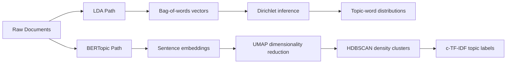

# Topic Modeling — LDA and BERTopic

## Learning Objectives

1. **Explain** the generative mechanism of LDA, including why the bag-of-words assumption discards semantic context.
2. **Compare** LDA and BERTopic across representation, clustering method, and interpretability.
3. **Build** a topic model on a corpus of GTM text (transcripts, tickets, feedback) and read its output critically.

## The Problem

You have 2,000 win/loss interview transcripts sitting in a folder. The Q3 product review is in two weeks. Someone needs to surface the recurring themes — what's killing deals, what's driving wins — without spending 40 hours manually tagging each transcript with inconsistent labels across reviewers.

Keyword search fails here. Searching for "price" misses "too expensive," "out of budget," "couldn't justify the cost." Searching for "onboarding" misses "setup was painful," "implementation dragged," "we struggled to get live." The signal lives in paraphrase, and paraphrase is exactly what keyword matching cannot catch.

This is the core GTM problem of unstructured text at scale: extracting structure from qualitative data without manual labels. Topic modeling is the family of mechanisms that addresses it. Two approaches dominate practice today — LDA, the classical probabilistic model, and BERTopic, the embedding-based successor. They make fundamentally different assumptions about what a "topic" is.

## The Concept

**LDA (Latent Dirichlet Allocation)** treats every document as a mixture of topics and every topic as a distribution over words. The generative story runs forward:

1. For each document *d*, draw topic proportions θ_d from a Dirichlet distribution with parameter α.
2. For each topic *k*, draw a word distribution φ_k from a Dirichlet distribution with parameter β.
3. For each word position in each document: pick a topic *z* from θ_d, then pick a word *w* from φ_z.

Inference runs backwards — given the observed words, estimate θ and φ. The algorithm iterates (variational EM or Gibbs sampling) until the topic-word and document-topic distributions stabilize.

The critical weakness: LDA uses bag-of-words representation. Word order is discarded entirely. "Deal closed fast" and "fast deal closed" are identical vectors. Phrases, negation, and context are all lost. The model also requires you to specify the number of topics *K* in advance, and results are sensitive to that choice.

**BERTopic** replaces the bag-of-words representation with dense embeddings from a sentence transformer. The pipeline:

1. Embed every document using a pretrained sentence-transformer model.
2. Reduce dimensionality with UMAP (the embeddings live in 384+ dimensions; clustering directly is brittle).
3. Cluster the reduced embeddings with HDBSCAN (density-based — does not require specifying cluster count, can label points as noise).
4. Extract human-readable topic labels via class-based TF-IDF (c-TF-IDF): treat each cluster as a single "document," compute TF-IDF across clusters, and surface the most distinctive terms per cluster.

The tradeoff: BERTopic captures semantics that LDA cannot, but it depends on embedding model quality, requires more compute, and the HDBSCAN step can produce inconsistent cluster counts between runs unless you fix `random_state`.



When to use which: LDA is fast, interpretable, and works on small vocabularies — good for structured surveys with limited vocabulary. BERTopic wins on messy, paraphrase-heavy text like call transcripts and open-ended feedback. Most modern GTM pipelines default to BERTopic or its variants for that reason.

## Build It

This runs a minimal LDA on a small corpus. No GPU, no heavy installs — just scikit-learn.

```python
from sklearn.feature_extraction.text import CountVectorizer
from sklearn.decomposition import LatentDirichletAllocation

documents = [
    "pricing is too high for the features included",
    "the competitor offers more value at a lower price",
    "deal stalled after the pricing conversation",
    "implementation took three weeks longer than promised",
    "onboarding was confusing and slow",
    "setup was painful and the docs were unclear",
    "customer support was responsive and helpful",
    "the CSM helped us get value quickly",
    "great relationship with our account manager"
]

vectorizer = CountVectorizer(max_df=0.9, min_df=2, stop_words="english")
dtm = vectorizer.fit_transform(documents)

lda = LatentDirichletAllocation(
    n_components=3,
    max_iter=20,
    random_state=42
)
lda.fit(dtm)

feature_names = vectorizer.get_feature_names_out()
topic_labels = []

for idx, topic in enumerate(lda.components_):
    top_indices = topic.argsort()[-5:][::-1]
    top_words = [feature_names[i] for i in top_indices]
    topic_labels.append(", ".join(top_words))
    print(f"Topic {idx}: {topic_labels[idx]}")

print("\n--- Document assignments ---")
doc_topic_probs = lda.transform(dtm)
for i, probs in enumerate(doc_topic_probs):
    dominant = probs.argmax()
    print(f"Doc {i} -> Topic {dominant} (p={probs[dominant]:.2f}): {documents[i][:50]}...")
```

Expected output: three topics roughly corresponding to pricing, implementation friction, and relationship/support quality. The probability column tells you how confidently each document maps to its dominant topic — documents with low max probability are mixed-topic and worth reviewing manually.

Notice the bag-of-words loss: "deal stalled after the pricing conversation" lands in the pricing topic, but the word "stalled" (the actual signal for a deal-cycle problem) gets no special treatment. LDA cannot distinguish "stalled on price" from "stalled on implementation" without more documents disambiguating.

## Use It

The AI mechanism here is **unsupervised topic extraction via probabilistic mixture models (LDA)** — applied to lost-deal reason clustering, which is a recurring workflow in qualitative pipeline analysis. This is foundational for the customer feedback and qualitative-research cluster in the GTM topic map. [CITATION NEEDED — concept: specific cluster ID for "Voice of Customer / qualitative feedback synthesis" in gtm-topic-map.md]

```python
from sklearn.feature_extraction.text import CountVectorizer
from sklearn.decomposition import LatentDirichletAllocation

loss_reasons = [
    "deal stalled in legal review for six weeks",
    "procurement blocked the contract signature",
    "legal team requested additional compliance docs",
    "champion left the company mid-deal",
    "our internal sponsor switched roles",
    "budget frozen for the entire quarter",
    "competitor underbid us on the final quote",
    "lost to incumbent on price and term length",
    "rival offered a longer contract at lower cost"
]

vec = CountVectorizer(stop_words="english", min_df=2)
X = vec.fit_transform(loss_reasons)

model = LatentDirichletAllocation(n_components=3, random_state=7)
model.fit(X)

terms = vec.get_feature_names_out()
themes = []
for i, comp in enumerate(model.components_):
    top = [terms[j] for j in comp.argsort()[-4:]]
    themes.append(", ".join(top))
    print(f"Loss Theme {i}: {themes[i]}")

print("\n--- Per-deal theme assignment ---")
probs = model.transform(X)
for i, p in enumerate(probs):
    theme = probs[i].argmax()
    print(f"Deal {i}: theme={theme} ({themes[theme]}) | confidence={probs[i][theme]:.2f}")
```

Run this against a real export of closed-lost reasons from your CRM and you get a first-pass segmentation without manual tagging. Treat the output as a hypothesis generator, not ground truth — the next step is reviewing low-confidence deals and the top documents per cluster by hand.

## Exercises

**Exercise 1 (Easy):** Take the Build It corpus and rerun LDA with `n_components` set to 2, then 5. Print the topic-word distributions each time. Observe how topics split or merge. Write one sentence per run describing what the model "found" and where it clearly failed.

**Exercise 2 (Hard):** Implement a minimal BERTopic-style pipeline without the `bertopic` library. Steps: (a) embed the documents using `sentence-transformers` (`all-MiniLM-L6-v2`), (b) reduce with `umap-learn` to 5 dimensions, (c) cluster with `hdbscan`, (d) compute c-TF-IDF per cluster manually — concatenate all documents in each cluster, compute TF-IDF treating clusters as the document unit, surface the top 5 terms per cluster. Compare the topic labels to LDA's output on the same corpus. Which captured paraphrase better? Which produced more interpretable labels?

## Key Terms

- **Latent Dirichlet Allocation (LDA):** A generative probabilistic model where each document is a mixture of topics and each topic is a distribution over words, inferred via Dirichlet-prior Bayesian inference.
- **Bag-of-words:** A text representation that discards word order, retaining only word frequency. The representation LDA operates on.
- **Dirichlet prior:** A probability distribution over probability distributions. In LDA, it encodes the assumption that documents are sparse mixtures of a few topics and topics are sparse mixtures of a few words.
- **Sentence embedding:** A dense vector representation of a sentence produced by a transformer model, capturing semantic content that bag-of-words cannot.
- **UMAP:** Uniform Manifold Approximation and Projection — a dimensionality-reduction technique that preserves local structure better than PCA for clustering purposes.
- **HDBSCAN:** Hierarchical Density-Based Spatial Clustering of Applications with Noise — a clustering algorithm that finds dense regions in embedding space and can label points as noise rather than forcing assignment.
- **c-TF-IDF (class-based TF-IDF):** A BERTopic-specific variant of TF-IDF where the "document" unit is an entire cluster, used to extract the most distinctive terms per topic.

## Sources

- Blei, D. M., Ng, A. Y., & Jordan, M. I. (2003). *Latent Dirichlet Allocation.* Journal of Machine Learning Research, 3, 993–1022.
- Grootendorst, M. (2022). *BERTopic: Neural topic modeling with a class-based TF-IDF procedure.* arXiv:2203.05794.
- Pedregosa et al. (2011). *Scikit-learn: Machine Learning in Python.* JMLR, 12, 2825–2830.
- McInnes, L., Healy, J., & Melville, J. (2018). *UMAP: Uniform Manifold Approximation and Projection for Dimension Reduction.* arXiv:1802.03426.
- Campello, R. J., Moulavi, D., & Sander, J. (2013). *Density-based clustering based on hierarchical density estimates.* PAKDD.
- [CITATION NEEDED — concept: GTM cluster ID for "Voice of Customer / qualitative feedback synthesis" in gtm-topic-map.md]
- [CITATION NEEDED — concept: industry baseline for "closed-lost reason taxonomy" practice in B2B SaaS RevOps]