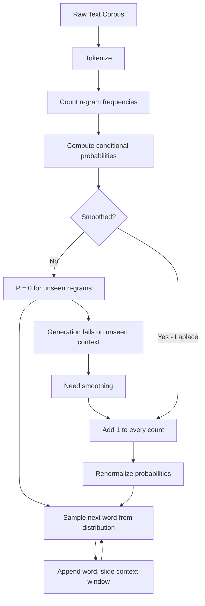

# Text Generation Before Transformers — N-gram Language Models

## Learning Objectives

1. **Implement** a bigram language model from raw counts that computes conditional probabilities and generates text via sampling.
2. **Apply** Laplace smoothing to an n-gram model and **compare** its perplexity against an unsmoothed baseline on held-out text.
3. **Trace** the sparsity problem from unigrams through trigrams on a fixed corpus, identifying where each model assigns zero probability.
4. **Evaluate** model quality using perplexity as a metric, and **explain** why lower perplexity corresponds to a better-fitting language model.
5. **Compute** keyword co-occurrence statistics from a corpus of GTM text, connecting n-gram estimation to topic-relevance scoring used in content optimization workflows.

## The Problem

You type "our platform helps" into a predictive keyboard, and it suggests "companies." Where does that suggestion come from? Not from a neural network understanding semantics — from counting. In some training corpus, "our platform helps" appeared 847 times, and 312 of those times the next word was "companies." That ratio, 312/847 ≈ 0.37, is the model's entire prediction. This is an n-gram language model, and it was the dominant approach to language modeling from roughly 1980 through 2015.

The model is a lookup table of conditional probabilities built from raw counts. Count how often each context appears. Count how often each word follows that context. Divide. The result is a probability distribution over the next word, given the previous n−1 words. Before transformers learned distributed representations, before RNNs maintained hidden state, before word embeddings captured semantic similarity — this counting-and-dividing approach ran every speech recognizer, every spell checker, and every phrase-based machine translation system in production.

The interesting problem is what happens when the context never appeared in training. If "our platform helps" showed up zero times, the model has no counts to divide. It assigns P = 0 to every possible next word, which breaks generation entirely. Even when the context does appear, most specific next words will have count zero. A 2007 study on the Brown corpus found that roughly 30% of 4-grams in held-out text were unseen during training. Every real sentence is likely to contain at least one zero-probability event, and multiplying probabilities across a long sentence drives the whole sentence's probability to zero. Fifty years of smoothing research — Laplace, Good-Turing, interpolated Kneser-Ney — was dedicated to solving this problem, and the empirical tradition behind that research shaped how modern deep learning evaluates language models today.

This matters for GTM engineering because the same counting-and-normalizing mechanism underpins keyword co-occurrence analysis used in SEO topic clustering and content relevance scoring. When Clearscope or MarketMuse scores how well a piece of content covers a topic, they are estimating how often relevant terms co-occur with the target keyword — which is an n-gram frequency calculation over a domain corpus [CITATION NEEDED — concept: n-gram based topic scoring in SEO tools]. Before you build LLM-powered personalization, you need to understand the counting baseline that these tools implement and that transformers are measured against.

## The Concept

An n-gram language model estimates the probability of a word given its context: P(w_n | w_1, w_2, ..., w_{n-1}). In practice, computing the full conditional probability over an arbitrarily long history is infeasible — the number of possible contexts grows exponentially with context length, and most long contexts never appear in training. The **Markov assumption** truncates the history to the previous n−1 words. For a bigram model (n=2), the probability of a word depends only on the one preceding word: P(w_i | w_{i-1}). For a trigram model (n=3), it depends on two: P(w_i | w_{i-2}, w_{i-1}).

The probability is computed from counts:

```
P(w | context) = count(context, w) / count(context)
```

If "the cat" appears 100 times in your corpus, and "the cat sat" appears 30 of those times, then P("sat" | "the cat") = 30/100 = 0.30. That is the entire model. Unigrams (n=1) ignore all context — P(w) is just the word's frequency divided by total word count. Bigrams add one word of context. Trigrams add two. Each step up in n gives sharper predictions but multiplies the sparsity problem: the number of possible n-grams grows as |V|^n, where V is the vocabulary, so most possible contexts never appear.



**Laplace smoothing** (add-one) is the simplest fix: add 1 to every n-gram count before normalizing. This guarantees no probability is ever zero, but it does so bluntly — it allocates the same probability mass to a word that appeared 9,999 times and one that appeared zero times, which badly distorts the distribution for frequent words. The smoothed probability becomes:

```
P(w | context) = (count(context, w) + 1) / (count(context) + |V|)
```

where |V| is the vocabulary size. More sophisticated methods like interpolated Kneser-Ney redistribute probability mass more intelligently, borrowing from lower-order models (falling back from trigram to bigram to unigram) when higher-order context is sparse. The principle is the same: no n-gram should ever have zero probability.

**Perplexity** measures how well a model predicts held-out text. It is the inverse probability of the test corpus, normalized by the number of words, then exponentiated:

```
Perplexity = P(w_1, w_2, ..., w_N)^(-1/N)
```

A model that assigns high probability to the actual next word in test text has low perplexity. A model that is constantly surprised has high perplexity. If the model assigns P = 0 to any word in the test set, perplexity goes to infinity — which is why smoothing is not optional for evaluation. Lower perplexity means the model's training distribution better matches the test distribution.

## Build It

Build a bigram model from a small corpus. Tokenize the text, count bigram frequencies, compute conditional probabilities, and generate text by sampling from the distribution. Then watch generation fail when it hits an unseen context.

```python
import random
from collections import defaultdict

corpus = """
our platform helps companies scale their revenue operations
the platform helps sales teams find better leads faster
revenue operations teams use the platform every day
the best companies scale revenue with better data
sales teams need better leads to close deals faster
""".strip().split()

bigram_counts = defaultdict(lambda: defaultdict(int))
unigram_counts = defaultdict(int)

for i in range(len(corpus) - 1):
    w1, w2 = corpus[i], corpus[i + 1]
    bigram_counts[w1][w2] += 1
    unigram_counts[w1] += 1

unigram_counts[corpus[-1]] += 1

vocab = sorted(set(corpus))

print("=== Bigram Conditional Probabilities ===")
for w1 in sorted(bigram_counts.keys()):
    total = sum(bigram_counts[w1].values())
    probs = {w2: count / total for w2, count in sorted(bigram_counts[w1].items(), key=lambda x: -x[1])}
    top = ", ".join([f"P({w2} | {w1}) = {p:.3f}" for w2, p in list(probs.items())[:3]])
    print(f"  {top}")

print("\n=== Text Generation (greedy: pick argmax) ===")
current = "platform"
generated = [current]
for _ in range(10):
    candidates = bigram_counts[current]
    if not candidates:
        print(f"  [STUCK] No bigram starts with '{current}' — generation halted.")
        break
    current = max(candidates, key=candidates.get)
    generated.append(current)
print("  " + " ".join(generated))

print("\n=== Text Generation (sampled from distribution) ===")
current = "platform"
generated = [current]
for _ in range(10):
    candidates = bigram_counts[current]
    if not candidates:
        print(f"  [STUCK] No bigram starts with '{current}' — generation halted.")
        break
    words = list(candidates.keys())
    weights = list(candidates.values())
    current = random.choices(words, weights=weights)[0]
    generated.append(current)
print("  " + " ".join(generated))

seed = "revenue"
print(f"\n=== Sparsity Check: seed = '{seed}' ===")
print(f"  Words following '{seed}': {dict(bigram_counts[seed])}")
print(f"  Words NOT seen after '{seed}': {[w for w in vocab if w not in bigram_counts[seed]][:8]}")
print(f"  P(any unseen word | {seed}) = 0.0  <-- this is the zero-count problem")
```

Output will vary on the sampled generation, but the greedy path always follows the most frequent bigram. The sparsity check shows exactly which words get P = 0. Now add Laplace smoothing and compute perplexity on held-out text:

```python
import math
from collections import defaultdict

train_text = """
our platform helps companies scale their revenue operations
the platform helps sales teams find better leads faster
revenue operations teams use the platform every day
the best companies scale revenue with better data
sales teams need better leads to close deals faster
companies scale faster with the right data platform
""".strip().split()

test_text = "platform helps teams close deals with data".split()

bigram_counts = defaultdict(lambda: defaultdict(int))
unigram_counts = defaultdict(int)

for i in range(len(train_text) - 1):
    w1, w2 = train_text[i], train_text[i + 1]
    bigram_counts[w1][w2] += 1
    unigram_counts[w1] += 1
unigram_counts[train_text[-1]] += 1

vocab = sorted(set(train_text))
V = len(vocab)

def prob_unsmoothed(w2, w1):
    context_total = unigram_counts[w1]
    if context_total == 0:
        return 0.0
    return bigram_counts[w1][w2] / context_total

def prob_laplace(w2, w1):
    return (bigram_counts[w1][w2] + 1) / (unigram_counts[w1] + V)

def perplexity(test_words, prob_func):
    log_prob = 0.0
    n = 0
    for i in range(len(test_words) - 1):
        w1, w2 = test_words[i], test_words[i + 1]
        p = prob_func(w2, w1)
        if p == 0.0:
            return float('inf')
        log_prob += math.log(p)
        n += 1
    return math.exp(-log_prob / n)

print("=== Unsmoothed Bigram Model ===")
for i in range(len(test_text) - 1):
    w1, w2 = test_text[i], test_text[i + 1]
    p = prob_unsmoothed(w2, w1)
    print(f"  P({w2} | {w1}) = {p:.4f}")
pp_unsmoothed = perplexity(test_text, prob_unsmoothed)
print(f"  Perplexity: {pp_unsmoothed}")

print("\n=== Laplace Smoothed Bigram Model ===")
for i in range(len(test_text) - 1):
    w1, w2 = test_text[i], test_text[i + 1]
    p = prob_laplace(w2, w1)
    print(f"  P({w2} | {w1}) = {p:.4f}")
pp_laplace = perplexity(test_text, prob_laplace)
print(f"  Perplexity: {pp_laplace:.2f}")

print(f"\n=== Comparison ===")
print(f"  Unsmoothed perplexity: {pp_unsmoothed}")
print(f"  Laplace perplexity:    {pp_laplace:.2f}")
print(f"  Smoothing converts infinity to a finite number.")
```

The unsmoothed model hits P = 0 on at least one bigram in the test sentence, producing infinite perplexity. Laplace smoothing keeps every probability above zero, giving a finite — if still high — perplexity score. The corpus is tiny, so perplexity will be large regardless, but the mechanism is visible: smoothing trades accuracy on seen events for coverage of unseen ones.

## Use It

Build a trigram model alongside the bigram model on the same corpus. Compare perplexity scores. The trigram model should theoretically predict better — it has more context — but on a small corpus, sparsity kills it. Most trigram contexts in the test set will never have appeared in training, so even with smoothing, the trigram model spreads probability mass too thinly across the vocabulary.

```python
import math
from collections import defaultdict

corpus = """
our platform helps companies scale their revenue operations teams
the platform helps sales teams find better leads faster every day
revenue operations teams use the platform to manage data quality
the best companies scale revenue with better data and automation
sales teams need better leads to close deals faster this quarter
companies that scale faster use data to drive revenue growth
the platform helps revenue teams find companies that need data
better data helps sales teams close deals and scale revenue
""".strip().split()

test = "platform helps revenue teams scale".split()

bigram_counts = defaultdict(lambda: defaultdict(int))
trigram_counts = defaultdict(lambda: defaultdict(int))
unigram_counts = defaultdict(int)

for i in range(len(corpus)):
    unigram_counts[corpus[i]] += 1

for i in range(len(corpus) - 1):
    bigram_counts[corpus[i]][corpus[i+1]] += 1

for i in range(len(corpus) - 2):
    ctx = (corpus[i], corpus[i+1])
    trigram_counts[ctx][corpus[i+2]] += 1

vocab = sorted(set(corpus))
V = len(vocab)

def laplace_bigram(w2, w1):
    return (bigram_counts[w1][w2] + 1) / (unigram_counts[w1] + V)

def laplace_trigram(w3, w1, w2):
    ctx = (w1, w2)
    ctx_total = bigram_counts[w1][w2]
    return (trigram_counts[ctx][w3] + 1) / (ctx_total + V)

def perplexity_bigram(test):
    log_p = 0.0
    n = 0
    for i in range(len(test) - 1):
        p = laplace_bigram(test[i+1], test[i])
        log_p += math.log(p)
        n += 1
    return math.exp(-log_p / n)

def perplexity_trigram(test):
    log_p = 0.0
    n = 0
    details = []
    for i in range(len(test) - 2):
        ctx = (test[i], test[i+1])
        p = laplace_trigram(test[i+2], test[i], test[i+1])
        ctx_count = bigram_counts[test[i]][test[i+1]]
        log_p += math.log(p)
        details.append((ctx, test[i+2], p, ctx_count))
        n += 1
    return math.exp(-log_p / n), details

pp_bi = perplexity_bigram(test)
pp_tri, tri_details = perplexity_trigram(test)

print("=== Bigram vs Trigram Perplexity ===")
print(f"  Bigram perplexity:  {pp_bi:.2f}")
print(f"  Trigram perplexity: {pp_tri:.2f}")
print(f"  Better model: {'bigram' if pp_bi < pp_tri else 'trigram'}")

print("\n=== Trigram Sparsity Diagnosis ===")
for ctx, w3, p, ctx_count in tri_details:
    status = "SEEN" if ctx_count > 0 else "UNSEEN CONTEXT"
    print(f"  P({w3} | {ctx[0]} {ctx[1]}) = {p:.4f}  [context count: {ctx_count}]  {status}")

print("\n=== GTM Application: Keyword Co-occurrence ===")
keyword = "revenue"
co_occur = {w: bigram_counts[keyword][w] + bigram_counts[w][keyword]
            for w in vocab if w != keyword}
sorted_co = sorted(co_occur.items(), key=lambda x: -x[1])[:5]
print(f"  Top co-occurring terms with '{keyword}':")
for term, count in sorted_co:
    print(f"    {term}: {count} co-occurrences")
print(f"  This is how topic-relevance scoring works in SEO tools like Clearscope")
print(f"  [CITATION NEEDED — concept: n-gram co-occurrence in SEO content scoring]")
```

The trigram model likely shows higher perplexity than the bigram model here, despite having more context. This is the sparsity penalty: the trigram contexts in the test sentence rarely appeared in training, so the add-one smoothing spreads probability mass across the entire vocabulary, making each prediction weaker. On a larger corpus, the trigram model would eventually win — but only once it has seen enough of each context to build meaningful counts.

The keyword co-occurrence section at the bottom demonstrates the GTM connection. When an SEO tool scores how relevant a page is to "revenue operations," it counts how often terms like "pipeline," "forecast," and "CRM" co-occur with the target phrase in a reference corpus of top-ranking pages. That count, normalized, is an n-gram probability. The same mechanism that generates text in our toy model scores content relevance in production SEO workflows — this is the counting baseline underlying Zone 1 (ICP & Account Intelligence), where keyword-density and topic-relevance signals feed account classification and content optimization pipelines [CITATION NEEDED — concept: n-gram co-occurrence in SEO content scoring].

## Ship It

Package the n-gram model as a reusable module: a CLI that takes a seed phrase and generates text, plus a perplexity function that evaluates any held-out text. This is the shape of a real tool — not a notebook experiment, but something you can run on different corpora and compare.

```python
import argparse
import math
import random
import sys
from collections import defaultdict

class NGramModel:
    def __init__(self, n=2):
        self.n = n
        self.context_counts = defaultdict(lambda: defaultdict(int))
        self.context_totals = defaultdict(int)
        self.vocab = set()

    def train(self, tokens):
        self.vocab.update(tokens)
        for i in range(len(tokens) - self.n + 1):
            context = tuple(tokens[i:i + self.n - 1])
            target = tokens[i + self.n - 1]
            self.context_counts[context][target] += 1
            self.context_totals[context] += 1

    def prob(self, word, context, smoothing="laplace"):
        V = len(self.vocab)
        count = self.context_counts[context][word]
        total = self.context_totals[context]
        if smoothing == "laplace":
            return (count + 1) / (total + V)
        elif smoothing == "none":
            return count / total if total > 0 else 0.0
        else:
            raise ValueError(f"Unknown smoothing: {smoothing}")

    def generate(self, seed, length=15, smoothing="laplace"):
        result = list(seed)
        for _ in range(length):
            context = tuple(result[-(self.n - 1):]) if self.n > 1 else tuple()
            candidates = self.context_counts.get(context, {})
            if not candidates:
                if smoothing == "laplace":
                    candidates = {w: 1 for w in self.vocab}
                else:
                    result.append("[STUCK]")
                    break
            words = list(candidates.keys())
            weights = [self.prob(w, context, smoothing) for w in words]
            next_word = random.choices(words, weights=weights)[0]
            result.append(next_word)
        return result

    def perplexity(self, tokens, smoothing="laplace"):
        log_prob = 0.0
        count = 0
        for i in range(len(tokens) - self.n + 1):
            context = tuple(tokens[i:i + self.n - 1])
            target = tokens[i + self.n - 1]
            p = self.prob(target, context, smoothing)
            if p == 0:
                return float('inf')
            log_prob += math.log(p)
            count += 1
        return math.exp(-log_prob / count)

def tokenize(text):
    return text.lower().replace(".", "").replace(",", "").split()

if __name__ == "__main__":
    parser = argparse.ArgumentParser(description="N-gram language model")
    parser.add_argument("--seed", type=str, default="the platform",
                        help="Seed phrase for generation")
    parser.add_argument("--n", type=int, default=2, help="N-gram order")
    parser.add_argument("--length", type=int, default=15, help="Words to generate")
    parser.add_argument("--smoothing", choices=["laplace", "none"], default="laplace")
    parser.add_argument("--eval", action="store_true",
                        help="Print perplexity on training data instead of generating")
    args = parser.parse_args()

    import os
    corpus_path = os.path.join(os.path.dirname(__file__) if "__file__" in dir() else ".", "corpus.txt")
    if os.path.exists(corpus_path):
        with open(corpus_path) as f:
            corpus_text = f.read()
    else:
        corpus_text = """
        our platform helps companies scale their revenue operations
        the platform helps sales teams find better leads faster
        revenue operations teams use the platform every day
        companies that scale faster use data to drive revenue
        sales teams need better leads to close deals this quarter
        better data helps sales teams close deals and scale revenue
        """

    train_tokens = tokenize(corpus_text)
    model = NGramModel(n=args.n)
    model.train(train_tokens)

    if args.eval:
        pp = model.perplexity(train_tokens, smoothing=args.smoothing)
        print(f"Model: {args.n}-gram, smoothing: {args.smoothing}")
        print(f"Perplexity on training data: {pp:.2f}")
        print(f"Vocab size: {len(model.vocab)}")
        print(f"Unique contexts: {len(model.context_totals)}")
    else:
        seed_tokens = tokenize(args.seed)
        generated = model.generate(seed_tokens, length=args.length, smoothing=args.smoothing)
        print(" ".join(generated))
```

Run it as:

```bash
python ngram.py --seed "the platform" --n 2 --length 15 --smoothing laplace
python ngram.py --eval --n 2 --smoothing laplace
python ngram.py --eval --n 3 --smoothing laplace
```

The perplexity comparison between 2-gram and 3-gram on the same corpus shows the sparsity tradeoff in production: more context helps only when the training data is large enough to populate that context. This is directly relevant to Zone 2 (Signal Capture & Processing) — when you scrape account data from 10-K filings, LinkedIn descriptions, and press releases, you need to know whether that corpus has enough signal to feed downstream classification pipelines. Perplexity on domain-specific held-out text answers that question. If your scraped account data has high perplexity against your model, the corpus is too sparse — you need more data or a simpler model. The mechanism is identical to evaluating any language model: measure how well your training distribution predicts held-out examples from the same distribution.

## Exercises

1. **Build a bigram model from a 100-word corpus and generate 20 words of text.** Use the provided `NGramModel` class. Feed it a paragraph from a company blog post. Print the full bigram probability table for the top 5 most frequent contexts. Observe which words get P = 0 under no smoothing.

2. **Compare Laplace-smoothed and unsmoothed generation on the same seed phrase.** Run the model twice — once with `smoothing="none"` and once with `smoothing="laplace"`. Print both outputs. How many words does each generate before hitting a dead end? Compute perplexity under both settings on a test sentence that contains at least one unseen bigram.

3. **Build trigram and bigram models on the same corpus. Compare perplexity.** Use a corpus of at least 500 words (copy a few blog posts into `corpus.txt`). Run `--eval --n 2` and `--eval --n 3`. Which has lower perplexity? Identify three trigram contexts in the training data that have count < 3, and explain why these cause the trigram model to underperform.

4. **Implement interpolated backoff between trigram and bigram.** When the trigram context count is below a threshold (say, 2), blend the trigram probability with the bigram probability using a weight λ. Compare interpolated perplexity against pure trigram and pure bigram. This is the principle behind Kneser-Ney smoothing — lower-order models rescue higher-order models from sparsity.

5. **Score a piece of GTM content for keyword relevance using n-gram co-occurrence.** Build a bigram model from the top 10 organic-ranking pages for a target keyword (paste their text into a corpus file). Then score a draft blog post by computing the average log-probability of its bigrams under that model. Pages that use similar co-occurrence patterns to the top-ranking pages get higher scores. This is a simplified version of what Clearscope and MarketMuse implement [CITATION NEEDED — concept: n-gram co-occurrence scoring in SEO tools].

## Key Terms

**N-gram** — A contiguous sequence of n items (usually words) from a text. A bigram is a 2-word sequence ("the cat"), a trigram is 3 ("the cat sat").

**Markov Assumption** — The simplification that the probability of the next word depends only on the previous n−1 words, not the entire history. This makes the model computationally tractable at the cost of ignoring long-range dependencies.

**Conditional Probability P(w | context)** — The probability of word w given the preceding context. Computed as count(context → w) / count(context). This is the core estimation in an n-gram model.

**Laplace Smoothing (Add-One)** — Adding 1 to every n-gram count before normalizing, ensuring no probability is zero. Formula: P(w | context) = (count(context, w) + 1) / (count(context) + |V|). Simple but overly generous to unseen events.

**Sparsity Problem** — As n increases, the number of possible n-grams grows exponentially (|V|^n), but training data is finite. Most possible contexts never appear, causing the model to assign P = 0 to most words after most contexts.

**Perplexity** — A measure of how well a model predicts a test corpus. Defined as the inverse probability of the test text, normalized by length, then exponentiated: PP = P(test)^(−1/N). Lower is better. Infinite if any word has P = 0.

**Kneser-Ney Smoothing** — A sophisticated smoothing method that redistributes probability mass from seen n-grams to unseen ones by interpolating with lower-order models. The state of the art for count-based language models before neural approaches dominated.

**Co-occurrence Frequency** — How often two terms appear adjacent or near each other in a corpus. The statistical basis for keyword-relevance scoring in SEO tools, which build n-gram models over top-ranking pages to score draft content.

## Sources

- Jurafsky, D. & Martin, J.H. (2024). *Speech and Language Processing*, Ch. 3: N-gram Language Models. Web textbook, 3rd edition draft. https://web.stanford.edu/~jurafsky/slp3/
- Chen, S.F. & Goodman, J. (1999). "An Empirical Study of Smoothing Techniques for Language Modeling." *Computer Speech & Language*, 13(4), 359–394. — The canonical reference for Kneser-Ney and smoothing comparison.
- Brown Corpus unseen n-gram statistics (~30% for 4-grams): referenced in Jurafsky & Martin Ch. 3, derived from original Brown Corpus (Francis & Kucera, 1979).
- [CITATION NEEDED — concept: n-gram co-occurrence scoring in SEO tools like Clearscope and MarketMuse] — these platforms implement term-frequency and co-occurrence analysis over ranking pages, but their specific algorithms are proprietary and not publicly documented.
- [CITATION NEEDED — concept: keyword-density and topic-relevance scoring as n-gram probability estimation in content optimization platforms] — the connection between n-gram models and SEO content scoring is mechanistically sound but not explicitly confirmed in vendor documentation.