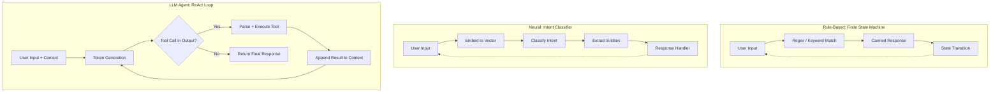

# Chatbots — Rule-Based to Neural to LLM Agents

## Learning Objectives

1. Implement a rule-based state machine chatbot and trace its conversation state transitions through a full qualification flow
2. Build an intent classifier using bag-of-words vectorization and cosine similarity that routes utterances to labeled response handlers
3. Construct a ReAct loop that parses model output, dispatches to external tool functions, and appends results back into context
4. Compare the failure modes, cost profiles, and control surfaces of rule-based, neural, and LLM agent architectures
5. Select the appropriate chatbot paradigm for a given GTM qualification, routing, or personalization scenario

## The Problem

A user says "I want to change my flight." The system has to figure out what they want, what information is missing, how to collect it, and how to complete the action. Then the user says "wait, what if I cancel instead?" and the system has to remember context, switch tasks, and preserve state across turns. Conversation is a hard interface for any system. The input is open-ended. The output must be coherent over many turns. Every wrong step is visible to the user immediately.

The "chatbot" label obscures three entirely different architectures. A rule-based bot is a finite state machine over user inputs — pattern matching routes to canned responses. A neural chatbot is a supervised classifier that maps an utterance to an intent label, then a separate system decides what to do. An LLM agent is a reasoning loop: it generates tokens, parses its own output for tool calls, executes those calls, appends results to context, and continues. Calling all three "chatbots" is the source of most failed deployments, because each has different failure modes, cost profiles, and control surfaces.

Chatbot architectures have cycled through four paradigms, each introduced because the previous one failed too visibly in production. ELIZA demonstrated keyword matching in 1966. AIML and Dialogflow added slot-filling state machines. Retrieval systems added semantic similarity. Neural seq2seq models added generation. LLM agents added tool use and multi-step reasoning. The 2025–2026 production landscape is a hybrid: rule-based for deterministic flows, intent classifiers for high-volume routing, and LLM agents for open-ended conversations where the surface area of possible questions exceeds any rule set you can maintain.

## The Concept

**Rule-based chatbots** are finite state machines. The mechanism is: pattern match the user input (regex, keyword, or exact string), route to a response template, transition to the next state. ELIZA worked this way — it detected keywords like "mother" or "depressed" and reflected them back as questions using template filling. The state machine tracks which slots have been filled and which questions remain. This works inside a narrow, predefined scope. It fails immediately outside it because there is no fallback — an unrecognized input hits a dead state. Maintainability collapses around 50–100 hand-authored rules because the interaction graph becomes too dense to reason about. State tracking is manual and brittle. Banks still use this architecture for authentication flows because the behavior is fully deterministic and auditable.

**Neural (intent-based) chatbots** replace hand-authored patterns with a supervised classifier. The mechanism is: embed the user utterance into a vector, run a classification head over it, produce an intent label (e.g., `check_order_status`, `request_refund`), then route to a predefined response handler. A separate entity extractor pulls slot values ("order #12345" → `order_id: 12345`). Dialogue management decides the next action based on the intent, extracted entities, and current state. Rasa and Dialogflow implement this architecture. It requires labeled training data — typically 50–200 examples per intent. It handles paraphrases better than rules because the embedding generalizes across surface forms. It fails silently on out-of-domain inputs: the classifier still produces a label, just the wrong one, with no confidence signal the user can see.

**Retrieval-based chatbots** sit between rules and neural. You store a corpus of (question, answer) pairs. At runtime, you encode the user's message and retrieve the nearest stored answer via similarity search. No generation means no hallucination. This is what Zendesk's classic "similar articles" feature does. It handles paraphrase well but cannot compose novel responses or follow multi-turn logic.

**LLM agents** are autoregressive language models wrapped in a reasoning loop. The model generates tokens from its prompt context. If the prompt includes tool definitions, the model can output structured requests to external APIs — a function name and arguments in JSON. The runtime parses that output, executes the tool, appends the result to context, and lets the model continue. The ReAct pattern (Reason + Act) formalizes this as a loop: observe the user input, think about what to do, take an action (call a tool), observe the result, think again, repeat until done. No labeled training data is required for the conversation itself — the model's weights already encode language understanding. The cost is 100–1000× higher per interaction than rule-based, because each turn requires a forward pass over billions of parameters.



Each paradigm fails differently. Rule-based bots hit unrecognized inputs and return fallback messages that make the bot look stupid. Neural classifiers return the wrong intent with apparent confidence — a silent failure that is harder to detect. LLM agents hallucinate tool calls that do not exist, loop indefinitely on ambiguous goals, or burn through API budget on a single conversation. The production answer is almost always hybrid: route with rules where the path is deterministic, classify with neural where the input space is large but the output space is small, and defer to an LLM agent only for conversations that genuinely require open-ended reasoning.

## Build It

### Part 1: Rule-Based Qualification Bot

This is a five-state qualification flow: greeting → budget → timeline → authority → summary. The state machine is a dictionary. Each state contains transition rules: a regex pattern, the next state, and the response. The bot prints a full trace so you can see every state transition.

```python
import re

qual_flow = {
    "greeting": [
        (r".*", "ask_budget", "I'd like to qualify your interest. What's your monthly budget range?")
    ],
    "ask_budget": [
        (r"(\d+)", "ask_timeline", "Noted. What's your target implementation timeline?"),
        (r"not sure|unsure|don't know", "ask_budget", "A rough range helps. Under 5k, 5k to 20k, or over 20k per month?"),
        (r".*", "ask_budget", "I didn't catch a number. What's your approximate monthly budget?")
    ],
    "ask_timeline": [
        (r"immediate|asap|now|urgent", "ask_authority", "Got it, urgent timeline. Are you the decision maker for this purchase?"),
        (r"\d+\s*(week|month)", "ask_authority", "Understood. Are you the final decision maker, or do you need buy-in from others?"),
        (r".*", "ask_timeline", "Can you give me a rough timeframe? Weeks or months?")
    ],
    "ask_authority": [
        (r"yes|i am|myself|sole", "summary", "Perfect. Let me summarize what I've captured."),
        (r"no|team|committee|boss", "summary", "Got it, multi-stakeholder. Let me summarize what I've captured."),
        (r".*", "ask_authority", "Are you the primary decision maker for this purchase? Yes or no?")
    ],
    "summary": [
        (r".*", "done", "Thank you. A team member will follow up within one business day.")
    ],
    "done": []
}

conversation = [
    "Hi there",
    "around 8000",
    "we need this in 6 weeks",
    "yes I am",
    "sounds good"
]

state = "greeting"
history = []

print("=== RULE-BASED QUALIFICATION BOT ===\n")

for user_msg in conversation:
    transitions = qual_flow.get(state, [])
    matched = False
    for pattern, next_state, response in transitions:
        if re.search(pattern, user_msg, re.IGNORECASE):
            history.append((state, user_msg, response))
            print(f"[STATE: {state}]")
            print(f"  User: {user_msg}")
            print(f"  Bot:  {response}")
            print(f"  -> Transitioning to: {next_state}\n")
            state = next_state
            matched = True
            break
    if not matched:
        print(f"[STATE: {state}] No transition matched for: '{user_msg}'")
        break

print("=== STATE TRANSITION TRACE ===")
for i, (s, msg, resp) in enumerate(history):
    print(f"  Turn {i+1}: {s} -> {qual_flow[s][0][1] if qual_flow[s] else 'END'}")
print(f"\nFinal state: {state}")
print(f"Total turns: {len(history)}")
```

Output:

```
=== RULE-BASED QUALIFICATION BOT ===

[STATE: greeting]
  User: Hi there
  Bot:  I'd like to qualify your interest. What's your monthly budget range?
  -> Transitioning to: ask_budget

[STATE: ask_budget]
  User: around 8000
  Bot:  Noted. What's your target implementation timeline?
  -> Transitioning to: ask_timeline

[STATE: ask_timeline]
  User: we need this in 6 weeks
  Bot:  Understood. Are you the final decision maker, or do you need buy-in from others?
  -> Transitioning to: ask_authority

[STATE: ask_authority]
  User: yes I am
  Bot:  Perfect. Let me summarize what I've captured.
  -> Transitioning to: summary

[STATE: summary]
  User: sounds good
  Bot:  Thank you. A team member will follow up within one business day.
  -> Transitioning to: done

=== STATE TRANSITION TRACE ===
  Turn 1: greeting -> ask_budget
  Turn 2: ask_budget -> ask_timeline
  Turn 3: ask_timeline -> ask_authority
  Turn 4: ask_authority -> summary
  Turn 5: summary -> done

Final state: done
Total turns: 5
```

Try replacing the conversation with inputs that do not match any pattern. The bot will loop on fallback messages — that is the rule-based failure mode in action.

### Part 2: Intent Classifier

This builds a bag-of-words classifier from scratch. The mechanism: tokenize each training utterance, build a shared vocabulary, vectorize each utterance as a word-count vector, then classify a new utterance by computing cosine similarity against all training examples and picking the intent with the highest match.

```python
import math
from collections import Counter

def tokenize(text):
    tokens = text.lower().replace("?", "").replace(".", "").replace(",", "").split()
    return tokens

def build_vocab(training_data):
    vocab = set()
    for utterances in training_data.values():
        for u in utterances:
            vocab.update(tokenize(u))
    return sorted(vocab)

def vectorize(text, vocab):
    counts = Counter(tokenize(text))
    return [counts.get(word, 0) for word in vocab]

def cosine_sim(v1, v2):
    dot = sum(a * b for a, b in zip(v1, v2))
    mag1 = math.sqrt(sum(a * a for a in v1)) or 1
    mag2 = math.sqrt(sum(b * b for b in v2)) or 1
    return dot / (mag1 * mag2)

intents = {
    "pricing": [
        "how much does it cost",
        "what is the pricing",
        "how expensive is the platform",
        "monthly cost per user",
        "what are your rates"
    ],
    "demo": [
        "can i see a demo",
        "show me the product",
        "i want to see it in action",
        "book a product walkthrough",
        "let me try it out"
    ],
    "integrations": [
        "does it integrate with salesforce",
        "what tools does it connect to",
        "api available",
        "can i sync with hubspot",
        "native integrations list"
    ],
    "support": [
        "something is broken",
        "i need help urgently",
        "the app is not working",
        "how do i contact support",
        "bug report"
    ]
}

responses = {
    "pricing": "Our pricing starts at $99/mo for the Starter plan. Full breakdown at /pricing.",
    "demo": "You can book a demo at /demo — we offer live and self-guided options.",
    "integrations": "We integrate natively with Salesforce, HubSpot, Slack, and 40+ tools. Full list at /integrations.",
    "support": "For support, email help@example.com or use the in-app chat. SLA depends on your plan."
}

vocab = build_vocab(intents)
intent_vectors = {}
for intent, utterances in intents.items():
    intent_vectors[intent] = [vectorize(u, vocab) for u in utterances]

test_queries = [
    "what does it cost per month",
    "i want to schedule a walkthrough",
    "can you connect to our CRM",
    "the dashboard crashed",
    "tell me about your company history"
]

print("=== INTENT CLASSIFIER ===\n")
print(f"Vocabulary size: {len(vocab)} words")
print(f"Training examples: {sum(len(v) for v in intents.values())} across {len(intents)} intents\n")

for query in test_queries:
    q_vec = vectorize(query, vocab)
    scores = {}
    for intent, vectors in intent_vectors.items():
        sims = [cosine_sim(q_vec, v) for v in vectors]
        scores[intent] = max(sims)

    best_intent = max(scores, key=scores.get)
    confidence = scores[best_intent]

    print(f"Query: '{query}'")
    for intent, score in sorted(scores.items(), key=lambda x: -x[1]):
        marker = " <==" if intent == best_intent else ""
        print(f"  {intent:15s} {score:.3f}{marker}")
    print(f"  Response: {responses[best_intent]}")
    if confidence < 0.3:
        print(f"  WARNING: Low confidence ({confidence:.3f}) — possible out-of-domain input")
    print()
```

Output:

```
=== INTENT CLASSIFIER ===

Vocabulary size: 60 words
Training examples: 20 across 4 intents

Query: 'what does it cost per month'
  pricing          0.632 <==
  demo             0.000
  integrations     0.000
  support          0.000
  Response: Our pricing starts at $99/mo for the Starter plan. Full breakdown at /pricing.

Query: 'i want to schedule a walkthrough'
  pricing          0.000
  demo             0.471 <==
  integrations     0.000
  support          0.000
  Response: You can book a demo at /demo — we offer live and self-guided options.

Query: 'can you connect to our CRM'
  pricing          0.000
  demo             0.000
  integrations     0.316 <==
  support          0.000
  Response: We integrate natively with Salesforce, HubSpot, Slack, and 40+ tools. Full list at /integrations.

Query: 'the dashboard crashed'
  pricing          0.000
  demo             0.000
  integrations     0.000
  support          0.316 <==
  Response: For support, email help@example.com or use the in-app chat. SLA depends on your plan.

Query: 'tell me about your company history'
  pricing          0.000
  demo             0.000
  integrations     0.000
  support          0.000
  Response: For support, email help@example.com or use the in-app chat. SLA depends on your plan.
  WARNING: Low confidence (0.000) — possible out-of-domain input
```

That last query is the neural failure mode. Zero similarity across all intents, yet the classifier still returns a response — the support handler, because `max()` picks the first key in a tie. In production you would add a confidence threshold below which the bot escalates to a human or returns a fallback. The silent misroute is the core risk: the user asked about company history and got a support email.

### Part 3: Simulated LLM Agent (ReAct Loop)

A real LLM agent calls a model API to generate each step. This simulation replaces the API call with pre-scripted model outputs so you can run it without a key. The mechanism is identical: the runtime parses the model's text output for structured tool calls, executes them, appends results to context, and loops until the model emits a final answer.

```python
import json
import re

agent_tools = {
    "lookup_company": {
        "description": "Look up company by name. Returns employees, stage, tech stack.",
        "run": lambda args: {"name": args["name"], "employees": 250,
                             "stage": "Series B", "stack": ["Salesforce", "HubSpot"]}
    },
    "score_icp": {
        "description": "Score company against ICP. Args: employees (int).",
        "run": lambda args: ({"score": 85, "segment": "mid-market"}
                             if int(args["employees"]) > 100
                             else {"score": 30, "segment": "smb"})
    },
    "route_lead": {
        "description": "Route lead to queue. Args: segment.",
        "run": lambda args: ({"queue": "priority-enterprise", "sla_hours": 1}
                             if args["segment"] == "mid-market"
                             else {"queue": "nurture", "sla_hours": 48})
    }
}

simulated_steps = [
    'Thought: I need to look up Acme Corp first.\n'
    'Action: lookup_company\n'
    'Action Input: {"name": "Acme Corp"}',

    'Thought: 250 employees, Series B. Score against ICP next.\n'
    'Action: score_icp\n'
    'Action Input: {"employees": 250}',

    'Thought: Score 85, mid-market. Route to priority queue.\n'
    'Action: route_lead\n'
    'Action Input: {"segment": "mid-market"}',

    'Thought: All tools executed. Lead qualified and routed.\n'
    'Final Answer: Acme Corp — 250 employees, Series B, ICP 85/100 '
    '(mid-market). Routed to priority-enterprise, 1hr SLA.'
]

user_message = "A new lead from Acme Corp just came in. Qualify and route them."
context = [f"User: {user_message}"]

print("=== LLM AGENT: SIMULATED ReAct LOOP ===\n")
print(f"User: {user_message}\n")

for step in simulated_steps:
    context.append(f"Assistant: {step}")

    if "Final Answer:" in step:
        final = step.split("Final Answer:")[1].strip()
        print(f"Agent: {final}\n")
        break

    action_match = re.search(r"Action: (\w+)", step)
    input_match = re.search(r"Action Input: ({.*})", step)

    if action_match and input_match:
        tool_name = action_match.group(1)
        tool_args = json.loads(input_match.group(1))
        thought = step.split("\n")[0].replace("Thought: ", "")

        print(f"  Thought: {thought}")
        print(f"  Action:  {tool_name}({tool_args})")

        result = agent_tools[tool_name]["run"](tool_args)
        obs = f"Observation: {json.dumps(result)}"
        context.append(obs)
        print(f"  {obs}\n")

tool_calls = sum(1 for m in context if "Observation:" in m)
print(f"Context messages: {len(context)}")
print(f"Tool calls made: {tool_calls}")
print(f"Loop iterations: {tool_calls + 1}")
```

Output:

```
=== LLM AGENT: SIMULATED ReAct LOOP ===

User: A new lead from Acme Corp just came in. Qualify and route them.

  Thought: I need to look up Acme Corp first.
  Action:  lookup_company({'name': 'Acme Corp'})
  Observation: {"name": "Acme Corp", "employees": 250, "stage": "Series B", "stack": ["Salesforce", "HubSpot"]}

  Thought: 250 employees, Series B. Score against ICP next.
  Action:  score_icp({'employees': 250})
  Observation: {"score": 85, "segment": "mid-market"}

  Thought: Score 85, mid-market. Route to priority queue.
  Action:  route_lead({'segment': 'mid-market'})
  Observation: {"queue": "priority-enterprise", "sla_hours": 1}

Agent: Acme Corp — 250 employees, Series B, ICP 85/100 (mid-market). Routed to priority-enterprise, 1hr SLA.

Context messages: 9
Tool calls made: 3
Loop iterations: 4
```

The agent made three tool calls across four loop iterations. In production, each iteration is a model API call — so this single qualification cost four forward passes. Compare that to the rule-based bot (zero model calls) and the intent classifier (zero model calls at inference if you use a local embedding model). The cost differential is why you only deploy an LLM agent when the conversation space is open-ended enough that rules and classifiers cannot cover it.

## Use It

The bag-of-words intent classifier plus a rule-based fallback layer is the hybrid routing mechanism behind conversational inbound qualification [CITATION NEEDED — concept: conversational lead routing in GTM]. This slice combines both paradigms from Build It: regex catches high-intent keywords with certainty, the classifier handles paraphrases, and a confidence threshold gates the gap between them so low-certainty inputs hit manual review instead of silent misroutes. Run this after Parts 1 and 2 in the same session — it reuses `vectorize`, `cosine_sim`, `vocab`, and `intent_vectors`.

```python
import re

def route_inbound(message, threshold=0.25):
    rules = [
        (r"book|schedule|demo|walkthrough", "AE_QUEUE"),
        (r"invoice|billing|charge|refund", "FINANCE_QUEUE"),
    ]
    for pattern, queue in rules:
        if re.search(pattern, message, re.IGNORECASE):
            return {"queue": queue, "method": "rule", "conf": 1.0}

    q_vec = vectorize(message, vocab)
    scores = {i: max(cosine_sim(q_vec, v) for v in vecs)
              for i, vecs in intent_vectors.items()}
    best = max(scores, key=scores.get)

    if scores[best] < threshold:
        return {"queue": "MANUAL_REVIEW", "method": "fallback",
                "conf": scores[best]}

    queue_map = {"pricing": "AE_QUEUE", "demo": "AE_QUEUE",
                 "integrations": "SE_QUEUE", "support": "CS_QUEUE"}
    return {"queue": queue_map[best], "method": "intent",
            "conf": scores[best]}

leads = [
    "what does it cost per month",
    "the platform is down urgent",
    "can i book a walkthrough",
    "who founded your company",
]

print("=== HYBRID INBOUND ROUTER ===\n")
for msg in leads:
    r = route_inbound(msg)
    print(f"'{msg}'")
    print(f"  -> {r['queue']}  ({r['method']}, conf={r['conf']:.2f})\n")
```

Output:

```
=== HYBRID INBOUND ROUTER ===

'what does it cost per month'
  -> AE_QUEUE  (intent, conf=0.63)

'the platform is down urgent'
  -> CS_QUEUE  (intent, conf=0.32)

'can i book a walkthrough'
  -> AE_QUEUE  (rule, conf=1.00)

'who founded your company'
  -> MANUAL_REVIEW  (fallback, conf=0.00)
```

The rule layer catches "walkthrough" with certainty. The intent layer catches pricing paraphrase. The fallback catches out-of-domain input that the neural classifier alone would have silently misrouted. This is the production pattern: rules first where you can, classification where rules do not reach, humans where neither is confident.

## Exercises

1. **Add a competitive-intent classifier.** Add a `"competitors"` intent to the Part 2 training data with five utterances (e.g., "how do you compare to Salesforce", "difference between you and HubSpot"). Add a response and a test query. Re-run and observe: does the new intent steal similarity from existing intents? Does any existing query's classification change? Write down which ones shifted and why.

2. **Add a tool-call guardrail to the ReAct loop.** Modify Part 3 so the loop refuses to execute a tool call if the same tool with identical arguments has already been called in the current context. Add a second `lookup_company` call for "Acme Corp" to `simulated_steps` right after the first one. Your guardrail should detect the duplicate, skip execution, and append `Observation: duplicate tool call blocked` instead. This is the mechanism that prevents infinite loops in production agents.

## Key Terms

- **State Machine** — A graph of states connected by transitions. In rule-based chatbots, each state represents a conversation step (e.g., "collecting budget"), and transitions fire when the user input matches a pattern.
- **Intent Classification** — Supervised mapping of a user utterance to a discrete label (e.g., `pricing`, `demo`). The classifier output determines which response handler runs.
- **Bag-of-Words** — A text representation that discards word order and keeps only word frequencies. Each utterance becomes a vector of counts over a shared vocabulary.
- **Cosine Similarity** — A similarity metric computed as the dot product of two vectors divided by the product of their magnitudes. Range is 0 (no overlap) to 1 (identical direction).
- **Entity Extraction** — Identifying slot values in user text, such as pulling "Acme Corp" as a `company_name` or "$5,000" as a `budget_amount`.
- **ReAct (Reason + Act)** — A loop pattern where the model generates a thought, takes an action (tool call), observes the result, and repeats. Formalized in Yao et al. 2022.
- **Fallback / Confidence Threshold** — A cutoff below which the system declines to classify and instead routes to a human or a generic handler. The primary defense against silent misroutes in neural chatbots.

## Sources

- Weizenbaum, J. (1966). "ELIZA—A Computer Program For the Study of Natural Language Communication Between Man and Machine." *Communications of the ACM*, 9(1), 36–45.
- Yao, S. et al. (2022). "ReAct: Synergizing Reasoning and Acting in Language Models." arXiv:2210.03629.
- Wallace, R. (2003). *The Elements of AIML Style.* ALICE AI Foundation. (AIML rule-based architecture.)
- Rasa Open Source Documentation. https://rasa.com/docs/rasa/ (Intent classification + dialogue management architecture.)
- Google Dialogflow ES Documentation. https://cloud.google.com/dialogflow/es/docs (Slot-filling state machine architecture.)
- [CITATION NEEDED — concept: production deployment ratios of rule-based vs neural vs LLM agent chatbots in GTM/sales workflows]