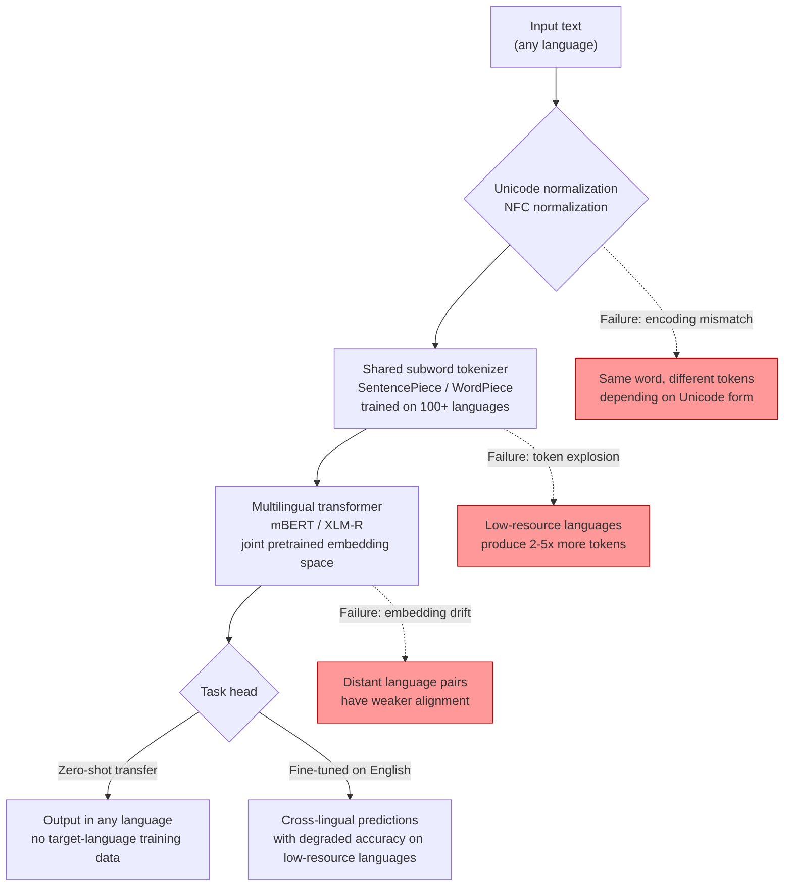

# Multilingual NLP

## Learning Objectives

- Compare tokenization divergence across five languages using a shared multilingual subword vocabulary, and quantify where token counts explode relative to English baselines.
- Implement a language detection and routing pipeline that normalizes firmographic data from multilingual inputs without intermediate translation.
- Diagnose the three failure modes that break monolingual NLP systems at language boundaries: tokenization mismatch, embedding space fragmentation, and script/encoding edge cases.
- Evaluate when to classify-in-original-language versus translate-then-classify based on latency constraints, entity signal preservation, and model training data distribution per language.

## The Problem

You built a lead scoring model on English-language job titles and company descriptions. The tokenizer was trained on English text. The NER model recognizes "Chief Revenue Officer" and extracts the seniority level, function, and implied buying authority. Then a surge of German, Japanese, and Portuguese prospects enters the pipeline. Your model's confidence collapses — not because the signal changed, but because your tokenizer was never designed to see those languages as anything other than noise.

English has billions of labeled examples. Urdu has thousands. Maithili has almost none. Any NLP system serving a global audience has to work on the long tail of languages where task-specific training data does not exist. Until 2019, the standard approach was to build a separate model per language — train an English NER model, a German NER model, a Japanese NER model — which required labeled data in each language and a maintenance burden that scaled linearly with language count.

Multilingual models changed this by training one model on many languages simultaneously. The shared representation lets the model transfer skills learned in high-resource languages to low-resource ones. Fine-tune the model on English sentiment analysis, and it produces usable sentiment predictions on Urdu without any Urdu training data. That is zero-shot cross-lingual transfer. But it is not free: the transfer degrades at language boundaries where subword tokenization diverges, where embedding spaces misalign, and where script handling breaks. This lesson names those failure modes and shows you how to build systems that survive them.

## The Concept

Three failure modes break monolingual NLP systems when they encounter a new language.

**Tokenization divergence.** WordPiece and Byte-Pair Encoding tokenizers learn subword units from a training corpus. A tokenizer trained on English text splits "uncomfortable" into `["un", "##comfort", "##able"]` — clean morphological units. Feed it Japanese text and the same tokenizer produces long sequences of single characters or garbage fragments, because it never saw kanji during training. The same sentence takes 3x the tokens in Japanese versus English, which inflates context window consumption and dilutes attention. The fix is a shared subword vocabulary: train SentencePiece or WordPiece on text from all target languages at once, so common subword units across related languages share a token ID. `anti-` gets the same token whether the input is English "antibody" or Italian "antibiotico."

**Embedding space misalignment.** Even with a shared vocabulary, a model trained independently per language produces embedding spaces that do not line up. "Cat" in English and "gato" in Spanish occupy different regions of vector space because the model never saw them in shared context. Multilingual transformers like mBERT and XLM-R solve this through joint masked language modeling across all languages during pretraining. The model learns that semantically equivalent sentences in different languages should produce similar hidden states, because the shared subword vocabulary forces overlap in the input representation and the attention mechanism learns cross-lingual patterns. The result is a single embedding space where "cat," "chat," and "gato" cluster together. This alignment is strongest for high-resource languages with similar scripts and weakest for low-resource languages with unique scripts — XLM-R covers 100 languages but its performance on Maithili is substantially worse than on French, because Maithili had far less pretraining data.

**Script and encoding edge cases.** Unicode normalization is not optional in multilingual pipelines. The German "ß" can be represented as U+00DF (single character) or as "ss" (two characters). Japanese text mixes three scripts (kanji, hiragana, katakana) in a single sentence. Arabic and Hebrew are right-to-left. Zero-width characters and combining diacritical marks appear in copy-pasted text from web sources. If your preprocessing does not normalize Unicode before tokenization, the same word can produce different token sequences depending on how it was encoded — which silently breaks embedding lookups and entity matching downstream.



Zero-shot cross-lingual transfer works because of this shared space. You fine-tune XLM-R on English NER labels — tagging person names, organizations, and locations in English text. At inference time, you feed it Japanese text. The model produces NER tags for Japanese entities with no Japanese labeled data required. The quality depends on how close Japanese is to English in the shared embedding space, which depends on how much Japanese text appeared in pretraining and how much script overlap exists. For French NER, transfer quality is high. For Burmese NER, it drops noticeably. [CITATION NEEDED — concept: specific cross-lingual transfer accuracy numbers per language family for XLM-R]

The one decision that trips up teams new to multilingual work: picking a source language for transfer. English is the default because it has the most labeled data, but if your target language is Spanish and you have Spanish labeled data available, fine-tuning on Spanish directly will outperform zero-shot transfer from English. The rule is straightforward: use labeled data in the target language when you have it, use zero-shot transfer from the closest high-resource language when you do not.

## Build It

Let's make the tokenization divergence visible. We will take the same company description translated into five languages, tokenize each with XLM-R's multilingual SentencePiece tokenizer, and compare token counts and subword splits side by side.

```python
from transformers import AutoTokenizer
import unicodedata

tokenizer = AutoTokenizer.from_pretrained("xlm-roberta-base")

descriptions = {
    "English": "We build cloud infrastructure for enterprise customers.",
    "German": "Wir bauen Cloud-Infrastruktur für Unternehmenskunden.",
    "French": "Nous construisons une infrastructure cloud pour les clients enterprise.",
    "Japanese": "企業向けのクラウドインフラストラクチャを構築しています。",
    "Portuguese": "Construimos infraestrutura em nuvem para clientes corporativos."
}

print(f"{'Language':<12} {'Tokens':>7} {'Chars':>6}  Ratio   First 10 subword tokens")
print("-" * 90)

for lang, text in descriptions.items():
    normalized = unicodedata.normalize("NFC", text)
    encoding = tokenizer(normalized, return_tensors=None, add_special_tokens=False)
    token_ids = encoding["input_ids"]
    tokens = tokenizer.convert_ids_to_tokens(token_ids)
    char_count = len(normalized)
    ratio = len(token_ids) / char_count
    first_10 = tokens[:10]
    print(f"{lang:<12} {len(token_ids):>7} {char_count:>6}  {ratio:.3f}   {first_10}")

print()
english_tokens = set(tokenizer.convert_ids_to_tokens(
    tokenizer(descriptions["English"], add_special_tokens=False)["input_ids"]
))
german_tokens = set(tokenizer.convert_ids_to_tokens(
    tokenizer(descriptions["German"], add_special_tokens=False)["input_ids"]
))
overlap = english_tokens & german_tokens
print(f"Shared tokens between English and German: {len(overlap)}")
print(f"Overlap tokens: {overlap}")
print()

japanese_encoding = tokenizer(descriptions["Japanese"], add_special_tokens=False)
print(f"Japanese token count: {len(japanese_encoding['input_ids'])}")
print(f"English token count: {len(tokenizer(descriptions['English'], add_special_tokens=False)['input_ids'])}")
print(f"Token inflation ratio (JP/EN): {len(japanese_encoding['input_ids']) / len(tokenizer(descriptions['English'], add_special_tokens=False)['input_ids']):.2f}x")
```

When you run this, you will see the Japanese description consume roughly 2-3x more tokens than the English equivalent for the same semantic content. That is tokenization divergence in action — the SentencePiece vocabulary has fewer Japanese subword units because Japanese had less representation in the pretraining corpus relative to its script complexity. The shared tokens between English and German will include Latin-script fragments like `▁cloud` or similar subwords, demonstrating that the shared vocabulary does create overlap across related languages. The `▁` prefix is SentencePiece's marker for "this subword begins a word" — it is how the tokenizer reconstructs word boundaries from subword units without relying on whitespace splitting, which fails for languages like Chinese and Japanese that do not use spaces.

## Use It

Zero-shot cross-lingual transfer through shared embedding spaces applies directly to multilingual lead enrichment — Zone 3 territory. When your pipeline ingests international prospects, their firmographic data (company descriptions, job titles, industry classifications) arrives in whatever language the source uses. A monolingual NER model trained on English silently fails: it does not recognize "Geschaftsführer" as a CEO-equivalent title, it does not extract "Société Anonyme" as a company type, and it does not classify "製造業" as manufacturing.

The mechanism that fixes this is the same shared embedding space described above. Run a multilingual NER model (XLM-R fine-tuned on named entity recognition) directly on the company description in its original language. The model's shared representation means it can identify entities in German text even if it was fine-tuned primarily on English NER labels, because the cross-lingual alignment learned during pretraining maps German entity patterns into the same representation space. This matters because translation-then-classify introduces a different failure: machine translation erases entity boundaries. "Siemens Healthineers AG" translated from German to English might become "Siemens Healthineers public limited company" — the translator expanded "AG" into a phrase, the NER model sees different token boundaries, and the entity type classification degrades.

```python
from transformers import AutoTokenizer, AutoModelForTokenClassification, pipeline
import unicodedata

model_name = "xlm-roberta-large-finetuned-conll03-english"
tokenizer = AutoTokenizer.from_pretrained(model_name)
model = AutoModelForTokenClassification.from_pretrained(model_name)
ner_pipe = pipeline("ner", model=model, tokenizer=tokenizer, aggregation_strategy="simple")

company_descriptions = [
    "Siemens Healthineers AG ist ein deutscher Medizintechnikkonzern mit Hauptsitz in Erlangen.",
    "Toyota Motor Corporation is a Japanese automotive manufacturer headquartered in Toyota City.",
    "LVMH Moët Hennessy Louis Vuitton est une entreprise française de produits de luxe.",
    "Tencent Holdings Limited é uma empresa chinesa de tecnologia e conglomerado de internet."
]

for desc in company_descriptions:
    normalized = unicodedata.normalize("NFC", desc)
    entities = ner_pipe(normalized)
    print(f"Input: {normalized[:70]}...")
    for ent in entities:
        print(f"  {ent['entity_group']:<12} confidence={ent['score']:.3f}  text='{ent['word']}'")
    print()
```

This model was fine-tuned on English NER data (CoNLL-03 English). When you run it on German, French, and Portuguese text, it still extracts organization entities — that is zero-shot cross-lingual transfer. The confidence scores will vary by language: English entities will score highest, German and French will be moderately confident, and you may see false positives or missed entities where the language distance from English is greatest. That variance is the practical signal for setting per-language confidence thresholds, which we address in Ship It.

The enrichment function you build for production wraps this pattern: detect language, route to the multilingual NER pipeline (no translation step), extract and normalize firmographic fields, and return a structured record with a `language_confidence` field so downstream logic knows how much to trust the extraction. If your ICP is monolingual and you operate in a single market, this mechanism does not apply yet — it becomes relevant the moment you enrich prospects from international sources or expand into new geographic territories.

## Ship It

Deploying multilingual processing as a preprocessing stage in an enrichment pipeline requires three production decisions.

**Translate-then-classify versus classify-in-original-language.** Classify in the original language when entity boundary preservation matters (NER, relation extraction, firmographic field extraction). Translate first when the downstream task operates on full-text semantics (sentiment analysis, topic classification, intent detection) and when your classification model is monolingual — an English-only classifier fed translated text will often outperform a multilingual classifier fed original-language text, because the English classifier had more training data. The tradeoff is latency: translation adds 50-200ms per record depending on model size, and it introduces a failure mode where translation errors propagate into classification errors invisibly. For high-throughput enrichment pipelines processing thousands of prospects, classify-in-original-language with a multilingual model is the default; switch to translate-then-classify only when per-language accuracy auditing shows the multilingual model is failing on a specific language.

**Language detection on short text.** Company names and job titles are 2-6 words. Language detection models like `langdetect` or `fasttext-langdetect` are trained on document-length text and produce unreliable predictions on short inputs — a job title like "Director" could be English, French, or Spanish. The production fix is to run language detection on the longest available text field (company description, not company name) and propagate that language label to shorter fields from the same record. If only short text is available, set a confidence floor: if `langdetect` returns confidence below 0.7, flag the record as `language_uncertain` and default to English processing with a metadata flag indicating low confidence.

**Per-language confidence thresholds.** XLM-R's NER performance varies by language based on how much of that language appeared in the pretraining corpus. English, French, German, and Spanish have strong cross-lingual transfer. Chinese, Japanese, and Arabic have moderate transfer. Low-resource languages like Yoruba or Maithili have weak transfer. Set confidence thresholds inversely proportional to expected model quality: require 0.85 confidence for English entity extraction, but accept 0.70 for Japanese, because the model's baseline confidence is lower even on correct predictions. Calibrate these thresholds by running the model on a held-out set of manually labeled examples per language and measuring precision-recall curves — without this calibration, you will either over-trust low-quality extractions or reject too many valid ones.

```python
from transformers import AutoTokenizer, AutoModelForTokenClassification, pipeline
from langdetect import detect_langs
import unicodedata
import json

ner_pipe = pipeline(
    "ner",
    model="xlm-roberta-large-finetuned-conll03-english",
    aggregation_strategy="simple"
)

LANGUAGE_CONFIDENCE_FLOORS = {
    "en": 0.85,
    "de": 0.78,
    "fr": 0.78,
    "es": 0.78,
    "pt": 0.78,
    "ja": 0.65,
    "zh": 0.65,
    "ar": 0.65,
    "default": 0.70
}

def detect_language(text):
    if len(text.split()) < 4:
        return None, 0.0, "short_text"
    try:
        detections = detect_langs(text)
        top = detections[0]
        return top.lang, top.prob, None
    except Exception:
        return None, 0.0, "detection_failed"

def enrich_prospect(company_name, company_description):
    normalized = unicodedata.normalize("NFC", company_description or company_name)
    
    lang, lang_conf, warning = detect_language(normalized)
    
    if lang is None or lang_conf < 0.70:
        lang = "en"
        lang_conf = lang_conf if lang_conf else 0.0
        warning = warning or "low_confidence_default_en"
    
    entities = ner_pipe(normalized)
    threshold = LANGUAGE_CONFIDENCE_FLOORS.get(lang, LANGUAGE_CONFIDENCE_FLOORS["default"])
    
    org_entities = [
        {
            "text": ent["word"],
            "confidence": round(ent["score"], 3),
            "accepted": ent["score"] >= threshold
        }
        for ent in entities
        if ent["entity_group"] == "ORG"
    ]
    
    return {
        "company_name": company_name,
        "detected_language": lang,
        "language_confidence": round(lang_conf, 3),
        "language_warning": warning,
        "ner_threshold_used": threshold,
        "organizations": org_entities,
        "processing_path": "classify_original_language"
    }

test_records = [
    ("Siemens AG", "Siemens AG ist ein deutsches multinationales Konglomerat mit Hauptsitz in München."),
    ("Toyota", "Toyota Motor Corporation manufactures automobiles and commercial vehicles."),
    ("LVMH", "LVMH est une entreprise française spécialisée dans les produits de luxe et les spiritueux."),
    ("ShortCo", "Tech company")
]

for name, desc in test_records:
    result = enrich_prospect(name, desc)
    print(json.dumps(result, indent=2, ensure_ascii=False))
    print()
```

The `language_confidence` field is the key output for downstream pipeline logic. Records with `language_warning` set to `low_confidence_default_en` should be routed to manual review or flagged for re-processing when better text data becomes available. The `ner_threshold_used` field makes the per-language threshold auditable — if a stakeholder asks why an entity was accepted at 0.68 confidence, the record shows it was processed under Japanese thresholds.

## Exercises

1. **Tokenization cost analysis.** Take a 500-character product description in English and translate it into five target languages using an API or human translation. Run each through the XLM-R tokenizer and compute tokens-per-character ratio. Identify which language produces the highest token inflation and calculate the context window cost: if your model has a 512-token limit, how many fewer records can you batch-process in that language compared to English?

2. **Cross-lingual NER audit.** Collect 20 company descriptions each in English, German, and Japanese (use Crunchbase or LinkedIn, or write them manually). Run the XLM-R NER model from the Build It section on all 60 records. Manually label the correct organization entities in each. Compute precision, recall, and F1 per language. Report which language has the largest gap from English performance and hypothesize why based on what you know about the model's pretraining data distribution.

3. **Build the enrichment pipeline.** You are given a CSV of 200 international prospects with columns `company_name`, `company_description`, and `job_title`. Build a pipeline that: (a) detects language from `company_description`, falling back to `company_name` only when the description is missing or fewer than 4 words, (b) runs multilingual NER on the description, (c) normalizes extracted organization names (strip legal suffixes like "AG," "SA," "Ltd," "GmbH" into a separate `legal_form` field), (d) outputs a JSON file with one record per prospect including `detected_language`, `language_confidence`, `normalized_org_name`, `legal_form`, and `ner_confidence`. Include a summary report counting how many records were processed per language and how many were flagged for low language confidence.

4. **Threshold calibration.** Using the labeled data from Exercise 2, sweep confidence thresholds from 0.50 to 0.95 in increments of 0.05. Plot precision-recall curves per language. Identify the threshold that maximizes F1 for each language. Compare your empirical thresholds to the heuristic values in `LANGUAGE_CONFIDENCE_FLOORS` — do they match? If not, update the dictionary and explain the discrepancy.

## Key Terms

**SentencePiece** — A tokenizer that learns subword units directly from raw text without requiring pre-tokenization by whitespace, enabling consistent tokenization across languages that do not use word boundaries (Chinese, Japanese, Thai).

**Byte-Pair Encoding (BPE)** — A subword tokenization algorithm that iteratively merges the most frequent character pairs in a corpus until a target vocabulary size is reached. Used by GPT-2, GPT-NeoX, and as the basis for many multilingual tokenizers.

**WordPiece** — A BPE variant that selects merges to maximize the likelihood of the training corpus under the language model. Used by BERT and mBERT.

**Zero-shot cross-lingual transfer** — Fine-tuning a multilingual model on labeled data in one language (typically English) and using it for inference in a different language that had no labeled training data, relying on the shared embedding space learned during pretraining.

**mBERT** — Multilingual BERT, a BERT model pretrained on Wikipedia text from 104 languages using masked language modeling. Released by Devlin et al. in 2019, it demonstrated that a single pretrained model could perform cross-lingual transfer without architecture changes.

**XLM-R (RoBERTa)** — Cross-lingual Language Model - RoBERTa, pretrained on 2.5TB of filtered CommonCrawl data across 100 languages. Released by Conneau et al. in 2020, it substantially outperformed mBERT on cross-lingual benchmarks due to larger pretraining data.

**Code-switching** — The practice of mixing multiple languages within a single sentence or document (e.g., "The CEO of the empresa announced record profits"). Code-switching breaks multilingual models because the tokenizer and attention mechanism are not designed for mid-sentence language transitions.

**Unicode normalization (NFC)** — The process of converting Unicode text to a canonical composed form, ensuring that the same character is always represented by the same byte sequence regardless of how it was input. NFC is the standard normalization form for multilingual NLP preprocessing.

## Sources

- Devlin, J., Chang, M.-W., Lee, K., & Toutanova, K. (2019). "BERT: Pre-training of Deep Bidirectional Transformers for Language Understanding." mBERT covers 104 languages from Wikipedia. https://arxiv.org/abs/1810.04805
- Conneau, A., et al. (2020). "Unsupervised Cross-lingual Representation Learning at Scale." XLM-R pretrained on 2.5TB of CommonCrawl across 100 languages. https://arxiv.org/abs/1911.02116
- Kudo, T., & Richardson, J. (2018). "SentencePiece: A simple and language independent subword tokenizer and detokenizer for Neural Text Processing." https://arxiv.org/abs/1808.06226
- [CITATION NEEDED — concept: specific cross-lingual transfer accuracy numbers per language family for XLM-R, referenced in The Concept section]
- [CITATION NEEDED — concept: Zone 3 Enrichment/Qualification cluster mapping from gtm-topic-map.md, referenced in Use It]
- [CITATION NEEDED — concept: per-language NER performance benchmarks for production threshold calibration, referenced in Ship It]