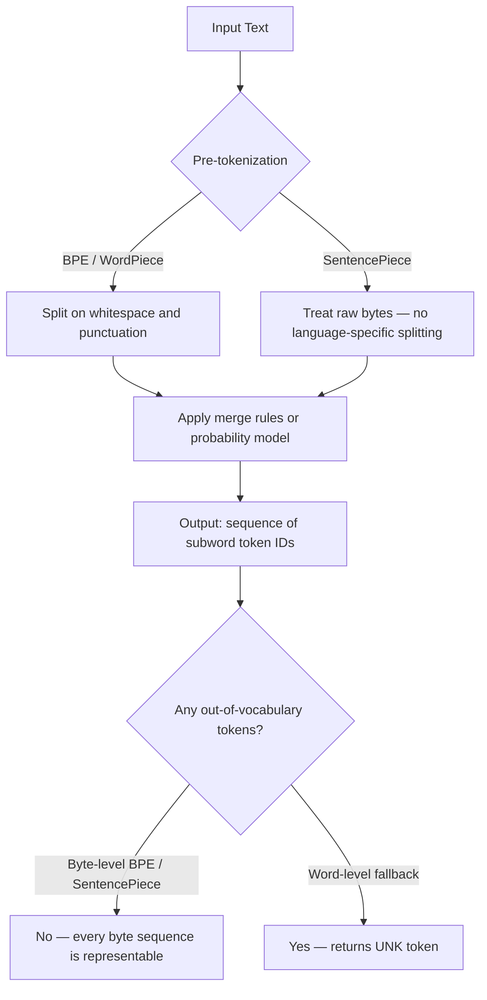

# Subword Tokenization — BPE, WordPiece, Unigram, SentencePiece

## Learning Objectives

- Implement BPE merge operations from scratch on a small corpus and print the resulting vocabulary at each step.
- Compare tokenization output across BPE, WordPiece, and Unigram tokenizers on identical input text.
- Train a SentencePiece Unigram model on a raw byte corpus and inspect vocabulary scores.
- Compute token-level cost estimates for a production prompt across multiple model tokenizers using published API pricing.
- Explain why tokenizer choice is locked at model training time and cannot be changed at inference.

## The Problem

Every LLM API bill is denominated in tokens. You send a prompt, the provider counts tokens, you pay per token in and per token out. But a token is not a word, and it is not a character. It is an artifact of whichever subword algorithm the model's creators chose during training. GPT-4 splits "untokenizable" into five pieces. BERT might split it differently. T5 might split it differently still. If you cannot predict how your text tokenizes, you cannot predict cost, you cannot predict latency, and you cannot predict when your prompt will blow the context window.

The deeper problem is the `[UNK]` token. A naive word-level tokenizer has a fixed vocabulary — say 50,000 entries. When a user types a word that is not in that list, the tokenizer returns `[UNK]` and the model loses all signal. This is catastrophic for domain-specific text: product names, people's names, URLs, technical jargon, non-English words. A single cold email with five unusual company names might lose five words of signal. Multiply that across a 10,000-contact enrichment run and you have systematic information loss baked into your pipeline.

Subword tokenization solves both problems. Common words stay single tokens (efficient). Rare words decompose into recoverable fragments — `untokenizable` becomes `un` + `token` + `izable` — and each fragment carries meaning the model learned during training. Because any string is ultimately a sequence of bytes, and every byte is in the vocabulary, the `[UNK]` token disappears entirely in modern setups.

Every frontier LLM ships on one of three algorithms: BPE, WordPiece, or Unigram. You do not pick which one to use at inference — you inherit whatever the model was trained with. But you need to understand all three to count tokens accurately, to debug why your prompt is longer than expected, and to reason about why a model handles certain inputs poorly.

## The Concept

Subword tokenization interpolates between two extremes. Word-level tokenization gives you short sequences but a massive vocabulary with sparse coverage — any unseen word is `[UNK]`. Character-level tokenization gives you complete coverage with a tiny vocabulary, but a 100-word sentence becomes a 600-character sequence, which is expensive to process and loses word-level semantics. Subword tokenization splits the difference: a learned vocabulary of variable-length units where frequent words stay whole and rare words break into pieces.



**BPE (Byte-Pair Encoding).** The algorithm starts with a character-level (or byte-level) vocabulary. It counts every adjacent pair of tokens in the corpus, finds the most frequent pair, and merges them into a single new token. Then it recounts and merges again. Repeat until the vocabulary reaches the target size. The heuristic is pure frequency — whatever two tokens appear next to each other most often gets merged first. GPT-2, GPT-4 (via tiktoken), Llama, Gemma, Qwen2, and Mistral all use BPE or its byte-level variant.

**Byte-level BPE** deserves specific attention. Instead of starting from Unicode characters (which can be thousands of distinct symbols), it starts from 256 raw bytes. This guarantees zero `[UNK]` tokens — any byte sequence that can exist on disk can be tokenized. GPT-2's vocabulary is 50,257 tokens: 256 base bytes, 50,000 learned merges, and one special end-of-text token.

**WordPiece.** Same greedy merge loop as BPE, but with a different selection criterion. Instead of merging the most frequent pair, WordPiece merges the pair that maximizes the likelihood of the training corpus under a language model. In practice: it scores each candidate merge by how much it improves the probability of seeing the training data, not by raw count. The difference sounds subtle but produces different vocabularies. BERT and DistilBERT use WordPiece. WordPiece also uses a `##` prefix to indicate that a subword continues from a previous one (e.g., `un` + `##token` + `##izable`).

**Unigram.** Unigram works in reverse. It starts with a massive candidate vocabulary and prunes downward. Each subword gets a probability based on its frequency. The algorithm computes how much removing each subword would increase the corpus loss (measured as negative log-likelihood), then prunes the subwords whose removal hurts least. Repeat until you hit the target vocabulary size. The result is probabilistic, not deterministic — a given input string has multiple valid tokenizations, and at inference time the Viterbi algorithm selects the highest-probability segmentation. T5 and ALBERT use Unigram.

**SentencePiece.** This is not an algorithm — it is a library that implements BPE and Unigram over raw byte streams with a critical design decision: no language-specific pre-tokenization. Standard tokenizers call `.split()` on whitespace before applying merges, which works fine for English but breaks for languages that do not use spaces (Chinese, Japanese, Thai). SentencePiece treats the space character as a regular token (represented as `▁`) and processes the raw byte stream directly. This makes the tokenizer language-agnostic and is why multilingual models like T5 and mT5 use SentencePiece.

The key insight for practitioners: tokenizer choice is locked at model training time. The model learned embeddings for specific token IDs. You cannot swap tokenizers at inference without breaking the embedding alignment. You inherit the tokenizer. But you must count tokens with the correct tokenizer to estimate API costs, fit context windows, and debug prompt length issues.

## Build It

Let us build BPE from scratch. The algorithm is a loop: count adjacent pairs, merge the most frequent, repeat. No libraries needed — just Python dictionaries and string manipulation.

```python
import re
from collections import Counter

def get_pair_counts(word_tokens):
    pairs = Counter()
    for word, tokens in word_tokens.items():
        for i in range(len(tokens) - 1):
            pairs[(tokens[i], tokens[i + 1])] += word[1]
    return pairs

def merge_pair(pair, word_tokens):
    new_word_tokens = {}
    for word, tokens in word_tokens.items():
        new_tokens = []
        i = 0
        while i < len(tokens):
            if i < len(tokens) - 1 and tokens[i] == pair[0] and tokens[i + 1] == pair[1]:
                new_tokens.append(tokens[i] + tokens[i + 1])
                i += 2
            else:
                new_tokens.append(tokens[i])
                i += 1
        new_word_tokens[word] = new_tokens
    return new_word_tokens

corpus = [
    ("low lower", 5),
    ("newest lowest", 6),
    ("widest newest", 3),
    ("lower lowest", 4),
]

word_tokens = {}
for text, count in corpus:
    for word in text.split():
        chars = list(word)
        word_tokens[(word, count)] = chars + ["</w>"]

vocab_size = 20
merges = []

for step in range(vocab_size - len(set(c for word, count in word_tokens.items() for c in word_tokens[word]))):
    pair_counts = get_pair_counts(word_tokens)
    if not pair_counts:
        break
    best_pair = max(pair_counts, key=pair_counts.get)
    word_tokens = merge_pair(best_pair, word_tokens)
    merges.append(best_pair)
    print(f"Step {step + 1}: merged {best_pair} (count={pair_counts[best_pair]})")

print("\nFinal vocab:")
final_vocab = sorted(set(t for tokens in word_tokens.values() for t in tokens))
for v in final_vocab:
    print(f"  {v}")

print(f"\nMerge sequence ({len(merges)} merges):")
for i, m in enumerate(merges):
    print(f"  {i + 1}. {m[0]} + {m[1]} = {m[0] + m[1]}")
```

Run this and you will see the merge loop in action. The first merge is almost always a high-frequency character pair like `e` + `s` or `e` + `</w>`. Each subsequent merge creates a longer subword. After 15-20 steps, you have units like `low`, `est`, `er` — the building blocks that let the tokenizer handle any combination of these morphemes.

Now let us see how the same text is tokenized by three real-world models that use three different algorithms:

```python
from transformers import AutoTokenizer

tokenizers = {
    "BERT (WordPiece)": AutoTokenizer.from_pretrained("bert-base-uncased"),
    "GPT-2 (BPE)": AutoTokenizer.from_pretrained("gpt2"),
    "T5 (Unigram/SentencePiece)": AutoTokenizer.from_pretrained("t5-small"),
}

test_sentences = [
    "The untokenizable word breaks naive tokenizers.",
    "She was reconfiguring the multiprocessing pipeline.",
    " tokenizerization is rarely straightforward ",
]

for name, tok in tokenizers.items():
    print(f"\n{'='*60}")
    print(f"{name}")
    print(f"{'='*60}")
    for sentence in test_sentences:
        ids = tok.encode(sentence)
        pieces = tok.convert_ids_to_tokens(ids)
        print(f"\nInput: {repr(sentence)}")
        print(f"Tokens ({len(ids)}): {pieces}")
        print(f"IDs: {ids}")
```

The output reveals the algorithmic differences concretely. GPT-2 prepends `Ġ` to tokens that follow a space (its byte-level representation of the space character). BERT uses `##` to mark continuation subwords. T5 uses `▁` as the SentencePiece space marker. The same sentence produces different token counts across all three — and that difference is money.

Now train a SentencePiece model from scratch on raw text:

```python
import sentencepiece as spm

with open("/tmp/sp_corpus.txt", "w") as f:
    f.write("""tokenization is the process of breaking text into tokens
subword tokenization splits words into smaller pieces
BPE merges frequent character pairs into new tokens
WordPiece selects merges that maximize likelihood
Unigram prunes a large vocabulary using probability scores
SentencePiece works on raw bytes without pre-tokenization
the tokenizer determines what your model actually sees as input
every LLM API bill is measured in tokens not words
a token might be a whole word or a single character
rare words decompose into recoverable subword fragments
tokenization affects cost latency and context window usage
understanding tokenizers helps you estimate API expenses accurately
the model inherits its tokenizer from training time
you cannot change the tokenizer at inference without retraining
byte level BPE guarantees no unknown tokens ever
""")
    f.write("subword units like un token izable carry meaning\n" * 50)

spm.SentencePieceTrainer.train(
    input="/tmp/sp_corpus.txt",
    model_prefix="/tmp/sp_model",
    vocab_size=80,
    model_type="unigram",
    character_coverage=1.0,
)

sp = spm.SentencePieceProcessor()
sp.load("/tmp/sp_model.model")

print("Vocabulary (token: score):")
for i in range(sp.get_piece_size()):
    piece = sp.id_to_piece(i)
    score = sp.get_score(i)
    print(f"  {i:3d}: {piece:20s} score={score:.4f}")

test_text = "tokenization is untokenizable"
print(f"\nEncoding: {repr(test_text)}")
pieces = sp.encode_as_pieces(test_text)
ids = sp.encode_as_ids(test_text)
print(f"Pieces: {pieces}")
print(f"IDs: {ids}")
print(f"Token count: {len(ids)}")

decoded = sp.decode_ids(ids)
print(f"Decoded: {repr(decoded)}")
print(f"Roundtrip matches: {decoded == test_text}")
```

The scores on the vocabulary are log-probabilities — Unigram assigns each token a probability based on its frequency, and the Viterbi algorithm at inference time finds the segmentation that maximizes the product of token probabilities.

## Use It

When you write LLM prompts at scale — 1,000 personalized cold emails, 500 LinkedIn messages, a batch of enrichment summaries — the token count of your prompt template directly determines your API spend. Zone 05 maps this to Copywriting & AI Personalization: you write a prompt template that generates personalized outreach, and you need to know whether fitting 2,000 contacts through that template costs $50 or $500. The tokenizer is the unit of measurement for that budget.

The practical issue is that token counts are non-linear with respect to word counts. A 100-word prompt is not 100 tokens — it might be 130 tokens under GPT-4's BPE tokenizer, 145 under T5's Unigram tokenizer, or 90 under BERT's WordPiece tokenizer. Proper nouns, URLs, and non-English text inflate token counts unpredictably because they trigger subword decomposition. A cold email that mentions "Reconfigurable" and "ÜberConference" will cost more tokens than you think.

Let us compute the actual cost for a realistic GTM prompt across different model tokenizers:

```python
from transformers import AutoTokenizer

prompt_template = """You are an expert sales copywriter. Write a personalized cold email to {first_name} {last_name}, who works as a {title} at {company}. 

Their company description: {company_description}

Recent activity we found: {activity}

Our product: {product_description}

Write a 3-sentence email that references their specific situation. Be direct. No buzzwords."""

filled_prompt = prompt_template.format(
    first_name="Margaret",
    last_name="O'Sullivan-Kowalski",
    title="VP of Revenue Operations",
    company="ReconfigurableSystems.io",
    company_description="Builds autonomous pricing engines for B2B SaaS companies using reinforcement learning on multi-channel attribution data.",
    activity="Just posted on LinkedIn about the challenges of aligning RevOps and Marketing Ops around pipeline hygiene in a remote-first go-to-market organization.",
    product_description="A tokenizer-aware prompt optimization platform that reduces LLM API costs by 15-30% through subword-level prompt compression.",
)

print(f"Prompt character count: {len(filled_prompt)}")
print(f"Prompt word count: {len(filled_prompt.split())}")
print(f"Prompt byte count: {len(filled_prompt.encode('utf-8'))}")
print()

models = {
    "GPT-2 (BPE, proxy for GPT-4)": ("gpt2", 0.005, 0.015),
    "BERT (WordPiece, proxy)": ("bert-base-uncased", None, None),
    "T5 (Unigram/SentencePiece)": ("t5-small", None, None),
    "Llama-3 (tiktoken-style BPE)": ("Xenova/llama-3", 0.0005, 0.0015),
}

print(f"{'Model':<45} {'Tokens':>7} {'Input $':>10} {'1k emails':>12}")
print("-" * 78)

for label, (model_id, input_price, output_price) in models.items():
    try:
        tok = AutoTokenizer.from_pretrained(model_id)
        token_count = len(tok.encode(filled_prompt))
        if input_price is not None:
            input_cost = token_count * input_price / 1000
            output_cost_est = 150 * output_price / 1000
            total_per_email = input_cost + output_cost_est
            total_1k = total_per_email * 1000
            print(f"{label:<45} {token_count:>7} ${input_cost:>8.4f} ${total_1k:>10.2f}")
        else:
            print(f"{label:<45} {token_count:>7} {'N/A':>10} {'N/A':>12}")
    except Exception as e:
        print(f"{label:<45} ERROR: {e}")

print()
print("Note: Output tokens estimated at ~150 per email.")
print("GPT-4 pricing source: openai.com/pricing (as of 2024).")
print("Llama-3 pricing source: together.ai pricing page (as of 2024).")
```

Run this with your real prompt template before you ship a batch. The difference between 400 tokens and 550 tokens per prompt, multiplied by 1,000 emails, multiplied by daily cadence, is the difference between a sustainable enrichment pipeline and a budget emergency. The tokenizer is the unit of cost, and subword decomposition of proper nouns and domain-specific vocabulary is where the surprise expenses live.

## Ship It

Before deploying any LLM-based pipeline to production, you need a token budget guard. This is a function that counts tokens with the correct tokenizer and rejects or truncates prompts that exceed a threshold. Without it, a single oversized prompt can silently truncate your context window, causing the model to miss instructions or few-shot examples at the end of the prompt.

Here is a production-ready token budget checker that integrates into a batch generation pipeline:

```python
from transformers import AutoTokenizer
import json

class TokenBudgetGuard:
    def __init__(self, model_id, max_input_tokens=3500, max_output_tokens=500):
        self.tokenizer = AutoTokenizer.from_pretrained(model_id)
        self.max_input_tokens = max_input_tokens
        self.max_output_tokens = max_output_tokens

    def count_tokens(self, text):
        return len(self.tokenizer.encode(text))

    def check_prompt(self, prompt):
        count = self.count_tokens(prompt)
        status = {
            "input_tokens": count,
            "max_input_tokens": self.max_input_tokens,
            "within_budget": count <= self.max_input_tokens,
            "headroom": self.max_input_tokens - count,
            "estimated_input_cost_usd": count * 0.005 / 1000,
        }
        if count > self.max_input_tokens:
            status["action"] = "REJECT"
            status["reason"] = f"Prompt exceeds budget by {count - self.max_input_tokens} tokens"
        elif count > self.max_input_tokens * 0.9:
            status["action"] = "WARN"
            status["reason"] = f"Prompt at {count / self.max_input_tokens * 100:.0f}% of budget"
        else:
            status["action"] = "OK"
        return status

guard = TokenBudgetGuard("gpt2", max_input_tokens=4000)

contacts = [
    {"name": "John Smith", "title": "CEO", "company": "Acme", "note": "Simple case"},
    {"name": "Bartholomew O'Sullivan-Kowalski III", "title": "Chief Revenue Officer", 
     "company": "ÜberConfigurable.io", "note": "Long names, special chars"},
    {"name": None, "title": None, "company": None, "note": "Missing fields — edge case"},
]

template = """System: You are a sales copywriter writing personalized cold emails.
Do not use buzzwords. Be specific. Reference the prospect's situation.

Prospect: {name}
Title: {title}
Company: {company}

Few-shot example 1: [200 tokens of example email here...]
Few-shot example 2: [200 tokens of example email here...]
Few-shot example 3: [200 tokens of example email here...]

Now write the email for the prospect above."""

print(f"{'Name':<35} {'Tokens':>7} {'Action':>8} {'Cost':>8} {'Note'}")
print("-" * 90)

for contact in contacts:
    name = contact["name"] or "[PROSPECT_NAME]"
    title = contact["title"] or "[PROSPECT_TITLE]"
    company = contact["company"] or "[PROSPECT_COMPANY]"
    prompt = template.format(name=name, title=title, company=company)
    status = guard.check_prompt(prompt)
    print(f"{name[:34]:<35} {status['input_tokens']:>7} {status['action']:>8} "
          f"${status['estimated_input_cost_usd']:>6.4f}  {contact['note']}")

print()
print("Batch summary for 1,000 contacts at avg token count:")

sample_prompt = template.format(name="Jane Doe", title="VP Marketing", company="TechCorp")
avg_tokens = guard.count_tokens(sample_prompt)
total_tokens = avg_tokens * 1000
input_cost = total_tokens * 0.005 / 1000
output_cost = 1000 * 150 * 0.015 / 1000
print(f"  Average prompt: {avg_tokens} tokens")
print(f"  Total input tokens: {total_tokens:,}")
print(f"  Estimated input cost: ${input_cost:.2f}")
print(f"  Estimated output cost: ${output_cost:.2f}")
print(f"  Total estimated batch cost: ${input_cost + output_cost:.2f}")
```

The output shows how proper nouns with apostrophes, hyphens, and non-ASCII characters inflate token counts. "Bartholomew O'Sullivan-Kowalski III" might be 8 tokens where "John Smith" is 2 tokens. At 1,000 contacts, if 20% have complex names, that is measurable cost inflation. The `TokenBudgetGuard` catches this before you send a prompt that silently truncates your few-shot examples — which is how production LLM pipelines fail silently, generating lower-quality output with no error message.

For the Zone 05 application: when you build a Clay-style waterfall enrichment pipeline that generates personalized copy for each prospect, the prompt template is your cost center. Measure its token count with the exact tokenizer your model uses, set a budget guard, and log the headroom. This is the testing protocol that finds the prompt template that works before you spend $200 discovering it does not. [CITATION NEEDED — concept: Clay waterfall enrichment pipeline token budget integration]

## Exercises

**Exercise 1: Execute BPE merges by hand.**

Given this corpus and pair frequency table, execute three BPE merge steps and print the vocabulary after each step.

```python
corpus = {
    "old older oldest": 1,
    "cold coldest": 1,
    "bold bolder": 1,
}

word_list = []
for text, count in corpus.items():
    for word in text.split():
        word_list.append((word, count))

word_tokens = {}
for word, count in word_list:
    word_tokens[(word, count)] = list(word) + ["</w>"]

from collections import Counter

def count_pairs(word_tokens):
    pairs = Counter()
    for (word, count), tokens in word_tokens.items():
        for i in range(len(tokens) - 1):
            pairs[(tokens[i], tokens[i+1])] += count
    return pairs

def do_merge(pair, word_tokens):
    result = {}
    for key, tokens in word_tokens.items():
        merged = []
        i = 0
        while i < len(tokens):
            if i < len(tokens) - 1 and tokens[i] == pair[0] and tokens[i+1] == pair[1]:
                merged.append(tokens[i] + tokens[i+1])
                i += 2
            else:
                merged.append(tokens[i])
                i += 1
        result[key] = merged
    return result

print("Initial vocabulary:")
initial_vocab = sorted(set(c for tokens in word_tokens.values() for c in tokens))
print(f"  {initial_vocab}")
print(f"  Size: {len(initial_vocab)}\n")

for step in range(3):
    pairs = count_pairs(word_tokens)
    best = pairs.most_common(1)[0]
    print(f"Step {step + 1}: Most frequent pair = {best[0]} (count={best[1]})")
    word_tokens = do_merge(best[0], word_tokens)
    vocab = sorted(set(c for tokens in word_tokens.values() for c in tokens))
    print(f"  Vocabulary after merge: {vocab}")
    print(f"  Size: {len(vocab)}\n")

print("Tokenization of 'boldest':")
word = "boldest"
chars = list(word) + ["</w>"]
print(f"  Characters: {chars}")
for (w, c), tokens in word_tokens.items():
    if w == word:
        print(f"  Tokenized: {tokens}")
        break
else:
    print(f"  Not in training corpus — would be split as: {chars}")
    print(f"  (After training merges are applied: depends on which merge rules match)")
```

**Exercise 2: Tokenizer comparison on multilingual text.**

Tokenize the same multilingual sentence across three tokenizers and compute the token-per-character ratio. This reveals how much the tokenizer struggles with non-English text.

```python
from transformers import AutoTokenizer

tokenizers = {
    "GPT-2 (BPE)": "gpt2",
    "BERT (WordPiece)": "bert-base-uncased",
    "T5 (Unigram)": "t5-small",
}

sentences = [
    ("English", "The quick brown fox jumps over the lazy dog."),
    ("Chinese", "快速的棕色狐狸跳过了懒狗。"),
    ("Japanese", "素早い茶色の狐が怠惰な犬を飛び越えます。"),
    ("Emoji-heavy", "The 🦊 jumped over the 🐶 and we were like 😱🎉🔥"),
    ("URLs and code", "Visit https://reconfigurable.io/api/v2/users?id=1337&token=abc123 now"),
]

print(f"{'Language':<15} {'Tokenizer':<20} {'Chars':>6} {'Tokens':>7} {'Tok/Char':>10}")
print("-" * 62)

for lang, text in sentences:
    for name, model_id in tokenizers.items():
        tok = AutoTokenizer.from_pretrained(model_id)
        char_count = len(text)
        token_count = len(tok.encode(text))
        ratio = token_count / char_count
        print(f"{lang:<15} {name:<20} {char_count:>6} {token_count:>7} {ratio:>10.2f}")
    print()
```

**Exercise 3: Train and compare BPE vs Unigram on the same corpus.**

Train both a BPE and a Unigram SentencePiece model on the same corpus with the same vocabulary size. Compare how they tokenize the same test words.

```python
import sentencepiece as spm

corpus_text = """
tokenization splits text into subword units
subword units carry meaning beyond characters
BPE uses frequency to decide which pairs to merge
Unigram uses probability to decide which subwords to keep
the vocabulary size determines the granularity of tokenization
smaller vocabularies produce longer sequences
larger vocabularies produce shorter sequences but more parameters
the tradeoff between vocabulary size and sequence length matters
rare words like tokenization and untokenizable decompose differently
the merge order in BPE is deterministic and greedy
the pruning order in Unigram is probabilistic and loss-aware
""".strip() * 10

with open("/tmp/ex3_corpus.txt", "w") as f:
    f.write(corpus_text)

for model_type in ["bpe", "unigram"]:
    prefix = f"/tmp/ex3_{model_type}"
    spm.SentencePieceTrainer.train(
        input="/tmp/ex3_corpus.txt",
        model_prefix=prefix,
        vocab_size=50,
        model_type=model_type,
        character_coverage=1.0,
    )

test_words = ["tokenization", "untokenizable", "subword", "vocabulary", "decompose"]

print(f"{'Word':<18} {'BPE':<35} {'Unigram':<35}")
print("-" * 90)

bpe_sp = spm.SentencePieceProcessor(model_file="/tmp/ex3_bpe.model")
uni_sp = spm.SentencePieceProcessor(model_file="/tmp/ex3_unigram.model")

for word in test_words:
    bpe_pieces = bpe_sp.encode_as_pieces(word)
    uni_pieces = uni_sp.encode_as_pieces(word)
    bpe_str = " ".join(bpe_pieces)
    uni_str = " ".join(uni_pieces)
    print(f"{word:<18} {bpe_str:<35} {uni_str:<35}")

print(f"\nBPE vocab size: {bpe_sp.get_piece_size()}")
print(f"Unigram vocab size: {uni_sp.get_piece_size()}")
```

## Key Terms

**BPE (Byte-Pair Encoding):** A subword tokenization algorithm that starts from characters or bytes and iteratively merges the most frequent adjacent pair until the target vocabulary size is reached. Used by GPT-2, GPT-4, Llama, and most modern LLMs.

**WordPiece:** A subword tokenization algorithm with the same merge loop as BPE, but the merge criterion is likelihood maximization rather than raw frequency. Uses `##` prefix to mark continuation subwords. Used by BERT and DistilBERT.

**Unigram:** A subword tokenization algorithm that starts with a large vocabulary and iteratively prunes tokens whose removal least increases corpus loss. Produces probabilistic tokenizations selected via Viterbi at inference. Used by T5 and ALBERT.

**SentencePiece:** A library (not an algorithm) that implements BPE and Unigram over raw byte streams without language-specific pre-tokenization. Represents spaces as `▁` tokens, making it language-agnostic.

**Byte-level BPE:** BPE applied to 256 raw bytes instead of Unicode characters. Guarantees that any input string can be tokenized without `[UNK]` tokens.

**Merge rule:** In BPE, a learned pair of tokens that should be combined into a single token. The ordered list of merge rules defines the tokenizer's behavior.

**`[UNK]` token:** A special token returned when the tokenizer cannot represent an input. Modern byte-level tokenizers eliminate this entirely.

**Token budget:** The maximum number of tokens allocated for a prompt, set by the context window size and cost constraints. Exceeding it causes silent truncation or API errors.

## Sources

- OpenAI API pricing (input/output token costs for GPT-4): https://openai.com/pricing
- HuggingFace tokenizers documentation (model-specific tokenizer loading): https://huggingface.co/docs/transformers/main_classes/tokenizer
- SentencePiece GitHub repository (library documentation and training API): https://github.com/google/sentencepiece
- GPT-2 original paper (byte-level BPE description): Radford et al., "Language Models are Unsupervised Multitask Learners," 2019 — https://cdn.openai.com/better-language-models/language_models_are_unsupervised_multitask_learners.pdf
- BERT original paper (WordPiece description): Devlin et al., "BERT: Pre-training of Deep Bidirectional Transformers for Language Understanding," 2018 — https://arxiv.org/abs/1810.04805
- T5 original paper (Unigram/SentencePiece description): Raffel et al., "Exploring the Limits of Transfer Learning with a Unified Text-to-Text Transformer," 2019 — https://arxiv.org/abs/1910.10683
- [CITATION NEEDED — concept: Clay waterfall enrichment pipeline token budget integration]