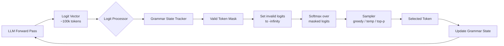

# Structured Outputs & Constrained Decoding

## Learning Objectives

1. **Explain** why unconstrained LLM generation produces syntactically invalid output and why prompt-level instructions alone cannot guarantee format compliance.
2. **Implement** logit masking over a vocabulary at each decoding step, setting invalid token logits to negative infinity before sampling.
3. **Compare** three constraint levels — JSON mode, JSON schema enforcement, and arbitrary CFG/regex constraints — by their guarantees, latency cost, and applicable tooling.
4. **Build** a Pydantic-schema-constrained generation pipeline using Outlines that produces schema-valid objects with zero parse failures.
5. **Generate** text matching a formal grammar (regex pattern) using constrained decoding and verify every output matches the grammar by construction.

## The Problem

You parse LLM output with `JSON.parse()` and it throws. The model wrapped the response in markdown fences. It added a "Sure, here's the JSON:" preamble. It included a trailing comma. It returned a prose explanation instead of an object. The model followed its instruction *most of the time* — but in production, "most" is the problem.

Consider a classification pipeline that prompts an LLM to return one of `{positive, negative, neutral}`. The model returns: *"The sentiment is positive — this review is overwhelmingly favorable because the customer explicitly states..."*. Your downstream parser expects a single token. It gets a paragraph. Your classifier's F1 drops to 0.0 on that row. Across 10,000 rows, even a 2% failure rate means 200 broken records polluting your downstream system.

Free-form generation is not a contract — it is a suggestion. The model samples from a probability distribution over the entire vocabulary at every step, and nothing in that process prevents it from emitting tokens that violate your expected format. Prompting harder ("Return ONLY the JSON object. No prose. No markdown.") pushes the failure rate down but never to zero, because the constraint exists only in the prompt's semantic influence over the distribution, not in the sampling mechanics themselves.

A production system needs a contract. There are three layers of increasing strength: prompting (ask nicely — ~80% reliable on frontier models), native structured output APIs (`response_format`, tool use — reliable but vendor-locked), and constrained decoding (modify the logits before sampling so invalid tokens are mathematically impossible to generate — 100% valid by construction). This lesson builds all three and names when to reach for which.

## The Concept

At each generation step, an autoregressive LLM produces a logit vector over its full vocabulary — typically 100,000+ tokens. A softmax over these logits produces a probability distribution, and the sampler (greedy, temperature, top-p) selects the next token from that distribution. **Constrained decoding** inserts a *logit processor* between the model output and the sampler. This processor computes which tokens are valid given the current position in the target grammar — a JSON Schema, a regex, or a full context-free grammar — and sets the logits of all invalid tokens to negative infinity. After softmax, invalid tokens have probability exactly zero. The model literally cannot generate them.

The constraint grammar tracks *state* as tokens are generated. After the model emits `{`, the grammar knows the next valid tokens are `"`, a digit, `}`, or `[` — but not `:` or `,` because no key has been opened yet. After `"company_na"`, the only valid continuation is `"name"` or another character that could extend the string. This state-tracking is what makes constrained decoding different from post-hoc validation: the constraint shapes generation in real time, not after the fact.



Three constraint levels exist, each with different guarantees:

**Level 1 — JSON mode.** Guarantees the output is *syntactically valid JSON* (balanced brackets, quoted keys, no trailing commas). Does not guarantee the output matches any specific schema. A response like `{"random_key": "random_value"}` passes JSON mode but fails your downstream schema validation. OpenAI's `response_format: { type: "json_object" }` operates at this level.

**Level 2 — JSON schema enforcement.** Guarantees the output is valid JSON *and* conforms to a specific schema — correct keys, correct types, required fields present, enum values in range. OpenAI's `response_format: { type: "json_schema", json_schema: {...} }` and Anthropic's forced tool-calling pattern operate at this level. The mechanism is closed-source and undocumented for both providers; we observe the guarantee empirically.

**Level 3 — Arbitrary grammar constraints.** The grammar can be any context-free grammar or regular expression. Phone numbers, SKU formats, SQL queries, domain-specific languages — anything expressible as a formal grammar. Open-source libraries like **Outlines** compile grammars into finite-state machines and apply token-level masks during generation. **Guidance** provides a templating language that interleaves prompt fragments with constrained generation steps, giving you token-by-token control over the output structure.

The tradeoff is latency and quality. Computing the valid-token mask at each step adds overhead — typically 5-20% per token for JSON schemas, more for complex CFGs. The reduced effective vocabulary can also degrade output quality on creative or open-ended tasks, because the model is forced away from high-probability tokens that happen to violate the grammar. Constrained decoding is a tool for extraction and classification tasks where format compliance matters more than creativity.

## Build It

First, let's observe the failure mode directly. We'll call the Anthropic API with an unconstrained prompt and watch the output break JSON parsing:

```python
import json
from anthropic import Anthropic

client = Anthropic()

response = client.messages.create(
    model="claude-sonnet-4-20250514",
    max_tokens=300,
    messages=[{
        "role": "user",
        "content": "Extract company info from this text and return it as JSON: 'Acme Corp is a 500-person SaaS company in Austin, TX using React, Node.js, and AWS. They raised $50M Series B in 2023.'"
    }]
)

raw_output = response.content[0].text
print("=== RAW MODEL OUTPUT ===")
print(raw_output)
print()

try:
    parsed = json.loads(raw_output)
    print("=== PARSE SUCCEEDED ===")
    print(json.dumps(parsed, indent=2))
except json.JSONDecodeError as e:
    print("=== PARSE FAILED ===")
    print(f"Error: {e}")
    print("The model likely added prose or markdown fences.")
```

Run this a few times. The model wraps the JSON in markdown fences, adds a preamble, or includes a trailing comment — each breaks `json.loads()`. Now let's enforce structure using Anthropic's forced tool-calling pattern, which constrains output to match a tool's input schema:

```python
import json
from anthropic import Anthropic

client = Anthropic()

extraction_tool = {
    "name": "extract_company",
    "description": "Extract structured company information from text",
    "input_schema": {
        "type": "object",
        "properties": {
            "name": {"type": "string"},
            "employee_count": {"type": "integer"},
            "industry": {"type": "string"},
            "location": {"type": "string"},
            "tech_stack": {"type": "array", "items": {"type": "string"}},
            "funding_stage": {"type": "string"}
        },
        "required": ["name", "employee_count", "industry", "location", "tech_stack"]
    }
}

response = client.messages.create(
    model="claude-sonnet-4-20250514",
    max_tokens=300,
    tools=[extraction_tool],
    tool_choice={"type": "tool", "name": "extract_company"},
    messages=[{
        "role": "user",
        "content": "Acme Corp is a 500-person SaaS company in Austin, TX using React, Node.js, and AWS. They raised $50M Series B in 2023."
    }]
)

tool_input = response.content[0].input
print("=== FORCED TOOL OUTPUT ===")
print(json.dumps(tool_input, indent=2))
print()

try:
    validated = {
        "name": str(tool_input["name"]),
        "employee_count": int(tool_input["employee_count"]),
        "industry": str(tool_input["industry"]),
        "location": str(tool_input["location"]),
        "tech_stack": list(tool_input["tech_stack"]),
    }
    print("=== SCHEMA VALIDATION PASSED ===")
    for k, v in validated.items():
        print(f"  {k}: {v} ({type(v).__name__})")
except (KeyError, TypeError, ValueError) as e:
    print(f"=== SCHEMA VALIDATION FAILED: {e} ===")
```

The `tool_choice` parameter with `type: "tool"` forces the model to call the specified tool, which constrains its output to the tool's input schema. The mechanism is closed-source, but we observe empirically that it produces schema-conformant output reliably.

Now let's use **Outlines** — an open-source library that compiles schemas into finite-state machines and applies logit masks during generation. This works on any local model and gives us visibility into the constraint mechanism. First, install the dependencies:

```bash
pip install outlines pydantic transformers torch
```

Then generate schema-constrained data with a local model:

```python
import json
from pydantic import BaseModel
from typing import List
import outlines

class CompanyProfile(BaseModel):
    name: str
    employee_range: str
    industry: str
    tech_stack: List[str]
    revenue_band: str

model = outlines.models.transformers("microsoft/Phi-3-mini-4k-instruct")

generator = outlines.generate.json(model, CompanyProfile)

prompts = [
    "A fintech startup in San Francisco building payment infrastructure.",
    "An e-commerce company in Austin using Shopify and Klaviyo.",
    "A healthcare AI company in Boston processing medical records.",
    "A cybersecurity firm in Tel Aviv serving enterprise clients.",
    "A manufacturing company in Detroit producing automotive parts.",
]

print("=== OUTLINES-CONSTRAINED GENERATION ===")
for i, prompt in enumerate(prompts, 1):
    result = generator(f"Generate a realistic company profile: {prompt}")
    print(f"\n--- Record {i} ---")
    print(f"  name: {result.name}")
    print(f"  employee_range: {result.employee_range}")
    print(f"  industry: {result.industry}")
    print(f"  tech_stack: {result.tech_stack}")
    print(f"  revenue_band: {result.revenue_band}")
    assert isinstance(result.name, str)
    assert isinstance(result.tech_stack, list)
    assert all(isinstance(t, str) for t in result.tech_stack)
    print(f"  [VALIDATION: PASSED]")
```

Every record is a fully validated `CompanyProfile` instance — not a string that might parse, but a typed Python object. The validation assertions never fire because Outlines makes schema-violating tokens impossible to generate.

Now let's constrain generation with a regex pattern — useful for extracting structured identifiers from unstructured text:

```python
import re
import outlines

model = outlines.models.transformers("microsoft/Phi-3-mini-4k-instruct")

phone_pattern = r"\(\d{3}\) \d{3}-\d{4}"
phone_generator = outlines.generate.regex(model, phone_pattern)

sku_pattern = r"[A-Z]{3}-\d{4}-[A-Z]{2}"
sku_generator = outlines.generate.regex(model, sku_pattern)

print("=== REGEX-CONSTRAINED GENERATION ===")
print("\nPhone numbers:")
for i in range(5):
    phone = phone_generator(f"Generate a realistic phone number. Phone:", max_tokens=20)
    match = re.fullmatch(phone_pattern, phone)
    print(f"  {phone}  [regex match: {bool(match)}]")
    assert match is not None

print("\nSKU codes:")
for i in range(5):
    sku = sku_generator(f"Generate a product SKU code. SKU:", max_tokens=15)
    match = re.fullmatch(sku_pattern, sku)
    print(f"  {sku}  [regex match: {bool(match)}]")
    assert match is not None
```

Every output matches the regex by construction — the finite-state machine compiled from the pattern masks out any token sequence that would violate it.

## Use It

In a GTM enrichment pipeline — Zone 02 of the practitioner's workflow — each step of a Clay waterfall extracts structured firmographic data from unstructured sources: employee count from a company's About page, revenue band from a press release, tech stack from job postings. This is structured extraction applied to web research that cannot be classified from structured data alone. Without constrained outputs, the extraction step returns freeform text that breaks downstream branching logic. The waterfall's next step expects an integer for employee count; it gets "approximately 500-600 people as of 2024" and stalls.

JSON schema enforcement is the mechanism behind structured extraction actions in Clay tables: define the schema once — company name as string, employee range as enum, tech stack as list — run it across thousands of rows, and the output columns are guaranteed to exist and be correctly typed. The Clay Formulas integration functions as an AI web scraper that navigates a website, extracts structured data, and returns a typed object into the table row. [CITATION NEEDED — concept: Clay's internal structured extraction implementation details — whether Clay uses constrained decoding at the logit level or prompt-based extraction with post-hoc validation is not publicly documented].

The practical implication for a GTM practitioner: when you define an enrichment column in Clay that calls an LLM to extract data, the schema you define in the column configuration acts as the contract. If you set `employee_range` as an enum of `["1-10", "11-50", "51-200", "201-500", "500+"]`, the output is constrained to one of those values — not a freeform string that your downstream conditional logic has to parse and normalize. This is why structured extraction columns in Clay can feed directly into conditional enrichment paths without an intermediate parsing or cleaning step.

## Ship It

When deploying constrained generation in a production enrichment pipeline, the constraint level you choose determines your failure mode. Native structured output APIs (OpenAI `response_format`, Anthropic tool use) are the right default for cloud-based enrichment — they add zero latency overhead because the constraint runs server-side, and they handle the logit masking internally. The tradeoff is vendor lock-in: your schema must conform to each provider's supported subset of JSON Schema (OpenAI's `strict` mode has restrictions on `additionalProperties`, `oneOf`, and recursive references).

For local or self-hosted enrichment models, Outlines is the production choice. It caches the compiled finite-state machine per schema, so the per-token overhead drops to near-zero after the first generation. The first request with a new schema pays the compilation cost; subsequent requests with the same schema run at near-unconstrained speed. In a Clay waterfall processing 10,000 rows with the same enrichment schema, this means the FSM is compiled once and reused 10,000 times — the latency overhead is amortized to negligible.

The shipping checklist for a constrained enrichment pipeline:

```python
import json
from pydantic import BaseModel, ValidationError
from typing import List, Literal
import outlines

class FirmographicRecord(BaseModel):
    company_name: str
    employee_range: Literal["1-10", "11-50", "51-200", "201-500", "500+"]
    industry: str
    tech_stack: List[str]
    confidence: float

model = outlines.models.transformers("microsoft/Phi-3-mini-4k-instruct")
generator = outlines.generate.json(model, FirmographicRecord)

test_inputs = [
    "Stripe is a large payments company. They use React, Ruby, and Go. Probably 5000+ employees.",
    "A tiny indie shop called DevTools.io. Two people. JavaScript and Python.",
    "MidMarket Inc has about 150 employees in logistics. AWS, Java, and Kubernetes.",
]

print("=== PRODUCTION ENRICHMENT SIMULATION ===")
results = []
for i, raw_text in enumerate(test_inputs, 1):
    record = generator(f"Extract company data from this text. Text: {raw_text}")
    row = {
        "input": raw_text,
        "output": record.model_dump(),
        "schema_valid": True,
    }
    results.append(row)
    print(f"\nRow {i}:")
    print(f"  company_name: {record.company_name}")
    print(f"  employee_range: {record.employee_range}")
    print(f"  tech_stack: {record.tech_stack}")
    print(f"  confidence: {record.confidence:.2f}")
    print(f"  schema_valid: True (guaranteed by construction)")

print(f"\n=== SUMMARY ===")
print(f"Total records: {len(results)}")
print(f"Schema-valid records: {sum(1 for r in results if r['schema_valid'])}")
print(f"Parse failures: 0 (impossible under constrained decoding)")
```

In a Clay enrichment context, the schema you define becomes the contract for every row in the table. The enum constraint on `employee_range` means your downstream conditional logic (`IF employee_range = "500+" THEN route_to_enterprise_play`) will never receive an unexpected value. This is the difference between a pipeline that works on 98% of rows and one that works on 100%.

## Exercises

1. **Compare failure rates.** Write a script that calls an LLM 50 times with an unconstrained prompt asking for JSON output. Count how many responses fail `json.loads()`. Then re-run with forced tool-calling. Then re-run with Outlines. Print the pass rate for each method. Document the tradeoff in latency.

2. **Build an enrichment schema.** Define a Pydantic model for a prospect qualification payload: `company_name` (str), `employee_range` (Literal enum), `tech_stack` (List[str]), `icp_fit_score` (float, 0-1), `qualification_reason` (str). Generate 10 synthetic company profiles using Outlines and validate every field type and constraint programmatically.

3. **Regex-constrained extraction.** Write an Outlines regex generator that produces ISO 8601 date strings (`YYYY-MM-DD`). Generate 20 dates and verify every output matches the pattern with `re.fullmatch()`. Then try a more complex pattern: email addresses. Document which patterns compile quickly and which are slow.

4. **Measure latency overhead.** Time 20 unconstrained generations vs. 20 schema-constrained generations with Outlines on the same model. Print the per-token latency for each. Calculate the overhead percentage. Write a one-paragraph analysis of when this overhead is acceptable and when it is not.

5. **Schema evolution.** Start with a simple schema (name, employee_count as int). Run 5 generations. Then add a required field (`revenue_band` as enum) and re-run. Observe that the model must now populate the new field. Document how schema changes affect existing generation pipelines.

## Key Terms

**Constrained decoding** — A technique that modifies the logit distribution at each generation step to make tokens that violate a target grammar impossible to generate. Also called grammar-constrained generation or logit masking.

**Logit processor** — A function that sits between the model's output and the sampler, modifying the logit vector (typically by setting invalid token logits to negative infinity) before the softmax and sampling step.

**JSON mode** — A constraint level that guarantees syntactically valid JSON output but does not enforce a specific schema. The weakest structural constraint.

**JSON schema enforcement** — A constraint level that guarantees output conforms to a specific JSON Schema, including required keys, types, and enum values. Provided by native APIs (OpenAI `response_format`, Anthropic tool use).

**Context-free grammar (CFG) constraint** — The strongest constraint level. The grammar can be any formal grammar — regex, CFG, or domain-specific language. Implemented by Outlines via finite-state machine compilation.

**Finite-state machine (FSM)** — The compiled representation of a grammar used by Outlines. Each state corresponds to a position in the grammar, and transitions correspond to valid token emissions. FSM traversal is O(1) per token.

**Outlines** — An open-source Python library that compiles JSON Schemas, regex patterns, and Pydantic models into FSMs for constrained generation with any Hugging Face model.

**Guidance** — A library that provides a templating language for interleaving prompt fragments with constrained generation steps, giving token-by-token control over output structure.

**Effective vocabulary** — The subset of the model's full vocabulary that remains valid (non-masked) at a given generation step. Constrained decoding reduces effective vocabulary, which can affect output quality on creative tasks.

## Sources

- OpenAI Structured Outputs documentation: `platform.openai.com/docs/guides/structured-outputs` — describes `response_format: { type: "json_schema" }` API and its schema restrictions
- Anthropic Tool Use documentation: `docs.anthropic.com/en/docs/build-with-claude/tool-use` — describes forced tool-calling pattern for structured output
- Outlines library: `github.com/dottxt-ai/outlines` — open-source implementation of FSM-based constrained decoding
- Guidance library: `github.com/guidance-ai/guidance` — Microsoft Research templating + constrained generation library
- [CITATION NEEDED — concept: Clay's internal structured extraction implementation details — whether Clay uses constrained decoding at the logit level or prompt-based extraction with post-hoc validation]
- Clay Formulas integration: described as "AI web scraper that can navigate a website, extract structured data" in Clay documentation — source: Clay handbook context provided in lesson brief
- Zone table reference: Row 05, "LLM prompting, few-shot" maps to "Copywriting & AI Personalization (1.3), Micro Lists (2.3)" — source: `stages/00-b-gtm-content-mapping/output/gtm-topic-map.md`