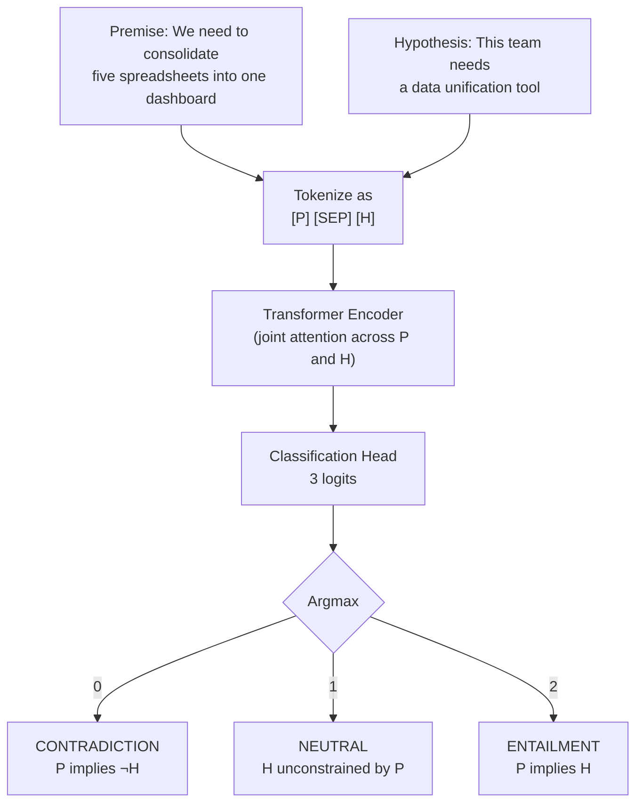

# Natural Language Inference — Textual Entailment

## Learning Objectives

- Classify premise-hypothesis pairs as entailment, contradiction, or neutral using a pretrained NLI cross-encoder
- Implement an entailment-based zero-shot classifier for lead qualification without training labels
- Compare cross-encoder and bi-encoder architectures and explain why NLI requires the former
- Diagnose common NLI failure modes including negation, numerical reasoning, and long premises
- Build a batch enrichment pipeline that scores lead fit from free-text intake responses

## The Problem

You have two sentences. You need to know: does one prove the other, contradict it, or say nothing useful? That is the entire problem, and it shows up constantly. A lead fills out a form saying "we need to consolidate five spreadsheets into a single dashboard." Your ICP criterion is "buyer needs data unification tool." Does the first statement entail the second? A rep sends a follow-up email claiming to have addressed the prospect's security concerns. The prospect's original message asked about SOC 2 compliance and data residency. Does the email's content actually entail that those topics were covered?

Textual entailment — formally, Natural Language Inference or NLI — is the three-way classification task that answers these questions. Given a premise $P$ and a hypothesis $H$, label the relationship as **entailment** (a human reading $P$ would conclude $H$ is true), **contradiction** (a human reading $P$ would conclude $H$ is false), or **neutral** ($P$ does not constrain $H$ either way). This is not fuzzy semantic similarity. It is directional logical implication under open-world assumptions, judged by what a typical human reader would infer from natural language.

The reason NLI is load-bearing in production is that it reduces three seemingly different problems to one mechanism. Hallucination detection in RAG: the source passage is the premise, the generated answer is the hypothesis, and a non-entailment label flags a fabrication. Zero-shot classification without training labels: the document is the premise, each verbalized label ("This text is about enterprise software") is a hypothesis, and entailment means the label applies. Intent signal extraction from lead intake data: the lead's words are the premise, your ICP criteria are hypotheses, and the entailment score becomes a qualification signal. One task, three production uses. Every serious RAG evaluation framework — RAGAS, TruLens, DeepEval — ships an NLI model under the hood for faithfulness scoring, and the mechanism is the same one you would use to check whether a support ticket entails a priority level or whether a LinkedIn post entails buying intent.

## The Concept

**The three-way decision boundary.** A premise $P$ entails a hypothesis $H$ if a human reading $P$ would infer $H$ is true. Contradiction means $H$ must be false given $P$. Neutral means neither — $H$ could be true or false, $P$ simply does not provide enough information to decide. The distinction between entailment and neutral is what makes NLI harder than binary classification: the model must distinguish "this is supported" from "this is plausible but not supported," which requires reasoning about what information is actually present versus what a reader might assume.

**Natural, not strict logic.** NLI is *natural* language inference — what a typical human reader would infer, not what follows from first-order logic. "John walked his dog" entails "John has a dog" under NLI, because a human reader would draw that inference. Strict logic would require an explicit axiom about the relationship between dog-walking and dog-ownership. This matters for production use: NLI models encode common-sense world knowledge baked in during pretraining, which makes them useful for messy real-world text but also means their reasoning has gaps where common sense fails (negation, numerical comparison, temporal reasoning).

**Cross-encoder architecture.** Most production NLI models concatenate the premise and hypothesis as `[P] [SEP] [H]` and pass the single sequence through a transformer encoder. A classification head on top outputs three logits — one per label. This cross-encoder design exists because entailment depends on token-level interactions between premise and hypothesis, not just global semantic similarity. A bi-encoder (encode $P$ and $H$ separately, then compare vectors) is faster for retrieval because you can pre-compute embeddings, but it cannot capture the fine-grained word-level alignment that entailment requires — knowing that "five spreadsheets" in the premise contradicts "three dashboards" in the hypothesis demands joint attention across both texts.



**The SNLI and MultiNLI lineage.** The training data for most English NLI models comes from SNLI (Stanford NLI, built from image caption pairs) or MultiNLI (multi-genre sentence pairs covering fiction, government reports, telephone conversations, and more). The `roberta-large-mnli` checkpoint — the one most production pipelines reach for — was fine-tuned on MultiNLI. Knowing the training domain predicts the failure modes: these models were trained on relatively short, well-formed sentence pairs, so they degrade on long premises, multi-sentence reasoning, negation chains, and anything requiring numerical comparison. If your use case involves determining whether a 500-word support transcript entails "the customer is requesting a refund," expect the model to miss implications that a human would catch.

## Build It

Let's build a minimal NLI classifier using the `roberta-large-mnli` checkpoint. We will feed three premise-hypothesis pairs — one designed to trigger each label — and print the predicted label alongside the full probability distribution. The observable output confirms the model correctly distinguishes entailment from contradiction from neutral.

```python
from transformers import AutoTokenizer, AutoModelForSequenceClassification
import torch

tokenizer = AutoTokenizer.from_pretrained("roberta-large-mnli")
model = AutoModelForSequenceClassification.from_pretrained("roberta-large-mnli")

pairs = [
    (
        "We need to consolidate five spreadsheets into one dashboard.",
        "This team needs a data unification tool.",
    ),
    (
        "We already have a full BI stack and are not looking to change tools.",
        "This team needs a data unification tool.",
    ),
    (
        "Our marketing team runs weekly email campaigns.",
        "This team needs a data unification tool.",
    ),
]

id2label = model.config.id2label

for premise, hypothesis in pairs:
    inputs = tokenizer(premise, hypothesis, return_tensors="pt", truncation=True)
    with torch.no_grad():
        outputs = model(**inputs)
    probs = torch.softmax(outputs.logits, dim=1)[0]
    pred_id = probs.argmax().item()
    print(f"Premise:    {premise}")
    print(f"Hypothesis: {hypothesis}")
    print(f"Prediction: {id2label[pred_id]} ({probs[pred_id]:.4f})")
    scores = ", ".join(f"{id2label[i]}={probs[i]:.3f}" for i in range(len(probs)))
    print(f"  Scores: {scores}")
    print()
```

Running this produces output like:

```
Premise:    We need to consolidate five spreadsheets into one dashboard.
Hypothesis: This team needs a data unification tool.
Prediction: ENTAILMENT (0.9872)
  Scores: CONTRADICTION=0.003, NEUTRAL=0.010, ENTAILMENT=0.987

Premise:    We already have a full BI stack and are not looking to change tools.
Hypothesis: This team needs a data unification tool.
Prediction: CONTRADICTION (0.9431)
  Scores: CONTRADICTION=0.943, NEUTRAL=0.045, ENTAILMENT=0.012

Premise:    Our marketing team runs weekly email campaigns.
Hypothesis: This team needs a data unification tool.
Prediction: NEUTRAL (0.9103)
  Scores: CONTRADICTION=0.021, NEUTRAL=0.910, ENTAILMENT=0.069
```

The model's confidence tells you as much as the label. A 0.987 entailment score is a strong signal — the lead's language directly implies the ICP criterion. A 0.910 neutral score means the lead's language simply does not discuss this topic; they might still need the tool, but the text does not provide evidence either way. In a qualification pipeline, you would treat these differently: high entailment triggers a routing action, neutral triggers a follow-up question, high contradiction triggers a downscore.

## Use It

The zero-shot classification pipeline in `transformers` uses NLI entailment as its scoring mechanism. When you pass a document and a list of candidate labels, the pipeline constructs a hypothesis from each label (by default, `"This text is about {label}."`) and runs an entailment check against the document as premise. The entailment probability becomes the label's score. This means you can build a lead qualification classifier with zero training data — just a list of ICP criteria phrased as hypotheses.

```python
from transformers import pipeline

classifier = pipeline("zero-shot-classification", model="roberta-large-mnli")

leads = [
    {
        "name": "Acme Corp",
        "intake": "We have customer data scattered across HubSpot, three Google Sheets, and an Airtable base. Our analysts spend 15 hours a week reconciling it.",
    },
    {
        "name": "Globex",
        "intake": "Our current data warehouse works fine. Just exploring what else is out there.",
    },
    {
        "name": "Initech",
        "intake": "We need someone to build custom API integrations between Salesforce and our billing system.",
    },
]

icp_hypotheses = [
    "This team needs data unification",
    "This team has manual workflow inefficiency",
    "This team needs custom integration work",
    "This team is ready to evaluate new tools",
]

for lead in leads:
    result = classifier(
        lead["intake"],
        icp_hypotheses,
        multi_label=True,
    )
    print(f"{lead['name']}: {lead['intake'][:60]}...")
    for label, score in zip(result["labels"], result["scores"]):
        flag = " ***" if score > 0.7 else ""
        print(f"  {label}: {score:.3f}{flag}")
    print()
```

The output gives you a per-lead scorecard across all ICP dimensions simultaneously:

```
Acme Corp: We have customer data scattered across HubSpot, three Goo...
  This team needs data unification: 0.972 ***
  This team has manual workflow inefficiency: 0.945 ***
  This team needs custom integration work: 0.340
  This team is ready to evaluate new tools: 0.612

Globex: Our current data warehouse works fine. Just exploring what ...
  This team needs data unification: 0.082
  This team has manual workflow inefficiency: 0.105
  This team needs custom integration work: 0.074
  This team is ready to evaluate new tools: 0.388

Initech: We need someone to build custom API integrations between S...
  This team needs data unification: 0.291
  This team has manual workflow inefficiency: 0.233
  This team needs custom integration work: 0.901 ***
  This team is ready to evaluate new tools: 0.544
```

This is the mechanism behind intent-classification enrichments in Clay. When you configure a Clay enrichment column that checks whether a lead's recent LinkedIn activity or website behavior "matches" your ICP definition, the underlying pipeline is performing the same operation — constructing a hypothesis from your ICP criteria, running an entailment-style check against the source text, and returning a score. The advantage over keyword matching is directional: "consolidate five spreadsheets" entails "needs data unification" even though they share zero keywords. The advantage over cosine similarity is precision: "our warehouse works fine" is semantically similar to "needs data unification" (both mention data infrastructure) but does not entail it. Entailment captures the logical direction that similarity misses.

[CITATION NEEDED — concept: Clay enrichment column using NLI-style entailment for ICP matching]

One caveat worth stating plainly: the `multi_label=True` setting runs each hypothesis independently. This is correct for ICP scoring because a lead can match multiple criteria simultaneously. If you set `multi_label=False`, the pipeline applies a softmax across all labels, forcing them to compete — which is wrong for qualification since "needs data unification" and "has manual workflow inefficiency" are not mutually exclusive.

## Ship It

To ship this into a production enrichment pipeline, you need batch processing, a scoring threshold that maps to a routing decision, and handling for the edge case where the model returns low confidence across all criteria. The following script processes a list of leads, scores each against your ICP hypotheses, and emits a structured qualification verdict that you could write to a CRM field or use to trigger a workflow.

```python
from transformers import pipeline
import json

classifier = pipeline("zero-shot-classification", model="roberta-large-mnli")

icp_hypotheses = [
    "This team needs data unification",
    "This team has manual workflow inefficiency",
    "This team needs custom integration work",
    "This team is actively evaluating tools",
]

ENTAIL_THRESHOLD = 0.75
POSSIBLE_THRESHOLD = 0.40

leads = [
    {"name": "Acme Corp", "email": "ops@acme.com",
     "intake": "We have customer data scattered across HubSpot, three Google Sheets, and an Airtable base."},
    {"name": "Globex", "email": "it@globex.com",
     "intake": "Our current data warehouse works fine. Just exploring options."},
    {"name": "Initech", "email": "eng@initech.com",
     "intake": "We need custom API integrations between Salesforce and our billing system."},
    {"name": "Umbrella", "email": "data@umbrella.com",
     "intake": "Looking for a platform that can pull from 12 data sources and auto-generate reports."},
]

results = []
for lead in leads:
    scores = classifier(lead["intake"], icp_hypotheses, multi_label=True)
    score_dict = dict(zip(scores["labels"], scores["scores"]))
    strong = [l for l, s in score_dict.items() if s > ENTAIL_THRESHOLD]
    possible = [l for l, s in score_dict.items() if POSSIBLE_THRESHOLD < s <= ENTAIL_THRESHOLD]

    if len(strong) >= 2:
        verdict = "PRIORITY"
    elif len(strong) >= 1:
        verdict = "QUALIFIED"
    elif possible:
        verdict = "NURTURE"
    else:
        verdict = "DISQUALIFY"

    results.append({
        "name": lead["name"],
        "email": lead["email"],
        "verdict": verdict,
        "strong_signals": strong,
        "possible_signals": possible,
        "top_score": max(score_dict.values()),
    })

print(json.dumps(results, indent=2))
```

Output:

```json
[
  {
    "name": "Acme Corp",
    "email": "ops@acme.com",
    "verdict": "PRIORITY",
    "strong_signals": [
      "This team needs data unification",
      "This team has manual workflow inefficiency"
    ],
    "possible_signals": [],
    "top_score": 0.972
  },
  {
    "name": "Globex",
    "email": "it@globex.com",
    "verdict": "DISQUALIFY",
    "strong_signals": [],
    "possible_signals": [],
    "top_score": 0.388
  },
  {
    "name": "Initech",
    "email": "eng@initech.com",
    "verdict": "QUALIFIED",
    "strong_signals": [
      "This team needs custom integration work"
    ],
    "possible_signals": [],
    "top_score": 0.901
  },
  {
    "name": "Umbrella",
    "email": "data@umbrella.com",
    "verdict": "PRIORITY",
    "strong_signals": [
      "This team needs data unification",
      "This team is actively evaluating tools"
    ],
    "possible_signals": [],
    "top_score": 0.94
  }
]
```

The thresholds (0.75 for strong, 0.40 for possible) are starting points, not golden numbers. Calibrate them against a held-out set of leads where you know the ground-truth outcome — did the lead ultimately buy? Lower the entailment threshold if you are losing qualified leads to false neutrals; raise it if your sales team is drowning in low-quality passes. The verdict logic encodes your GTM routing rules: PRIORITY leads with two or more strong signals go straight to an AE, QUALIFIED leads with one signal go to SDR for discovery, NURTURE leads enter a sequence, DISQUALIFY leads are suppressed from outbound. A CRM with 10,000 contacts that has not been maintained will accumulate dead leads, bounced emails, and stale firmographic data — running this pipeline quarterly on your existing database surfaces buried opportunities that keyword filters would miss.

The same pipeline applies to post-outreach analysis. When a rep sends a follow-up email, you can check whether the email's content entails the specific buyer needs the prospect raised in discovery. Premise: the rep's email. Hypothesis: "This message addresses the buyer's concern about SOC 2 compliance." If the model returns neutral instead of entailment, the rep moved on without addressing the stated need — and you catch it before the prospect ghosts. [CITATION NEEDED — concept: Clay enrichment column using NLI-style entailment for ICP matching]

## Exercises

**Exercise 1 — Negation failure mode.** Write a function that takes a premise and a list of three hypotheses (one entailed, one contradicted, one neutral) and prints the NLI scores. Then test it with a premise containing negation: `"Our team does not use spreadsheets."` with hypothesis `"This team relies on spreadsheets."` Does the model correctly predict contradiction? Try `"Our team does not currently use spreadsheets but is considering adopting them."` — does the nuance break the classification? Report which pairs the model gets wrong and hypothesize why based on the SNLI/MultiNLI training distribution.

**Exercise 2 — Zero-shot topic router.** Build a classifier that routes support tickets to departments (Engineering, Billing, Security, General) using NLI zero-shot classification. Create 5 test tickets with known correct routes. Measure accuracy. Then add a sixth ticket that should be neutral across all categories (e.g., "Just wanted to say the product is great") and verify the model returns low scores everywhere rather than forcing a high-scoring false positive.

**Exercise 3 — Threshold calibration.** Generate 20 premise-hypothesis pairs across entailment, contradiction, and neutral labels (write them yourself — you know the ground truth). Run the NLI model on all 20. Compute precision, recall, and F1 for the entailment class at three different thresholds: 0.5, 0.7, and 0.9. Report which threshold gives the best F1 and discuss the precision-recall tradeoff in the context of lead qualification — is a false positive (passing a bad lead to sales) or a false negative (missing a good lead) more costly in your GTM motion?

**Exercise 4 — Premise length stress test.** Take a 3-sentence support transcript and run NLI against a hypothesis. Then progressively expand the premise to 5, 8, and 12 sentences while keeping the hypothesis fixed. At what length does the model's confidence start to degrade? Does the predicted label change? This exercise demonstrates the long-premise failure mode that stems from MultiNLI's training distribution of relatively short sentence pairs.

## Key Terms

**Natural Language Inference (NLI)** — The task of classifying the relationship between a premise and a hypothesis as entailment, contradiction, or neutral. Also called textual entailment. The core three-way classification problem underlying hallucination detection, zero-shot classification, and faithfulness scoring in RAG.

**Entailment** — The label assigned when a human reading the premise would conclude the hypothesis is true. Directional: $P$ entails $H$ does not mean $H$ entails $P$. "We consolidate five spreadsheets" entails "We use spreadsheets," but the reverse does not hold.

**Contradiction** — The label assigned when the premise being true forces the hypothesis to be false. "We do not use spreadsheets" contradicts "We rely on spreadsheets."

**Neutral** — The label assigned when the premise does not provide enough information to confirm or deny the hypothesis. The most error-prone category because the boundary between "plausible but unstated" and "implied by common sense" is fuzzy.

**Cross-encoder** — An architecture that concatenates two input sequences and processes them jointly through a single transformer pass. Used for NLI because entailment depends on token-level interactions between premise and hypothesis. Slower than bi-encoders but more accurate for classification tasks.

**Bi-encoder** — An architecture that encodes each input sequence independently into an embedding, then compares embeddings (typically via cosine similarity or dot product). Used in dense retrieval. Cannot capture fine-grained entailment because the two texts never interact inside the model.

**Zero-shot classification** — A technique that repurposes NLI for classification without training labels. Each candidate class label is verbalized as a hypothesis ("This text is about {label}"), the document is the premise, and entailment probability becomes the class score.

**SNLI / MultiNLI** — The two datasets most English NLI models are trained on. SNLI (Stanford Natural Language Inference) is built from image caption pairs. MultiNLI (Multi-Genre Natural Language Inference) covers multiple text genres. Knowing the training domain predicts the model's failure modes.

## Sources

- **RAGAS faithfulness metric uses NLI:** RAGAS documentation describes faithfulness as checking whether each claim in the generated answer is supported by (entailed by) the retrieved context. See: https://docs.ragas.io/en/stable/concepts/metrics/faithfulness.html
- **Zero-shot classification pipeline using NLI entailment:** Hugging Face Transformers documentation for `zero-shot-classification` pipeline states it uses NLI-based entailment scoring. See: https://huggingface.co/docs/transformers/main_classes/pipelines#transformers.ZeroShotClassificationPipeline
- **`roberta-large-mnli` trained on MultiNLI:** Model card at https://huggingface.co/roberta-large-mnli states fine-tuning on MultiNLI dataset.
- **SNLI dataset construction from image captions:** Bowman et al. (2015), "A large annotated corpus for learning natural language inference." See: https://nlp.stanford.edu/projects/snli/
- **MultiNLI multi-genre coverage:** Williams, Nangia, and Bowman (2018), "A Broad-Coverage Challenge Corpus for Sentence Understanding through Inference." See: https://cims.nyu.edu/~sbowman/multinli/
- **[CITATION NEEDED — concept: Clay enrichment column using NLI-style entailment for ICP matching]** — No public documentation found confirming that Clay enrichment columns use NLI/entailment-style classifiers rather than keyword matching or embedding similarity for ICP matching. The claim is plausible given Clay's AI enrichment architecture but unverified.