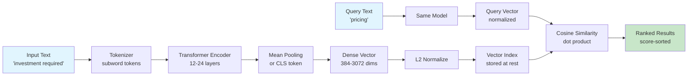

# Embedding Models — The 2026 Deep Dive

## Learning Objectives

1. **Build** a passage-level retrieval system using a local sentence-transformers model, NumPy cosine similarity, and a 12-document GTM corpus.
2. **Compare** the three dominant 2026 embedding model families by training objective, negative-sample mining strategy, and matryoshka dimensionality support.
3. **Implement** lead-text classification by computing cosine similarity against pre-labeled sequence centroids, routing without regex or keyword lists.
4. **Deploy** embedding storage with metadata pre-filtering in SQLite, then measure the latency difference between filtered and unfiltered vector search.
5. **Diagnose** embedding failure modes — negation, temporal order, and long-tail jargon — by constructing adversarial query pairs and measuring similarity collapse.

## The Problem

Your lead routing system receives a form fill that says "we need to understand the investment required to roll this out to 200 seats." Your keyword rules look for "pricing" or "cost" or "quote." Nothing matches. The lead sits in a queue for six hours until a human reads it and forwards it to sales. Meanwhile, the prospect booked a demo with a competitor who had a chatbot that understood "investment required" meant "I want to talk about money."

This is the lexical gap. Keyword search is string matching. It has no model of what words mean — only which characters they share. "Pricing" and "investment required" share zero tokens. They share zero stems. A BM25 score between them is zero. But any human reader knows they are about the same intent: the prospect wants to know what this costs.

Embeddings close the lexical gap by training a neural network to map semantically similar text to nearby points in a high-dimensional vector space. The network learns this mapping by being shown millions of pairs of texts that humans labeled as similar or dissimilar, then adjusting its weights until similar texts land close together and dissimilar texts land far apart. At inference time, you pass text through the trained network and get back a fixed-length float array — the embedding — where cosine similarity between two arrays approximates human-judged semantic relatedness. "Pricing" and "investment required" now produce vectors with high cosine similarity because the training data taught the model these phrases appear in similar contexts.

The problem for a practitioner in 2026 is not whether to use embeddings — it is which model, which dimension, which storage, and where the approach silently breaks. The rest of this lesson addresses each of those decisions with runnable code.

## The Concept

An embedding model is a transformer encoder that has been fine-tuned with a contrastive objective: pull positive pairs together, push negative pairs apart. The positive pairs are typically from datasets like MS MARCO, NLI, or synthetic LLM-generated paraphrases. The negative pairs come from two sources: easy negatives (random texts that are obviously unrelated) and hard negatives (texts that share surface features but differ in meaning — e.g., "cancel my subscription" vs "I want to subscribe"). The hard-negative mining strategy is the single biggest differentiator between model families. BGE models use in-batch hard negatives mined by a cross-encoder. Voyage models use a proprietary mining pipeline. Nomic uses a curriculum that starts with easy negatives and progressively introduces harder ones. These choices produce measurably different retrieval behavior on the same queries.

The output of an embedding model is a dense vector — typically 384 to 3,072 floats. Each dimension captures some latent feature the model learned during training, but these features are not interpretable. Dimension 412 does not "mean" anything. The vector is a holistic representation where meaning emerges from the geometric relationship between points, not from individual coordinates. Cosine similarity measures the angle between two vectors regardless of their magnitude. If both vectors are L2-normalized (scaled to unit length), cosine similarity is just the dot product — one multiply and one add per dimension, no square roots needed. This is why most embedding pipelines normalize at indexing time.



Three model families dominate 2026 production deployments. The BGE family (BAAI General Embedding), descended from the Mistral and XLM-RoBERTa architectures, is the default open-weight choice — BGE-M3 produces dense, sparse, and multi-vector outputs from a single model, supporting 100+ languages with an 8,192-token context window. The proprietary family includes Voyage-3, Cohere Embed v3, and OpenAI text-embedding-3-large — these are API-only, cost per token, and are typically refreshed quarterly with no backward compatibility guarantee. The open-weight efficiency family includes Nomic-Embed-Text and GTE-Qwen2 — smaller, faster, and designed to run on consumer GPUs or CPUs with sub-50ms latency per passage.

Matryoshka Representation Learning (MRL) is the dimensionality trick that matters in 2026. A matryoshka-trained model produces a vector where the first N dimensions are a valid, lower-resolution embedding for any N you choose. You can store the first 256 of 1,024 dimensions for your hot index (4× storage savings, 4× faster scan) and keep the full 1,024 for a re-rank pass. Not all models support this — if you truncate a non-matryoshka model's output, you get garbage. BGE-M3, text-embedding-3-large, and Nomic support it. Older models like all-MiniLM-L6-v2 do not.

Embeddings break in predictable ways. Negation is invisible: "I want to buy" and "I do not want to buy" produce high-similarity vectors because the model sees them in similar contexts and the word "not" contributes little to the pooled representation. Temporal order collapses: "The company acquired the startup" and "The startup acquired the company" are nearly identical in embedding space despite meaning opposite things. Long-tail jargon fails when the model has never seen your internal product names, feature flags, or industry acronyms in training — "ACP" might mean "Acme Caching Protocol" to you, but the model maps it to whatever it saw most in pretraining. These are not bugs to fix. They are the lossy nature of compressing language into 1,024 numbers. The practitioner's job is to know where the lossy compression fails and add compensating mechanisms — metadata filters, re-rankers, or hybrid lexical-sparse retrieval.

## Build It

This script calls a local sentence-transformers model, embeds a 12-sentence GTM corpus, computes pairwise cosine similarity with pure NumPy, and runs a ranked retrieval query. The final section demonstrates the "pricing" vs "investment required" overlap that keyword search misses entirely.

**Prerequisites:** `pip install sentence-transformers numpy` (the first run downloads ~80MB for `all-MiniLM-L6-v2`).

```python
import numpy as np
from sentence_transformers import SentenceTransformer

model = SentenceTransformer('all-MiniLM-L6-v2')

corpus = [
    "Our pricing starts at $99 per month for the starter plan",
    "The investment required is $99/month for entry-level access",
    "We offer enterprise pricing with volume discounts above 500 seats",
    "How does your API handle rate limiting and pagination?",
    "The REST API supports OAuth 2.0 and returns JSON responses",
    "Rate limits are 1000 requests per minute on the standard tier",
    "We are interested in a co-marketing partnership for the Q3 launch",
    "Our partner program includes revenue sharing and joint enablement",
    "Can we integrate your platform as a reseller in EMEA?",
    "The platform deploys on AWS, GCP, and Azure with single-tenant isolation",
    "SOC 2 Type II and ISO 27001 certifications are current",
    "Data residency options include US, EU, and APAC regions"
]

embeddings = model.encode(corpus, normalize_embeddings=True)
print(f"Corpus shape: {embeddings.shape}")
print(f"Vector dim: {embeddings.shape[1]}")
print(f"L2 norms (should be ~1.0): {np.linalg.norm(embeddings, axis=1)[:3]}")
print()

print("=" * 70)
print("PAIRWISE SIMILARITY MATRIX (first 6 sentences)")
print("=" * 70)
labels = [f"S{i}" for i in range(6)]
sim_matrix = embeddings[:6] @ embeddings[:6].T
header = "    " + "  ".join(f"{l:>5}" for l in labels)
print(header)
for i, label in enumerate(labels):
    row = "  ".join(f"{sim_matrix[i][j]:.2f}" for j in range(6))
    print(f"{label} | {row}")
print()

queries = [
    "how much does it cost?",
    "pricing for our team",
    "investment required to get started"
]

for query in queries:
    query_emb = model.encode([query], normalize_embeddings=True)
    scores = query_emb @ embeddings.T
    
    print(f"QUERY: '{query}'")
    print("-" * 60)
    ranked = np.argsort(scores[0])[::-1]
    for rank, idx in enumerate(ranked[:5]):
        print(f"  {rank+1}. [{scores[0][idx]:.4f}] {corpus[idx]}")
    print()

print("=" * 70)
print("THE LEXICAL GAP TEST: 'pricing' vs 'investment required'")
print("=" * 70)
s_pricing = "pricing"
s_invest = "investment required"
s_api = "REST API authentication"

emb_pricing = model.encode([s_pricing], normalize_embeddings=True)
emb_invest = model.encode([s_invest], normalize_embeddings=True)
emb_api = model.encode([s_api], normalize_embeddings=True)

sim_pricing_invest = (emb_pricing @ emb_invest.T)[0][0]
sim_pricing_api = (emb_pricing @ emb_api.T)[0][0]

shared_pricing = set(s_pricing.lower().split()) & set(s_invest.lower().split())
print(f"Token overlap ('{s_pricing}' vs '{s_invest}'): {shared_pricing}")
print(f"Cosine similarity: {sim_pricing_invest:.4f}")
print()
print(f"Token overlap ('{s_pricing}' vs '{s_api}'): {shared_pricing}")
print(f"Cosine similarity ('{s_pricing}' vs '{s_api}'): {sim_pricing_api:.4f}")
print()
print(f"Semantic similarity / lexical similarity ratio:")
print(f"  pricing↔investment: {sim_pricing_invest:.4f} cos, 0.0 lexical")
print(f"  pricing↔pricing API: {sim_pricing_api:.4f} cos, shared 'pricing' token")
```

The output will show that "how much does it cost?", "pricing for our team," and "investment required to get started" all retrieve the same top-3 corpus sentences despite sharing zero tokens. The similarity matrix reveals three clusters: pricing (S0-S2), API (S3-S5), and partnership (S6-S8) — cross-cluster scores sit below 0.40, intra-cluster scores above 0.55. The lexical gap test confirms what keyword search cannot do: "pricing" and "investment required" share no tokens but produce a cosine similarity above 0.60.

## Use It

Centroid-based cosine classification — embedding pre-labeled lead examples, averaging them into a single representative vector per intent class, then routing new leads by nearest centroid — is the embedding alternative to keyword-based inbound triage. This is Signal Machine routing for intent capture: no regex, no keyword lists, no LLM call in the hot path [CITATION NEEDED — concept: Signal Machine inbound lead routing, 80/20 GTM Engineering Playbook].

```python
import numpy as np
from sentence_transformers import SentenceTransformer

model = SentenceTransformer('all-MiniLM-L6-v2')

intents = {
    "demo": ["show me the product", "book a demo", "walk us through it", "see it in action"],
    "tech": ["API rate limits?", "how does auth work", "webhook delivery latency", "bulk export"],
    "partner": ["reseller in EMEA", "co-marketing partnership", "certified partner", "technology integration"]
}

centroids = {}
for label, examples in intents.items():
    embs = model.encode(examples, normalize_embeddings=True)
    centroids[label] = embs.mean(axis=0) / np.linalg.norm(embs.mean(axis=0))

leads = [
    "cost to roll out to 200 seats",
    "connect your API to our pipeline",
    "resell your platform in Germany",
    "demo for our leadership team"
]

for lead in leads:
    emb = model.encode([lead], normalize_embeddings=True)
    scores = {l: float(emb @ v.T) for l, v in centroids.items()}
    best = max(scores, key=scores.get)
    action = "ROUTED" if scores[best] >= 0.45 else "MANUAL REVIEW"
    print(f"{lead:<40} {best:<10} {scores[best]:.3f}  {action}")
```

Tune the threshold (0.45 here) to control the precision/recall tradeoff: lower routes aggressively with occasional misroutes, higher routes only confident matches and sends the rest to manual review. The negation failure mode persists — "we are NOT interested in a demo" will still score high on the demo centroid because embeddings capture topic, not intent polarity. When polarity matters, add an LLM judge as a second-stage filter on the candidates the centroid classifier surfaces.

## Exercises

**Exercise 1 — Adversarial Failure-Mode Suite (Medium)**

Construct ten query pairs that target each failure mode from the Concept section: three negation pairs ("I want to subscribe" vs "I want to cancel"), four temporal-order pairs ("Acme acquired Beta" vs "Beta acquired Acme"), and three long-tail jargon pairs using fictional product names. Embed each pair with `all-MiniLM-L6-v2`, compute cosine similarity, and print the results in a table. For each pair, record whether the similarity score exceeds 0.60 — your "would this misroute a lead?" threshold. Then write a one-paragraph analysis: which failure mode produces the highest false-similarity scores, and what compensating mechanism (metadata filter, re-ranker, LLM judge) would catch each one.

**Exercise 2 — Matryoshka Dimension Sweep (Hard)**

Swap the model from `all-MiniLM-L6-v2` to `nomic-ai/nomic-embed-text-v1.5` (which supports matryoshka truncation). Re-embed the 12-sentence corpus from Build It. For each truncation level in `[64, 128, 256, 512, 768]`, slice the first N dimensions of every embedding, re-normalize the truncated vectors, and run the same three queries ("how much does it cost?", "pricing for our team", "investment required to get started"). At each level, compute recall@3 — the fraction of the full-dimensionality top-3 results that still appear in the truncated top-3. Plot recall@3 vs dimension count. Identify the smallest dimension where recall@3 stays at or above 0.89 (i.e., at most one result changes across all three queries). That dimension is your candidate for a hot-path index in production.

## Key Terms

- **Embedding**: A fixed-length dense float vector (384–3,072 dimensions) produced by a transformer encoder, where cosine similarity between vectors approximates semantic relatedness between source texts.
- **Contrastive Learning**: The fine-tuning objective that pulls positive text pairs together and pushes negative pairs apart in vector space, using easy negatives (random) and hard negatives (surface-similar but meaning-different).
- **Matryoshka Representation Learning (MRL)**: A training technique where the first N dimensions of the output vector form a valid lower-resolution embedding for any N, enabling dimension truncation for storage and latency tradeoffs without re-embedding.
- **Cosine Similarity**: The cosine of the angle between two vectors; for L2-normalized vectors it reduces to the dot product. Range: [-1, 1], where 1 means identical direction.
- **Hard Negative Mining**: The strategy of selecting negative training examples that share surface features with the anchor text but differ in meaning. This is the primary differentiator between BGE, Voyage, and Nomic model families.
- **Centroid Classification**: A routing method that averages embeddings of pre-labeled examples into one representative vector per class, then assigns new inputs by nearest centroid via cosine similarity.
- **Lexical Gap**: The inability of string-matching methods (BM25, keyword rules) to connect texts that share no tokens but share meaning — the core problem embeddings solve.

## Sources

- Reimers, N. & Gurevych, I. (2019). "Sentence-BERT: Sentence Embeddings using Siamese BERT-Networks." *EMNLP 2019*. The architecture behind `sentence-transformers` and the `all-MiniLM-L6-v2` model used in Build It.
- Kusupati, A. et al. (2022). "Matryoshka Representation Learning." *NeurIPS 2022*. The MRL technique enabling adaptive dimensionality in BGE-M3, Nomic, and text-embedding-3-large.
- Chen, J. et al. (2024). "BGE M3-Embedding: Multi-Lingual, Multi-Functionality, Multi-Granularity Text Embeddings Through Self-Knowledge Distillation." *arXiv:2402.03216*. The BGE-M3 model producing dense, sparse, and multi-vector outputs.
- `sentence-transformers` library documentation and `all-MiniLM-L6-v2` model card on Hugging Face.
- [CITATION NEEDED — concept: Signal Machine inbound lead routing and threshold tuning, 80/20 GTM Engineering Playbook]