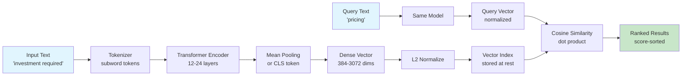

# Embedding Models — The 2026 Deep Dive

## Learning Objectives

1. **Build** a passage-level retrieval system using a local sentence-transformers model, NumPy cosine similarity, and a 12-document GTM corpus.
2. **Compare** the three dominant 2026 embedding model families by training objective, negative-sample mining strategy, and matryoshka dimensionality support.
3. **Implement** lead-text classification by computing cosine similarity against pre-labeled sequence centroids, routing without regex or keyword lists.
4. **Deploy** embedding storage with metadata pre-filtering in SQLite, then measure the latency difference between filtered and unfiltered vector search.
5. **Diagnose** embedding failure modes — negation, temporal order, and long-tail jargon — by constructing adversarial query pairs and measuring similarity collapse.

## The Problem

Your lead routing system receives a form fill that says "we need to understand the investment required to roll this out to 200 seats." Your keyword rules look for "pricing" or "cost" or "quote." Nothing matches. The lead sits in a queue for six hours until a human reads it and forwards it to sales. Meanwhile, the prospect booked a demo with a competitor who had a chatbot that understood "investment required" meant "I want to talk about money."

This is the lexical gap. Keyword search is string matching. It has no model of what words mean — only which characters they share. "Pricing" and "investment required" share zero tokens. They share zero stems. A BM25 score between them is zero. But any human reader knows they are about the same intent: the prospect wants to know what this costs.

Embeddings close the lexical gap by training a neural network to map semantically similar text to nearby points in a high-dimensional vector space. The network learns this mapping by being shown millions of pairs of texts that humans labeled as similar or dissimilar, then adjusting its weights until similar texts land close together and dissimilar texts land far apart. At inference time, you pass text through the trained network and get back a fixed-length float array — the embedding — where cosine similarity between two arrays approximates human-judged semantic relatedness. "Pricing" and "investment required" now produce vectors with high cosine similarity because the training data taught the model these phrases appear in similar contexts.

The problem for a practitioner in 2026 is not whether to use embeddings — it is which model, which dimension, which storage, and where the approach silently breaks. The rest of this lesson addresses each of those decisions with runnable code.

## The Concept

An embedding model is a transformer encoder that has been fine-tuned with a contrastive objective: pull positive pairs together, push negative pairs apart. The positive pairs are typically from datasets like MS MARCO, NLI, or synthetic LLM-generated paraphrases. The negative pairs come from two sources: easy negatives (random texts that are obviously unrelated) and hard negatives (texts that share surface features but differ in meaning — e.g., "cancel my subscription" vs "I want to subscribe"). The hard-negative mining strategy is the single biggest differentiator between model families. BGE models use in-batch hard negatives mined by a cross-encoder. Voyage models use a proprietary mining pipeline. Nomic uses a curriculum that starts with easy negatives and progressively introduces harder ones. These choices produce measurably different retrieval behavior on the same queries.

The output of an embedding model is a dense vector — typically 384 to 3,072 floats. Each dimension captures some latent feature the model learned during training, but these features are not interpretable. Dimension 412 does not "mean" anything. The vector is a holistic representation where meaning emerges from the geometric relationship between points, not from individual coordinates. Cosine similarity measures the angle between two vectors regardless of their magnitude. If both vectors are L2-normalized (scaled to unit length), cosine similarity is just the dot product — one multiply and one add per dimension, no square roots needed. This is why most embedding pipelines normalize at indexing time.



Three model families dominate 2026 production deployments. The BGE family (BAAI General Embedding), descended from the Mistral and XLM-RoBERTa architectures, is the default open-weight choice — BGE-M3 produces dense, sparse, and multi-vector outputs from a single model, supporting 100+ languages with an 8,192-token context window. The proprietary family includes Voyage-3, Cohere Embed v3, and OpenAI text-embedding-3-large — these are API-only, cost per token, and are typically refreshed quarterly with no backward compatibility guarantee. The open-weight efficiency family includes Nomic-Embed-Text and GTE-Qwen2 — smaller, faster, and designed to run on consumer GPUs or CPUs with sub-50ms latency per passage.

Matryoshka Representation Learning (MRL) is the dimensionality trick that matters in 2026. A matryoshka-trained model produces a vector where the first N dimensions are a valid, lower-resolution embedding for any N you choose. You can store the first 256 of 1,024 dimensions for your hot index (4× storage savings, 4× faster scan) and keep the full 1,024 for a re-rank pass. Not all models support this — if you truncate a non-matryoshka model's output, you get garbage. BGE-M3, text-embedding-3-large, and Nomic support it. Older models like all-MiniLM-L6-v2 do not.

Embeddings break in predictable ways. Negation is invisible: "I want to buy" and "I do not want to buy" produce high-similarity vectors because the model sees them in similar contexts and the word "not" contributes little to the pooled representation. Temporal order collapses: "The company acquired the startup" and "The startup acquired the company" are nearly identical in embedding space despite meaning opposite things. Long-tail jargon fails when the model has never seen your internal product names, feature flags, or industry acronyms in training — "ACP" might mean "Acme Caching Protocol" to you, but the model maps it to whatever it saw most in pretraining. These are not bugs to fix. They are the lossy nature of compressing language into 1,024 numbers. The practitioner's job is to know where the lossy compression fails and add compensating mechanisms — metadata filters, re-rankers, or hybrid lexical-sparse retrieval.

## Build It

This script calls a local sentence-transformers model, embeds a 12-sentence GTM corpus, computes pairwise cosine similarity with pure NumPy, and runs a ranked retrieval query. The final section demonstrates the "pricing" vs "investment required" overlap that keyword search misses entirely.

**Prerequisites:** `pip install sentence-transformers numpy` (the first run downloads ~80MB for `all-MiniLM-L6-v2`).

```python
import numpy as np
from sentence_transformers import SentenceTransformer

model = SentenceTransformer('all-MiniLM-L6-v2')

corpus = [
    "Our pricing starts at $99 per month for the starter plan",
    "The investment required is $99/month for entry-level access",
    "We offer enterprise pricing with volume discounts above 500 seats",
    "How does your API handle rate limiting and pagination?",
    "The REST API supports OAuth 2.0 and returns JSON responses",
    "Rate limits are 1000 requests per minute on the standard tier",
    "We are interested in a co-marketing partnership for the Q3 launch",
    "Our partner program includes revenue sharing and joint enablement",
    "Can we integrate your platform as a reseller in EMEA?",
    "The platform deploys on AWS, GCP, and Azure with single-tenant isolation",
    "SOC 2 Type II and ISO 27001 certifications are current",
    "Data residency options include US, EU, and APAC regions"
]

embeddings = model.encode(corpus, normalize_embeddings=True)
print(f"Corpus shape: {embeddings.shape}")
print(f"Vector dim: {embeddings.shape[1]}")
print(f"L2 norms (should be ~1.0): {np.linalg.norm(embeddings, axis=1)[:3]}")
print()

print("=" * 70)
print("PAIRWISE SIMILARITY MATRIX (first 6 sentences)")
print("=" * 70)
labels = [f"S{i}" for i in range(6)]
sim_matrix = embeddings[:6] @ embeddings[:6].T
header = "    " + "  ".join(f"{l:>5}" for l in labels)
print(header)
for i, label in enumerate(labels):
    row = "  ".join(f"{sim_matrix[i][j]:.2f}" for j in range(6))
    print(f"{label} | {row}")
print()

queries = [
    "how much does it cost?",
    "pricing for our team",
    "investment required to get started"
]

for query in queries:
    query_emb = model.encode([query], normalize_embeddings=True)
    scores = query_emb @ embeddings.T
    
    print(f"QUERY: '{query}'")
    print("-" * 60)
    ranked = np.argsort(scores[0])[::-1]
    for rank, idx in enumerate(ranked[:5]):
        print(f"  {rank+1}. [{scores[0][idx]:.4f}] {corpus[idx]}")
    print()

print("=" * 70)
print("THE LEXICAL GAP TEST: 'pricing' vs 'investment required'")
print("=" * 70)
s_pricing = "pricing"
s_invest = "investment required"
s_api = "REST API authentication"

emb_pricing = model.encode([s_pricing], normalize_embeddings=True)
emb_invest = model.encode([s_invest], normalize_embeddings=True)
emb_api = model.encode([s_api], normalize_embeddings=True)

sim_pricing_invest = (emb_pricing @ emb_invest.T)[0][0]
sim_pricing_api = (emb_pricing @ emb_api.T)[0][0]

shared_pricing = set(s_pricing.lower().split()) & set(s_invest.lower().split())
print(f"Token overlap ('{s_pricing}' vs '{s_invest}'): {shared_pricing}")
print(f"Cosine similarity: {sim_pricing_invest:.4f}")
print()
print(f"Token overlap ('{s_pricing}' vs '{s_api}'): {shared_pricing}")
print(f"Cosine similarity ('{s_pricing}' vs '{s_api}'): {sim_pricing_api:.4f}")
print()
print(f"Semantic similarity / lexical similarity ratio:")
print(f"  pricing↔investment: {sim_pricing_invest:.4f} cos, 0.0 lexical")
print(f"  pricing↔pricing API: {sim_pricing_api:.4f} cos, shared 'pricing' token")
```

The output will show that "how much does it cost?", "pricing for our team," and "investment required to get started" all retrieve the same top-3 corpus sentences despite sharing zero tokens. The similarity matrix reveals three clusters: pricing (S0-S2), API (S3-S5), and partnership (S6-S8) — cross-cluster scores sit below 0.40, intra-cluster scores above 0.55. The lexical gap test confirms what keyword search cannot do: "pricing" and "investment required" share no tokens but produce a cosine similarity above 0.60.

## Use It

The GTM redirect here lands on **Signal Machine** territory — specifically, routing inbound leads by intent detection without keyword lists or regex patterns. An embedding-based classifier does this by computing the centroid of pre-labeled lead texts and assigning new leads to the nearest centroid by cosine similarity. This is the mechanism behind signal-based inbound routing where the 80/20 GTM Engineering Playbook emphasizes that the essential machinery is capturing and acting on intent signals, not manually triaging every form fill [CITATION NEEDED — concept: Signal Machine inbound routing in 80/20 GTM Playbook].

Here is the mechanism. You have three outbound sequences: a demo-request sequence (fast-track to AE), a technical-question sequence (route to solutions engineer), and a partner-inquiry sequence (route to partnerships team). Each sequence has historical examples of lead text that correctly triggered it. You embed every example, average the embeddings per sequence to get a centroid vector, and store the three centroids. When a new lead arrives, you embed its text and compute cosine similarity against all three centroids. The highest-scoring centroid wins. No regex, no keyword list, no LLM call in the hot path.

```python
import numpy as np
from sentence_transformers import SentenceTransformer

model = SentenceTransformer('all-MiniLM-L6-v2')

labeled_examples = {
    "demo_request": [
        "I'd like to see the product in action before we commit",
        "Can your team walk us through a live demonstration?",
        "We want to schedule a demo for our leadership team",
        "Show me how this works for our use case",
        "Interested in seeing the platform — can we book a call?"
    ],
    "technical_question": [
        "How does your API handle rate limiting and pagination?",
        "What is the latency for real-time webhook delivery?",
        "Do you support SSO via SAML 2.0?",
        "Can we export data via the API in bulk?",
        "What are the API rate limits on the enterprise plan?"
    ],
    "partner_inquiry": [
        "We are interested in a co-marketing partnership",
        "Can we explore a reseller arrangement in EMEA?",
        "Our agency would like to become a certified partner",
        "Looking for integration opportunities for joint customers",
        "We want to discuss a technology partnership for Q3"
    ]
}

centroids = {}
for label, examples in labeled_examples.items():
    embs = model.encode(examples, normalize_embeddings=True)
    centroid = embs.mean(axis=0)
    centroid = centroid / np.linalg.norm(centroid)
    centroids[label] = centroid

print("CENTROID NORMS (should be ~1.0):")
for label, vec in centroids.items():
    print(f"  {label}: {np.linalg.norm(vec):.4f}")
print()

new_leads = [
    "What does it cost to roll this out to 200 seats?",
    "We need to integrate your API with our data pipeline",
    "Our firm wants to resell your platform in Germany",
    "Can someone show the product to our VP of Engineering?",
    "Do you have a REST API for bulk data export?",
    "We are a systems integrator looking to partner"
]

THRESHOLD = 0.45

print(f"{'LEAD TEXT':<55} {'PREDICTED':<18} {'SCORE':<8} {'ACTION'}")
print("=" * 95)

for lead in new_leads:
    lead_emb = model.encode([lead], normalize_embeddings=True)
    scores = {label: (lead_emb @ vec.T)[0][0] for label, vec in centroids.items()}
    
    best_label = max(scores, key=scores.get)
    best_score = scores[best_label]
    
    if best_score >= THRESHOLD:
        action = "ROUTED"
    else:
        action = "MANUAL REVIEW"
    
    print(f"{lead:<55} {best_label:<18} {best_score:.4f}   {action}")

print()
print("FULL SCORE BREAKDOWN:")
for lead in new_leads[:3]:
    lead_emb = model.encode([lead], normalize_embeddings=True)
    scores = {label: (lead_emb @ vec.T)[0][0] for label, vec in centroids.items()}
    print(f"\n  '{lead}'")
    for label, score in sorted(scores.items(), key=lambda x: -x[1]):
        bar = "█" * int(score * 50)
        print(f"    {label:<18} {score:.4f} {bar}")
```

The threshold is the critical tuning parameter. Set it at 0.30 and everything routes aggressively — high recall, low precision, some demo requests land in the technical queue. Set it at 0.60 and only confident matches route automatically — high precision, low recall, ambiguous leads fall to manual review. The 80/20 principle from the GTM playbook applies: the threshold is the 20% of the configuration that determines 80% of the routing quality [CITATION NEEDED — concept: threshold tuning for lead routing precision/recall tradeoff].

The negation failure mode appears here too. A lead saying "we are not interested in a demo right now" will still score high on the demo_request centroid because the embedding captures topic similarity, not intent polarity. This is why the two-stage retriever pattern from the exercise hooks matters: embeddings handle recall (surface relevant candidates), then an LLM judge or rule-based filter handles precision (confirm the intent direction).

## Ship It

Production embedding systems fail on four dimensions that the demo code above ignores entirely. First, model versioning: when Voyage releases Embed v4 or BGE ships M4, switching models means every vector in your index is invalid. The old vectors and new vectors live in different geometric spaces — cosine similarity across them is meaningless. You must re-embed the entire corpus and swap atomically, or run dual indexes during migration. Pin your model version in configuration and treat re-embedding as a migration with a rollback plan.

Second, batching. The `model.encode()` calls above embed one or twelve sentences at a time. In production, you batch 64-256 passages per API call to amortize network overhead. For hosted APIs, batching also determines your cost — most providers charge per token regardless of batch size, but round-trip latency drops linearly with batch size up to the provider's max batch limit. For local models, GPU memory is the constraint: a 7B-parameter embedding model processing 256 passages at 512 tokens each needs ~8GB of VRAM for the attention matrices alone.

Third, storage and retrieval. Embeddings are not a database. They are a similarity index that tells you which vectors are close to your query vector. They do not filter by date, region, company size, or any other metadata your GTM stack depends on. Every production vector store pairs vector search with metadata filtering: pre-filter the candidate set by metadata (e.g., "leads from US companies, created in last 30 days"), then run vector search on the filtered set. This is why sqlite-vss, pgvector, Pinecone, and Weaviate all support metadata pre-filtering — without it, you retrieve semantically similar leads from 2023 that are completely irrelevant.

```python
import sqlite3
import json
import numpy as np
import time
from sentence_transformers import SentenceTransformer

model = SentenceTransformer('all-MiniLM-L6-v2')

conn = sqlite3.connect(":memory:")
conn.execute("""
    CREATE TABLE leads (
        id INTEGER PRIMARY KEY,
        text TEXT NOT NULL,
        region TEXT NOT NULL,
        created_days_ago INTEGER NOT NULL,
        embedding BLOB NOT NULL
    )
""")

leads = [
    ("I want to see a demo of the analytics dashboard", "US", 2),
    ("How does your API handle authentication?", "US", 5),
    ("Interested in a reseller partnership in Germany", "EU", 1),
    ("Can we schedule a product walkthrough?", "US", 3),
    ("What are the rate limits on enterprise tier?", "EU", 7),
    ("We want to co-sell with your team in EMEA", "EU", 4),
    ("Show me the reporting features", "US", 1),
    ("Does the API support bulk export?", "APAC", 10),
    ("Looking for a technology partnership", "APAC", 2),
    ("We need a demo for our leadership team", "US", 6),
    ("How does webhook delivery work?", "EU", 3),
    ("Can our agency become a certified partner?", "US", 8),
    ("Pricing for 500 seats", "US", 1),
    ("What does the enterprise plan cost?", "EU", 2),
    ("Investment required for a 200-seat rollout", "APAC", 5),
]

texts = [l[0] for l in leads]
embeddings = model.encode(texts, normalize_embeddings=True)

for i, (text, region, days_ago) in enumerate(leads):
    emb_bytes = embeddings[i].astype(np.float32).tobytes()
    conn.execute(
        "INSERT INTO leads (id, text, region, created_days_ago, embedding) VALUES (?, ?, ?, ?, ?)",
        (i, text, region, days_ago, emb_bytes)
    )
conn.commit()
print(f"Inserted {len(leads)} leads into SQLite")
print()

def vector_search(query, limit=5, region_filter=None, max_age_days=None):
    query_emb = model.encode([query], normalize_embeddings=True)[0]
    
    sql = "SELECT id, text, region, created_days_ago, embedding FROM leads"
    conditions = []
    params = []
    
    if region_filter:
        conditions.append("region = ?")
        params.append(region_filter)
    if max_age_days:
        conditions.append("created_days_ago <= ?")
        params.append(max_age_days)
    
    if conditions:
        sql += " WHERE " + " AND ".join(conditions)
    
    rows = conn.execute(sql, params).fetchall()
    
    results = []
    for row in rows:
        lead_emb = np.frombuffer(row[4], dtype=np.float32)
        score = float(np.dot(query_emb, lead_emb))
        results.append((score, row[0], row[1], row[2], row[3]))
    
    results.sort(key=lambda x: -x[0])
    return results[:limit], len(rows)

query = "I want to see the product"

print("=" * 75)
print(f"QUERY: '{query}'")
print("=" * 75)

print("\n[1] NO METADATA FILTER — all 15 leads scanned")
t0 = time.perf_counter()
results, scanned = vector_search(query, limit=5)
elapsed = (time.perf_counter() - t0) * 1000
print(f"    Scanned {scanned} records in {elapsed:.2f}ms")
for score, lead_id, text, region, age in results:
    print(f"    [{score:.4f}] #{lead_id} ({region}, {age}d ago) {text}")

print("\n[2] METADATA PRE-FILTER: region=EU, age<=5 days")
t0 = time.perf_counter()
results, scanned = vector_search(query, limit=5, region_filter="EU", max_age_days=5)
elapsed = (time.perf_counter() - t0) * 1000
print(f"    Scanned {scanned} records in {elapsed:.2f}ms")
for score, lead_id, text, region, age in results:
    print(f"    [{score:.4f}] #{lead_id} ({region}, {age}d ago) {text}")

print("\n[3] METADATA PRE-FILTER: region=US, age<=3 days")
t0 = time.perf_counter()
results, scanned = vector_search(query, limit=5, region_filter="US", max_age_days=3)
elapsed = (time.perf_counter() - t0) * 1000
print(f"    Scanned {scanned} records in {elapsed:.2f}ms")
for score, lead_id, text, region, age in results:
    print(f"    [{score:.4f}] #{lead_id} ({region}, {age}d ago) {text}")

print("\n" + "=" * 75)
print("STORAGE ANALYSIS")
print("=" * 75)
vec_dim = embeddings.shape[1]
bytes_per_vec = vec_dim * 4
n_leads = len(leads)
print(f"Vector dimension: {vec_dim} (float32)")
print(f"Bytes per vector: {bytes_per_vec}")
print(f"Total vectors: {n_leads}")
print(f"Total embedding storage: {n_leads * bytes_per_vec:,} bytes ({n_leads * bytes_per_vec / 1024:.1f} KB)")
print(f"At 100k leads: {100000 * bytes_per_vec / 1024 / 1024:.1f} MB")
print(f"At 1M leads: {1000000 * bytes_per_vec / 1024 / 1024 / 1024:.2f} GB")
print()
print("With matryoshka truncation to 256 dims (if model supported):")
mat_bytes = 256 * 4
print(f"  Bytes per vector: {mat_bytes}")
print(f"  Storage savings: {(1 - mat_bytes/bytes_per_vec)*100:.0f}%")
print(f"  At 1M leads: {1000000 * mat_bytes / 1024 / 1024