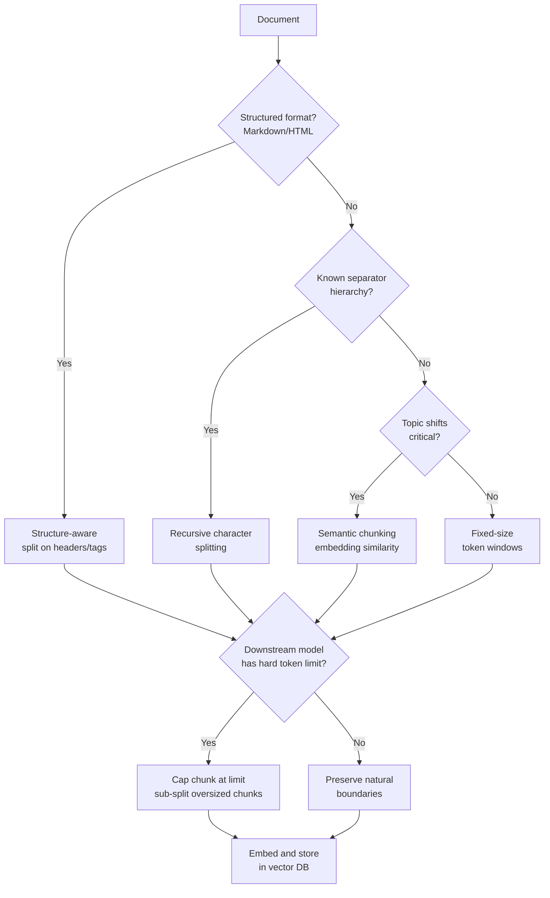

# Chunking Strategies for RAG

## Learning Objectives

- Implement four chunking algorithms in Python: fixed-size token windows, recursive character splitting, Markdown-header-aware splitting, and semantic similarity-based splitting
- Compare chunking strategies by measuring token counts, boundary positions, and topic coherence across the same source document
- Configure overlap parameters and evaluate their effect on retrieval continuity at chunk boundaries
- Select an appropriate chunking strategy for a given document type by tracing how each algorithm interacts with downstream embedding models and retrieval prompts
- Diagnose retrieval failures caused by poor chunk boundaries and adjust the chunking pipeline to fix them

## The Problem

You put a 50-page competitor analysis dossier into a RAG system. A sales rep asks: "What does DataSync Pro charge for enterprise?" The retriever returns the company overview page — the section about funding history and headquarters — not the pricing table that sits three sections deeper. The embedding model is not broken. The chunk boundary fell right in the middle of the pricing structure, scattering the dollar figures across two chunks that individually lack the context to match the query.

This is a chunking problem. The embedding model converts whatever text you give it into a vector. If that text is a coherent unit of information — a pricing tier with its features, a termination clause with its conditions — the vector captures something useful. If that text is half a pricing table glued to half a company overview, the vector captures noise. No amount of reranking, hybrid search, or query expansion fixes garbage at the chunk level.

The benchmarks confirm this. Vectara's NAACL 2025 paper showed that chunking configuration influences retrieval quality as much as the choice of embedding model itself. Their 2026 follow-up produced a counterintuitive result: recursive 512-token chunking beat semantic chunking on accuracy, 69% to 54% — the "smarter" algorithm performed worse. Separate work with SPLADE + Mistral-8B on Natural Questions found that overlap between chunks provided zero measurable benefit. And across multiple studies, response quality hits a cliff around 2,500 tokens of retrieved context, meaning "just retrieve more chunks" stops working fast.

The practical takeaway: chunking is not a preprocessing afterthought. It is a retrieval design decision that sits upstream of everything else. This lesson builds the four algorithms you will actually use, shows you their failure modes on real text, and gives you the diagnostic tools to pick the right one for a given document corpus.

## The Concept

Every chunking algorithm answers two questions: **where do I cut?** and **how much context surrounds each cut?** The first question determines whether chunks preserve semantic units. The second determines whether information destroyed at a boundary can be partially recovered through overlap. Let's trace five mechanisms, from simplest to most complex.

**Fixed-size chunking** cuts every N tokens. It ignores sentence boundaries, paragraph boundaries, and topic boundaries. The algorithm is: count tokens, slice at N, advance by N minus overlap, repeat. Its strength is uniformity — every chunk fits the embedding model's context window exactly, and vector store operations are predictable. Its weakness is that it routinely bisects sentences, clauses, and table rows. For dense informational text where every sentence carries independent meaning (call transcripts, log files), this matters less. For structured documents where a table row split across chunks becomes unreadable, it fails badly.

**Recursive character splitting** tries a hierarchy of separators in order: split on double-newline first. If any resulting piece exceeds the chunk size, split that piece on single newline. Still too big? Split on periods. Then spaces. Then individual characters as a last resort. This is the algorithm behind LangChain's `RecursiveCharacterTextSplitter`, and it works because most documents have natural structural separators that align with semantic boundaries. A markdown document split on `\n\n` produces paragraphs. A contract split on `\n` produces clauses. The separator hierarchy encodes a prior: "paragraph breaks are more likely to be topic boundaries than sentence boundaries, which are more likely than word boundaries."

**Document-structure-aware splitting** goes further by parsing the document's actual structure rather than guessing from whitespace. For Markdown, this means tracking header levels (`#`, `##`, `###`) and grouping all content under a header into one chunk or a set of related chunks. For HTML, it means respecting `<section>`, `<div>`, or `<table>` tags. The chunk boundaries align with the author's intended structure, which means chunks carry their section context naturally. The tradeoff: chunk sizes are unpredictable. A one-line header section produces a tiny chunk that wastes embedding compute, while a 2000-token appendix produces a chunk that exceeds the model's context window.

**Semantic chunking** embeds every sentence independently, computes cosine similarity between consecutive sentence embeddings, and splits wherever similarity drops below a threshold. The intuition: adjacent sentences on the same topic have high similarity; a topic shift produces a similarity dip. Split at the dips. This sounds superior in theory — the algorithm discovers topic boundaries without any structural cues. In practice, the Vectara 2026 benchmark showed it underperforming recursive splitting by 15 percentage points. The likely reason: semantic chunkers produce highly variable chunk sizes, including tiny 30-token fragments from brief topic asides that then fail to match any query with enough context to be useful.

Here is how these strategies relate to each other in a decision pipeline:



**Overlap** is a lossy compensation mechanism. When you cut a document into chunks, the sentence at the boundary loses its neighbor on one side. A 20-token overlap duplicates 20 tokens from the end of chunk N into the beginning of chunk N+1, giving each boundary sentence partial access to its original context. The SPLADE/Mistral benchmark suggests overlap's benefit is not always measurable — if your chunks are already coherent units (because your chunking strategy respects boundaries), the duplicated tokens add noise without adding signal. Overlap helps most with fixed-size chunking, where mid-sentence cuts are guaranteed, and helps least with structure-aware chunking, where cuts already align with natural breaks.

The token-count dimension matters because embedding models have hard input limits. OpenAI's `text-embedding-3-small` accepts 8,191 tokens. `all-MiniLM-L6-v2` accepts 256. If your chunker produces a 500-token chunk and your model truncates at 256, the back half of that chunk is silently discarded — it is never embedded, never retrieved, and never surfaces in any error log. Token-based chunking (as opposed to character-based) avoids this failure mode by counting in the same units the embedding model uses.

## Build It

Let's implement all four chunking strategies on the same source document — a competitor analysis brief with Markdown headers, a pricing table, and a positioning section. This is the kind of document a GTM team ingests into a knowledge base for sales reps to query during deal cycles. Running all four strategies on identical input makes the tradeoffs visible: you can see exactly where each algorithm cuts and what information survives or gets destroyed at each boundary.

**Strategy 1: Fixed-size token chunking with overlap.**

```python
import tiktoken

encoding = tiktoken.encoding_for_model("gpt-4")

def fixed_size_chunk(text, chunk_size=100, overlap=20):
    tokens = encoding.encode(text)
    chunks = []
    start = 0
    while start < len(tokens):
        end = start + chunk_size
        chunk_tokens = tokens[start:end]
        chunk_text = encoding.decode(chunk_tokens)
        chunks.append({
            "index": len(chunks),
            "token_count": len(chunk_tokens),
            "char_start": len(encoding.decode(tokens[:start])),
            "text": chunk_text
        })
        next_start = end - overlap
        if next_start <= start:
            break
        start = next_start
    return chunks

sample_text = """DataSync Pro is a Series B SaaS company founded in 2019, headquartered in Austin, TX. They raised $45M in their latest round led by Sequoia Capital.

DataSync Pro charges per connector per month. Starter tier begins at $499/month for up to 10 connectors. Growth tier is $1,499/month for 50 connectors. Enterprise pricing is custom, typically starting at $5,000/month with annual contracts.

Their platform includes a visual pipeline builder, pre-built connector library with 300+ integrations, and real-time monitoring dashboards. They recently launched an AI-powered data quality scoring feature.

DataSync Pro positions against Fivetran by emphasizing cost savings of 40-60% at scale. Their primary weakness is limited support for streaming data sources."""

chunks = fixed_size_chunk(sample_text, chunk_size=80, overlap=15)

print(f"Total tokens: {len(encoding.encode(sample_text))}")
print(f"Total chunks: {len(chunks)}")
print(f"Chunk size: 80 tokens, Overlap: 15 tokens\n")

for chunk in chunks:
    print(f"=== Chunk {chunk['index']} | {chunk['token_count']} tokens ===")
    first_60 = chunk['text'][:60].replace('\n', ' ')
    last_60 = chunk['text'][-60:].replace('\n', ' ')
    print(f"START: {first_60}...")
    print(f"END:   ...{last_60}")
    print()
```

Run this and inspect the output. You will see chunks that cut mid-sentence — the pricing section likely bleeds into the features section. This is the core failure mode of fixed-size chunking on informational text: the boundaries ignore meaning.

**Strategy 2: Recursive character splitting with a separator hierarchy.**

```python
def recursive_split(text, separators=None, chunk_size=300, chunk_overlap=30):
    if separators is None:
        separators = ["\n\n", "\n", ". ", " ", ""]

    def split_text(text, separators):
        sep = separators[0]
        remaining_seps = separators[1:]
        if sep == "":
            splits = list(text)
        else:
            splits = text.split(sep)

        final_chunks = []
        for s in splits:
            if len(encoding.encode(s)) < chunk_size:
                final_chunks.append(s)
            else:
                if remaining_seps:
                    sub_chunks = split_text(s, remaining_seps)
                    final_chunks.extend(sub_chunks)
                else:
                    final_chunks.append(s)

        merged = []
        current = ""
        for s in final_chunks:
            candidate = s if not current else current + sep + s
            if len(encoding.encode(candidate)) <= chunk_size:
                current = candidate
            else:
                if current:
                    merged.append(current)
                current = s
        if current:
            merged.append(current)

        return merged

    raw_chunks = split_text(text, separators)

    result = []
    for i, chunk_text in enumerate(raw_chunks):
        result.append({
            "index": i,
            "token_count": len(encoding.encode(chunk_text)),
            "separator_used": separators[0] if len(raw_chunks) == 1 else "hierarchical",
            "text": chunk_text.strip()
        })
    return result

chunks = recursive_split(sample_text, chunk_size=120, chunk_overlap=20)

print(f"Total chunks: {len(chunks)}")
print(f"Separator hierarchy: ['\\n\\n', '\\n', '. ', ' ', '']\n")

for chunk in chunks:
    print(f"=== Chunk {chunk['index']} | {chunk['token_count']} tokens ===")
    preview = chunk['text'][:100].replace('\n', ' ')
    print(f"TEXT: {preview}...")
    print()
```

The recursive splitter respects paragraph boundaries first. On this input, each paragraph becomes its own chunk because they are all under the size limit. On longer documents where a single paragraph exceeds `chunk_size`, the splitter descends to sentence-level separators, producing sub-paragraph chunks that still begin and end at natural breaks.

**Strategy 3: Markdown-header-aware splitting.**

```python
import re

def markdown_header_chunk(text, max_tokens=150):
    lines = text.split('\n')
    chunks = []
    current_header = ""
    current_section_lines = []

    def flush():
        nonlocal current_section_lines
        if current_section_lines:
            section_text = current_header + '\n' + '\n'.join(current_section_lines)
            token_count = len(encoding.encode(section_text))
            if token_count > max_tokens:
                sub_chunks = recursive_split(section_text, chunk_size=max_tokens)
                for sc in sub_chunks:
                    chunks.append({
                        "header": current_header,
                        "token_count": sc["token_count"],
                        "text": sc["text"]
                    })
            else:
                chunks.append({
                    "header": current_header,
                    "token_count": token_count,
                    "text": section_text.strip()
                })
            current_section_lines = []

    for line in lines:
        header_match = re.match(r'^(#{1,6})\s+(.+)$', line)
        if header_match:
            flush()
            current_header = line.strip()
        else:
            if line.strip():
                current_section_lines.append(line)
    flush()

    for i, chunk in enumerate(chunks):
        chunk["index"] = i
    return chunks

markdown_doc = """# Competitor Analysis: DataSync Pro

## Company Overview
DataSync Pro is a Series B SaaS company founded in 2019, headquartered in Austin, TX. They raised $45M led by Sequoia Capital. The company focuses on mid-market data integration with emphasis on reverse ETL workflows.

## Pricing Structure
DataSync Pro charges per connector per month. Starter tier begins at $499/month for up to 10 connectors. Growth tier is $1,499/month for 50 connectors. Enterprise pricing is custom, typically starting at $5,000/month with annual contracts. Volume discounts apply above 100 connectors.

## Competitive Positioning
DataSync Pro positions against Fivetran by emphasizing cost savings of 40-60% at scale and flexibility in connector configuration. Their primary weakness is limited support for streaming data sources, where competitors have a 2-year head start."""

chunks = markdown_header_chunk(markdown_doc, max_tokens=100)

print(f"Total chunks: {len(chunks)}\n")

for chunk in chunks:
    print(f"=== Chunk {chunk['index']} ===")
    print(f"HEADER: {chunk['header']}")
    print(f"TOKENS: {chunk['token_count']}")
    preview = chunk['text'][:120].replace('\n', ' ')
    print(f"TEXT: {preview}...")
    print()
```

Each chunk now carries its section header. When this chunk is retrieved, the downstream LLM sees "## Pricing Structure" at the top — context that helps it interpret the dollar figures below. This is why structure-aware chunking tends to produce better retrieval for documents with meaningful headers: the header acts as a built-in metadata tag.

**Strategy 4: Semantic chunking via sentence embedding similarity.**

```python
from sentence_transformers import SentenceTransformer
import numpy as np

model = SentenceTransformer('all-MiniLM-L6-v2')

def semantic_chunk(text, threshold_percentile=65, min_chunk_tokens=20):
    sentences = [s.strip() for s in text.split('. ') if s.strip()]
    if len(sentences) <= 1:
        return [{"index": 0, "token_count": len(encoding.encode(text)), "text": text}]

    embeddings = model.encode(sentences, normalize_embeddings=True)

    similarities = []
    for i in range(len(embeddings) - 1):
        sim = np.dot(embeddings[i], embeddings[i + 1])
        similarities.append(sim)

    threshold = np.percentile(similarities, threshold_percentile)

    chunks = []
    current_sentences = [sentences[0]]

    for i in range(len(similarities)):
        if similarities[i] < threshold:
            chunk_text = '. '.join(current_sentences) + '.'
            token_count = len(encoding.encode(chunk_text))
            if token_count >= min_chunk_tokens or not chunks:
                chunks.append({
                    "text": chunk_text,
                    "token_count": token_count,
                    "split_similarity": similarities[i]
                })
            else:
                if chunks:
                    chunks[-1]["text"] += ' ' + chunk_text
                    chunks[-1]["token_count"] = len(encoding.encode(chunks[-1]["text"]))
                else:
                    chunks.append({"text": chunk_text, "token_count": token_count, "split_similarity": similarities[i]})
            current_sentences = [sentences[i + 1]]
        else:
            current_sentences.append(sentences[i + 1])

    if current_sentences:
        chunk_text = '. '.join(current_sentences) + '.'
        token_count = len(encoding.encode(chunk_text))
        if chunks and token_count < min_chunk_tokens:
            chunks[-1]["text"] += ' ' + chunk_text
            chunks[-1]["token_count"] = len(encoding.encode(chunks[-1]["text"]))
        else:
            chunks.append({"text": chunk_text, "token_count": token_count, "split_similarity": 1.0})

    for i, chunk in enumerate(chunks):
        chunk["index"] = i

    return chunks, similarities, threshold

longer_text = """DataSync Pro is a Series B SaaS company founded in 2019 in Austin, TX. They raised $45M from Sequoia Capital. Their platform handles mid-market data integration. The focus is on reverse ETL workflows specifically.

Pricing starts at $499 per month for 10 connectors. The growth tier is $1,499 for 50 connectors. Enterprise contracts begin at $5,000 monthly. All tiers charge per connector.

The visual pipeline builder is their core differentiator. They offer 300+ pre-built integrations. Real-time monitoring dashboards ship standard. An AI data quality scoring feature launched last quarter.

Their main weakness is streaming data support. Competitors have a 2-year head start there. They compensate by pricing 40-60% below Fivetran at scale."""

chunks, similarities, threshold = semantic_chunk(longer_text, threshold_percentile=50, min_chunk_tokens=15)

print(f"Pairwise similarities: {[f'{s:.3f}' for s in similarities]}")
print(f"Split threshold (50th percentile): {threshold:.3f}\n")
print(f"Total chunks: {len(chunks)}\n")

for chunk in chunks:
    print(f"=== Chunk {chunk['index']} | {chunk['token_count']} tokens ===")
    preview = chunk['text'][:120].replace('\n', ' ')
    print(f"TEXT: {preview}...")
    if 'split_similarity' in chunk:
        print(f"SPLIT SIM: {chunk['split_similarity']:.3f}")
    print()
```

Run this and inspect the similarity array. You should see dips where the topic shifts — between the company description and pricing, between pricing and features. The chunker splits at those dips. Whether this produces better retrieval than recursive splitting is an empirical question you answer on your specific corpus, not an assumption.

## Use It

Chunking strategy is the difference between a sales rep retrieving the exact pricing tier for a competitor and retrieving a paragraph about the competitor's funding history. In GTM engineering, RAG systems power knowledge bases that reps query live during deals: "What does DataSync Pro charge at enterprise scale?" "Does Competitor X support streaming data?" "What's our win rate against them when they discount?" The chunking pipeline determines whether the retrieved context answers the question or wastes the rep's time with adjacent-but-irrelevant text.

Consider the account intelligence aggregation workflow, which is foundational for Zone 1. When you ingest a competitor's publicly available product documentation, pricing pages, and analyst reports into a vector store, the chunking algorithm you select determines what the enrichment system retrieves when building account profiles or surfacing battlecard context. Structure-aware chunking on Markdown documentation preserves the connection between a product name and its feature list — the header stays attached to the content. Fixed-size