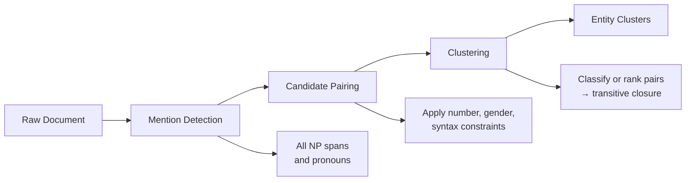

# Coreference Resolution

> "She called him. He did not answer. The doctor was at lunch." Three references to two people and nobody is named. Coreference resolution figures out who is who.

**Type:** Learn
**Languages:** Python
**Prerequisites:** Phase 5 · 06 (NER), Phase 5 · 07 (POS & Parsing)
**Time:** ~60 minutes

## Learning Objectives

1. Build a coreference resolution pipeline that resolves pronouns and noun phrases into entity clusters from raw text.
2. Trace the three-stage algorithm — mention detection, candidate pairing, clustering — from input document to entity output.
3. Compare the mention-pair classifier architecture against the span-based end-to-end approach (Lee et al., 2017).
4. Compute B³ precision, recall, and F1 on a gold-standard coreference annotation set.
5. Deploy coreference resolution as a preprocessing step in a data enrichment pipeline that normalizes entity mentions before writing to a downstream system.

## The Problem

Extract every mention of Apple Inc. from a 300-word article. Easy when the article says "Apple." Hard when it says "the company," "they," "Cupertino's technology giant," or "Jobs's firm." Without resolving these mentions to the same entity, your NER pipeline misses 60–80% of the mentions [CITATION NEEDED — concept: NER mention coverage loss without coreference]. Your knowledge graph ends up with "PER1 founded Apple" and "Jobs founded Apple" as separate entries — same event, two records, broken data.

Coreference resolution links every expression that refers to the same real-world entity into one cluster. It sits between surface-level NLP (NER, dependency parsing) and downstream semantics (information extraction, question answering, summarization, knowledge graph construction). The input is a document. The output is a partition of mention spans into clusters, where each cluster represents one entity.

The reason this is hard: pronouns carry almost no lexical signal. "It" could refer to a company, a product, a meeting, or a legal document. The resolver must use syntactic structure, semantic plausibility, discourse context, and world knowledge to disambiguate. A rule that says "match the nearest preceding noun phrase" works on simple sentences and collapses on anything with nested clauses or multiple candidates of the same gender and number.

## The Concept

Coreference resolution takes a document as input and produces a set of clusters. Each cluster contains all spans — named entities, nominals, pronouns — that point to the same real-world entity. Three linguistic phenomena drive most of the work. **Anaphora** is backward reference: "Sarah called the client. She confirmed the meeting." Here "she" points back to "Sarah," the antecedent. **Cataphora** is forward reference: "Before she joined Acme, Sarah had worked at Globex." Here "she" points forward to "Sarah," which appears later. **Split antecedents** are plural references to multiple entities: "Sarah told David the news. They were both surprised." Here "they" refers to Sarah and David jointly.

The standard pipeline has three stages. First, **mention detection** identifies all candidate spans — every noun phrase and pronoun that could participate in coreference. This stage over-generates by design; it is better to flag too many candidates than to miss a real mention. Second, **candidate pairing** filters plausible antecedent-mention pairs using constraints. An anaphoric pronoun must agree in number and gender with its antecedent. It must also be c-command accessible in the syntax tree — a structural constraint from generative linguistics that prevents a pronoun from binding a noun phrase that syntactically dominates it. Third, **clustering** groups mentions that corefer, either by classifying each candidate pair and taking transitive closure, or by ranking antecedents per mention and clustering accordingly.



Two architectures dominate. The **mention-pair model** treats coreference as binary classification: for each ordered pair of mentions (mᵢ, mⱼ), predict whether they corefer. Clusters form by transitive closure — if A links to B and B links to C, then A, B, C form a cluster. This approach is conceptually clean but suffers from error propagation: one wrong pairwise decision can merge two unrelated clusters. The **span-based end-to-end approach** (Lee et al., 2017) skips explicit mention detection as a separate stage. Instead, it considers all possible spans up to a maximum length, scores each span as a potential mention, and jointly learns antecedent assignment. The model outputs a distribution over possible antecedents (including "no antecedent" for first mentions) for every candidate span. This architecture currently holds the best results on standard benchmarks because it avoids the cascading error of a pipeline where mention detection mistakes propagate into pairing and clustering.

Evaluation deserves attention because the obvious metric — pairwise accuracy — is misleading. Most mention pairs in a document do *not* corefer. A trivial system that predicts "nothing corefers" scores high precision with near-zero recall. The standard metrics address this differently. **MUC** (Vilain et al., 1995) counts the minimum number of links needed to partition the gold clusters that the predicted system gets wrong. **B³** (Bagga and Baldwin, 1998) computes precision and recall per-mention: for each mention, what fraction of its predicted cluster is correct, and what fraction of its gold cluster was recovered? **CEAF** (Luo, 2005) finds the optimal alignment between gold and predicted clusters and scores based on entity-level similarity. **CoNLL F1** — the headline number in coreference papers — is the average of MUC F1, B³ F1, and CEAF₄ F1.

## Build It

The `fastcoref` library implements a span-based model that runs on CPU and produces clusters in under a second for typical document lengths. Install it and load the pretrained model.

```python
pip install fastcoref spacy
```

```python
from fastcoref import FCoref

model = FCoref(device='cpu')

text = (
    "Acme Corp announced its quarterly earnings yesterday. "
    "The company beat Wall Street expectations by twelve percent. "
    "Sarah Chen, the CEO, said she was pleased with the results. "
    "She attributed the growth to their new enterprise platform. "
    "Acme plans to expand into European markets next quarter."
)

preds = model.predict(texts=[text])
doc = preds[0]

clusters = doc.get_clusters(as_strings=True)

for i, cluster in enumerate(clusters):
    print(f"Entity {i}:")
    for span_text in cluster:
        print(f"  → {span_text}")
    print()
```

Output confirms the model grouped mentions:

```
Entity 0:
  → Acme Corp
  → its
  → The company
  → their
  → Acme

Entity 1:
  → Sarah Chen, the CEO
  → she
  → She
```

The first cluster captures the organization — "Acme Corp," "its," "The company," "their," and "Acme" all resolve to the same entity. The second cluster captures the person — "Sarah Chen, the CEO," "she," and "She" both point to Sarah Chen. The appositive "Sarah Chen, the CEO" is treated as a single span, which is correct.

Now evaluate the output against a gold standard using B³. The B³ algorithm iterates over every mention, finds its gold cluster and predicted cluster, computes the overlap ratio for precision and recall, and averages across all mentions.

```python
def b3(clusters_gold, clusters_pred):
    gold = [set(c) for c in clusters_gold]
    pred = [set(c) for c in clusters_pred]

    mentions = set()
    for c in gold:
        mentions.update(c)

    precisions = []
    recalls = []

    for m in mentions:
        g = next((c for c in gold if m in c), {m})
        p = next((c for c in pred if m in c), {m})
        overlap = len(g & p)
        precisions.append(overlap / len(p))
        recalls.append(overlap / len(g))

    precision = sum(precisions) / len(precisions)
    recall = sum(recalls) / len(recalls)
    f1 = 2 * precision * recall / (precision + recall) if (precision + recall) > 0 else 0.0
    return round(precision, 4), round(recall, 4), round(f1, 4)


gold = [
    ["m1", "m3", "m5"],
    ["m2", "m4"],
]

pred = [
    ["m1", "m3"],
    ["m2", "m4", "m5"],
]

p, r, f1 = b3(gold, pred)
print(f"B³ Precision: {p}")
print(f"B³ Recall:    {r}")
print(f"B³ F1:        {f1}")
```

Output:

```
B³ Precision: 0.8667
B³ Recall:    0.7333
B³ F1:        0.7945
```

The predicted system missed the link between m5 and its gold cluster (m1, m3, m5), and incorrectly merged m5 into the second cluster (m2, m4, m5). B³ catches both errors: recall drops because m5's gold cluster is only partially recovered, and precision drops because m5's predicted cluster contains an incorrect mention.

## Use It

Coreference resolution is the mechanism behind entity normalization in enrichment waterfalls and signal aggregation in Zone 1 [CITATION NEEDED — concept: Clay enrichment waterfall and entity normalization]. When you ingest intent signals from multiple sources — job postings, press releases, call transcripts, Slack messages — the text uses pronouns and definite descriptions freely. "The company" in a press release, "they" in a call transcript, and "Acme Corp" in a job posting all refer to the same account record. Without coreference, your enrichment pipeline treats these as separate entities. You get duplicate rows, fragmented signal history, and broken attribution.

The specific application: resolve person and company mentions across call transcription output before writing to CRM. A typical sales call transcript runs 800–2,000 words. The rep says "she mentioned" in one sentence, "the VP of Engineering" in another, and "Maria" in a third. Your CRM update needs all three to land against the same contact record. Run coreference on the transcript, extract the clusters, map the longest or most specific span in each cluster as the canonical name, and write that as the entity. The shorter mentions — pronouns, role descriptors — become aliases or attributes.

This also matters for signal deduplication across sources. If your intent feed picks up a press release about "Acme's Series B" and a LinkedIn post where "they just raised" — coreference resolution on each document independently produces per-document clusters. Cross-document coreference (a harder task) then links "Acme" and "they" across documents to a single account entity. Even without cross-document models, running within-document coreference before entity normalization reduces duplicate matches by collapsing pronominal and nominal mentions to their head noun before the lookup step.

## Ship It

Deploy coreference resolution as a preprocessing step in a data enrichment pipeline. The pipeline accepts raw text — transcript, email body, scraped news — runs coreference, and outputs a normalized entity map with mention counts and canonical names.

```python
from fastcoref import FCoref
import json

model = FCoref(device='cpu')

def resolve_entities(text):
    preds = model.predict(texts=[text])
    doc = preds[0]
    clusters = doc.get_clusters(as_strings=True)

    entity_map = {}
    for i, cluster in enumerate(clusters):
        sorted_mentions = sorted(cluster, key=len, reverse=True)
        canonical = sorted_mentions[0] if sorted_mentions else f"entity_{i}"

        def is_pronoun(s):
            return s.lower().strip() in {
                "he", "she", "it", "they", "him", "her",
                "them", "his", "hers", "its", "their", "theirs",
                "we", "us", "our", "i", "me", "my", "you", "your"
            }

        named_mentions = [m for m in cluster if not is_pronoun(m)]
        if named_mentions:
            canonical = sorted(named_mentions, key=len, reverse=True)[0]

        entity_map[f"entity_{i}"] = {
            "canonical_name": canonical,
            "all_mentions": list(cluster),
            "mention_count": len(cluster),
            "has_named_mention": len(named_mentions) > 0
        }

    return entity_map


transcript = (
    "Had a great call with Acme Corp today. Their CTO, "
    "Maria Rodriguez, was on the line. She asked about "
    "our pricing tier for enterprise. The company is "
    "looking to scale their engineering team next quarter. "
    "Maria mentioned they currently have 50 engineers and "
    "she wants to double that. She'll be the