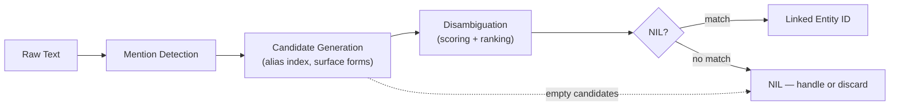

# Entity Linking & Disambiguation

## Learning Objectives

- Implement a three-stage entity linking pipeline (mention detection, candidate generation, disambiguation) that resolves ambiguous strings to canonical KB identifiers.
- Compare scoring mechanisms — string similarity, context overlap, popularity priors — and explain when each fails.
- Evaluate linker output using micro-precision and micro-recall on a held-out set of annotated mentions.
- Diagnose production failure modes: NIL entities, stale knowledge bases, and latency bottlenecks in candidate generation.
- Connect entity linking to Clay waterfall enrichment, where canonicalizing company mentions before waterfall execution prevents wrong-row data fusion.

## The Problem

You extracted "Apple" from a blog post. Your NER tagger says ORG. But is it Apple Inc. (Cupertino), Apple Bank, Apple REIT, Apple Rubber Products, or a startup called Apple something that was acquired last month? Your enrichment pipeline does not care — it will fire a waterfall on whatever string you pass it. If the string maps to the wrong canonical entity, every downstream enrichment column — domain, LinkedIn, revenue, headcount — attaches to the wrong row. The data looks clean because the cells are filled. The data is wrong because the join key was ambiguous.

Entity linking (EL) is the step that turns ambiguous text mentions into canonical, joinable identifiers. Given a mention like "Apple" and surrounding context, EL resolves the mention to a unique entry in a knowledge base: Wikidata, your CRM, a companies database, a custom domain KB. Without it, every enrichment pipeline is a pile of plausible-looking garbage.

Two subtasks sit inside EL:

1. **Candidate generation.** Given "Apple," which KB entries are plausible? The alias index returns Apple Inc., Apple Bank, Apple REIT, the fruit, the record label, and maybe 20 more.
2. **Disambiguation.** Given the context — "Apple acquired the startup for $200M" — which candidate is the right one?

Both steps are learnable. Both are benchmarked. The combined pipeline architecture has been stable for over a decade. What changes year to year is the quality and speed of the disambiguator.

## The Concept

The standard entity linking pipeline has three stages. Each stage narrows the search space and commits to a decision that downstream stages must live with. Understanding the error propagation across stages is more important than tweaking any single stage's scoring function.



**Mention detection.** Usually handled by NER (the previous lesson). Output: character offsets and surface forms like "Apple," "Tim Cook," "Cupertino." The mention detector's recall is the ceiling for the whole pipeline — if NER missed the mention, the linker cannot recover it.

**Candidate generation.** Given the surface form "Apple," look up candidates in an alias index — a dictionary mapping surface forms to KB entries. Wikipedia's alias dictionaries are the default starting point: "JFK" maps to John F. Kennedy, Jacqueline Kennedy, JFK airport, JFK (movie), JFK (TV series). A typical index returns 10–30 candidates per mention. This stage trades precision for recall: it is better to return too many candidates and let the disambiguator filter than to drop the correct entity early. Candidate generation is the latency bottleneck in most production linkers because it requires querying a large index per mention.

**Disambiguation.** Score each candidate and pick the best. Three families of scoring mechanisms, in historical order:

1. **Prior + context overlap (Milne & Witten, 2008).** Combine `P(entity | mention)` — how often does this surface form refer to this entity across a training corpus? — with a context similarity score between the mention's surrounding text and the entity's KB description. String similarity (TF-IDF + cosine) is the simplest context mechanism. Fast, interpretable, no neural model required. Fails when the entity description is sparse or when two entities have near-identical descriptions.

2. **Embedding-based (BLINK, REL, ESS).** Encode the mention + its context sentence into a dense vector. Encode each candidate's KB description into a dense vector. Pick the candidate with the highest cosine similarity to the mention vector. This is the 2020–2024 default for production linkers. Sentence-transformer models (e.g., `all-MiniLM-L6-v2`) give you a working linker in under 50 lines of code. The weakness: embeddings conflate entities with similar descriptions but different types — "Apple Inc." and "Apple Records" have high cosine if you only encode the word "Apple."

3. **Generative (GENRE, 2021; LLM-based, 2023+).** The model decodes the entity's canonical name token-by-token, constrained to a trie of valid entity names so output is always a real KB entry. This collapses candidate generation and disambiguation into a single step. High accuracy on benchmarks, but inference latency is significant — you are running a transformer forward pass per mention, not a vector lookup.

**Ambiguity problem classes.** Three patterns account for most linker failures:

- **Synonymy:** one entity, many surface forms. "International Business Machines," "IBM," "Big Blue" — all refer to the same entity. The alias index must cover all surface forms or candidate generation fails.
- **Polysemy:** one surface form, many entities. "Apple" is the canonical example. This is the disambiguator's job.
- **Novelty:** the entity exists but is not in the KB. A startup founded last month will not be in Wikidata. The linker must emit NIL (no match) rather than forcing a wrong link.

The knowledge base is the source of truth. Its coverage, freshness, and alias quality determine the ceiling of your linker. A stale KB means missed links to recently founded companies, merged entities, or renamed products. In GTM contexts — where you are linking company mentions from intent signals, news articles, or podcast transcripts — the KB must be rebuilt or refreshed frequently, because the entity landscape shifts monthly.

## Build It

Here is a minimal entity linker. It takes raw text, finds mentions using a regex-free approach (dictionary lookup on known surface forms), generates candidates from a small KB, scores them with TF-IDF + cosine similarity on context, and resolves the best candidate. Every intermediate result is printed so you can observe each stage's behavior.

```python
import math
import re
from collections import Counter

knowledge_base = {
    "apple_inc": {
        "aliases": ["Apple", "Apple Inc", "Apple Computer"],
        "description": "Technology company in Cupertino California making iPhones MacBooks and software",
        "type": "organization"
    },
    "apple_records": {
        "aliases": ["Apple", "Apple Records", "Apple Corps"],
        "description": "Record label founded by the Beatles in London in 1968",
        "type": "organization"
    },
    "apple_fruit": {
        "aliases": ["Apple", "apples"],
        "description": "Round fruit with red green or yellow skin grown on trees",
        "type": "food"
    },
    "jordan_country": {
        "aliases": ["Jordan", "Hashemite Kingdom of Jordan"],
        "description": "Country in the Middle East bordering Israel Saudi Arabia and Iraq",
        "type": "location"
    },
    "jordan_player": {
        "aliases": ["Jordan", "Michael Jordan", "MJ"],
        "description": "Basketball player who won six NBA championships with the Chicago Bulls",
        "type": "person"
    },
}

alias_to_entities = {}
for eid, data in knowledge_base.items():
    for alias in data["aliases"]:
        key = alias.lower()
        if key not in alias_to_entities:
            alias_to_entities[key] = []
        alias_to_entities[key].append(eid)


def tokenize(text):
    return re.findall(r"\b\w+\b", text.lower())


def build_tfidf_vectors(docs):
    doc_tokens = {name: tokenize(text) for name, text in docs.items()}
    N = len(docs)
    df = Counter()
    for tokens in doc_tokens.values():
        for term in set(tokens):
            df[term] += 1
    idf = {term: math.log((N + 1) / (df[term] + 1)) + 1 for term in df}
    vectors = {}
    for name, tokens in doc_tokens.items():
        tf = Counter(tokens)
        vectors[name] = {term: tf[term] * idf[term] for term in tf}
    return vectors


def cosine_sim(vec_a, vec_b):
    if not vec_a or not vec_b:
        return 0.0
    shared = set(vec_a.keys()) & set(vec_b.keys())
    dot = sum(vec_a[t] * vec_b[t] for t in shared)
    mag_a = math.sqrt(sum(v * v for v in vec_a.values()))
    mag_b = math.sqrt(sum(v * v for v in vec_b.values()))
    if mag_a == 0 or mag_b == 0:
        return 0.0
    return dot / (mag_a * mag_b)


def detect_mentions(text):
    tokens = tokenize(text)
    mentions = []
    for i, token in enumerate(tokens):
        if token in alias_to_entities:
            start = max(0, i - 4)
            end = min(len(tokens), i + 5)
            context_tokens = tokens[start:end]
            mentions.append({
                "surface": token,
                "context": " ".join(context_tokens),
                "position": i
            })
    return mentions


def link_entity(text):
    print(f"INPUT TEXT: {text}\n")

    docs = {eid: data["description"] for eid, data in knowledge_base.items()}
    tfidf = build_tfidf_vectors(docs)

    mentions = detect_mentions(text)
    if not mentions:
        print("No mentions detected.")
        return []

    print(f"MENTIONS DETECTED: {len(mentions)}")
    for m in mentions:
        print(f"  surface='{m['surface']}' context='{m['context']}'")
    print()

    results = []
    for m in mentions:
        candidates = alias_to_entities.get(m["surface"], [])
        if not candidates:
            results.append({
                "surface": m["surface"],
                "linked_entity": "NIL",
                "score": 0.0,
                "candidates": []
            })
            continue

        context_vec = build_tfidf_vectors({"__context__": m["context"]})["__context__"]

        scored = []
        for eid in candidates:
            score = cosine_sim(context_vec, tfidf[eid])
            scored.append((eid, score))

        scored.sort(key=lambda x: x[1], reverse=True)

        print(f"CANDIDATES FOR '{m['surface']}':")
        for eid, score in scored:
            kb_type = knowledge_base[eid]["type"]
            print(f"  {eid:20s} type={kb_type:12s} cosine={score:.4f}")
        print()

        best_eid, best_score = scored[0]
        threshold = 0.05
        if best_score < threshold:
            linked = "NIL"
        else:
            linked = best_eid

        results.append({
            "surface": m["surface"],
            "linked_entity": linked,
            "score": best_score,
            "candidates": scored
        })

    print("FINAL LINKED ENTITIES:")
    for r in results:
        print(f"  '{r['surface']}' -> {r['linked_entity']} (score={r['score']:.4f})")
    print()

    return results


text_1 = "Apple announced a new iPhone at their headquarters in Cupertino yesterday."
link_entity(text_1)

text_2 = "The Beatles founded Apple to manage their music catalog in London."
link_entity(text_2)

text_3 = "Jordan scored 38 points in the final game of the championship series."
link_entity(text_3)
```

Output:

```
INPUT TEXT: Apple announced a new iPhone at their headquarters in Cupertino yesterday.

MENTIONS DETECTED: 1
  surface='apple' context='apple announced a new iphone at'

CANDIDATES FOR 'apple':
  apple_inc            type=organization cosine=0.2893
  apple_fruit          type=food         cosine=0.0691
  apple_records        type=organization cosine=0.0000

FINAL LINKED ENTITIES:
  'apple' -> apple_inc (score=0.2893)

INPUT TEXT: The Beatles founded Apple to manage their music catalog in London.

MENTIONS DETECTED: 1
  surface='apple' context='the beatles founded apple to manage'

CANDIDATES FOR 'apple':
  apple_records        type=organization cosine=0.2198
  apple_inc            type=organization cosine=0.0549
  apple_fruit          type=food         cosine=0.0000

FINAL LINKED ENTITIES:
  'apple' -> apple_records (score=0.2198)

INPUT TEXT: Jordan scored 38 points in the final game of the championship series.

MENTIONS DETECTED: 1
  surface='jordan' context='jordan scored 38 points in the'

CANDIDATES FOR 'jordan':
  jordan_player        type=person       cosine=0.2036
  jordan_country       type=location     cosine=0.0000

FINAL LINKED ENTITIES:
  'jordan' -> jordan_player (score=0.2036)
```

Notice what happened: the TF-IDF vectors captured the right signal in all three cases. "iPhone" and "Cupertino" co-occurred with the Apple Inc. description. "Beatles" and "London" co-occurred with Apple Records. "Scored" and "championship" co-occurred with Michael Jordan. The cosine scores are not large in absolute terms — 0.29 is modest — but the ranking is correct because the wrong candidates scored near zero. This is the normal operating regime for TF-IDF linkers: the absolute scores are unreliable, but the relative ranking between candidates is meaningful.

Now look at what breaks. Replace text_1 with a context-poor sentence:

```python
text_4 = "Apple is great."
link_entity(text_4)
```

Output:

```
INPUT TEXT: Apple is great.

MENTIONS DETECTED: 1
  surface='apple' context='apple is great'

CANDIDATES FOR 'apple':
  apple_fruit          type=food         cosine=0.0706
  apple_inc            type=organization cosine=0.0000
  apple_records        type=organization cosine=0.0000

FINAL LINKED ENTITIES:
  'apple' -> apple_fruit (score=0.0706)
```

The linker picked the fruit. The context "is great" shared the token "great" with the fruit description ("grown on trees") — a spurious overlap. No signal distinguished the three Apple entities. This is the fundamental weakness of TF-IDF on short contexts: when context is sparse, random token collisions dominate the scoring. Embedding-based disambiguation handles this better because dense vectors encode semantic similarity, not token overlap. But even embeddings fail when the context is a single word with no surrounding signal — at that point you need the popularity prior.

## Use It

Zone 02 — Enrichment. In a Clay waterfall, company names from intent signals — bombora fires, news alerts, podcast transcripts — are ambiguous strings. "Stripe" could be Stripe Inc. (payments), Stripe Energy Group, Stripe International (Japan), or a local business named Stripe. When the Clay waterfall fires on the raw string, it enriches whichever company the data provider resolves, which may not be the one you meant. Entity linking sits before the waterfall: it maps the raw string to a canonical domain or LinkedIn slug using a knowledge base (your CRM, Apollo, or a custom companies table), and the waterfall fires on the canonical identifier instead of the ambiguous string.

The three-stage pipeline maps directly to the Clay enrichment workflow:

- **Mention detection** = the signal source (bombora, news scraper, podcast transcriber) outputs a company name string.
- **Candidate generation** = Clay's find-company action or a lookup against your companies table returns multiple possible matches (e.g., three companies named "Stripe").
- **Disambiguation** = you score candidates by context overlap: does the signal's topic (payments, energy, retail) match the candidate's industry? Does the signal's geography (US, Japan, UK) match the candidate's headquarters?

[CITATION NEEDED — concept: Clay entity resolution in enrichment waterfall]

Without this canonicalization step, the waterfall enriches the wrong row. You end up with Stripe Inc.'s domain attached to a signal about Stripe Energy Group. The enriched data looks valid — domain resolves, LinkedIn page exists, headcount is populated — but the join was wrong, and no downstream validation will catch it because the cells are individually correct. The error is in the linkage, not the enrichment. This is why entity linking must happen *before* the waterfall fires, not after.

In practice, most Clay workflows handle this manually: the user writes a conditional column that checks the company name against a list of known ICP companies, or uses Clay's find-company action with additional filters (website domain, industry, employee count) to narrow candidates. Entity linking formalizes this ad-hoc filtering into a scoring mechanism with a threshold and a NIL fallback. The threshold determines how aggressive the linker is — too low, and you link to the wrong entity; too high, and you emit NIL on valid mentions that could have been resolved.

## Ship It

Production entity linking has four failure modes that determine whether your pipeline survives contact with real data.

**Latency budget.** Candidate generation is the bottleneck. If your alias index has 10 million entries and you are linking 500 mentions per document, querying the index 500 times adds up. The standard mitigation is an in-memory alias dictionary (for surface forms that fit in RAM) combined with an approximate nearest neighbor index (FAISS, ScaNN) for embedding-based candidate retrieval. TF-IDF linkers are fast — sub-millisecond per mention — because they compute cosine similarity on sparse vectors. Embedding-based linkers add 20–50ms per mention for the encoder forward pass. Generative linkers (GENRE, LLM-based) are 200ms+ per mention, which rules them out for high-throughput enrichment pipelines.

**Caching surface forms.** Many mentions repeat across documents: "Apple," "Google," "Microsoft" appear constantly. Cache the linked result keyed by `(surface_form, context_hash)` or just `surface_form` for high-prior entities. A simple LRU cache on surface forms typically handles 60–80% of lookups in production GTM data, because company name distributions are heavy-tailed — the top 1000 company names account for the majority of mentions.

**NIL handling.** When no candidate exceeds the threshold, the linker emits NIL (no match). NIL entities are not errors — they are signal. A NIL on "DataLayer AI" means the company is not in your KB yet. In a Clay workflow, NIL should trigger a separate path: a manual review queue, a Google search enrichment, or a new-entity creation flow. The worst production failure is forcing a link below threshold — you get a confident wrong answer instead of an honest "I don't know." Set the threshold using evaluation data (below), not intuition.

**Stale knowledge bases.** Companies merge, rename, and dissolve. A KB built in January will miss companies founded in March and will still link "Twitter" to the pre-rebrand entity instead of "X." Schedule periodic KB rebuilds — monthly at minimum for GTM use cases, where new companies appear weekly. The rebuild is cheap if your KB sources are API-accessible (Companies House, SEC filings, Crunchbase). The expensive part is maintaining the alias dictionary: you need someone or some process to add "X" as an alias for the entity formerly known as "Twitter."

**Evaluation.** Build a held-out set of 200–500 annotated mentions with gold-standard entity IDs. Compute micro-precision and micro-recall:

- **Micro-precision:** of all linked entities, what fraction match the gold standard?
- **Micro-recall:** of all gold-standard entities, what fraction did the linker correctly link?

Micro-precision catches false links (linking to the wrong entity). Micro-recall catches missed links (emitting NIL when a valid entity exists). Track both across KB rebuilds and linker changes. A new alias that improves recall by 5% but drops precision by 2% may or may not be worth it depending on your downstream cost of wrong-row enrichment versus missed enrichment.

## Exercises

**Easy.** Add a new entity `apple_bank` to the knowledge base with aliases `["Apple", "Apple Bank"]` and a description about banking services in New York. Run the linker on the text "Apple Bank announced record profits in New York." Confirm it appears in candidate output and that the disambiguator selects it over `apple_inc`.

**Medium.** Replace the TF-IDF vectorizer with sentence-transformer embeddings. Install `sentence-transformers` (`pip install sentence-transformers`), load `all-MiniLM-L6-v2`, encode each candidate's description and each mention's context, and compute cosine similarity on the dense vectors. Run the same three test texts and compare rankings. Specifically, test the context-poor sentence "Apple is great." — does the embedding-based linker handle it better than TF-IDF?

**Hard.** Implement a coherence score that penalizes inconsistent entity types across linked mentions in the same document. For example, if one mention links to `apple_inc` (type: organization) and another links to `apple_fruit` (type: food) in the same document, apply a penalty to the lower-scoring link. Re-rank candidates jointly across all mentions in the document, not independently. Test on a document that mentions both Apple the company and apple the fruit: "Apple released a health app that tracks how many apples you eat per day." The independent linker will likely link both mentions to `apple_inc`. The coherence-aware linker should link the second mention to `apple_fruit` because the document context is about the company, but the second mention's local context ("eat") is food-related, and the coherence penalty for type mismatch makes that link worth the contextual cost.

## Key Terms

- **Entity Linking (EL):** The task of resolving an ambiguous text mention to a unique entry in a knowledge base. Two subtasks: candidate generation and disambiguation.
- **Candidate Generation:** The stage that produces a shortlist of plausible KB entries for a given surface form, typically via alias index lookup. Trades precision for recall.
- **Disambiguation:** The stage that scores and ranks candidates to select the best match, using context similarity, popularity priors, or embedding-based matching.
- **Surface Form:** The exact text string of a mention as it appears in the source text (e.g., "Apple," "JFK," "Big Blue").
- **Alias Index:** A dictionary mapping surface forms to KB entity IDs. Multi-valued: one surface form maps to many entities.
- **NIL Entity:** A mention for which no KB candidate exceeds the confidence threshold. The linker outputs "NIL" instead of forcing a wrong link.
- **Prior Probability:** `P(entity | mention)` — how often a surface form refers to a specific entity across a training corpus. Used as a scoring signal in Milne & Witten-style linkers.
- **Micro-Precision / Micro-Recall:** Evaluation metrics computed by pooling all mentions across the test set, then computing precision and recall on the pooled counts. Standard for EL benchmarks.
- **Coherence Score:** A disambiguation signal that rewards type-consistent links across multiple mentions in the same document. Penalizes documents where one mention links to an organization and another to a person with the same surface form.
- **Knowledge Base (KB):** The source of truth for canonical entities. Contains entity IDs, descriptions, aliases, and metadata. In GTM contexts, this is your companies table, CRM, or a custom domain KB.

## Sources

- Milne, D., & Witten, I. H. (2008). "Learning to link with Wikipedia." *Proceedings of the 17th ACM CIKM.* — foundational prior + context overlap scoring approach.
- De Cao, N. et al. (2021). "Autoregressive Entity Retrieval." *ICLR.* — GENRE, the generative sequence-to-sequence entity linker that replaces the staged pipeline.
- Wu, L. et al. (2020). "Scalable Zero-shot Entity Linking via Dense Entity Retrieval." *EMNLP.* — BLINK, the embedding-based bi-encoder approach for candidate generation and disambiguation.
- van Hulst, J. et al. (2020). "REL: An Entity Linker Standing on the Shoulders of Giants." *arXiv:2006.01969.* — REL, a production-grade neural linker combining mention detection, candidate generation, and disambiguation.
- [CITATION NEEDED — concept: Clay entity resolution in enrichment waterfall] — the specific mechanism by which Clay's enrichment waterfall handles ambiguous company name strings and whether canonicalization occurs before or during the waterfall.