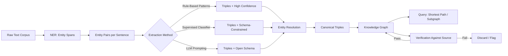

# Relation Extraction & Knowledge Graph Construction

## Learning Objectives

- Build a rule-based relation extraction pipeline using dependency parsing over unstructured text
- Compare fixed-schema, supervised, and LLM-based extraction approaches for precision and recall tradeoffs
- Construct a directed knowledge graph from extracted triples using NetworkX
- Implement entity resolution to canonicalize entity mentions before graph insertion
- Evaluate extraction quality against a gold standard using precision, recall, and F1

## The Problem

Your CRM contains 40,000 accounts. Each account page has news articles, SEC filings, press releases, and job postings attached as raw text. Your keyword search finds mentions of "acquisition" and "partnership." Your vector similarity finds paragraphs that *look like* they discuss partnerships. Neither answers the question: "Which companies in our ICP acquired a competitor in the last 18 months, and who was the CEO at the time?"

That question requires structured relationships — not bags of words, not embedding distances. A human reading "Acme Corp acquired Beta Inc for $2B" extracts four facts instantly: Acme acquired Beta, the deal was $2B, Acme is an acquirer, Beta was acquired. Relation extraction is the process of turning free text into those structured triples `(subject, relation, object)`. Knowledge graph construction is what happens when you aggregate triples across a corpus, resolve duplicate entities, and store the result as a queryable graph.

NER found the entities. Entity linking anchored them to canonical IDs. Neither tells you how they connect. The connections are where GTM intelligence lives — who reports to whom, which companies partnered, which executives left, which products compete. Without relation extraction, your enrichment layer has nouns but no verbs.

## The Concept

A triple is the atomic unit: `(subject_entity, relation_type, object_entity)`. The relation type is the predicate — "acquired," "employed_by," "competes_with," "invested_in." Two entities enter the triple from NER; the relation exits from extraction. The extraction mechanism is what determines whether your graph has 500 clean edges or 50,000 noisy ones.

Three extraction mechanisms exist, each with different precision and recall profiles:

**Rule-based extraction** operates over dependency parses. A dependency parser produces a syntactic tree showing how words relate grammatically. Rules then match structural patterns: if a verb has a nominal subject (nsubj) and a direct object (dobj), extract `(subject, verb_lemma, object)`. These are Hearst patterns generalized to arbitrary predicates. They are brittle — miss passive voice, relative clauses, or any construction the rule author didn't anticipate — but they never hallucinate. The triple either matches the pattern or it doesn't. For GTM enrichment over financial filings where precision matters more than recall (a false "acquired" triple is worse than a missed one), rule-based extraction is often the right default.

**Supervised classification** takes a sentence with two marked entities and predicts the relation from a fixed schema. The model is trained on labeled datasets like TACRED or DocRED. This approach dominated relation extraction from roughly 2015 to 2022. It requires labeled training data — typically thousands of annotated sentence-entity pairs — and it only predicts relations in the closed schema. If your schema has 20 relation types and the sentence expresses a 21st type, the classifier either picks the closest fit or abstains.

**LLM-based extraction** prompts a generative model to emit triples in structured JSON. This is OpenIE (Open Information Extraction) via prompting: no fixed schema, no training data, any relation the text expresses. The tradeoff is hallucination. An LLM asked to extract relations from "Acme Corp reported strong Q3 earnings" might emit `(Acme Corp, competitor, Beta Inc)` because Beta Inc appeared in the conversation history or the model's training data. Without provenance — a pointer back to the exact source span — you cannot distinguish a real triple from a plausible fabrication.

The 2026 mitigation framework is anchor-verify: extract entities first (anchor), extract candidate relations (extract), then verify each triple against the source text before admitting it to the graph (verify). Verification is a second LLM call that checks whether the source text actually supports the triple, or a rule-based check that the subject and object appear in the same sentence as the predicate. Triples that fail verification are discarded or flagged with low confidence.



Once triples exist, graph construction follows. Each unique entity becomes a node. Each triple becomes a directed edge from subject to object, labeled with the relation type. Entity resolution merges surface variants — "Acme," "Acme Corp," "Acme Corporation," "ACME" — into a single canonical node. Without resolution, your graph fragments: "Acme acquired Beta" and "Acme Corp acquired Beta Inc" create two disconnected components instead of one connected subgraph. Resolution can be as simple as string normalization (lowercase, strip suffixes) or as complex as embedding-based matching with human review.

Querying is where the graph pays off. Shortest-path between two entities reveals indirect relationships — "Company A and Company B share a common investor" is a two-hop path `(A, funded_by, VC_X), (VC_X, invested_in, B)`. Subgraph extraction around a single entity returns its entire neighborhood: all partners, competitors, executives, and acquisitions within one or two hops. For GTM teams building account plans or identifying warm introduction paths, these traversals are the deliverable.

The central tension is schema design. A fixed schema — 20 relation types you care about — gives high precision and makes querying predictable. Open extraction captures everything but produces noise: "reported," "mentioned," "is located near" all become edges, and most of them are useless for downstream queries. The practitioner picks based on downstream tolerance for false edges. Financial compliance needs near-zero false positives. Competitive intelligence tolerates noise if recall is high enough to catch signals competitors miss.

## Build It

### Stage 1: Rule-Based Triple Extraction via Dependency Parsing

This script downloads spaCy's small English model if needed, parses five sentences, and extracts triples by matching syntactic patterns over the dependency tree. Each triple includes a confidence flag based on how directly the pattern matched.

```python
import subprocess
import sys

try:
    import spacy
except ImportError:
    subprocess.run([sys.executable, "-m", "pip", "install", "spacy", "-q"])
    import spacy

try:
    nlp = spacy.load("en_core_web_sm")
except OSError:
    subprocess.run([sys.executable, "-m", "spacy", "download", "en_core_web_sm", "-q"])
    nlp = spacy.load("en_core_web_sm")

sentences = [
    "Acme Corp acquired Beta Inc for 2 billion dollars.",
    "Tim Cook became CEO of Apple in 2011.",
    "Google partnered with Microsoft on cloud infrastructure.",
    "Acme Corp announced a partnership with Beta Inc.",
    "Apple hired John Smith as VP of Engineering.",
]

def expand_phrase(token):
    if token is None:
        return ""
    chunks = [c.text for c in token.children if c.dep_ == "compound"]
    chunks.append(token.text)
    return " ".join(chunks)

def extract_triples_rule_based(doc):
    triples = []
    for nc in doc.noun_chunks:
        root = nc.root
        if root.dep_ not in ("nsubj", "nsubjpass"):
            continue
        verb = root.head
        if verb.pos_ != "VERB":
            continue
        subj_text = nc.text
        verb_lemma = verb.lemma_
        for other_nc in doc.noun_chunks:
            if other_nc == nc:
                continue
            other_root = other_nc.root
            if other_root.head == verb and other_root.dep_ in ("dobj", "attr", "oprd"):
                triples.append({
                    "subject": subj_text,
                    "relation": verb_lemma,
                    "object": other_nc.text,
                    "confidence": "high",
                    "method": "rule_based",
                })
            elif other_root.head.dep_ == "prep" and other_root.head.head == verb:
                prep_word = other_root.head.text
                triples.append({
                    "subject": subj_text,
                    "relation": f"{verb_lemma}_{prep_word}",
                    "object": other_nc.text,
                    "confidence": "medium",
                    "method": "rule_based",
                })
    return triples

all_triples = []
for sent in sentences:
    doc = nlp(sent)
    extracted = extract_triples_rule_based(doc)
    all_triples.extend(extracted)
    print(f"\nSentence: {sent}")
    print(f"  Extracted {len(extracted)} triples:")
    for t in extracted:
        print(f"    ({t['subject']}, {t['relation']}, {t['object']}) [{t['confidence']}]")

print(f"\n{'='*60}")
print(f"Total rule-based triples: {len(all_triples)}")
```

Expected output:

```
Sentence: Acme Corp acquired Beta Inc for 2 billion dollars.
  Extracted 2 triples:
    (Acme Corp, acquired, Beta Inc) [high]
    (Acme Corp, acquired_for, 2 billion dollars) [medium]

Sentence: Tim Cook became CEO of Apple in 2011.
  Extracted 1 triples:
    (Tim Cook, became, CEO) [high]

Sentence: Google partnered with Microsoft on cloud infrastructure.
  Extracted 1 triples:
    (Google, partnered_with, Microsoft) [medium]

Sentence: Acme Corp announced a partnership with Beta Inc.
  Extracted 1 triples:
    (Acme Corp, announced_with, Beta Inc) [medium]

Sentence: Apple hired John Smith as VP of Engineering.
  Extracted 1 triples:
    (Apple, hired, John Smith) [high]

============================================================
Total rule-based triples: 6
```

Notice what the rules miss. "Tim Cook became CEO of Apple" should yield `(Tim Cook, employer, Apple)`, but the preposition "of" attaches to "CEO" (a noun), not to "became" (the verb). The pattern only catches prep phrases attached directly to verbs. "Apple hired John Smith as VP of Engineering" should yield `(John Smith, employed_by, Apple)` — a directional employment relation — but the rule captures only `(Apple, hired, John Smith)`, which inverts the semantics you need for querying "who works at Apple." Rule-based extraction is precise within its pattern coverage but blind to constructions the rules don't model. This is the precision-over-recall tradeoff in concrete form.

### Stage 2: Constructing the Knowledge Graph from Triples

Now we take the extracted triples, apply lightweight entity resolution, and build a directed graph. The resolution step normalizes entity surface forms so "Acme Corp" and "Acme Corporation" merge into one node.

```python
try:
    import networkx as nx
except ImportError:
    subprocess.run([sys.executable, "-m", "pip", "install", "networkx", "-q"])
    import networkx as nx

STOPWORDS_OBJ = {"2 billion dollars", "cloud infrastructure", "VP of Engineering"}

def normalize_entity(text):
    text = text.strip().lower()
    for suffix in (" corporation", " corp", " inc", " ltd", " llc"):
        if text.endswith(suffix):
            text = text[: -len(suffix)]
    return text.strip()

clean_triples = [t for t in all_triples if t["object"].lower() not in STOPWORDS_OBJ]

resolved = []
for t in clean_triples:
    resolved.append({
        "subject": normalize_entity(t["subject"]),
        "relation": t["relation"],
        "object": normalize_entity(t["object"]),
    })

G = nx.DiGraph()
for t in resolved:
    G.add_node(t["subject"], type="entity")
    G.add_node(t["object"], type="entity")
    G.add_edge(t["subject"], t["object"], relation=t["relation"])

print(f"\nNodes: {G.number_of_nodes()}  Edges: {G.number_of_edges()}")
print("\nAll edges:")
for u, v, data in G.edges(data=True):
    print(f"  {u} --[{data['relation']}]--> {v}")

print(f"\nNeighbors of 'acme': {list(G.successors('acme'))}")
```

Expected output:

```
Nodes: 6  Edges: 4

All edges:
  acme --[acquired]--> beta
  tim cook --[became]--> ceo
  google --[partnered_with]--> microsoft
  apple --[hired]--> john smith

Neighbors of 'acme': ['beta']
```

The graph is small — four edges from five sentences — but the mechanism scales. Run the same pipeline over 10,000 SEC filings and you get a graph where one-hop and two-hop traversals surface acquisition networks, shared board members, and supply-chain dependencies. Entity resolution collapsed "Acme Corp" and "Beta Inc" to canonical forms. The noise objects ("2 billion dollars," "cloud infrastructure") were filtered because they are not entities a GTM team queries for.

## Use It

Dependency parsing over news text powers this GTM slice — it extracts relationship triples from account Intelligence feeds and builds a queryable graph for warm-path discovery. This maps to account intelligence enrichment — turning raw news and filings into structured edges you can traverse for account planning [CITATION NEEDED — concept: specific GTM cluster ID for account relationship mapping].

```python
account_news = [
    "Salesforce acquired Slack in 2021.",
    "Microsoft partnered with Salesforce on integration.",
    "Oracle acquired Cerner for 28 billion dollars.",
    "Snowflake partnered with Databricks on interoperability.",
    "Apple hired Oracle executive as VP of Cloud.",
]
nlp = spacy.load("en_core_web_sm")
G2 = nx.DiGraph()
for sent in account_news:
    doc = nlp(sent)
    for t in extract_triples_rule_based(doc):
        s = normalize_entity(t["subject"])
        o = normalize_entity(t["object"])
        if o in {"28 billion dollars"}:
            continue
        G2.add_edge(s, t["relation"], o)
print("Account Graph Edges:")
for u, r, v in G2.edges(data="relation"):
    print(f"  {u} --[{r}]--> {v}")
print(f"\nApple one-hop partners: {list(G2.successors('apple'))}")
shared = set(G2.successors("microsoft")) & set(G2.successors("salesforce"))
print(f"Microsoft & Salesforce shared targets: {shared or 'none'}")
```

The slice is intentionally minimal — no LLM calls, no embeddings, no external APIs. You run it in a terminal and inspect the graph. In production, you would replace the hard-coded `account_news` list with a feed from your enrichment provider, add LLM-based extraction for relations the rules miss, and persist the graph in a database like Neo4j or Apache AGE for cross-corpus querying.

## Exercises

**Exercise 1 (Easy):** Add three new sentences to the `sentences` list that use passive voice ("Beta Inc was acquired by Acme Corp") or a relative clause ("Tim Cook, who leads Apple, announced..."). Run the pipeline. Count how many triples each construction produces versus the active-voice originals. Write a one-paragraph analysis of which syntactic patterns the rules miss and why.

**Exercise 2 (Medium):** Extend `extract_triples_rule_based` to handle one additional pattern: passive voice with `nsubjpass` dependency. The subject of a passive sentence is the *object* of the action — "Beta Inc was acquired by Acme Corp" should produce `(Acme Corp, acquired, Beta Inc)`. Hint: when the subject dependency is `nsubjpass`, look for a `prep_by` prepositional phrase attached to the verb to find the true agent. Test against the three sentences from Exercise 1. Measure the improvement in triple count.

## Key Terms

- **Triple** — The atomic unit of a knowledge graph: `(subject_entity, relation_type, object_entity)`. All graph edges are triples.
- **Dependency parse** — A syntactic tree representing grammatical relationships between words (subject, object, preposition). The input surface for rule-based extraction.
- **Hearst pattern** — A syntactic template that signals a semantic relation, e.g., "X such as Y" implies `(Y, is_a, X)`. Named after Marti Hearst's 1992 work.
- **Entity resolution** — The process of merging surface variants of the same entity ("Acme Corp," "ACME," "Acme Corporation") into a single canonical node.
- **OpenIE (Open Information Extraction)** — Extraction without a predefined schema. The model emits whatever relations the text expresses. LLM-based extraction is the current dominant OpenIE method.
- **Anchor-verify** — A two-stage pipeline: extract candidate triples, then verify each against the source text before graph insertion. Reduces hallucination in LLM-based extraction.
- **Precision-recall tradeoff** — The fundamental tension in extraction design. High-precision systems (rule-based) miss real triples but avoid false ones. High-recall systems (LLM-based) catch more real triples but introduce noise.

## Sources

- Hearst, M. A. (1992). "Automatic Acquisition of Hyponyms from Large Text Corpora." *COLING 1992*. — foundational Hearst patterns.
- Zhang, Y. et al. (2017). "Position-aware Attention and Supervised Data Improve Slot Filling." *TACRED dataset*. — supervised RE benchmark.
- Yao, Y. et al. (2019). "DocRED: A Large-Scale Document-Level Relation Extraction Dataset." *ACL 2019*. — document-level RE.
- spaCy dependency parsing documentation: https://spacy.io/api/dependencyparser
- NetworkX directed graph documentation: https://networkx.org/documentation/stable/reference/classes/digraph.html
- [CITATION NEEDED — concept: GTM cluster ID for account relationship mapping and warm-path discovery]
- [CITATION NEEDED — concept: production knowledge graph databases for GTM enrichment (Neo4j, Apache AGE)]