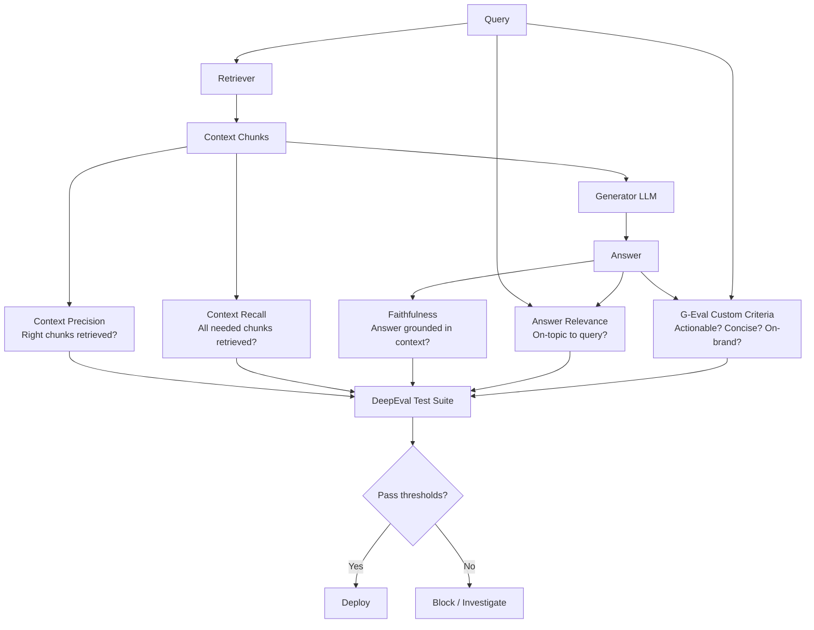

# LLM Evaluation — RAGAS, DeepEval, G-Eval

## Learning Objectives

- Compute RAGAS faithfulness and answer relevance scores on RAG pipeline outputs using LLM-as-judge
- Implement a G-Eval custom metric with chain-of-thought scoring for domain-specific criteria
- Configure DeepEval test cases with threshold-based pass/fail for CI/CD integration
- Compare the three frameworks by running identical GTM sample data through each and interpreting score divergence
- Diagnose evaluation failures — judge bias, scoring variance, and threshold misconfiguration — from observable output

## The Problem

Your RAG pipeline answers: "June 29th, 2007." The gold reference is: "June 29, 2007." Exact Match scores 0. F1 scores ~75%. A human would score 100%. Multiply that gap by 10,000 test cases, then multiply again by every change you make to the retriever, chunking strategy, prompt template, or model version. You need an evaluator that understands semantic equivalence, runs cheaply enough to execute on thousands of samples, does not silently lie about regressions, and surfaces the specific failure modes that matter.

This is the evaluation problem in production. You have built a pipeline that retrieves account intelligence from 10-K filings, earnings transcripts, and news articles, then generates research briefs for SDR outreach. Leadership asks: "Is it any good?" You stare at 200 generated outputs and have no systematic way to answer. Traditional NLP metrics — BLEU, ROUGE, F1 — were designed for translation and summarization benchmarks where surface-level token overlap approximates quality. They break completely when the answer is semantically correct but lexically different, or when the task has no single gold reference.

The production answer is LLM-as-judge: use a language model to score outputs against a rubric. But "use an LLM to judge" is a mechanism, not a framework. You still need to decide what to measure, how to prompt the judge, how to reduce scoring variance, and how to package the whole thing into something your CI pipeline can run on every commit. Three frameworks own different slices of that problem, and this lesson works through all three on the same data.

## The Concept

LLM-as-judge replaces a static metric function with a language model that reads the inputs and outputs of your pipeline, applies a rubric, and returns a score. Given `(query, context, answer)`, you prompt a judge model: "Does this answer contain only information supported by the context? Score 0-1." The judge returns a number. Run this across 1,000 samples and you have a regression suite. At GPT-4o-mini pricing (~$0.003 per scored case), a full regression run costs under $5. The mechanism is cheap enough to run on every change.

The failure modes are what make this hard. LLM judges exhibit **length bias** — they prefer longer answers regardless of quality. They show **self-preference** — GPT-4 judges prefer GPT-4 outputs. They suffer from **position bias** — when comparing two options, they prefer whichever appears first. And they return scores with high variance — the same input scored twice may produce different results. Every framework below implements strategies to mitigate these, but none eliminates them. You calibrate against human ratings and set thresholds that account for noise.



**RAGAS** (Retrieval-Augmented Generation Assessment) decomposes RAG quality into four component metrics, each measuring a specific failure mode. **Faithfulness** checks that every claim in the answer is supported by the retrieved context — this catches hallucination. **Answer relevance** checks that the answer actually addresses the question — this catches deflection. **Context precision** checks whether the retriever surfaced the right chunks, ranked highly — this catches retrieval noise. **Context recall** checks whether the retriever found all necessary information — this catches retrieval gaps. Each metric works by decomposing the answer into individual claims or propositions, then using an LLM judge to verify each one against the context. The decomposition step is what makes faithfulness more reliable than asking "is this answer grounded?" in a single prompt — the judge handles atomic claims, not whole paragraphs.

**G-Eval** is a scoring method, not a framework. It was introduced in the 2023 paper "G-Eval: NLG Evaluation using GPT-4 with Better Human Alignment" by Liu et al. The mechanism has two stages. First, you give an LLM the evaluation criteria and ask it to produce a chain-of-thought — a step-by-step rubric for how to score. Second, you feed the output to be scored along with that CoT rubric and ask the LLM to produce a rating from 1 to 5. Instead of taking the integer rating, G-Eval extracts the token probabilities for each rating token (1, 2, 3, 4, 5) and computes a weighted average. This probabilistic scoring reduces variance — if the judge is 60% confident the answer is a 4 and 30% confident it's a 5, the score is 4.3 rather than flipping a coin. The CoT generation step means you can define custom criteria: "outreach actionability," "technical accuracy," "tone alignment with brand guidelines." G-Eval is framework-agnostic — it works on any text generation task, not just RAG.

**DeepEval** solves the integration problem. It wraps RAGAS-style metrics, G-Eval, and custom metrics into a pytest-like interface. You define test cases as Python objects, attach metrics with thresholds, run a suite, and get structured pass/fail results. DeepEval generates JUnit XML, integrates with CI/CD pipelines, and produces HTML reports. The value is not a new metric — it is the testing scaffolding that makes evaluation a gate rather than an ad-hoc notebook run. You write a test file, run `pytest`, and your pipeline does not deploy if faithfulness drops below 0.85.

## Build It

Install the dependencies. RAGAS and DeepEval both need an LLM backend — this code uses OpenAI, so set your API key first.

```bash
pip install ragas deepeval datasets openai
export OPENAI_API_KEY="your-key-here"
```

### RAGAS: Scoring RAG Component Quality

This script scores five account research briefs using RAGAS faithfulness and answer relevance. The data is hardcoded — a query about a target account, retrieved context chunks from SEC filings, and the generated brief. The faithfulness metric decomposes each answer into claims and checks each claim against the context. Answer relevance checks whether the answer addresses the query.

```python
import os
from datasets import Dataset
from ragas import evaluate
from ragas.metrics import faithfulness, answer_relevancy

os.environ["OPENAI_API_KEY"] = os.environ.get("OPENAI_API_KEY", "")

data = {
    "question": [
        "What is Acme Corp's primary revenue stream?",
        "What is Acme Corp's primary revenue stream?",
        "What is Acme Corp's primary revenue stream?",
        "What is Acme Corp's primary revenue stream?",
        "What is Acme Corp's primary revenue stream?",
    ],
    "answer": [
        "Acme Corp generates revenue primarily through enterprise software licenses, which accounted for 78% of total revenue in fiscal year 2024 according to their 10-K filing.",
        "Acme Corp is a leading technology company that provides innovative solutions to customers worldwide.",
        "Acme Corp's primary revenue stream is enterprise software licenses at 78% of revenue. They also recently acquired DataFlow Inc for $2.1B to expand their AI capabilities.",
        "Acme Corp makes most of its money from software.",
        "Acme Corp generates revenue primarily through enterprise software licenses, representing 78% of FY2024 revenue per their 10-K. The company reported $4.2B in total revenue, a 23% year-over-year increase, with subscription revenue growing at 31%.",
    ],
    "contexts": [[
        "Acme Corp's 10-K filing for fiscal year 2024 reports total revenue of $3.4B, with enterprise software licenses accounting for 78% of that total. The company's cloud services segment grew 18% year-over-year. Acme Corp competes in the enterprise software market alongside Oracle and SAP."
    ]] * 5,
}

dataset = Dataset.from_dict(data)

results = evaluate(
    dataset,
    metrics=[faithfulness, answer_relevancy],
)

print(results)
print("\nPer-sample scores:")
results_df = results.to_pandas()
for i, row in results_df.iterrows():
    print(f"\n  Sample {i}:")
    print(f"    Answer: {row['answer'][:80]}...")
    print(f"    Faithfulness:    {row['faithfulness']:.3f}")
    print(f"    Answer Relevance: {row['answer_relevancy']:.3f}")
```

Run this and observe the output. Sample 0 should score high on both metrics — the answer is grounded in the context and directly addresses the question. Sample 1 should score low on answer relevance — it says nothing about revenue. Sample 2 should score lower on faithfulness — the $2.1B acquisition is not in the context, which is a hallucination signal. Sample 3 is vague but technically grounded. Sample 5 includes a specific revenue figure ($4.2B) that contradicts the context ($3.4B) — faithfulness should catch this.

### G-Eval: Custom Criteria Scoring with DeepEval

G-Eval lets you define criteria that matter for your use case but are not covered by standard RAG metrics. For account research briefs consumed by SDRs, "actionability" is the criterion that matters — does this output contain specific, usable information for outreach? This script scores the same five outputs using a G-Eval custom metric.

```python
import os
from deepeval import assert_test
from deepeval.metrics import GEval
from deepeval.test_case import LLMTestCase, Params

os.environ["OPENAI_API_KEY"] = os.environ.get("OPENAI_API_KEY", "")

actionability_metric = GEval(
    name="Outreach Actionability",
    criteria="Evaluate whether this account research brief contains specific, factual, and usable talking points that a sales development representative could reference in a cold email or call. Consider: Are there concrete numbers? Named initiatives? Specific pain points? Avoid rewarding generic statements.",
    evaluation_params=[Params.INPUT, Params.ACTUAL_OUTPUT],
    strict_mode=False,
    model="gpt-4o-mini",
)

samples = [
    {
        "query": "What is Acme Corp's primary revenue stream?",
        "answer": "Acme Corp generates revenue primarily through enterprise software licenses, which accounted for 78% of total revenue in fiscal year 2024 according to their 10-K filing.",
    },
    {
        "query": "What is Acme Corp's primary revenue stream?",
        "answer": "Acme Corp is a leading technology company that provides innovative solutions to customers worldwide.",
    },
    {
        "query": "What is Acme Corp's primary revenue stream?",
        "answer": "Acme Corp's primary revenue stream is enterprise software licenses at 78% of revenue. They also recently acquired DataFlow Inc for $2.1B to expand their AI capabilities.",
    },
    {
        "query": "What is Acme Corp's primary revenue stream?",
        "answer": "Acme Corp makes most of its money from software.",
    },
    {
        "query": "What is Acme Corp's primary revenue stream?",
        "answer": "Acme Corp generates revenue primarily through enterprise software licenses, representing 78% of FY2024 revenue per their 10-K. The company reported $4.2B in total revenue, a 23% year-over-year increase, with subscription revenue growing at 31%.",
    },
]

for i, sample in enumerate(samples):
    test_case = LLMTestCase(
        input=sample["query"],
        actual_output=sample["answer"],
    )
    actionability_metric.measure(test_case)
    print(f"Sample {i}:")
    print(f"  Answer: {sample['answer'][:80]}...")
    print(f"  G-Eval Actionability Score: {actionability_metric.score:.3f}")
    print(f"  Reason: {actionability_metric.reason}")
    print()
```

The G-Eval output includes a reason string alongside the score — this is the chain-of-thought reasoning the judge produced. Read these reasons. They tell you why the judge scored the way it did, which is more actionable than the number alone. Sample 2 may score high on actionability because the acquisition detail sounds useful, even though RAGAS flagged it as unfaithful. This divergence is the point — different metrics catch different problems.

### DeepEval: Packaging Metrics into a Test Suite

DeepEval wraps both RAGAS-style and G-Eval metrics into test cases with pass/fail thresholds. This script defines a test suite that runs faithfulness (via DeepEval's implementation) and the G-Eval actionability metric, then asserts thresholds.

```python
import os
from deepeval import evaluate
from deepeval.metrics import FaithfulnessMetric, GEval
from deepeval.test_case import LLMTestCase, Params

os.environ["OPENAI_API_KEY"] = os.environ.get("OPENAI_API_KEY", "")

faithfulness_metric = FaithfulnessMetric(
    threshold=0.7,
    model="gpt-4o-mini",
)

actionability_metric = GEval(
    name="Outreach Actionability",
    criteria="Evaluate whether this account research brief contains specific, factual, and usable talking points for sales outreach.",
    evaluation_params=[Params.INPUT, Params.ACTUAL_OUTPUT],
    threshold=0.6,
    strict_mode=False,
    model="gpt-4o-mini",
)

context = (
    "Acme Corp's 10-K filing for fiscal year 2024 reports total revenue of $3.4B, "
    "with enterprise software licenses accounting for 78% of that total. "
    "The company's cloud services segment grew 18% year-over-year."
)

test_cases = [
    LLMTestCase(
        input="What is Acme Corp's primary revenue stream?",
        actual_output="Acme Corp generates revenue primarily through enterprise software licenses, which accounted for 78% of total revenue in fiscal year 2024.",
        retrieval_context=[context],
    ),
    LLMTestCase(
        input="What is Acme Corp's primary revenue stream?",
        actual_output="Acme Corp is a leading technology company that provides innovative solutions to customers worldwide.",
        retrieval_context=[context],
    ),
    LLMTestCase(
        input="What is Acme Corp's primary revenue stream?",
        actual_output="Acme Corp's primary revenue stream is enterprise software licenses at 78% of revenue. They also acquired DataFlow Inc for $2.1B.",
        retrieval_context=[context],
    ),
]

evaluate(
    test_cases,
    [faithfulness_metric, actionability_metric],
    print_results=True,
)
```

The output shows pass/fail per metric per test case. Test case 0 should pass both thresholds. Test case 1 should fail actionability — it has no specific details. Test case 2 should fail faithfulness — the acquisition claim is not in the context. DeepEval returns a structured result you can parse programmatically, and it generates JUnit XML for CI integration when you run it via pytest.

## Use It

Zone 1 (Intelligence Gathering) is where evaluation earns its keep. You are generating account briefs from 10-K filings, earnings call transcripts, and news articles via a RAG pipeline. These briefs feed directly into SDR outreach — a hallucinated revenue figure or a fabricated acquisition does not just make your team look uninformed. It damages the relationship with the prospect before the first conversation happens. Faithfulness is not a vanity metric here. It is the difference between an SDR citing a real 10-K data point and one citing a number your pipeline invented.

The evaluation workflow is: maintain a golden dataset of 50-100 verified account briefs with human-rated quality scores. Run RAGAS on every pipeline change — new chunking strategy, new embedding model, new prompt template. Track the four RAGAS scores across versions. If faithfulness drops, your change is introducing hallucinations. If context recall drops, your retriever is missing relevant chunks. If answer relevance drops, your generator is drifting off-topic. The scores are comparative, not absolute — a faithfulness of 0.82 means nothing in isolation, but a drop from 0.85 to 0.82 after a prompt change is a signal you reverted before shipping.

G-Eval fills the gap that RAGAS does not cover: subjective quality dimensions that matter for downstream use. For account briefs, define criteria like "Does this brief surface a specific trigger event an SDR could reference?" or "Does this brief avoid generic statements that apply to any company?" Score outputs against these criteria, correlate with SDR-reported usefulness (did this brief lead to a booked meeting?), and iterate. The correlation between G-Eval scores and SDR outcomes is your validation that the metric measures something real, not just LLM agreement. [CITATION NEEDED — concept: correlation between LLM-judge scores and downstream GTM conversion metrics]

For Zone 5 (LLM Prompting — Copywriting and AI Personalization), the same evaluation stack applies with different criteria. When you generate 1,000 cold emails from a prompt template, G-Eval can score each one on "personalization specificity," "value proposition clarity," or "tone match with the sender's brand." DeepEval packages these into a pre-deployment gate — emails below threshold get flagged for human review before sending. The testing protocol is what turns "we wrote 1,000 emails" into "we sent 1,000 emails that passed quality thresholds." [CITATION NEEDED — concept: pre-send quality gating for AI-generated outreach at scale]

## Ship It

To make evaluation a deployment gate rather than a notebook exercise, you need three things: a test file that runs on every commit, a golden dataset stored in version control, and threshold configuration that blocks bad changes.

Write the test as a pytest file. DeepEval's `assert_test` function integrates natively with pytest — when a metric falls below threshold, the test fails and the CI pipeline stops.

```python
import json
import os
import pytest
from deepeval import assert_test
from deepeval.metrics import FaithfulnessMetric, GEval, AnswerRelevancyMetric
from deepeval.test_case import LLMTestCase, Params

os.environ["OPENAI_API_KEY"] = os.environ.get("OPENAI_API_KEY", "")

with open("tests/fixtures/account_briefs.json") as f:
    GOLDEN_DATASET = json.load(f)

faithfulness_metric = FaithfulnessMetric(threshold=0.75, model="gpt-4o-mini")
answer_relevancy_metric = AnswerRelevancyMetric(threshold=0.70, model="gpt-4o-mini")
actionability_metric = GEval(
    name="Outreach Actionability",
    criteria="Does this account brief contain specific, factual talking points usable for sales outreach? Penalize generic statements.",
    evaluation_params=[Params.INPUT, Params.ACTUAL_OUTPUT],
    threshold=0.60,
    strict_mode=False,
    model="gpt-4o-mini",
)

@pytest.mark.parametrize("sample", GOLDEN_DATASET)
def test_account_brief_quality(sample):
    test_case = LLMTestCase(
        input=sample["query"],
        actual_output=sample["generated_brief"],
        retrieval_context=sample["retrieved_context"],
    )
    assert_test(test_case, [faithfulness_metric, answer_relevancy_metric, actionability_metric])
```

The golden dataset lives at `tests/fixtures/account_briefs.json` and is version-controlled alongside the code. Each time you change the pipeline — swap embedding models, adjust chunk size, rewrite the generation prompt — you regenerate the outputs for the golden dataset queries, update the `generated_brief` fields, and run the test suite. If faithfulness drops below 0.75 on any sample, CI blocks the merge.

```json
[
  {
    "query": "What is Acme Corp's primary revenue stream?",
    "generated_brief": "Acme Corp generates revenue primarily through enterprise software licenses, accounting for 78% of FY2024 revenue per their 10-K filing.",
    "retrieved_context": ["Acme Corp's 10-K reports total revenue of $3.4B with enterprise software licenses at 78%."],
    "human_rating": 0.90
  },
  {
    "query": "What recent acquisitions has Globex made?",
    "generated_brief": "Globex acquired Initech for $500M in March 2024 to strengthen its cloud infrastructure portfolio.",
    "retrieved_context": ["Globex announced the acquisition of Initech, a cloud infrastructure company, for $500M in Q1 2024."],
    "human_rating": 0.85
  }
]
```

Set thresholds based on your current baseline, not an aspirational target. If your pipeline currently scores 0.80 on faithfulness, set the threshold at 0.75 — tight enough to catch regressions, loose enough that normal variance does not block every commit. Tighten over time as you improve the pipeline. Track the scores over time in a dashboard (DeepEval logs to Confident AI, its hosted platform, or you can export to whatever monitoring you use) and watch for drift — if scores slowly degrade over weeks, something upstream changed and you need to investigate.

The cost math matters for shipping. At ~$0.003 per metric per sample with GPT-4o-mini, running 100 samples through 3 metrics costs $0.90 per CI run. If you run CI 10 times per day, that is $9/day or ~$270/month. If that is too expensive, reduce to 30 representative samples for the blocking gate and run the full 100-sample suite nightly or on release branches. The representative subset should cover your known failure modes — include at least one sample that tests hallucination, one that tests off-topic drift, one that tests retrieval gaps.

## Exercises

**Exercise 1 — Detect Hallucination with RAGAS Faithfulness (Easy):** Run the RAGAS script above. Identify which sample scores lowest on faithfulness. Modify the context to include the missing information (the $2.1B acquisition, the $4.2B revenue figure) and rerun. Observe how faithfulness scores change when the context actually supports the claims. Write a one-paragraph summary of which hallucination types faithfulness catches and which it misses.

**Exercise 2 — Build a G-Eval Custom Metric for Outreach Quality (Medium):** Define a G-Eval metric with criteria focused on "trigger event specificity" — does the brief reference a concrete, time-bound event (funding round, leadership change, product launch, earnings miss) that an SDR could use as a conversation starter? Score 10 account briefs (write them yourself or generate them with your LLM). Manually rate the same 10 briefs on a 1-5 scale. Compute the Spearman rank correlation between your ratings and G-Eval scores. If correlation is below 0.5, revise your criteria and rerun.

**Exercise 3 — Build a Regression Gate with DeepEval (Hard):** Create a golden dataset of 20 account research briefs with queries, generated outputs, and retrieved contexts. Write a pytest file using DeepEval that runs faithfulness, answer relevance, and a custom G-Eval metric on all 20 samples. Intentionally degrade one sample (add a hallucinated claim, remove specificity) and verify the test suite catches it. Configure the test to output JUnit XML and demonstrate the CI failure. Add a second G-Eval metric for "competitive intelligence completeness" — does the brief mention relevant competitors? Run the full suite and analyze which metrics correlate and which measure independent dimensions.

## Key Terms

**LLM-as-judge** — Using a language model to score outputs against a rubric, replacing static metric functions. The judge reads inputs and outputs, applies criteria, and returns a numeric score.

**Faithfulness** — A RAGAS metric measuring whether every claim in the generated answer is supported by the retrieved context. Decomposes the answer into atomic claims and verifies each independently. Catches hallucination.

**Answer Relevance** — A RAGAS metric measuring whether the generated answer addresses the original query. Penalizes answers that are grounded in context but off-topic.

**Context Precision** — A RAGAS metric measuring whether the retriever ranked relevant chunks highly. Evaluates retrieval quality, not generation quality.

**Context Recall** — A RAGAS metric measuring whether the retriever found all information necessary to answer the query. Catches retrieval gaps where the answer cannot be correct because the context was incomplete.

**G-Eval** — A scoring method using chain-of-thought to generate evaluation steps, then probabilistic scoring (token probabilities of rating tokens) to reduce variance. Framework-agnostic — works on any text generation task with custom criteria.

**DeepEval** — A testing framework that wraps multiple LLM evaluation metrics (RAGAS-style, G-Eval, custom) into pytest-compatible test cases with threshold-based pass/fail. Generates JUnit XML for CI/CD integration.

**Golden Dataset** — A version-controlled set of inputs, expected outputs, and quality ratings used as a regression baseline. Updated when the pipeline intentionally changes, protected from drift by the test suite.

## Sources

- RAGAS metrics (faithfulness, answer relevance, context precision, context recall) and their NLI + LLM-judge implementations: Es, S., James, J., Espinosa-Anke, L., & Schockaert, S. (2023). "RAGAS: Automated Evaluation of Retrieval Augmented Generation." arXiv:2309.15217
- G-Eval chain-of-thought scoring with probabilistic token weighting: Liu, Y., Iter, D., Xu, Y., Wang, S., Xu, R., & Zhu, C. (2023). "G-Eval: NLG Evaluation using GPT-4 with Better Human Alignment." arXiv:2303.16634
- DeepEval pytest-like interface and CI/CD integration: Confident AI, DeepEval documentation, https://docs.confident-ai.com
- LLM-as-judge biases (length bias, self-preference, position bias): Zheng, L., et al. (2023). "Judging LLM-as-a-Judge with MT-Bench and Chatbot Arena." arXiv:2306.05685
- Zone 1 (Intelligence Gathering) and Zone 5 (LLM Prompting / Copywriting) GTM mapping: [CITATION NEEDED — concept: specific GTM zone definitions and their mapping to evaluation workflows in the curriculum's gtm-topic-map.md]
- Correlation between LLM-judge evaluation scores and downstream GTM conversion metrics (SDR meeting booking rates from evaluated briefs): [CITATION NEEDED — concept: empirical evidence linking output quality scores to sales engagement outcomes]
- Pre-send quality gating for AI-generated outreach at scale: [CITATION NEEDED — concept: production deployment patterns for threshold-based content gating in outbound campaigns]