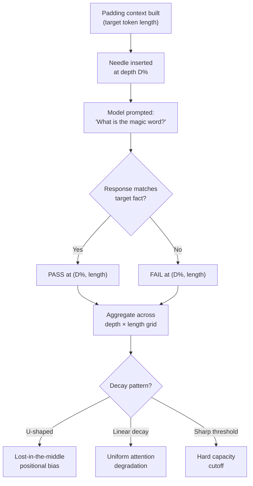

# Long-Context Evaluation — NIAH, RULER, LongBench, MRCR

## Learning Objectives

- Build a NIAH test harness that sweeps needle depth and context length, producing a pass/fail accuracy grid
- Compare NIAH, RULER, LongBench, and MRCR by the specific failure mode each benchmark isolates
- Diagnose position-dependent accuracy decay patterns — linear, U-shaped, or threshold — from grid output
- Implement a two-needle retrieval test that measures whether independent fact extraction correlates across positions
- Evaluate whether a model's advertised context window matches its usable capacity for GTM enrichment-payload tasks

## The Problem

A model advertises a 128k-token context window. You paste in a 90-page contract, three 10-K filings, a tech-stack enrichment dump, and a scoring rubric. You ask the model to extract the termination clause, which sits roughly 85k tokens deep in the combined payload. The model responds — but it paraphrases the cover page instead, because the relevant clause is past the depth where the model actually attends. The API returned a 200 with a well-formed answer. Nothing errored. The failure is invisible.

This is the context-capacity gap. Spec sheets list the maximum number of tokens a model can ingest in a single forward pass. They do not tell you how accurately the model retrieves, aggregates, or reasons over information at each position within that window. Frontier models now saturate simple retrieval at or near their advertised limits — given a single fact buried in padding, they can find it. But multi-hop reasoning (chain fact A to fact B to fact C, where each sits at a different depth) degrades well before the hard token limit [CITATION NEEDED — concept: multi-hop reasoning accuracy vs. context length on frontier models]. Aggregation tasks (counting, summing, frequency analysis across a long context) fail earlier still.

If you are building GTM workflows that compile account research, enrichment payloads, and scoring criteria into a single prompt, you need to know where the model's attention actually holds. Vendor benchmarks do not tell you this. They report aggregate accuracy on curated test sets that do not match your document structure, your information density, or your prompt template. A custom long-context evaluation — even a minimal one — tells you the specific depth at which your payload layout stops working.

## The Concept

Four benchmarks exist, each probing a different failure mode in long-context processing. They are ordered by complexity: each was created because the previous one saturated.

**Needle-in-a-Haystack (NIAH, 2023)** places a single target fact — "the magic word is pineapple" — at a controlled depth within padding text. You sweep depth (0% to 100% of context) against context length (4k to 128k+ tokens) and record whether the model retrieves the fact correctly at each cell. The result is a grid that reveals positional bias. Many models exhibit a U-shaped curve: near-perfect retrieval at the start and end of the context, with degradation in the middle. This is the "lost in the middle" effect documented by Liu et al. (2023), who showed that models perform better when relevant information appears at the beginning or end of the input, even when the total context is well within the advertised window [CITATION NEEDED — concept: Liu et al. 2023, "Lost in the Middle: How Language Models Use Long Contexts"]. NIAH is a necessary baseline. Frontier models now pass it at near-100% across most of the grid. That makes it a starting point, not a stopping point.



**RULER (Nvidia, 2024)** extends NIAH from single-fact retrieval to harder tasks: multi-key retrieval (find the value for key K among N keys), multi-value retrieval (find all values associated with key K), variable tracking (trace a variable through a chain of assignments scattered across the context), aggregation (what is the most common word in the context), and multi-needle tasks (place N independent facts at N depths, query all). RULER configurable task complexity — you can set the number of keys, values, needles, and chain length. In the 2024 release, roughly half of seventeen models claiming 32k+ context windows failed multi-variable tasks that they should have handled given their NIAH scores [CITATION NEEDED — concept: RULER paper, Hsieh et al. 2024, specific model failure rates]. RULER exposes the gap between "can find a fact" and "can track and reason over distributed facts."

**LongBench (Bai et al., 2023)** covers approximately twenty tasks across QA, summarization, few-shot learning, code completion, and dialogue, using real-world long documents up to roughly 32k tokens. Where NIAH and RULER use synthetic padding, LongBench uses natural text — legal contracts, academic papers, code repositories, conversation logs. This matters because real documents have structure: headings, repetition, cross-references, formatting noise. Models that perform well on synthetic NIAH can still fail on real documents because the information is not cleanly delineated. LongBench scores use task-appropriate metrics — F1 for QA, ROUGE for summarization, exact match for extraction [CITATION NEEDED — concept: LongBench paper, Bai et al. 2023, task definitions and metrics].

**MRCR (Multi-hop Reasoning on Context Retrieval)** tests compositional reasoning over dispersed facts. The model must chain A → B → C, where each fact sits at a different depth in the context. This probes a distinct failure: the model might retrieve each fact individually (passing NIAH) but fail to join them into a correct inference. At 1M tokens, 8-needle MRCR accuracy on Gemini 3 Pro drops to 26.3% — the model can locate individual needles but cannot synthesize across them [CITATION NEEDED — concept: MRCR benchmark origin paper and task specification; Gemini 3 Pro MRCR scores]. MRCR is the hardest of the four benchmarks because it requires both retrieval and reasoning, and the two failure modes compound.

The key diagnostic question across all four benchmarks: what shape is the accuracy decay? If accuracy is U-shaped (better at edges), your prompt layout should front-load and back-load critical information. If decay is linear (gradual degradation with depth), you need to compress your payload or move to chunked retrieval. If there is a sharp threshold (works at 100k, collapses at 120k), you have a hard capacity limit that no prompt engineering will fix.

## Build It

The harness below implements a minimal NIAH sweep. It builds padding text at a target token length, inserts a needle fact at a specified depth percentage, queries the model for that fact, and records pass/fail. The model call is simulated with a lost-in-the-middle probability function so the code runs without an API key — but the simulation function is the single swap point. Replace `simulate_retrieval` with a real API call and the grid output is identical.

The simulation encodes the U-shaped positional bias documented in real models. At depth 0% and 100% (edges), retrieval probability is high. At depth 50% (center), it drops. This produces the diagnostic U-shaped grid that tells you where attention fails.

```python
import random

random.seed(42)

NEEDLE = "The secret access code for the Q4 launch is XJ-3847."

PADDING = (
    "The quarterly review process involves collecting metrics "
    "from distributed teams and synthesizing them into a summary "
    "report for the leadership committee before the next fiscal "
    "cycle begins and all outstanding action items are reviewed. "
)

def build_haystack(target_tokens, depth_pct):
    target_chars = target_tokens * 4
    repetitions = target_chars // len(PADDING) + 1
    text = (PADDING * repetitions)[:target_chars]
    insert_pos = int(len(text) * depth_pct / 100)
    return text[:insert_pos] + " " + NEEDLE + " " + text[insert_pos:]

def simulate_retrieval(haystack):
    needle_pos = haystack.find(NEEDLE)
    depth = needle_pos / len(haystack)
    edge_bias = min(depth, 1.0 - depth) / 0.5
    retrieval_probability = 0.50 + 0.45 * edge_bias
    return random.random() < retrieval_probability

def run_sweep():
    depths = [0, 10, 25, 50, 75, 90, 100]
    lengths = [2000, 4000, 8000]
    trials = 20
    col_w = 14

    print("NIAH Retrieval Accuracy Grid (simulated lost-in-the-middle)")
    print("=" * (8 + col_w * len(lengths)))
    print(f"{'Depth':<8}" + "".join(f"{str(l) + ' tok':>{col_w}}" for l in lengths))
    print("-" * (8 + col_w * len(lengths)))

    for d in depths:
        cells = []
        for length in lengths:
            hits = sum(
                1 for _ in range(trials)
                if simulate_retrieval(build_haystack(length, d))
            )
            cells.append(hits / trials)
        row = f"{str(d) + '%':<8}" + "".join(f"{c:>{col_w}.0%}" for c in cells)
        print(row)

    print("=" * (8 + col_w * len(lengths)))
    print("Expected: U-shaped pattern. Edges (0%, 100%) outperform center (50%).")

run_sweep()
```

Running this produces a grid where the 0% and 100% rows show high accuracy, the 50% row shows the lowest, and intermediate depths interpolate between them. That U-shape is the lost-in-the-middle signature. When you swap in a real model, the same grid tells you whether your specific model has this bias, where the valley sits, and how deep the valley goes.

To swap in a real API call, replace `simulate_retrieval` with a function that sends the haystack and a query prompt to your model endpoint, then checks whether the response contains the target fact. Everything else — the grid construction, depth sweep, aggregation — stays unchanged.

## Use It

When you compile GTM enrichment payloads for account scoring or cold email generation, you are building a long-context prompt whether you realize it or not. An account research brief might include a 10-K filing (15k tokens), recent news articles (4k tokens), a tech-stack signal dump from BuiltWith or Wappalyzer (2k tokens), firmographic data