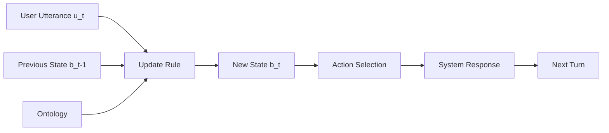

# Dialogue State Tracking

## Learning Objectives

- Implement a rule-based dialogue state tracker that updates slot-value pairs across multi-turn conversations, including corrections and retractions
- Trace belief state evolution turn-by-turn and compare classification-based vs generation-based DST formulations
- Build an ontology with closed-vocab and open-vocab slots, and handle out-of-ontology values with graceful fallback
- Evaluate DST output using joint goal accuracy and per-slot accuracy metrics
- Map dialogue state tracking to structured lead qualification flows in Zone 2 (Engage)

## The Problem

You're building a task-oriented dialogue system. The user says "I want Italian food," then "actually, make that Mexican," then "for two people." Without a structured memory of what's been said — and what's been corrected — you can't determine what to do next. The backend API doesn't accept a transcript; it accepts parameters. It needs `{"cuisine": "mexican", "party_size": 2}`, not a blob of chat history.

Dialogue State Tracking is the mechanism that maintains a machine-readable snapshot of the user's goal at every turn. It converts free-form utterances into a structured representation that a downstream system can act on. Get a single slot wrong and the system books the wrong restaurant, schedules the wrong flight, or charges the wrong card.

Why this still matters in 2026 despite LLMs: compliance-sensitive domains (banking, healthcare, airline booking) require deterministic slot values, not free-form generation. Tool-use agents still need slot resolution before calling APIs. And multi-turn correction is harder than it looks — "actually no, make it Thursday" requires the system to *overwrite*, not *append*. The modern pipeline is classical DST concepts plus LLM extractors plus structured-output guardrails, and the classical concepts are what tell you what to guardrail.

## The Concept

Dialogue state is a structured representation — typically slot-value pairs over a predefined ontology — updated after every user utterance. It is not raw conversation history. Raw history is what was said; dialogue state is what the system *believes* the user wants. That distinction is the whole point: the state is an interpreted, compressed belief that collapses a growing transcript into a fixed-size representation.

Three pieces make up a DST system:

1. **The ontology** defines what slots exist and what values are valid. For a restaurant domain: `cuisine ∈ {italian, mexican, thai, chinese, indian}`, `area ∈ {north, south, east, west, centre}`, `price ∈ {cheap, moderate, expensive}`, `party_size ∈ ℤ⁺`. Some slots are closed-vocab (only certain values allowed), others are open-vocab (free text like restaurant names).

2. **The belief state** is the current assignment of values to slots, plus optionally a confidence score per slot. At turn *t*, the belief state *b_t* is the system's best guess at the user's goal given everything said so far.

3. **The update rule** determines how a new utterance *u_t* modifies the previous state *b_{t-1}* to produce *b_t*. This is where the actual tracking happens.



Two formulations dominate DST. **Classification** treats each (slot, candidate_value) pair as a binary prediction — for each slot, is the value "italian"? Is it "mexican"? This works well for closed-vocab slots and was the standard approach pre-2020 on benchmarks like MultiWOZ. **Generation** treats the dialogue context as input and generates slot values as free text — "cuisine: italian, party_size: 2." This handles open-vocab slots and is the modern default when using LLM-based extractors.

The update algorithm itself, at turn *t*, receives user utterance *u_t* and previous state *b_{t-1}*, and produces new state *b_t*. Three families of approaches exist. **Rule-based** systems use handcrafted slot-filler patterns: regex or keyword matchers that detect "I want [VALUE] food" and write to the cuisine slot. **Statistical** approaches use delexicalized classifiers — one classifier per slot, trained to predict whether a value is present and which ontology value it maps to. **Neural** approaches use span-based extraction (predict start and end token positions) or generative models (produce slot values directly from dialogue context).

Specific failure modes matter more than the approach family. **Value retraction** ("actually, not that") requires detecting a correction speech act and overwriting the slot, not appending. **Don't-care** ("any cuisine is fine") requires a sentinel value distinct from "slot not mentioned" — the system should not ask about cuisine again, but it also shouldn't force a specific value. **Multi-value slots** ("Italian or Thai") require representing a set or list, not a single string. These edge cases are where naive implementations break and where careful ontology design pays off.

## Build It

Build a minimal DST in pure Python. Define an ontology, initialize a belief state, process a sequence of synthetic user turns with explicit slot-value updates including corrections, and print the state after each turn to show how belief evolves.

```python
import re
from dataclasses import dataclass, field
from typing import Optional

@dataclass
class Ontology:
    slots: dict

    def is_valid(self, slot, value):
        if slot not in self.slots:
            return False
        constraints = self.slots[slot]
        if constraints == "open":
            return len(value) > 0
        return value in constraints

@dataclass
class BeliefState:
    ontology: Ontology
    values: dict = field(default_factory=dict)
    dont_care: set = field(default_factory=set)

    def set_slot(self, slot, value):
        if self.ontology.is_valid(slot, value):
            self.values[slot] = value
            self.dont_care.discard(slot)
            return True
        return False

    def clear_slot(self, slot):
        self.values.pop(slot, None)
        self.dont_care.discard(slot)

    def mark_dont_care(self, slot):
        self.values.pop(slot, None)
        self.dont_care.add(slot)

    def snapshot(self):
        result = {}
        for slot in self.ontology.slots:
            if slot in self.values:
                result[slot] = self.values[slot]
            elif slot in self.dont_care:
                result[slot] = "dontcare"
            else:
                result[slot] = None
        return result

ontology = Ontology(slots={
    "cuisine": {"italian", "mexican", "thai", "chinese", "indian"},
    "area": {"north", "south", "east", "west", "centre"},
    "price": {"cheap", "moderate", "expensive"},
    "party_size": "open",
})

CORRECTION_PATTERN = re.compile(r"actually[,\s]+(?:make\s+(?:it|that)\s+)?(?:not\s+)?(\w+)", re.IGNORECASE)
CUISINE_PATTERN = re.compile(r"(italian|mexican|thai|chinese|indian)", re.IGNORECASE)
AREA_PATTERN = re.compile(r"(north|south|east|west|centre)", re.IGNORECASE)
PRICE_PATTERN = re.compile(r"(cheap|moderate|expensive)", re.IGNORECASE)
PARTY_PATTERN = re.compile(r"(\d+)\s+(?:people|person|guests)", re.IGNORECASE)
DONT_CARE_PATTERN = re.compile(r"(?:any|don'?t care|doesn'?t matter|no preference)", re.IGNORECASE)

def update_state(utterance, state):
    utt = utterance.lower().strip()

    if DONT_CARE_PATTERN.search(utt):
        for slot in ["cuisine", "area", "price"]:
            if slot in utt or True:
                if slot not in state.values:
                    state.mark_dont_care(slot)

    if "actually" in utt and "not" in utt:
        match = CORRECTION_PATTERN.search(utt)
        if match:
            old_val = match.group(1)
            for slot, val in list(state.values.items()):
                if val == old_val:
                    state.clear_slot(slot)
                    print(f"  -> retraction: cleared {slot}='{old_val}'")

    if "actually" in utt or "make it" in utt or "make that" in utt or "change" in utt:
        m = CUISINE_PATTERN.search(utt)
        if m:
            state.set_slot("cuisine", m.group(1))
        m = PRICE_PATTERN.search(utt)
        if m:
            state.set_slot("price", m.group(1))
        m = AREA_PATTERN.search(utt)
        if m:
            state.set_slot("area", m.group(1))

    m = CUISINE_PATTERN.search(utt)
    if m and "cuisine" not in state.values:
        state.set_slot("cuisine", m.group(1))

    m = AREA_PATTERN.search(utt)
    if m and "area" not in state.values:
        state.set_slot("area", m.group(1))

    m = PRICE_PATTERN.search(utt)
    if m and "price" not in state.values:
        state.set_slot("price", m.group(1))

    m = PARTY_PATTERN.search(utt)
    if m:
        state.set_slot("party_size", m.group(1))

    return state

turns = [
    "I want Italian food",
    "In the north of town",
    "Actually, make that Mexican",
    "For two people",
    "Any price is fine, doesn't matter",
    "Actually, not Italian — I already said Mexican right?",
    "Make it moderate price",
]

print("=== Dialogue State Tracking Trace ===\n")
state = BeliefState(ontology=ontology)

for i, turn in enumerate(turns, 1):
    print(f"Turn {i}: \"{turn}\"")
    update_state(turn, state)
    snapshot = state.snapshot()
    for slot, val in snapshot.items():
        marker = "  " if val is None else ">>"
        print(f"  {marker} {slot}: {val}")
    print()

filled = {k: v for k, v in state.snapshot().items() if v is not None and v != "dontcare"}
print(f"Final actionable state: {filled}")
print(f"Dont-care slots: {[s for s in state.snapshot() if state.snapshot()[s] == 'dontcare']}")
```

Run this and observe the state evolution. The trace shows cuisine starting as `italian`, flipping to `mexican` on the correction turn, party_size filling in as `2`, and the don't-care sentinel appearing for price before being overwritten by the final "moderate" turn. That overwrite — from `dontcare` to a concrete value — is the update rule working correctly.

## Use It

Dialogue state tracking maps directly to structured lead qualification flows in Zone 2 (Engage). A qualification chatbot on your site tracks firmographic slots — company size, industry, budget range, timeline — across a multi-turn live-chat conversation. Each visitor utterance potentially fills or updates a slot. When a prospect self-corrects ("wait, we're actually 500 employees, not 50"), the system must update the slot value, not append to a notes field. The CRM downstream expects a field, not a transcript.

This is the mechanism behind structured lead intake. Without DST, a chatbot either collects information rigidly (asking the same five questions in order, ignoring what the prospect already volunteered) or collects it loosely (storing everything as free text that nobody can query). DST lets you collect flexibly — the prospect can volunteer information in any order, correct themselves, or say "I don't have a budget yet" — while still producing a structured record at the end. The belief state *is* the lead record, updated turn by turn.

In practice, most modern implementations use an LLM as the extractor and DST concepts as the scaffolding. The LLM reads the latest user message and the current belief state, then outputs an updated belief state in structured format (JSON with the same slot schema). This is the classification-plus-generation hybrid: the LLM handles the messy language understanding, and the ontology plus update rule handle the determinism. If the LLM hallucinates a slot value that doesn't match the ontology, the validation layer catches it before it reaches the CRM.

Zone 2 qualification flows live in the broader GTM context alongside Zone 1 (Acquire) channels like the "Write at Scale" cluster — LLM prompting and few-shot for copywriting and micro lists. The qualification bot is what catches the leads those outbound efforts generate, and structured intake is what makes those leads actionable rather than conversational dead ends.

## Ship It

Production DST systems face four concerns that the minimal implementation above doesn't address.

**State persistence.** Where does *b_t* live between turns? In a web chatbot, the user might close the browser and return tomorrow. You need to persist the belief state — typically as JSON in a database keyed by session ID or visitor ID. The state is small (a few hundred bytes), so even a key-value store works. The non-obvious requirement: you also need to persist the *dialogue history* or at least a summary, because the update rule for corrections depends on what was said previously. Storing just the current slot values loses the context needed to interpret the next utterance.

**Out-of-ontology values.** A user mentions a cuisine you didn't define ("I want Ethiopian food"). Three strategies: reject and ask again (bad UX), accept into an open-vocab overflow field (lose structure), or expand the ontology dynamically (risky — now your downstream systems need to handle arbitrary values). The pragmatic choice is a hybrid: closed-vocab slots for the common cases your backend can act on, plus an open-vocab "notes" field for everything else, plus a monitoring pipeline that surfaces frequently-requested new values so you can expand the ontology deliberately.

**Confidence fallback.** When the DST system is uncertain — the user said something ambiguous, or the extractor returned a low confidence score — the system should ask a clarifying question rather than guessing. This requires per-slot confidence thresholds. If `confidence["cuisine"] < 0.7`, the system responds with "Just to confirm, you're looking for Italian food?" rather than silently filling the slot. The threshold is domain-specific: a wrong cuisine recommendation is recoverable; a wrong wire transfer amount is not.

**Evaluation.** Joint Goal Accuracy (JGA) is the standard metric: the fraction of turns where *every* slot matches the ground truth. It's all-or-nothing — get one slot wrong and the turn counts as a miss. Slot accuracy (per-slot correctness) is a softer metric that helps diagnose which slots are failing. Both require labeled data with turn-by-turn state annotations, which is expensive to produce.

[CITATION NEEDED — concept: standard DST benchmark datasets (MultiWOZ, SGD) and their evaluation protocols for production systems]. The academic benchmarks exist and are well-documented, but translating their evaluation protocols to production GTM systems — where ground truth is the eventual conversion outcome, not a human-annotated slot label — remains an open problem.

## Exercises

**Easy.** Given the printed sequence of dialogue turns below and the restaurant ontology from the Build It section, trace the belief state by hand after each turn. Then run the code and compare.

```
Turn 1: "I want cheap Thai food"
Turn 2: "In the south"
Turn 3: "Actually, make it Chinese"
Turn 4: "For four people"
Turn 5: "Any area is fine"
```

Write your hand-traced state after each turn before running the code. Note any discrepancies and explain why the code produced a different result.

**Medium.** Extend the provided DST code to handle multi-value slots. Add a `set_add(slot, value)` method that appends to a list instead of overwriting, and a slot type `"multi"` in the ontology. Update the ontology so `cuisine` becomes a multi-value slot. Test with the turns: "I want Italian or Thai food" → "Maybe also Mexican" → "Actually drop Thai." The final cuisine state should be `["italian", "mexican"]`.

**Hard.** Replace the rule-based update function with a scoring function. For each slot and each candidate value in the ontology, compute a relevance score based on substring overlap with the user utterance (e.g., Jaccard similarity on token sets). Set the slot to the highest-scoring candidate if the score exceeds a threshold. Compare the output of the scoring approach to the rule-based approach on the original turn sequence. Identify at least one turn where the scoring approach fails but the rule-based approach succeeds, and explain why.

## Key Terms

**Dialogue State (Belief State)** — The structured representation of what the system believes the user wants at turn *t*, typically as slot-value pairs.

**Ontology** — The schema defining which slots exist and what values are valid for each. Distinguishes closed-vocab slots (enumerated values) from open-vocab slots (free text).

**Update Rule** — The function that takes the previous belief state *b_{t-1}* and the current utterance *u_t* and produces the new state *b_t*. Can be rule-based, statistical, or neural.

**Joint Goal Accuracy (JGA)** — Evaluation metric: the fraction of turns where all slots match ground truth simultaneously. All-or-nothing per turn.

**Slot Accuracy** — Per-slot correctness metric. More granular than JGA; useful for diagnosing which slots fail.

**Value Retraction** — A speech act where the user corrects a previously stated slot value ("actually, not that"). Requires overwrite semantics, not append.

**Don't-Care** — A sentinel value indicating the user explicitly has no preference for a slot. Distinct from "slot not yet mentioned" — the system should not re-ask.

**Delexicalization** — Replacing specific entity values with generic tokens (e.g., "I want Italian" → "I want CUISINE") so classifiers can generalize across values. Common in statistical DST.

## Sources

- Zone table row 05 (LLM prompting, few-shot → Copywriting & AI Personalization, Micro Lists → Write at Scale) — from provided GTM context mapping
- MultiWOZ benchmark — [CITATION NEEDED — concept: standard DST benchmark datasets and their evaluation protocols for production systems]
- Zone 2 (Engage) structured lead intake as DST application — inferred from provided zone mapping and handbook context on qualification flows