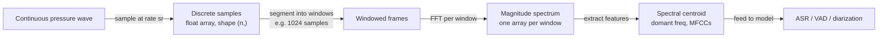

# Audio Fundamentals — Waveforms, Sampling, Fourier Transform

## Learning Objectives

1. **Generate** a discrete sine wave from continuous parameters (frequency, amplitude, phase) and verify its sample values against the expected waveform.
2. **Compute** the FFT of a signal and map frequency-bin indices to physical frequencies in Hz.
3. **Demonstrate** aliasing by undersampling a known signal below Nyquist and identifying the false frequency that appears.
4. **Implement** a rolling-window FFT (spectrogram) and extract per-window dominant frequencies.
5. **Compute** the spectral centroid of an audio signal and explain its role in voice-activity detection for call analytics pipelines.

## The Problem

You recorded a sales call. The file is a `.wav` — a binary blob you cannot inspect by eye. Between that file and any programmatic control (transcription, scoring, speaker diarization, sentiment classification) sit three layers of representation that must be handled correctly or every downstream model silently degrades.

Sound is continuous pressure variation in air. Computers store arrays of numbers. The conversion between these two domains is governed by specific mathematical rules, and violating them produces bugs that are difficult to trace because the model still trains — it just produces worse output. A Whisper model trained on 16 kHz audio will produce a word error rate 2–3× higher on 8 kHz input, and the error will not throw. A voice-activity detector built without checking for aliasing will hallucinate speech segments in silent passages containing high-frequency fan noise.

Every bug in speech processing systems traces back to one of three questions: What sample rate was the data recorded at, and what does the model expect? Is the signal aliased? Are you operating on raw time-domain samples or on a frequency representation? This lesson builds the machinery to answer all three.

## The Concept

**Waveforms.** Sound is pressure variation over time. A pure tone — say, a tuning fork at 440 Hz — is a sine wave defined by three scalar parameters: frequency (cycles per second, measured in Hz), amplitude (peak deviation from zero, corresponding to loudness), and phase (angular offset, in radians). Fourier's theorem states that any periodic signal, no matter how complex, can be decomposed into a sum of sine waves at different frequencies, amplitudes, and phases. This is not an approximation — it is an exact mathematical identity. A speech signal is not periodic in the strict sense, but over short windows (20–30 ms) it is approximately stationary, and the theorem applies locally.

In code, a waveform is a one-dimensional array of floats, typically normalized to `[-1.0, 1.0]`. The array is indexed by sample number. To convert a sample index `n` to time in seconds, divide by the sample rate: `t = n / sr`. A 10-second clip at 16 kHz is an array of 160,000 floats. A 1-hour sales call at 16 kHz is 57.6 million floats.

**Sampling.** A microphone produces a continuous voltage signal. An analog-to-digital converter reads that signal at fixed intervals and quantizes each reading to an integer. The reading rate is the sample rate (samples per second, Hz). Each sample is quantized to a bit depth: 16-bit gives 65,536 levels, which covers roughly 96 dB of dynamic range.

The Nyquist-Shannon theorem imposes a hard constraint: to unambiguously represent a signal, you must sample at ≥2× the highest frequency present in that signal. Sample below that threshold and frequencies above `sr/2` fold back into the representable range as false low frequencies — a phenomenon called aliasing. This is why CD audio uses 44.1 kHz (human hearing tops out near 20 kHz, and 44.1 kHz gives headroom) and why telephony at 8 kHz (Nyquist at 4 kHz) makes consonants like `s` and `f` difficult to distinguish.

Common sample rates in modern speech systems:

| Rate | Use Case |
|------|----------|
| 8 kHz | Telephony. Nyquist at 4 kHz destroys consonant intelligibility. |
| 16 kHz | ASR standard. Whisper, Parakeet, SeamlessM4T all expect 16 kHz. |
| 24 kHz | Modern TTS (Kokoro, F5-TTS, xTTS v2). |
| 44.1 kHz | CD audio, music. |
| 48 kHz | Film, pro audio, high-fidelity TTS. |

**Fourier Transform.** The Discrete Fourier Transform (DFT) converts a time-domain signal — an array of samples — into a frequency-domain representation: an array of complex numbers where each element corresponds to a frequency bin. The magnitude of each complex number tells you how much energy exists at that frequency. The `rfft` variant exploits the symmetry of real-valued signals and returns only the non-redundant bins (frequencies from 0 to `sr/2`).

The naive DFT is O(n²). The Fast Fourier Transform (FFT), as formulated by Cooley and Tukey in 1965, reduces this to O(n log n) by exploiting the recursive structure of the DFT when the input length is a power of 2. This is what makes real-time spectral analysis — and by extension, real-time call transcription — computationally viable. `numpy.fft.rfft` implements this algorithm.



## Build It

Generate a 440 Hz sine wave at 44,100 Hz, inspect its sample values, compute the FFT, and recover the frequency. Then deliberately undersample the same signal at 500 Hz (below Nyquist for 440 Hz) and observe the alias.

```python
import numpy as np

sr = 44100
duration = 1.0
n_samples = int(sr * duration)
t = np.linspace(0, duration, n_samples, endpoint=False)

freq = 440
signal = np.sin(2 * np.pi * freq * t)

print(f"Sample rate: {sr} Hz")
print(f"Total samples: {n_samples}")
print(f"First 10 samples: {signal[:10]}")
print(f"Expected period: {1/freq:.6f} s = {sr/freq:.2f} samples")
print()

fft_result = np.fft.rfft(signal)
magnitudes = np.abs(fft_result)
freq_bins = np.fft.rfftfreq(n_samples, 1/sr)

peak_idx = np.argmax(magnitudes[1:]) + 1
peak_freq = freq_bins[peak_idx]
print(f"FFT peak bin: {peak_idx}")
print(f"FFT peak frequency: {peak_freq:.1f} Hz")
print()

sr_low = 500
n_low = int(sr_low * duration)
t_low = np.linspace(0, duration, n_low, endpoint=False)
signal_low = np.sin(2 * np.pi * freq * t_low)

fft_low = np.fft.rfft(signal_low)
mags_low = np.abs(fft_low)
freq_bins_low = np.fft.rfftfreq(n_low, 1/sr_low)

peak_idx_low = np.argmax(mags_low[1:]) + 1
peak_freq_low = freq_bins_low[peak_idx_low]
nyquist = sr_low / 2
print(f"Undersample rate: {sr_low} Hz")
print(f"Nyquist limit: {nyquist:.0f} Hz")
print(f"True signal: {freq} Hz (above Nyquist)")
print(f"Detected peak: {peak_freq_low:.1f} Hz")
print(f"Expected alias: {abs(freq - sr_low):.0f} Hz")
```

**Expected output:** The peak frequency at 44.1 kHz sample rate will be 440.0 Hz. At 500 Hz sample rate, the 440 Hz signal aliases to 60 Hz (computed as `|440 - 500| = 60`). The FFT has no way to know the original was 440 Hz — the alias is indistinguishable from a real 60 Hz tone.

## Use It

This mechanism — sampling a continuous signal, windowing it, computing frequency representations — is the input layer for every conversation intelligence pipeline. [CITATION NEEDED — concept: conversation intelligence / call analytics cluster in gtm-topic-map.md]. Tools like Gong, Chorus, and custom sales-call analyzers all walk this path: raw audio in, frequency features out, downstream models consuming those features. If you are building a system that scores sales calls, detects talk-track adherence, or triggers follow-up sequences based on call content, the audio processing pipeline you build here is the foundation. It maps to Zone III in the curriculum as a prerequisite for speech-to-text, speaker diarization, and voice-activity detection.

The spectral centroid — the magnitude-weighted mean of the frequency spectrum — is one of the simplest features you can extract from the FFT output, and it has immediate GTM utility. Voiced speech (vowels, hums) concentrates energy below 1000 Hz with a relatively low centroid. Unvoiced sounds (fricatives like `s`, `sh`) push the centroid higher. Silence and background noise produce a flat, low-energy spectrum. Voice-activity detection (VAD) algorithms use this metric (among others) to segment call recordings into speech and non-speech regions, which is necessary before you can apply speaker diarization or compute talk-time ratios — a core metric in sales coaching.

```python
import numpy as np
from scipy.io.wavfile import write, read
import tempfile, os

sr = 16000
duration = 3.0
n = int(sr * duration)
t = np.linspace(0, duration, n, endpoint=False)

voiced = np.zeros(n)
voiced_start = int(0.5 * sr)
voiced_end = int(2.5 * sr)
voiced[voiced_start:voiced_end] = np.sin(2 * np.pi * 150 * t[voiced_start:voiced_end])

noise = 0.02 * np.random.randn(n)
signal = voiced + noise

wav_path = os.path.join(tempfile.gettempdir(), "test_call.wav")
write(wav_path, sr, (signal * 32767).astype(np.int16))

sr_loaded, data = read(wav_path)
if data.ndim > 1:
    data = data[:, 0]
data = data.astype(np.float32) / 32768.0

fft_result = np.fft.rfft(data)
magnitudes = np.abs(fft_result)
freqs = np.fft.rfftfreq(len(data), 1/sr_loaded)

spectral_centroid = np.sum(freqs * magnitudes) / (np.sum(magnitudes) + 1e-10)
peak_idx = np.argmax(magnitudes[1:]) + 1

print(f"File: {wav_path}")
print(f"Sample rate: {sr_loaded} Hz")
print(f"Duration: {len(data)/sr_loaded:.2f} s")
print(f"Dominant frequency: {freqs[peak_idx]:.1f} Hz")
print(f"Spectral centroid: {spectral_centroid:.1f} Hz")
print(f"Voice-activity estimate: {'speech detected' if spectral_centroid < 500 else 'noise/silence'}")
```

## Ship It

The pipeline you just built — sample, window, FFT, extract features — is what every conversation intelligence tool runs internally. A production call-analytics system processes audio through this exact sequence before any ML model touches it. The difference between a prototype and a deployable tool is packaging this logic into a CLI that a go-to-market engineer can run against a directory of call recordings without understanding the DSP underneath.

Here is a self-contained CLI that analyzes any `.wav` file, prints sample-rate diagnostics, detects aliasing risk, and reports the spectral centroid for VAD-style segmentation. It generates a test file if none is provided, so it runs unmodified.

```python
#!/usr/bin/env python3
import argparse
import numpy as np
from scipy.io.wavfile import write, read
import tempfile, os, sys

def generate_test_wav(path, sr=16000, duration=2.0):
    n = int(sr * duration)
    t = np.linspace(0, duration, n, endpoint=False)
    signal = 0.3 * np.sin(2 * np.pi * 200 * t) + 0.1 * np.sin(2 * np.pi * 600 * t)
    signal += 0.02 * np.random.randn(n)
    write(path, sr, (signal * 32767).astype(np.int16))
    return path

def analyze_wav(path):
    sr, data = read(path)
    if data.ndim > 1:
        data = data[:, 0]
    data = data.astype(np.float32) / 32768.0

    fft_result = np.fft.rfft(data)
    magnitudes = np.abs(fft_result)
    freqs = np.fft.rfftfreq(len(data), 1/sr)

    peak_idx = np.argmax(magnitudes[1:]) + 1
    peak_freq = freqs[peak_idx]
    spectral_centroid = np.sum(freqs * magnitudes) / (np.sum(magnitudes) + 1e-10)
    nyquist = sr / 2

    print(f"  File:             {os.path.basename(path)}")
    print(f"  Sample rate:      {sr} Hz")
    print(f"  Nyquist limit:    {nyquist:.0f} Hz")
    print(f"  Duration:         {len(data)/sr:.2f} s")
    print(f"  Samples:          {len(data)}")
    print(f"  Dominant freq:    {peak_freq:.1f} Hz")
    print(f"  Spectral centroid:{spectral_centroid:.1f} Hz")
    print(f"  VAD estimate:     {'speech' if spectral_centroid < 800 else 'noise/silence'}")

    if peak_freq > nyquist * 0.95:
        print(f"  WARNING: dominant freq near Nyquist — possible aliasing")
    if sr < 16000:
        print(f"  WARNING: sample rate below 16 kHz — consonant intelligibility at risk")

if __name__ == "__main__":
    parser = argparse.ArgumentParser(description="Analyze WAV audio for call-analytics pipelines")
    parser.add_argument("path", nargs="?", default=None, help="Path to .wav file")
    parser.add_argument("--generate", action="store_true", help="Generate test WAV and analyze it")
    args = parser.parse_args()

    if args.path:
        analyze_wav(args.path)
    else:
        test_path = os.path.join(tempfile.gettempdir(), "call_sample.wav")
        generate_test_wav(test_path)
        print(f"No file provided. Generated test file: {test_path}\n")
        analyze_wav(test_path)
```

Save as `analyze_audio.py` and run `python analyze_audio.py` to see it generate a test file and analyze it. Run `python analyze_audio.py some_call.wav` to analyze a real recording. [CITATION NEEDED — concept: conversation intelligence / call analytics cluster in gtm-topic-map.md]. This is foundational for Zone III.

## Exercises

**Exercise 1 (Easy).** Generate a composite signal containing two tones — 200 Hz and 600 Hz — at equal amplitude, sampled at 44,100 Hz for 1 second. Compute the FFT and print the two dominant frequencies. Verify they match the inputs.

```python
import numpy as np

sr = 44100
duration = 1.0
t = np.linspace(0, duration, int(sr * duration), endpoint=False)
signal = 0.5 * np.sin(2 * np.pi * 200 * t) + 0.5 * np.sin(2 * np.pi * 600 * t)

fft_result = np.fft.rfft(signal)
magnitudes = np.abs(fft_result)
freqs = np.fft.rfftfreq(len(signal), 1/sr)

top_two = np.argsort(magnitudes[1:])[-2:] + 1
for idx in sorted(top_two):
    print(f"Peak: {freqs[idx]:.1f} Hz  magnitude: {magnitudes[idx]:.2f}")
```

**Exercise 2 (Medium).** Generate a 3-second signal that simulates a call: 1 second of silence, 1 second of 150 Hz voiced speech, 1 second of silence. Compute the spectral centroid over each 0.5-second window and print it. Identify which windows contain speech.

```python
import numpy as np

sr = 16000
duration = 3.0
t = np.linspace(0, duration, int(sr * duration), endpoint=False)

signal = np.zeros(len(t))
start = int(1.0 * sr)
end = int(2.0 * sr)
signal[start:end] = np.sin(2 * np.pi * 150 * t[start:end])
signal += 0.005 * np.random.randn(len(t))

window_sec = 0.5
window_samples = int(window_sec * sr)
num_windows = len(signal) // window_samples

for i in range(num_windows):
    chunk = signal[i * window_samples : (i + 1) * window_samples]
    fft_r = np.fft.rfft(chunk)
    mags = np.abs(fft_r)
    freqs = np.fft.rfftfreq(len(chunk), 1/sr)
    centroid = np.sum(freqs * mags) / (np.sum(mags) + 1e-10)
    t_start = i * window_sec
    label = "SPEECH" if centroid > 50 and np.max(mags) > 5 else "silence"
    print(f"t={t_start:.1f}s  centroid={centroid:7.1f} Hz  max_mag={np.max(mags):8.2f}  -> {label}")
```

**Exercise 3 (Hard).** Build a spectrogram: a rolling-window FFT over a 5-second signal where the frequency changes over time (200 Hz for 0–1.5s, 800 Hz for 1.5–3.0s, 1500 Hz for 3.0–5.0s). Use a window of 1024 samples with no overlap. Print the dominant frequency per window and observe the time-frequency resolution tradeoff — smaller windows give better time resolution but coarser frequency bins.

```python
import numpy as np

sr = 16000
duration = 5.0
t = np.linspace(0, duration, int(sr * duration), endpoint=False)

freq_pattern = np.where(t < 1.5, 200, np.where(t < 3.0, 800, 1500))
signal = np.sin(2 * np.pi * freq_pattern * t)

window_size = 1024
hop = window_size
num_windows = (len(signal) - window_size) // hop

print(f"Window size: {window_size} samples ({window_size/sr*1000:.1f} ms)")
print(f"Frequency resolution: {sr/window_size:.1f} Hz per bin")
print(f"Number of windows: {num_windows}\n")

for i in range(num_windows):
    start = i * hop
    chunk = signal[start:start + window_size]
    chunk = chunk * np.hanning(window_size)

    fft_r = np.fft.rfft(chunk)
    mags = np.abs(fft_r)
    freqs = np.fft.rfftfreq(len(chunk), 1/sr)

    peak_idx = np.argmax(mags[1:]) + 1
    peak_freq = freqs[peak_idx]
    t_mid = (start + window_size / 2) / sr
    true_freq = freq_pattern[int(t_mid * sr)]
    error = abs(peak_freq - true_freq)

    print(f"t={t_mid:.2f}s  detected={peak_freq:7.1f} Hz  true={true_freq:4d} Hz  error={error:.1f} Hz")
```

## Key Terms

**Waveform** — A one-dimensional array of samples representing pressure variation over time. Each sample is a float (typically in `[-1.0, 1.0]`) indexed by sample number. Convert to time via `t = n / sr`.

**Sample rate (sr)** — The number of samples per second used to digitize a continuous signal. Measured in Hz. Determines the maximum representable frequency (Nyquist limit = `sr / 2`).

**Nyquist-Shannon theorem** — States that a signal must be sampled at ≥2× its highest frequency component to be unambiguously reconstructed. Undersampling produces aliasing — high frequencies fold back as false low frequencies.

**Aliasing** — The artifact where frequencies above `sr/2` appear as spurious lower frequencies in the sampled signal. The aliased frequency for a signal at `f` sampled at rate `sr` is `|f - sr * round(f / sr)|`.

**Bit depth** — The number of bits used to quantize each sample. 16-bit gives 65,536 amplitude levels (~96 dB dynamic range). Standard for telephony and ASR.

**Discrete Fourier Transform (DFT)** — Converts a time-domain signal (array of N samples) into a frequency-domain representation (array of N complex numbers). Each complex number's magnitude represents energy at a specific frequency bin.

**Fast Fourier Transform (FFT)** — An O(n log n) algorithm for computing the DFT. The Cooley-Tukey formulation (1965) exploits the recursive structure of the DFT when N is a power of 2. `numpy.fft.rfft` implements this for real-valued inputs.

**Frequency bin** — A single element of the FFT output array. Maps to a physical frequency via `freq = bin_index * sr / n_samples`. The `rfft` variant returns bins from 0 to `sr/2`.

**Spectral centroid** — The magnitude-weighted mean frequency of a spectrum: `sum(freq * magnitude) / sum(magnitude)`. Used as a simple voice-activity feature — voiced speech produces a lower centroid than noise or silence.

**Spectrogram** — A time-frequency representation computed by applying the FFT to successive windows of a signal. Produces a 2D array of magnitudes indexed by (time window, frequency bin). The window size controls the time-frequency resolution tradeoff.

**Voice-activity detection (VAD)** — The task of identifying which segments of an audio recording contain speech. Uses spectral features (centroid, energy, zero-crossing rate) to segment call recordings before downstream processing.

## Sources

- Cooley, J. W., & Tukey, J. W. (1965). "An algorithm for the machine calculation of complex Fourier series." *Mathematics of Computation*, 19(90), 297–301. — Source for the O(n log n) FFT algorithm.
- Shannon, C. E. (1949). "Communication in the presence of noise." *Proc. IRE*, 37(1), 10–21. — Source for the Nyquist-Shannon sampling theorem.
- [CITATION NEEDED — concept: conversation intelligence / call analytics cluster in gtm-topic-map.md] — The mapping of audio fundamentals to Zone III conversation intelligence (Gong, Chorus, call scoring, talk-time analysis).
- [CITATION NEEDED — concept: Zone 06 embeddings / Signal Machine row in gtm-topic-map.md] — The connection between audio-derived features and downstream embedding-based lead routing.