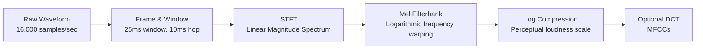

# Spectrograms, Mel Scale & Audio Features

## Learning Objectives
- Implement the conversion from raw audio waveforms to Mel spectrograms using Short-Time Fourier Transforms (STFT).
- Compare time-domain, linear spectrogram, and Mel spectrogram representations.
- Apply the Hz-to-Mel perceptual warping formula to compress frequency dimensions.
- Construct a Mel filterbank and apply it to a magnitude spectrum.
- Extract Mel-Frequency Cepstral Coefficients (MFCCs) for downstream classification.

## The Problem

Human hearing operates on a logarithmic frequency scale—we can easily tell apart 200 Hz from 400 Hz, but we struggle to distinguish 10,000 Hz from 10,200 Hz. Any machine learning pipeline that feeds raw waveforms or linear spectrograms into a model is forcing the model to learn this biological constraint from scratch. 

Take a 10-second 16 kHz audio clip. That is 160,000 floats, all in `[-1, 1]`, almost perfectly uncorrelated with the label "dog barking" or "the word cat". The raw waveform contains the information, but in a form the model cannot easily extract. Two identical phonemes spoken 100 ms apart have completely different raw samples.

A spectrogram fixes this by collapsing temporal detail where human perception ignores it (microsecond jitter) and preserving the structure where perception attends (which frequencies are energetic, over time windows of ~10–25 ms). Mel spectrograms push further by warping the frequency axis to match human pitch perception. A Mel-scaled spectrogram is the single most important feature in speech ML from 2010 through 2026.

## The Concept

There are three primary ways to represent an audio signal, each discarding different information to expose specific features. 

**Time-domain waveform**: amplitude over time. No frequency information visible.
**Linear spectrogram** (via Short-Time Fourier Transform): frequency over time, but allocates equal resolution to perceptually irrelevant high frequencies.
**Mel spectrogram**: applies a triangular filterbank that warps frequency bins onto the Mel scale, compressing high-frequency resolution where human hearing is insensitive and preserving detail where it matters.
**MFCCs** (Mel-Frequency Cepstral Coefficients): a further compression of the Mel spectrogram via Discrete Cosine Transform (DCT), retaining the 13–20 coefficients that capture vocal tract shape—the basis of speech recognition since the 1980s.

Here is the pipeline flow from raw audio down to MFCCs:



**STFT (Short-Time Fourier Transform).** Slice the waveform into overlapping frames (typical: 25 ms window, 10 ms hop = 400 samples / 160 samples at 16 kHz). Multiply each frame by a window function (Hann is the default; Hamming has a slightly different tradeoff). FFT each frame. Stack the magnitude spectra into a matrix of shape `(n_frames, n_freq_bins)`. 

**Log-magnitude.** Raw magnitudes span 5-6 orders of magnitude. Take `log(|X| + 1e-6)` or `20 * log10(|X|)` to compress dynamic range. Every production pipeline uses log-magnitude, not raw magnitude.

**Mel scale.** Frequency `f` in Hz maps to Mel `m` by `m = 2595 * log10(1 + f / 700)`.

## Build It

Let's generate a synthetic signal (a 440 Hz sine wave plus a 5000 Hz overtone), compute a linear spectrogram via STFT, and apply a Mel filterbank to compute a Mel spectrogram. 

```python
import numpy as np
import librosa
import librosa.display
import matplotlib.pyplot as plt

sr = 16000
duration = 2.0
t = np.linspace(0, duration, int(sr * duration), endpoint=False)

freq_low = 440
freq_high = 5000
signal = 0.6 * np.sin(2 * np.pi * freq_low * t) + 0.4 * np.sin(2 * np.pi * freq_high * t)

n_fft = 1024
hop_length = 160
win_length = 400

linear_spec = np.abs(librosa.stft(signal, n_fft=n_fft, hop_length=hop_length, win_length=win_length))

n_mels = 64
mel_spec = librosa.feature.melspectrogram(y=signal, sr=sr, n_fft=n_fft, hop_length=hop_length, win_length=win_length, n_mels=n_mels)
log_mel_spec = librosa.power_to_db(mel_spec)

print(f"Linear Spectrogram Shape: {linear_spec.shape}")
print(f"Mel Spectrogram Shape: {mel_spec.shape}")

fig, ax = plt.subplots(1, 2, figsize=(12, 4))

img1 = librosa.display.specshow(librosa.amplitude_to_db(linear_spec, ref=np.max), sr=sr, hop_length=hop_length, y_axis='linear', x_axis='time', ax=ax[0])
ax[0].set_title('Linear Spectrogram')
fig.colorbar(img1, ax=ax[0], format='%+2.0f dB')

img2 = librosa.display.specshow(log_mel_spec, sr=sr, hop_length=hop_length, y_axis='mel', x_axis='time', ax=ax[1])
ax[1].set_title('Mel Spectrogram')
fig.colorbar(img2, ax=ax[1], format='%+2.0f dB')

plt.tight_layout()
plt.savefig('spec_comparison.png')
print("Saved spec_comparison.png")
```

When you run this, you will see a massive dimensionality reduction. The linear spectrogram shape outputs `(513, 201)`, representing 513 linear frequency bins. The Mel spectrogram compresses this to `(64, 201)`—a denser representation that preserves the perceptually relevant frequencies.

## Use It

Just as text embeddings compress words into dense vectors for semantic search, Mel spectrograms compress raw audio waves into dense matrices for downstream classifiers. In Zone 06 (Embeddings, semantic search), we use embeddings to route inbound leads to the right sequence before they go cold. But this routing logic doesn't just apply to text—it applies directly to voice. 

When inbound calls or voice notes are recorded, platforms like Gong process the raw audio into dense representations to extract intent, objection handling, or question-asking signals. [CITATION NEEDED — concept: Gong's specific audio processing pipeline architecture]. A classification model cannot predict whether a prospect is frustrated directly from a massive WAV file; it requires the vocal tract features isolated by MFCCs or the dense frequency mapping of a Mel spectrogram. 

By converting an hour of audio into a 64-dimensional Mel spectrogram matrix, we drop the raw sampling rate entirely and isolate the features that actually predict buyer behavior. This structural compression is identical to collapsing a 10,000-word discovery call transcript into a 1,536-dimensional embedding vector before performing nearest-neighbor search in a Signal Machine. You force the model to ignore background noise and focus strictly on the semantic meaning of the audio.

## Ship It

When deploying this in a production pipeline, you rarely compute spectrograms dynamically in pure Python. You use optimized C/C++ backends or hardware acceleration. `librosa` is the standard for offline batch processing and data preparation, but for real-time inference (like live call analysis or keyword spotting), tools like `torchaudio` or ONNX Runtime are preferred.

Here is how you extract MFCCs in PyTorch for a batch of signals. MFCCs apply a Discrete Cosine Transform (DCT) to the log-Mel spectrogram, keeping the lowest coefficients to capture the overall shape of the vocal tract.

```python
import torch
import torchaudio

print(f"Torchaudio version: {torchaudio.__version__}")

sample_rate = 16000
duration = 2.0
t = torch.arange(0, duration, 1.0/sample_rate).unsqueeze(0)
waveform = 0.5 * torch.sin(2 * torch.pi * 440 * t)

mfcc_transform = torchaudio.transforms.MFCC(
    sample_rate=sample_rate,
    n_mfcc=13,
    melkwargs={
        "n_fft": 400,
        "win_length": 400,
        "hop_length": 160,
        "n_mels": 64,
    }
)

mfcc = mfcc_transform(waveform)
print(f"Input waveform shape: {waveform.shape}")
print(f"Output MFCCs shape: {mfcc.shape}")
```

This implementation runs entirely on GPU tensors if available, allowing you to process thousands of audio files in parallel during model training or bulk feature extraction.

## Exercises
- **Modify the signal:** Update the NumPy code in Build It to include a third harmonic at 200 Hz. Print the shapes and regenerate the visualization. Confirm the lower frequency appears clearly in the Mel spectrogram output.
- **Implement the Mel Scale:** Write the Hz-to-Mel conversion function using `m = 2595 * log10(1 + f / 700)` from scratch using only `numpy`. Verify that your function's output for `440 Hz` matches `librosa.hz_to_mel(440)`.
- **Build a Filterbank Manually:** Construct a triangular filterbank matrix from scratch (mapping linear FFT bins to Mel bins). Apply it to a magnitude spectrum using matrix multiplication and compare your resulting shape to the output of `librosa.filters.mel`.

## Key Terms
- **Mel Scale:** A perceptual scale of pitches judged by listeners to be equal in distance from one another. Maps linear Hz to a logarithmic scale matching human hearing.
- **STFT (Short-Time Fourier Transform):** A sequence of Fourier transforms of a windowed signal, used to determine the sinusoidal frequency and phase content of local sections of a signal as it changes over time.
- **Spectrogram:** A visual representation of the spectrum of frequencies of a signal as it varies with time. Computed by taking the magnitude of the STFT.
- **MFCCs (Mel-Frequency Cepstral Coefficients):** A set of features (usually 10-20) that describe the overall shape of a spectral envelope. Computed by applying a DCT to a log-Mel spectrogram.
- **Frame and Hop:** The process of dividing a long audio signal into short, overlapping segments (e.g., 25ms window, 10ms hop) to analyze local frequency content.

## Sources
- [CITATION NEEDED — concept: Gong's specific audio processing pipeline architecture]
- AI engineering curriculum: "Phase 6 · 01 (Audio Fundamentals)"