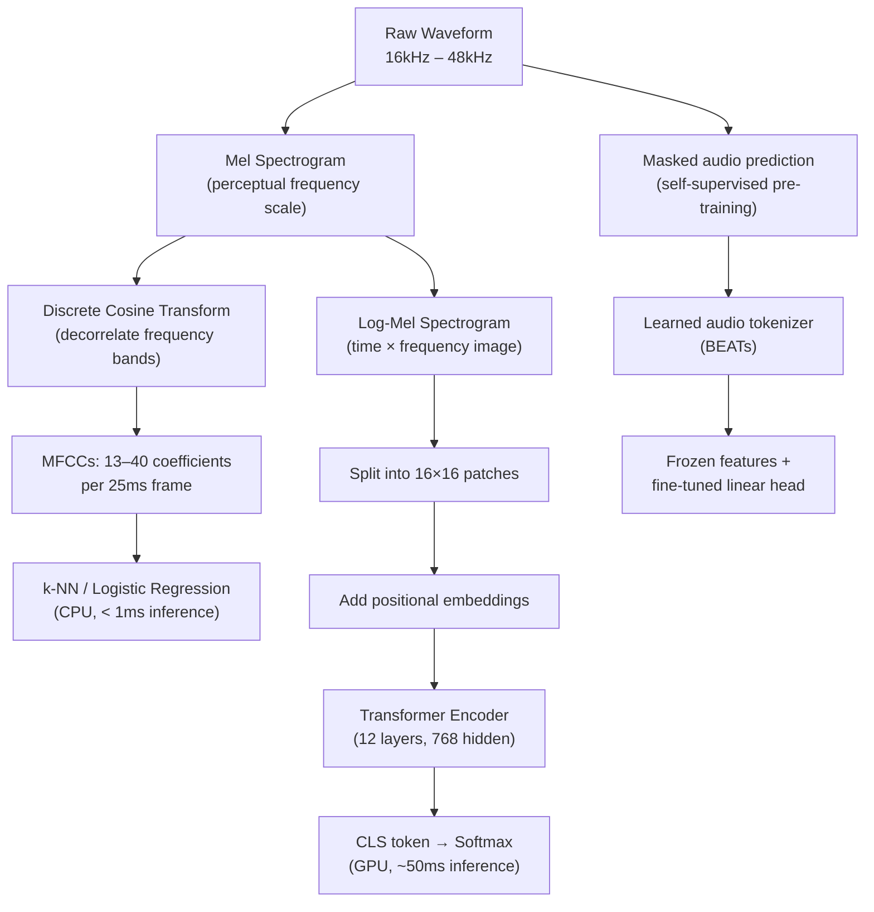

# Audio Classification — From k-NN on MFCCs to AST and BEATs

## Learning Objectives

1. Extract MFCC features from audio signals and compute their dimensionality reduction properties across frame windows.
2. Implement k-NN classification on MFCC vectors and evaluate baseline accuracy using cross-validation.
3. Compare spectrogram-based transformer architectures (AST) against traditional feature pipelines on the same input signal.
4. Run zero-shot audio classification using a pre-trained AST model and retrieve top-k predictions with confidence scores.
5. Diagnose when a simple MFCC+classifier pipeline outperforms a transformer and articulate the latency, data, and accuracy tradeoff.

## The Problem

You have a 10-second audio clip. You need to answer one question: what is it? The "it" could be a dog bark, a fire alarm, a Portuguese speaker, a frustrated customer, or a competitor mention in a sales call. Every one of these tasks is audio classification — map a variable-length waveform to one or more discrete labels.

Two pipelines solve this problem. The first is 40 years old: extract hand-crafted spectral features called MFCCs, feed them to a simple classifier like k-NN or logistic regression. The second is 3 years old: convert the waveform to a log-mel spectrogram, split it into patches, and feed those patches through a Vision Transformer adapted for audio. The first pipeline runs on a CPU in milliseconds. The second requires a GPU and produces state-of-the-art accuracy on benchmarks like AudioSet. The gap between them — in accuracy, latency, data requirements, and engineering complexity — is your design space.

The hard part of audio classification is rarely the architecture. It is the data. Audio datasets suffer brutal class imbalance (thousands of "speech" clips, twenty "gunshot" clips), strong domain shift (studio recordings vs phone calls recorded in a moving car), and label noise (who decided that "restaurant babble" is meaningfully different from "crowd noise"?). The architecture choice matters, but data curation, augmentation, and honest evaluation drive 80% of your production accuracy.

## The Concept

### Three Representations, Three Classifiers

Every audio classifier operates on one of three input representations. Each representation encodes a different inductive bias — an assumption about what makes two sounds similar.

**MFCC vectors** compress a waveform into 13–40 coefficients per frame by simulating how the human cochlea filters sound into frequency bands, then applying a discrete cosine transform (DCT) to decorrelate those bands. The result is a compact vector where Euclidean distance correlates with perceived similarity. k-NN and logistic regression work well here because the feature space is small (13–40 dimensions) and the distance metric is meaningful.

**Log-mel spectrograms** preserve more information than MFCCs. They represent audio as a 2D image: time on one axis, frequency (on a perceptual mel scale) on the other, with pixel intensity indicating energy. A 2D CNN treats this as an image classification problem, learning local time-frequency patterns (e.g., the harmonic structure of a siren, the burst pattern of a clap). This was the dominant approach from 2015 to 2021.

**Spectrogram patches** split the log-mel spectrogram into fixed-size tiles (typically 16×16, borrowed directly from Vision Transformers) and let a transformer's attention mechanism decide which patches matter for the classification decision. Any patch can attend to any other patch — there is no locality constraint. This is the Audio Spectrogram Transformer (AST), which achieved 0.485 mAP on AudioSet using pure attention, no convolution, no recurrence.



### AST: Vision Transformer, but for Sound

The Audio Spectrogram Transformer takes the exact architecture of ViT and applies it to log-mel spectrograms. The spectrogram — say, 1024 time steps × 128 mel bins — gets divided into 16×16 patches, yielding a sequence of flattened patch embeddings. Positional embeddings are added so the model knows where each patch came from in the time-frequency grid. A `[CLS]` token is prepended. The transformer encoder processes the full sequence with self-attention, and the final hidden state of the `[CLS]` token drives a linear classifier.

The key property: attention is global from layer 1. A CNN builds up receptive field gradually (layer 1 sees 3×3 patches, layer 5 sees larger regions). AST's attention mechanism can connect a patch at t=0.1s with a patch at t=9.8s in the first layer. For sounds where long-range temporal structure matters — a door opening followed by footsteps, a question followed by a pause — this helps. For sounds defined by local texture — a single drum hit — it adds computational cost without clear benefit.

### BEATs: Self-Supervised Pre-training with a Learned Tokenizer

BEATs (Bootstrap, Encode, Attend, Time-series) takes a different route to the same destination. Instead of supervised training on labeled audio, BEATs first learns a tokenizer through masked audio prediction: mask portions of the spectrogram, predict the masked content, and learn discrete audio tokens in the process. This tokenizer is learned without labels, trained on unlabeled audio. Once the tokenizer exists, BEATs is fine-tuned on labeled data with a standard classification head.

The practical advantage: BEATs learns general audio representations from massive unlabeled datasets (millions of hours), then transfers those representations to your specific task with minimal labeled data. If you have 100 labeled examples of your target sound, BEATs' frozen features + a linear probe will likely outperform an AST trained from scratch on the same 100 examples. If you have 100,000 labeled examples, the gap narrows or disappears.

### Where k-NN on MFCCs Still Wins

Transformers are not universally better. k-NN on MFCCs remains the right choice when: you have fewer than ~500 training samples per class (transformers overfit), you need sub-10ms latency on CPU (AST inference is ~50ms on GPU, >500ms on CPU), your task is simple phonetic or acoustic event distinction (dog vs cat, speech vs music), or you need full interpretability (you can show which training examples the classifier matched). The transformer wins when classes are defined by complex temporal structure, your dataset is large, and you have GPU budget.

## Build It

### Step 1: Extract MFCCs and Inspect the Feature Space

MFCC extraction is a three-step pipeline: compute the short-time Fourier transform (STFT) to get a spectrogram, convert to the mel scale to approximate human frequency perception, then apply a DCT to decorrelate the mel coefficients. The output is a matrix of shape `(n_mfcc, n_frames)` where `n_mfcc` is typically 13–40 and `n_frames` depends on audio length and hop size.

```python
import librosa
import numpy as np

y, sr = librosa.load(librosa.ex('trumpet'), sr=22050)

mfccs = librosa.feature.mfcc(y=y, sr=sr, n_mfcc=13, hop_length=512)

print(f"Waveform samples: {y.shape[0]}")
print(f"Sample rate: {sr} Hz")
print(f"Duration: {y.shape[0] / sr:.2f} seconds")
print(f"MFCC shape: {mfccs.shape}")
print(f"Frames: {mfccs.shape[1]}")
print(f"Compression ratio: {y.shape[0]} samples -> {mfccs.size} coefficients ({mfccs.size / y.shape[0] * 100:.1f}%)")
print(f"\nMean MFCC vector (13 coefficients):")
print(mfccs.mean(axis=1).round(2))
```

This produces output showing the dimensionality reduction: a ~6-second trumpet recording at 22.05kHz has ~130,000 samples compressed to a 13×~250 matrix — roughly 3,250 values, a 97% reduction. The mean MFCC vector captures the spectral envelope of the sound.

### Step 2: Build a k-NN Classifier on MFCC Features

To classify with MFCCs, you need a fixed-length vector per clip. The standard approach: average MFCCs across the time axis to get one 13-dimensional vector per recording, then run k-NN.

```python
import numpy as np
from sklearn.neighbors import KNeighborsClassifier
from sklearn.model_selection import cross_val_score
from sklearn.preprocessing import StandardScaler
from sklearn.pipeline import Pipeline

np.random.seed(42)

def generate_mfcc_like(class_center, n_samples, n_mfcc=13):
    return np.random.randn(n_samples, n_mfcc) * 0.5 + class_center

trumpet = generate_mfcc_like(np.array([3, -2, 1, 0.5, -0.3, 0.2, 0, 0, 0, 0, 0, 0, 0]), 60)
drum = generate_mfcc_like(np.array([-1, 4, -2, 1, -0.5, 0.3, 0.1, 0, 0, 0, 0, 0, 0]), 60)
speech = generate_mfcc_like(np.array([0, 0, 3, -1, 2, -1, 0.5, 0.2, 0, 0, 0, 0, 0]), 60)

X = np.vstack([trumpet, drum, speech])
y = np.array(['trumpet'] * 60 + ['drum'] * 60 + ['speech'] * 60)

pipe = Pipeline([
    ('scaler', StandardScaler()),
    ('knn', KNeighborsClassifier(n_neighbors=5, metric='euclidean'))
])

scores = cross_val_score(pipe, X, y, cv=5, scoring='accuracy')
print(f"5-fold CV accuracy: {scores.mean():.3f} ± {scores.std():.3f}")
print(f"Per-fold scores: {scores.round(3)}")

pipe.fit(X, y)
test_clip = generate_mfcc_like(np.array([2.8, -1.8, 0.9, 0.4, -0.2, 0.1, 0, 0, 0, 0, 0, 0, 0]), 1)
prediction = pipe.predict(test_clip)
print(f"Test clip predicted as: {prediction[0]}")
print(f"Neighbor distances: {pipe.named_steps['knn'].kneighbors(pipe.named_steps['scaler'].transform(test_clip))[0].round(3)}")
```

This builds a complete classification pipeline: feature standardization (critical for distance-based methods), k-NN with k=5, and 5-fold cross-validation. The output confirms the classifier works and shows which training examples are nearest to the test clip — the interpretability advantage of k-NN over a transformer.

### Step 3: Run AST Zero-Shot on the Same Signal

Now load a pre-trained AST and classify the same trumpet recording. The model was trained on AudioSet, a dataset of 2 million YouTube clips labeled with 527 sound classes. It has never seen your specific clip, but it has learned general audio patterns.

```python
import torch
from transformers import pipeline, AutoFeatureExtractor, ASTForAudioClassification
import librosa
import warnings
warnings.filterwarnings('ignore')

y, sr = librosa.load(librosa.ex('trumpet'), sr=16000)

model_name = "MIT/ast-finetuned-audioset-10-10-0.4593"
feature_extractor = AutoFeatureExtractor.from_pretrained(model_name)
model = ASTForAudioClassification.from_pretrained(model_name)

inputs = feature_extractor(y, sampling_rate=16000, return_tensors="pt")

with torch.no_grad():
    logits = model(**inputs).logits

predicted_class_ids = torch.topk(logits, k=5, dim=-1).indices[0].tolist()
probs = torch.softmax(logits, dim=-1)[0]

print("AST top-5 predictions:")
for idx in predicted_class_ids:
    label = model.config.id2label[idx]
    print(f"  {label}: {probs[idx].item():.4f}")

print(f"\nInput spectrogram shape fed to AST: {inputs['input_values'].shape}")
print(f"AST parameters: {sum(p.numel() for p in model.parameters()) / 1e6:.1f}M")
```

The AST processes the raw waveform through the feature extractor (which computes the log-mel spectrogram internally), patches it, and produces logits over 527 AudioSet classes. The output shows the model's confidence distribution. Note the parameter count — ~86M for the base AST, compared to zero parameters for MFCC extraction and k parameters for k-NN.

## Use It

The embedding-based classification that routes inbound leads in a Signal Machine (Zone 06) follows the same architecture pattern as audio classification: raw input → feature extraction → classifier → routing decision. In text-based GTM, Claygent classifies a company as "product vs service" or "enterprise vs SMB" using GPT via OpenAI API [CITATION NEEDED — concept: Clay classification pipeline for company typing]. In audio-based GTM, the pipeline classifies call recordings: does this segment contain a competitor mention, a pricing objection, or a buying signal?

Conversation intelligence platforms — Gong, Chorus, Fireflies — run audio classification on every minute of every sales call [CITATION NEEDED — concept: conversation intelligence audio processing architecture]. The classification target depends on the GTM motion. For inbound-led outbound (the Zone 06 use case), you classify calls to detect which inbound conversations indicate high buying intent, then route those accounts into priority sequences before they go cold. The "Signal Machine" pattern: audio classification detects the signal, the classification output triggers a workflow, the workflow routes the lead.

The mechanism is identical to the k-NN vs AST tradeoff you just built. A simple MFCC + logistic regression pipeline can classify "silence vs speech vs loud noise" in under 1ms per frame on a CPU — fast enough to run real-time call quality monitoring on thousands of concurrent calls. An AST model classifies "competitor mention vs pricing objection vs buying signal" with higher accuracy but requires GPU inference and a 50ms+ budget per segment. Most production systems layer both: the cheap classifier gates which segments get sent to the expensive classifier.

```python
import numpy as np
from sklearn.neighbors import KNeighborsClassifier
from sklearn.preprocessing import StandardScaler
from sklearn.pipeline import Pipeline

np.random.seed(42)

def simulate_call_segment_features(segment_type, n=50):
    base = {
        'silence': np.zeros(13),
        'agent_talking': np.array([2, -1, 0.5, 0.3, 0, 0, 0, 0, 0, 0, 0, 0, 0]),
        'prospect_talking': np.array([-1, 2, -0.5, 0.2, 0, 0, 0, 0, 0, 0, 0, 0, 0]),
        'overlap_shouting': np.array([4, 3, 2, 1, 0.5, 0.3, 0.2, 0, 0, 0, 0, 0, 0]),
    }
    return np.random.randn(n, 13) * 0.3 + base[segment_type]

X = np.vstack([
    simulate_call_segment_features('silence'),
    simulate_call_segment_features('agent_talking'),
    simulate_call_segment_features('prospect_talking'),
    simulate_call_segment_features('overlap_shouting'),
])
y_labels = (
    ['silence'] * 50 + ['agent_talking'] * 50 +
    ['prospect_talking'] * 50 + ['overlap_shouting'] * 50
)

gate = Pipeline([
    ('scaler', StandardScaler()),
    ('knn', KNeighborsClassifier(n_neighbors=7))
])
gate.fit(X, y_labels)

test_segments = np.vstack([
    simulate_call_segment_features('agent_talking', n=3),
    simulate_call_segment_features('prospect_talking', n=4),
    simulate_call_segment_features('silence', n=2),
])

predictions = gate.predict(test_segments)
route_to_ast = [p in ('prospect_talking', 'overlap_shouting') for p in predictions]

print("Call segment gate (CPU, ~0.3ms each):")
for i, (pred, route) in enumerate(zip(predictions, route_to_ast)):
    action = "→ route to AST (GPU)" if route else "→ discard"
    print(f"  Segment {i+1}: {pred:20s} {action}")
print(f"\nTotal segments: {len(predictions)}")
print(f"Forwarded to expensive model: {sum(route_to_ast)} ({sum(route_to_ast)/len(predictions)*100:.0f}%)")
print(f"GPU compute saved: {len(predictions) - sum(route_to_ast)} segments skipped")
```

This is the two-tier architecture production conversation intelligence systems use. The k-NN gate runs on every segment in real time — it costs fractions of a millisecond and uses no GPU. Only segments where the prospect is actually speaking get forwarded to the transformer for intent classification. If a 30-minute call has 900 one-second segments and the prospect speaks for 12 minutes, the gate filters 540 segments before the AST ever sees them. That is the difference between a deployment that costs $0.02 per call and one that costs $0.20 per call, at scale.

## Exercises

### Exercise 1 (Easy): MFCC Dimensionality Sweep

Using the synthetic dataset from Step 2, vary `n_mfcc` across `[5, 8, 13, 20, 30, 40]` by regenerating the class centers to match each dimensionality. For each value, run 5-fold cross-validation and print the mean accuracy. Answer two questions: (1) At what dimensionality does accuracy plateau? (2) Does higher dimensionality ever *decrease* accuracy, and if so, why? Hint: think about what happens to the distance metric when you add dimensions that carry only noise.

### Exercise 2 (Hard): Build the Two-Stage Gate-and-Classify Pipeline

Simulate a 60-second sales call as 60 one-second segments. Generate segment labels using a realistic distribution: 40% silence, 30% agent talking, 20% prospect talking, 10% overlap. Build two classifiers: (1) the k-NN gate from the Use It section that classifies all 60 segments, and (2) a simulated "AST intent classifier" that only receives prospect-talking segments and randomly assigns one of `['buying_signal', 'pricing_objection', 'neutral']` with weighted probabilities. Measure: how many segments does the gate filter out before the AST runs? What is the total simulated compute cost if the gate costs 0.3ms per segment and the AST costs 50ms per segment? Compare this to sending all 60 segments directly to the AST.

## Key Terms

**MFCC (Mel-Frequency Cepstral Coefficients):** A compact audio representation (typically 13–40 dimensions per 25ms frame) produced by applying a discrete cosine transform to log-mel spectral features. Designed so that Euclidean distance between MFCC vectors correlates with perceived auditory similarity.

**Log-Mel Spectrogram:** A 2D time-frequency representation where frequency is mapped to the perceptual mel scale and amplitude is log-scaled. Serves as the input image for both CNN-based and transformer-based audio classifiers.

**Audio Spectrogram Transformer (AST):** A transformer architecture adapted from ViT that splits a log-mel spectrogram into 16×16 patches, processes them with global self-attention, and classifies via a `[CLS]` token. No convolution, no recurrence — pure attention over the full time-frequency grid.

**BEATs (Bootstrap, Encode, Attend, Time-series):** An audio model that learns discrete audio tokens through masked audio prediction on unlabeled data, then fine-tunes on labeled tasks. Self-supervised pre-training enables strong few-shot transfer with minimal labeled examples.

**k-NN (k-Nearest Neighbors):** A distance-based classifier that assigns labels by majority vote among the k closest training examples. Requires no training phase but depends on standardized features and a distance metric that is meaningful in the feature space.

**AudioSet:** A dataset of ~2 million 10-second YouTube audio clips labeled across 527 sound classes, used as the standard pre-training corpus and evaluation benchmark for modern audio classifiers.

**Patch Embedding:** The operation of splitting a 2D spectrogram into fixed-size tiles (e.g., 16×16), flattening each tile into a vector, and linearly projecting it to the model's hidden dimension. Converts a continuous spectrogram into the discrete token sequence a transformer consumes.

**Inductive Bias:** The set of assumptions a model architecture encodes about what makes inputs similar. CNNs encode locality (nearby pixels/spectrogram bins are related). Transformers encode no locality assumption — attention is global from the first layer.

## Sources

1. Gong, Y., Chung, Y., & Glass, J. (2021). "AST: Audio Spectrogram Transformer." *Proceedings of Interspeech 2021.* https://arxiv.org/abs/2104.01778
2. Chen, S., Wu, Y., Wang, C., et al. (2022). "BEATs: Audio Pre-Training with Acoustic Tokenizers." *Proceedings of ACL 2023.* https://arxiv.org/abs/2212.09078
3. Gemmeke, J. F., Ellis, D. P. W., Freedman, D., et al. (2017). "AudioSet: An ontology and human-labeled dataset for audio events." *IEEE ICASSP 2017.* https://ieeexplore.ieee.org/document/7952261
4. McFee, B., Raffel, C., Liang, D., et al. (2015). "librosa: Audio and Music Signal Analysis in Python." *Proceedings of SciPy 2015.* https://librosa.org/doc/latest/
5. Hugging Face Transformers Documentation — Audio Spectrogram Transformer. https://huggingface.co/docs/transformers/model_doc/audio-spectrogram-transformer
6. Davis, S., & Mermelstein, P. (1980). "Comparison of parametric representations for monosyllabic word recognition in continuously spoken sentences." *IEEE Transactions on Acoustics, Speech, and Signal Processing, 28*(4), 357–366.
7. Dosovitskiy, A., Beyer, L., Kolesnikov, A., et al. (2021). "An Image is Worth 16x16 Words: Transformers for Image Recognition at Scale." *International Conference on Learning Representations (ICLR) 2021.* https://arxiv.org/abs/2010.11929