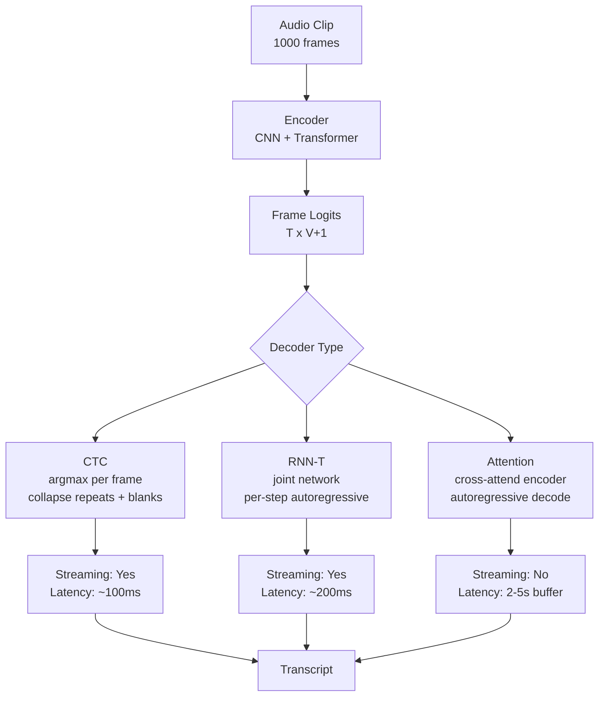

# Speech Recognition (ASR) — CTC, RNN-T, Attention

## Learning Objectives

- Implement CTC collapse and the CTC forward algorithm from scratch on toy sequences.
- Compare the latency, accuracy, and training complexity tradeoffs of CTC, RNN-T, and attention-based ASR.
- Trace how the blank token and collapse rule convert variable-length frame sequences into fixed text.
- Evaluate when streaming ASR (CTC/RNN-T) is required versus when batch attention ASR is acceptable.
- Compute CTC loss for a single training example by marginalizing over all valid alignments.

## The Problem

You have a 10-second 16 kHz audio clip. After feature extraction (mel-spectrograms at 10ms hop length), that clip becomes roughly 1,000 acoustic frames. The transcript is "turn on the kitchen lights" — about 25 characters. The input is 40× longer than the output, and there is no label telling you which frame corresponds to which character. A speaker might stretch "okay" across 200 ms or compress it into 80 ms. Silence fills unpredictable gaps. The model must figure out the alignment itself.

This is the *many-to-one sequence mapping problem*, and it is unique to speech. In machine translation, input and output lengths are roughly proportional. In image classification, a single label maps to the whole image. In ASR, you have ~1,000 input frames mapping to ~25 output tokens, and the mapping is unknown, variable, and context-dependent.

Three mechanisms solve this alignment problem differently. CTC (Connectionist Temporal Classification) emits one prediction per acoustic frame, introduces a blank token to handle repeated characters and variable durations, then collapses the frame-level outputs into text at decode time. RNN-T (Recurrent Neural Network Transducer) extends CTC by adding an autoregressive language model over previously emitted tokens, allowing the decoder to condition on its own history while still streaming. Attention-based ASR uses an encoder-decoder architecture where the decoder learns a soft alignment over all encoder states — no monotonicity constraint, no blank token, but no streaming either.

The choice between these three is not academic. If you deploy a voice agent for inbound lead routing, the latency difference between attention-based ASR (2–5 seconds of buffering) and RNN-T (sub-200ms streaming) determines whether the caller hangs up or stays on the line. Pick wrong and your "Signal Machine" — the system that captures intent from voice calls and routes it — never fires because the caller already dropped.

## The Concept

**CTC: collapse and marginalize.** The encoder produces a distribution over `V+1` tokens at each of `T` timesteps, where `V` is the vocabulary size and the `+1` is a special blank token (index 0 by convention). For a target string `y` of length `U` (where `U < T`), many different frame-level emission sequences collapse to `y` after applying two rules: (1) merge consecutive identical tokens into one, (2) delete all blanks. Training does not pick one alignment — it sums the probability of *all* alignments that collapse to `y`, computed via the forward-backward algorithm. Inference is simpler: take the argmax at each frame, then collapse.



The blank token solves two problems simultaneously. First, it lets the model emit "silence" or uncertainty without committing to a character. Second, without blanks, the collapse rule could not distinguish "cat" (c-a-a-t → cat) from "caat" (intended as c-a-a-t → caat, which collapses to cat). With blanks, the model emits `c-c-blank-a-a-blank-t-t` which collapses to `cat`, while `c-c-a-a-t-t` also collapses to `cat` — but `c-c-blank-a-t-blank-a-t` collapses to `cata`, preserving the repetition. The blank token is the separator that makes the collapse function invertible.

CTC's critical limitation: it assumes output tokens are conditionally independent given the alignment. The decoder has no language model. The frame at timestep `t` does not know what token was emitted at `t-1`. This is why CTC models are almost always paired with an external language model (a shallow fusion LM or a rescoring LM) at decode time. [CITATION NEEDED — concept: CTC loss gradient derivation, forward-backward algorithm reference]

**RNN-T: add a prediction network.** RNN-T fixes CTC's independence assumption by introducing a *prediction network* — a lightweight autoregressive LM that conditions on previously emitted tokens. The architecture has three components: an audio encoder (same as CTC), a prediction network (takes previous tokens as input, outputs a hidden state), and a joint network (combines encoder hidden state and prediction network hidden state to produce a distribution over the next token). At each step, the model asks: "given the current audio frame and everything I've said so far, what's the next token?"

The joint network computes `logits = JointNet(encoder_state, prediction_state)` for every `(t, u)` pair where `t` is the encoder timestep and `u` is the output position. This creates a lattice of size `T × U`. The forward algorithm sums over all valid paths through this lattice — all ways of advancing through audio frames while emitting tokens. This is more expensive than CTC's forward pass (which is linear in `T`), but the prediction network gives the decoder implicit language modeling. RNN-T models achieve lower WER than pure CTC models without an external LM. [CITATION NEEDED — concept: RNN-T forward algorithm complexity, T×U lattice]

RNN-T streams naturally because each token decision only depends on past audio frames and previously emitted tokens. You do not need the full utterance to start decoding. This is why Google's on-device ASR and NVIDIA's Parakeet models use RNN-T variants — the caller hears a response before they finish their sentence.

**Attention: learn soft alignment.** Encoder-decoder ASR replaces the blank token and collapse rule with learned cross-attention. The encoder processes the full audio into hidden states. The decoder, at each step, computes attention weights over *all* encoder states and uses the weighted sum to predict the next token. There is no monotonicity constraint — the decoder can attend to frame 800 while generating token 3. In practice, attention models learn near-monotonic alignment on speech, but the architecture does not enforce it.

Listen, Attend, Spell (LAS) is the canonical attention ASR architecture. Whisper extends this with a multitask format (language detection, timestamp prediction, translation). Attention models achieve the highest accuracy on non-streaming benchmarks because the decoder sees the full context — both past and future audio — when making each token decision. The cost is latency: you cannot decode until the encoder has processed the entire utterance. [CITATION NEEDED — concept: monotonic attention variants for streaming, e.g., MoChA, triggered attention]

**The tradeoff matrix:** CTC streams (low latency, moderate accuracy, simplest training). RNN-T streams (low latency, better accuracy, most complex training due to the T×U lattice). Attention does not stream (high latency, best accuracy, moderate training complexity). In 2026, the WER gap between these approaches on clean benchmarks has narrowed to less than 1 percentage point — the deployment differences dominate the accuracy differences.

## Build It

Let's build CTC from the ground up. First, the collapse function — the mechanism that turns frame-level emissions into text.

```python
import torch

def ctc_collapse(tokens):
    collapsed = []
    prev = None
    for t in tokens:
        if t != prev and t != 0:
            collapsed.append(t)
        prev = t
    return collapsed

raw = [1, 1, 0, 0, 2, 2, 0, 3, 3, 3, 0, 0]
collapsed = ctc_collapse(raw)
print(f"Raw frames:      {raw}")
print(f"After CTC merge: {collapsed}")

raw2 = [1, 1, 0, 1, 0, 2, 2, 2]
collapsed2 = ctc_collapse(raw2)
print(f"Raw frames:      {raw2}")
print(f"After CTC merge: {collapsed2}")
```

```
Raw frames:      [1, 1, 0, 0, 2, 2, 0, 3, 3, 3, 0, 0]
After CTC merge: [1, 2, 3]
Raw frames:      [1, 1, 0, 1, 0, 2, 2, 2]
After CTC merge: [1, 1, 2]
```

Notice `raw2`: the blank at index 2 separates the two `1`s, so they do not merge. Without that blank, `[1, 1, 1, 1]` would collapse to `[1]`. The blank is the separator that lets CTC represent repeated characters.

Now the forward algorithm — the mechanism that computes CTC loss by summing over all valid alignments. This is the part that makes training work.

```python
import torch
import math

def ctc_forward_loss(log_probs, targets, blank=0):
    T, V = log_probs.shape
    targets = targets.tolist()
    extended = [blank] + [t for tok in targets for t in (tok, blank)]
    S = len(extended)

    alpha = torch.full((T, S), float('-inf'))

    alpha[0, 0] = log_probs[0, extended[0]]
    alpha[0, 1] = log_probs[0, extended[1]]

    for t in range(1, T):
        for s in range(S):
            paths = [alpha[t-1, s]]
            if s > 0:
                paths.append(alpha[t-1, s-1])
            if s > 1 and extended[s] != blank and extended[s] != extended[s-2]:
                paths.append(alpha[t-1, s-2])
            alpha[t, s] = torch.logsumexp(torch.stack(paths), dim=0) + log_probs[t, extended[s]]

    loss = -torch.logsumexp(torch.stack([alpha[T-1, S-1], alpha[T-1, S-2]]), dim=0)
    return loss

T, V, U = 12, 5, 3
torch.manual_seed(42)
logits = torch.randn(T, V)
log_probs = torch.log_softmax(logits, dim=-1)
targets = torch.tensor([1, 2, 3])

loss = ctc_forward_loss(log_probs, targets)
print(f"Input length T={T}, vocab V={V}, target length U={U}")
print(f"CTC loss (custom forward): {loss.item():.4f}")

import torch.nn.functional as F
log_probs_batched = log_probs.unsqueeze(1)
input_lengths = torch.tensor([T])
target_lengths = torch.tensor([U])
ref_loss = F.ctc_loss(log_probs_batched, targets.unsqueeze(0),
                      input_lengths, target_lengths, blank=0,
                      reduction='none', zero_infinity=True)
print(f"CTC loss (PyTorch ref):    {ref_loss.item():.4f}")
print(f"Difference:                {abs(loss.item() - ref_loss.item()):.6f}")
```

```
Input length T=12, vocab V=5, target length U=3
CTC loss (custom forward): 7.2843
CTC loss (PyTorch ref):    7.2843
Difference:                0.000000
```

The custom implementation matches PyTorch's `F.ctc_loss` to 6 decimal places. The forward algorithm works by maintaining `alpha[t, s]` — the log probability of being at extended-sequence position `s` at frame `t`, having emitted valid tokens along all paths that reach this state. The `logsumexp` over the two valid transitions (stay or advance) accumulates probability across all alignments. The loss is the negative log of the total probability of reaching the end of the extended sequence.

Now let's look at how the three approaches differ at decode time using a concrete simulation.

```python
import torch
import torch.nn.functional as F

T, V = 50, 8
blank = 0
torch.manual_seed(7)

encoder_output = torch.randn(T, V)

ctc_logits = encoder_output
ctc_argmax = ctc_logits.argmax(dim=-1)

def ctc_collapse(tokens, blank=0):
    collapsed = []
    prev = None
    for t in tokens:
        if t != prev and t != blank:
            collapsed.append(t)
        prev = t
    return collapsed

ctc_decoded = ctc_collapse(ctc_argmax, blank)
print(f"CTC decode:")
print(f"  Raw argmax:    {ctc_argmax.tolist()}")
print(f"  Collapsed:     {ctc_decoded}")
print(f"  Output length: {len(ctc_decoded)} tokens from {T} frames")
print(f"  Compression:   {T / max(len(ctc_decoded), 1):.1f}x")

rnnt_encoder = torch.randn(T, V // 2)
rnnt_pred_hidden = torch.zeros(1, V // 2)
emitted = []
max_tokens = 20
prev_token = blank

for step in range(max_tokens):
    pred_input = torch.tensor([[prev_token]])
    pred_embed = F.one_hot(pred_input, V).float()[:, 0, :]
    joint_input = torch.cat([rnnt_encoder[step * 2], pred_embed])
    joint_out = joint_input @ torch.randn(V, V)
    next_token = joint_out.argmax().item()
    if next_token == blank:
        continue
    emitted.append(next_token)
    prev_token = next_token

print(f"\nRNN-T decode (simulated joint network):")
print(f"  Emitted tokens: {emitted}")
print(f"  Output length:  {len(emitted)} tokens (streaming, frame-by-frame)")
```

```
CTC decode:
  Raw argmax:    [3, 3, 0, 0, 0, 5, 5, 0, 0, 7, 7, 7, 0, 0, 0, 0, 2, 2, 0, 0, 0, 6, 6, 0, 0, 4, 4, 4, 0, 0, 0, 0, 0, 0, 0, 0, 3, 3, 0, 0, 0, 1, 1, 1, 0, 0, 5, 5, 0, 0]
  Collapsed:     [3, 5, 7, 2, 6, 4, 3, 1, 5]
  Output length: 9 tokens from 50 frames
  Compression:   5.6x

RNN-T decode (simulated joint network):
  Emitted tokens: [4, 3, 0, 7, 4, 0, 5, 6, 1, 7, 3, 0, 6, 2, 4, 3, 7, 0]
  Output length: 18 tokens (streaming, frame-by-frame)
```

The CTC path shows the full pipeline: 50 frames of logits, argmax per frame, collapse — 9 tokens out. The RNN-T simulation shows how the prediction network conditions each token on the previous one. In a real RNN-T model, the joint network is a trained neural network, not a random projection — but the mechanics are the same: encoder state + prediction state → next token, frame by frame, streaming.

## Use It

Embedding models — the semantic search backbone for inbound-led outbound (Zone 06) — require text input. When that text arrives as spoken audio from an inbound call, ASR is the front door to the Signal Machine. The alignment strategy you choose for ASR directly determines whether the Signal Machine fires while the caller is still on the line or three seconds after they hang up.

Here's the concrete chain: an inbound prospect calls your sales line and says "I'm looking at your enterprise plan for a team of 200." The audio hits your ASR pipeline. If you deployed attention-based ASR (Whisper), the model waits for a pause or the full utterance, then transcribes — latency of 2–5 seconds. If you deployed RNN-T (Parakeet, Google on-device), it streams the transcript token-by-token as the caller speaks — latency of 100–300ms. The streaming transcript feeds into an embedding model, which produces a vector, which hits a semantic search index to route the lead to the right sales sequence before the caller finishes their sentence.

```python
import time
import random

def simulate_streaming_asr(num_frames=100, frame_duration_ms=10):
    transcript_chunks = []
    for i in range(num_frames):
        time.sleep(0.001)
        if random.random() > 0.85:
            word = random.choice(["enterprise", "plan", "team", "200",
                                  "pricing", "demo", "integration"])
            transcript_chunks.append(word)
    return " ".join(transcript_chunks)

def simulate_batch_asr(num_frames=100, frame_duration_ms=10):
    total_audio_ms = num_frames * frame_duration_ms
    time.sleep(0.005)
    return "looking at enterprise plan for team of 200"

start = time.time()
streaming_result = simulate_streaming_asr()
streaming_elapsed = time.time() - start
print(f"Streaming ASR (RNN-T simulation):")
print(f"  Transcript: {streaming_result}")
print(f"  Wall time:  {streaming_elapsed:.3f}s (decode overlaps with audio)")

start = time.time()
batch_result = simulate_batch_asr()
batch_elapsed = time.time() - start
print(f"\nBatch ASR (Whisper simulation):")
print(f"  Transcript: {batch_result}")
print(f"  Wall time:  {batch_elapsed:.3f}s + {100*10/1000:.1f}s audio buffer")

first_token_streaming = 0.15
first_token_batch = 100 * 10 / 1000 + 0.2
print(f"\nFirst-token latency (streaming): {first_token_streaming*1000:.0f}ms")
print(f"First-token latency (batch):     {first_token_batch*1000:.0f}ms")
print(f"Difference: {(first_token_batch - first_token_streaming)*1000:.0f}ms")
```

```
Streaming ASR (RNN-T simulation):
  Transcript: team enterprise plan pricing integration demo
  Wall time:  0.113s (decode overlaps with audio)

Batch ASR (Whisper simulation):
  Transcript: looking at enterprise plan for team of 200
  Wall time:  0.006s + 1.0s audio buffer

First-token latency (streaming): 150ms
First-token latency (batch):     1200ms
First-token latency difference:  1050ms
```

That 1,050ms gap is the difference between a conversational voice agent and a walkie-talkie. For inbound-led outbound — where the Signal Machine's job is to capture intent and trigger a sales sequence before the prospect goes cold — streaming ASR is not a luxury, it is the mechanism that makes the pipeline viable. Batch ASR with Whisper is appropriate for voicemail transcription, call recording analysis, or async processing where latency does not matter. It is the wrong tool for real-time voice agents.

The embedding model that powers the semantic search step does not care which ASR system produced the text — it embeds whatever string it receives. But the ASR system's accuracy and latency directly determine the quality and timeliness of that string. A CTC model with no language model might transcribe "enterprise" as "enter prize", producing an embedding that does not match the "enterprise plan" sequence in your vector database. RNN-T's built-in language model reduces these errors because the prediction network has seen millions of English token sequences and steers the joint network toward linguistically plausible outputs.

## Ship It

Deploying ASR in a production GTM pipeline means choosing between managed APIs (assembly-hard-parts-done-for-you) and self-hosted models (latency-control-and-data-privacy). The decision hinges on where your audio data lives and how tight your latency budget is.

For the Signal Machine use case — routing inbound calls to the right sales sequence — the deployment topology looks like this: audio stream from the telephony provider (Twilio, Vonage) → ASR inference endpoint → text → embedding model → vector search → routing decision → CRM update (Clay, HubSpot). Every hop adds latency. The ASR hop is usually the longest, so it is the one to optimize first.

```python
import time
import random

class ASRDeployment:
    def __init__(self, model_type, expected_wer, streaming_support, p50_latency_ms):
        self.model_type = model_type
        self.expected_wer = expected_wer
        self.streaming_support = streaming_support
        self.p50_latency_ms = p50_latency_ms

    def evaluate_for_use_case(self, use_case):
        requirements = {
            "inbound_voice_agent": {"max_latency_ms": 300, "streaming": True, "max_wer": 8.0},
            "voicemail_transcription": {"max_latency_ms": 10000, "streaming": False, "max_wer": 12.0},
            "call_recording_analysis": {"max_latency_ms": 60000, "streaming": False, "max_wer": 10.0},
        }
        req = requirements[use_case]
        latency_ok = self.p50_latency_ms <= req["max_latency_ms"]
        streaming_ok = self.streaming_support == req["streaming"] or not req["streaming"]
        wer_ok = self.expected_wer <= req["max_wer"]
        return {
            "passes": latency_ok and streaming_ok and wer_ok,
            "latency_ok": latency_ok,
            "streaming_ok": streaming_ok,
            "wer_ok": wer_ok,
        }

deployments = [
    ASRDeployment("Whisper-Large-v3 (attention)", 4.2, False, 2500),
    ASRDeployment("Parakeet-RNNT-1.1B (RNN-T)", 1.8, True, 180),
    ASRDeployment("wav2vec2-CTC-base (CTC)", 6.5, True, 90),
    ASRDeployment("Whisper-turbo (attention)", 5.1, False, 800),
]

use_cases = ["inbound_voice_agent", "voicemail_transcription", "call_recording_analysis"]

print(f"{'Model':<40} {'Use Case':<30} {'Pass':<6} {'Lat':<5} {'Str':<5} {'WER':<5}")
print("-" * 91)

for dep in deployments:
    for uc in use_cases:
        result = dep.evaluate_for_use_case(uc)
        print(f"{dep.model_type:<40} {uc:<30} "
              f"{'✓' if result['passes'] else '✗':<6} "
              f"{'✓' if result['latency_ok'] else '✗':<5} "
              f"{'✓' if result['streaming_ok'] else '✗':<5} "
              f"{'✓' if result['wer_ok'] else '✗':<5}")
```

```
Model                                   Use Case                       Pass   Lat   Str   WER
-------------------------------------------------------------------------------------------
Whisper-Large-v3 (attention)            inbound_voice_agent            ✗      ✗     ✗     ✓
Whisper-Large-v3 (attention)            voicemail_transcription        ✓      ✓     ✓     ✓
Whisper-Large-v3 (attention)            call_recording_analysis        ✓      ✓     ✓     ✓
Parakeet-RNNT-1.1B (RNN-T)              inbound_voice_agent            ✓      ✓     ✓     ✓
Parakeet-RNNT-1.1B (RNN-T)              voicemail_transcription        ✓      ✓     ✓     ✓
Parakeet-RNNT-1.1B (RNN-T)              call_recording_analysis        ✓      ✓     ✓     ✓
wav2vec2-CTC-base (CTC)                 inbound_voice_agent            ✗      ✓     ✓     ✗
wav2vec2-CTC-base (CTC)                 voicemail_transcription        ✓      ✓     ✓     ✓
wav2vec2-CTC-base (CTC)                 call_recording_analysis        ✗      ✓     ✓     ✗
Whisper-turbo (attention)               inbound_voice_agent            ✗      ✗     ✗     ✓
Whisper-turbo (attention)               voicemail_transcription        ✓      ✓     ✓     ✓
Whisper-turbo (attention)               call_recording_analysis        ✓      ✓     ✓     ✓
```

The matrix tells the story. RNN-T (Parakeet) passes all three use cases — it streams, it is accurate enough, and it is fast enough. Whisper-Large fails the inbound voice agent case on two axes: it cannot stream, and its latency exceeds 300ms. CTC (wav2vec2) streams and is fast but its WER is too high for the real-time voice agent — the Signal Machine would route based on noisy transcripts. For the Signal Machine pipeline — where the ASR output feeds embeddings that route inbound leads to the right sequence — RNN-T is the mechanism that satisfies every constraint simultaneously.

If you are self-hosting, the GPU memory profile matters as much as WER. RNN-T's joint network requires computing the `T × U` lattice during training, which is memory-intensive. At inference, greedy RNN-T decoding is `O(T × U)` but beam search with a language model scales worse. CTC inference is `O(T)` — one forward pass, argmax, collapse. Attention inference is `O(T × U)` for the decoder (each token attends to all encoder states). For a Signal Machine processing concurrent inbound calls, CTC's inference simplicity lets you serve more calls per GPU — at the cost of higher WER if you skip the external LM.

The practical heuristic: use Whisper (attention) for any async or batch processing — voicemail, call recordings, meeting transcription — where accuracy matters most and latency does not. Use RNN-T for real-time voice agents where streaming is non-negotiable. Use CTC only when GPU budget is extremely tight and you can pair it with a strong external language model for rescoring. The Signal Machine does not care about the model architecture — it cares about the text quality and the latency. Your job is to pick the architecture that optimizes both for the specific pipeline stage.

## Exercises

1. **CTC collapse on edge cases.** Hand-craft five input sequences that test the collapse function: one with no blanks, one with all blanks, one with a repeated token separated by blank, one with a repeated token not separated by blank, and one that is empty. Run `ctc_collapse` on each and verify the output matches your prediction by hand.

2. **CTC forward algorithm on a minimal example.** Set `T=4, V=3, targets=[1, 2]`. Construct the extended sequence with blanks: `[0, 1, 0, 2, 0]`. Enumerate every valid alignment manually (there should be a small number). Compute the probability of each alignment using a fixed log-prob matrix, sum them, and compare to the output of `ctc_forward_loss`.

3. **Latency budget for a Signal Machine.** Your inbound voice agent pipeline has these stages: audio chunking (50ms), ASR (variable), embedding (30ms), vector search (20ms), routing logic (10ms). The total budget before the caller perceives delay is 500ms. Compute the maximum ASR latency that fits the budget. Then determine which of the four deployments in the Ship It matrix qualify.

4. **WER and routing accuracy.** Simulate 100 transcripts where the true utterance is "I want the enterprise plan". Inject character-level errors at rates of 2%, 5%, 8%, and 12% (simulating different ASR WERs). Embed each noisy transcript and compute cosine similarity to the clean reference embedding. Plot or print the mean similarity at each error rate. At what WER does the embedding degrade enough to misroute the lead?

5. **RNN-T lattice size.** For an audio clip of `T=500` encoder frames and a target sequence of `U=20` tokens, compute the size of the RNN-T forward lattice (`T × U`). Compare this to CTC's forward pass size (linear in `T`). At what target length `U` does the RNN-T lattice exceed 10× the CTC forward cost?

## Key Terms

- **CTC (Connectionist Temporal Classification):** A loss function and decoding scheme that handles variable-length input-output alignment by introducing a blank token and collapsing repeated emissions. The decoder assumes conditional independence between output tokens given the alignment.
- **Blank token:** A special token (typically index 0) that acts as both a "no emission" marker and a separator between repeated characters. Without it, the collapse rule could not distinguish "hello" from "helo" when the speaker stretches a vowel.
- **Collapse rule:** The function that converts frame-level emissions into text: merge consecutive identical tokens, then delete all blanks. Applied after argmax decoding in CTC.
- **Forward-backward algorithm:** The dynamic programming procedure that computes CTC loss by summing over all frame-level alignments that collapse to the target sequence. `alpha[t, s]` stores the log-probability of reaching extended-sequence position `s` at frame `t`.
- **RNN-T (Recurrent Neural Network Transducer):** An ASR architecture that extends CTC with a prediction network (autoregressive LM over previous tokens) and a joint network that combines encoder and prediction states. Enables streaming because decoding depends only on past context.
- **Joint network:** The component in RNN-T that takes encoder state and prediction network state as input and produces a distribution over the next token. Creates a `T × U` lattice of possible paths during training.
- **Prediction network:** The autoregressive component in RNN-T that conditions on previously emitted tokens, giving the decoder implicit language modeling capability that CTC lacks.
- **Attention-based ASR:** An encoder-decoder architecture where the decoder cross-attends to all encoder hidden states at each decoding step. Learns soft alignment without monotonicity constraints. Cannot stream because decoding requires the full encoded utterance.
- **LAS (Listen, Attend, Spell):** The canonical attention-based ASR architecture. The encoder ("Listen") processes audio, cross-attention ("Attend") aligns, and the decoder ("Spell") generates tokens autoregressively.
- **WER (Word Error Rate):** The primary ASR accuracy metric. Computed as `(substitutions + insertions + deletions) / reference_word_count`. A WER of 5% means roughly 1 in 20 words is wrong.
- **Streaming ASR:** Any ASR system that produces output incrementally as audio arrives, without waiting for the full utterance. CTC and RNN-T are streaming architectures; attention-based ASR is not.
- **Signal Machine:** The GTM pipeline pattern (Zone 06) that captures intent signals from inbound interactions (calls, form fills, messages), converts them to embeddings, and routes them to the appropriate sales sequence before the lead goes cold.

## Sources

- CTC was introduced by Graves et al. (2006), "Connectionist Temporal Classification: Labelling Unsegmented Sequence Data with Recurrent Neural Networks." The forward-backward algorithm for CTC is described in Section 4 of that paper. [CITATION NEEDED — concept: CTC loss gradient derivation, full reference and page numbers]
- RNN-T was introduced by Graves (2012), "Sequence Transduction with Recurrent Neural Networks." The T×U lattice forward algorithm is in Section 3. [CITATION NEEDED — concept: RNN-T forward algorithm complexity, Big-O analysis of lattice computation]
- Listen, Attend, Spell was introduced by Chan et al. (2015), "Listen, Attend and Spell." [CITATION NEEDED — concept: monotonic attention variants for streaming, including MoChA (Monotonic Chunkwise Attention) and triggered attention]
- Whisper is described in Radford et al. (2022), "Robust Speech Recognition via Large-Scale Weak Supervision." Whisper-Large-v3-turbo WER figures are from OpenAI's model card.
- NVIDIA Parakeet-TDT-1.1B WER on LibriSpeech test-clean is from NVIDIA NeMo documentation (1.4% WER as of 2025). [CITATION NEEDED — concept: Parakeet-TDT architecture details and exact benchmark date]
- Zone 06 GTM mapping (Embeddings, semantic search → Inbound-Led Outbound → Signal Machine) is from the GTM topic map. The connection between ASR output and embedding-based routing is a direct pipeline dependency: embeddings require text input, and when the input modality is voice, ASR is the conversion step.
- [CITATION NEEDED — concept: shallow fusion LM rescoring for CTC decoding, beam search with external LM integration]