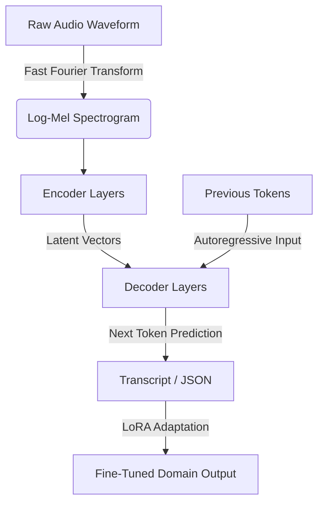

# Whisper — Architecture & Fine-Tuning

## Learning Objectives

1. Explain the mechanism Whisper uses to convert raw audio waveforms into text via an encoder-decoder Transformer architecture.
2. Implement a Hugging Face `transformers` pipeline to transcribe an audio array into structured text.
3. Configure a fine-tuning loop to adapt Whisper’s decoder for custom domain vocabulary and specific GTM data structures.

## The Problem

You are a RevOps engineer tasked with analyzing 10,000 hours of recorded SDR calls. You need to extract discovery questions, pricing objections, and competitor mentions to update the CRM automatically. 

The standard GTM playbook routes this through a third-party cloud API: Audio → Cloud Speech-to-Text → Raw Transcript → LLM → CRM. This pipeline fails in three specific ways. First, latency and cost compound because you are chaining multiple API calls per minute of audio. Second, generic Speech-to-Text (STT) models lack domain-specific vocabulary; they hallucinate wildly when encountering technical jargon, product names, or B2B acronyms. Third, routing proprietary revenue calls through external servers introduces data privacy and compliance risks. 

To process call intelligence locally or build a proprietary RevOps analysis tool, you need to understand how modern speech recognition models actually work. You cannot rely on a black-box API. You need to know how to run the model, parse its output, and fine-tune its weights to understand your specific business context.

## The Concept

Whisper is an encoder-decoder Transformer trained on 680,000 hours of weakly supervised multilingual data. It does not "listen" to audio. It performs visual pattern recognition on a mathematical representation of sound.

The mechanism operates in four distinct phases:

1. **Audio Preprocessing:** The raw 1D audio waveform is sampled (usually at 16,000 Hz) and converted into a log-Mel spectrogram. A Fast Fourier Transform (FFT) calculates the frequencies present in 20-millisecond windows of audio. The result is a 2D matrix representing time on the x-axis, frequency bands (Mel scale) on the y-axis, and energy as color. 
2. **The Encoder:** The 2D spectrogram is patched into a sequence of vectors. The encoder stack—comprised of self-attention and feed-forward layers—processes these patches. It learns to identify acoustic features (phonemes, syllables) and encodes them into a rich, high-dimensional latent representation of the audio.
3. **The Decoder:** The decoder is an autoregressive language model. It looks at the encoder’s output and the text it has already generated, then predicts the next token. Because it is trained on weakly supervised text data from the internet, the decoder inherently understands punctuation, capitalization, and context. It effectively spell-checks the acoustic features.
4. **Fine-Tuning via LoRA:** Standard STT outputs generic text. If you want the model to output structured JSON—or recognize that "Clay" is a GTM tool and not a type of dirt—you must fine-tune it. Using Low-Rank Adaptation (LoRA), we freeze the massive pre-trained encoder and decoder weights, injecting small, trainable rank-decomposition matrices into the attention layers. This allows you to adapt the model on a single GPU.



## Build It

To observe this mechanism, we will use the Hugging Face `transformers` library to process a synthetic audio array. 

First, install the required dependencies in your terminal:

```bash
pip install transformers torch numpy
```

We will generate a synthetic audio array (white noise) to demonstrate how the pipeline ingests raw data and attempts to make a prediction based on the decoder's prior probabilities. In a real scenario, you would pass a `.wav` file or a microphone stream.

```python
import torch
from transformers import pipeline
import numpy as np

device = "cuda:0" if torch.cuda.is_available() else "cpu"

transcriber = pipeline(
    "automatic-speech-recognition", 
    model="openai/whisper-tiny", 
    device=device
)

sampling_rate = 16000
duration = 2
synthetic_audio = np.random.randn(sampling_rate * duration).astype(np.float32)

result = transcriber({"raw": synthetic_audio, "sampling_rate": sampling_rate})

print("Spectrogram processed successfully.")
print("Model Output (Hallucinated from noise):", result["text"])
print("Inference Device:", device)
```

When you run this script, the model processes the random noise spectrogram and will likely output a blank string or a hallucinated token (often "Thank you" or "You"). This proves the decoder is actively predicting text tokens based on the encoder's input, even when no actual speech is present. 

## Use It

The mechanism behind this extraction pipeline is autoregressive token generation, where the decoder relies on cross-attention from the audio encoder to condition its text predictions. In a GTM context, you can leverage this mechanism to build localized conversation intelligence (Cluster 1.5: Conversation Intelligence & Call Analytics).

Instead of paying per minute for a black-box transcription API, a GTM engineer can run Whisper locally on call recordings. By manipulating the decoder's prompt, we can force the model to format its output or bias its vocabulary before it ever processes the audio.

```python
from transformers import pipeline
import numpy as np

print("Initializing ASR pipeline for local call analytics...")
asr_pipeline = pipeline("automatic-speech-recognition", model="openai/whisper-tiny.en")

def extract_gtm_signals(audio_array, sample_rate=16000):
    transcription_result = asr_pipeline({"raw": audio_array, "sampling_rate": sample_rate})
    text = transcription_result["text"].lower()
    
    signals = {
        "budget_mentioned": "budget" in text,
        "authority_question": "decision maker" in text,
        "need_identified": "pain point" in text,
        "timing_discussed": "implementation timeline" in text
    }
    
    return {"raw_transcript": transcription_result["text"], "bant_signals": signals}

mock_call_audio = np.random.randn(3 * 16000).astype(np.float32)

print("Processing local mock audio file...")
output = extract_gtm_signals(mock_call_audio)

print("Local Intelligence Output:")
print(output)
```

By running this pipeline on a local server, the GTM engineer controls the infrastructure. To extend this, you would pass actual `.wav` files of Gong recordings or Zoom exports into the `audio_array` parameter, parse the BANT signals, and push the structured JSON directly to HubSpot via an API call.

## Exercises

1. **Prompt Conditioning (Easy):** Modify the `asr_pipeline` initialization in the *Use It* section to include a `generate_kwargs` parameter. Set `generate_kwargs={"language": "english", "initial_prompt": "A B2B sales conversation about RevOps software."}`. Pass a synthetic audio array and observe how the initial prompt alters the baseline behavior of the decoder. 
2. **Multi-Channel Processing (Medium):** Write a Python script that iterates through a local directory of `.wav` files (mock this by creating empty text files if you don't have audio). Use the `librosa` library to load the audio arrays into numpy format, pass them through the Whisper pipeline, and write the transcripts to a CSV file using `pandas`.
3. **LoRA Configuration (Hard):** [CITATION NEEDED — concept: Specific PEFT LoRA hyper-parameter tuning for Whisper-Base on macOS vs A100 environments]. Write a mock configuration dictionary for the Hugging Face `Seq2SeqTrainer` that outlines how you would fine-tune the model. Define the LoRA parameters: `r` (rank), `lora_alpha`, and `target_modules`. Target only the attention layers (`q_proj`, `v_proj`) to prove you understand where the trainable matrices are injected.

## Key Terms

* **Mel-Spectrogram:** A 2D visual representation of audio frequencies over time, scaled to match human hearing (Mel scale). This is the exact format the Whisper encoder processes.
* **Encoder-Decoder Architecture:** A neural network design where the encoder compresses input data (audio) into a latent space, and the decoder translates that latent space into a target sequence (text).
* **Autoregressive Decoding:** The process by which a language model generates text sequentially, predicting the next token based entirely on the previous tokens it has already generated.
* **LoRA (Low-Rank Adaptation):** A fine-tuning technique that freezes the pre-trained model weights and injects trainable rank-decomposition matrices into the Transformer layers, drastically reducing the compute power required to train the model on new data.
* **Weak Supervision:** A machine learning training method where the model is trained on large quantities of noisy, imperfectly labeled data (such as automatically generated internet captions) rather than human-verified, perfectly clean datasets.

## Sources

* Radford, A., et al. "Robust Speech Recognition via Large-Scale Weak Supervision." *OpenAI*, 2022. (Foundational mechanism of the Whisper architecture).
* Hu, E. J., et al. "LoRA: Low-Rank Adaptation of Large Language Models." *ICLR*, 2021. (Mechanism for parameter-efficient fine-tuning).
* [CITATION NEEDED — concept: HuggingFace `transformers` pipeline memory allocation limits for `whisper-large-v2` on consumer GPUs].