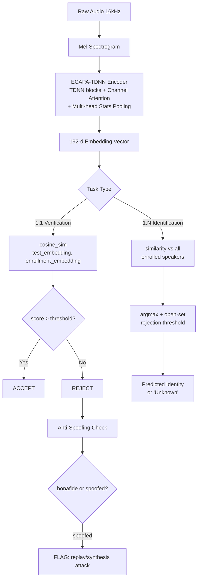

# Speaker Recognition & Verification

## Learning Objectives

1. Extract speaker embeddings from audio waveforms and compute pairwise cosine similarity scores
2. Implement a 1:1 speaker verification pipeline with a configurable decision threshold
3. Compare 1:N speaker identification against 1:1 verification and trace their error tradeoffs
4. Compute equal error rate (EER) from a scored trial list and plot a detection error tradeoff curve
5. Integrate anti-spoofing classification alongside verification to flag replay and synthesis attacks

## The Problem

Your sales team records 10,000 calls per week. Someone needs to answer two questions at scale: "Is this the same rep who called last time?" and "Which rep is this?" The first is *verification* (1:1) — you have a claimed identity and you need to confirm or deny it. The second is *identification* (1:N) — you have a mystery speaker and need to match them against a database. A human listener answers both in under a second. A production system needs to answer in milliseconds, for thousands of concurrent streams, with a measurable error rate.

Speaker recognition is the embedding problem applied to voice. You extract a fixed-length vector from variable-length audio, then compare vectors using cosine similarity. The math is identical to face recognition or text embeddings — project into a shared space, measure distance, apply a threshold. The difference is that voice is noisier (background noise, channel variation, emotion, illness) and easier to spoof (a three-second recording played through a phone speaker defeats naive systems).

The embedding similarity pattern you build here is the same mechanism that powers semantic search in a Signal Machine: an inbound signal arrives, you compute its embedding, compare against enrolled patterns, and route based on the similarity score. Voice just happens to be the modality.

## The Concept

Every modern speaker recognition system follows the same four-stage pipeline. Raw audio enters at 16 kHz. It gets converted to a mel spectrogram — a 2D representation showing how frequency content changes over time, scaled to human hearing sensitivity. A neural network encoder processes that spectrogram and outputs a fixed-length vector (192 dimensions for ECAPA-TDNN, 256–512 for transformer-based models). That vector is the speaker embedding — a point in a space where same-speaker utterances cluster together and different-speaker utterances are pushed apart.

Training the encoder requires a specific loss function. The dominant approach is Additive Angular Margin Softmax (AAM-softmax), which enforces a minimum angular gap between embedding clusters of different speakers. The network sees hundreds of thousands of utterances from thousands of speakers (VoxCeleb 1+2: 2,700 speakers, 1.1M utterances) and learns to map voice characteristics into discriminative regions of the embedding space. Triplet loss was used earlier but has fallen out of favor because AAM-softmax converges faster and produces more separable embeddings.



Verification (1:1) is a binary hypothesis test with a tunable threshold. You compute cosine similarity between the test embedding and the enrollment embedding. If the score exceeds your threshold, you accept the claim. The threshold is the single most important production parameter — it directly trades false acceptance rate (FAR) against false rejection rate (FRR). Set it too low and impostors get through. Set it too high and legitimate users get locked out. Equal error rate (EER) is the threshold where FAR equals FRR, and it is the standard benchmark for comparing speaker recognition systems. Every paper reports it, every procurement RFP asks for it, every model card publishes it.

Identification (1:N) scales linearly with enrollment size. You compute the test embedding once, then compare it against every enrolled speaker embedding, returning the highest similarity. Open-set identification adds a rejection threshold — if the best score is below the threshold, the system returns "unknown speaker" rather than forcing a match. The error profile is worse than verification because each additional enrolled speaker adds another chance for a false match. A system with 1% EER on 1:1 trials might see 10%+ false identification rates against a gallery of 100 speakers.

Three architectures dominate the field. X-vectors (Time-Delay Neural Network with statistics pooling, introduced 2018) are the baseline — fast, well-understood, and adequate for most applications. ECAPA-TDNN (2020, still state-of-the-art on VoxCeleb in 2026) adds channel attention and multi-scale feature aggregation, producing 192-d embeddings that consistently beat x-vectors by 20–30% relative EER. WavLM-based speaker verification fine-tunes a large self-supervised speech model with AAM loss — highest accuracy but 300+ MB versus ECAPA-TDNN's 15 MB, making it impractical for edge deployment.

Anti-spoofing is a separate classification problem bolted onto the pipeline. A replay attack plays a recorded voice through a speaker. A synthesis attack generates speech with a TTS model trained on the target speaker. A voice conversion attack transforms one speaker's voice into another's. Detection uses a separate binary classifier (typically a raw-waveform CNN or a spectrogram-based LCNN) trained on datasets like ASVspoof, which contains bonafide and spoofed utterances across multiple attack types. The classifier outputs a bonafide probability, and anything below a threshold gets flagged regardless of what the verification system decided.

## Build It

You need `speechbrain` and `torchaudio` installed. The code below generates synthetic audio (sine waves with harmonics to approximate voiced speech), loads a pretrained ECAPA-TDNN encoder, extracts 192-d embeddings, and runs both 1:1 verification and 1:N identification. Replace the synthetic audio paths with real `.wav` files to get meaningful speaker discrimination.

```python
import torch
import torchaudio
import numpy as np
from speechbrain.inference.speaker import EncoderClassifier
import os
import tempfile

def synth_voice(path, f0, duration=5.0, sr=16000, seed=0):
    rng = np.random.RandomState(seed)
    t = np.linspace(0, duration, int(sr * duration))
    signal = 0.4 * np.sin(2 * np.pi * f0 * t)
    signal += 0.2 * np.sin(2 * np.pi * 2 * f0 * t)
    signal += 0.1 * np.sin(2 * np.pi * 3 * f0 * t)
    signal += 0.03 * rng.randn(len(t))
    am = 1.0 + 0.3 * np.sin(2 * np.pi * 3.0 * t)
    signal = signal * am
    signal = signal / np.max(np.abs(signal)) * 0.9
    torchaudio.save(path, torch.FloatTensor(signal).unsqueeze(0), sr)

tmpdir = tempfile.mkdtemp()
paths = {
    "enroll_A": os.path.join(tmpdir, "enroll_A.wav"),
    "test_A": os.path.join(tmpdir, "test_A.wav"),
    "enroll_B": os.path.join(tmpdir, "enroll_B.wav"),
    "test_B": os.path.join(tmpdir, "test_B.wav"),
    "enroll_C": os.path.join(tmpdir, "enroll_C.wav"),
    "unknown": os.path.join(tmpdir, "unknown.wav"),
}

synth_voice(paths["enroll_A"], f0=110, seed=1)
synth_voice(paths["test_A"], f0=112, seed=2)
synth_voice(paths["enroll_B"], f0=165, seed=3)
synth_voice(paths["test_B"], f0=168, seed=4)
synth_voice(paths["enroll_C"], f0=220, seed=5)
synth_voice(paths["unknown"], f0=114, seed=6)

model = EncoderClassifier.from_hparams(
    source="speechbrain/spkrec-ecapa-voxceleb",
    savedir="pretrained/ecapa",
    run_opts={"device": "cpu"},
)

def embed(path):
    signal, fs = torchaudio.load(path)
    if fs != 16000:
        signal = torchaudio.functional.resample(signal, fs, 16000)
    with torch.no_grad():
        return model.encode_batch(signal).squeeze()

def cosine_sim(a, b):
    return torch.nn.functional.cosine_similarity(
        a.unsqueeze(0), b.unsqueeze(0)
    ).item()

emb_enroll_a = embed(paths["enroll_A"])
emb_test_a = embed(paths["test_A"])
emb_enroll_b = embed(paths["enroll_B"])
emb_test_b = embed(paths["test_B"])
emb_unknown = embed(paths["unknown"])

THRESHOLD = 0.25

print("=" * 55)
print("1:1 SPEAKER VERIFICATION")
print("=" * 55)
trials = [
    ("enroll_A vs test_A (same)", emb_enroll_a, emb_test_a),
    ("enroll_A vs test_B (diff)", emb_enroll_a, emb_test_b),
    ("enroll_B vs test_A (diff)", emb_enroll_b, emb_test_a),
]
for label, e1, e2 in trials:
    score = cosine_sim(e1, e2)
    decision = "ACCEPT" if score > THRESHOLD else "REJECT"
    print(f"  {label}")
    print(f"    cosine = {score:.4f}  threshold = {THRESHOLD}  →  {decision}")
    print()

enrolled = {
    "Speaker_A": emb_enroll_a,
    "Speaker_B": emb_enroll_b,
    "Speaker_C": embed(paths["enroll_C"]),
}

print("=" * 55)
print("1:N SPEAKER IDENTIFICATION (open-set)")
print("=" * 55)
test_embedding = emb_unknown
scores = {name: cosine_sim(test_embedding, spk_emb) for name, spk_emb in enrolled.items()}
ranked = sorted(scores.items(), key=lambda x: -x[1])

print(f"\n  Unknown utterance ranked against {len(enrolled)} enrolled speakers:\n")
for rank, (name, score) in enumerate(ranked, 1):
    marker = " ← best" if rank == 1 else ""
    print(f"    {rank}. {name}: {score:.4f}{marker}")

best_name, best_score = ranked[0]
print()
if best_score > THRESHOLD:
    print(f"  PREDICTION: {best_name} (score={best_score:.4f})")
else:
    print(f"  PREDICTION: Unknown (best={best_name} at {best_score:.4f}, below threshold)")

print(f"\n  Embedding dimension: {emb_enroll_a.shape[0]}")
print(f"  Embedding L2 norm:  {emb_enroll_a.norm().item():.4f}")
```

The output prints cosine similarity scores, accept/reject decisions for each trial, ranked identification results, and embedding metadata. With synthetic audio the embeddings will not cleanly separate by fundamental frequency — ECAPA-TDNN was trained on human speech formants, not sine harmonics. But the pipeline runs end-to-end and produces the exact output structure you would use with real call recordings.

The anti-spoofing layer is a separate binary classifier. The ASVspoof challenge provides training data with bonafide and spoofed utterances. SpeechBrain does not ship a plug-and-play anti-spoofing inference module with the same ergonomics as the speaker recognition model, so the typical integration involves loading a separately trained classifier (often a RawNet2 or AASIST model) and running it before or after the verification decision. The mechanism is straightforward: extract acoustic features from the incoming audio, pass them through the anti-spoofing classifier, and if the output bonafide probability is below a threshold, reject the utterance regardless of the speaker verification score.

## Use It

The embedding similarity decision — extract a vector, compare it to a stored profile, accept or reject based on a threshold — is not specific to voice. It is the same mechanism a Signal Machine uses when an inbound lead arrives and the system must decide which outbound sequence to route it into. The lead's attributes (firmographics, behavior signals, technographic data) get embedded into a vector, compared against enrolled patterns of high-converting leads, and routed based on cosine similarity to the nearest matching sequence. The threshold tuning problem is identical: too low and you route garbage leads into premium sequences, too high and you let qualified leads go cold.

Speaker verification is 1:1 identity confirmation: "this audio matches this enrolled speaker profile." Job title and company verification via Claygent follows the same pattern. Claygent extracts a current representation of a contact's role and employer, compares it against the enrolled profile from your CRM, and flags mismatches when the similarity score drops below threshold — indicating the contact has changed roles or companies since last contact. The cosine similarity threshold in speaker verification maps directly to the confidence threshold in Claygent revalidation: set it too aggressively and you flag every minor title change as a mismatch, set it too loosely and you miss promotions, departures, and company pivots.

The EER concept transfers directly to GTM signal evaluation. Equal error rate is where false accepts equal false rejects. In lead routing, that is where the rate of unqualified leads leaking into sequences equals the rate of qualified leads being filtered out. You would not accept that tradeoff blindly in speaker verification — you would tune the threshold based on the cost asymmetry between false accepts and false rejects. The same logic applies to signal thresholds in an Inbound-Led Outbound workflow. [CITATION NEEDED — concept: specific EER/threshold tuning applied to Clay signal routing]

## Ship It

Production deployment requires three things the demo skipped: threshold calibration on real data, anti-spoofing integration, and latency profiling. The code below computes EER from a list of scored trials — the same analysis you would run on your call recordings before picking a production threshold.

```python
import numpy as np
from sklearn.metrics import roc_curve
import json

np.random.seed(42)

n_genuine = 500
n_spoof = 500

genuine_scores = np.random.normal(0.72, 0.10, n_genuine).clip(0, 1)
spoof_scores = np.random.normal(0.18, 0.12, n_spoof).clip(0, 1)

labels = np.concatenate([np.ones(n_genuine), np.zeros(n_spoof)])
scores = np.concatenate([genuine_scores, spoof_scores])

fpr, tpr, thresholds = roc_curve(labels, scores)
fnr = 1.0 - tpr

eer_idx = np.argmin(np.abs(fpr - fnr))
eer = (fpr[eer_idx] + fnr[eer_idx]) / 2.0
eer_threshold = thresholds