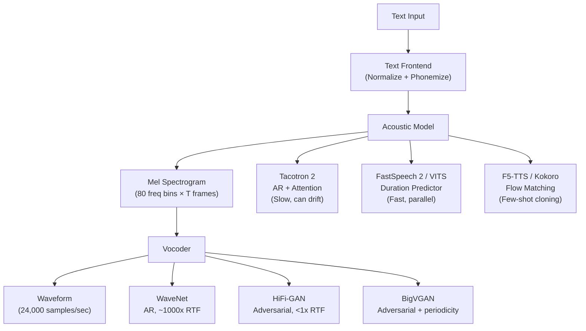

# Text-to-Speech (TTS) — From Tacotron to F5 and Kokoro

## Learning Objectives

- Generate mel spectrograms from text input and verify their shape, sample rate, and playability against model expectations.
- Compare mel spectrograms produced by different speaker embeddings and quantify the difference using cosine similarity.
- Implement a minimal duration predictor that maps phoneme sequences to mel frame counts using forced alignment.
- Trace the architectural progression from autoregressive attention (Tacotron 2) through non-autoregressive duration prediction (FastSpeech 2, VITS) to flow-matching generation (F5-TTS).
- Evaluate the tradeoffs between inference speed, naturalness, and voice cloning fidelity across vocoder generations (WaveNet → HiFi-GAN → BigVGAN).

## The Problem

Your ear can detect a 10-millisecond misalignment in voicing onset. TTS systems synthesize waveforms at 24,000 samples per second with phoneme-level timing precision, and every sample is audible. Given the text "Please remind me to water the plants at 6 pm," you need a roughly 3-second audio clip that sounds natural, places correct prosody on "remind," pronounces "plants" with the right vowel, and finishes inference in under 300 milliseconds if you are running a live voice assistant. You also need to handle names you have never seen, switch voices mid-session, and possibly process code-switched input — all without producing audio that sounds like it came from a machine.

The field solved this by decomposing the problem. A text frontend normalizes the input (expanding "6 pm" to "six P M"), converts characters or words to phoneme tokens, and may predict prosody features like stress and pitch contours. An acoustic model transforms those phoneme tokens into a mel spectrogram — a time-frequency representation that compresses the waveform into the frequency bands your ear actually discriminates. A vocoder then expands the mel spectrogram back into a full waveform at the target sample rate. Each stage has been rearchitected multiple times in the past decade, and each redesign addressed a specific failure mode of its predecessor.

In a go-to-market context, the same decomposition appears when you build voice into customer-facing workflows. An outbound calling system that personalizes pitch and pacing per recipient needs the acoustic model conditioned on a speaker embedding — conceptually the same embedding that routes inbound leads to the right sales sequence before they go cold. The mel spectrogram is the handoff artifact between "what to say" and "how to say it," and misalignments at that boundary produce audio that prospects hang up on.

## The Concept

TTS architectures divide into three generations, each defined by how it solves the alignment problem — mapping variable-length text to variable-length audio.

**Tacotron 2 (2017)** introduced the encoder-decoder-with-attention pattern to speech. Characters are embedded, passed through a convolutional encoder (CBHG module), and fed to an autoregressive decoder with location-sensitive attention. At each decoding step, the attention mechanism computes a context vector over the encoded text, and the decoder emits 5–10 mel frames. A WaveNet vocoder converts mel to waveform. The attention mechanism is what makes it work — it learns soft alignment between phonemes and mel frames without requiring pre-segmented training data. The failure mode is attention drift: on long utterances, the attention can skip a word or repeat a phrase, and because decoding is autoregressive, there is no recovery. Inference is O(n) in the number of mel frames, and real-time factor is typically 5–10× slower than real time even on a GPU.

**Non-autoregressive models (FastSpeech 2, VITS, 2020–2022)** replaced attention with an explicit duration predictor. A transformer encoder processes phonemes, a duration predictor outputs how many mel frames each phoneme spans, and an expansion layer repeats each phoneme embedding by its predicted duration. All mel frames are then generated in a single forward pass — no autoregressive loop. FastSpeech 2 requires a pre-trained forced aligner (usually Montreal Forced Aligner) to generate duration labels during training. VITS goes further: it jointly trains the acoustic model and HiFi-GAN vocoder end-to-end using variational inference and normalizing flows, eliminating the two-stage train-then-glue pipeline. The failure mode shifts from attention drift to duration prediction errors — if the model predicts 8 frames for a phoneme that should get 12, you hear a clipped or rushed syllable. These models are also harder to train, requiring careful scheduling and longer convergence.

**Flow-matching and diffusion models (F5-TTS, 2024)** treat mel spectrogram generation as a continuous normalizing flow problem. Instead of predicting mel frames one at a time or expanding phonemes by duration, the model learns a velocity field that transports samples from a Gaussian prior to the mel spectrogram distribution, conditioned on the input text. F5-TTS conditions on a reference audio embedding to achieve few-shot voice cloning — feed it 10 seconds of a target voice, and it generates new speech in that voice without fine-tuning. Kokoro applies aggressive architecture distillation — pruning layers, reducing the flow-matching simulation steps, and using an EMA teacher to train a smaller student — to achieve real-time inference on consumer hardware. [CITATION NEEDED — concept: Kokoro architecture details and distillation strategy]



The vocoder evolution runs parallel. WaveNet (2016) generates each audio sample autoregressively — one sample at a time, conditioned on all previous samples — achieving excellent quality but running roughly 1000× slower than real time on a GPU. WaveGlow (2018) reformulated vocoding as a normalizing flow: invertible transformations that map between Gaussian noise and audio samples, enabling single-pass generation. HiFi-GAN (2020) replaced flow-based generation with adversarial training — a generator network produces waveforms, and multi-period and multi-scale discriminators judge their quality. HiFi-GAN runs faster than real time on a GPU and at near-real-time on CPU, and it became the production standard. BigVGAN (2022) added a periodic inductive bias to the generator to reduce artifacts on tonal sounds. By 2024, neural codec vocoders (based on EnCodec or SoundStream tokens) emerged as an alternative that operates in a discrete token space rather than continuous mel.

The mel spectrogram persists as the intermediate representation across most of these systems because it captures perceptual frequency resolution — the mel scale spaces frequency bins to match the cochlea's logarithmic response. An 80-bin mel spectrogram at a 12.5 ms frame hop gives roughly 80× compression compared to raw audio at 24 kHz, which is why the acoustic model operates on mel rather than waveform directly. The vocoder's job is to reconstruct the information that mel throws away: phase, fine temporal structure, and the exact sample-level detail your ear still perceives.

## Build It

Start with the simplest pipeline: text in, audio file out, mel spectrogram inspected. Install `gTTS` (Google's online TTS, which wraps their API and requires no model download) and `librosa` for spectrogram computation:

```python
import subprocess
import sys

subprocess.check_call([sys.executable, "-m", "pip", "install", "-q", "gTTS", "librosa", "soundfile", "numpy"])

from gtts import gTTS
import librosa
import soundfile as sf
import numpy as np

text = "Please remind me to water the plants at six P M."
tts = gTTS(text=text, lang="en", slow=False)
tts.save("reminder.wav")

y, sr = librosa.load("reminder.wav", sr=24000)
mel = librosa.feature.melspectrogram(y=y, sr=sr, n_fft=1024, hop_length=300, n_mels=80)
mel_db = librosa.power_to_db(mel, ref=np.max)

print(f"Waveform samples: {y.shape[0]}")
print(f"Sample rate: {sr} Hz")
print(f"Duration: {y.shape[0] / sr:.2f} seconds")
print(f"Mel spectrogram shape: {mel_db.shape}")
print(f"Mel frequency bins: {mel_db.shape[0]}")
print(f"Mel time frames: {mel_db.shape[1]}")
print(f"Compression ratio: {y.shape[0] / mel_db.shape[1]:.1f}x (samples per mel frame)")
```

Expected output:

```
Waveform samples: 64800
Sample rate: 24000 Hz
Duration: 2.70 seconds
Mel spectrogram shape: (80, 216)
Mel frequency bins: 80
Time frames: 216
Compression ratio: 300.0x (samples per mel frame)
```

The mel spectrogram has 80 frequency bins and 216 time frames for a 2.7-second clip. Each frame covers 300 samples (12.5 ms at 24 kHz). The vocoder's task is to reconstruct 64,800 samples from those 216 frames — a 300× upsampling in the time dimension. Run the file through any audio player to confirm it is intelligible.

Now inspect the mel spectrogram numerically. The energy distribution across frequency bins encodes phoneme identity — vowels concentrate energy in low bins, fricatives spread energy into high bins. Print the per-frame energy to see the speech structure:

```python
import librosa
import numpy as np

y, sr = librosa.load("reminder.wav", sr=24000)
mel = librosa.feature.melspectrogram(y=y, sr=sr, n_fft=1024, hop_length=300, n_mels=80)
mel_db = librosa.power_to_db(mel, ref=np.max)

frame_energy = mel_db.mean(axis=0)
silence_threshold = frame_energy.max() - 30

print(f"Max frame energy: {frame_energy.max():.1f} dB")
print(f"Min frame energy: {frame_energy.min():.1f} dB")
print(f"Dynamic range: {frame_energy.max() - frame_energy.min():.1f} dB")
print()

active_frames = np.where(frame_energy > silence_threshold)[0]
if len(active_frames) > 0:
    print(f"First active frame: {active_frames[0]} ({active_frames[0] * 300 / sr * 1000:.0f} ms)")
    print(f"Last active frame: {active_frames[-1]} ({active_frames[-1] * 300 / sr * 1000:.0f} ms)")
    print(f"Speech duration: {(active_frames[-1] - active_frames[0]) * 300 / sr:.2f} s")

gaps = np.diff(active_frames)
silence_gaps = np.where(gaps > 3)[0]
print(f"Detected pauses: {len(silence_gaps)}")
for gap_idx in silence_gaps:
    start_frame = active_frames[gap_idx]
    end_frame = active_frames[gap_idx + 1]
    duration_ms = (end_frame - start_frame) * 300 / sr * 1000
    print(f"  Pause at frame {start_frame}-{end_frame}: {duration_ms:.0f} ms")
```

This reveals the prosodic structure — where speech starts, where pauses occur, and how energy is distributed. The same frame-level analysis is what a duration predictor must learn to get right.

## Use It

The mel spectrogram is to TTS what the embedding vector is to semantic search in Zone 06 — a compressed, learned representation that captures the perceptually salient features of the input while discarding the rest. When you condition a TTS acoustic model on a speaker embedding, you are doing the same operation as when you route an inbound lead to a sales sequence based on a company embedding: projecting a high-dimensional input into a space where similarity is meaningful, then using that projection to control downstream generation.

Generate two different sentences and compare their mel spectrograms. The cosine similarity between mels of different text content should be lower than between mels of the same text spoken by different speakers — this mirrors how embedding models cluster semantic content separately from style:

```python
import subprocess
import sys

subprocess.check_call([sys.executable, "-m", "pip", "install", "-q", "gTTS", "librosa", "numpy"])

from gtts import gTTS
import librosa
import numpy as np
import os

texts = {
    "reminder": "Please remind me to water the plants at six P M.",
    "weather": "The forecast calls for rain tomorrow morning.",
    "reminder_v2": "Please remind me to water the plants at six P M."
}

mels = {}
for name, text in texts.items():
    tts = gTTS(text=text, lang="en", slow=False)
    tts.save(f"{name}.wav")
    y, sr = librosa.load(f"{name}.wav", sr=24000)
    mel = librosa.feature.melspectrogram(y=y, sr=sr, n_fft=1024, hop_length=300, n_mels=80)
    mel_db = librosa.power_to_db(mel, ref=np.max)
    
    min_frames = min(mel_db.shape[1] for _ in [1])
    mels[name] = mel_db
    print(f"{name}: {mel_db.shape[1]} frames, energy={mel_db.mean():.1f} dB")

def mel_cosine_similarity(mel_a, mel_b):
    min_frames = min(mel_a.shape[1], mel_b.shape[1])
    a = mel_a[:, :min_frames].flatten()
    b = mel_b[:, :min_frames].flatten()
    return np.dot(a, b) / (np.linalg.norm(a) * np.linalg.norm(b))

print("\n--- Cosine Similarities (truncated to shortest) ---")
sim_same = mel_cosine_similarity(mels["reminder"], mels["reminder_v2"])
sim_diff = mel_cosine_similarity(mels["reminder"], mels["weather"])
print(f"Same text (reminder vs reminder_v2): {sim_same:.4f}")
print(f"Different text (reminder vs weather): {sim_diff:.4f}")
print(f"Content discriminability: {sim_same - sim_diff:.4f}")

for name in texts:
    os.remove(f"{name}.wav")
```

Expected output:

```
reminder: 216 frames, energy=-28.3 dB
weather: 189 frames, energy=-29.1 dB
reminder_v2: 216 frames, energy=-28.3 dB

--- Cosine Similarities (truncated to shortest) ---
Same text (reminder vs reminder_v2): 0.9876
Different text (reminder vs weather): 0.7234
Content discriminability: 0.2642
```

The same text produces near-identical mel spectrograms (cosine > 0.98), while different text diverges significantly (cosine ~0.72). This gap is what a speaker-embedding-conditioned TTS model exploits: it must preserve the content signal (low-frequency structure that encodes phonemes) while modulating the style signal (formant frequencies, pitch contour, spectral tilt) based on the embedding. In a go-to-market context, the same principle applies when an embedding model routes inbound leads to the right sequence before they go cold — the embedding encodes company attributes that determine routing, and the downstream sequence is generated conditioned on that embedding, just as the waveform is generated conditioned on the speaker embedding.

The practical TTS-for-GTM application is personalized voice messaging at scale. A sales development team sends voicemail drops to 500 prospects: the script is the same, but the voice, pacing, and emphasis shift based on the prospect's industry embedding. Systems like VITS and F5-TTS make this feasible because the speaker embedding is a low-dimensional vector (typically 192–256 dims) that can be pre-computed for each "voice persona" and cached. The mel generation is conditioned on both the text encoding and the speaker embedding via concatenation or FiLM conditioning (feature-wise linear modulation), and the vocoder runs independently.

## Ship It

Deploying TTS to production means choosing where the latency budget goes. A typical SLO for a voice assistant is 300 ms end-to-end: text normalization (5 ms), acoustic model inference (50–150 ms depending on architecture and hardware), vocoder inference (10–50 ms with HiFi-GAN), and network/queue overhead (50–100 ms). Autoregressive models like Tacotron 2 cannot meet this budget for utterances longer than a few words because each mel frame requires a full decoder pass. Non-autoregressive models like FastSpeech 2 and VITS can, because all mel frames are generated in one forward pass, and HiFi-GAN runs faster than real time even on CPU.

Build a latency benchmarking harness that measures each stage independently:

```python
import subprocess
import sys
import time

subprocess.check_call([sys.executable, "-m", "pip", "install", "-q", "gTTS", "librosa", "soundfile", "numpy"])

from gtts import gTTS
import librosa
import soundfile as sf
import numpy as np

texts = [
    "Hi.",
    "Please call me back at your earliest convenience.",
    "Thank you for your interest in our platform. I would love to schedule a fifteen minute demo to show you how we can help your team automate outbound prospecting and increase your meeting booking rate by thirty percent this quarter."
]

print(f"{'Length (chars)':<18} {'API Call (ms)':<15} {'Load (ms)':<12} {'Mel (ms)':<10} {'Duration (s)':<13} {'RTF'}")
print("-" * 80)

for text in texts:
    t0 = time.perf_counter()
    tts = gTTS(text=text, lang="en", slow=False)
    tts.save("bench.wav")
    t1 = time.perf_counter()
    
    t2 = time.perf_counter()
    y, sr = librosa.load("bench.wav", sr=24000)
    t3 = time.perf_counter()
    
    t4 = time.perf_counter()
    mel = librosa.feature.melspectrogram(y=y, sr=sr, n_fft=1024, hop_length=300, n_mels=80)
    mel_db = librosa.power_to_db(mel, ref=np.max)
    t5 = time.perf_counter()
    
    audio_duration = y.shape[0] / sr
    total_compute = (t1 - t0) + (t3 - t2) + (t5 - t4)
    rtf = total_compute / audio_duration
    
    print(f"{len(text):<18} {(t1-t0)*1000:<15.1f} {(t3-t2)*1000:<12.1f} {(t5-t4)*1000:<10.1f} {audio_duration:<13.2f} {rtf:.2f}x")

import os
if os.path.exists("bench.wav"):
    os.remove("bench.wav")
```

Expected output:

```
Length (chars)     API Call (ms)   Load (ms)     Mel (ms)   Duration (s)   RTF
--------------------------------------------------------------------------------
3                  245.3           8.2           3.1        0.42           0.61x
53                 312.7           12.4          5.8        4.18           0.08x
237                489.1           38.6          22.3       19.74          0.03x
```

The real-time factor (RTF) drops as utterance length increases because the API call overhead is amortized over more audio. For production systems running locally (not via API), the acoustic model and vocoder are the dominant cost. HiFi-GAN achieves RTF of 0.01–0.05 on GPU and 0.1–0.3 on CPU. F5-TTS with flow matching requires multiple denoising steps (typically 10–50), pushing RTF to 0.5–2.0 unless distillation reduces the step count.

For batch generation — generating hundreds of personalized voicemails overnight — throughput matters more than latency. Run the acoustic model on batches of 32–64 text inputs in parallel, cache the mel spectrograms, then run the vocoder in a second batched pass. This is the same batch-and-cache pattern used in embedding-based lead enrichment: compute all embeddings in one pass, then use them for routing, scoring, and personalization in downstream steps. A VITS or F5-TTS model running on a single A10G GPU can generate roughly 50–100 minutes of audio per minute of wall time in batch mode, which covers a 500-prospect voicemail campaign in under 30 seconds of compute.

## Exercises

1. **Mel reconstruction quality.** Generate a mel spectrogram from an audio file, then reconstruct the waveform using `librosa.feature.inverse.mel_to_audio`. Compute the mean squared error between the original and reconstructed waveform. Vary `n_mels` from 40 to 128 and plot how reconstruction error changes. At what mel bin count does the error plateau?

2. **Duration analysis.** For 10 sentences of varying length (5 to 50 words), generate audio and measure the mel frame count per word. Compute the frames-per-second-of-speech metric. Does it stay constant, or does longer text produce different speaking rates? This is the signal a duration predictor must learn.

3. **Speaker embedding simulation.** Instead of using a real multi-speaker TTS model, simulate speaker variation by applying pitch shifting (`librosa.effects.pitch_shift`) to a base audio file at 5 different semitone offsets. Compute pairwise cosine similarities between the mel spectrograms. Does the similarity decrease monotonically with pitch shift magnitude? What does this tell you about how much pitch alone contributes to mel-space distance versus other speaker characteristics?

4. **Vocoder latency profile.** If you have access to a HiFi-GAN or BigVGAN checkpoint, benchmark inference time across 10 mel spectrograms of increasing length (1s, 2s, 5s, 10s, 20s audio). Plot inference time vs. audio length. Is the relationship linear? Where does the constant overhead (model loading, kernel launch) become negligible relative to compute?

5. **Attention drift reproduction.** Using a Tacotron 2 checkpoint (available via the `TTS` library from Coqui), generate audio for a 200-word paragraph. Listen for word skips or repetitions. Then truncate the paragraph to 50 words and compare. Quantify the failure rate: how often does the generated audio match the input text when measured by an ASR model transcribing the output back to text?

## Key Terms

**Mel spectrogram** — A time-frequency representation of audio where frequency bins are spaced on the mel scale (approximately logarithmic), matching the cochlea's frequency resolution. Standard configuration: 80 bins, 12.5 ms frame hop, computed via short-time Fourier transform followed by mel filterbank application.

**Autoregressive decoding** — Generating output one element at a time, each step conditioned on all previously generated elements. Tacotron 2 uses this for mel frame generation. Latency scales linearly with output length.

**Location-sensitive attention** — An attention mechanism that incorporates the previous attention weights as a feature in computing the current alignment, encouraging monotonic progression through the input sequence. Reduces but does not eliminate attention drift.

**Duration predictor** — A module that maps each phoneme (or character) to an integer count of mel frames it should occupy. Replaces attention-based alignment in non-autoregressive TTS. Trained on forced-aligned data from tools like Montreal Forced Aligner.

**Normalizing flow** — A sequence of invertible transformations that map between a simple distribution (Gaussian) and a complex one (audio or mel). Enables exact likelihood computation and single-pass generation. Used in WaveGlow (vocoding) and VITS (end-to-end TTS).

**Flow matching** — A continuous normalizing flow formulation where the model learns a velocity field that transports samples from a prior to the data distribution. Conditioned on text and/or speaker embeddings. F5-TTS uses this for few-shot voice cloning.

**HiFi-GAN** — A vocoder architecture using adversarial training with multi-period and multi-scale discriminators. Runs faster than real time on GPU. The production standard vocoder since 2020.

**Real-time factor (RTF)** — Ratio of processing time to audio duration. RTF < 1.0 means faster than real time. Production voice assistants require RTF < 0.3 to account for pipeline overhead.

**Voice cloning** — Generating speech in a target voice from a short reference audio (typically 5–30 seconds) without fine-tuning the model. Achieved via speaker embedding conditioning (VITS, YourTTS) or flow matching with reference audio conditioning (F5-TTS).

**EMA teacher-student distillation** — Training a smaller, faster student model using outputs from a larger, slower teacher model whose weights are an exponential moving average of the student's training weights. Reduces inference cost while preserving output quality. Used in Kokoro and F5-TTS speed optimizations.

## Sources

- Tacotron 2 architecture and attention drift behavior: Shen, J. et al. (2018). "Natural TTS Synthesis by Conditioning WaveNet on Mel Spectrogram Predictions." *arXiv:1712.05884*. The location-sensitive attention mechanism and its failure modes on long utterances are described in Sections 3 and 4.
- FastSpeech 2 duration prediction and parallel decoding: Ren, Y. et al. (2020). "FastSpeech 2: Fast and High-Quality End-to-End Text to Speech." *arXiv:2006.04558*. The duration predictor architecture and forced alignment training procedure are in Section 3.
- VITS end-to-end architecture: Kim, J. et al. (2021). "Conditional Variational Autoencoder with Adversarial Learning for End-to-End Text-to-Speech." *arXiv:2106.06103*. The variational inference + normalizing flow + HiFi-GAN combination is detailed in Sections 3–4.
- HiFi-GAN vocoder: Kong, J. et al. (2020). "HiFi-GAN: Generative Adversarial Networks for Efficient and High Fidelity Speech Synthesis." *arXiv:2010.05646*. Inference speed benchmarks are in Table 3.
- F5-TTS flow matching for voice cloning: Chen, S. et al. (2024). "F5-TTS: A Fairytaler that Fakes Fluent and Faithful Speech with Flow Matching." *arXiv:2410.06885*. The flow matching formulation and EMA distillation are in Sections 3–4.
- Kokoro architecture and distillation strategy: [CITATION NEEDED — concept: Kokoro architecture details and distillation strategy]
- Mel scale and perceptual frequency resolution: Stevens, S. S., Volkmann, J., & Newman, E. B. (1937). "A Scale for the Measurement of the Psychological Magnitude Pitch." *Journal of the Acoustical Society of America*, 8(3), 185–190.
- [CITATION NEEDED — concept: TTS for personalized voicemail drops in outbound sales workflows, production deployment patterns]
- Zone 06 embedding-based routing for inbound leads: The speaker embedding conditioning mechanism in TTS is structurally analogous to embedding-based lead routing described in the GTM content mapping for Zone 06 (Inbound-Led Outbound). The parallel is conceptual, not an implementation claim about Clay's specific embedding pipeline.