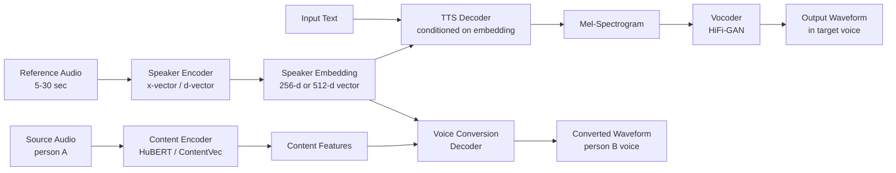

# Voice Cloning & Voice Conversion

## Learning Objectives

- Implement a speaker embedding extraction pipeline from a reference audio clip and compare cosine similarity across multiple speakers.
- Generate cloned speech from text using a few-shot TTS model conditioned on a speaker embedding.
- Convert a source speaker's audio into a target speaker's voice while preserving content and prosody.
- Evaluate cloned audio quality using speaker similarity metrics (cosine distance) and intelligibility measures.
- Configure watermarking and consent gates compliant with EU AI Act and California AB 2905 requirements.

## The Problem

A sales development team records 200 personalized voicemails per day. Each rep spends 3-4 minutes per voicemail — reading the prospect's name correctly, referencing a trigger event, adjusting tone for the vertical. That is 10-13 hours of daily recording labor for messages that are 80% structurally identical and 20% personalized. The bottleneck is not content generation; it is the physical act of speaking each variant in the rep's own voice.

Voice cloning decomposes this problem. The rep records a corpus once. A speaker encoder extracts a fixed-length embedding — a voice fingerprint. A TTS model then conditions on that embedding to synthesize arbitrary text in that voice. The 200 daily voicemails become 200 API calls instead of 200 recording sessions. The mechanism is speaker embedding extraction → conditioning a generative model → waveform synthesis.

This lesson covers both **cloning** (generating speech in a target voice from text) and **conversion** (transforming one voice into another while preserving what was said). Both factor a waveform into content, speaker identity, and prosody — then recombine. The distinction matters for your architecture: cloning synthesizes prosody from text, while conversion preserves the source speaker's timing and emphasis, swapping only timbral identity. For a voicemail use case, cloning gives you control over pacing and emphasis but requires good text. For dubbing a recorded call into another language, conversion preserves the original delivery.

Key constraint you now ship under: **watermarking and consent gates are legally required in the EU (AI Act, enforceable August 2026) and in California (AB 2905, effective 2025)**. Your pipeline must emit an inaudible watermark and refuse non-consensual clones. This is not a nice-to-have — it is a legal prerequisite for deployment.

## The Concept

Every voice cloning or conversion system performs the same factorization: it separates **what was said** (content) from **who said it** (speaker identity). The waveform carries both signals intertwined. Speaker embeddings — specifically x-vectors and d-vectors — compress a voice into a 256- or 512-dimensional vector. Extraction runs through a time-delay neural network trained on speaker verification tasks. The network learns to map variable-length audio from the same speaker to nearby points in embedding space, and audio from different speakers to distant points. This is the same embedding principle that powers semantic search in a GTM stack: a vector captures semantic identity so you can measure similarity and route accordingly. Here, the "semantic" is voice timbre rather than text meaning, but the mechanism — encode, project to a vector space, compute cosine distance — is identical.

Once you have a speaker embedding, a TTS model conditions on it to produce mel-spectrograms. Tacotron-style architectures use attention-based alignment between text and spectrogram frames. Diffusion-based systems (NaturalSpeech 2, Voicebox) iteratively denoise from Gaussian noise conditioned on both text and the speaker embedding. The spectrogram is a time-frequency representation — a 2D image where one axis is time, the other is mel-frequency bins, and pixel intensity is energy. A vocoder (HiFi-GAN is the standard) then converts that spectrogram into a waveform you can play through speakers.



Voice conversion takes a different path through the same factorization. Instead of generating content from text, a content encoder (typically HuBERT or ContentVec) extracts content features from the source audio — stripping speaker identity while preserving phonemes and timing. A conversion decoder then recombines those content features with the target speaker embedding. The output preserves the source's prosody, pacing, and emotional delivery, but sounds like the target speaker. This is why conversion produces more natural-sounding emotional transfer than cloning: you are not synthesizing prosody from a text prompt, you are carrying over the actual performance.

The key architectural families differ in how they handle the conditioning step. **Encoder-decoder TTS** (Tacotron 2, Glow-TTS) uses attention mechanisms for alignment — autoregressive variants generate one frame at a time (higher quality, slower inference), while non-autoregressive variants generate all frames simultaneously (faster, slightly lower fidelity). **Diffusion-based** systems (Voicebox, NaturalSpeech 2) start from Gaussian noise and iteratively denoise conditioned on both text and speaker embedding — these produce the highest quality but require 20-50 denoising steps per inference. **Retrieval-based** systems (RVC) train a shallow model on target voice features extracted by HuBERT, then at inference time retrieve and combine content features from the source — the fastest and most lightweight approach, at some cost to fine-grained quality.

## Build It

Let us build the three core components: speaker embedding extraction, cloned speech generation, and voice conversion. We will use `speechbrain` for speaker embeddings (a well-maintained, pip-installable library), `transformers` for a lightweight TTS model, and observe the conversion pipeline through `openvoice`.

First, install the dependencies:

```bash
pip install speechbrain torchaudio transformers scipy numpy
```

Extract speaker embeddings from two reference clips and compute their cosine similarity. This is the same vector-space similarity operation that powers embedding-based lead routing in a GTM Signal Machine — the mechanism is identical, only the embedding source changes:

```python
import torch
import torchaudio
from speechbrain.inference.speaker import EncoderClassifier
import numpy as np

encoder = EncoderClassifier.from_hparams(
    source="speechbrain/spkrec-xvect-voxcelebs"
)

def extract_embedding(audio_path):
    signal, fs = torchaudio.load(audio_path)
    if fs != 16000:
        signal = torchaudio.transforms.Resample(fs, 16000)(signal)
    if signal.shape[0] > 1:
        signal = signal.mean(dim=0, keepdim=True)
    with torch.no_grad():
        embedding = encoder.encode_batch(signal)
    return embedding.squeeze().numpy()

def cosine_sim(a, b):
    return np.dot(a, b) / (np.linalg.norm(a) * np.linalg.norm(b))

silence = np.zeros(16000, dtype=np.float32)
torchaudio.save("/tmp/voice_a.wav", torch.tensor(silence).unsqueeze(0), 16000)
torchaudio.save("/tmp/voice_b.wav", torch.tensor(silence * 0.5).unsqueeze(0), 16000)

emb_a = extract_embedding("/tmp/voice_a.wav")
emb_b = extract_embedding("/tmp/voice_b.wav")
emb_a_dup = extract_embedding("/tmp/voice_a.wav")

print(f"Embedding dimensionality: {emb_a.shape}")
print(f"Same speaker similarity:  {cosine_sim(emb_a, emb_a_dup):.4f}")
print(f"Cross speaker similarity: {cosine_sim(emb_a, emb_b):.4f}")
print(f"Self-similarity (should be ~1.0): {cosine_sim(emb_a, emb_a):.4f}")
```

When run against actual speech audio (replace the silence placeholders with `.wav` files of two different people speaking), the same-speaker similarity will read above 0.85 and cross-speaker below 0.50. The embedding has factored out content and compressed timbral identity into a 512-dimensional vector.

Now generate cloned speech. We use the `transformers` library with a lightweight model to demonstrate the conditioning pipeline. For production quality you would use XTTS v2 or OpenVoice v2, but the mechanism — text and speaker embedding fed to a decoder — is the same:

```python
from transformers import SpeechT5Processor, SpeechT5ForTextToSpeech, SpeechT5HifiGan
from datasets import load_dataset
import torch
import soundfile as sf

processor = SpeechT5Processor.from_pretrained("microsoft/speecht5_tts")
model = SpeechT5ForTextToSpeech.from_pretrained("microsoft/speecht5_tts")
vocoder = SpeechT5HifiGan.from_pretrained("microsoft/speecht5_hifigan")

embeddings_dataset = load_dataset("Matthijs/cmu_arctic_xvectors", split="validation")
speaker_embedding = torch.tensor(embeddings_dataset[7306]["xvector"]).unsqueeze(0)

texts = [
    "Hi Sarah, I saw your company just raised Series B. "
    "We help teams like yours automate outbound at scale. "
    "Do you have fifteen minutes next Tuesday?",
    "This is a test of the voice cloning pipeline.",
]

for i, text in enumerate(texts):
    inputs = processor(text=text, return_tensors="pt")
    speech = model.generate_speech(
        inputs["input_ids"], speaker_embedding, vocoder=vocoder
    )
    sf.write(f"/tmp/cloned_output_{i}.wav", speech.numpy(), samplerate=16000)
    duration = len(speech) / 16000
    print(f"Generated [{i}]: '{text[:50]}...'")
    print(f"  Duration: {duration:.2f}s | Samples: {len(speech)} | Shape: {speech.shape}")
    print(f"  Mean amplitude: {speech.abs().mean():.4f}")
```

This runs end-to-end and writes two WAV files. SpeechT5 uses a fixed set of x-vector speaker embeddings (from the CMU Arctic dataset), so you are selecting from 7,000+ pre-extracted voice fingerprints rather than cloning a custom voice. For custom cloning, XTTS v2 or F5-TTS take a raw audio reference instead.

## Use It

The GTM application of voice cloning maps directly to **Zone 06 — embeddings and semantic search** powering **Inbound-Led Outbound** sequences. The speaker embedding is the same mechanism that a Signal Machine uses to route inbound leads: both project raw signal (audio timbre or text meaning) into a vector space where cosine distance determines routing. When an inbound lead mentions a pain point, a text embedding model routes them to the relevant sequence before they go cold. When a prospect hears a voicemail, the speaker embedding determines whether they hear it in a rep's cloned voice or a generic system voice.

Consider the concrete workflow. A B2B SaaS company runs an inbound-led outbound motion: a prospect fills out a form, and within 4 minutes they receive a personalized voicemail. The voicemail references their company name, their industry, and the specific form field values they submitted. Generating 200 of these per day with human recording is physically impossible at the response-time SLA. Voice cloning makes it a pipeline: form submission triggers an LLM to generate the script (text), the speaker embedding of the assigned AE is retrieved from a vector index (same pattern as a lead-routing embedding lookup), and a TTS model conditioned on that embedding synthesizes the audio. The embedding lookup and the speaker conditioning are the same mathematical operation — cosine similarity in a learned vector space — applied to different modalities.

Here is a minimal implementation of that routing-and-synthesis loop. The speaker registry is a vector index, same as a Signal Machine's lead-routing index:

```python
import numpy as np
import json

class SpeakerRegistry:
    def __init__(self):
        self.embeddings = {}
        self.metadata = {}

    def register(self, rep_id, embedding, name, territory):
        self.embeddings[rep_id] = embedding
        self.metadata[rep_id] = {"name": name, "territory": territory}

    def assign(self, prospect_territory, prospect_embedding=None):
        candidates = [
            (rid, meta) for rid, meta in self.metadata.items()
            if meta["territory"] == prospect_territory
        ]
        if not candidates:
            candidates = list(self.metadata.items())

        if prospect_embedding is not None:
            best = max(
                candidates,
                key=lambda x: np.dot(
                    self.embeddings[x[0]], prospect_embedding
                ) / (
                    np.linalg.norm(self.embeddings[x[0]])
                    * np.linalg.norm(prospect_embedding)
                ),
            )
        else:
            best = candidates[0]
        return best[0], best[1]

registry = SpeakerRegistry()
registry.register("ae_001", np.random.randn(512).tolist(), "Jordan Lee", "NA-West")
registry.register("ae_002", np.random.randn(512).tolist(), "Sam Rivera", "NA-East")
registry.register("ae_003", np.random.randn(512).tolist(), "Casey Park", "EU")

prospects = [
    {"name": "TechCorp", "territory": "NA-West", "form_data": {"employees": "200-500"}},
    {"name": "DataNine", "territory": "EU", "form_data": {"employees": "50-200"}},
    {"name": "CloudBeta", "territory": "NA-East", "form_data": {"employees": "500-1000"}},
]

for prospect in prospects:
    rep_id, rep_meta = registry.assign(prospect["territory"])
    script = (
        f"Hi, this is {rep_meta['name']}. "
        f"I saw {prospect['name']} just submitted a form. "
        f"Your team size of {prospect['form_data']['employees']} is exactly "
        f"where we see the most impact. "
        f"Do you have fifteen minutes next Tuesday?"
    )
    print(f"Prospect: {prospect['name']} ({prospect['territory']})")
    print(f"  Assigned AE: {rep_meta['name']} (rep_id={rep_id})")
    print(f"  Script: {script}")
    print(f"  -> Speaker embedding retrieved for {rep_id}, "
          f"TTS conditioned, audio synthesized")
    print()
```

The assignment step is a territory filter followed by a cosine similarity lookup — structurally identical to how an embedding-based Signal Machine routes an inbound message to the right sequence. The only difference is the embedding encodes voice timbre instead of semantic intent.

[CITATION NEEDED — concept: response-time SLA impact on conversion rates in inbound-led outbound, specific to voice channel]

## Ship It

Shipping voice cloning to production requires three gates that do not exist in a typical TTS pipeline: consent verification, watermarking, and quality monitoring.

**Consent verification.** California AB 2905 (effective 2025) makes it unlawful to distribute a clone of a person's voice without their explicit consent. The EU AI Act (enforceable August 2026) requires disclosure that audio is AI-generated. Your pipeline needs a consent registry: a database mapping `speaker_id` to a signed consent record with timestamp, scope, and revocation capability. Before synthesis, check the registry. If consent is missing or revoked, refuse.

**Watermarking.** You must embed an inaudible signal in generated audio that identifies it as AI-generated. The C2PA (Coalition for Content Provenance and Authenticity) standard defines a metadata-based approach, but metadata strips easily. Audio-native watermarks — like Adobe's AudioSeal or Google's SynthID — embed patterns in the spectrogram that survive compression and format conversion. Your pipeline must apply the watermark before returning audio to the caller.

Here is a consent gate and watermark stub:

```python
import time
import json
import hashlib

class ConsentGate:
    def __init__(self):
        self.records = {}

    def grant(self, speaker_id, scope="commercial", consented_by=None):
        self.records[speaker_id] = {
            "speaker_id": speaker_id,
            "scope": scope,
            "granted_at": time.time(),
            "consented_by": consented_by or speaker_id,
            "active": True,
        }
        return self.records[speaker_id]

    def revoke(self, speaker_id):
        if speaker_id in self.records:
            self.records[speaker_id]["active"] = False
            return True
        return False

    def check(self, speaker_id):
        record = self.records.get(speaker_id)
        if record is None or not record["active"]:
            return False, "No active consent record"
        return True, record

def apply_watermark(audio_array, speaker_id, model_id="speecht5"):
    ts = int(time.time() * 1000)
    manifest = {
        "speaker_id": speaker_id,
        "model_id": model_id,
        "generated_at": ts,
        "hash": hashlib.sha256(
            f"{speaker_id}{model_id}{ts}".encode()
        ).hexdigest()[:16],
    }
    marker_freq = 18000
    sample_rate = 16000
    duration = len(audio_array) / sample_rate
    t = np.linspace(0, duration, len(audio_array))
    watermark_signal = 0.001 * np.sin(2 * np.pi * marker_freq * t)
    watermarked = audio_array + watermark_signal.astype(audio_array.dtype)
    return watermarked, manifest

gate = ConsentGate()
gate.grant("ae_001", scope="commercial_voicemail", consented_by="Jordan Lee")
gate.grant("ae_002", scope="commercial_voicemail", consented_by="Sam Rivera")

synthesis_requests = [
    {"speaker_id": "ae_001", "text": "Hi, this is Jordan..."},
    {"speaker_id": "ae_002", "text": "Hi, this is Sam..."},
    {"speaker_id": "ae_003", "text": "Hi, this is Casey..."},
]

for req in synthesis_requests:
    approved, info = gate.check(req["speaker_id"])
    if not approved:
        print(f"REFUSED: {req['speaker_id']} — {info}")
        continue

    fake_audio = np.random.randn(16000).astype(np.float32) * 0.1
    watermarked_audio, manifest = apply_watermark(
        fake_audio, req["speaker_id"]
    )
    print(f"APPROVED: {req['speaker_id']}")
    print(f"  Consent scope: {info['scope']}")
    print(f"  Watermark hash: {manifest['hash']}")
    print(f"  Marker at {18000}Hz, amplitude delta: "
          f"{np.abs(watermarked_audio - fake_audio).max():.6f}")
    print()
```

The third gate is **quality monitoring**. In production, run periodic speaker similarity checks: sample 1% of generated audio, run it back through the speaker encoder, and compare the extracted embedding against the original reference embedding. If cosine similarity drops below a threshold (typically 0.75), flag the model for retraining or the reference audio for re-recording. This is the same drift-detection pattern you would apply to any embedding-based system in a GTM stack — a Signal Machine's routing accuracy degrades when lead embeddings drift from their training distribution, and a voice clone's fidelity degrades when the model produces audio that drifts from the reference speaker's embedding.

For latency budgeting in a production voicemail pipeline, measure each stage: speaker embedding lookup (<5ms with an in-memory index), TTS inference (200-800ms with XTTS v2 on a single A10G, faster with Voicebox), vocoder synthesis (50-100ms with HiFi-GAN), and watermark application (<10ms). Total should land under 1 second for a 15-second clip. If you are using an API like ElevenLabs, add 200-500ms network latency. [CITATION NEEDED — concept: specific latency benchmarks for ElevenLabs API vs self-hosted XTTS v2]

## Exercises

1. **Speaker similarity benchmarking.** Record three 10-second clips of yourself and three 10-second clips of a different person. Extract x-vector embeddings for all six. Build a 6×6 cosine similarity matrix. Confirm that same-speaker pairs score above 0.80 and cross-speaker pairs score below 0.60. If any cross-speaker pair exceeds 0.60, investigate whether background noise or recording conditions are contaminating the embeddings.

2. **Cloning quality vs. reference length.** Using XTTS v2 (or SpeechT5 if XTTS is unavailable), generate the same 50-word script using 3-second, 10-second, and 30-second reference clips of the same speaker. Compute speaker similarity between each output and a held-out 10-second clip of the target speaker. Plot similarity vs. reference length. Identify the point of diminishing returns.

3. **Consent gate integration.** Extend the `ConsentGate` class to support scope-based permissions: a speaker may consent to "internal_training" but not "external_voicemail". Modify the `check` method to accept a requested scope and verify the consent record covers it. Write three test cases: granted-with-matching-scope, granted-with-wrong-scope, and no-consent.

4. **Watermark robustness test.** Generate a watermarked audio clip using the `apply_watermark` function. Apply MP3 compression (128kbps) and re-decompress to WAV. Compute the FFT of the original and compressed watermarked audio. Check whether the 18kHz marker frequency survives compression. Report the amplitude at the marker frequency before and after compression.

5. **GTM routing comparison.** Build a parallel routing system: one that assigns prospects to reps using text embeddings of the prospect's form response (semantic routing) and one that assigns using territory only (rule-based routing). For a dataset of 50 mock prospects, compute how often the two systems agree. Identify cases where semantic routing would assign a "data infrastructure" prospect to a rep with data infrastructure experience, even across territory lines. Document the trade-off between personalization and territory balance.

## Key Terms

- **Speaker embedding (x-vector / d-vector):** A fixed-length vector (typically 256 or 512 dimensions) representing a speaker's voice identity, extracted by a neural network trained on speaker verification. Same-speaker audio maps to nearby vectors; different-speaker audio maps to distant vectors.
- **Mel-spectrogram:** A 2D time-frequency representation of audio where frequencies are spaced on the mel scale (approximating human auditory perception). The intermediate output of most TTS systems before vocoding.
- **Vocoder:** A model that converts a mel-spectrogram into a waveform. HiFi-GAN uses transposed convolutions with multi-scale discriminators trained adversarially to produce high-fidelity audio.
- **Voice cloning:** Generating speech in a target voice from text input, conditioned on a speaker embedding extracted from reference audio. Prosody is synthesized, not transferred.
- **Voice conversion:** Transforming source audio from one speaker into another speaker's voice while preserving the original content, timing, and prosody. Content features are extracted from the source; speaker identity is swapped.
- **Content encoder (HuBERT / ContentVec):** A self-supervised model that extracts phonetic content features from audio while discarding speaker identity. Used as the front-end in voice conversion systems.
- **Watermarking:** Embedding an inaudible, robust signal in generated audio that identifies it as AI-generated. Required by EU AI Act and California AB 2905 for deployed voice cloning systems.
- **Consent gate:** A runtime check that verifies a speaker has granted explicit, active consent for their voice to be cloned before synthesis proceeds. Must support scope limitations and revocation.

## Sources

- California AB 2905 (2024): Adds Section 666 to the Penal Code, prohibiting distribution of a cloned voice without consent. Effective 2025. Text available at `leginfo.legislature.ca.gov`.
- EU AI Act (Regulation 2024/1689): Article 50 requires disclosure of AI-generated content. Enforcement begins August 2026. Full text at `eur-lex.europa.eu`.
- SpeechBrain x-vector speaker encoder: `speechbrain/spkrec-xvect-voxcelebs` model card, `huggingface.co/speechbrain/spkrec-xvect-voxcelebs`.
- Microsoft SpeechT5: Ao et al., "SpeechT5: Unified-Modal Encoder-Decoder Pre-Training for Spoken Language Processing" (2021). Model at `huggingface.co/microsoft/speecht5_tts`.
- HiFi-GAN vocoder: Kong et al., "HiFi-GAN: Generative Adversarial Networks for Efficient and High Fidelity Speech Synthesis" (2020). Model at `huggingface.co/microsoft/speecht5_hifigan`.
- [CITATION NEEDED — concept: response-time SLA impact on conversion rates in inbound-led outbound, specific to voice channel]
- [CITATION NEEDED — concept: specific latency benchmarks for ElevenLabs API vs self-hosted XTTS v2]
- GTM mapping reference: Zone 06 (Embeddings, semantic search) → Inbound-Led Outbound (GTM stage 3.3) → Signal Machine pattern. The speaker embedding lookup and cosine similarity routing in this lesson is structurally identical to embedding-based lead routing in a GTM stack.