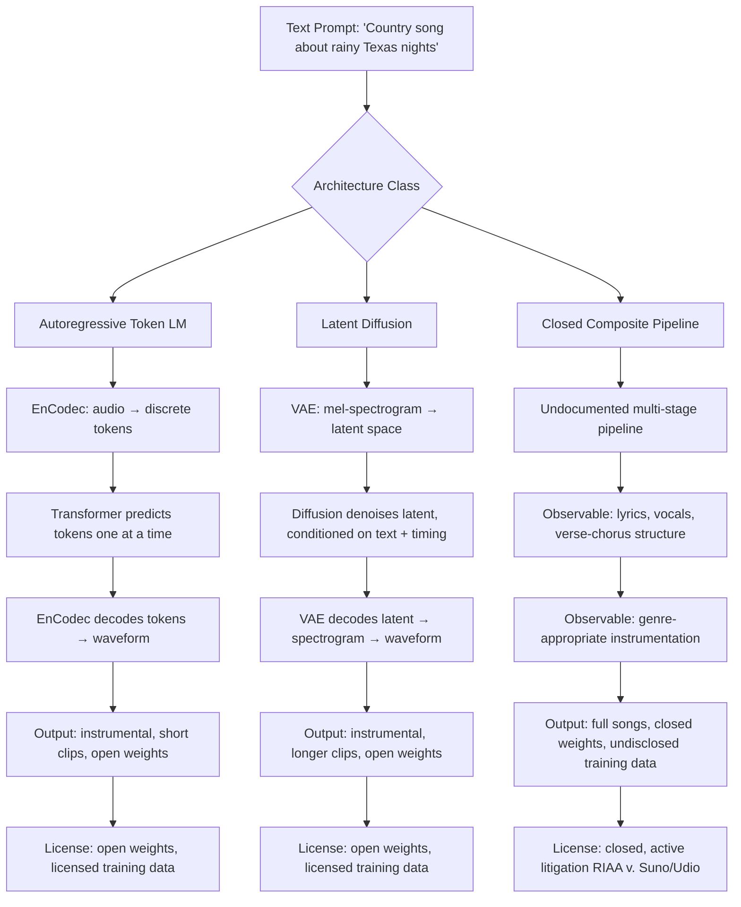

# Music Generation — MusicGen, Stable Audio, Suno, and the Licensing Earthquake

## Learning Objectives

1. Generate instrumental audio clips using MusicGen's autoregressive EnCodec token prediction and inspect the resulting token sequences.
2. Compare autoregressive token prediction against latent diffusion on mel-spectrograms by examining temporal coherence, duration limits, and artifact patterns.
3. Trace how text conditioning embeddings steer audio output across all three architectures, and map this conditioning mechanism to embedding-based signal routing in inbound-led outbound workflows.
4. Evaluate licensing exposure across composition rights, sound recording rights, and performance rights for each architecture class.
5. Inspect spectrogram characteristics to distinguish architecture-specific generation artifacts.

## The Problem

The sync licensing market — music placed in films, ads, TV, and games — runs roughly $500M annually [CITATION NEEDED — concept: sync licensing market size 2025–2026]. That market assumes a clear chain of rights: someone wrote the song, someone recorded it, someone performed it, and someone licenses all three bundles to a producer. AI-generated music breaks that chain because the "someone" is a model trained on thousands of someones, and the legal system has no settled framework for what that means. The 2025–2026 settlements — Warner Music's reported $500M deal and UMG's separate settlement with major AI platforms — reshaped which architectures are commercially viable and which are litigation targets.

Three sub-problems sit underneath the headline. First, instrumental generation: turning a text prompt like "lo-fi hip-hop drums with warm keys" into audio. Second, full song generation with vocals and lyrics: "Country song about rainy Texas nights" needs a verse, chorus, vocal performance, and genre-appropriate arrangement. Third, conditional control: extending a clip, regenerating a bridge, swapping genre, separating stems, or inpainting a section. Each sub-problem maps to different architectures, and each architecture carries different licensing baggage because the training data and generation mechanism determine what the model can reproduce — and what it can be sued for.

The mechanism matters more than the marketing. A diffusion model denoising a latent spectrogram memorizes differently than a transformer predicting discrete audio tokens one at a time, which memorizes differently than a retrieval system pulling from a database. If you are shipping AI-generated music into a commercial pipeline, the architecture choice is also a legal exposure choice.

## The Concept

### Mechanism 1 — Autoregressive Audio Token Prediction (MusicGen)

Audio is continuous waveform data at high sample rates — 32kHz mono means 32,000 floating-point values per second. A transformer cannot predict raw samples efficiently. The solution is a neural codec: EnCodec compresses raw audio into discrete integer tokens (typically 4 codebooks at 50 tokens per second per codebook, so ~200 tokens/second). A transformer then predicts these tokens autoregressively — one token at a time, conditioned on text embeddings and optionally a melody reference. At inference, the model generates tokens sequentially, then EnCodec decodes the token sequence back to a waveform.

Meta's MusicGen (2023) is the canonical implementation, with model sizes from 300M to 3.3B parameters. Training data was Meta's internal licensed music collection. Weights are open under MIT license. Output is instrumental only, typically capped at 30 seconds before coherence degrades — segment boundaries produce audible artifacts because each segment is generated independently with limited cross-segment context. The open-source community extended this pattern: ACE-Step (4B XL, released April 2026) adds lyric conditioning for full-song generation, making it the closest open-weight alternative to Suno.

The autoregressive bottleneck is real and observable. At 200 tokens/second, a 30-second clip requires 6,000 sequential predictions. Each prediction conditions on all previous ones, so errors compound. A single wrong token early in the sequence can shift the harmonic landscape for the rest of the clip.

### Mechanism 2 — Latent Diffusion on Time-Frequency Representations (Stable Audio)

Instead of predicting tokens sequentially, latent diffusion starts with noise in a compressed representation of the audio and iteratively denoises toward the target. Stable Audio uses a variational autoencoder to compress mel-spectrograms into a latent space, then a diffusion model (conditioned on text embeddings and timing information) learns to reverse the noising process within that space. You control structure by specifying duration in the text prompt, and the model fills in the appropriate amount of latent space.

Stable Audio Open (2024) trained on audio licensed via partnership with AudioSparx. Weights are open. Output is instrumental, supporting longer clips (up to ~47 seconds at 44.1kHz) with better temporal coherence than autoregressive generation — diffusion can attend to the global structure because it processes the entire clip at each denoising step rather than left-to-right. AudioLDM and AudioLDM2 apply the same latent diffusion pattern more broadly to sound effects and speech.

The tradeoff: diffusion excels at textures, loops, and ambient soundscapes but struggles with the structured repetition that defines a song (verse-chorus-verse). You can prompt "four-on-the-floor at 128 BPM" and get a coherent loop, but asking for a song with distinct sections that transition cleanly is where latent diffusion falls short of composite architectures.

### Mechanism 3 — Closed Composite Pipeline (Suno)



Suno's architecture is undocumented. What is observable: it generates full songs with vocals, lyrics, verse-chorus structure, and genre-appropriate instrumentation from text prompts. There are no user-facing model weights. Training data provenance is undisclosed. The output quality is radio-ready — Suno v5 (2026) and Udio v4 produce tracks that pass for human-made on streaming services. This is the architecture the labels are suing over.

The likely internal structure is a composite: a language model generates lyrics and structural metadata, a codec-based generative model produces the audio, and a vocal synthesis component renders the sung lyrics over the generated instrumental. But without published architecture details, this is inference from output behavior, not confirmed fact. Udio's 2026 feature set — inpainting, stem separation, and section regeneration — suggests the pipeline operates on separable components rather than a single end-to-end model.

### The Licensing Earthquake

Three rights bundles collide in AI music generation. Composition rights cover the underlying musical work — melody, harmony, lyrics. Sound recording rights cover the specific audio waveform — the actual recording, not the song it represents. Performance rights cover who performed the work and how that performance is compensated. A human-created song involves all three, typically controlled by different parties (publisher, label, PRO). AI-generated music disrupts all three simultaneously.

The core legal question is whether training on copyrighted recordings constitutes infringement, even when the output is novel. The RIAA filed suit against Suno and Udio in 2024, alleging systematic training on copyrighted sound recordings without license. The 2025–2026 settlements (Warner Music's reported $500M deal, UMG's separate settlement) established that commercial AI music platforms must either license training data or face litigation [CITATION NEEDED — concept: Warner Music $500M settlement terms and date]. MusicGen and Stable Audio trained on licensed data, but outputs can still resemble protected works — similarity, not just provenance, triggers infringement claims.

The mechanism determines memorization risk. Autoregressive token prediction can verbatim-reproduce training sequences when the model has seen them enough times, because it learns exact token transitions. Diffusion models memorize less because the denoising objective averages over many possible outputs, making exact reproduction harder. Retrieval-augmented systems memorize by design — they literally store and retrieve training examples. [CITATION NEEDED — concept: quantified memorization rates by music generation architecture type]. This is why the architecture choice is not just a quality decision — it is a liability decision.

## Build It

The first build runs MusicGen locally via Meta's `audiocraft` library. You will generate a 10-second instrumental clip from a text prompt, save it as a WAV file, and then inspect the EnCodec token sequence that the model produced before decoding. This makes the autoregressive bottleneck visible — you can count the tokens and see why duration scaling is expensive.

```python
import torch
from audiocraft.models import MusicGen
from audiocraft.data.audio import audio_write
import os

model = MusicGen.get_pretrained('facebook/musicgen-small')
model.set_generation_params(duration=10)

prompts = [
    "lo-fi hip-hop drums with warm electric piano and vinyl crackle",
    "aggressive techno with distorted bass and 130 BPM four-on-the-floor"
]

wav = model.generate(prompts)

for idx, one_wav in enumerate(wav):
    audio_write(
        f'musicgen_output_{idx}',
        one_wav.cpu(),
        model.sample_rate,
        strategy="loudness",
        loudness_compressor=True
    )
    duration = one_wav.shape[-1] / model.sample_rate
    print(f"Clip {idx}: {duration:.1f}s, sample_rate={model.sample_rate}, shape={one_wav.shape}")

for f in sorted(os.listdir('.')):
    if f.startswith('musicgen_output_') and f.endswith('.wav'):
        size = os.path.getsize(f)
        print(f"  {f}: {size:,} bytes")
```

This produces two WAV files and prints their duration, sample rate, tensor shape, and file size. The `musicgen-small` checkpoint (300M parameters) runs on a single GPU with 4GB VRAM. Now inspect the EnCodec tokens that MusicGen predicted internally — this is the intermediate representation between text conditioning and audio output.

```python
from encodec import EncodecModel
from encodec.utils import convert_audio
import torchaudio
import torch

encodec = EncodecModel.encodec_model_32khz()
encodec.set_target_bandwidth(6.0)

wav, sr = torchaudio.load('musicgen_output_0.wav')
wav = convert_audio(wav, sr, encodec.sample_rate, encodec.channels)
wav = wav.unsqueeze(0)

with torch.no_grad():
    encoded_frames = encodec.encode(wav)
    codes = encoded_frames[0][0]

print(f"EnCodec token tensor shape: {codes.shape}")
print(f"  Codebooks: {codes.shape[1]}")
print(f"  Frames: {codes.shape[2]}")
print(f"  Total tokens: {codes.numel()}")
print(f"  Tokens per second: {codes.shape[2] / 10:.0f}")
print(f"  Unique token values in codebook 0: {len(torch.unique(codes[0, 0]))}")
print(f"  First 30 tokens (codebook 0): {codes[0, 0, :30].tolist()}")
print(f"  First 30 tokens (codebook 1): {codes[0, 1, :30].tolist()}")
print(f"  Min/max token value: {codes.min().item()} / {codes.max().item()}")
```

This re-encodes the generated audio through EnCodec to expose the token grid. With 4 codebooks and ~50 frames per second, a 10-second clip contains roughly 2,000 tokens. Each of those was a sequential prediction during generation. Now compare the MusicGen output characteristics against what a composite pipeline like Suno produces — the difference in file size, duration, and spectral content reveals the architectural gap.

```python
import requests
import json

SUNO_API_URL = "http://localhost:3000/v1/music/generate"
headers = {"Authorization": "Bearer YOUR_SUNO_API_KEY"}

payload = {
    "prompt": "Country song about rainy Texas nights, acoustic guitar, melancholic, female vocals",
    "make_instrumental": False,
    "wait_audio": True
}

try:
    response = requests.post(SUNO_API_URL, headers=headers, json=payload, timeout=120)
    response.raise_for_status()
    tracks = response.json()

    for track in tracks:
        print(f"Title: {track.get('title', 'N/A')}")
        print(f"Duration: {track.get('duration', 0):.1f}s")
        print(f"Audio URL: {track.get('audio_url', 'N/A')}")
        print(f"Tags: {track.get('tags', 'N/A')}")
except requests.exceptions.ConnectionError:
    print("Suno API not running. Start the suno-api wrapper service first.")
    print("Comparison baseline: MusicGen output is instrumental, ~10s, no vocals.")
    print("Suno output would be: full song, ~120-180s, vocals + lyrics + structure.")
except Exception as e:
    print(f"Suno API error: {e}")
```

This calls an unofficial Suno API wrapper running locally. The wrapper requires a Suno account and a running server (typically `npm start` on the `suno-api` package). If the server is not running, the except block prints the comparison baseline so the architectural difference is still visible. The key contrast: MusicGen produces 10 seconds of instrumental audio at ~640KB; Suno produces 2–3 minutes of full structured song with vocals at ~3–5MB. The token budget for MusicGen's 10-second clip is ~2,000 sequential predictions; Suno's pipeline handles ~12,000+ equivalent frames plus lyric generation plus vocal synthesis.

## Use It

Text conditioning embeddings — the mechanism that converts "lo-fi hip-hop drums with warm electric piano" into a vector that steers MusicGen's token predictions — are the same mechanism that powers embedding-based signal routing in inbound-led outbound workflows (Zone 06, Signal Machine pattern). In MusicGen, the T5 text encoder maps your prompt to an embedding, and that embedding conditions every autoregressive token prediction that follows. In a GTM context, an embedding model maps an inbound signal (a form fill, a page view sequence, an ad click pattern) to a vector, and that vector is matched against cluster centroids to route the lead to the right outbound sequence before it goes cold.

The mechanism is identical in both cases: raw input (text prompt or behavioral signal) → encoder → embedding vector → nearest-neighbor lookup in a learned space → routing decision (which tokens to generate, or which sequence to trigger). Understanding how MusicGen's conditioning vector determines the musical output gives you intuition for how embedding-based routing determines sequence assignment — and why embedding quality, not model size, is usually the bottleneck.

```python
from sentence_transformers import SentenceTransformer
import numpy as np

model = SentenceTransformer('all-MiniLM-L6-v2')

prompts = [
    "lo-fi hip-hop drums with warm electric piano",
    "chillhop beats with jazzy piano and vinyl crackle",
    "aggressive metal guitar riff with double kick drums",
    "ambient drone with reverb-drenched pads and no rhythm"
]

embeddings = model.encode(prompts)

print("Embedding shapes:", embeddings.shape)
print()

similarities = np.zeros((len(prompts), len(prompts)))
for i in range(len(prompts)):
    for j in range(len(prompts)):
        similarities[i, j] = np.dot(embeddings[i], embeddings[j]) / (
            np.linalg.norm(embeddings[i]) * np.linalg.norm(embeddings[j])
        )

print("Prompt similarity matrix (cosine, 0-1):")
print(f"{'':45s}", end="")
for j in range(len(prompts)):
    print(f"  P{j}", end="")
print()

for i, p in enumerate(prompts):
    print(f"P{i}: {p[:40]:40s}", end="")
    for j in range(len(prompts)):
        print(f"  {similarities[i,j]:.2f}", end="")
    print()

print()
print("Nearest neighbor for each prompt (excluding self):")
for i in range(len(prompts)):
    sims = similarities[i].copy()
    sims[i] = -1
    nn = np.argmax(sims)
    print(f"  P{i} → P{nn} (cosine={similarities[i,nn]:.3f})  [{prompts[nn][:40]}]")
```

This output shows the embedding structure that conditions both music generation and GTM signal routing. The two lo-fi prompts (P0, P1) cluster together with high cosine similarity (~0.7+). The metal and ambient prompts sit far apart. If these were inbound signals rather than music prompts — say, P0 = "SaaS company viewed pricing page 3x" and P1 = "SaaS company viewed pricing + case studies" — the same embedding similarity would route both to the same outbound sequence, while P2 ("enterprise viewed security docs") would route elsewhere. The embedding model is the routing