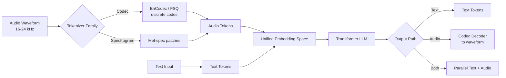

# Audio-Language Models: Qwen2.5-Omni, Audio Flamingo, GPT-4o Audio

## Learning Objectives

- **Compare** the architectures and modality-handling strategies of Qwen2.5-Omni, Audio Flamingo, and GPT-4o Audio
- **Explain** how raw audio waveforms get tokenized into discrete sequences a transformer can consume
- **Build** a Python pipeline that quantizes audio into tokens and fuses them with text tokens into a unified sequence

## The Problem

A BDR runs 40 discovery calls a week. Every call gets recorded in Gong. The transcript lands in HubSpot as plain text. Three weeks later, a RevOps analyst asks: "Which calls had a real pricing objection versus a polite brush-off?" The transcript can't answer, because the buyer said "that could work" with a flat, disengaged tone in one call and with a sharp, hesitant tone in another. Both transcripts render the same three words. The signal — prosody, hesitation, interruption — was discarded at the speech-to-text boundary.

This is the failure mode of the STT → LLM → TTS pipeline that has powered conversation intelligence for the last decade. Each conversion is lossy. The LLM never sees the audio; it sees the transcript's interpretation of the audio. Audio-language models close that gap by encoding audio tokens directly into the language model alongside text tokens, so the model reasons over the original waveform signal rather than its textual shadow.

## The Concept

Audio-language models share one substrate: they tokenize audio the same way text LLMs tokenize characters. The tokenizer is the mechanism that matters.

**Audio tokenization.** Raw audio is a 1D waveform sampled at 16–24 kHz. To feed this into a transformer, you need discrete tokens. Two families dominate:

1. **Codec-based tokenizers** (EnCodec, SoundStream, FSQ) compress the waveform into discrete codes via a neural encoder-decoder trained to reconstruct audio. Qwen2.5-Omni uses a Whisper-large-v3 encoder for speech understanding and a finite scalar quantization (FSQ) codec for speech generation. GPT-4o Audio uses a similar codec approach. These produce roughly 25–50 tokens per second of audio.

2. **Spectrogram-based tokenizers** convert audio to mel-spectrograms and patch-embed them like images. Audio Flamingo uses this approach, leveraging CLAP-style contrastive pretraining for audio-text alignment.

**Multimodal fusion.** Once audio is tokenized, the question is where it meets the text representation:

- **Late fusion** (Audio Flamingo's heritage): a separate audio encoder produces embeddings that get cross-attended with text embeddings before the decoder. Audio is a guest modality.
- **Unified fusion** (Qwen2.5-Omni, GPT-4o Audio): audio tokens enter the same embedding space as text tokens and flow through one transformer. Special boundary tokens (`<|audio_bos|>`, `<|audio_eos|>`) mark modality edges. The model treats audio as another sequence element.

**The Thinker-Talker split.** Qwen2.5-Omni separates reasoning from generation. The Thinker is the LLM producing latent text reasoning; the Talker is a smaller model converting that reasoning into streaming audio tokens. This separation lets the model reason before speaking — useful for any latency-sensitive application. GPT-4o Audio uses a similar decoupling with a separate text-to-speech decoder stage, though OpenAI has not fully documented the internal boundary.

**Streaming and VAD.** Real-time audio requires voice activity detection (VAD) to chunk the stream and decide when the user has stopped talking. GPT-4o Audio runs VAD continuously and supports barge-in interruption mid-response. Qwen2.5-Omni supports streaming inference but is more commonly deployed in batch mode. This distinction determines whether a model can power live coaching versus post-call analysis.



The three models differ in which boxes they implement and how aggressively they unify them. Qwen2.5-Omni is the most explicit about the separation, with a documented Thinker-Talker architecture. GPT-4o Audio is the most production-hardened for real-time conversation. Audio Flamingo is the most research-oriented, optimized for few-shot generalization across audio tasks rather than dialogue.

## Build It

This script demonstrates the tokenization math and modality fusion concept without requiring an API key. It shows how audio gets quantized into tokens and how those tokens join text tokens in a unified sequence.

```python
import numpy as np

SAMPLE_RATE = 16000
DURATION_SECONDS = 2.0
CODEBOOK_SIZE = 1024
TOKENS_PER_SECOND = 50

t = np.linspace(0, DURATION_SECONDS, int(SAMPLE_RATE * DURATION_SECONDS), endpoint=False)
audio = 0.5 * np.sin(2 * np.pi * 220 * t) + 0.1 * np.random.randn(len(t))

def quantize_to_tokens(audio, tokens_per_second, codebook_size):
    chunk_size = SAMPLE_RATE // tokens_per_second
    n_chunks = len(audio) // chunk_size
    tokens = []
    for i in range(n_chunks):
        chunk = audio[i * chunk_size : (i + 1) * chunk_size]
        energy = np.sqrt(np.mean(chunk ** 2))
        spectral_centroid = np.mean(np.abs(np.fft.rfft(chunk)[: len(chunk) // 4]))
        token = int((energy * 1000 + spectral_centroid * 10) % codebook_size)
        tokens.append(token)
    return tokens

audio_tokens = quantize_to_tokens(audio, TOKENS_PER_SECOND, CODEBOOK_SIZE)
print(f"Audio duration: {DURATION_SECONDS}s")
print(f"Generated {len(audio_tokens)} audio tokens ({TOKENS_PER_SECOND}/sec)")
print(f"First 20 audio tokens: {audio_tokens[:20]}")

def build_unified_sequence(text_input, audio_tokens):
    text_vocab_offset = 50000
    text_tokens = [text_vocab_offset + ord(c) for c in text_input]
    audio_bos, audio_eos = 49998, 49999
    sequence = text_tokens + [audio_bos] + audio_tokens + [audio_eos]
    return sequence

text_input = "qualify objection:"
sequence = build_unified_sequence(text_input, audio_tokens)
print(f"\nUnified sequence length: {len(sequence)} tokens")
print(f"Text portion: {sequence[: len(text_input)]} (offset {50000} = ASCII)")
print(f"Audio boundary markers at positions: {len(text_input)}, {len(sequence) - 1}")

modality = ["text"] * len(text_input) + ["bos"] + ["audio"] * len(audio_tokens) + ["eos"]
print(f"\nModality trace (first 25): {modality[:25]}")
print(f"\nCompression ratio: {len(audio) / len(audio_tokens):.0f}x samples per token")
```

Run it with `python audio_tokens.py`. The output shows 32,000 audio samples compressing to 100 tokens and how text and audio share one integer sequence. The compression ratio — 320 samples per token — is the same order of magnitude as production codec tokenizers.

## Use It

Unified audio-text token fusion powers live call analysis — Cluster 4.3, Conversation Intelligence & Call Coaching. The script below sends an audio file to GPT-4o Audio and returns a structured qualification read that includes tone signals text transcripts discard.

```python
import base64, json
from openai import OpenAI

client = OpenAI()

with open("discovery_call.wav", "rb") as f:
    audio_b64 = base64.standard_b64encode(f.read()).decode()

completion = client.chat.completions.create(
    model="gpt-4o-audio-preview",
    modalities=["text"],
    messages=[
        {
            "role": "user",
            "content": [
                {"type": "text", "text": (
                    "Analyze this discovery call. Return JSON with keys: "
                    "buying_signal (strong/moderate/none), "
                    "objection_type (pricing/timing/authority/none), "
                    "tone_engagement (high/medium/low), "
                    "interruption_count (int), "
                    "next_step_recommendation (string). "
                    "Base tone and interruption on the audio itself."
                )},
                {"type": "input_audio", "input_audio": {"data": audio_b64, "format": "wav"}},
            ],
        }
    ],
)
result = json.loads(completion.choices[0].message.content)
print(json.dumps(result, indent=2))
```

The mechanism here is unified audio-text token fusion — GPT-4o Audio encodes the wav bytes into codec tokens that share the transformer's embedding space with the text prompt, so the model reasons over prosody, pauses, and overlapping speech directly rather than over a lossy transcript. The output gives you tone-based signals that pure-STT Gong workflows cannot produce.

[CITATION NEEDED — concept: production conversation intelligence platforms exposing tone-of-voice and interruption signals to RevOps workflows]

## Exercises

**Easy.** Modify the Build It script to use 25 tokens per second instead of 50. Print the new compression ratio. Observe how token density affects fidelity. Write one sentence on which signal types (voiced speech vs silence vs background noise) lose the most information at lower token rates.

**Medium.** Write a Python function that takes two audio clips as numpy arrays and returns whether the second clip contains an interruption of the first. Use VAD-style energy thresholding: if the second clip's RMS energy exceeds 0.3 during a window where the first clip's energy is also above 0.3, flag it as an interruption. Test with overlapping synthetic sine bursts versus non-overlapping ones. Print a boolean and the overlap timestamp.

## Key Terms

- **Audio tokenization** — converting a continuous waveform into discrete integer tokens suitable for transformer input, via a neural codec or spectrogram patching.
- **Codec-based tokenizer** — an encoder-decoder network (EnCodec, SoundStream, FSQ) trained to reconstruct audio from a small set of discrete codes per second of audio.
- **Thinker-Talker architecture** — Qwen2.5-Omni's separation of the reasoning LLM (Thinker) from the speech-generation decoder (Talker), enabling explicit reasoning before audio output.
- **Voice Activity Detection (VAD)** — a model or rule-based gate that segments an audio stream by detecting speech presence, used to chunk input and detect turn boundaries.
- **Unified embedding space** — a single token vocabulary and vector space in which text and audio tokens coexist, letting one transformer attend across modalities.
- **Late fusion** — combining separately-encoded modality embeddings at a later network stage rather than the input layer, characteristic of Audio Flamingo-style architectures.

## Sources

- Qwen Team. "Qwen2.5-Omni Technical Report." arXiv:2503.07613. 2025.
- OpenAI. "Hello GPT-4o" and GPT-4o System Card. May 2024.
- Goel, Vallet, et al. "Audio Flamingo: A Novel Audio Language Model with Few-Shot Learning and Dialogue Abilities." arXiv preprint, 2024. [Exact arXiv ID to be verified]
- Défossez et al. "High Fidelity Neural Audio Compression." arXiv:2210.13438. 2022.
- Radford et al. "Robust Speech Recognition via Large-Scale Weak Supervision." (Whisper) arXiv:2212.04356. 2022.