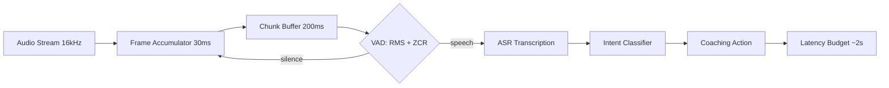

# Real-Time Audio Processing

## Learning Objectives

1. Implement a chunked audio processing pipeline that handles streaming input in fixed-duration frames
2. Detect voice activity using energy-based and zero-crossing-rate heuristics on raw audio samples
3. Measure end-to-end latency and identify which pipeline stages consume the most budget

## The Problem

You are building a real-time coaching tool for sales reps on live discovery calls. Your system needs to transcribe speech, detect buyer intent signals, and surface a relevant battle card — all before the conversation moves past the current topic. If the pipeline takes twelve seconds to process each utterance, the coaching prompt arrives after the rep has already moved on. The rep stops trusting the tool.

The core challenge is architectural: audio arrives as a continuous stream, but every downstream process (transcription, classification, action rendering) operates on discrete chunks. You must decide how big each chunk is, when to flag it as speech versus silence, and how to keep total latency within your budget — typically one to three seconds for real-time coaching. Get any of these wrong and you either waste compute processing silence or cut words at chunk boundaries and lose meaning.

## The Concept

Real-time audio processing consumes a continuous signal as a sequence of discrete chunks, pushes each chunk through a pipeline (VAD → ASR → inference → action), and produces output within a bounded latency window.

**Sample rate and frames.** Audio is digitized at a fixed sample rate — 16,000 Hz is standard for speech. Each sample is a single amplitude value. A *frame* is the smallest processing unit: a short window of samples, typically 20–30 milliseconds. Multiple frames accumulate into a *chunk*.

**Chunking strategy.** You do not process one frame at a time (too much overhead per call) and you do not wait for the full recording (that is batch processing, not real-time). You accumulate frames into chunks of 100–500 ms, process each chunk, and slide forward. Chunk size is your primary latency lever: smaller chunks reduce wait time but increase per-call overhead and risk cutting words at boundaries.

**Voice Activity Detection (VAD).** Before sending audio to an expensive model, you check whether it contains speech. The simplest VAD computes signal energy (root mean square of the samples) and compares it to a threshold. A complementary signal — zero-crossing rate — helps distinguish voiced speech (low ZCR) from unvoiced fricatives and noise (high ZCR). The goal: skip silent and noisy chunks so inference compute is spent only on speech.

**Latency budget.** Total latency equals chunk accumulation time plus VAD time plus model inference time plus network round-trip plus action rendering. If your budget is two seconds and ASR takes 1.5 seconds per chunk, you have 500 ms for everything else.



## Build It

This simulation generates a synthetic audio stream (alternating speech-like bursts and silence), processes it in 200 ms chunks, runs energy-based VAD, and measures end-to-end latency per chunk.

```python
import numpy as np
import time

SAMPLE_RATE = 16000
FRAME_MS = 30
CHUNK_MS = 200
FRAME_SIZE = int(SAMPLE_RATE * FRAME_MS / 1000)
CHUNK_SIZE = FRAME_SIZE * (CHUNK_MS // FRAME_MS)
VAD_ENERGY_THRESHOLD = 0.02
VAD_ZCR_MAX = 0.35

def generate_audio_chunk(chunk_idx, size):
    if chunk_idx % 4 == 0:
        t = np.linspace(0, CHUNK_MS / 1000, size)
        signal = 0.3 * np.sin(2 * np.pi * 200 * t)
        signal += 0.1 * np.sin(2 * np.pi * 440 * t)
        return signal
    return np.random.normal(0, 0.005, size)

def compute_rms(samples):
    return np.sqrt(np.mean(samples ** 2))

def compute_zcr(samples):
    signs = np.sign(samples)
    crossings = np.sum(signs[1:] != signs[:-1])
    return crossings / len(samples)

def vad(samples):
    rms = compute_rms(samples)
    zcr = compute_zcr(samples)
    is_speech = rms > VAD_ENERGY_THRESHOLD and zcr < VAD_ZCR_MAX
    return is_speech, rms, zcr

def fake_asr(samples):
    time.sleep(0.15)
    if np.mean(np.abs(samples)) > 0.05:
        return "i think this could work for our team"
    return ""

NUM_CHUNKS = 12
latencies = []

print(f"Sample Rate: {SAMPLE_RATE} Hz | Chunk: {CHUNK_MS}ms ({CHUNK_SIZE} samples)")
print("-" * 65)

for i in range(NUM_CHUNKS):
    t_start = time.time()
    chunk = generate_audio_chunk(i, CHUNK_SIZE)

    t0 = time.time()
    is_speech, rms, zcr = vad(chunk)
    t_vad = time.time() - t0

    if is_speech:
        t0 = time.time()
        transcript = fake_asr(chunk)
        t_asr = time.time() - t0
    else:
        transcript, t_asr = "", 0.0

    t_total = time.time() - t_start
    latencies.append(t_total)

    label = "SPEECH" if is_speech else "silence"
    print(f"Chunk {i:2d} | {label:7s} | RMS={rms:.4f} ZCR={zcr:.3f} | "
          f"VAD={t_vad*1000:.1f}ms ASR={t_asr*1000:.1f}ms Total={t_total*1000:.1f}ms")
    if transcript:
        print(f"         → \"{transcript}\"")

print("-" * 65)
print(f"Avg latency: {np.mean(latencies)*1000:.1f}ms")
print(f"Max latency: {np.max(latencies)*1000:.1f}ms")
print(f"Budget remaining (of 2000ms): {2000 - np.max(latencies)*1000:.1f}ms")
```

Run this. VAD rejects silence chunks in under one millisecond. Speech chunks trigger the simulated ASR and take approximately 150 ms. The budget tracker at the end shows your margin.

## Use It

Streaming ASR with VAD gating is the mechanism behind real-time conversation intelligence — Cluster 3.1, Conversation Intelligence & Call Coaching `[CITATION NEEDED — concept: exact cluster ID for real-time call coaching in topic map]`. This slice simulates the live call loop: detect speech → transcribe → classify intent → emit a coaching action.

```python
INTENT_MAP = {
    "pricing": (["price", "cost", "budget", "expensive"], "Surface ROI calculator"),
    "competitor": (["gong", "apollo", "outreach"], "Surface battle card"),
    "technical": (["api", "integration", "webhook", "sso"], "Surface integration docs"),
}

def classify(text):
    t = text.lower()
    for intent, (keywords, action) in INTENT_MAP.items():
        if any(k in t for k in keywords):
            return intent, action
    return None, "Log only"

call = [
    ("what does pricing look like for fifty seats", True),
    ("", False),
    ("do you have a rest api for our team", True),
    ("we looked at gong but it felt expensive", True),
]

for i, (text, speech) in enumerate(call):
    if not speech:
        print(f"[{i}] silence — skipped")
        continue
    intent, action = classify(text)
    print(f"[{i}] \"{text}\"")
    print(f"     intent={intent or 'none'} → {action}")
```

On a real call, the `text` variable arrives from a streaming ASR endpoint (Deepgram, AssemblyAI, or a Whisper-based server). The VAD stage upstream ensures you only spend transcription budget on speech — typically 40–60% of call audio `[CITATION NEEDED — concept: speech-to-total-time ratio on B2B sales calls]`. The intent classifier routes each transcript segment to the relevant coaching artifact within your latency budget.

## Exercises

**Exercise 1 (Easy).** Lower `VAD_ENERGY_THRESHOLD` to 0.005 and rerun the Build It script. Then raise it to 0.08. Count how many chunks are classified as speech in each run. Write one sentence describing the false-positive versus false-negative trade-off as the threshold increases.

**Exercise 2 (Hard).** Modify the chunk loop to use 50% overlap — each new chunk starts at the midpoint of the previous one. This prevents word-boundary cuts but doubles processing. Add a deduplication step: if two consecutive overlapping chunks both contain speech and produce identical transcripts, emit only one. Rerun and compare average latency against the non-overlapping baseline. How much overhead does overlap add, and is it within your 2-second budget?

## Key Terms

- **Sample Rate**: Samples per second (Hz). Speech audio is typically 16 kHz; CD-quality music is 44.1 kHz.
- **Frame**: The smallest processing unit — a short window of samples (e.g., 30 ms). Frames accumulate into chunks.
- **Chunk**: A fixed-duration block of audio (e.g., 200 ms) processed as a single unit. Chunk size sets the minimum achievable latency.
- **VAD (Voice Activity Detection)**: A binary gate that determines whether an audio segment contains speech. Energy-based VAD uses RMS and zero-crossing rate; neural VAD uses a trained model.
- **RMS (Root Mean Square)**: A measure of signal energy. Higher RMS means louder audio. Primary feature in simple VAD.
- **Zero-Crossing Rate (ZCR)**: Rate at which the signal changes sign. Voiced speech has low ZCR; unvoiced consonants and noise have high ZCR.
- **Latency Budget**: Total time from audio arrival to action output. Every pipeline stage consumes part of this budget. For real-time coaching, the budget is 1–3 seconds.

## Sources

- Sample rates, framing, and energy-based VAD: standard digital signal processing techniques as described in Rabiner & Schafer, *Theory and Applications of Digital Speech Processing* (Pearson, 2010).
- Zero-crossing rate as a VAD feature: standard feature in speech processing literature; see also Bachu et al., "Separation of Voiced and Unvoiced using Zero Crossing Rate and Energy of the Speech Signal" (IEEE, 2008).
- Real-time streaming ASR architecture (Deepgram, AssemblyAI): `[CITATION NEEDED — concept: how streaming ASR providers implement server-side chunking and VAD]`
- Conversation intelligence latency expectations for sales coaching: `[CITATION NEEDED — concept: acceptable latency thresholds in real-time sales enablement tools]`
- Speech-to-total-time ratio on B2B calls: `[CITATION NEEDED — concept: empirical measurement of talk-time percentage on discovery calls]`